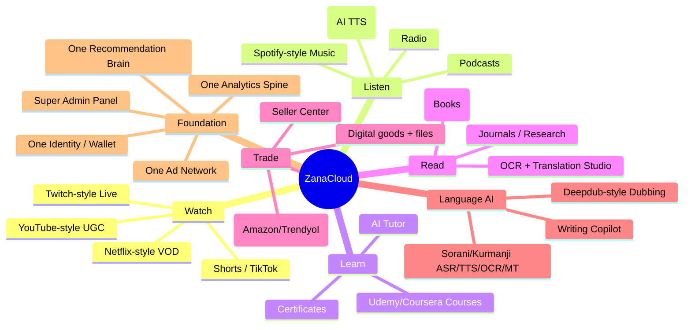
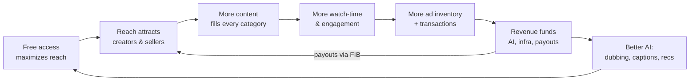
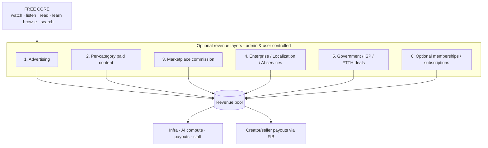

# 01 — Product Vision

> **Scope:** Why **ZanaCloud** exists, who it serves, and how a platform that is *free for end users* sustains itself at national scale. This document defines the platform mission, the user personas and their needs→features mappings, the **free-first economics model**, the revenue architecture (optional per-category monetization, advertising, marketplace commission, enterprise/localization/AI services, government/ISP/FTTH deals), optional subscription/membership tiers, and the unified-ecosystem vision. Monetization *mechanics* (FIB flows, ledgers, payouts) are deferred to [Monetization](./23-monetization.md); analytics to [Analytics](./21-analytics.md); ads to [Advertising](./22-advertising.md).
>
> **Foundation:** ZanaCloud is grown from the existing [MediaCMS](../../README.md) Django + React media CMS via the strangler-fig strategy described in [System Architecture](./02-system-architecture.md).
>
> **Sibling docs:** [System Architecture](./02-system-architecture.md) · [Analytics](./21-analytics.md) · [Advertising](./22-advertising.md) · [Monetization](./23-monetization.md) · [Platform Constraints & Super Admin Panel](./33-platform-constraints.md) · [Roadmap](./31-roadmap.md)

---

## 1. Mission

> **Build the digital nervous system of Kurdistan and Iraq: one free, AI-native platform where every Kurd and Iraqi can learn, create, watch, listen, read, trade, and preserve their language and knowledge — without a paywall standing between a citizen and their culture.**

ZanaCloud (Kurdish *zana* — "the knowledgeable one") is simultaneously:

- a **media platform** (YouTube + Netflix + Twitch + Spotify),
- a **knowledge platform** (Udemy + Coursera + Google Books + Internet Archive + ResearchGate),
- a **commerce platform** (Amazon + Trendyol),
- an **AI language platform** (Deepdub-class dubbing + Sorani/Kurmanji ASR/TTS/OCR/MT),

…unified on one identity system, one recommendation brain, one payment rail (FIB), one analytics spine, and one no-code Super Admin Panel.

### 1.1 The three strategic pillars

| Pillar | Statement | Why it is non-negotiable |
|---|---|---|
| **Free-first** | The core experience — watching, reading, learning, browsing — never requires payment. Monetization is *optional*, *per-category*, and *admin-controlled*. | A national platform cannot exclude citizens by income. Reach is the asset; reach funds everything else. |
| **Kurdish national knowledge** | Sorani + Kurmanji are first-class: UI, search, ASR/TTS/OCR/MT, dubbing, and a national digital archive of books, journals, audio, and film. | No global platform will ever invest in Kurdish at this depth. This is the defensible moat and the civic mission. |
| **Sovereign & offline-capable** | Runs on public internet *and* inside ISP/FTTH intranets with no public internet. Data, payments (FIB), and AI can be on-prem. | National infrastructure must keep working under sanctions, outages, throttling, or air-gapped government deployments. |

### 1.2 What "free-first" means precisely

"Free" is a product guarantee, not a pricing tier:

1. **No mandatory subscription** to use the platform, watch ad-supported content, browse the library, or search.
2. **No premium-gated core navigation.** Discovery, recommendations, and the dynamic category homepages are free.
3. **Monetization is opt-in at three independent levels** — (a) the *admin* enables a monetization mode per category; (b) the *creator/seller* chooses to monetize their item; (c) the *user* chooses to pay, tip, subscribe, or buy.
4. **A free user can always reach a free alternative.** If a course is paid, free courses exist in the same category surface; if a film is rented, ad-supported films exist.

This is enforced architecturally: billing is an isolated bounded context behind a per-category feature flag, and the read/discovery path has **zero hard dependency** on billing (see [System Architecture §2](./02-system-architecture.md) and [Platform Constraints](./33-platform-constraints.md)).

---

## 2. The unified-ecosystem vision

ZanaCloud collapses what are normally 10+ separate companies into one platform with shared infrastructure. The strategic logic: in a market of ~45M people (KRI ~6M + Iraq ~40M + diaspora), **no single vertical is large enough to sustain a world-class platform alone** — but the *union* of all verticals, sharing one account, one wallet, one recommendation engine, and one ad network, is.

### 2.1 Reference-product mapping

| ZanaCloud surface | Inspired by | What we add that they lack |
|---|---|---|
| Video / Shorts / Live | YouTube, TikTok, Twitch | Kurdish ASR captions + AI dubbing on every upload; admin-approval publishing; geo-fencing per video. |
| VOD / Film | Netflix | Free ad-supported tier always present; per-title FIB rental; intranet delivery. |
| Music / Podcast / Audiobook | Spotify, Radio Javan | AI audiobook generation from library books; Kurdish lyric search. |
| Courses | Udemy, Coursera | Free national-curriculum track; AI tutor in Sorani/Kurmanji; FIB micro-payments. |
| Library / Research | Google Books, Internet Archive, ResearchGate | OCR for Kurdish/Arabic scripts; translate-and-read; audiobook conversion. |
| Marketplace | Amazon, Trendyol | Unified wallet with creator economy; digital goods + file hosting; FIB one-click. |
| Dubbing / Localization | Deepdub | Sold as a B2B service to broadcasters and government (revenue line, §5.4). |

### 2.2 The flywheel

Each loop turn lowers the marginal cost of the next piece of content (auto-captioning, auto-dubbing) and raises the value of the network to advertisers and the government.

---

## 3. User personas

Nine primary personas drive every product decision. Each is defined by goals, frustrations with existing tools, the ZanaCloud features that serve them, and their relationship to the free/paid boundary.

### 3.1 Persona summary

| # | Persona | Core goal | Pays? | Gets paid? | Primary surfaces |
|---|---|---|---|---|---|
| P1 | **Content Creator** (vlogger, musician, filmmaker) | Reach audience, earn income | No (free to publish) | Yes (ads, tips, memberships) | Creator Studio, Video, Live, Shorts |
| P2 | **Viewer / Listener / Reader** | Consume content in Kurdish, free | Optional | No | All consumption surfaces |
| P3 | **Business / Brand** (SME, channel-as-business) | Presence, customers, sell | Optional | Yes (marketplace) | Business pages, Marketplace, Ads |
| P4 | **Advertiser** (agency, brand, gov campaign) | Reach targeted audiences | Yes (ad spend) | No | Advertiser Self-Serve Portal |
| P5 | **Enterprise Customer** (broadcaster, ministry, ISP) | Localization, AI, white-label, intranet | Yes (contracts) | No | Enterprise console, APIs, on-prem |
| P6 | **Student / Learner** | Affordable/free education in Kurdish | Optional | No | Academy, AI Tutor, Library |
| P7 | **Seller / Merchant** | Sell goods/digital products | Commission only | Yes (sales) | Seller Center, Marketplace |
| P8 | **Scholar / Educator / Author** | Publish & preserve knowledge | No | Optional (paid books/courses) | Library, Academy, Translation Studio |
| P9 | **Platform Admin / Operator** | Curate, moderate, configure, promote | N/A | N/A | Super Admin Panel |

### 3.2 P1 — Content Creator

| Aspect | Detail |
|---|---|
| **Who** | Independent Kurdish YouTubers, musicians, podcasters, filmmakers, streamers; today fragmented across YouTube/Instagram/Telegram with poor Kurdish support and no local payout rail. |
| **Goals** | Grow audience; get discovered in their language; earn predictable income in IQD; protect their content. |
| **Frustrations** | YouTube has no Kurdish monetization payout to Iraq; captions/dubbing don't support Sorani; algorithms ignore Kurdish content. |
| **Needs → Features** | Reach → recommendation engine tuned for Kurdish + admin promotion/pinning. Income → ads revenue share, tips/Super Thanks, channel memberships ([Monetization](./23-monetization.md)). Production → auto-captions, AI dubbing ([AI Dubbing](./15-ai-dubbing-studio.md)). Insight → [Creator Analytics](./21-analytics.md). Payout → FIB payouts in IQD. |
| **Free guarantee** | Publishing is free; monetization is opt-in and only available where the admin has enabled it for the category. |

### 3.3 P2 — Viewer / Listener / Reader

| Aspect | Detail |
|---|---|
| **Who** | The general public: phone-first, often on metered/ISP-FTTH connections, mixed literacy, Sorani/Kurmanji/Arabic. |
| **Goals** | Watch, listen, read, and learn in their language, for free, on any device, even offline/intranet. |
| **Frustrations** | Most quality content is in English/Turkish/Persian; paywalls; data costs; no offline mode. |
| **Needs → Features** | Free access → ad-supported tier, no mandatory subscription. Language → Kurdish UI, AI captions, dubbing, translate-to-read. Device fit → device-specific UX (mobile shorts, TV Netflix-style). Offline → intranet/FTTH mode + downloads. Discovery → per-category dynamic homepages. |
| **Free guarantee** | This persona never has to pay. Every consumption surface has a free path. |

### 3.4 P3 — Business / Brand

| Aspect | Detail |
|---|---|
| **Who** | Local SMEs, restaurants, clinics, media houses wanting a verified presence and a sales channel. |
| **Goals** | Build an audience, run promotions, sell products/services, advertise. |
| **Needs → Features** | Presence → verified business channels/pages. Sales → Marketplace storefront + FIB one-click. Reach → sponsored cards, ads ([Advertising](./22-advertising.md)). Insight → audience analytics. |
| **Money relationship** | Pays for ads (optional); earns from sales (commission to platform). |

### 3.5 P4 — Advertiser

| Aspect | Detail |
|---|---|
| **Who** | Brands, agencies, telcos, and government public-information campaigns. |
| **Goals** | Reach a precisely targeted Iraqi/Kurdish audience with measurable ROI. |
| **Needs → Features** | Targeting → contextual + behavioral + geo + category targeting. Control → budgets, pacing, frequency capping, brand safety. Self-service → Advertiser Self-Serve Portal. Trust → measurement & attribution, fraud filtering. Local reach → ads that work even in intranet/FTTH (offline ad serving). All in [Advertising](./22-advertising.md). |
| **Money relationship** | Primary cash-paying customer; funds the free tier. |

### 3.6 P5 — Enterprise Customer

| Aspect | Detail |
|---|---|
| **Who** | National/regional broadcasters, ministries, universities, ISPs/FTTH operators, telecoms. |
| **Goals** | Localize content (dubbing/subtitles), run white-label media portals, deploy on-prem/intranet, license AI. |
| **Needs → Features** | Localization → AI Dubbing/Subtitling as a service. Sovereignty → on-prem/air-gapped deploy ([System Architecture](./02-system-architecture.md)). White-label → tenant theming via Super Admin Panel. APIs → ASR/TTS/OCR/MT endpoints. Intranet CDN → FTTH delivery + offline analytics/ads. |
| **Money relationship** | High-value contracts; deals with ISPs/FTTH can include revenue-share or bundled-data arrangements (§5.5). |

### 3.7 P6 — Student / Learner

| Aspect | Detail |
|---|---|
| **Who** | School/university students and lifelong learners, often low-income. |
| **Goals** | Access affordable or free education in Kurdish; earn recognized certificates. |
| **Needs → Features** | Free track → national-curriculum free courses. Help → AI Tutor in Sorani/Kurmanji ([Academy](./19-learning-academy.md)). Credentials → certificates. Reading → Library + translate-to-read. Affordability → FIB micro-payments for premium courses (optional). |
| **Free guarantee** | A meaningful free learning path always exists per subject. |

### 3.8 P7 — Seller / Merchant

| Aspect | Detail |
|---|---|
| **Who** | Individuals and shops selling physical goods, digital products, files, or services. |
| **Goals** | Reach buyers, get paid in IQD reliably, manage orders. |
| **Needs → Features** | Listing → Seller Center ([Marketplace](./20-marketplace.md)). Payment → FIB one-click checkout + wallet. Trust → fraud detection, ratings. Reach → sponsored listings (optional ads). Payout → FIB settlement. |
| **Money relationship** | Free to list; platform takes a commission only on completed sales. |

### 3.9 P8 — Scholar / Educator / Author

| Aspect | Detail |
|---|---|
| **Who** | Academics, teachers, authors, publishers, cultural institutions preserving Kurdish knowledge. |
| **Goals** | Publish books/journals/courses; digitize and preserve heritage; reach learners. |
| **Needs → Features** | Publish → Library + Academy with admin approval. Digitize → Kurdish/Arabic OCR + Translation Studio ([Library](./16-digital-library-knowledge-hub.md)). Audio → AI audiobook generation. Income → optional paid books/courses with FIB. Preserve → national archive with durable storage. |
| **Free guarantee** | National-knowledge works can be published free; paid is optional and author-chosen. |

### 3.10 P9 — Platform Admin / Operator

| Aspect | Detail |
|---|---|
| **Who** | Editorial curators, moderators, category managers, and government/operator administrators. |
| **Goals** | Curate quality, enforce policy, configure monetization, promote national content — all no-code. |
| **Needs → Features** | Approve → admin-approval publishing workflow. Curate → pin/promote/force-feature content. Configure → per-category monetization & ad toggles. Control → geo-fencing, device targeting. Insight → admin analytics ([Analytics](./21-analytics.md)). All via the no-code [Super Admin Panel](./33-platform-constraints.md). |

---

## 4. Personas → needs → features master matrix

| Need | Creator | Viewer | Business | Advertiser | Enterprise | Student | Seller | Scholar | Feature(s) |
|---|:--:|:--:|:--:|:--:|:--:|:--:|:--:|:--:|---|
| Free access | ✓ | ✓ | ✓ |  |  | ✓ |  | ✓ | Ad-supported tier; no mandatory sub |
| Kurdish language AI | ✓ | ✓ | ✓ |  | ✓ | ✓ |  | ✓ | ASR/TTS/OCR/MT, dubbing, captions |
| Discovery / reach | ✓ |  | ✓ | ✓ |  |  | ✓ | ✓ | Recommendation engine + admin promotion |
| Earn income | ✓ |  | ✓ |  |  |  | ✓ | ✓ | Ads share, tips, memberships, sales |
| Targeted reach |  |  | ✓ | ✓ |  |  | ✓ |  | Ad targeting, sponsored cards |
| Insight / analytics | ✓ |  | ✓ | ✓ | ✓ |  | ✓ | ✓ | Creator / advertiser / admin analytics |
| Sell goods |  |  | ✓ |  |  |  | ✓ | ✓ | Marketplace + Seller Center |
| Education | | ✓ |  |  | ✓ | ✓ |  | ✓ | Academy, AI Tutor, certificates |
| Offline / intranet | ✓ | ✓ | ✓ | ✓ | ✓ | ✓ | ✓ |  | FTTH mode, offline ads/analytics |
| Sovereign deploy |  |  |  |  | ✓ |  |  |  | On-prem / air-gapped profile |
| Local payment | ✓ | ✓ | ✓ | ✓ | ✓ | ✓ | ✓ | ✓ | FIB wallet, one-click, payouts |
| Preserve heritage |  |  |  |  | ✓ |  |  | ✓ | National archive, OCR, audiobooks |

---

## 5. Free-first economics — how the platform sustains itself

The platform is free for end users; it is **not** free to run. Sustainability comes from a **diversified, optional, per-category revenue portfolio** layered on top of a free base. No single line is load-bearing, which protects the free guarantee.

### 5.1 Revenue line 1 — Advertising (primary funder of the free tier)

Ads make the free experience economically viable. Detail in [Advertising](./22-advertising.md); product framing here:

| Lever | Description | Admin control |
|---|---|---|
| Video ads | Pre/mid/post-roll on long-form; Shorts ads | Enabled **per category** by admin |
| Display / sponsored cards | Home, search, category surfaces | Per surface + per category |
| Marketplace sponsored listings | Promoted products | Per category |
| Offline/intranet ads | Pre-cached ad packages served in FTTH mode | Per operator/tenant |

**Free-model integration:** an admin can run a category entirely ad-free (e.g., Kids, Islamic, National Curriculum) or ad-supported. Revenue from ads is shared with creators where the admin enables monetization for that category.

### 5.2 Revenue line 2 — Optional per-category paid content

Each category can *optionally* sell content; the user always has a free alternative in the same category.

| Category | Paid mode (optional) | Free alternative (always present) |
|---|---|---|
| Film / VOD | Per-title rental / purchase via FIB | Ad-supported titles |
| Academy | Premium courses, certificates | Free national-curriculum courses |
| Library | Paid books / journals | Public-domain & sponsored free books |
| Music | Premium/lossless, exclusive drops | Ad-supported streaming |
| Live | Ticketed events, pay-per-view | Free streams |

All paid flows route through FIB ([Monetization](./23-monetization.md)). Admins toggle paid mode per category in the Super Admin Panel.

### 5.3 Revenue line 3 — Marketplace commission

The platform takes a **commission on completed marketplace sales** (physical goods, digital products, files, services). Listing is free; the platform earns only when the seller earns. Commission rate is configurable per category by admins. Settlement and payouts via FIB.

### 5.4 Revenue line 4 — Enterprise / Localization / AI services (B2B)

The Kurdish-first AI is itself a product, sold to organizations:

| Service | Buyer | Pricing model |
|---|---|---|
| AI Dubbing / Subtitling | Broadcasters, studios | Per-minute / project |
| ASR / TTS / OCR / MT APIs | Apps, ministries, banks | Usage-based (per call/char) |
| White-label media portal | Universities, ministries | License + support |
| On-prem / air-gapped deployment | Government, defense | License + integration |
| Content localization projects | Streaming services | Per-project |

This monetizes the most expensive asset (AI/GPU R&D) without touching the consumer free tier.

### 5.5 Revenue line 5 — Government / ISP / FTTH deals

National infrastructure positioning unlocks institutional revenue:

| Deal type | Counterparty | Structure |
|---|---|---|
| FTTH content bundle | ISPs / FTTH operators | Revenue-share or fixed fee; ZanaCloud delivered inside the ISP intranet, zero-rated for users |
| National e-learning / e-library | Ministry of Education / Culture | Multi-year contract |
| Public-information ad inventory | Government | Campaign spend (ads line) |
| Digital archive / preservation | Cultural institutions | Grant / contract |

The intranet/FTTH mode is the technical enabler: analytics and ads work fully **offline/on-prem** so an ISP deployment is a complete, measurable product (see [Analytics — offline mode](./21-analytics.md) and [Advertising — offline serving](./22-advertising.md)).

### 5.6 Revenue line 6 — Optional memberships / subscriptions

Subscriptions exist but are **never mandatory** and **never gate the core**:

| Tier | Price posture | What it adds (additive, not restrictive) |
|---|---|---|
| **Free** (default) | 0 IQD | Full core: watch, listen, read, learn, browse, search (ad-supported) |
| **Supporter / Channel membership** | Creator-set | Supports a specific creator; perks (badges, member-only posts) — see [Monetization](./23-monetization.md) |
| **Category pass** (optional) | Admin-set | Ad-free + premium within one category (e.g., Film pass) |
| **Enterprise/Org seats** | Contract | Admin tools, white-label, API quotas |

Crucially, there is **no platform-wide "ZanaCloud Premium" that is required for normal use.** Removing ads or accessing premium items is always optional and scoped.

### 5.7 Creator monetization overview

Creators earn through (detail in [Monetization](./23-monetization.md)):

- **Ad revenue share** on monetizable categories.
- **Tips / Super Thanks / Super Chat** during videos and live streams.
- **Channel memberships** (recurring support).
- **Sponsorships & affiliate** links.
- **Paid content** (courses, books, ticketed live, marketplace items).

All payouts settle to creators in **IQD via FIB**, with a double-entry ledger and reconciliation for auditability ([Monetization §Ledger](./23-monetization.md)).

### 5.8 Illustrative revenue mix at scale (directional)

Directional target mix once the platform reaches national scale (not a forecast; sizing intent for architecture):

| Revenue line | Share of revenue (target) | Volatility | Funds |
|---|---:|---|---|
| Advertising | 35–45% | Medium | Free tier, infra |
| Per-category paid content | 10–15% | Low | Creator payouts, content |
| Marketplace commission | 15–20% | Medium | Ops, payments |
| Enterprise / AI services | 15–20% | Low | AI R&D, GPU |
| Government / ISP / FTTH | 10–15% | Low | National infra |
| Optional memberships/subs | 5–10% | Low | Creator economy |

Design implication: because no line exceeds ~45%, the free guarantee is resilient to any single market shock.

---

## 6. Success metrics (North-Star & guardrails)

| Type | Metric | Why |
|---|---|---|
| North Star | **Kurdish-language watch+read+learn minutes / week** | Captures the civic mission, not just revenue |
| Reach | MAU / DAU, % population reached | Free-first thesis |
| Creator health | Active monetizing creators; median IQD payout | Flywheel turning |
| Knowledge | Books/journals digitized; courses completed; certificates issued | National-knowledge mission |
| Sustainability | Revenue diversity index (no line >50%) | Protects free guarantee |
| Sovereignty | % traffic served via intranet/FTTH; on-prem deployments live | Infra positioning |
| Quality | Approval SLA; moderation accuracy; AI caption/dub quality | Trust |

Instrumentation for all of these is specified in [Analytics](./21-analytics.md).

---

## 7. Non-goals / explicit guardrails

1. **No mandatory paywall** on core consumption — ever.
2. **No dark-pattern subscriptions.** Cancellation is one click; no platform-wide required premium.
3. **No selling user PII** to advertisers — targeting is contextual/aggregated/consented ([Advertising](./22-advertising.md), [Analytics privacy](./21-analytics.md)).
4. **No hard dependency on public internet** for core function ([System Architecture](./02-system-architecture.md)).
5. **No category monetized without an admin enabling it**, and never without a free alternative in that category.

---

## 8. Cross-references

| Topic | Document |
|---|---|
| How the system is built | [02 — System Architecture](./02-system-architecture.md) |
| Measuring everything | [21 — Analytics](./21-analytics.md) |
| Funding the free tier | [22 — Advertising](./22-advertising.md) |
| Paying creators / FIB | [23 — Monetization](./23-monetization.md) |
| Admin no-code control, FIB, geo, intranet | [33 — Platform Constraints & Super Admin Panel](./33-platform-constraints.md) |
| Phasing | [31 — Roadmap](./31-roadmap.md) |
