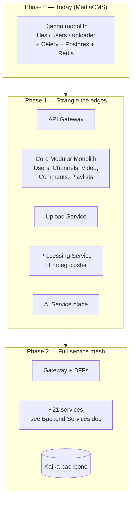
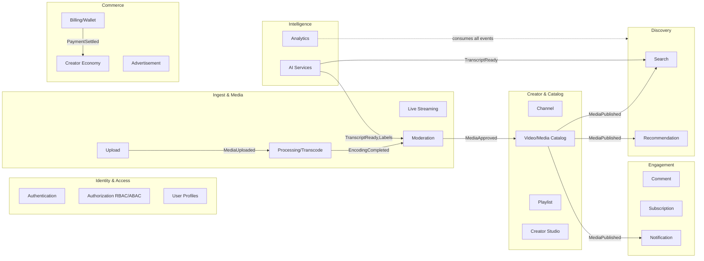
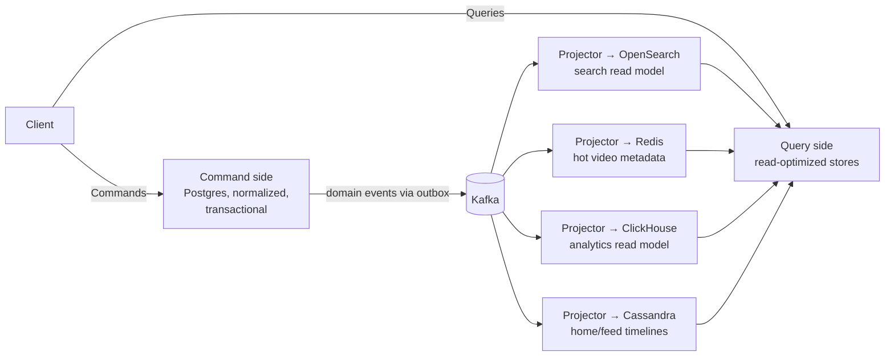
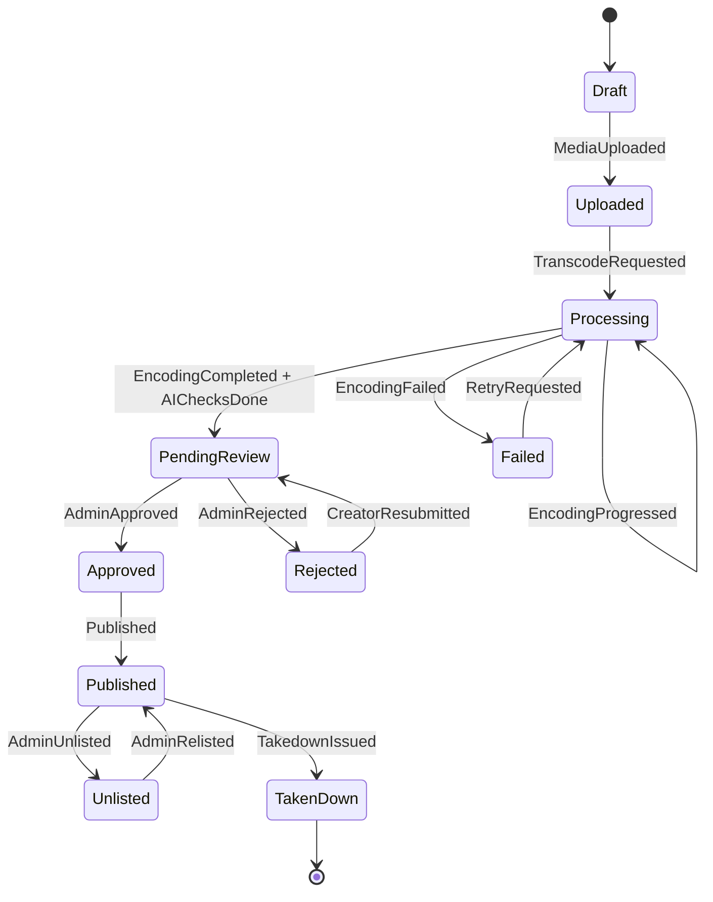
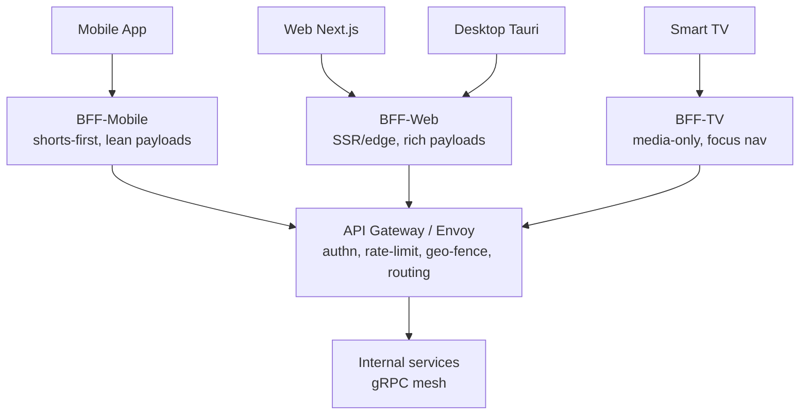
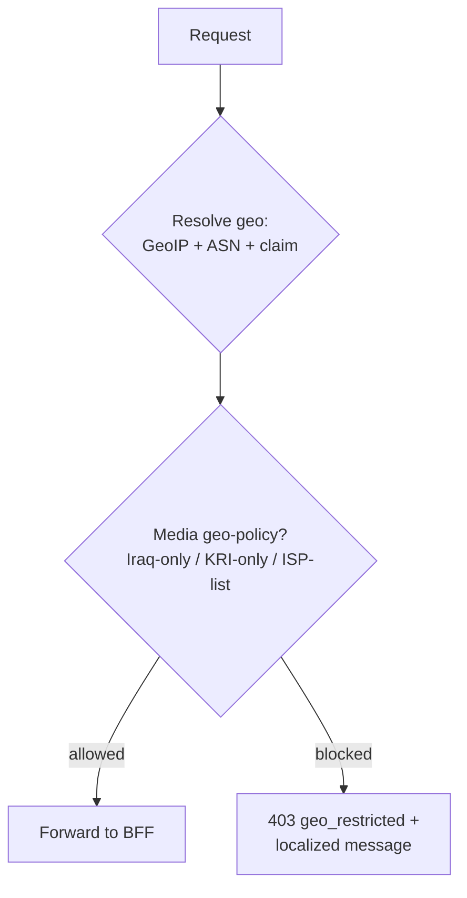
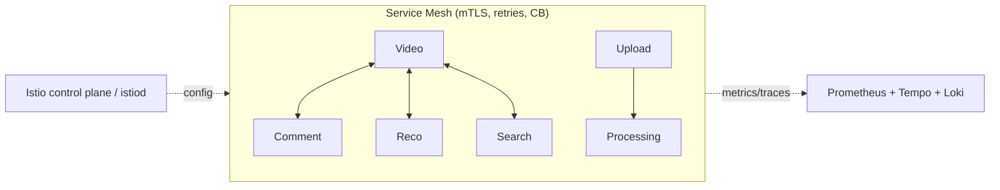
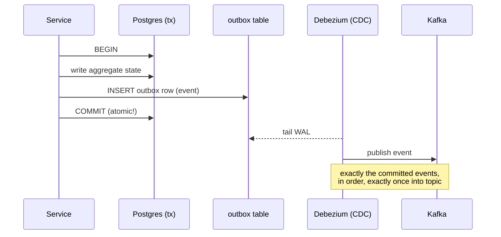
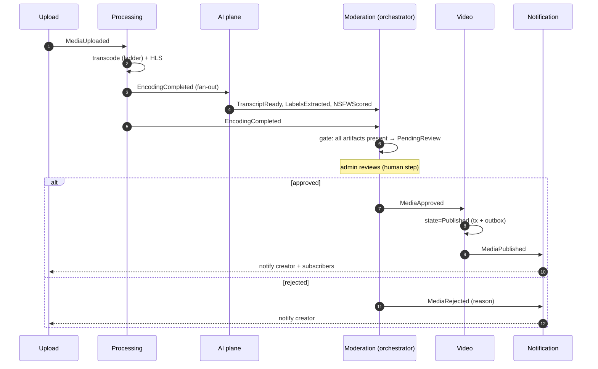
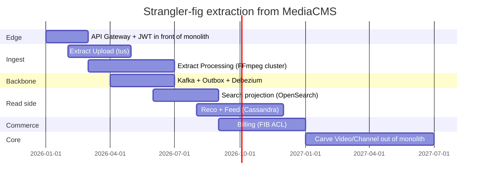

# 02 — System Architecture

> **Scope:** The macro-architecture of **ZanaCloud** — how the system is decomposed into services and bounded contexts, how those services communicate (sync + async), the event backbone (Kafka), domain-driven design, CQRS, event sourcing, the API gateway + per-device BFFs, the service mesh, and the distributed-systems guarantees (consistency, idempotency, sagas, the outbox pattern).
>
> **Foundation:** ZanaCloud is *not* a greenfield rewrite. It is grown from the existing [MediaCMS](../../README.md) Django 4.2 + DRF + Celery monolith using a **strangler-fig** strategy. Today's `files/`, `users/`, `uploader/` Django apps become the first bounded contexts to be carved out.
>
> **Sibling docs:** [Frontend](./03-frontend-architecture.md) · [Backend Services](./04-backend-services.md) · [Database](./05-database-architecture.md) · [Upload Pipeline](./06-upload-pipeline.md)

---

## 1. Architectural goals & forces

ZanaCloud must satisfy a set of forces that are individually common but jointly extreme:

| Force | Architectural consequence |
|---|---|
| **National scale** (5–8M MAU target, KRI + Iraq diaspora) | Horizontal scale on stateless services; data partitioned by tenant/region. |
| **Free for users, optional per-category monetization** | Billing is an *isolated* bounded context behind a feature flag per category; the core read path must never depend on it. |
| **Admin-gated publishing** | A first-class **moderation state machine** (`Upload → PendingReview → Approved → Published`) modeled as event-sourced workflow, not a boolean. |
| **Intranet / FTTH "no public internet" mode** | Zero hard dependencies on public SaaS in the request path. Every external integration (FIB, public CDN, cloud LLM) must be *swappable* behind a port/adapter and degrade gracefully. Air-gapped deploy profile is a build target. |
| **Per-category experiences** | Composition/BFF layer assembles category-specific layouts; no monolithic homepage service. |
| **Device divergence** (Mobile/Web/TV/Desktop) | **Backend-for-Frontend (BFF)** per device class. |
| **Kurdish-first AI** | AI is a bounded context with its own GPU compute plane, async by default, never blocking core writes. |
| **Heavy media throughput** | Upload/Processing/Streaming are isolated, independently scalable, queue-driven (inherits MediaCMS Celery `short_tasks`/`long_tasks` model, evolved to Kafka + KEDA). |

**Architecture principles (non-negotiable):**

1. **Async-first.** Anything that can be eventual *is* eventual. Synchronous calls are a liability budget.
2. **Ports & adapters (hexagonal).** Domain logic never imports an SDK. FIB, S3, LLM providers, CDN — all are adapters. This is what makes Intranet mode possible.
3. **Own your data.** Each service owns its schema; no cross-service table joins. Integration is via API or events only.
4. **Idempotent everywhere.** Every consumer and every write endpoint tolerates duplicate delivery.
5. **Strangler, not rewrite.** Each extraction must ship behind a routing toggle with a rollback path to the monolith.

---

## 2. Monolith vs microservices — the decision

### 2.1 The honest trade-off

A pure microservices fleet from day one is the wrong call: it imposes distributed-systems tax (network failure modes, eventual consistency, observability cost, deployment complexity) before product-market fit and before the team is large enough to own dozens of services. A pure monolith cannot satisfy the independent-scaling needs of media processing, AI GPU workloads, and a high-RPS read path simultaneously.

**Decision: a *modular monolith core* + a set of *extracted high-divergence services*, evolved via strangler-fig.** Concretely:



**Heuristic for "extract vs keep in core":** a capability becomes its own service when it has (a) a *different scaling curve* (Processing scales with minutes-of-video; Auth with login RPS), (b) a *different failure domain* you want isolated (Billing must not take down playback), (c) a *different runtime* (AI = GPU/Python/Triton; core = Django/Python; gateway = Envoy), or (d) a *different team*. Otherwise it stays a module in the core monolith with a clean internal boundary, ready for later extraction.

### 2.2 What stays in the core modular monolith

Users, Channels, Video metadata, Comments, Playlists, Subscriptions — these are tightly coupled, share read patterns, and benefit from local transactions. They remain a single deployable (the evolved MediaCMS Django app) with **enforced module boundaries** (import-linter / architectural fitness tests in CI) so extraction later is mechanical.

### 2.3 What is extracted immediately (Phase 1)

| Extracted service | Why it can't stay in the monolith |
|---|---|
| **Upload** (tus protocol) | Long-lived connections, resumable state, different scaling. See [Upload Pipeline](./06-upload-pipeline.md). |
| **Processing** (FFmpeg) | CPU/GPU-bound, bursty, evolves MediaCMS's `encode_media`/`create_hls` Celery tasks into an autoscaled cluster. |
| **AI plane** | GPU runtime, Python/Triton, must never block writes. |
| **Search** (OpenSearch) | Separate datastore + indexing pipeline. |
| **Billing** | Isolated failure domain; FIB adapter; PCI-ish scope minimization. |
| **Live** | RTMP/WebRTC/SRT ingest, totally different protocol surface. |

---

## 3. Domain-Driven Design — bounded contexts

### 3.1 Context map



**Relationship types (DDD patterns):**

- **Upload → Processing → Moderation → Video:** *Customer/Supplier* via events (the publishing pipeline). Upstream defines the contract.
- **Identity → everything:** *Conformist* — all contexts conform to the canonical `subject` (user id) and tenant claims minted by Auth.
- **AI → Moderation/Search:** *Open Host Service* — AI publishes a stable event schema (`TranscriptReady`, `LabelsExtracted`, `NSFWScore`) that many consume.
- **Billing:** *Separate Ways with Anti-Corruption Layer* — the FIB integration sits behind an ACL so a FIB API change never leaks into the domain. Critical for Intranet mode where FIB may be unreachable.

### 3.2 Ubiquitous language (selected)

| Term | Meaning (precise) | MediaCMS lineage |
|---|---|---|
| **Media** | A unit of publishable content (video/audio/image/document). | `files.Media` (keep `friendly_token`, `uid`). |
| **Asset** | A rendition/encoding of a Media (an HLS variant, a 1080p MP4). | `files.Encoding` + `EncodeProfile`. |
| **PublicationState** | Workflow state: `draft→uploaded→processing→pending_review→approved→published→(unlisted/rejected/taken_down)`. | Evolves `Media.state` + `is_reviewed` + `encoding_status` into one explicit state machine. |
| **Channel** | A creator's branded space. | `users.Channel`. |
| **Tenant/Region** | Geo + ISP partition used for geo-fencing & data residency. | new. |

---

## 4. Event-driven architecture (Kafka backbone)

### 4.1 Why Kafka (justification)

We standardize the async backbone on **Apache Kafka** (specifically **Redpanda**-compatible API as the default deploy for Intranet mode — single binary, no ZooKeeper/JVM, lower ops burden inside FTTH PoPs; managed Kafka where a cloud region exists). Justification vs alternatives:

- **vs RabbitMQ/Celery broker (today's MediaCMS):** Kafka gives *durable, replayable* logs (event sourcing, rebuilding read models, late-joining consumers like a new recommendation model). Celery/Redis is fire-and-forget and not replayable. We keep Celery for *intra-service task fan-out* but Kafka is the *inter-service* backbone.
- **vs NATS/Pulsar:** Kafka's ecosystem (Kafka Connect, Schema Registry, ksqlDB, Debezium for CDC/outbox) is unmatched; Redpanda removes the JVM/ZK pain that historically pushed teams to NATS.
- **Schema governance:** **Confluent/Apicurio Schema Registry** with **Protobuf** (see §6.2) + **FULL_TRANSITIVE** compatibility enforced in CI.

### 4.2 Topic taxonomy & conventions

Naming: `zc.<context>.<aggregate>.<event>.v<major>`. Keys = aggregate id (preserves per-aggregate ordering). Partitions sized to peak throughput; retention per topic class.

| Topic class | Retention | Cleanup | Example |
|---|---|---|---|
| **Domain events** (facts) | 30 d | delete | `zc.video.media.published.v1` |
| **Entity state (compacted)** | infinite | compact | `zc.video.media.state.v1` (latest state per media) |
| **Commands** | 7 d | delete | `zc.processing.transcode.requested.v1` |
| **CDC / outbox** | 7 d | delete | `zc.cdc.users.user.v1` (Debezium) |
| **Analytics firehose** | 3 d | delete | `zc.analytics.playback.heartbeat.v1` (→ ClickHouse) |
| **DLQ** | 14 d | delete | `zc.video.media.published.v1.dlq` |

### 4.3 Event catalog (core)

| Event | Producer | Key consumers | Trigger |
|---|---|---|---|
| `zc.upload.media.uploaded.v1` | Upload | Processing, Moderation(pre-scan), Analytics | tus upload finalized |
| `zc.processing.encoding.started.v1` | Processing | Studio, Analytics | first profile starts |
| `zc.processing.encoding.completed.v1` | Processing | Moderation, Video, Notification | all profiles + HLS done |
| `zc.processing.encoding.failed.v1` | Processing | Studio, Notification, DLQ | encode error |
| `zc.ai.transcript.ready.v1` | AI (ASR) | Search, Moderation, Subtitles, Studio | Sorani/Kurmanji ASR done |
| `zc.ai.labels.extracted.v1` | AI (vision) | Moderation, Reco, Search | scene/object labels |
| `zc.ai.nsfw.scored.v1` | AI | Moderation | safety classifier |
| `zc.moderation.media.approved.v1` | Moderation | Video, Notification | admin approves |
| `zc.moderation.media.rejected.v1` | Moderation | Video, Notification, Studio | admin rejects |
| `zc.video.media.published.v1` | Video | Search, Reco, Notification, Analytics, ADS | publish (after approval) |
| `zc.video.media.takendown.v1` | Video | Search, Reco, CDN-purge | DMCA/legal/geo |
| `zc.engage.comment.created.v1` | Comment | Notification, AI(moderation), Analytics | new comment |
| `zc.engage.subscription.created.v1` | Subscription | Notification, Reco, Analytics | user subscribes |
| `zc.billing.payment.settled.v1` | Billing | Creator Economy, Analytics, Notification | FIB settles |
| `zc.billing.payment.refunded.v1` | Billing | Creator Economy, Analytics | refund |
| `zc.identity.user.registered.v1` | User | Notification, Reco, Analytics | signup |

**Event envelope (every event):**

```json
{
  "event_id": "uuid (idempotency key)",
  "event_type": "zc.video.media.published.v1",
  "occurred_at": "RFC3339",
  "producer": "video-service@1.14.2",
  "trace_id": "W3C traceparent",
  "tenant": "iq-krd",
  "partition_key": "media:fT3k9...",
  "schema_version": 1,
  "causation_id": "uuid of command/event that caused this",
  "correlation_id": "uuid spanning the saga",
  "data": { /* protobuf-defined payload */ }
}
```

---

## 5. CQRS & Event Sourcing

### 5.1 Where we apply CQRS (and where we don't)

CQRS is applied **selectively** — it is not a global mandate (that would be cargo-culting).



- **Write side:** Postgres, normalized, ACID. The source of truth for catalog, users, billing.
- **Read side(s):** purpose-built denormalized projections — OpenSearch (search), Redis (hot metadata for playback page), Cassandra (per-user feed timelines), ClickHouse (analytics). Each is an independent, rebuildable projection of the Kafka log.

**Applied to:** Video catalog, Search, Feeds/Timelines, Analytics, Creator Studio dashboards.
**NOT applied to:** simple CRUD contexts (e.g. notification preferences) — plain Postgres read/write, no ceremony.

### 5.2 Event sourcing — scoped to two aggregates

Full event sourcing is reserved for aggregates where the *audit trail and replay* are core requirements, not bolted on:

1. **PublicationWorkflow** (the admin-approval state machine). Every transition is an event — this gives a perfect audit log of who approved/rejected/took-down what and when (legal/compliance requirement for a national platform).
2. **Wallet/Ledger** (Billing). A financial ledger is *naturally* event-sourced; balances are projections of an append-only entry stream. Refunds and FIB reconciliation demand this.

Everything else uses **state-stored aggregates + an outbox** (state + emitted events), which is cheaper and sufficient.

**PublicationWorkflow state machine (event-sourced):**



This directly generalizes MediaCMS's implicit rule `state == "public" AND encoding_status == "success" AND is_reviewed is True` (see `files/models.py`) into an explicit, audited workflow with **admin gating as a required transition**.

---

## 6. API surface: Gateway, BFFs, gRPC

### 6.1 API Gateway + per-device BFF



- **Edge gateway = Envoy** (also the mesh data plane, §7). Responsibilities: TLS termination, JWT validation (offline via JWKS — critical for Intranet), **geo-fencing** (country/region/city/ISP via GeoIP + ISP ASN + signed region claim), global rate limiting, request routing, WAF hooks. See [Security](./24-security.md).
- **BFF per device class** (Node/TypeScript, colocated with Next.js for Web): aggregates/trims responses for the device. The TV BFF *only* exposes media categories (constraint). The Mobile BFF returns shorts-feed-shaped payloads. BFFs call internal services over **gRPC**.

Geo-fence decision flow at the gateway:



### 6.2 gRPC + Protobuf for internal calls

Internal **synchronous** service-to-service traffic uses **gRPC** (HTTP/2, protobuf, bidi streaming, strong contracts, codegen) behind the mesh. External traffic stays **REST/JSON** (DRF-compatible, browser-friendly, what MediaCMS already exposes).

Example contract (Video service):

```protobuf
syntax = "proto3";
package zc.video.v1;

service VideoCatalog {
  rpc GetMedia(GetMediaRequest) returns (Media);
  rpc ListChannelMedia(ListChannelMediaRequest) returns (MediaPage);
  rpc PublishMedia(PublishMediaRequest) returns (PublishMediaResponse);
}

message Media {
  string friendly_token = 1;   // MediaCMS lineage: public id
  string uid = 2;              // UUID
  string title = 3;
  PublicationState state = 4;
  string channel_id = 5;
  EncodingStatus encoding_status = 6;
  string hls_manifest_url = 7;
  GeoPolicy geo_policy = 8;
  int64 duration_ms = 9;
  repeated string category_ids = 10;
}

enum PublicationState {
  PUBLICATION_STATE_UNSPECIFIED = 0;
  DRAFT = 1; UPLOADED = 2; PROCESSING = 3; PENDING_REVIEW = 4;
  APPROVED = 5; PUBLISHED = 6; UNLISTED = 7; REJECTED = 8; TAKEN_DOWN = 9;
}

message GeoPolicy {
  enum Mode { ALLOW_ALL = 0; ALLOW_LIST = 1; BLOCK_LIST = 2; }
  Mode mode = 1;
  repeated string countries = 2;   // ISO 3166-1
  repeated string regions = 3;     // e.g. "IQ-KR"
  repeated string isp_asns = 4;    // for ISP/FTTH fencing
}
```

Corresponding external REST (gateway), kept DRF-shaped for continuity with MediaCMS:

```
GET  /api/v1/media/{friendly_token}            → 200 Media | 403 geo_restricted | 404
POST /api/v1/media/{friendly_token}/publish     → 202 (enqueues PublishMedia; admin-gated)
GET  /api/v1/channels/{handle}/media?page=&category=
```

---

## 7. Service mesh

**Decision: Istio (ambient mode) for cloud regions; Linkerd as the lightweight fallback for constrained FTTH/Intranet PoPs.** Rationale:

- **mTLS everywhere** (Zero-Trust, see [Security](./24-security.md)) without per-app code.
- **Istio ambient (ztunnel + waypoint)** removes the per-pod sidecar memory/CPU tax that made classic Istio heavy — important when an Intranet PoP has limited hardware. Where even ambient is too much, **Linkerd** (Rust micro-proxy, tiny footprint) is the profile.
- **Traffic management:** canary/blue-green for strangler-fig cutovers (route X% of `GET /media` to the new Video service vs the monolith), retries with budgets, circuit breaking, fault injection for chaos testing.
- **Uniform telemetry:** golden signals (latency/traffic/errors/saturation) exported to Prometheus + traces to Tempo/Jaeger with W3C `traceparent` propagated through Kafka envelope (§4.3).



---

## 8. Distributed-systems guarantees

### 8.1 Consistency model

- **Within an aggregate:** strong consistency via a single Postgres transaction.
- **Across services:** **eventual consistency** via events. We embrace it explicitly and design UX for it (e.g. after publish, the video page is instantly readable from the write side; search indexing lags by < 2s p99 and the UI shows "indexing").
- **Read-your-writes** for the creator: the Studio reads from the write side (or a session-pinned read replica) so a creator always sees their just-edited video immediately.

### 8.2 Idempotency

Every state-changing endpoint requires an **`Idempotency-Key`** header (UUID); the result is cached (Redis, 24h) keyed by `(route, key, user)`. Every Kafka consumer dedupes on `event_id` via a processed-events table (or Redis set) **inside the same transaction** as the side effect. This makes at-least-once delivery safe.

```python
# consumer skeleton (idempotent)
def handle(event):
    with db.transaction():
        if InboxLog.exists(event.event_id):   # already processed
            return ack()
        apply_side_effect(event.data)
        InboxLog.insert(event.event_id, now())
    ack()
```

### 8.3 The Outbox pattern (no dual-write)

We **never** write to Postgres and publish to Kafka in two separate steps (the dual-write problem). Instead:



`outbox` DDL:

```sql
CREATE TABLE outbox (
    id            BIGGENERATED ALWAYS AS IDENTITY PRIMARY KEY,
    aggregate     TEXT        NOT NULL,         -- 'media','wallet'
    aggregate_id  TEXT        NOT NULL,
    event_type    TEXT        NOT NULL,         -- 'zc.video.media.published.v1'
    payload       JSONB       NOT NULL,
    headers       JSONB       NOT NULL,         -- envelope: trace_id, correlation_id...
    created_at    TIMESTAMPTZ NOT NULL DEFAULT now()
);
CREATE INDEX outbox_unpub_idx ON outbox (created_at);
```

Debezium tails the WAL → publishes to Kafka. Result: the DB commit is the single source of truth; events are a guaranteed consequence of it.

### 8.4 Sagas — the publishing pipeline

The end-to-end publish flow is a **choreographed saga** (events, no central orchestrator) for the happy path, with an **orchestrated** compensator (the Moderation service) holding the workflow aggregate for the human-in-the-loop step.



**Compensations:** if Processing fails after partial encodings, a `EncodingFailed` event triggers cleanup of orphaned assets (object-storage GC job) and a creator notification — no global rollback needed because nothing was published. The saga's *correlation_id* (set at upload) threads every event for tracing and for the Studio progress UI.

### 8.5 Failure handling & resilience

- **Retries with backoff + jitter** at the consumer; after N attempts → **DLQ** (`*.dlq` topic) with an alert + a Super Admin Panel "reprocess" button.
- **Circuit breakers** (mesh) on every sync dependency; the playback read path has *zero* hard dependency on Billing/Ads (they're optional, fail-open to "free").
- **Bulkheads:** separate thread/connection pools per downstream so a slow AI call can't exhaust the Video service.
- **Graceful degradation for Intranet mode:** if FIB/CDN/cloud-LLM are unreachable, the platform serves cached/local renditions, disables monetized actions, and queues AI jobs for when connectivity returns — the core watch/upload loop keeps working air-gapped.

---

## 9. Strangler-fig migration plan (concrete)



**Step pattern (repeatable, reversible):**
1. Put the gateway in front of the monolith; all traffic still hits Django.
2. Stand up the new service; **dual-write** or **CDC-replicate** the relevant tables from the monolith.
3. Mesh **canary**: route 1%→10%→50%→100% of the relevant route to the new service; compare golden signals.
4. Flip the monolith module to **read-through** the new service (or retire it).
5. Keep the monolith code path behind a flag for one release as instant rollback.

The MediaCMS Celery tasks (`encode_media`, `create_hls`, `produce_sprite_from_video` in `files/tasks.py`) are the seed of the Processing service: they're already queue-driven and idempotent-ish; extraction wraps them behind a Kafka command topic and an autoscaled (KEDA) worker pool.

---

## 10. Cross-references

- Service-by-service detail, APIs, per-service DBs: **[04 — Backend Services](./04-backend-services.md)**
- Datastore choices, partitioning, sharding, DR: **[05 — Database Architecture](./05-database-architecture.md)**
- Device BFFs and rendering: **[03 — Frontend Architecture](./03-frontend-architecture.md)**
- The upload→publish pipeline in depth: **[06 — Upload Pipeline](./06-upload-pipeline.md)**
- Zero-Trust, mTLS, geo-fencing internals: **[24 — Security](./24-security.md)**
