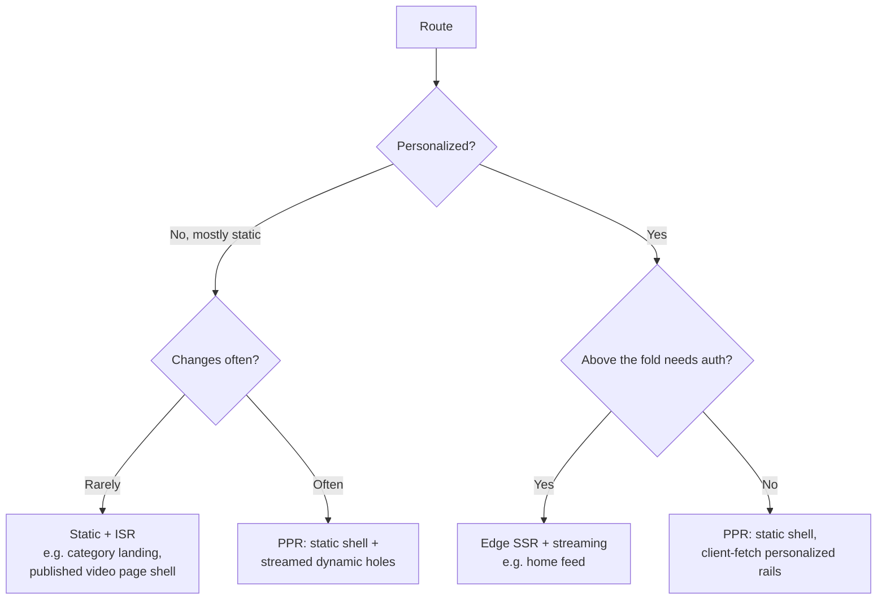
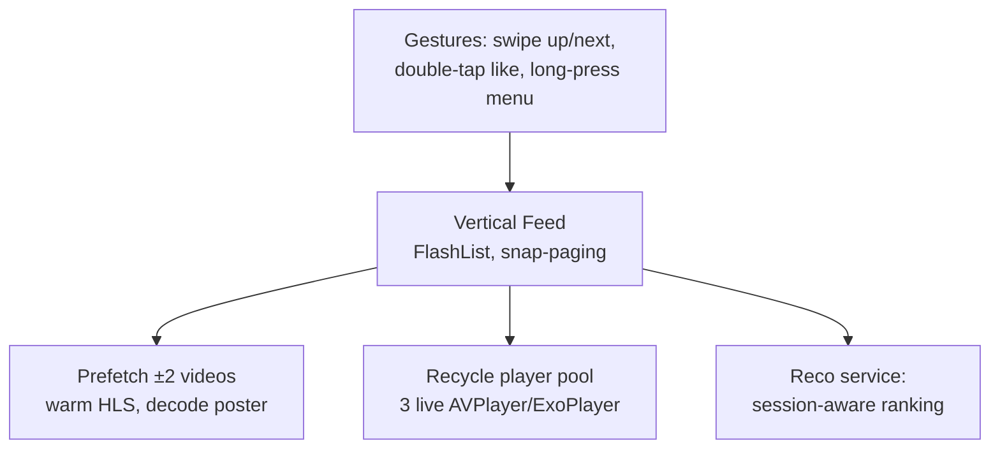
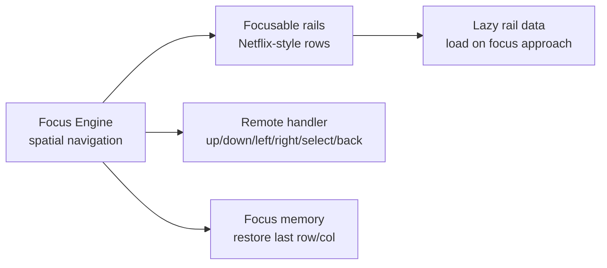
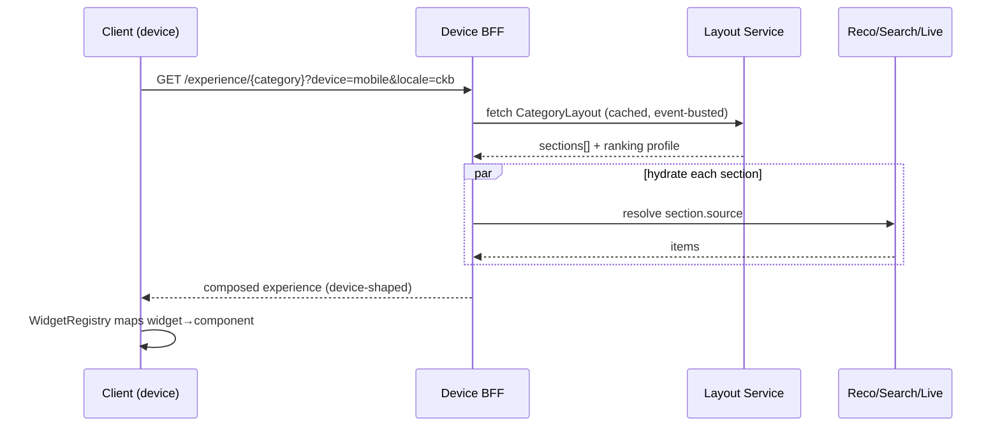

# 03 — Frontend Architecture

> **Scope:** Every client of **ZanaCloud** and the shared foundations beneath them: **Web** (Next.js 15 / React 19), **Mobile** (React Native + Expo, TikTok-style vertical feed), **Smart TV** (Android TV / Tizen / webOS / tvOS — focus-based, media-only), and **Desktop** (Tauri). Covers the monorepo structure, design systems per device, state management, caching, rendering strategy (SSR/ISR/streaming/edge/PPR), device-specific category filtering, RTL + Kurdish typography, offline/Intranet behavior, and the per-category "experience" composition model.
>
> **Foundation:** ZanaCloud replaces the legacy MediaCMS React 16 SPA (`frontend/`) with a modern multi-target frontend. The existing REST shape (DRF endpoints under `/api/v1/...`) is preserved through the BFFs (see [System Architecture §6](./02-system-architecture.md)) so migration is incremental.
>
> **Sibling docs:** [System Architecture](./02-system-architecture.md) · [Backend Services](./04-backend-services.md) · [Dynamic Category System](./07-dynamic-category-system.md)

---

## 1. Goals & forces

| Force | Frontend consequence |
|---|---|
| **Device-specific UX** (Mobile=TikTok, Web=FB+YouTube, TV=Netflix) | Separate apps with a **shared core**, not one responsive app pretending to fit all. |
| **Category-as-experience** | A runtime **page-composition engine** renders admin-defined layouts per category. No hardcoded homepage. |
| **TV = media only** | The TV target's router/BFF physically cannot reach non-media categories. |
| **Kurdish-first** | RTL-first layout, Sorani/Kurmanji fonts & shaping, locale-aware everything. |
| **Free + admin-gated** | No paywalls in default flows; upload UIs always show the *Pending Review* state honestly. |
| **Intranet/FTTH mode** | No hard dependency on public CDNs/fonts/analytics. PWA offline. Self-hosted assets. |
| **National scale, low-end devices** | Aggressive code-splitting, edge rendering, small JS budgets, image/video optimization. |

**Tech baseline:** TypeScript everywhere (strict), Tailwind CSS v4 + a token-driven design system, TanStack Query for server state, Zustand for client state, Turborepo + pnpm monorepo, Biome (lint+format) for speed.

---

## 2. Monorepo structure

```
zanacloud-frontend/                  (Turborepo + pnpm workspaces)
├── apps/
│   ├── web/                         Next.js 15 (App Router, RSC, PPR)
│   ├── mobile/                      Expo / React Native (New Architecture, Fabric)
│   ├── tv/                          React Native tvOS/Android TV + Tizen/webOS targets
│   ├── desktop/                     Tauri 2 shell wrapping the web app
│   └── admin/                       Super Admin Panel (Next.js, no-code builder)
├── packages/
│   ├── ui-core/                     headless primitives (Radix-based), tokens
│   ├── ui-web/                      web design system (Tailwind)
│   ├── ui-native/                   native design system (NativeWind)
│   ├── ui-tv/                       10-foot design system (focus engine)
│   ├── api-client/                  typed clients (OpenAPI + gRPC-web codegen)
│   ├── player/                      HLS/DASH player wrapper (hls.js / Shaka / native)
│   ├── category-engine/             page-composition + widget registry
│   ├── i18n/                        Sorani/Kurmanji/Arabic/English, RTL, ICU
│   ├── state/                       Zustand stores + TanStack Query config
│   ├── analytics/                   event SDK (batched, offline-queue)
│   └── feature-flags/              client flag SDK (per-category toggles)
├── turbo.json
└── pnpm-workspace.yaml
```

**Why a monorepo:** the four targets share ~50% of logic (API types, player abstraction, i18n, category engine, design tokens). Turborepo gives remote-cached, incremental builds; one `pnpm changeset` versions shared packages.

**Sharing strategy:** *business logic and types are shared; rendering is not.* A `MediaCard` is implemented three times (`ui-web`, `ui-native`, `ui-tv`) against one shared `useMediaCard()` hook and one `Media` type. This avoids the trap of a leaky cross-platform component that fits no device well.

---

## 3. Web app — Next.js 15 / React 19

### 3.1 Rendering strategy (the decision tree)

We use the **App Router with React Server Components (RSC)** and pick a rendering mode per route based on data volatility:



- **Partial Pre-rendering (PPR):** a video watch page ships a *static* shell (player skeleton, title, channel) instantly from the edge, while personalized rails (recommendations, comments) **stream in** via Suspense. Best of static + dynamic.
- **ISR (Incremental Static Regeneration):** category landing pages and published-media pages are statically generated and revalidated on `zc.video.media.published.v1`/`takendown` events via **on-demand revalidation** (`revalidatePath`) triggered by a webhook from the Video service — content stays fresh without rebuilds.
- **Edge SSR + streaming:** the logged-in home and search results render at edge PoPs (Cloudflare Workers in cloud mode; **a self-hosted Next.js node co-located in each FTTH PoP** in Intranet mode — the same artifact, different runtime target).
- **RSC** keeps data-fetching on the server (smaller client bundles, secrets stay server-side, fewer waterfalls). Client components only where interactivity demands.

### 3.2 Caching layers

```mermaid
graph LR
    B[Browser cache + SW] --> EDGE[Edge cache / CDN<br/>per-PoP]
    EDGE --> NEXT[Next.js Data Cache<br/>fetch() memoization + ISR]
    NEXT --> BFF[BFF-Web cache<br/>Redis, short TTL]
    BFF --> SVC[Services]
```

| Layer | What | TTL / invalidation |
|---|---|---|
| Service Worker (PWA) | shell, fonts, last-watched, offline queue | app-version + runtime caching |
| CDN/Edge | published media shells, thumbnails, manifests | tag-based purge on takedown/publish |
| Next Data Cache | `fetch()` results, RSC payloads | ISR revalidate + on-demand tags |
| BFF Redis | hot media metadata, category layouts | 30–120s, event-busted |
| TanStack Query | client server-state | `staleTime`/`gcTime`, optimistic updates |

### 3.3 State management

- **Server state → TanStack Query.** All API reads. Handles caching, dedup, background refetch, pagination/infinite queries (feeds), optimistic mutations (like/subscribe), and offline pause/resume (Intranet).
- **Client/UI state → Zustand.** Player state (volume, quality, PiP), theme/locale/RTL, focus state (TV), upload queue, modal stack. Small, fast, no boilerplate, works identically in RN.
- **URL state → the router.** Filters, tabs, category id, search query live in the URL (shareable, SSR-able).
- **Form state → React Hook Form + Zod** (schemas shared with API types).

We deliberately avoid Redux: with RSC moving most data server-side, a global mutable store would be over-engineering. Zustand covers the small island of genuine client state.

### 3.4 Player

A single `packages/player` abstraction over **hls.js** (web), **Shaka Player** (DASH/DRM where needed), and native AVPlayer/ExoPlayer (mobile/TV). It speaks the HLS/LL-HLS manifests produced by the Processing service (evolved from MediaCMS `create_hls`). Features: ABR, Sorani/Kurmanji caption tracks, audio-track switching (for AI-dubbed renditions, see [AI Dubbing](./15-ai-dubbing-studio.md)), thumbnail sprites (MediaCMS `produce_sprite_from_video`), DVR for live, and a low-bandwidth profile auto-selected on FTTH.

---

## 4. Mobile app — Expo / React Native (TikTok-first)

### 4.1 The vertical feed

The mobile experience is **shorts-first**: the default screen is a full-screen, snap-scrolling vertical video feed (constraint: "Mobile = TikTok/Shorts-first").



- **List virtualization:** Shopify **FlashList** (recycling, low memory) with `pagingEnabled` snap. Only ~3 player instances exist; they're recycled as the user scrolls.
- **Prefetching:** the next ±2 items' HLS manifests and first segments are warmed; posters are decoded ahead so the next video starts < 200ms after a swipe.
- **New Architecture (Fabric + TurboModules + Hermes):** required for jank-free 60/120fps scroll and synchronous native player control.
- **Session ranking:** the feed calls the Recommendation BFF with session signals (dwell, completion, replays); see [Recommendation Engine](./12-recommendation-engine.md).

### 4.2 Native concerns

- **Background upload** (tus client, see [Upload Pipeline](./06-upload-pipeline.md)) survives app backgrounding via native background tasks; shows *Pending Review* on completion.
- **Push** via FCM/APNs in cloud mode; **local/poll notifications** in Intranet mode (no Google/Apple push reachable) through the Notification service's pull channel.
- **EAS** for OTA JS updates and build pipelines; native code changes go through store/sideload (sideload APK is relevant for KRI distribution and Intranet).
- **Offline:** watch-later + downloads (where category policy permits) stored encrypted; analytics queued.

---

## 5. Smart TV — 10-foot, media-only

### 5.1 Targets & strategy

| Platform | Runtime | Approach |
|---|---|---|
| Android TV / Google TV | React Native (TV) + ExoPlayer | shared `apps/tv` RN codebase |
| Apple tvOS | React Native (TV) + AVPlayer | same RN codebase |
| Samsung Tizen | Web (HbbTV/Tizen Web) | Next.js export → Tizen WebView |
| LG webOS | Web (Enact-compatible) | same web export |

Two engines (RN-TV and a web build) cover all four; both consume the same `ui-tv` design system and `player` package.

### 5.2 Focus-based navigation (the defining constraint)

TV has no pointer — everything is **D-pad spatial focus**.



- **Spatial navigation lib** (`@noriginmedia/norigin-spatial-navigation` for web; RN-TV's native focus for RN) maps D-pad to a focus graph. Every focusable computes nearest neighbors.
- **10-foot design system (`ui-tv`):** large type, high-contrast, generous focus rings, no hover, no text input except an on-screen keyboard, predictable left-to-right RTL-aware focus order for Kurdish.
- **Media-only enforcement:** the **TV BFF** (see [System Architecture §6.1](./02-system-architecture.md)) only returns media categories (Movies, Series, Music, Kids, Live, Sports). The TV router has no routes for Marketplace, Library, Learning, Files. This is enforced at the BFF *and* the build (those packages aren't bundled into `apps/tv`).

### 5.3 Netflix-style category screen

Hero billboard + horizontally-scrolling rails per category, lazy-loaded as focus approaches, continue-watching at top, autoplay-preview on focus dwell (bandwidth-gated). Layout is still **admin-composed** via the category engine (§7) but constrained to TV-safe widget types.

---

## 6. Desktop — Tauri 2

The desktop app is a **Tauri 2** shell wrapping the web app. Chosen over Electron because:

- **Footprint:** Tauri uses the OS WebView (WebView2/WKWebView/WebKitGTK) → ~3–10MB installers vs Electron's ~150MB; far lower RAM. Matters for the broad, sometimes-older Windows install base in KRI.
- **Rust core:** secure native capabilities (filesystem for bulk uploads, local download manager for the File/Archive hub, background transcode offload, native notifications).
- **Same codebase:** reuses `apps/web` build; Tauri adds native menus, deep links, auto-update, and an **Intranet-friendly local cache**.

Desktop UX = "Facebook + YouTube" density (multi-column, persistent nav, rich hover) — distinct from TV.

---

## 7. Per-category experience composition engine

No universal homepage. `packages/category-engine` renders **admin-authored layouts** fetched from the Super Admin Panel's no-code builder.

### 7.1 Model

```ts
// A category layout is data, authored in the Super Admin Panel.
interface CategoryLayout {
  categoryId: string;
  device: 'web' | 'mobile' | 'tv' | 'desktop';
  locale: 'ckb' | 'kmr' | 'ar' | 'en';
  ranking: RankingProfile;          // which reco/sort algorithm
  sections: Section[];              // ordered widgets
  monetization: MonetizationToggle; // ads/subscription on/off (admin)
  geo: GeoPolicy;
}
interface Section {
  widget: WidgetType;               // 'hero' | 'rail' | 'grid' | 'shorts' |
                                    // 'continueWatching' | 'liveNow' | 'editorial' | ...
  source: DataSource;               // 'reco:trending' | 'editorial:list:123' | 'live:category:x'
  props: Record<string, unknown>;   // device-validated
}
```

### 7.2 Render flow



A **WidgetRegistry** in each device package maps `WidgetType` → the device's component. The TV registry only registers TV-safe widgets (refusing `marketplaceGrid`). This is how one declarative layout produces a TikTok feed on mobile, a Netflix rail wall on TV, and a YouTube grid on web.

---

## 8. Internationalization, RTL & Kurdish typography

- **Locales:** `ckb` (Sorani, Arabic script, RTL), `kmr` (Kurmanji — Latin LTR *and* Arabic-script RTL variants), `ar` (RTL), `en` (LTR). ICU MessageFormat via `next-intl` / `react-intl`; locale in the URL (`/ckb/...`) for SSR.
- **RTL-first:** Tailwind v4 **logical properties** (`ms-`/`me-`/`ps-`/`pe-`, `start`/`end`) so one stylesheet flips correctly. `dir="rtl"` driven by locale; focus order on TV respects RTL.
- **Kurdish typography:** self-hosted fonts with full Arabic-script shaping + Kurdish-specific glyphs (ڕ ڵ ۆ ێ ھ); fonts bundled (no Google Fonts) so Intranet works. Number shaping (Eastern Arabic vs Latin) per-locale; bidi-safe text rendering for mixed Kurdish/Latin (e.g. titles with brand names).
- **Mirrored assets:** directional icons mirror in RTL via the design system.

---

## 9. Performance & quality budgets

| Metric | Web budget | Mobile budget |
|---|---|---|
| Initial JS (route) | ≤ 150KB gz (RSC keeps most server-side) | n/a (native) |
| LCP (4G, mid device) | ≤ 2.0s | feed first-frame ≤ 0.5s |
| Feed swipe → next start | — | ≤ 200ms |
| TTI category page | ≤ 2.5s | — |
| CLS | < 0.05 | — |

Techniques: route-level code-splitting, `next/image` + AVIF/WebP with self-hosted optimizer (Intranet), font subsetting for Kurdish ranges, prefetch on intent (hover/focus/viewport), edge rendering, streaming Suspense, and a strict bundle-budget CI gate.

---

## 10. Offline / Intranet behavior

- **PWA + Service Worker** (web/desktop): app shell, fonts, and recently-watched manifests cached; an **offline action queue** (likes, comments, watch progress, analytics) flushes on reconnect with idempotency keys.
- **No public dependencies:** fonts, icons, analytics endpoint, image optimizer, and map tiles are all self-hosted; feature flags fall back to bundled defaults if the flag service is unreachable.
- **Graceful monetization fallback:** if Billing/Ads are unreachable (air-gapped), the UI hides paid actions and renders everything as free — matching the platform's free-first default.

---

## 11. Design systems (per device)

| Package | Device | Primitives | Notable |
|---|---|---|---|
| `ui-core` | all | tokens (color/space/type/motion), headless logic (Radix) | one source of design tokens |
| `ui-web` | web/desktop | Tailwind components, dense layouts | hover, multi-column |
| `ui-native` | mobile | NativeWind, gesture components | shorts feed, sheets |
| `ui-tv` | TV | 10-foot scale, focus rings | no hover/typing, D-pad |

Tokens flow one-way (`ui-core` → device packages) so a brand color change propagates everywhere; each device interprets tokens for its ergonomics (e.g. min tap target 44pt mobile, focus ring 4px TV).

---

## 12. Migration from the MediaCMS React SPA

1. **Coexist:** mount the new Next.js app behind the gateway at `/v2`; the legacy `frontend/` SPA stays at `/` initially.
2. **Strangle by route:** move watch page, then category pages, then upload, then auth to `/v2`; redirect old routes as each lands.
3. **API continuity:** the new app calls the *same* DRF-shaped endpoints via BFFs, so backend extraction (System Architecture §9) and frontend rewrite proceed independently.
4. **Retire** the legacy SPA once parity + analytics confirm no regressions.

---

## 13. Cross-references

- BFFs, gateway, gRPC contracts the frontend consumes: **[02 — System Architecture](./02-system-architecture.md)**
- The services behind each data source: **[04 — Backend Services](./04-backend-services.md)**
- No-code layout authoring & widget catalog: **[07 — Dynamic Category System](./07-dynamic-category-system.md)**
- Player manifests & streaming: **[09 — Streaming Infrastructure](./09-streaming-infrastructure.md)**
- Resumable upload client (tus): **[06 — Upload Pipeline](./06-upload-pipeline.md)**
