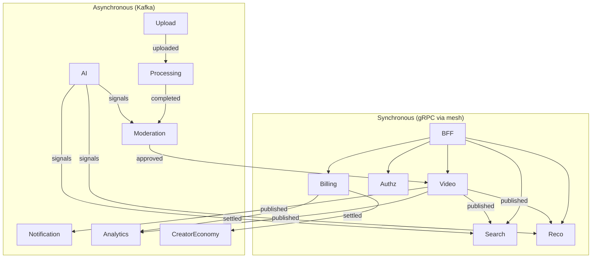

# 04 — Backend Services

> **Scope:** The complete catalog of ZanaCloud's backend services — responsibilities, public/internal APIs (REST + gRPC), per-service datastore, communication patterns, scaling profile, and key design notes. This is the service-level companion to the macro view in [System Architecture](./02-system-architecture.md).
>
> **Foundation:** Many services begin as modules inside the evolved [MediaCMS](../../README.md) Django monolith (`files/`, `users/`, `uploader/`) and are extracted via strangler-fig. Where a service is "extracted now" vs "stays in core" is called out per service.
>
> **Sibling docs:** [System Architecture](./02-system-architecture.md) · [Database](./05-database-architecture.md) · [Upload Pipeline](./06-upload-pipeline.md)

---

## 1. Service catalog

| # | Service | Bounded context | Phase | Runtime | Primary store | Scaling driver | Sync API | Async |
|---|---|---|---|---|---|---|---|---|
| 1 | **Authentication** | Identity | Core→extract | Go | Postgres + Redis | login RPS | gRPC+REST | events out |
| 2 | **Authorization** | Identity | Extract | Go (OPA sidecar) | Postgres + Redis | policy QPS | gRPC | — |
| 3 | **User** | Identity | Core | Django | Postgres | MAU | REST+gRPC | both |
| 4 | **Channel** | Creator | Core | Django | Postgres | creators | REST+gRPC | both |
| 5 | **Video/Catalog** | Creator | Core→extract | Django→Go | Postgres + Redis | catalog reads | REST+gRPC | both |
| 6 | **Upload** | Ingest | Extract now | Go (tusd) | Postgres + object store | concurrent uploads | tus/REST | events out |
| 7 | **Processing** | Ingest | Extract now | Python+FFmpeg | object store + Postgres | minutes-of-video | gRPC | both |
| 8 | **Search** | Discovery | Extract | Go | OpenSearch | query QPS | REST+gRPC | consumer |
| 9 | **Recommendation** | Discovery | Extract | Python/Go | Cassandra + Vector DB + Redis | feed QPS | gRPC | consumer |
| 10 | **Comment** | Engagement | Core | Django | Postgres | write/read RPS | REST+gRPC | both |
| 11 | **Playlist** | Creator | Core | Django | Postgres | reads | REST+gRPC | events |
| 12 | **Subscription** | Engagement | Core | Django | Postgres | fan-out | REST+gRPC | both |
| 13 | **Notification** | Engagement | Extract | Go | Cassandra + Redis | fan-out volume | gRPC | consumer |
| 14 | **Billing/Wallet** | Commerce | Extract | Go | Postgres (ledger) | tx volume | REST+gRPC | both |
| 15 | **Advertisement** | Commerce | Extract | Go | Postgres + Redis + ClickHouse | ad QPS | gRPC | both |
| 16 | **Analytics** | Intelligence | Extract | Go/Flink | ClickHouse + Kafka | event firehose | REST | consumer |
| 17 | **Moderation** | Ingest | Extract | Python/Django | Postgres (ES) | review queue | REST+gRPC | both |
| 18 | **Live Streaming** | Ingest | Extract | Go + media servers | Redis + object store | concurrent streams | REST+gRPC | both |
| 19 | **Studio** | Creator | Extract | Node/Go BFF | aggregates others | creators | REST | consumer |
| 20 | **Creator Economy** | Commerce | Extract | Go | Postgres (ledger) | payouts | REST+gRPC | both |
| 21 | **AI** | Intelligence | Extract now | Python/Triton (GPU) | Vector DB + object store | GPU jobs | gRPC | both |

Cross-cutting platform services (not numbered above): **API Gateway/BFFs** (System Arch §6), **Config/Feature-Flag** (powers the Super Admin Panel), **Media/Object-Storage** abstraction, **Geo-fencing** (gateway filter + policy store).

---

## 2. Per-service detail

### 2.1 Authentication

**Responsibility:** identity verification, session/token issuance, MFA, OAuth/OIDC, device sessions, password/passkey (WebAuthn), Intranet-local auth.

- **Tokens:** short-lived **JWT access** (5–15 min) signed with rotating keys published via **JWKS** so the gateway validates *offline* (essential for Intranet/air-gapped). Long-lived **refresh tokens** are opaque, stored hashed in Postgres, rotated on use, revocable.
- **Claims:** `sub`, `tenant` (e.g. `iq-krd`), `roles`, `verified_creator`, `region`, `device_class`. Region claim feeds geo-fencing.
- **MFA:** TOTP + WebAuthn/passkeys; SMS OTP via a local Iraqi SMS gateway adapter (swappable for Intranet).
- **Lineage:** replaces MediaCMS `django-allauth`; user records remain in the User service.

**API (gRPC + REST):**
```
POST /api/v1/auth/login            → {access, refresh, expires_in}
POST /api/v1/auth/refresh          → rotate
POST /api/v1/auth/logout           → revoke refresh
POST /api/v1/auth/mfa/verify
rpc  ValidateToken(Token) returns (Claims)   // used internally; gateway prefers offline JWKS
```
**Scaling:** stateless; HPA on RPS; Redis for refresh-token rotation + brute-force throttling. **Events:** `zc.identity.session.created`, `...revoked`.

---

### 2.2 Authorization (RBAC + ABAC)

**Responsibility:** decide *can subject X do action Y on resource Z?* Centralizes the platform's role model and the **admin-gated publishing** rules.

- **Engine:** **Open Policy Agent (OPA)** with Rego policies, deployed as a sidecar / **ext_authz** filter in Envoy. Policies are data-driven and editable from the Super Admin Panel (no-code → compiled to Rego/data).
- **Model:** RBAC roles (`user`, `verified_creator`, `editor`, `manager`, `admin`, `superadmin` — generalizing MediaCMS `is_editor`/`is_manager`) **plus** ABAC attributes (category ownership, geo, quota state, verification level).
- **Key policies:**
  - Publishing requires `admin/editor` approval transition (no self-publish).
  - Upload limits: `user ≤ 3min + quota`, `verified_creator` higher, `admin` unlimited — enforced at Upload via an authz check.
  - Per-category monetization & visibility toggles.

```rego
# can_publish: only editors/admins move media to Published
allow_publish {
  input.action == "media.publish"
  input.subject.roles[_] == "editor"
}
allow_publish {
  input.action == "media.publish"
  input.subject.roles[_] == "admin"
}
```
**API:** `rpc Check(CheckRequest) returns (Decision)`; batch `CheckBulk`. **Scaling:** decisions cached in Redis; OPA is CPU-light and replicated.

---

### 2.3 User

**Responsibility:** profiles, preferences, verification status, quotas, notification prefs, account lifecycle. **Stays in core (Django)** — this is the evolved `users/` app.

- Owns `User` (keep `is_editor`, `is_manager`, add `verified_creator`, `role`, `upload_quota`), preferences, and **role-based quota counters** consulted by Upload.
- **DB:** Postgres `users`/`user_profiles`/`user_quotas`. PII encrypted at rest (column-level); subject to data-residency (Iraq region).

```sql
CREATE TABLE user_quotas (
  user_id        BIGINT PRIMARY KEY REFERENCES users(id),
  role           TEXT NOT NULL,            -- user|verified_creator|admin
  max_video_sec  INT  NOT NULL DEFAULT 180,-- 3 min default
  storage_bytes  BIGINT NOT NULL,
  used_bytes     BIGINT NOT NULL DEFAULT 0,
  daily_uploads  INT NOT NULL DEFAULT 0,
  updated_at     TIMESTAMPTZ NOT NULL DEFAULT now()
);
```
**Events:** `zc.identity.user.registered/updated/verified`. **API:** REST `/api/v1/users/...` (DRF-compatible) + gRPC `GetUser`.

---

### 2.4 Channel

**Responsibility:** creator channels/brands, handles, banners, channel-level settings, membership tiers. Evolved `users.Channel`. **Core (Django).**
- Owns channel metadata, ownership, custom layout overrides per category.
- **API:** `/api/v1/channels/{handle}`, gRPC `GetChannel`, `ListChannelMedia`. **Events:** `zc.creator.channel.created/updated`.

---

### 2.5 Video / Catalog

**Responsibility:** the canonical media catalog — titles, descriptions, categories, tags, encodings/renditions, **PublicationState**, geo-policy, visibility. Evolved `files.Media`/`Encoding`/`Category`/`Tag`. **Core now → extracted to Go** for the high-RPS read path.

- Source of truth for the publish state machine (System Arch §5.2). Keeps `friendly_token`, `uid`, `hls_file`.
- **Read model:** hot metadata cached in Redis; published media projected to OpenSearch (Search) and Reco.
- **Write path:** transactional Postgres + outbox → emits `zc.video.media.published/updated/takendown`.

```sql
CREATE TABLE media (
  id            BIGINT GENERATED ALWAYS AS IDENTITY PRIMARY KEY,
  friendly_token TEXT UNIQUE NOT NULL,
  uid           UUID UNIQUE NOT NULL DEFAULT gen_random_uuid(),
  channel_id    BIGINT NOT NULL,
  title         TEXT NOT NULL,
  media_type    TEXT NOT NULL,          -- video|audio|image|document
  duration_ms   BIGINT,
  state         TEXT NOT NULL DEFAULT 'draft',     -- publication state
  encoding_status TEXT NOT NULL DEFAULT 'pending',
  is_reviewed   BOOLEAN NOT NULL DEFAULT false,
  hls_manifest  TEXT,
  geo_policy    JSONB NOT NULL DEFAULT '{"mode":"allow_all"}',
  monetization  JSONB NOT NULL DEFAULT '{}',
  created_at    TIMESTAMPTZ NOT NULL DEFAULT now(),
  published_at  TIMESTAMPTZ
);
CREATE INDEX media_channel_state_idx ON media (channel_id, state);
CREATE INDEX media_state_pub_idx ON media (state, published_at DESC);
```
**API:** `GET /api/v1/media/{friendly_token}`, `POST .../publish` (admin-gated via Authz), gRPC `VideoCatalog`. **Scaling:** read replicas + Redis; reads dominate (≈ 95:5 read:write).

---

### 2.6 Upload

**Extract now.** Full detail in **[06 — Upload Pipeline](./06-upload-pipeline.md)**. Summary: **tusd**-based resumable/chunked uploads, role-quota enforcement (calls Authz/User), checksum, hands off to Processing via `zc.upload.media.uploaded.v1`. **Store:** object storage + Postgres upload state. Evolves MediaCMS `uploader/` (FineUploader).

---

### 2.7 Processing (Transcode)

**Extract now.** Detail in [Video Processing](./08-video-processing.md). Evolves MediaCMS Celery tasks (`encode_media`, `create_hls`, `produce_sprite_from_video`) into an autoscaled cluster.

- **Pipeline:** probe → transcode ladder (144p→8K, AV1/HEVC/H.264) → HLS/LL-HLS packaging → sprites/thumbnails → emit `encoding.completed`.
- **Workers:** FFmpeg pods autoscaled by **KEDA** on Kafka lag (queue depth = minutes-of-video pending); GPU pods (NVENC) for high tiers.
- **Idempotent:** keyed by `(media, profile)`; safe to retry.

```protobuf
service Transcoder {
  rpc RequestTranscode(TranscodeRequest) returns (TranscodeJob);
  rpc GetJob(JobId) returns (TranscodeJob);
}
message TranscodeRequest {
  string media_uid = 1; string source_uri = 2;
  repeated string profiles = 3;   // "1080p","720p","av1-2160p"
  bool generate_hls = 4; bool generate_sprites = 5;
}
```
**Events:** `encoding.started/progressed/completed/failed`. **Capacity:** ~1× realtime per CPU core for H.264 720p; NVENC ~5–10× realtime; cluster sized to peak ingest (e.g. 2,000 min-of-video/hour → ~35 sustained encode streams + burst).

---

### 2.8 Search

**Extract.** Detail in [Search Engine](./11-search-engine.md). **OpenSearch** projection consuming `media.published`, `transcript.ready`, `labels.extracted`.
- Lexical (BM25) + **semantic** (vector, kNN) hybrid; Kurdish analyzers (Sorani/Kurmanji stemming, normalization). Geo + state filters baked into every query.
- **API:** `GET /api/v1/search?q=&category=&lang=ckb`, gRPC `Search`. **Scaling:** OpenSearch sharded by category/time; query QPS via replicas.

---

### 2.9 Recommendation

**Extract.** Detail in [Recommendation Engine](./12-recommendation-engine.md).
- **Two-stage:** candidate generation (ANN over embeddings in **Vector DB** + collaborative filtering) → ranking (gradient-boosted / neural ranker) → per-category re-ranking + business rules (geo, freshness, diversity).
- Powers the mobile shorts feed (session-aware) and per-category rails.
- **Stores:** Cassandra (precomputed timelines), Vector DB (item/user embeddings), Redis (online features). **API:** gRPC `Recommend(context)`; streaming feed endpoint for shorts.

---

### 2.10 Comment

**Responsibility:** threaded comments, reactions, mentions, timed comments. Evolved `files.Comment` (MPTT tree). **Core (Django).**
- AI pre-moderation on `zc.engage.comment.created.v1` (toxicity, Kurdish-aware) before public display where category requires.
- **DB:** Postgres, materialized-path or closure-table for threads. **Events:** `comment.created/deleted/flagged`.

---

### 2.11 Playlist

Evolved `files.Playlist`/`PlaylistMedia`. **Core.** User/editorial playlists, ordering, collaborative lists. REST + gRPC; emits `playlist.updated` for Search/Reco.

---

### 2.12 Subscription

**Responsibility:** channel subscriptions + notification opt-in; drives feed fan-out. **Core.**
- On subscribe → `zc.engage.subscription.created` → Notification + Reco. Fan-out for "new upload" notifications handled by Notification.
- **DB:** Postgres `subscriptions(user_id, channel_id, notify, created_at)`; counters cached in Redis.

---

### 2.13 Notification

**Extract.** Multi-channel: in-app, push (FCM/APNs cloud; **pull/poll in Intranet**), email (local SMTP), SMS (local gateway).
- **Fan-out-on-write** for small channels, **fan-out-on-read** for large channels (avoids the celebrity-channel write storm).
- **Store:** Cassandra (per-user notification timeline, high write volume) + Redis (unread counts). Consumes `media.published`, `comment.created`, `subscription.created`, `payment.settled`, `moderation.*`.
- **API:** `GET /api/v1/notifications`, `POST .../read`, gRPC `Push`.

---

### 2.14 Billing / Wallet

**Extract.** Event-sourced **ledger** (System Arch §5.2). FIB-first, modular, per-category.
- **Anti-corruption layer** around the **FIB API** adapter; other gateways are pluggable. Wallet (top-up/spend), subscriptions, refunds.
- **Intranet:** if FIB unreachable, payment actions queue/disable; the platform stays free-first and fully usable.

```sql
CREATE TABLE ledger_entries (    -- append-only, double-entry
  id          BIGINT GENERATED ALWAYS AS IDENTITY PRIMARY KEY,
  wallet_id   BIGINT NOT NULL,
  amount_iqd  BIGINT NOT NULL,           -- minor units; +credit/-debit
  type        TEXT   NOT NULL,           -- topup|spend|refund|payout|fee
  ref_type    TEXT, ref_id TEXT,
  fib_txn_id  TEXT,
  created_at  TIMESTAMPTZ NOT NULL DEFAULT now()
);
CREATE INDEX ledger_wallet_idx ON ledger_entries (wallet_id, created_at);
```
**Events:** `payment.settled/refunded/failed`, `wallet.credited/debited`. Balance = projection of entries. Detail in [Monetization](./23-monetization.md).

---

### 2.15 Advertisement

**Extract.** Ad server + real-time auction, targeting, budgets, frequency capping. **Optional & per-category** (admin toggle); the watch path fails-open to no-ads.
- **Store:** Postgres (campaigns/budgets), Redis (pacing/freq caps), ClickHouse (impressions/clicks). gRPC `RequestAds(context)` from the player BFF; sub-50ms auction budget. Detail in [Advertising](./22-advertising.md).

---

### 2.16 Analytics

**Extract.** Real-time + historical. **Flink/ksqlDB** stream processing over the Kafka firehose → **ClickHouse**.
- Ingests playback heartbeats, engagement, search, ad events. Powers Studio dashboards, trending, billing usage. Detail in [Analytics](./21-analytics.md).
- **API:** internal query API + materialized rollups. **Scaling:** ClickHouse cluster, partitioned by day + sharded by entity.

---

### 2.17 Moderation

**Extract.** Owns the **admin-approval workflow aggregate** (event-sourced state machine, System Arch §5.2) — the heart of admin-gated publishing.
- Aggregates AI signals (`nsfw.scored`, `labels.extracted`, `transcript.ready`, copyright) + human review queue in the Super Admin Panel.
- Transitions: `PendingReview → Approved | Rejected`; emits `media.approved/rejected`. Full audit trail (who/when/why) for national compliance.
- **DB:** Postgres event store for workflow + a review-queue read model. Detail in [AI Systems](./13-ai-systems.md) and [Upload Pipeline](./06-upload-pipeline.md).

---

### 2.18 Live Streaming

**Extract.** Detail in [Live Streaming](./10-live-streaming.md).
- **Ingest:** RTMP / SRT / WebRTC → transcode → **LL-HLS** + DASH out. Live chat, DVR, VOD-after-live. Same admin-gating (live requires verified creator + optional pre-approval).
- **Stores:** Redis (live state, chat fan-out via pub/sub), object store (DVR/VOD segments). gRPC control plane; media servers (e.g. SRS/MediaMTX/OvenMediaEngine) in the data plane.

---

### 2.19 Studio (Creator)

**Extract (BFF-style aggregator).** Creator dashboard: analytics, revenue, upload status, copyright center, A/B thumbnails. Detail in [Creator Studio](./14-creator-studio.md).
- **Reads from** Analytics, Billing, Video, Moderation, AI — aggregates, owns little state. Reads from write-side where read-your-writes matters (creator sees edits instantly).

---

### 2.20 Creator Economy

**Extract.** Revenue share, memberships, Super-Chat/Thanks, **FIB payouts**. Event-sourced payout ledger; consumes `payment.settled`, ad revenue from Analytics; emits `payout.requested/completed`. Detail in [Monetization](./23-monetization.md).

---

### 2.21 AI

**Extract now (GPU plane).** Detail in [AI Systems](./13-ai-systems.md), [Dubbing](./15-ai-dubbing-studio.md), [Kurdish Language Intelligence](./34-kurdish-language-intelligence.md).
- **Capabilities:** ASR (Sorani/Kurmanji), TTS, OCR, translation/dubbing, video understanding (scene/object/label), NSFW & safety classification, copyright fingerprinting, embeddings for Search/Reco, content generation, comment toxicity.
- **Runtime:** Python + **NVIDIA Triton** inference servers, model registry, GPU node pools; **async by default** — never blocks core writes. Consumes `media.uploaded`/`encoding.completed`, emits `transcript.ready`, `labels.extracted`, `nsfw.scored`, `embeddings.ready`.
- **Intranet:** self-hosted/open-weight models (no cloud LLM dependency in the request path); cloud models are an optional adapter.

```protobuf
service AIInference {
  rpc Transcribe(TranscribeRequest) returns (stream TranscriptSegment); // ckb/kmr
  rpc DetectUnsafe(MediaRef) returns (SafetyScores);
  rpc Embed(EmbedRequest) returns (Embedding);
}
```

---

## 3. Communication patterns (summary)



- **Sync (gRPC):** request-scoped reads/writes where the caller needs an immediate answer (get media, check authz, run ad auction, settle a payment).
- **Async (Kafka):** anything that fans out, can be eventual, or crosses the publishing pipeline. Outbox pattern guarantees no dual-write (System Arch §8.3).
- **Resilience:** every sync dependency has a circuit breaker; the playback path has zero hard dependency on Billing/Ads/AI.

---

## 4. Scaling profile cheat-sheet

| Service | Bottleneck | Scale lever | Target |
|---|---|---|---|
| Auth | login RPS | stateless HPA + Redis | 5k login/s |
| Video reads | catalog QPS | read replicas + Redis + CDN | 50k req/s |
| Upload | concurrent sessions | tusd replicas, object-store throughput | 10k concurrent |
| Processing | minutes-of-video | KEDA on Kafka lag + GPU pool | 2k min-video/hr |
| Search | query QPS | OpenSearch replicas | 10k qps |
| Reco | feed QPS | precompute + ANN + Redis features | 30k qps |
| Notification | fan-out | Cassandra + fan-out-on-read for big channels | 100k/s |
| Analytics | event firehose | Flink + ClickHouse shards | 500k events/s |

---

## 5. Cross-references

- Macro architecture, events, sagas, outbox: **[02 — System Architecture](./02-system-architecture.md)**
- Datastores per service, sharding, DR: **[05 — Database Architecture](./05-database-architecture.md)**
- Upload→approval pipeline: **[06 — Upload Pipeline](./06-upload-pipeline.md)**
- Frontend BFFs consuming these APIs: **[03 — Frontend Architecture](./03-frontend-architecture.md)**
