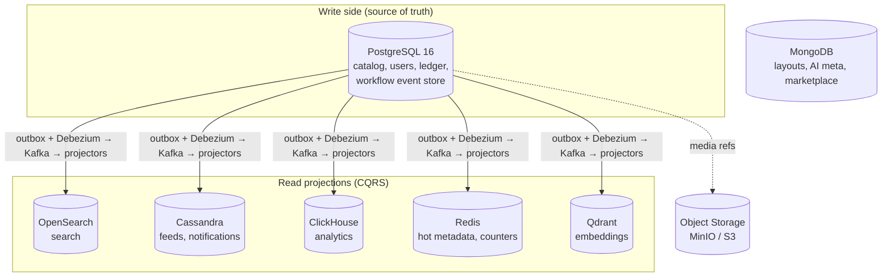
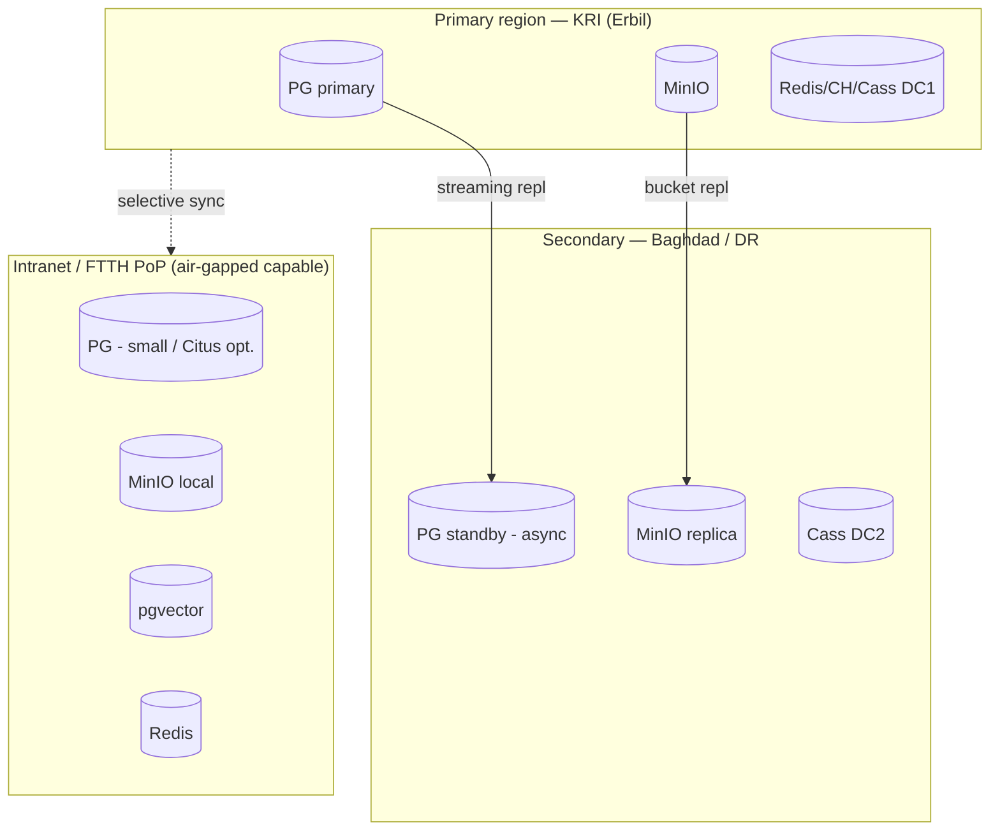

# 05 — Database Architecture

> **Scope:** The polyglot-persistence strategy of ZanaCloud — which datastore exists, *why*, and how each is partitioned, sharded, replicated, backed up, and recovered. Includes complete DDL for core entities, the multi-region + Intranet/FTTH topology, and the data-residency posture for the Kurdistan Region / Iraq.
>
> **Foundation:** Today's [MediaCMS](../../README.md) runs PostgreSQL + Redis only. ZanaCloud keeps Postgres as the transactional source of truth and adds purpose-built stores via the CQRS projection model from [System Architecture §5](./02-system-architecture.md).
>
> **Sibling docs:** [System Architecture](./02-system-architecture.md) · [Backend Services](./04-backend-services.md) · [Upload Pipeline](./06-upload-pipeline.md)

---

## 1. Polyglot persistence — the decision

**Principle: the right store for each access pattern, owned per service, integrated only via API/events.** No service reaches into another's database. We deliberately accept operational diversity because the access patterns are genuinely different — forcing them onto one engine would be the real over-engineering.

| Store | Role | Why this store (not Postgres) |
|---|---|---|
| **PostgreSQL 16** | Transactional source of truth (users, channels, catalog, billing ledger, workflow event store) | ACID, rich constraints, `JSONB`, partitioning, logical replication (CDC/outbox), `pgvector` option. The backbone. |
| **Redis 7** | Cache, hot counters, rate limits, session/refresh rotation, online ML features, live state, pub/sub | Sub-ms reads; ephemeral high-churn data that must not bloat Postgres. |
| **ClickHouse** | Analytics warehouse (playback heartbeats, engagement, ads, search logs) | Columnar OLAP; billions of rows, sub-second aggregations — impossible at this scale/cost in Postgres. |
| **Cassandra / ScyllaDB** | High-write fan-out: per-user feed timelines, notification timelines | Linear write scaling, multi-DC, no single-writer bottleneck; tunable consistency. |
| **MongoDB** | Flexible/semi-structured documents: category layouts (no-code builder), CMS/editorial content, AI job metadata, schema-evolving product/marketplace catalogs | Document model fits heterogeneous, frequently-reshaped data better than rigid SQL. |
| **OpenSearch** | Full-text + faceted + geo search, log search | Inverted index, BM25, analyzers (Kurdish), aggregations — not Postgres FTS at national scale. |
| **Vector DB (Qdrant primary; pgvector for small/Intranet)** | Embeddings: semantic search, recommendation ANN, dedup/copyright, near-duplicate detection | Purpose-built ANN (HNSW) at high recall/QPS; pgvector for the air-gapped small-footprint profile. |
| **Object storage (S3-compatible: MinIO self-hosted / cloud S3)** | Media blobs: source uploads, HLS segments, sprites, thumbnails, books/files, model artifacts | Cheap, durable, infinite; MinIO makes Intranet/FTTH fully self-contained. |



---

## 2. PostgreSQL — the transactional core

### 2.1 Topology

- **Primary + 2 sync-ish replicas per region** (streaming replication; one synchronous standby for zero-RPO on the primary's region, async replicas for reads/geo).
- **Connection pooling:** **PgBouncer** (transaction mode) in front of every Postgres; services target the pooler, not Postgres directly.
- **Logical replication / CDC:** **Debezium** tails the WAL for the **outbox** pattern (System Arch §8.3) and for feeding projections. The `outbox` table is the only "event" surface.
- **Per-service databases:** Auth, User, Channel, Video, Comment, Playlist, Subscription, Billing, Moderation each own a logical database (separate schemas/instances by scale). No cross-database joins.

### 2.2 Partitioning & sharding

- **Time-partition** append-heavy tables (`media` by `created_at` monthly via declarative partitioning; `comments` by month) — keeps indexes hot and enables cheap drop-old.
- **Sharding** is applied where a single primary can't hold the write volume:
  - **Comment** and **Subscription**: hash-shard by `channel_id` (or `media_id`) using **Citus** (distributed Postgres) so a viral video's comments spread across nodes.
  - **Video catalog**: range/hash by `channel_id`; most reads are channel- or media-scoped.
- Billing ledger is **not** sharded (single-region, strongly consistent, modest volume) but is partitioned by month and append-only.

### 2.3 Core DDL (selected — full set lives with each service)

```sql
-- ===== Users (evolves MediaCMS users.User) =====
CREATE TABLE users (
  id              BIGINT GENERATED ALWAYS AS IDENTITY PRIMARY KEY,
  uid             UUID UNIQUE NOT NULL DEFAULT gen_random_uuid(),
  username        CITEXT UNIQUE NOT NULL,
  email           CITEXT UNIQUE,
  role            TEXT NOT NULL DEFAULT 'user'
                  CHECK (role IN ('user','verified_creator','editor','manager','admin','superadmin')),
  is_editor       BOOLEAN NOT NULL DEFAULT false,   -- MediaCMS lineage
  is_manager      BOOLEAN NOT NULL DEFAULT false,
  region          TEXT,                              -- e.g. 'IQ-KR' for geo/residency
  created_at      TIMESTAMPTZ NOT NULL DEFAULT now()
);

-- ===== Channels (evolves users.Channel) =====
CREATE TABLE channels (
  id          BIGINT GENERATED ALWAYS AS IDENTITY PRIMARY KEY,
  handle      CITEXT UNIQUE NOT NULL,
  owner_id    BIGINT NOT NULL REFERENCES users(id),
  title       TEXT NOT NULL,
  verified    BOOLEAN NOT NULL DEFAULT false,
  created_at  TIMESTAMPTZ NOT NULL DEFAULT now()
);

-- ===== Media catalog (evolves files.Media) — monthly partitioned =====
CREATE TABLE media (
  id              BIGINT GENERATED ALWAYS AS IDENTITY,
  friendly_token  TEXT NOT NULL,
  uid             UUID NOT NULL DEFAULT gen_random_uuid(),
  channel_id      BIGINT NOT NULL,
  title           TEXT NOT NULL,
  description     TEXT,
  media_type      TEXT NOT NULL,
  duration_ms     BIGINT,
  state           TEXT NOT NULL DEFAULT 'draft',
  encoding_status TEXT NOT NULL DEFAULT 'pending',
  is_reviewed     BOOLEAN NOT NULL DEFAULT false,
  hls_manifest    TEXT,
  geo_policy      JSONB NOT NULL DEFAULT '{"mode":"allow_all"}',
  monetization    JSONB NOT NULL DEFAULT '{}',
  created_at      TIMESTAMPTZ NOT NULL DEFAULT now(),
  published_at    TIMESTAMPTZ,
  PRIMARY KEY (id, created_at),
  UNIQUE (friendly_token, created_at)
) PARTITION BY RANGE (created_at);
CREATE TABLE media_2026_06 PARTITION OF media
  FOR VALUES FROM ('2026-06-01') TO ('2026-07-01');
CREATE INDEX media_state_pub_idx ON media (state, published_at DESC);
CREATE INDEX media_channel_idx   ON media (channel_id);
CREATE INDEX media_geo_gin       ON media USING GIN (geo_policy);

-- ===== Encodings/renditions (evolves files.Encoding/EncodeProfile) =====
CREATE TABLE encodings (
  id           BIGINT GENERATED ALWAYS AS IDENTITY PRIMARY KEY,
  media_uid    UUID NOT NULL,
  profile      TEXT NOT NULL,        -- '1080p','av1-2160p'
  status       TEXT NOT NULL DEFAULT 'pending',
  object_key   TEXT,                 -- key in object storage
  bitrate_kbps INT,
  created_at   TIMESTAMPTZ NOT NULL DEFAULT now(),
  UNIQUE (media_uid, profile)         -- idempotent transcode key
);

-- ===== Publication workflow event store (event-sourced; admin gating) =====
CREATE TABLE workflow_events (
  id            BIGINT GENERATED ALWAYS AS IDENTITY PRIMARY KEY,
  media_uid     UUID NOT NULL,
  seq           INT  NOT NULL,
  event_type    TEXT NOT NULL,     -- Uploaded|EncodingCompleted|AdminApproved|...
  actor_id      BIGINT,            -- who (admin/editor) — audit
  reason        TEXT,
  payload       JSONB NOT NULL,
  occurred_at   TIMESTAMPTZ NOT NULL DEFAULT now(),
  UNIQUE (media_uid, seq)
);

-- ===== Outbox (System Arch §8.3) =====
CREATE TABLE outbox (
  id           BIGINT GENERATED ALWAYS AS IDENTITY PRIMARY KEY,
  aggregate    TEXT NOT NULL, aggregate_id TEXT NOT NULL,
  event_type   TEXT NOT NULL,
  payload      JSONB NOT NULL, headers JSONB NOT NULL,
  created_at   TIMESTAMPTZ NOT NULL DEFAULT now()
);
```

### 2.4 Backup & DR (Postgres)

- **Continuous archiving:** WAL shipping + base backups via **pgBackRest** to object storage; **PITR** (point-in-time recovery) to any second within retention (14–30 days).
- **RPO:** ≤ 5s (sync standby) / ≤ 30s (async). **RTO:** ≤ 15 min via standby promotion (Patroni-managed failover).
- **HA:** **Patroni + etcd** for automated leader election/failover; PgBouncer reconnects to the new primary.

---

## 3. Redis

- **Modes:** Redis Cluster (sharded) for cache/counters; Redis with AOF for anything semi-durable (rate-limit windows, idempotency keys, live state).
- **Uses:** hot media metadata (busted by `media.updated/takendown` events), view/like counters (flushed to Postgres/ClickHouse), authz decision cache, refresh-token rotation, online ML features for Reco, **pub/sub** for live chat fan-out, idempotency-key store (System Arch §8.2).
- **DR:** cache is rebuildable from source-of-truth; durable structures use AOF + replica + periodic RDB snapshot to object storage.

---

## 4. ClickHouse — analytics

- **Schema:** wide event tables (`playback_events`, `engagement_events`, `ad_events`, `search_events`) + materialized-view rollups (hourly/daily by media/channel/category/region).
- **Partitioning:** `PARTITION BY toYYYYMMDD(event_time)`, `ORDER BY (entity_id, event_time)`; TTL drops raw rows after 90d (rollups kept longer).
- **Sharding/replication:** ClickHouse Keeper + `ReplicatedMergeTree`; distributed table over N shards (by `cityHash64(entity_id)`).

```sql
CREATE TABLE playback_events ON CLUSTER zc (
  event_time   DateTime,
  media_uid    UUID,
  channel_id   UInt64,
  user_id      UInt64,
  region       LowCardinality(String),
  device       LowCardinality(String),
  position_ms  UInt32,
  watched_ms   UInt32,
  bitrate_kbps UInt32
) ENGINE = ReplicatedMergeTree('/ch/{shard}/playback','{replica}')
PARTITION BY toYYYYMMDD(event_time)
ORDER BY (media_uid, event_time)
TTL event_time + INTERVAL 90 DAY;
```
**DR:** replicated across DCs; backups via `clickhouse-backup` to object storage. Detail in [Analytics](./21-analytics.md).

---

## 5. Cassandra / ScyllaDB — feeds & notifications

High-write, query-by-partition timelines. **Query-first modeling** (one table per access pattern).

```cql
CREATE TABLE user_feed (
  user_id      bigint,
  bucket       int,            -- time bucket, keeps partitions bounded
  ts           timeuuid,
  media_uid    uuid,
  channel_id   bigint,
  score        float,
  PRIMARY KEY ((user_id, bucket), ts)
) WITH CLUSTERING ORDER BY (ts DESC);

CREATE TABLE notifications (
  user_id   bigint,
  ts        timeuuid,
  kind      text,
  payload   text,
  read      boolean,
  PRIMARY KEY (user_id, ts)
) WITH CLUSTERING ORDER BY (ts DESC);
```
- **Replication:** `NetworkTopologyStrategy`, RF=3 per DC, `LOCAL_QUORUM` reads/writes — multi-DC aware for KRI + diaspora regions.
- **DR:** multi-DC replication is the DR; plus snapshot backups to object storage.

---

## 6. MongoDB — flexible documents

- **Category layouts** (the no-code builder output — heterogeneous, frequently reshaped), **AI job metadata**, **marketplace catalog** (varying product schemas), **editorial CMS** blocks.
- **Sharding:** by `categoryId` / `tenant`; replica sets for HA. Schema validation where stable, free-form where evolving.
- DR: replica-set + oplog backups to object storage.

---

## 7. OpenSearch — search

- **Indices:** `media`, `channels`, `books`, `courses`, `products` — projected from Kafka. Hybrid lexical + kNN vector field for semantic search.
- **Kurdish analyzers:** custom Sorani/Kurmanji normalization (Arabic-script normalization, Kurdish stemming, ZWNJ handling), plus Arabic and English analyzers.
- **Geo/state filters** in every query (only `state='published'` + geo-allowed). **Sharding:** by category/time; replicas for QPS. **DR:** snapshot to object storage; rebuildable from Kafka (projection). Detail in [Search Engine](./11-search-engine.md).

---

## 8. Vector DB — embeddings

- **Qdrant** (primary, cloud/large): HNSW, payload filtering (filter by category/geo/language alongside ANN), high QPS.
- **pgvector** (Intranet/small footprint): keeps the air-gapped profile to fewer moving parts (vectors live in the existing Postgres).
- **Collections:** `media_embeddings`, `user_embeddings` (Reco), `copyright_fingerprints` (dedup), `text_embeddings` (semantic search incl. Kurdish).
- DR: snapshots to object storage; rebuildable by re-embedding from source (AI plane).

---

## 9. Object storage

- **MinIO** (self-hosted, S3-API) is the default — it makes **Intranet/FTTH fully self-contained** with no cloud dependency; cloud S3 is a drop-in adapter where a region exists.
- **Buckets:** `uploads-source` (raw, lifecycle→cold/delete after processing), `media-hls` (segments+manifests, CDN origin), `media-thumbs`, `library-files` (books/archives), `model-artifacts`.
- **Durability:** erasure coding (e.g. EC:4+2) across nodes; cross-site replication (bucket replication) for DR. Lifecycle policies tier source uploads to cold storage post-publish.

---

## 10. Multi-region & Intranet topology



- **Data residency:** user PII and the billing ledger stay in-country (Iraq/KRI region) — column-level encryption + region pinning.
- **Intranet/FTTH profile:** a reduced, fully self-contained stack — Postgres + Redis + MinIO + OpenSearch + pgvector + local AI models. Optional/heavy stores (ClickHouse, Cassandra, Qdrant) degrade to Postgres-backed equivalents or sync opportunistically when connectivity returns. No public-internet dependency in the request path.
- **Multi-region writes:** single-writer per aggregate (primary region) to avoid multi-master conflicts on the catalog/ledger; feeds/notifications (Cassandra) and analytics (ClickHouse) are multi-DC active-active by nature.

---

## 11. Backup, DR & RPO/RTO summary

| Store | Backup mechanism | RPO | RTO | DR strategy |
|---|---|---|---|---|
| PostgreSQL | pgBackRest WAL + PITR | ≤ 5–30s | ≤ 15 min | Patroni failover + async standby region |
| Redis | AOF + RDB→object | ≤ 1s (durable sets) | minutes | rebuild from source / replica |
| ClickHouse | clickhouse-backup + repl | ≤ minutes | ≤ 30 min | multi-DC replicas |
| Cassandra | snapshot + multi-DC | ≈ 0 (RF3/multi-DC) | minutes | DC failover |
| MongoDB | oplog + snapshot | ≤ minutes | minutes | replica-set failover |
| OpenSearch | snapshot + Kafka replay | ≈ 0 (rebuildable) | ≤ 1 hr | re-project from Kafka |
| Vector DB | snapshot + re-embed | rebuildable | ≤ hours | re-embed from source |
| Object storage | erasure + bucket repl | ≈ 0 | minutes | cross-site replica |

**Tested DR:** quarterly game-days exercise primary-region loss (promote standby), Kafka-replay rebuild of search/reco projections, and a full air-gapped bring-up of the Intranet profile.

---

## 12. Cross-references

- Why projections exist + outbox/CDC mechanics: **[02 — System Architecture](./02-system-architecture.md)**
- Which service owns which store: **[04 — Backend Services](./04-backend-services.md)**
- Object-storage upload flow & lifecycle: **[06 — Upload Pipeline](./06-upload-pipeline.md)**
- Analytics warehouse depth: **[21 — Analytics](./21-analytics.md)** · Search: **[11](./11-search-engine.md)** · Reco/embeddings: **[12](./12-recommendation-engine.md)**
