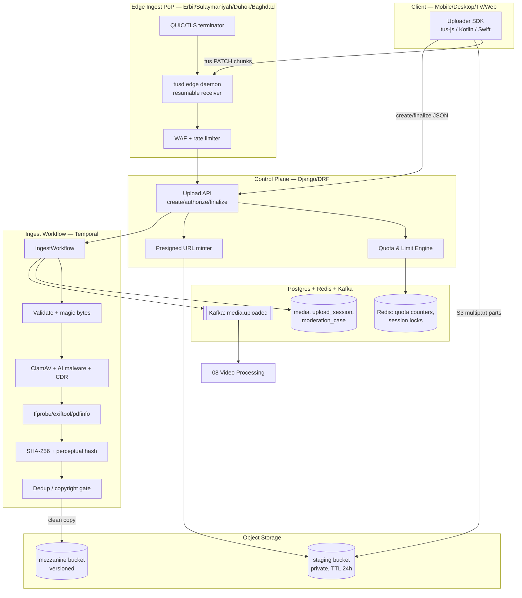
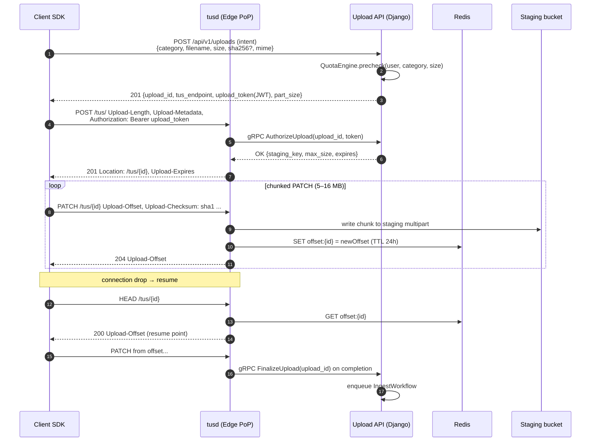
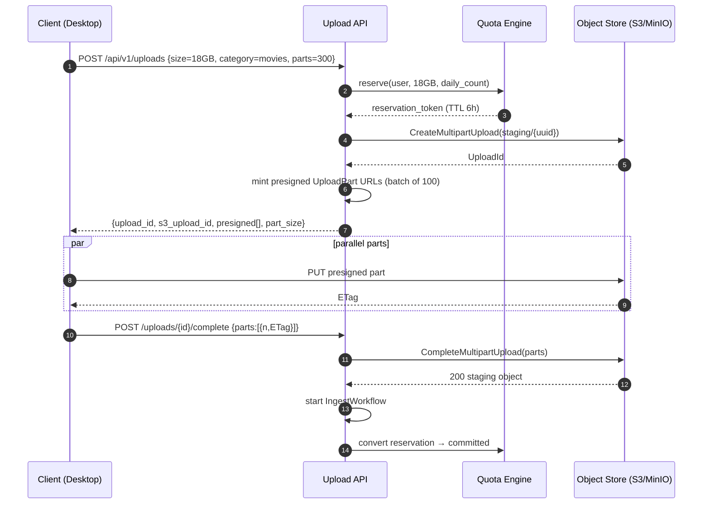
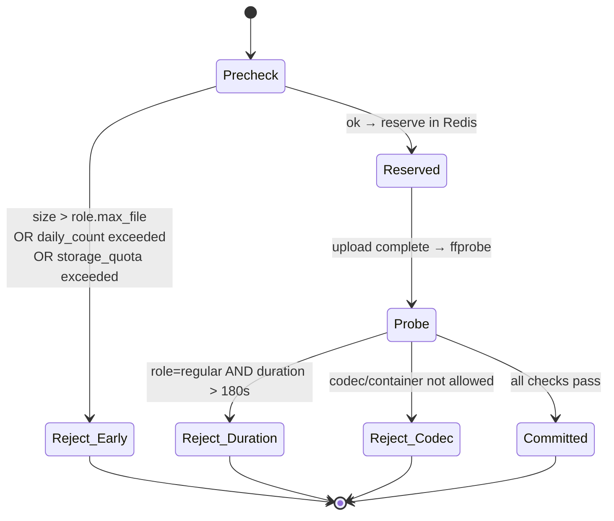
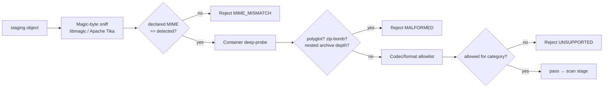
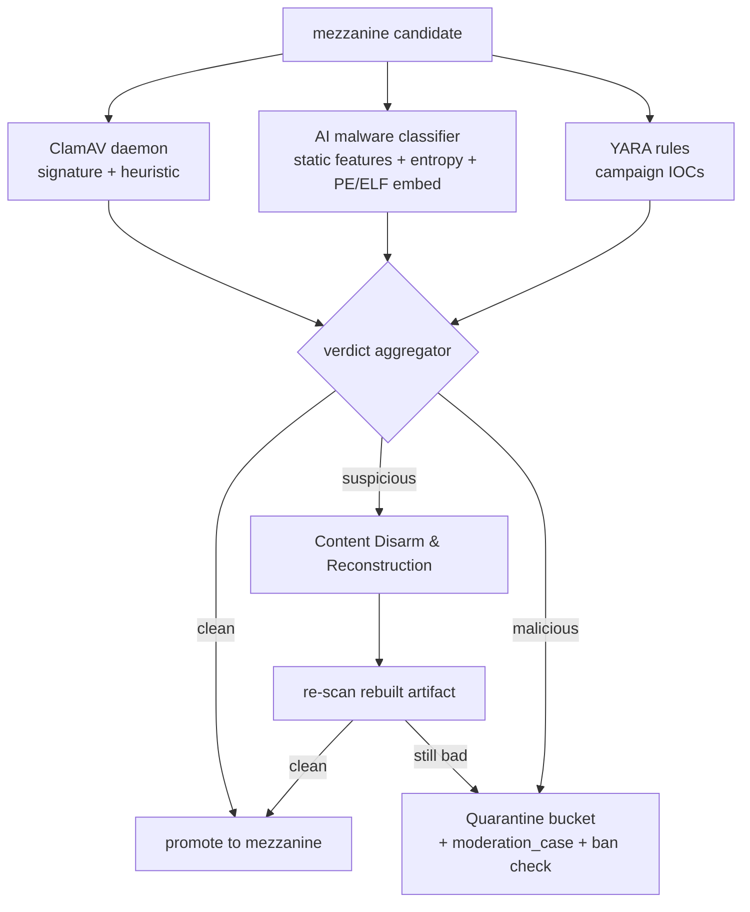
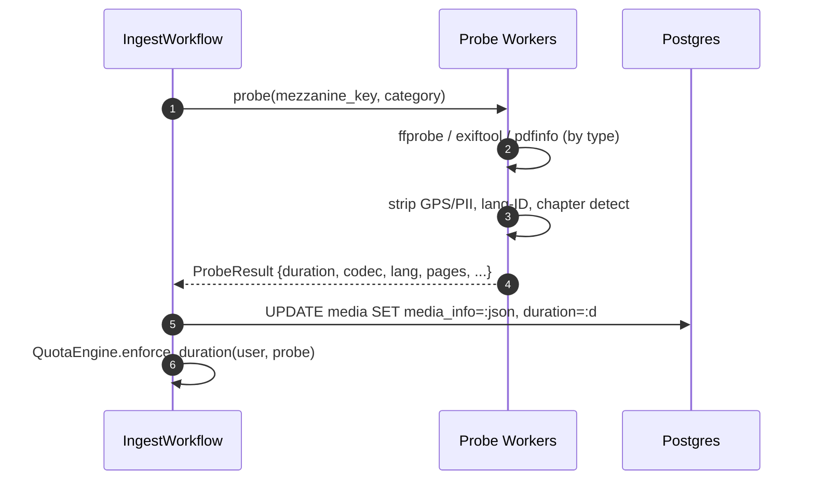
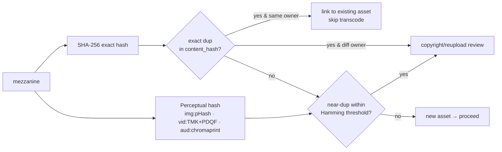
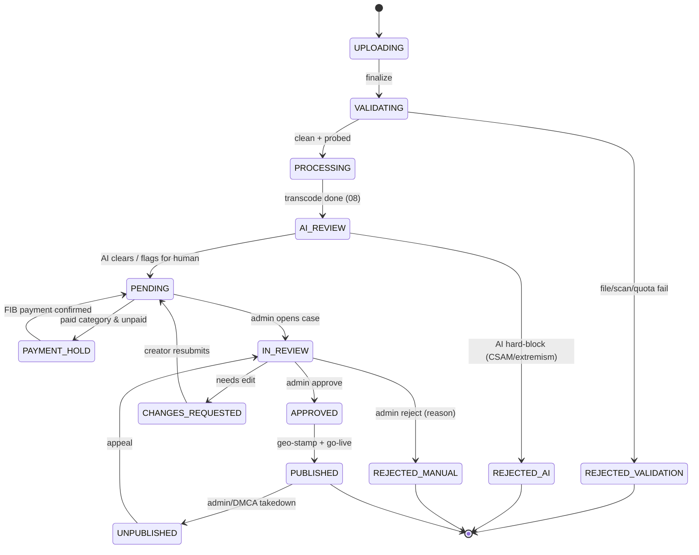
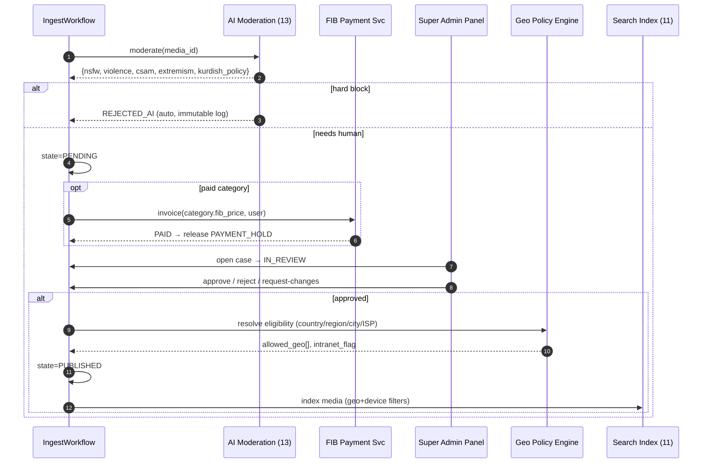

# 06 — Upload Pipeline & Admin-Approval Ingest

> **Domain:** Ingest Engine · **Codename:** `ZanaCloud Ingest`
> **Extends:** MediaCMS `uploader/` (FineUploader chunked upload), `files/models.py` (`Media.state`), `files/tasks.py`.
> **Downstream:** [08-video-processing.md](./08-video-processing.md) (transcode handoff), [13-ai-systems.md](./13-ai-systems.md) (AI moderation/scan), [16-digital-library-knowledge-hub.md](./16-digital-library-knowledge-hub.md) (book ingest), [17-file-archive-hub.md](./17-file-archive-hub.md) (generic files), [18-gaming-ecosystem.md](./18-gaming-ecosystem.md) (game builds).
> **Cross-refs:** [05-database-architecture.md](./05-database-architecture.md), [07-dynamic-category-system.md](./07-dynamic-category-system.md), [24-security.md](./24-security.md), [28-infrastructure-cost.md](./28-infrastructure-cost.md).
> **Status:** v1 blueprint (2026).

---

## 0. Scope & responsibilities

The Upload Pipeline is the **single front door** for every byte that enters ZanaCloud — video, audio, books (PDF/EPUB), images, documents, game builds, 3D/AR assets, and marketplace product media. It is responsible for everything between "user clicks upload" and "mezzanine artifact registered + handed to the per-category processing engine, awaiting admin approval."

Responsibilities:

1. **Resumable, chunked, accelerated ingest** — tus 1.0.0 resumable protocol + S3 multipart, edge ingest acceleration (PoP-terminated TLS, QUIC), 50 GB single-object ceiling, parallel parts.
2. **Direct-to-object-storage** — presigned multipart URLs so bytes bypass the app tier; the API plane only sees control messages.
3. **Validation & file-type verification** — magic-byte sniffing, container deep-probe, polyglot/zip-bomb defense, declared-vs-actual MIME reconciliation.
4. **Security scanning** — ClamAV signature scan + AI malware classifier + CDR (content-disarm) for documents.
5. **Metadata extraction** — `ffprobe` (A/V), `exiftool` (images/docs), `pdfinfo`/`epubcheck` (books), embedded-subtitle and chapter detection.
6. **Dedup & hashing** — SHA-256 content hash, perceptual hashes (pHash/aHash for images, TMK+PDQF for video, chromaprint for audio), copyright/duplicate gate.
7. **Role-based quota & limit enforcement** — the non-negotiable **3-minute regular-user video limit**, storage quota, daily upload count, per-category gating.
8. **Admin-approval state machine** — `Upload → Pending → Approval → Published` with hard moderation gates, FIB payment gates for paid categories, geo-eligibility stamping.

> **Non-goals here:** transcoding/ABR ladder ([08](./08-video-processing.md)), CDN delivery ([09-streaming-infrastructure.md](./09-streaming-infrastructure.md)), live ingest ([10-live-streaming.md](./10-live-streaming.md)). This doc ends at "media row in `state=pending`, mezzanine written, `media.uploaded` event emitted."

---

## 1. High-level architecture



### 1.1 Two ingest transports

| Transport | When used | Path | Resumable | Acceleration |
|-----------|-----------|------|-----------|--------------|
| **tus 1.0.0** (`tusd` at edge) | Mobile/flaky networks, < 5 GB, interactive | client → edge PoP → mezzanine | Yes (offset-based) | QUIC, edge-terminated |
| **S3 multipart presigned** | Desktop, large files (5 GB–50 GB), studio uploads | client → object store directly | Yes (per-part) | Transfer-acceleration endpoints |

Both converge on the same **`upload_session`** row and the same **IngestWorkflow**. The decision is made client-side by the Uploader SDK based on `Content-Length`, RTT probe, and device class (see [03-frontend-architecture.md](./03-frontend-architecture.md)).

---

## 2. Resumable upload protocol (tus)

We implement **tus 1.0.0** with the `creation`, `creation-with-upload`, `checksum`, `expiration`, and `concatenation` extensions. `tusd` runs as a stateless edge daemon; offsets are persisted in Redis (hot) + S3 (durable) so any PoP can resume.

### 2.1 tus handshake & resume



### 2.2 Edge ingest acceleration

- **PoP termination**: clients connect to the nearest of 6 Iraqi/Kurdistan PoPs (Erbil×2, Sulaymaniyah, Duhok, Kirkuk, Baghdad). TLS/QUIC terminates at edge; bytes ride the private backbone to the regional MinIO/S3 cluster, avoiding congested last-mile re-transmit over long RTT.
- **Intranet/FTTH mode**: when `network_mode=intranet` (see [02-system-architecture.md](./02-system-architecture.md)), PoPs route to the **in-country origin only**; no public-internet egress. Presigned URLs are minted against the ISP-local MinIO endpoint.
- **Parallel parts**: desktop SDK opens up to 8 concurrent multipart streams; `part_size` adapts (8 MB on mobile, 16–64 MB on FTTH).
- **Checksum offload**: SHA-1 per-chunk (tus `checksum` ext) caught at edge; full SHA-256 computed during the validation step (§5) to avoid trusting the client.

---

## 3. Direct-to-object-storage with presigned URLs

For the S3 multipart path the application tier never proxies media bytes.



**Presign policy:** URLs are scoped to a single object key, single HTTP verb, `x-amz-content-sha256` enforced where the client pre-hashed, 15-minute expiry (re-minted in batches), and a bucket policy denying any object > `max_size` for the user's role. Server-side encryption SSE-KMS with a per-tenant key (see [24-security.md](./24-security.md)).

---

## 4. Role-based quotas & the 3-minute limit

The **Quota & Limit Engine** is the policy gate invoked at *intent* (pre-upload, cheap reject), and re-validated at *finalize* (authoritative, post-probe — duration is only known after `ffprobe`).

### 4.1 Role matrix

| Role | Max video duration | Per-file size | Daily uploads | Storage quota | Categories | Notes |
|------|--------------------|---------------|---------------|---------------|------------|-------|
| `regular` | **≤ 180 s** (3 min) | 2 GB | 10 / day | 20 GB | open + paid (FIB) | hard duration gate |
| `verified` | ≤ 60 min | 20 GB | 100 / day | 2 TB | + premium verticals | KYC passed |
| `creator_pro` | ≤ 6 h | 50 GB | 500 / day | 20 TB | all media | studio access ([14](./14-creator-studio.md)) |
| `institution` | ≤ 12 h | 50 GB | 2000 / day | 200 TB | library/learning | universities, TV |
| `admin` | **unlimited** | 50 GB* | unlimited | unlimited | all | *single-object ceiling only |

\* The 50 GB is a single-object physical ceiling (multipart max), not a policy limit; admins chain or use the studio ingest for larger masters.

### 4.2 Enforcement flow



### 4.3 Quota engine implementation

Counters are **Redis token buckets + Postgres source-of-truth** (reconciled nightly). Atomicity via a Lua script to avoid TOCTOU races on concurrent uploads.

```python
# uploader/quota.py  (extends MediaCMS uploader)
class QuotaEngine:
    LIMITS = {
        "regular":     Limit(max_dur=180, max_file=2*GB,  daily=10,   storage=20*GB),
        "verified":    Limit(max_dur=3600, max_file=20*GB, daily=100,  storage=2*TB),
        "creator_pro": Limit(max_dur=21600, max_file=50*GB, daily=500,  storage=20*TB),
        "institution": Limit(max_dur=43200, max_file=50*GB, daily=2000, storage=200*TB),
        "admin":       Limit(max_dur=None, max_file=50*GB, daily=None, storage=None),
    }

    def precheck(self, user, category, size) -> Reservation:
        lim = self.LIMITS[user.effective_role]
        if lim.max_file and size > lim.max_file:
            raise QuotaError("FILE_TOO_LARGE", lim.max_file)
        # atomic daily-count + storage reservation
        ok = redis.eval(RESERVE_LUA, keys=[f"q:{user.id}:day", f"q:{user.id}:store"],
                        args=[size, lim.daily or -1, lim.storage or -1, DAY_TTL])
        if not ok:
            raise QuotaError("DAILY_OR_STORAGE_EXCEEDED")
        if category.is_paid and not user.has_paid(category):
            raise QuotaError("FIB_PAYMENT_REQUIRED", category.fib_price)
        return Reservation(token=uuid4(), size=size, ttl=now()+6*HOUR)

    def enforce_duration(self, user, probe: ProbeResult):
        lim = self.LIMITS[user.effective_role]
        if lim.max_dur is not None and probe.duration_s > lim.max_dur:
            raise QuotaError("DURATION_EXCEEDED",
                             limit=lim.max_dur, actual=probe.duration_s)
```

> The **3-minute rule** is enforced *twice*: a soft client-side warning (SDK reads duration locally) and the authoritative server gate in `enforce_duration` after `ffprobe`. A regular user cannot bypass it by spoofing client metadata because duration is re-derived from the actual mezzanine.

---

## 5. Validation & file-type verification

Declared MIME is never trusted. The validator runs a layered pipeline:



### 5.1 Per-category allowlists

| Category | Containers | Codecs / formats | Hard rejects |
|----------|-----------|------------------|--------------|
| Video | mp4, mov, mkv, webm, ts | H.264/5, AV1, VP9, ProRes | executables embedded, fragmented-but-truncated |
| Audio/Music | mp3, flac, wav, m4a, ogg | AAC, FLAC, Opus, MP3 | DRM-locked |
| Books ([16](./16-digital-library-knowledge-hub.md)) | pdf, epub, mobi, djvu | — | encrypted PDF, JS in PDF |
| Images | jpg, png, webp, avif, heic | — | SVG with `<script>`, EXIF GPS leaks (stripped) |
| Documents ([17](./17-file-archive-hub.md)) | docx, xlsx, pptx, odt, txt | — | macro-enabled (CDR strips) |
| Games ([18](./18-gaming-ecosystem.md)) | zip, apk, exe-installer | — | unsigned APK, known-malware hash |

### 5.2 Hardening checks

- **Polyglot defense**: reject files valid as two formats (e.g., GIFAR, PDF+ZIP) via Tika cross-validation.
- **Zip-bomb / decompression ratio**: reject archives with compression ratio > 100:1 or expanded size > 10× declared.
- **SVG/HTML sanitization**: DOMPurify server-side; strip scripts, external entities, XXE vectors.
- **PDF JavaScript & launch actions**: stripped via CDR (qpdf/Dangerzone-style rasterize-and-rebuild for untrusted institutional uploads).

---

## 6. Security scanning (ClamAV + AI + CDR)



- **ClamAV**: horizontally scaled `clamd` pods with hourly signature refresh; files streamed via `INSTREAM`. Files > 2 GB are scanned via chunked memory-mapped read.
- **AI malware classifier**: gradient-boosted + small transformer over static features (byte-entropy histogram, import table, section names, magic transitions). Scores 0–1; > 0.8 → malicious, 0.4–0.8 → CDR. Served on the ML serving tier ([13-ai-systems.md](./13-ai-systems.md)).
- **CDR**: rebuilds documents/images from their parse tree, dropping active content. Used for institutional doc uploads and suspicious files.
- **Quarantine**: malicious objects move to an isolated bucket with no public IAM; a `moderation_case` is opened and the uploader's trust score decremented (3 strikes → account review, see [24-security.md](./24-security.md)).

---

## 7. Metadata extraction

| Tool | Inputs | Extracts |
|------|--------|----------|
| `ffprobe` | video/audio | duration, codecs, resolution, fps, bitrate, color space (HDR/SDR), audio tracks, embedded subtitle tracks, chapters, loudness preview |
| `exiftool` | images/docs | dimensions, camera, **GPS (stripped before publish)**, color profile, creation date |
| `pdfinfo` / `pdftotext` | PDF books | page count, title/author, encryption flag, text extractability (for OCR decision) |
| `epubcheck` | EPUB | validity, TOC, spine, embedded fonts/DRM |
| `mediainfo` | fallback | container-agnostic stream summary |
| custom Kurdish lang-ID | text/subs | script (Arabic-Sorani vs Latin-Kurmanji), language tag → [34-kurdish-language-intelligence.md](./34-kurdish-language-intelligence.md) |

Extracted metadata is written to `media.media_info` (JSONB) and used by: quota duration gate (§4), category routing (§9), search indexing ([11-search-engine.md](./11-search-engine.md)), and recommendations ([12-recommendation-engine.md](./12-recommendation-engine.md)).



---

## 8. Dedup & hashing



- **Exact dedup**: SHA-256 in `content_hash(hash UNIQUE)`. Same owner re-upload → instant link, no re-transcode (cost saver, see [28-infrastructure-cost.md](./28-infrastructure-cost.md)). Different owner → copyright queue.
- **Near-dup / copyright**: video TMK+PDQF and audio chromaprint indexed in a vector store; Hamming/cosine threshold flags potential reuploads of licensed content into the moderation queue.
- **Block at edge**: a Bloom filter of known-malware and known-infringing hashes lets the edge reject before a full upload completes.

---

## 9. Admin-approval workflow state machine

The **non-negotiable** publishing flow: **Upload → Pending → Approval → Published**, with hard gates for moderation, FIB payment (paid categories), and geo-eligibility. Extends MediaCMS `Media.state` (`pending/public/private`) with a richer FSM.



### 9.1 State table

| State | Meaning | Who/what transitions | Visible to |
|-------|---------|----------------------|------------|
| `UPLOADING` | bytes in flight | client/tusd | owner |
| `VALIDATING` | scan/probe/quota | IngestWorkflow | owner |
| `PROCESSING` | transcoding ([08](./08-video-processing.md)) | transcode workflow | owner |
| `AI_REVIEW` | automated moderation ([13](./13-ai-systems.md)) | AI moderation | owner |
| `PENDING` | awaiting human admin | system | owner |
| `PAYMENT_HOLD` | FIB payment due | payment webhook | owner |
| `IN_REVIEW` | admin actively reviewing | admin (Super Admin Panel) | owner, admin |
| `CHANGES_REQUESTED` | edits needed | admin | owner |
| `APPROVED` | cleared, pre-publish | admin | owner, admin |
| `PUBLISHED` | live (geo-scoped) | system | public (per geo) |
| `UNPUBLISHED` | taken down | admin/DMCA | owner, admin |
| `REJECTED_*` | terminal rejection | system/admin | owner |

### 9.2 Approval orchestration



The **Super Admin Panel** (no-code, see [07-dynamic-category-system.md](./07-dynamic-category-system.md)) exposes the moderation queue with bulk approve/reject, reason templates, and the ability to **pin / promote / force-feature** approved content (handed to [12-recommendation-engine.md](./12-recommendation-engine.md)). Geo-fencing eligibility (country/region/city/ISP + intranet) is stamped at publish and re-evaluated at delivery ([09-streaming-infrastructure.md](./09-streaming-infrastructure.md)).

---

## 10. Data model (SQL DDL)

```sql
-- Upload session: one per intent, spans tus or S3-multipart
CREATE TABLE upload_session (
    id              UUID PRIMARY KEY DEFAULT gen_random_uuid(),
    user_id         BIGINT NOT NULL REFERENCES users_user(id),
    category_id     BIGINT NOT NULL REFERENCES categories(id),
    transport       TEXT NOT NULL CHECK (transport IN ('tus','s3_multipart')),
    declared_mime   TEXT NOT NULL,
    declared_size   BIGINT NOT NULL,
    staging_key     TEXT NOT NULL,
    s3_upload_id    TEXT,                  -- for multipart
    reservation_tok UUID NOT NULL,
    bytes_received  BIGINT NOT NULL DEFAULT 0,
    edge_pop        TEXT,                  -- erbil-1, sulay-1, ...
    network_mode    TEXT NOT NULL DEFAULT 'public'
                       CHECK (network_mode IN ('public','intranet','ftth')),
    status          TEXT NOT NULL DEFAULT 'uploading',
    expires_at      TIMESTAMPTZ NOT NULL,
    created_at      TIMESTAMPTZ NOT NULL DEFAULT now()
);
CREATE INDEX idx_upsess_user_status ON upload_session(user_id, status);
CREATE INDEX idx_upsess_expires ON upload_session(expires_at) WHERE status='uploading';

-- Content hashes for dedup/copyright
CREATE TABLE content_hash (
    id              BIGSERIAL PRIMARY KEY,
    media_id        BIGINT REFERENCES files_media(id) ON DELETE CASCADE,
    sha256          BYTEA NOT NULL,
    phash           BYTEA,                 -- perceptual (img/vid/aud)
    phash_kind      TEXT,                  -- 'phash','tmk_pdqf','chromaprint'
    UNIQUE (sha256)
);
CREATE INDEX idx_chash_phash ON content_hash USING gin (phash) ;

-- Extends Media.state with the FSM
CREATE TABLE media_review (
    media_id        BIGINT PRIMARY KEY REFERENCES files_media(id) ON DELETE CASCADE,
    state           TEXT NOT NULL DEFAULT 'uploading',
    ai_verdict      JSONB,                 -- nsfw/violence/csam/extremism scores
    payment_state   TEXT DEFAULT 'none'    -- none|hold|paid
                       CHECK (payment_state IN ('none','hold','paid')),
    fib_invoice_id  TEXT,
    reviewer_id     BIGINT REFERENCES users_user(id),
    reject_reason   TEXT,
    allowed_geo     JSONB,                 -- {countries:[], regions:[], cities:[], isps:[]}
    intranet_only   BOOLEAN NOT NULL DEFAULT false,
    pinned          BOOLEAN NOT NULL DEFAULT false,
    force_featured  BOOLEAN NOT NULL DEFAULT false,
    updated_at      TIMESTAMPTZ NOT NULL DEFAULT now()
);
CREATE INDEX idx_review_state ON media_review(state)
    WHERE state IN ('pending','in_review','payment_hold');

-- Immutable audit log of every transition
CREATE TABLE media_state_event (
    id          BIGSERIAL PRIMARY KEY,
    media_id    BIGINT NOT NULL,
    from_state  TEXT,
    to_state    TEXT NOT NULL,
    actor_id    BIGINT,                    -- null = system
    actor_kind  TEXT NOT NULL,             -- system|ai|admin|payment
    reason      TEXT,
    created_at  TIMESTAMPTZ NOT NULL DEFAULT now()
);
CREATE INDEX idx_msevent_media ON media_state_event(media_id, created_at);
```

---

## 11. REST + gRPC API

### 11.1 REST (DRF) — control plane

```
POST   /api/v1/uploads                 # create intent → reservation + transport
       req:  {category, filename, size, mime, sha256?, transport?}
       res:  201 {upload_id, transport, tus_endpoint|presigned[], part_size, token}
HEAD   /api/v1/uploads/{id}            # resume offset (tus mirror)
POST   /api/v1/uploads/{id}/complete  # S3 multipart finalize {parts:[{n,etag}]}
GET    /api/v1/uploads/{id}           # status (state machine position)
DELETE /api/v1/uploads/{id}           # abort + free reservation

# Admin / Super Admin Panel
GET    /api/v1/admin/review/queue?category=&state=pending
POST   /api/v1/admin/review/{media_id}/approve   {geo, intranet_only}
POST   /api/v1/admin/review/{media_id}/reject    {reason}
POST   /api/v1/admin/review/{media_id}/request-changes {note}
POST   /api/v1/admin/review/{media_id}/feature    {pin, force_featured}
```

Error envelope:

```json
{ "error": { "code": "DURATION_EXCEEDED", "limit_s": 180, "actual_s": 247,
             "hint": "Regular accounts are limited to 3-minute videos.",
             "upgrade": "/verify" } }
```

### 11.2 gRPC / protobuf — edge ↔ control plane

```protobuf
syntax = "proto3";
package zana.ingest.v1;

service IngestControl {
  rpc AuthorizeUpload (AuthorizeReq) returns (AuthorizeResp);
  rpc FinalizeUpload  (FinalizeReq)  returns (FinalizeResp);
  rpc ReportProgress  (ProgressReq)  returns (ProgressResp);
}

message AuthorizeReq {
  string upload_id = 1;
  string upload_token = 2;     // JWT minted by control plane
  string edge_pop = 3;
  string network_mode = 4;     // public|intranet|ftth
}
message AuthorizeResp {
  string staging_key = 1;
  uint64 max_size = 2;
  int64  expires_unix = 3;
  bool   accept = 4;
  string deny_reason = 5;
}
message FinalizeReq { string upload_id = 1; uint64 total_bytes = 2; bytes sha1 = 3; }
message FinalizeResp { bool started = 1; string workflow_id = 2; }
message ProgressReq { string upload_id = 1; uint64 offset = 2; }
message ProgressResp { bool ok = 1; }
```

---

## 12. Capacity & SLOs

| Metric | Target |
|--------|--------|
| Concurrent uploads (national peak) | 250,000 sessions |
| Edge ingest throughput / PoP | 40 Gbps |
| Single object ceiling | 50 GB |
| tus chunk size | 5–64 MB adaptive |
| Validation + scan latency (1 GB) | < 25 s p95 |
| Probe latency | < 5 s p95 |
| Intent→reservation API | < 120 ms p95 |
| Dedup short-circuit (exact) | < 800 ms |
| Quarantine isolation | immediate, 0 public IAM |
| Staging TTL | 24 h (auto-GC) |
| Audit log retention | 7 years (compliance) |

---

## 13. Failure & idempotency

- **Resume after crash**: tus offset in Redis + S3; S3 multipart parts are idempotent by `(uploadId, partNumber)`. Re-`complete` is safe (ETag set comparison).
- **Workflow idempotency**: Temporal `IngestWorkflow` keyed by `upload_id`; each activity (validate/scan/probe/hash) is retried with exponential backoff and is side-effect-idempotent (writes are upserts).
- **Orphan GC**: staging objects past TTL and `upload_session.status='uploading'` are swept hourly; reservations released back to the quota engine.
- **Exactly-once event**: `media.uploaded` Kafka event uses `upload_id` as the idempotency key; downstream ([08](./08-video-processing.md)) dedupes consumers.

---

## 14. Cross-references

- Quota/role identity model → [05-database-architecture.md](./05-database-architecture.md)
- Transcode handoff after `media.uploaded` → [08-video-processing.md](./08-video-processing.md)
- AI moderation verdicts in `AI_REVIEW` → [13-ai-systems.md](./13-ai-systems.md)
- Per-category routing & Super Admin Panel → [07-dynamic-category-system.md](./07-dynamic-category-system.md)
- Geo-fencing / intranet enforcement → [09-streaming-infrastructure.md](./09-streaming-infrastructure.md), [02-system-architecture.md](./02-system-architecture.md)
- Indexing published assets → [11-search-engine.md](./11-search-engine.md)
- Pin/promote/force-feature → [12-recommendation-engine.md](./12-recommendation-engine.md)
- Cost of dedup/transcode-skip → [28-infrastructure-cost.md](./28-infrastructure-cost.md)
