# 07 — Dynamic Category Experience System

> **Codename:** `ZanaCloud` · Experience Engine (`exp-engine`)
> **Part:** D — Category Ecosystems (Dynamic Experiences)
> **Depends on:** [02-system-architecture.md](./02-system-architecture.md), [03-frontend-architecture.md](./03-frontend-architecture.md), [11-search-engine.md](./11-search-engine.md), [12-recommendation-engine.md](./12-recommendation-engine.md), [33-platform-constraints.md](./33-platform-constraints.md)
> **Consumed by:** [16-digital-library-knowledge-hub.md](./16-digital-library-knowledge-hub.md), [17-file-archive-hub.md](./17-file-archive-hub.md), [18-gaming-ecosystem.md](./18-gaming-ecosystem.md), [19-learning-academy.md](./19-learning-academy.md), [20-marketplace.md](./20-marketplace.md)
> **Status:** Architecture & design blueprint (v1, 2026).

---

## 0. The thesis: there is no homepage

ZanaCloud has **no single universal homepage**. Instead, the platform is a tree of **Category Experiences**, each one a self-contained product surface with its own:

- **Layout** — a tree of rows/sections described by a JSON *Layout DSL*.
- **Widgets** — composable, data-bound UI units drawn from a versioned **Widget Registry**.
- **Ranking algorithm** — how items inside each widget are ordered (per category, per device, per geo).
- **Recommendation rules** — which candidate generators + rankers feed the "for you" surfaces.
- **Homepage sections** — the ordered, personalized sections a user sees on entering the category.
- **Device variants** — Mobile (TikTok-style), Desktop (FB+YouTube), TV (Netflix media-only).
- **Geo & network gating** — country/region/city/ISP + Intranet/FTTH visibility.
- **Monetization profile** — free by default; per-category FIB paywall (e.g. Books, Courses).

Everything above is **data, not code**. Admins create and reshape these experiences from a no-code **Category Management Dashboard** (a drag-and-drop visual page builder). The frontend is a **generic renderer**: it knows how to render *any* valid layout document, but contains no category-specific business logic.

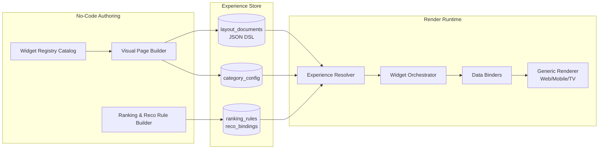

---

## 1. Domain model

### 1.1 Core entities

| Entity | Description |
|---|---|
| **Category** | A top-level experience (Movies, Kids, Gaming, Sports, Islamic, Music, News, Podcast, Library, Files, …). Self-similar; can nest. |
| **Subcategory** | A child Category (e.g. Movies → Kurdish Cinema). Inherits parent defaults; may override layout/widgets. |
| **LayoutDocument** | Versioned JSON describing the page tree for one (category × device × variant). |
| **Widget** | An instance of a registered widget type, with bound data source + ranking + style. |
| **WidgetType** | A registry entry: schema of props, supported devices, data contract, render component id. |
| **DataSource** | A declarative query (search/reco/curated/live) that feeds a widget. |
| **RankingRule** | An ordering policy applied to a data source. |
| **RecoBinding** | A mapping from a widget to recommendation pipelines (see [12](./12-recommendation-engine.md)). |
| **ExperienceVersion** | An immutable snapshot of a category's full config (layout+widgets+rules) — enables preview, A/B, rollback. |

### 1.2 Entity relationships

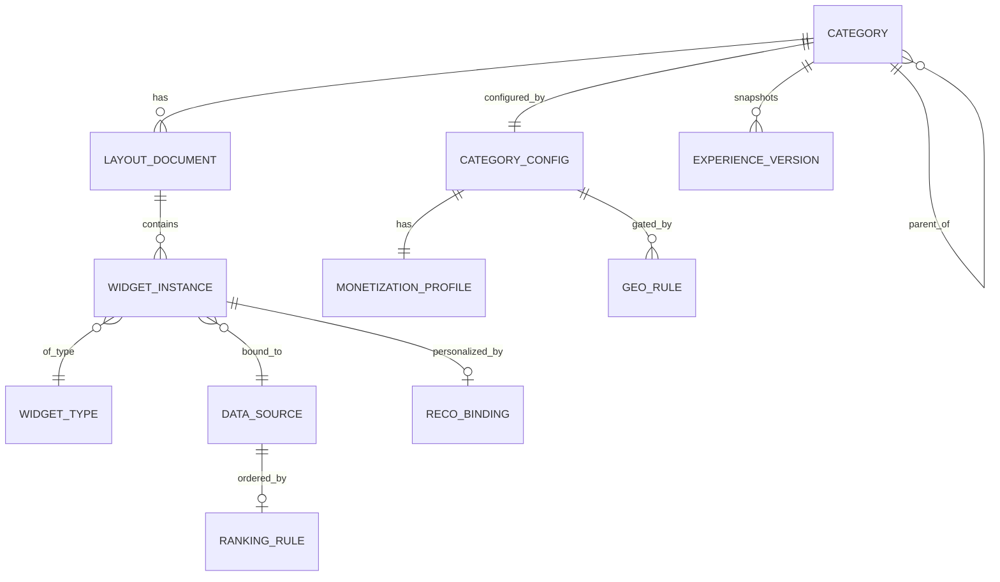

---

## 2. The Layout DSL (JSON)

A **LayoutDocument** is a typed tree. The root is a `page`; children are `section`s; sections hold `widget`s. Each node carries `device` visibility, `geo` gating, `experiments`, and `style` tokens. The DSL is **declarative and side-effect-free** — it never embeds executable code; logic lives in named, registry-resolved primitives.

### 2.1 Top-level schema

```json
{
  "$schema": "https://zanacloud.iq/schemas/layout/v3.json",
  "documentId": "lay_movies_default",
  "categorySlug": "movies",
  "version": 17,
  "status": "published",
  "variant": "default",
  "device": ["mobile", "desktop", "tv"],
  "locale_default": "ckb",
  "direction": "rtl",
  "theme": { "tokenSet": "cinema_dark", "accent": "#E50914" },
  "ai_generated": false,
  "personalization": { "enabled": true, "strategy": "per_user_sections_v4" },
  "page": {
    "type": "page",
    "header": { "ref": "widget:category_header" },
    "sections": [ /* ordered SectionNode[] */ ],
    "footer": { "ref": "widget:legal_footer" }
  },
  "meta": {
    "createdBy": "admin_142",
    "updatedAt": "2026-05-30T11:02:00Z",
    "changelog": "Promote 'Continue Watching' above 'Trending' on mobile"
  }
}
```

### 2.2 Section node

```json
{
  "type": "section",
  "id": "sec_continue_watching",
  "title": { "ckb": "بەردەوامبوون لە بینین", "ar": "متابعة المشاهدة", "en": "Continue Watching" },
  "layout": "carousel",
  "visibleIf": {
    "device": ["mobile", "desktop", "tv"],
    "auth": "required",
    "predicate": "user.has_in_progress(category='movies')"
  },
  "geo": { "include": ["IQ"], "regions": ["KRG"], "intranet": "inherit" },
  "experiments": [{ "key": "cw_position", "bucket": "B" }],
  "widget": {
    "type": "media_carousel",
    "instanceId": "w_cw_movies",
    "dataSource": "ds_continue_watching_movies",
    "ranking": "rank_recency_progress",
    "style": { "cardAspect": "16:9", "rows": 1, "showProgressBar": true }
  }
}
```

### 2.3 Data source node

```json
{
  "id": "ds_trending_movies",
  "kind": "ranked_query",
  "engine": "search",                 // search | reco | curated | live | sql_view | external
  "query": {
    "index": "media_movies",
    "filter": { "type": "movie", "status": "published", "geo_ok": true },
    "boost": { "freshness": 0.3, "engagement": 0.5, "kurdish_origin": 0.2 }
  },
  "window": { "lookback": "P7D", "limit": 40 },
  "fallback": "ds_editorial_trending_movies",
  "cache": { "ttl": "PT2M", "key": "trending:movies:{geo}:{device}" }
}
```

### 2.4 JSON-Schema (abbreviated, normative)

```json
{
  "$id": "https://zanacloud.iq/schemas/layout/v3.json",
  "type": "object",
  "required": ["documentId", "categorySlug", "version", "page"],
  "properties": {
    "device": { "type": "array", "items": { "enum": ["mobile", "desktop", "tv"] } },
    "direction": { "enum": ["rtl", "ltr", "auto"] },
    "page": { "$ref": "#/$defs/page" }
  },
  "$defs": {
    "page": {
      "type": "object",
      "required": ["type", "sections"],
      "properties": {
        "type": { "const": "page" },
        "sections": { "type": "array", "items": { "$ref": "#/$defs/section" } }
      }
    },
    "section": {
      "type": "object",
      "required": ["type", "id", "widget"],
      "properties": {
        "type": { "const": "section" },
        "layout": { "enum": ["row", "carousel", "grid", "hero", "masonry", "list", "split", "fullbleed"] },
        "widget": { "$ref": "#/$defs/widgetInstance" },
        "visibleIf": { "$ref": "#/$defs/predicate" },
        "geo": { "$ref": "#/$defs/geoRule" }
      }
    },
    "widgetInstance": {
      "type": "object",
      "required": ["type", "instanceId"],
      "properties": {
        "type": { "type": "string" },
        "dataSource": { "type": "string" },
        "ranking": { "type": "string" },
        "style": { "type": "object" }
      }
    },
    "predicate": {
      "type": "object",
      "properties": {
        "device": { "type": "array" },
        "auth": { "enum": ["any", "required", "anonymous"] },
        "predicate": { "type": "string" }
      }
    },
    "geoRule": {
      "type": "object",
      "properties": {
        "include": { "type": "array" }, "exclude": { "type": "array" },
        "regions": { "type": "array" }, "cities": { "type": "array" },
        "isps": { "type": "array" }, "intranet": { "enum": ["only", "exclude", "inherit"] }
      }
    }
  }
}
```

> **Predicate safety:** `predicate` strings are not eval'd. They are parsed into an AST against a whitelisted grammar (`user.*`, `device.*`, `time.*`, `geo.*`, `flag.*`) and compiled to a sandboxed boolean evaluator. See [24-security.md](./24-security.md).

---

## 3. Widget Registry

The Widget Registry is a versioned catalog. A `WidgetType` declares: id, props schema (JSON-Schema), data contract (the shape it expects from a data source), supported devices, supported ranking modes, and the client render component id (resolved per platform: web component, RN component, TV/lrud component).

### 3.1 Registry entry schema

```json
{
  "widgetTypeId": "media_carousel",
  "version": "4.2.0",
  "displayName": { "en": "Media Carousel", "ckb": "کاروسێلی میدیا" },
  "category": "collection",
  "devices": ["mobile", "desktop", "tv"],
  "dataContract": {
    "item": { "id": "string", "title": "i18n", "thumb": "url", "badge?": "string", "progress?": "0..1" }
  },
  "props": {
    "cardAspect": { "enum": ["2:3", "16:9", "1:1"], "default": "16:9" },
    "rows": { "type": "integer", "min": 1, "max": 3, "default": 1 },
    "showProgressBar": { "type": "boolean", "default": false },
    "autoplayPreview": { "type": "boolean", "default": false }
  },
  "rankingModes": ["editorial", "engagement", "recency", "personalized"],
  "renderComponents": {
    "web": "Carousel",
    "mobile": "RNCarousel",
    "tv": "FocusableCarousel"
  },
  "permissions": ["category.read"]
}
```

### 3.2 Widget catalog

| Widget type | Purpose | Devices | Primary data engine |
|---|---|---|---|
| `category_header` | Branded header + nav chips | all | curated |
| `hero_banner` | Single/rotating cinematic hero | desktop, tv, mobile | curated/reco |
| `hero_billboard` | Netflix-style autoplaying billboard | tv, desktop | reco |
| `media_carousel` | Horizontal scroll of cards | all | search/reco/curated |
| `media_grid` | Paginated grid | desktop, mobile | search |
| `shorts_rail` | Vertical TikTok feed embed | mobile | reco |
| `continue_watching` | In-progress resume rail | all | sql_view |
| `top_10_ranked` | Numbered top-10 with rank glyphs | all | ranked_query |
| `genre_chips` | Filter chips → sub-feeds | all | curated |
| `live_now` | Live channels/streams | all | live |
| `scoreboard` | Sports live scores ticker | all | live (sports feed) |
| `standings_table` | League standings | desktop, tv | sql_view |
| `fixtures_list` | Upcoming fixtures | all | external feed |
| `bracket` | Tournament bracket tree | desktop, tv | sql_view |
| `chart_widget` | Music/ranking charts | all | ranked_query |
| `radio_player` | Live radio stations | all | live |
| `prayer_times` | Geo-aware prayer schedule | all | computed |
| `qibla_compass` | Device-sensor Qibla | mobile | computed |
| `quran_reader` | Mushaf reader w/ tafsir | all | curated |
| `hijri_calendar` | Hijri/Gregorian calendar | all | computed |
| `trending_now` | Trending entities ticker | all | ranked_query |
| `fact_check_panel` | News verification panel | all | curated/AI |
| `audio_dock` | Persistent background-audio mini player | mobile, desktop | client-state |
| `playlist_rail` | Music/podcast playlists | all | curated/reco |
| `creator_spotlight` | Featured channel/author | all | curated |
| `paywall_card` | FIB purchase/unlock CTA | all | billing |
| `collection_shelf` | Curated collection group | all | curated |

### 3.3 Registry governance

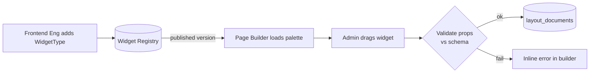

Widget types are **additively versioned** (semver). A layout pins a major version; the renderer resolves the latest compatible minor. Deprecated widgets remain renderable but are hidden from the palette.

---

## 4. Drag-and-drop Visual Page Builder

### 4.1 Architecture

```mermaid
flowchart TB
    subgraph Client[Admin SPA — Page Builder]
        PAL[Widget Palette<br/>from Registry]
        CANVAS[Canvas: device-framed live preview]
        INSP[Inspector: props/data/ranking/geo]
        TREE[Layout Tree (outline)]
        PREVIEW[Preview-as: user/device/geo/persona]
    end
    subgraph BFF[Builder BFF]
        DRAFT[Draft Service]
        VAL[Schema + Lint Validator]
        DIFF[Versioned Diff]
        SIM[Reco/Ranking Simulator]
    end
    subgraph Store
        LD[(layout_documents)]
        EV[(experience_versions)]
    end
    PAL --> CANVAS
    CANVAS <--> INSP
    CANVAS <--> TREE
    CANVAS --> PREVIEW
    INSP --> DRAFT --> VAL --> DIFF --> EV
    DRAFT --> LD
    PREVIEW --> SIM
```

### 4.2 Builder capabilities (no-code)

- **Drag** widget from palette → drop into a section; **reorder** sections via handle.
- **Bind data** in the Inspector: pick engine (search/reco/curated/live), filters, boosts, ranking rule — all from dropdowns; advanced users can open a JSON view.
- **Curate** a manual list (drag specific items) for `curated` sources.
- **Gate**: set device/geo/auth/intranet/monetization per section without code.
- **Preview-as**: render the page as `(device × geo × persona × locale × network)` using the Simulator, so admins see exactly what a Mobile user in Erbil on FTTH sees.
- **Schedule**: publish window (`go_live_at` / `expire_at`), e.g. Ramadan layout.
- **Experiment**: attach an A/B key + buckets to any section.
- **Save → Validate → Publish**: publishing mints an immutable `ExperienceVersion`; instant rollback to any prior version.

### 4.3 Draft → publish lifecycle

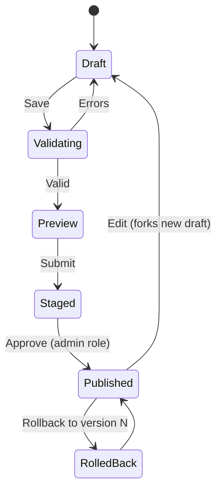

---

## 5. Rendering pipeline

### 5.1 Resolution flow

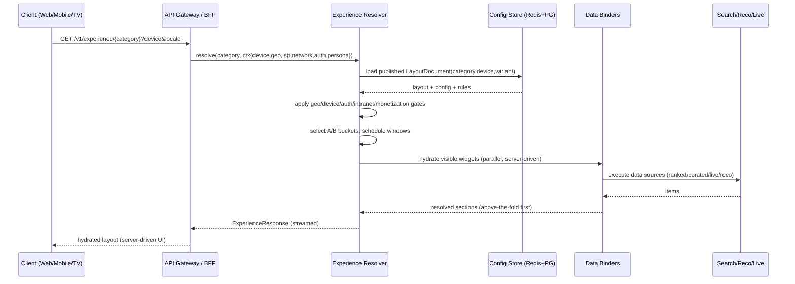

### 5.2 Server-Driven UI contract

The client receives a **fully resolved** experience: each section already includes its visible items, ranking applied, paywall state, and which render component to mount. The client mounts components by `renderComponents[device]` from the registry. This keeps category logic server-side and lets admins ship changes with **zero app release** (see [03-frontend-architecture.md](./03-frontend-architecture.md)).

```json
{
  "category": "movies",
  "device": "tv",
  "direction": "rtl",
  "sections": [
    {
      "id": "sec_hero",
      "component": "FocusableBillboard",
      "props": { "accent": "#E50914" },
      "items": [{ "id": "m_8841", "title": {"ckb":"…"}, "art": "…", "trailer": "…", "paywall": null }]
    },
    {
      "id": "sec_continue_watching",
      "component": "FocusableCarousel",
      "props": { "showProgressBar": true },
      "items": [ /* … */ ]
    }
  ],
  "experiments": { "cw_position": "B" },
  "ttl": 120
}
```

### 5.3 Performance & caching

- **Above-the-fold streaming**: hero + first 2 rails resolved synchronously; remaining sections lazy-resolved via `/v1/experience/{cat}/section/{id}`.
- **Cache layers**: (1) anonymous/geo-bucketed full-page cache (Redis, TTL per data source); (2) personalized sections cached per-user with short TTL; (3) live widgets bypass cache and poll/stream.
- **Edge rendering**: for Intranet/FTTH, the Experience Resolver runs at the ISP edge node with a synced config replica (see [33](./33-platform-constraints.md)).

---

## 6. Ranking & Recommendation binding

### 6.1 Ranking rules

A `RankingRule` is a named, reusable ordering policy. Rules combine signal terms with weights; admins tune weights via sliders.

```json
{
  "ruleId": "rank_recency_progress",
  "signals": [
    { "term": "progress_recency", "weight": 0.6 },
    { "term": "last_watched_desc", "weight": 0.4 }
  ],
  "tieBreak": "title_asc"
}
```

```json
{
  "ruleId": "rank_movies_trending",
  "signals": [
    { "term": "watch_velocity_7d", "weight": 0.45 },
    { "term": "completion_rate", "weight": 0.25 },
    { "term": "freshness", "weight": 0.15 },
    { "term": "kurdish_origin_boost", "weight": 0.15 }
  ],
  "diversify": { "by": "genre", "maxPerGroup": 3 },
  "tieBreak": "rating_desc"
}
```

### 6.2 Recommendation binding to the Reco Engine

Each personalized widget binds to a **pipeline** in the Recommendation Engine ([12](./12-recommendation-engine.md)): candidate generators + ranker + filters. The binding is per-category, enabling different reco "brains" per experience.

```json
{
  "recoBindingId": "reco_movies_foryou",
  "category": "movies",
  "candidateGenerators": ["cf_movies", "content_embed_movies", "trending_movies", "editorial_movies"],
  "ranker": "ranker_movies_dnn_v3",
  "filters": ["geo_ok", "age_ok", "already_watched_exclude", "paywall_aware"],
  "diversity": { "genre": 0.3, "language": 0.2 },
  "explore_explore_ratio": 0.15,
  "context_features": ["device", "time_of_day", "daypart", "network_mode"]
}
```

### 6.3 Per-category recommendation mapping

| Category | Candidate generators | Ranker | Key signals / filters |
|---|---|---|---|
| Movies & TV | CF, content-embeddings, trending, editorial collections | `ranker_movies_dnn_v3` | completion rate, genre affinity, language pref, age, paywall-aware |
| Kids | curated-safe pool, age-band CF, educational graph | `ranker_kids_safe_v2` | **hard age gate (2-4/5-7/8-12)**, child-safe allowlist, screen-time, repeat-tolerant |
| Gaming | followed channels, game-similarity, live-boost, esports calendar | `ranker_gaming_v2` | live recency, game affinity, follow graph, language |
| Sports | team/league follows, fixtures proximity, highlight CF | `ranker_sports_v2` | followed teams, live events now, locality (favorite local clubs) |
| Islamic | curated scholars, topic graph, audio-affinity | `ranker_islamic_v1` | authenticity tier, reciter/scholar follow, locale, Hijri-season boost |
| Music | CF, audio-embeddings, playlist co-occurrence, radio | `ranker_music_v3` | language rows (ckb/ar/fa/tr/en), tempo/mood, skip-rate |
| News | freshness, region graph, source diversity, fact-checked boost | `ranker_news_v2` | recency-dominant, source credibility, locality, dedupe near-duplicates |
| Podcast | subscription graph, topic-embeddings, episode continuity | `ranker_podcast_v2` | resume-aware, download-intent, episode order, background-listen affinity |

---

## 7. AI Auto-Generated Homepage (per category)

The platform can **auto-author** a category's homepage layout. The AI Layout Composer takes catalog stats + audience analytics + business goals and emits a candidate LayoutDocument that admins can accept, edit, or reject. It never publishes autonomously — **admin approval is mandatory** ([33](./33-platform-constraints.md)).

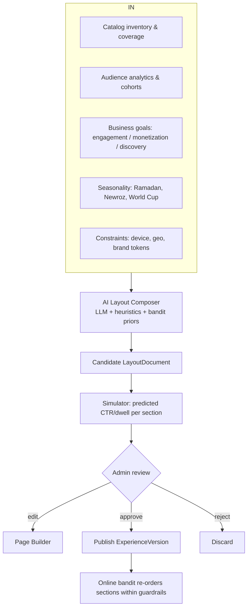

- **Composer output** is a normal LayoutDocument with `ai_generated: true` and per-section rationale.
- **Guardrailed online optimization**: post-publish, a contextual bandit may re-order sections *within admin-set bounds* (e.g. "Continue Watching never below position 3").
- **Seasonal templates**: the composer keeps template families (Ramadan, Newroz, election night, World Cup) it can instantiate on schedule.

---

## 8. Configuration storage — SQL DDL

```sql
-- =========================================================
-- Experience Engine core schema (PostgreSQL)
-- =========================================================
CREATE TABLE category (
  id              BIGSERIAL PRIMARY KEY,
  slug            TEXT UNIQUE NOT NULL,
  parent_id       BIGINT REFERENCES category(id) ON DELETE CASCADE,
  display_name    JSONB NOT NULL,             -- {ckb, ar, en, ...}
  kind            TEXT NOT NULL,              -- media | knowledge | files | commerce | ...
  direction       TEXT NOT NULL DEFAULT 'rtl',
  icon            TEXT,
  sort_order      INT NOT NULL DEFAULT 0,
  is_active       BOOLEAN NOT NULL DEFAULT TRUE,
  created_at      TIMESTAMPTZ NOT NULL DEFAULT now(),
  updated_at      TIMESTAMPTZ NOT NULL DEFAULT now()
);
CREATE INDEX idx_category_parent ON category(parent_id);

CREATE TABLE category_config (
  category_id     BIGINT PRIMARY KEY REFERENCES category(id) ON DELETE CASCADE,
  default_variant TEXT NOT NULL DEFAULT 'default',
  theme_tokens    JSONB NOT NULL DEFAULT '{}',
  personalization JSONB NOT NULL DEFAULT '{"enabled":true}',
  monetization    JSONB NOT NULL DEFAULT '{"mode":"free"}',  -- free | paywall | mixed (FIB)
  tv_visible      BOOLEAN NOT NULL DEFAULT TRUE,             -- TV hides Marketplace/Books/Journals unless true
  intranet_mode   TEXT NOT NULL DEFAULT 'inherit',           -- only | exclude | inherit
  updated_by      BIGINT,
  updated_at      TIMESTAMPTZ NOT NULL DEFAULT now()
);

CREATE TABLE layout_document (
  id              BIGSERIAL PRIMARY KEY,
  document_key    TEXT NOT NULL,             -- lay_movies_default
  category_id     BIGINT NOT NULL REFERENCES category(id) ON DELETE CASCADE,
  device          TEXT NOT NULL,             -- mobile | desktop | tv
  variant         TEXT NOT NULL DEFAULT 'default',
  version         INT NOT NULL,
  status          TEXT NOT NULL DEFAULT 'draft', -- draft | staged | published | archived
  ai_generated    BOOLEAN NOT NULL DEFAULT FALSE,
  body            JSONB NOT NULL,            -- the Layout DSL tree
  go_live_at      TIMESTAMPTZ,
  expire_at       TIMESTAMPTZ,
  created_by      BIGINT,
  created_at      TIMESTAMPTZ NOT NULL DEFAULT now(),
  UNIQUE (category_id, device, variant, version)
);
CREATE INDEX idx_layout_published
  ON layout_document(category_id, device, variant)
  WHERE status = 'published';

CREATE TABLE widget_type (
  id              BIGSERIAL PRIMARY KEY,
  type_id         TEXT NOT NULL,             -- media_carousel
  version         TEXT NOT NULL,             -- semver
  display_name    JSONB NOT NULL,
  devices         TEXT[] NOT NULL,
  data_contract   JSONB NOT NULL,
  props_schema    JSONB NOT NULL,
  ranking_modes   TEXT[] NOT NULL,
  render_components JSONB NOT NULL,
  deprecated      BOOLEAN NOT NULL DEFAULT FALSE,
  UNIQUE (type_id, version)
);

CREATE TABLE data_source (
  id              BIGSERIAL PRIMARY KEY,
  source_key      TEXT UNIQUE NOT NULL,
  category_id     BIGINT REFERENCES category(id) ON DELETE CASCADE,
  engine          TEXT NOT NULL,            -- search | reco | curated | live | sql_view | external
  spec            JSONB NOT NULL,           -- query/filter/boost/window
  ranking_rule    TEXT,
  cache_ttl_s     INT NOT NULL DEFAULT 60,
  fallback_key    TEXT
);

CREATE TABLE ranking_rule (
  rule_id         TEXT PRIMARY KEY,
  signals         JSONB NOT NULL,
  diversify       JSONB,
  tie_break       TEXT
);

CREATE TABLE reco_binding (
  binding_id      TEXT PRIMARY KEY,
  category_id     BIGINT NOT NULL REFERENCES category(id) ON DELETE CASCADE,
  candidate_generators TEXT[] NOT NULL,
  ranker          TEXT NOT NULL,
  filters         TEXT[] NOT NULL,
  diversity       JSONB,
  explore_ratio   NUMERIC(4,3) NOT NULL DEFAULT 0.15
);

CREATE TABLE experience_version (
  id              BIGSERIAL PRIMARY KEY,
  category_id     BIGINT NOT NULL REFERENCES category(id) ON DELETE CASCADE,
  version         INT NOT NULL,
  snapshot        JSONB NOT NULL,           -- frozen {layouts, config, rules, bindings}
  note            TEXT,
  published_by    BIGINT,
  published_at    TIMESTAMPTZ NOT NULL DEFAULT now(),
  UNIQUE (category_id, version)
);

CREATE TABLE geo_rule (
  id              BIGSERIAL PRIMARY KEY,
  scope_type      TEXT NOT NULL,            -- category | layout | section
  scope_id        TEXT NOT NULL,
  include_countries TEXT[], exclude_countries TEXT[],
  regions         TEXT[], cities TEXT[], isps TEXT[],
  intranet        TEXT NOT NULL DEFAULT 'inherit'
);

CREATE TABLE experiment_binding (
  id              BIGSERIAL PRIMARY KEY,
  scope_id        TEXT NOT NULL,            -- section id
  exp_key         TEXT NOT NULL,
  buckets         JSONB NOT NULL,           -- {A:{...},B:{...}}
  traffic_split   JSONB NOT NULL
);
```

---

## 9. REST / RPC API specification

### 9.1 Public (client) API

| Method | Path | Purpose |
|---|---|---|
| `GET` | `/v1/experience/{categorySlug}` | Resolve full experience for current ctx (device/geo/auth). |
| `GET` | `/v1/experience/{categorySlug}/section/{sectionId}` | Lazy-load a section's items. |
| `GET` | `/v1/categories` | Visible category tree for ctx (respects TV/geo/intranet gates). |
| `POST` | `/v1/experience/{categorySlug}/event` | Emit interaction events (impression/click/dwell) for ranking. |

**Example — resolve experience**

```http
GET /v1/experience/movies?device=tv&locale=ckb HTTP/1.1
X-Geo-Country: IQ
X-Geo-Region: KRG
X-Network-Mode: ftth
Authorization: Bearer <jwt>
```

```json
200 OK
{
  "category": "movies",
  "version": 17,
  "device": "tv",
  "sections": [ /* server-driven UI (see §5.2) */ ],
  "ttl": 120,
  "experiments": { "cw_position": "B" }
}
```

### 9.2 Admin (no-code builder) API

| Method | Path | Purpose |
|---|---|---|
| `POST` | `/v1/admin/categories` | Create category/subcategory. |
| `PATCH` | `/v1/admin/categories/{id}` | Modify config (theme, monetization, TV/geo/intranet gates). |
| `DELETE` | `/v1/admin/categories/{id}` | Archive category. |
| `GET` | `/v1/admin/widgets` | Widget Registry palette. |
| `POST` | `/v1/admin/layouts/{id}/draft` | Create/update a draft layout from builder. |
| `POST` | `/v1/admin/layouts/{id}/validate` | Schema + lint validation. |
| `POST` | `/v1/admin/layouts/{id}/preview` | Render preview-as (device/geo/persona). |
| `POST` | `/v1/admin/layouts/{id}/publish` | Publish → mint ExperienceVersion. |
| `POST` | `/v1/admin/layouts/{id}/rollback` | Rollback to version N. |
| `POST` | `/v1/admin/ranking-rules` | Create/update ranking rule. |
| `POST` | `/v1/admin/reco-bindings` | Bind widgets to reco pipelines. |
| `POST` | `/v1/admin/ai/compose-homepage` | Request AI Layout Composer candidate. |

**Example — create subcategory**

```http
POST /v1/admin/categories HTTP/1.1
Authorization: Bearer <admin-jwt>
Content-Type: application/json

{
  "slug": "movies-kurdish",
  "parentSlug": "movies",
  "display_name": { "ckb": "سینەمای کوردی", "ar": "السينما الكردية", "en": "Kurdish Cinema" },
  "kind": "media",
  "inheritLayoutFrom": "movies",
  "config": { "monetization": { "mode": "free" }, "tv_visible": true }
}
```

---

## 10. Device & gating matrix

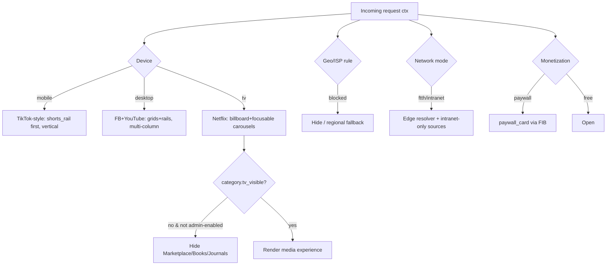

| Surface | Mobile | Desktop | TV |
|---|---|---|---|
| Default layout family | vertical/short-first | multi-column FB+YT | billboard+carousels |
| Marketplace | shown | shown | **hidden unless `tv_visible`** |
| Books / Journals (Library) | shown | shown | **hidden unless `tv_visible`** |
| Files | shown | shown | hidden by default |
| Media (Movies/Kids/Music/Sports/Islamic/News/Podcast) | shown | shown | shown |

---

# Part II — Concrete per-category experience designs

Each design below is expressed as: (a) section list (the homepage), (b) special pages, (c) widget bindings, (d) ranking/reco notes. All are produced by the *same* engine; only the data differs.

---

## 11. Movies & TV (Netflix-style)

### 11.1 Homepage sections (TV variant)

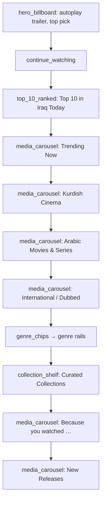

### 11.2 Special pages

- **Title page**: hero art, synopsis (i18n), cast/crew, episodes (for series), related, dubbing tracks ([15](./15-ai-dubbing-studio.md)), download (offline), paywall state.
- **Actor / Director page**: bio, filmography carousel, "starring with" graph.
- **Collection page**: curated grouping (e.g. "Newroz Picks", "Kurdish Classics").
- **Genre page**: filtered grid + sub-genre chips.

### 11.3 Bindings

| Section | Widget | Data engine | Ranking / Reco |
|---|---|---|---|
| Hero | `hero_billboard` | reco | `reco_movies_foryou` top-1 w/ editorial override |
| Continue Watching | `continue_watching` | sql_view | `rank_recency_progress` |
| Top 10 | `top_10_ranked` | ranked_query | `rank_movies_trending` (geo-scoped) |
| Kurdish/Arabic/Intl rows | `media_carousel` | search | language-filtered + `rank_movies_trending` |
| Because you watched | `media_carousel` | reco | `reco_movies_foryou` seeded by last title |

---

## 12. Kids (YouTube-Kids style)

### 12.1 Safety-first model

Kids is a **hard-gated** experience: a parent/guardian selects an **age band** (2-4, 5-7, 8-12); the band drives an allowlist-only candidate pool, disables open search, hides comments, and enforces screen-time + bedtime rules.

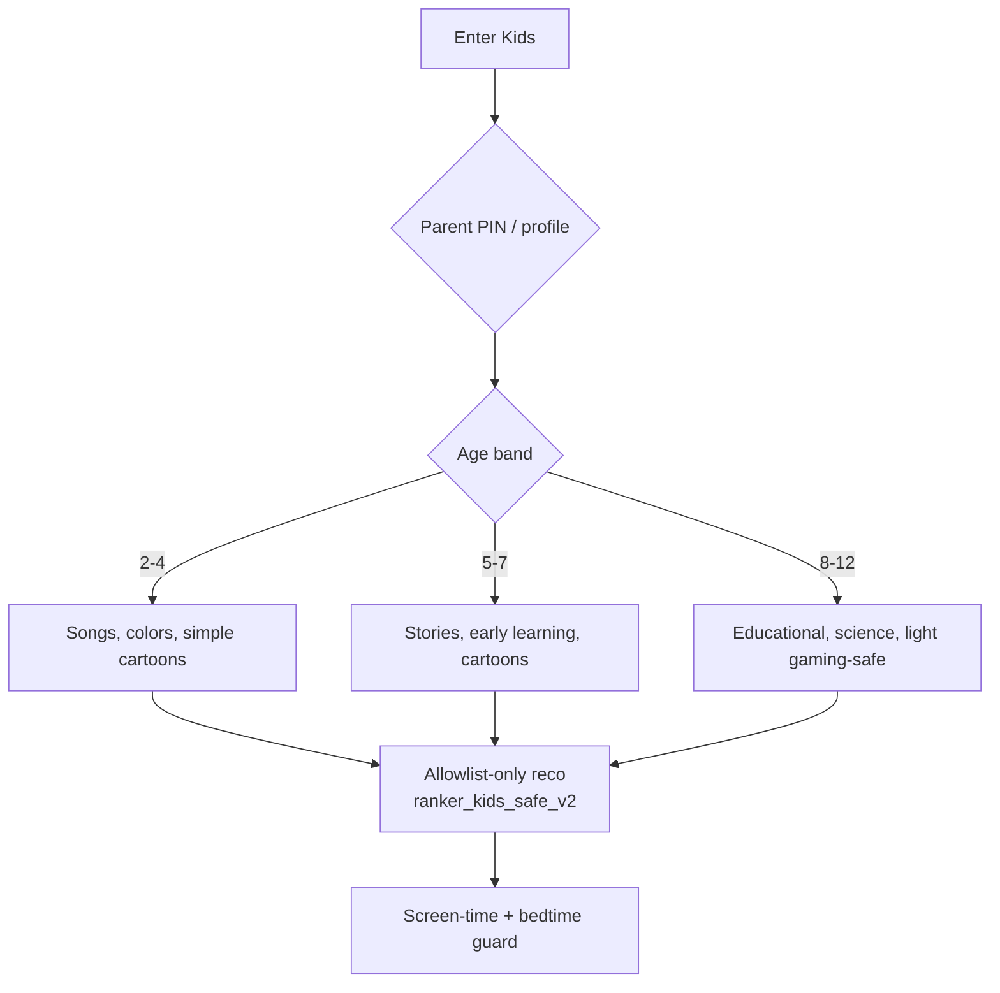

### 12.2 Homepage sections

| Order | Section | Widget | Notes |
|---|---|---|---|
| 1 | Big friendly hero | `hero_banner` | rounded, high-contrast, no autoplay sound |
| 2 | Continue (if any) | `continue_watching` | resume |
| 3 | Songs & Rhymes | `media_carousel` | repeat-tolerant |
| 4 | Cartoons | `media_carousel` | band-filtered |
| 5 | Learn & Grow (Educational) | `media_carousel` | curriculum-tagged |
| 6 | Stories | `media_carousel` | bedtime-friendly |
| 7 | Made in Kurdistan | `media_carousel` | Kurdish kids content boost |

### 12.3 Reco notes

`ranker_kids_safe_v2`: candidates only from `kids_allowlist`; filters = **hard age gate**, profanity/violence classifier (see [25](./25-content-moderation.md)), repeat-friendly (children re-watch), no autoplay into non-kids content, parental controls override everything.

---

## 13. Gaming (Twitch + Steam hybrid)

### 13.1 Homepage sections

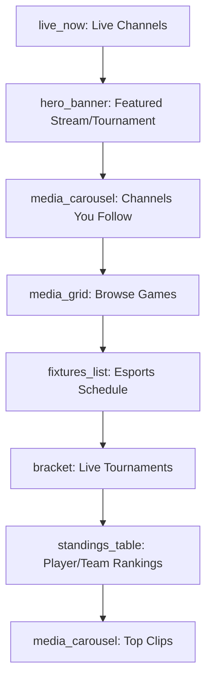

### 13.2 Special pages

- **Game page**: about, live channels playing it, top clips, leaderboards, related games, store/download link ([17](./17-file-archive-hub.md), [18](./18-gaming-ecosystem.md)).
- **Channel page**: live player, VODs, schedule, follow, chat.
- **Tournament page**: bracket tree, live matches, standings, prize pool.

### 13.3 Bindings — live boost

`ranker_gaming_v2`: live recency dominates; followed channels pinned when live; game-affinity from playtime/watch graph; esports calendar proximity boost. `bracket` and `standings_table` bound to `sql_view`s over the gaming tournament DB ([18](./18-gaming-ecosystem.md)).

---

## 14. Sports (ESPN-style)

### 14.1 Homepage sections

| Order | Section | Widget | Engine |
|---|---|---|---|
| 1 | Live Scores ticker | `scoreboard` | live feed |
| 2 | Your Teams | `media_carousel` | reco (follows) |
| 3 | Today's Fixtures | `fixtures_list` | external feed |
| 4 | Standings | `standings_table` | sql_view |
| 5 | Highlights | `media_carousel` | reco/search |
| 6 | Local Leagues (Iraqi/KRG) | `collection_shelf` | curated |
| 7 | News & Analysis | `media_carousel` | search |

### 14.2 Special pages

- **Match page**: live score, timeline/commentary, lineups, stats, highlights, post-match VOD.
- **Team page**: fixtures, squad, standings position, news, highlight reel.
- **Player page**: stats, bio, clips, transfer history.

### 14.3 Reco / data

`ranker_sports_v2`: followed teams + live-now boost + locality (favorite local clubs). Live data via external sports feed adapter with edge caching; Intranet mode mirrors the feed to ISP edge.

---

## 15. Islamic

### 15.1 Homepage sections

```mermaid
flowchart TB
    PT[prayer_times: geo-aware, next prayer countdown] --> HIJRI[hijri_calendar]
    HIJRI --> QIBLA[qibla_compass (mobile)]
    QIBLA --> LIVE[live_now: Live Mosque streams]
    LIVE --> QURAN[quran_reader: Continue reading]
    QURAN --> TAFSIR[media_carousel: Tafsir lessons]
    TAFSIR --> NASHEED[playlist_rail: Nasheeds]
    NASHEED --> POD[playlist_rail: Islamic Podcasts]
    POD --> SCHOLARS[creator_spotlight: Scholars]
```

### 15.2 Special widgets / pages

- **prayer_times**: computed from geolocation + calculation method (Umm al-Qura, MWL, etc.), with adhan notifications; respects Intranet (offline computation).
- **quran_reader**: Mushaf view, multiple recitations, word-by-word, tafsir toggle, bookmarks, night mode (see Library [16](./16-digital-library-knowledge-hub.md) reading engine).
- **qibla_compass**: device magnetometer + great-circle bearing to Mecca.
- **hijri_calendar**: Hijri/Gregorian dual, religious dates, Ramadan/Eid theming hooks.
- **Reciter / Scholar pages**: recitations, lessons, follow.

### 15.3 Reco / authenticity

`ranker_islamic_v1`: **authenticity tier** is a first-class filter (content vetted by approved scholarly board, see [25](./25-content-moderation.md)); reciter/scholar follow graph; Hijri-season boosts (Ramadan → Quran/tafsir surfaces rise). Ramadan layout auto-instantiated by the AI Composer (§7).

---

## 16. Music (Spotify + Radio Javan style)

### 16.1 Homepage sections

| Order | Section | Widget | Notes |
|---|---|---|---|
| 1 | Audio dock (persistent) | `audio_dock` | background playback |
| 2 | Good <daypart> hero | `hero_banner` | time-aware greeting |
| 3 | Made for You (mixes) | `playlist_rail` | reco |
| 4 | Charts | `chart_widget` | Top 50 Iraq/KRG |
| 5 | Radio | `radio_player` | live stations |
| 6 | Kurdish (Sorani/Kurmanji) | `media_carousel` | language row |
| 7 | Arabic | `media_carousel` | language row |
| 8 | Persian | `media_carousel` | language row |
| 9 | Turkish | `media_carousel` | language row |
| 10 | English / International | `media_carousel` | language row |
| 11 | New Releases | `media_carousel` | recency |

### 16.2 Special pages

- **Artist page**: top tracks, albums, radio, related artists, follow.
- **Album / Playlist page**: tracklist, queue-all, save, collaborative playlists.
- **Radio page**: live station, now-playing, schedule.

### 16.3 Reco / audio

`ranker_music_v3`: audio-embedding similarity + CF + playlist co-occurrence; language-row affinity (a Sorani-leaning user gets Kurdish boosted but cross-language discovery preserved via explore ratio); skip-rate as negative signal; background-listen + tempo/mood context features.

---

## 17. News

### 17.1 Homepage sections

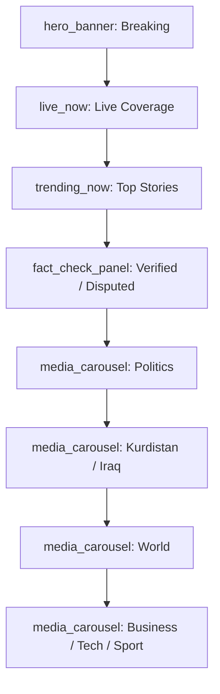

### 17.2 Fact-check panel

`fact_check_panel` surfaces AI + human verification status (Verified / Disputed / Misleading / Unverified) with sources and a confidence band (see [13](./13-ai-systems.md), [25](./25-content-moderation.md)). Disputed items are visually flagged and de-boosted.

### 17.3 Reco / freshness

`ranker_news_v2`: recency-dominant; source-credibility weighting; locality boost (Kurdistan/Iraq); near-duplicate dedupe (cluster stories, show one with "more coverage"); fact-checked boost / disputed penalty.

---

## 18. Podcast

### 18.1 Homepage sections

| Order | Section | Widget | Notes |
|---|---|---|---|
| 1 | Audio dock | `audio_dock` | background + lock-screen controls |
| 2 | Continue Listening | `continue_watching` | resume w/ timestamp |
| 3 | Your Shows (subscriptions) | `playlist_rail` | new-episode badges |
| 4 | Top Charts | `chart_widget` | by category |
| 5 | Discover | `media_carousel` | reco |
| 6 | Kurdish Podcasts | `media_carousel` | language row |
| 7 | Downloads (offline) | `media_grid` | client-state |

### 18.2 Audio mode & features

- **Background listening** with media-session integration; **downloads** for offline (Intranet-friendly).
- **Chapters** (timestamps), variable speed, sleep timer, skip-silence.
- **Episode page**: show notes, chapters, transcript (ASR, [34](./34-kurdish-language-intelligence.md)), related.

### 18.3 Reco

`ranker_podcast_v2`: subscription graph + topic-embeddings; resume-aware (don't recommend mid-episode shows); episode-continuity (next in series); download-intent and background-listen affinity as context.

---

## 19. Cross-cutting: how a new category is born (no-code)

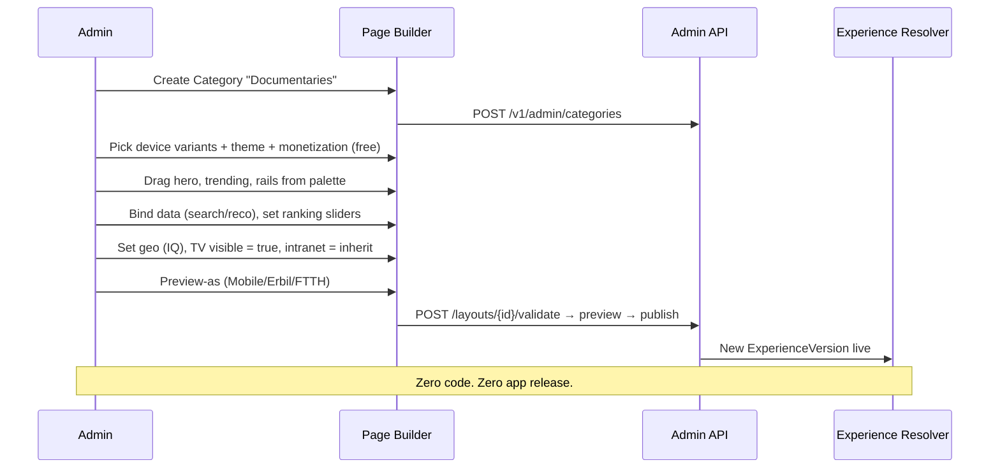

---

## 20. Summary

The Dynamic Category Experience System replaces the notion of a homepage with a **data-driven experience engine**: every category is a JSON Layout DSL document of registry-defined widgets, each widget bound to a ranking rule and (optionally) a per-category recommendation pipeline, all authored in a no-code drag-and-drop builder, gated by device/geo/ISP/intranet/monetization, versioned for instant rollback, and optionally auto-composed by AI under mandatory admin approval. The same generic renderer powers Movies, Kids, Gaming, Sports, Islamic, Music, News, Podcast — and the Library ([16](./16-digital-library-knowledge-hub.md)) and File/Archive ([17](./17-file-archive-hub.md)) hubs — differing only in their configuration, never their code.
