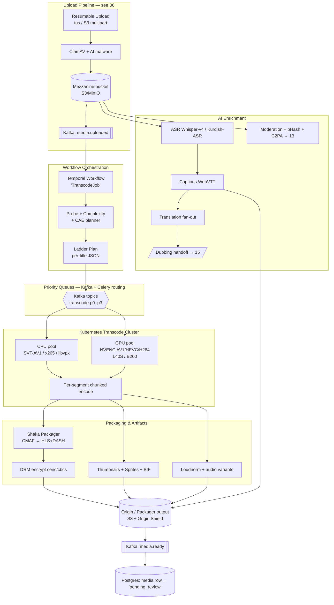
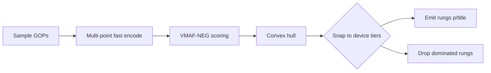
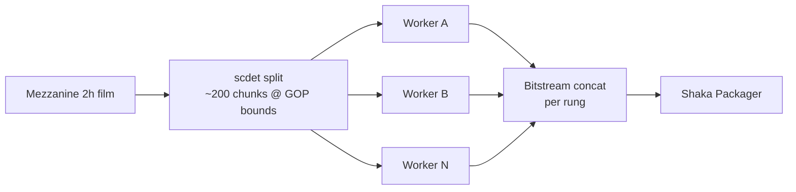
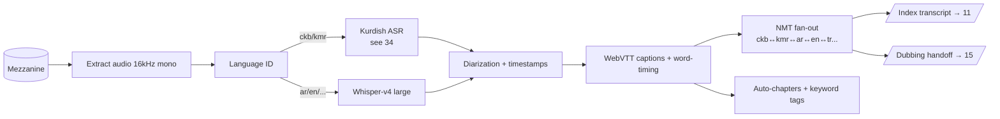
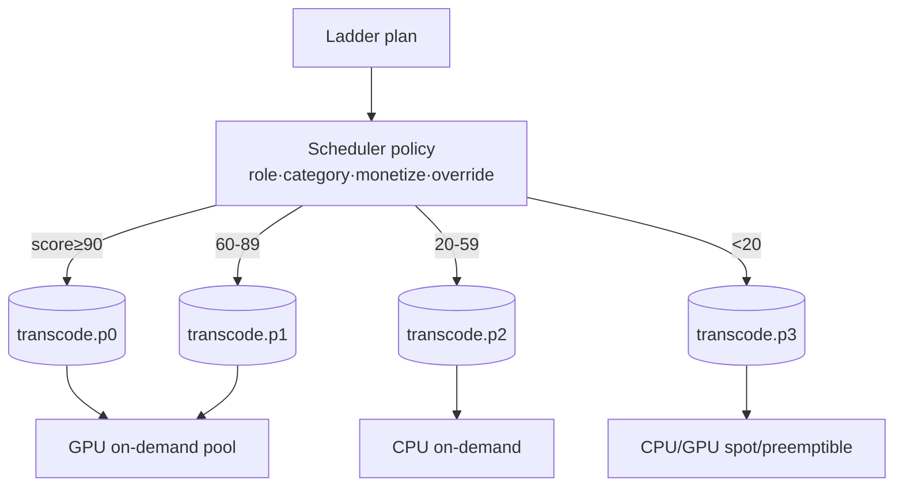

# 08 — Video Processing & Transcoding Engine

> **Domain:** Media Engine · **Codename:** `ZanaCloud Transcode`
> **Extends:** MediaCMS `files/tasks.py` (Celery `encode_media`), `EncodeProfile` model, Bento4 `mp4hls`, FFmpeg.
> **Upstream:** [06-upload-pipeline.md](./06-upload-pipeline.md) (ingest, chunked upload, virus scan, dedupe).
> **Downstream:** [09-streaming-infrastructure.md](./09-streaming-infrastructure.md) (packaging→delivery), [10-live-streaming.md](./10-live-streaming.md) (live transcode), [15-ai-dubbing-studio.md](./15-ai-dubbing-studio.md) (dubbing handoff), [13-ai-systems.md](./13-ai-systems.md) (moderation/understanding).
> **Status:** v1 blueprint (2026).

---

## 0. Scope & responsibilities

The Video Processing Engine takes a **mezzanine** (validated source file in object storage) and produces every artifact required for global adaptive playback, AI features, and admin review:

1. **Probe & analysis** — codec, resolution, FPS, color (HDR/SDR), loudness, scene/shot detection, complexity scoring.
2. **Transcoding** — per-title, content-adaptive bitrate ladder spanning **144p → 8K** across **AV1 / HEVC / H.264 / VP9**.
3. **Packaging** — fragmented MP4 → **CMAF** segments, **HLS** (`.m3u8`) + **DASH** (`.mpd`), LL-HLS partial segments, DRM-ready (cbcs/cenc).
4. **Visual artifacts** — poster/thumbnails, animated preview (WebP/MP4 hover-scrub), **storyboard sprite sheets** (BIF + WebVTT), dominant-color palette, AI-chosen "best frame".
5. **Audio** — loudness normalization (EBU R128 / -16 LUFS), AAC + AC-3 + Opus tracks, multi-language audio.
6. **AI text** — ASR (speech-to-text) → captions (WebVTT/SRT), **Kurdish Sorani+Kurmanji** first-class, translation fan-out, **dubbing handoff**.
7. **Provenance & moderation** — perceptual hash (copyright), NSFW/violence scoring, C2PA signing.

> **Non-goals here:** raw upload/resumability ([06](./06-upload-pipeline.md)), CDN/edge delivery ([09](./09-streaming-infrastructure.md)), live ingest ([10](./10-live-streaming.md)). This doc ends at "artifacts written to origin + manifest registered."

---

## 1. High-level architecture



**Why Temporal (not pure Celery chains)?** A title's processing is a long-running (minutes→hours), multi-stage, partially-parallel **workflow** with retries, compensation, signals (admin cancel/repriortize), and human-in-the-loop (admin approval). Temporal gives durable execution, deterministic replay, per-activity retry/backoff, and visibility. Celery remains the **worker execution substrate** for individual FFmpeg activities (MediaCMS already speaks Celery — strangler-fig compatible). Kafka is the **fan-out + priority bus** between orchestration and the worker fleet.

| Layer | Tech | Why |
|---|---|---|
| Workflow control plane | **Temporal 1.2x** (self-hosted, Cassandra+ES) | Durable, replayable, signals, child workflows per ladder rung |
| Priority bus | **Kafka** (KRaft, 4 topics by priority) | Decouples planner from fleet; backpressure; partition = parallelism |
| Worker execution | **Celery 5.x** workers in K8s (KEDA-scaled) | Reuse MediaCMS task code; per-queue concurrency |
| Encoders | **FFmpeg 7.x**, SVT-AV1 2.x, x265, libvpx-vp9, **NVENC (Ada/Blackwell)** | Best-in-class per codec |
| Packager | **Shaka Packager 3.x** | CMAF, LL-HLS, multi-DRM in one pass |
| HLS legacy | Bento4 `mp4hls` (MediaCMS-compatible fallback) | Backward compat for MVP |
| Object store | **S3 / MinIO** (erasure-coded), intranet-local MinIO | Mezzanine + artifacts; intranet/FTTH origin |

---

## 2. The TranscodeJob workflow (Temporal)

```mermaid
stateDiagram-v2
    [*] --> Probe
    Probe --> Plan: ffprobe + VMAF-complexity
    Plan --> Fanout: emit ladder rungs
    state Fanout {
        direction LR
        Video --> Pkg
        Audio --> Pkg
        ASR --> Captions --> Translate
    }
    Fanout --> Package: Shaka CMAF
    Package --> DRM
    DRM --> Artifacts: sprites/BIF/poster
    Artifacts --> Provenance: pHash + C2PA + moderation
    Provenance --> Register: media.ready
    Register --> PendingReview: admin-approval gate (33)
    PendingReview --> [*]
    Probe --> Failed: hard error
    Package --> Failed
    Failed --> Retry: backoff (max N)
    Retry --> Probe
    Failed --> DeadLetter: exhausted
```

### 2.1 Workflow skeleton (pseudo-Go / Temporal SDK)

```go
func TranscodeJob(ctx workflow.Context, in MediaInput) (Result, error) {
    ao := workflow.ActivityOptions{
        StartToCloseTimeout: 30 * time.Minute,
        RetryPolicy: &temporal.RetryPolicy{
            InitialInterval:    10 * time.Second,
            BackoffCoefficient: 2.0,
            MaximumInterval:    5 * time.Minute,
            MaximumAttempts:    5, // then dead-letter
        },
    }
    ctx = workflow.WithActivityOptions(ctx, ao)

    probe := must(ProbeActivity(ctx, in))           // ffprobe + HDR + loudness
    plan  := must(PlanLadderActivity(ctx, probe))   // content-adaptive (CAE)

    // Parallel: encode each rung as a child workflow (own retries, own priority)
    var futures []workflow.ChildWorkflowFuture
    for _, rung := range plan.Rungs {
        cwo := workflow.ChildWorkflowOptions{TaskQueue: rung.Priority} // p0..p3
        c := workflow.WithChildOptions(ctx, cwo)
        futures = append(futures, workflow.ExecuteChildWorkflow(c, EncodeRung, rung))
    }

    // Parallel AI lane (independent, non-blocking for video readiness)
    workflow.Go(ctx, func(gctx workflow.Context) {
        cap := must(ASRActivity(gctx, in))          // Kurdish-aware
        must(TranslateFanoutActivity(gctx, cap))    // ckb,kmr,ar,en,...
        SignalDubbingStudio(gctx, in, cap)          // handoff → 15
    })

    rungs := awaitAll(futures)
    pkg   := must(PackageActivity(ctx, rungs))      // Shaka CMAF → HLS+DASH
    must(DRMActivity(ctx, pkg))                     // cenc + cbcs
    must(ArtifactActivity(ctx, probe))              // sprites, BIF, poster
    must(ProvenanceActivity(ctx, in))               // pHash, C2PA, moderation
    must(RegisterActivity(ctx, pkg))                // media.ready → pending_review
    return Result{OK: true}, nil
}
```

**Signals supported:** `cancel`, `reprioritize(p0)`, `re-encode(codec)`, `admin_force_feature`. The Super Admin Panel ([33](./33-platform-constraints.md)) can boost any in-flight job to **p0** (e.g. breaking-news clip) via a `reprioritize` signal that re-routes remaining child workflows to the `transcode.p0` queue.

---

## 3. Probe & content-adaptive planning (CAE)

### 3.1 Probe

```bash
ffprobe -v quiet -print_format json -show_format -show_streams \
        -show_frames -read_intervals "%+#200" -select_streams v:0 input.mov
# Plus: HDR detection (color_primaries/transfer/space), frame-type histogram,
#       I/P/B distribution → motion proxy.
```

Loudness pass (single decode, reused for normalization):

```bash
ffmpeg -i input.mov -af loudnorm=I=-16:TP=-1.5:LRA=11:print_format=json \
       -f null - 2> loudness.json
```

### 3.2 Per-title / content-adaptive encoding

We do **not** ship a fixed ladder to every video. We run a **complexity probe** to right-size the ladder (saves 30–50% egress on simple content; protects quality on hard content).

**Algorithm (2-pass-lite "convex hull" approximation):**

1. Extract ~12 representative GOPs (scene-change-aligned via `scdet`).
2. Fast SVT-AV1 `--preset 8` encodes at 4–5 candidate (resolution, CRF) points.
3. Compute **VMAF-NEG** for each → build convex hull of quality-vs-bitrate.
4. Snap hull to **device-tier targets** (mobile/desktop/TV — see [03](./03-frontend-architecture.md)) and emit only the rungs on/above the hull.
5. Persist `ladder_plan.json` on the media row for reproducibility/audits.



**Complexity classes** (drives codec + preset + min/max rungs):

| Class | Example | Spatial/Temporal | Action |
|---|---|---|---|
| **Low** | talking head, slides, Quran recitation w/ static bg | low/low | fewer top rungs, lower max bitrate, faster preset |
| **Medium** | vlog, news, podcast-video | med/med | standard ladder |
| **High** | sports, gaming, action film | high/high | full ladder, slower preset, +grain synthesis (AV1) |
| **Animation** | cartoons, Kids content | flat regions/sharp edges | tune psy-rd, `--tune animation` |

---

## 4. The bitrate ladder

The **canonical full ladder**. CAE prunes per title; this is the superset the player can ever request. Bitrates are **target average** (VBR, capped). AV1 is primary for ≤1080p where decode is broadly available in 2026; HEVC+AV1 for 4K/8K; H.264 as universal compatibility floor; VP9 for legacy Android/Chrome where AV1 HW decode absent.

| Rung | Res | FPS | H.264 (AVC) | VP9 | HEVC | **AV1** (primary) | Use / device tier |
|---|---|---|---|---|---|---|---|
| L0 | 256×144 | 30 | 120 kbps | 90 | 80 | **70 kbps** | 2G/edge-of-network, data-saver |
| L1 | 426×240 | 30 | 300 | 220 | 190 | **160** | low-end mobile, intranet thin |
| L2 | 640×360 | 30 | 600 | 450 | 380 | **320** | mobile default (cellular) |
| L3 | 854×480 | 30 | 1,100 | 850 | 700 | **600** | mobile good / desktop low |
| L4 | 1280×720 | 30 | 2,400 | 1,800 | 1,500 | **1,200** | desktop default, TV SD |
| L5 | 1280×720 | 60 | 3,400 | 2,600 | 2,100 | **1,700** | gaming/sports 720p60 |
| L6 | 1920×1080 | 30 | 4,500 | 3,400 | 2,800 | **2,200** | desktop HD, TV HD |
| L7 | 1920×1080 | 60 | 6,500 | 5,000 | 4,000 | **3,200** | sports/gaming 1080p60 |
| L8 | 2560×1440 | 60 | 11,000 | 8,500 | 6,800 | **5,200** | TV/desktop QHD, gaming |
| L9 | 3840×2160 | 60 | — | 16,000 | 13,000 | **9,500** | TV 4K (Netflix-tier) |
| L10 | 3840×2160 | 60 HDR | — | — | 15,500 | **11,000** | 4K HDR10/HLG |
| L11 | 7680×4320 | 60 HDR | — | — | 40,000 | **28,000** | 8K showcase (event/demo) |

**Audio rungs** (all muxed as separate CMAF tracks; player picks):

| Track | Codec | Bitrate | Notes |
|---|---|---|---|
| A0 | AAC-LC stereo | 128 kbps | universal floor |
| A1 | Opus stereo | 96 kbps | web/AV1 pairing, lower latency |
| A2 | AC-3 5.1 | 384 kbps | TV surround |
| A3 | E-AC-3 (DD+) 5.1 | 256 kbps | TV / modern |
| A-multi | per language | — | Kurdish dub, original, AI dubs ([15](./15-ai-dubbing-studio.md)) |

**Keyframe alignment:** all rungs share **GOP = 2s** (closed GOP, `-g {2*fps} -keyint_min {2*fps} -sc_threshold 0` plus forced IDR at scene cuts) so ABR can switch every segment, and CMAF segments are byte-aligned across renditions and codecs. LL-HLS uses **1s segments + 200ms parts**.

---

## 5. FFmpeg / encoder commands

### 5.1 AV1 (SVT-AV1, CPU pool) — 1080p rung example

```bash
ffmpeg -i mezzanine.mxf \
  -map 0:v:0 \
  -vf "scale=1920:1080:flags=lanczos,format=yuv420p10le" \
  -c:v libsvtav1 -preset 6 \
  -svtav1-params "tune=0:enable-overlays=1:scd=1:film-grain=8:keyint=48:irefresh-type=2" \
  -b:v 2200k -maxrate 3300k -bufsize 4400k \
  -g 48 -pix_fmt yuv420p10le \
  -an -f mp4 -movflags +frag_keyframe+empty_moov+default_base_moof \
  out_1080p_av1.mp4
```

- `tune=0` = subjective/VMAF tuning; `film-grain=8` synthesizes grain (huge savings on filmic content); `scd=1` scene-change detect; `irefresh-type=2` = closed GOP for ABR splice points.
- 10-bit (`yuv420p10le`) even for SDR — reduces banding, negligible size cost in AV1.

### 5.2 HEVC 4K HDR (x265, CPU) 

```bash
ffmpeg -i mezzanine.mxf \
  -vf "scale=3840:2160:flags=lanczos" \
  -c:v libx265 -preset slow -pix_fmt yuv420p10le \
  -x265-params "hdr10=1:repeat-headers=1:colorprim=bt2020:transfer=smpte2084:colormatrix=bt2020nc:master-display=G(13250,34500)B(7500,3000)R(34000,16000)WP(15635,16450)L(10000000,1):max-cll=1000,400:keyint=120:min-keyint=120:scenecut=0:open-gop=0" \
  -b:v 13000k -maxrate 19500k -bufsize 26000k \
  -an -f mp4 -movflags +frag_keyframe+empty_moov out_2160p_hevc_hdr.mp4
```

### 5.3 NVENC (GPU pool) — H.264 + HEVC + AV1 on Blackwell/Ada

GPU pool handles **throughput-critical** rungs (H.264 universal, fast turnaround, live). NVENC AV1 on **Ada (L40S)** and **Blackwell (B200/RTX 6000 Blackwell)** is production-grade in 2026.

```bash
# Single decode → multi-encode on one GPU (NVDEC → CUDA scale → 3 NVENC sessions)
ffmpeg -hwaccel cuda -hwaccel_output_format cuda -i mezzanine.mxf \
  -filter_complex "[0:v]split=3[v720][v480][v360]; \
     [v720]scale_cuda=1280:720[o720]; \
     [v480]scale_cuda=854:480[o480]; \
     [v360]scale_cuda=640:360[o360]" \
  -map "[o720]" -c:v av1_nvenc  -preset p5 -rc vbr -b:v 1200k -maxrate 1800k -g 48 o720_av1.mp4 \
  -map "[o480]" -c:v av1_nvenc  -preset p5 -rc vbr -b:v 600k  -maxrate 900k  -g 48 o480_av1.mp4 \
  -map "[o360]" -c:v h264_nvenc -preset p5 -rc vbr -b:v 600k  -maxrate 900k  -g 48 o360_h264.mp4
```

**Why both CPU and GPU?** Quality-per-bit: SVT-AV1 CPU at `preset 4–6` beats NVENC AV1 at equal bitrate by ~8–15% VMAF. So:

| Tier | Engine | Rationale |
|---|---|---|
| VOD top rungs (1080p+/premium catalog, Movies, Netflix-tier) | **CPU SVT-AV1/x265** slow presets | max quality-per-bit, egress dominates cost at scale |
| VOD bulk (UGC ≤720p, the long tail) | **GPU NVENC** | throughput, low cost/min, fast time-to-publish |
| Live | **GPU NVENC** | real-time hard constraint ([10](./10-live-streaming.md)) |
| Re-encodes / backfill | spot/preemptible CPU | cheap, latency-tolerant |

### 5.4 Chunked (segment-parallel) encoding

For long titles (films, lectures), a single FFmpeg process underutilizes the cluster. We split the mezzanine at scene-aligned GOP boundaries, distribute chunks across workers, encode in parallel, then concatenate (bitstream concat — no re-encode).



A 2-hour film at 1080p AV1 `preset 4`: ~9h single-threaded → **~7 min** across 80 chunk-workers. Boundary stitching uses identical encoder params + forced IDR at each chunk head to guarantee seamless concat.

---

## 6. Packaging (CMAF → HLS + DASH)

One CMAF set serves both HLS and DASH (single storage, single cache key prefix). Shaka Packager in one pass.

```bash
packager \
  in=out_1080p_av1.mp4,stream=video,init_segment='av1/1080p/init.mp4',segment_template='av1/1080p/$Number$.m4s' \
  in=out_720p_av1.mp4,stream=video,init_segment='av1/720p/init.mp4',segment_template='av1/720p/$Number$.m4s' \
  in=out_360p_h264.mp4,stream=video,init_segment='avc/360p/init.mp4',segment_template='avc/360p/$Number$.m4s' \
  in=audio_aac.mp4,stream=audio,language=ckb,init_segment='aud/ckb/init.mp4',segment_template='aud/ckb/$Number$.m4s' \
  in=audio_en.mp4,stream=audio,language=en,init_segment='aud/en/init.mp4',segment_template='aud/en/$Number$.m4s' \
  in=captions_ckb.vtt,stream=text,language=ckb,segment_template='sub/ckb/$Number$.m4s' \
  --segment_duration 2 \
  --generate_static_live_mpd \
  --hls_master_playlist_output 'master.m3u8' \
  --mpd_output 'manifest.mpd' \
  --enable_raw_key_encryption  # DRM keys injected (see §7)
```

### 6.1 LL-HLS partials

```bash
packager ... \
  --segment_duration 1 \
  --ll_hls \
  --hls_playlist_type LIVE \
  --partial_segment_duration 0.2 \
  --preferred_text_language ckb
```

Example master HLS (`master.m3u8`) with codec/RESOLUTION/FRAME-RATE so players pick correctly:

```m3u8
#EXTM3U
#EXT-X-VERSION:11
#EXT-X-INDEPENDENT-SEGMENTS
#EXT-X-MEDIA:TYPE=AUDIO,GROUP-ID="aud",NAME="کوردی (Sorani)",LANGUAGE="ckb",DEFAULT=YES,AUTOSELECT=YES,URI="aud/ckb/playlist.m3u8"
#EXT-X-MEDIA:TYPE=AUDIO,GROUP-ID="aud",NAME="English",LANGUAGE="en",URI="aud/en/playlist.m3u8"
#EXT-X-MEDIA:TYPE=SUBTITLES,GROUP-ID="sub",NAME="کوردی",LANGUAGE="ckb",DEFAULT=YES,URI="sub/ckb/playlist.m3u8"
#EXT-X-STREAM-INF:BANDWIDTH=320000,RESOLUTION=640x360,FRAME-RATE=30.000,CODECS="av01.0.05M.10,mp4a.40.2",AUDIO="aud",SUBTITLES="sub"
av1/360p/playlist.m3u8
#EXT-X-STREAM-INF:BANDWIDTH=2200000,RESOLUTION=1920x1080,FRAME-RATE=30.000,CODECS="av01.0.09M.10,mp4a.40.2",AUDIO="aud",SUBTITLES="sub"
av1/1080p/playlist.m3u8
#EXT-X-STREAM-INF:BANDWIDTH=4500000,RESOLUTION=1920x1080,CODECS="avc1.640028,mp4a.40.2",AUDIO="aud",SUBTITLES="sub"
avc/1080p/playlist.m3u8
```

Corresponding DASH MPD excerpt:

```xml
<MPD xmlns="urn:mpeg:dash:schema:mpd:2011" type="static"
     minBufferTime="PT2S" profiles="urn:mpeg:dash:profile:isoff-live:2011">
  <Period id="0">
    <AdaptationSet contentType="video" segmentAlignment="true" startWithSAP="1">
      <Representation id="av1-360" codecs="av01.0.05M.10" width="640" height="360" bandwidth="320000"/>
      <Representation id="av1-1080" codecs="av01.0.09M.10" width="1920" height="1080" bandwidth="2200000"/>
      <Representation id="avc-1080" codecs="avc1.640028" width="1920" height="1080" bandwidth="4500000"/>
    </AdaptationSet>
    <AdaptationSet contentType="audio" lang="ckb">
      <Representation id="aud-ckb" codecs="mp4a.40.2" audioSamplingRate="48000" bandwidth="128000"/>
    </AdaptationSet>
  </Period>
</MPD>
```

> Delivery, ABR, prefetch and edge details are in [09-streaming-infrastructure.md](./09-streaming-infrastructure.md). This doc guarantees CMAF segments are **byte-identical at the segment boundary across CDN tiers and intranet origins** so the same cache object is reused everywhere.

---

## 7. DRM-ready encryption

Encryption happens at packaging time (one ciphertext, multi-DRM via shared key + per-system PSSH). Keys come from the Key Management Service; license delivery is in [09 §DRM](./09-streaming-infrastructure.md).

| Container | Scheme | DRM systems | Players |
|---|---|---|---|
| CMAF (fMP4) | **cbcs** | FairPlay + Widevine + PlayReady (one ciphertext) | iOS/Safari, Android, Edge/Win, TV |
| CMAF | **cenc** | Widevine + PlayReady | Android, Chrome, Win, TV |

Free public UGC is typically **clear or AES-128 token-gated** (cheap); premium catalog (Movies, paid courses, licensed sports) uses full **CDM DRM**. The Super Admin Panel sets protection level per category/title ([33](./33-platform-constraints.md)).

```bash
packager ... \
  --protection_scheme cbcs \
  --enable_widevine_encryption \
  --key_server_url https://kms.internal/widevine \
  --content_id "$MEDIA_ID" --signer "zanacloud" \
  --pssh ... # PlayReady + FairPlay SKD added for multi-DRM
```

---

## 8. Visual artifacts

### 8.1 Poster + AI best-frame

```bash
# Candidate frames at scene changes; AI ranks for "thumbnail-worthiness"
ffmpeg -i mezzanine.mxf -vf "select='gt(scene,0.4)',scale=1280:-1" -vsync vfr cand_%04d.jpg
# Aesthetic/relevance scoring model (see 13) picks poster + 3 alternates for A/B (see 14)
```

### 8.2 Animated hover preview (TikTok/YouTube scrub)

```bash
ffmpeg -i mezzanine.mxf -ss 0 -t 6 -vf "fps=12,scale=480:-1" \
  -c:v libwebp -lossless 0 -q:v 60 -loop 0 preview.webp
```

### 8.3 Storyboard sprite sheet + WebVTT (scrubbing thumbnails)

```bash
# One thumb every 5s, tiled 10x10 per sheet @ 160x90
ffmpeg -i mezzanine.mxf -vf "fps=1/5,scale=160:90,tile=10x10" sprite_%03d.jpg
```

```webvtt
WEBVTT

00:00:00.000 --> 00:00:05.000
sprite_001.jpg#xywh=0,0,160,90

00:00:05.000 --> 00:00:10.000
sprite_001.jpg#xywh=160,0,160,90
```

Plus **Roku BIF** (`.bif`) for TV trick-play, and a **dominant-color palette** (extracted via k-means on the poster) feeding device-specific UI theming ([03](./03-frontend-architecture.md)).

---

## 9. AI enrichment lane

Runs **in parallel** with transcoding (does not block video readiness; captions attach when done and re-trigger manifest update).



### 9.1 Speech-to-text

- **Engine:** Whisper-v4-large (general) + the in-house **Kurdish-ASR** model ([34-kurdish-language-intelligence.md](./34-kurdish-language-intelligence.md)) for Sorani/Kurmanji, deployed on the GPU inference pool (Triton/vLLM-audio).
- Output: WebVTT with **word-level timestamps** (needed for karaoke captions, search highlighting, and dubbing alignment).
- Loudness-gated VAD to skip silence; diarization tags speakers (`<v Speaker 1>`).

### 9.2 Translation fan-out

Captions are translated through the in-house NMT into the platform's language set (`ckb, kmr, ar, en, fa, tr, ...`). Each target becomes a selectable subtitle track in the manifest and is pushed to the search index ([11](./11-search-engine.md)) for **cross-lingual transcript search**.

### 9.3 Dubbing handoff

Rather than dub inline (expensive, optional, often human-reviewed), the workflow **signals the AI Dubbing Studio** with `{media_id, audio_ref, diarized_vtt, target_langs}`. Dubbing is an **asynchronous downstream workflow** ([15-ai-dubbing-studio.md](./15-ai-dubbing-studio.md)); when a dub completes it registers a new **audio CMAF track** and patches the manifest (`#EXT-X-MEDIA TYPE=AUDIO`) — no re-transcode of video.

```protobuf
// dubbing handoff event on Kafka topic: dubbing.request
message DubbingRequest {
  string media_id        = 1;
  string mezzanine_uri   = 2;   // s3://...
  string diarized_vtt_uri= 3;
  string source_lang     = 4;   // e.g. "ar"
  repeated string targets= 5;   // ["ckb","kmr","en"]
  bool   lip_sync        = 6;   // premium
  string priority        = 7;   // p0..p3
}
```

### 9.4 Moderation & provenance (→ [13](./13-ai-systems.md))

- **Perceptual hash** (TMK+PDQF video hash) for copyright/dup detection ([14 copyright center](./14-creator-studio.md)).
- NSFW / violence / extremism scoring on sampled frames + audio → score attached to media row; high scores **block** the admin-approval gate or auto-route to human review ([25-content-moderation.md](./25-content-moderation.md)).
- **C2PA** content credentials signed into outputs for authenticity.

---

## 10. Queue, priority & scheduling

### 10.1 Four priority classes (Kafka topics + Celery queues + Temporal task queues)

| Pri | Topic / Queue | SLA (start) | Examples | Preemption |
|---|---|---|---|---|
| **p0** | `transcode.p0` | < 10 s | breaking news, live-VOD clip, admin-forced, verified-creator premiere | preempts p2/p3 |
| **p1** | `transcode.p1` | < 60 s | regular creator publish, monetized content | preempts p3 |
| **p2** | `transcode.p2` | < 10 min | bulk UGC (≤3-min user clips), default | — |
| **p3** | `transcode.p3` | best-effort | backfill, re-encode to new codec, archive migration | spot/preemptible only |

Priority is computed by a **scheduler policy** from: creator role/verification, category (Movies/Sports/News high), monetization flag, content length, admin override, and current queue depth. Policy is configurable in the Super Admin Panel — no code change ([33](./33-platform-constraints.md)).



### 10.2 Autoscaling (KEDA on Kafka lag)

```yaml
apiVersion: keda.sh/v1alpha1
kind: ScaledObject
metadata: { name: transcode-cpu-p2 }
spec:
  scaleTargetRef: { name: transcode-worker-cpu }
  minReplicaCount: 2
  maxReplicaCount: 400
  cooldownPeriod: 120
  triggers:
    - type: kafka
      metadata:
        topic: transcode.p2
        consumerGroup: cpu-p2
        lagThreshold: "20"        # scale out when >20 msgs/worker backlog
        offsetResetPolicy: latest
```

GPU pools use a separate `ScaledObject` (node pools with `nvidia.com/gpu`), `maxReplicaCount` bounded by physical GPU count and MPS partitions. Spot interruptions are handled by Temporal: an interrupted activity simply retries on a new worker (idempotent, segment-keyed outputs).

### 10.3 Retries, idempotency, dead-letter

- **Idempotency key** = `sha256(media_id + rung_id + encoder_params_hash)`. Re-running a rung overwrites the same object path → safe retries.
- Activity-level retry (Temporal): exponential backoff, max 5; transient (OOM, spot kill) vs permanent (corrupt source) classified by exit code.
- **Dead-letter** → `transcode.dlq` topic → admin alert ([27-observability.md](./27-observability.md)) + media row flagged `processing_failed`; user/creator notified; one-click admin re-queue.

---

## 11. Capacity & cost model

**Assumptions:** 1,000,000 hours of new VOD/month at maturity (mix: 70% UGC ≤720p, 25% HD, 5% 4K+).

### 11.1 Encode-time budget (real-time factor, RTF = encode_time / content_time)

| Rung family | Engine | RTF (per stream) |
|---|---|---|
| H.264 ≤720p | NVENC | 0.05–0.1 (10–20× real-time) |
| AV1 ≤720p | NVENC | 0.15 |
| AV1 1080p preset 6 | SVT-AV1 CPU (32 vCPU) | 0.8 |
| AV1 1080p preset 4 (Movies) | SVT-AV1 CPU | 2.5 |
| HEVC 4K HDR slow | x265 CPU | 6–10 |

### 11.2 GPU fleet sizing (live + UGC bulk)

A single **L40S** runs ~8–12 concurrent 1080p NVENC sessions (AV1+H.264) via MPS. For **50,000 hours/day** of GPU-targeted UGC at ~0.15 RTF and 3 codecs:

```
GPU-seconds/day = 50,000 h × 3600 s/h × 0.15 RTF × 3 codecs ≈ 81.0M GPU-s
Per L40S/day (80% util)   = 86,400 × 0.8 ≈ 69,120 useful GPU-s
Sessions/GPU ≈ 10 → effective = 691,200 GPU-s/day/GPU
GPUs needed ≈ 81.0M / 691,200 ≈ 117 L40S  → provision ~140 (headroom + live)
```

Live ([10](./10-live-streaming.md)) reserves a dedicated GPU partition (no spot) sized to concurrent channels.

### 11.3 Cost levers

| Lever | Saving | Trade-off |
|---|---|---|
| CAE ladder pruning | −30–50% storage+egress | small VMAF risk on misclassification |
| Spot/preemptible for p3 backfill | −60–80% compute | latency-tolerant only |
| AV1 over H.264 at scale | −30–50% egress (egress ≫ compute at scale) | higher encode cost, decode availability |
| Film-grain synthesis (AV1) | −20–40% on filmic | decoder must support |
| GPU for bulk UGC | −70% $/encode-min vs CPU | lower quality-per-bit (acceptable for UGC) |
| Lazy top rungs | encode 4K/8K **on first demand** for long-tail | first-viewer latency on rare titles |

**Egress dominates.** At 100M-user scale the strategic win is codec efficiency + intranet/ISP edge caching ([09](./09-streaming-infrastructure.md)), not encode CPU. Hence AV1-first and the convex-hull ladder.

---

## 12. Intranet / FTTH considerations

For deployments with **no public internet**, the entire pipeline runs on **on-prem/ISP K8s** with **local MinIO** as both mezzanine and origin. Encoder fleet is CPU-heavy (GPUs optional per ISP budget). Key adaptations:

- **AI models bundled offline:** Whisper/Kurdish-ASR/NMT shipped as container images + weights in the local registry; no external API calls.
- **Smaller ladder default** (L0–L8) since 8K is irrelevant on constrained links; admin can enable per node.
- Outputs land in **local origin**; the ISP edge cache ([09](./09-streaming-infrastructure.md)) serves segments LAN-side at line rate.
- Temporal + Kafka + Postgres + MinIO form a **self-contained processing island**; optional store-and-forward sync to the national core when a backhaul link exists.

---

## 13. Data model & cross-references

New/extended tables (extends MediaCMS `Media`, `EncodeProfile`):

```sql
-- Extends MediaCMS EncodeProfile with codec + ladder semantics
ALTER TABLE files_encodeprofile ADD COLUMN codec text;        -- av1|hevc|h264|vp9
ALTER TABLE files_encodeprofile ADD COLUMN hdr boolean DEFAULT false;
ALTER TABLE files_encodeprofile ADD COLUMN fps int;

CREATE TABLE transcode_job (
  id uuid PRIMARY KEY,
  media_id bigint REFERENCES files_media(id),
  temporal_workflow_id text,
  ladder_plan jsonb,            -- CAE output, auditable
  priority text,               -- p0..p3
  state text,                  -- planning|encoding|packaging|ready|failed
  vmaf_avg numeric,
  cost_estimate_usd numeric,
  created_at timestamptz, updated_at timestamptz
);

CREATE TABLE media_rendition (
  id uuid PRIMARY KEY,
  media_id bigint, rung text, codec text, width int, height int, fps int,
  bitrate_kbps int, cmaf_init_uri text, segment_template text, drm_scheme text
);
```

| Cross-reference | Why |
|---|---|
| [06-upload-pipeline.md](./06-upload-pipeline.md) | source of `media.uploaded`, mezzanine |
| [09-streaming-infrastructure.md](./09-streaming-infrastructure.md) | consumes CMAF/HLS/DASH outputs |
| [10-live-streaming.md](./10-live-streaming.md) | shares NVENC pool + packager for live→VOD |
| [11-search-engine.md](./11-search-engine.md) | indexes transcripts/translations |
| [13-ai-systems.md](./13-ai-systems.md) | moderation, pHash, video understanding |
| [15-ai-dubbing-studio.md](./15-ai-dubbing-studio.md) | dubbing handoff (§9.3) |
| [33-platform-constraints.md](./33-platform-constraints.md) | admin-controlled priorities, DRM level, ladder per category |
| [34-kurdish-language-intelligence.md](./34-kurdish-language-intelligence.md) | Kurdish ASR/NMT |

---

## 14. Failure modes & SLOs

| Failure | Detection | Mitigation |
|---|---|---|
| Corrupt mezzanine | probe exit code | permanent-fail → notify creator, no retry |
| Encoder OOM (4K/8K) | cgroup OOM kill | retry on larger node class; chunk-split |
| Spot interruption | node drain signal | Temporal retry on new worker (idempotent) |
| Kafka lag spike | KEDA + Prometheus | autoscale; shed p3; alert |
| DRM KMS unreachable | activity error | retry w/ backoff; fall back to AES-128 token-gate for non-premium |
| ASR low-confidence | confidence < τ | route to human caption review ([25](./25-content-moderation.md)) |

**SLOs:** p2 UGC ≤3-min → **playable in < 90 s p95**; p1 HD publish → **< 8 min p95**; Movies 4K full-quality → **< 45 min p95**; pipeline success rate **> 99.5%**; caption WER (Kurdish) target **< 12%** (tracked in [27](./27-observability.md)).

---

*End of 08. Next: [09-streaming-infrastructure.md](./09-streaming-infrastructure.md) — how these artifacts reach 100M devices, online and intranet.*
