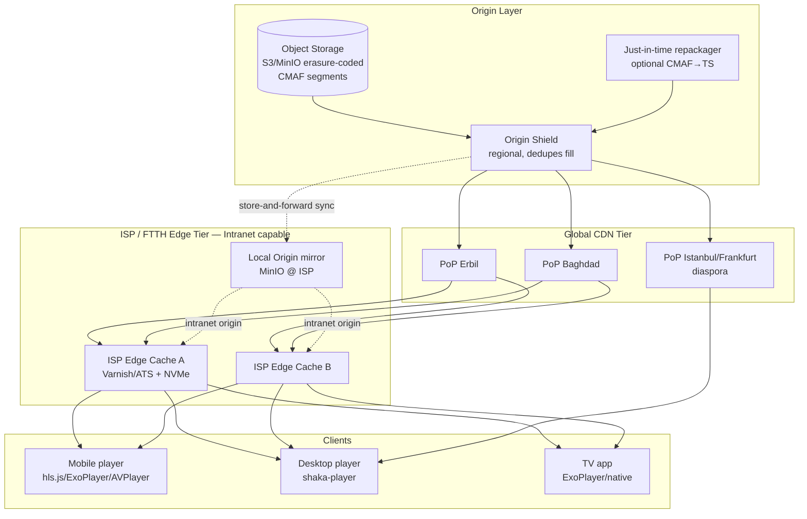
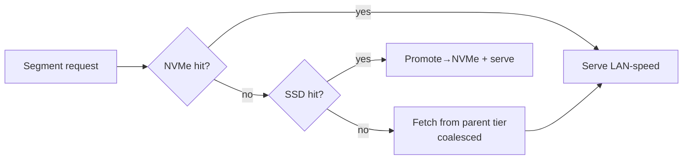
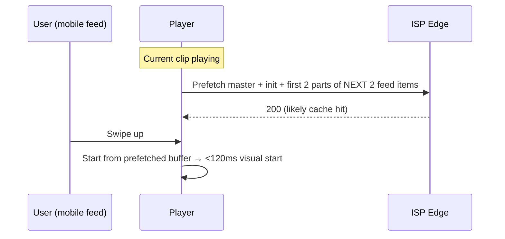
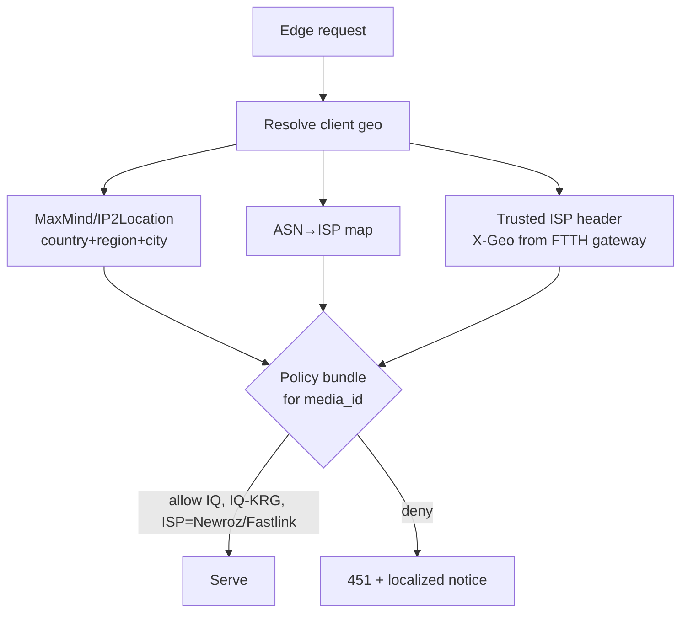
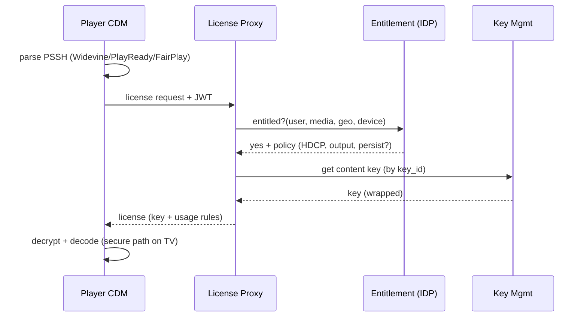
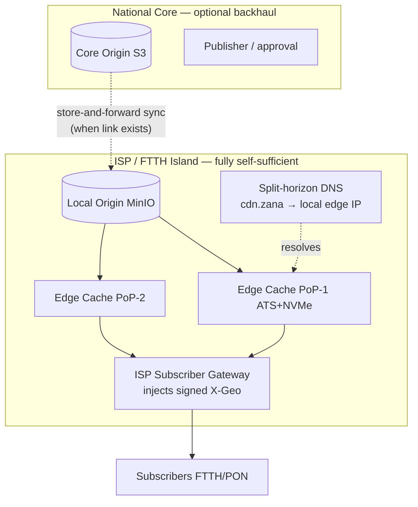

# 09 — Streaming Infrastructure & Global Delivery

> **Domain:** Media Engine · **Codename:** `ZanaCloud Deliver`
> **Upstream:** [08-video-processing.md](./08-video-processing.md) (CMAF/HLS/DASH artifacts at origin), [10-live-streaming.md](./10-live-streaming.md) (live edges).
> **Cross-cutting:** [24-security.md](./24-security.md) (token signing, WAF), [33-platform-constraints.md](./33-platform-constraints.md) (geo-fence rules, intranet/FTTH, device UX), [28-infrastructure-cost.md](./28-infrastructure-cost.md).
> **Status:** v1 blueprint (2026).

---

## 0. Scope

How a packaged title ([08](./08-video-processing.md)) reaches **100M devices** — over the public internet **and** inside ISP/FTTH intranets with **no public internet** — at YouTube/Netflix quality, with **geo-fencing enforced at the edge**, **token-signed URLs**, **multi-DRM**, and device-aware ABR.

Delivery formats: **HLS** (incl. **LL-HLS**) + **DASH**, both off a **single CMAF** segment set (one storage object serves both protocols and every CDN tier — the key invariant from [08 §6](./08-video-processing.md)).

---

## 1. Multi-tier delivery architecture



### Tiers explained

| Tier | Role | Tech (2026) | Cache size | Hit target |
|---|---|---|---|---|
| **Client** | player buffer, prefetch | shaka-player / hls.js / ExoPlayer / AVPlayer | 30–60 s buffer | — |
| **ISP / FTTH edge** | last-mile, LAN-speed, **works offline-from-internet** | Apache Traffic Server / Varnish + NVMe tiered cache | 5–50 TB/node | **> 92%** hot catalog |
| **Regional PoP** | metro aggregation | ATS + BBR2, anycast | 50–500 TB | > 85% |
| **Origin Shield** | fill consolidation, dedupes origin reads | ATS, 1 shield per region | 1–5 PB | > 98% origin offload |
| **Origin** | source of truth | S3/MinIO + JIT packager | full catalog | — |

**Why an Origin Shield?** Without it, every PoP miss hits S3 directly → cost + thundering-herd on new viral content. The shield collapses N PoP misses into 1 origin fetch (request coalescing), cutting origin egress by **> 98%**.

---

## 2. Cache hierarchy, keys & TTLs

### 2.1 Cache key design

Cache key = `host-agnostic` path + selected query allowlist. **Segments are immutable** (content-hashed paths) → infinite TTL. **Manifests** are short-TTL (live) or long-TTL (VOD).

```
# Segment (immutable, infinite TTL, shared across all tiers + intranet)
/v/{media_id}/av1/1080p/{seg_number}.m4s        Cache-Control: public, max-age=31536000, immutable

# VOD manifest (rarely changes; purge on caption/dub add)
/v/{media_id}/master.m3u8                        Cache-Control: public, max-age=3600

# LL-HLS live playlist (very short)
/live/{ch}/playlist.m3u8                          Cache-Control: public, max-age=1, stale-while-revalidate=2
```

**Token query params are NOT part of the cache key** (else 0% hit). Tokens are validated at the edge then stripped before cache lookup (§5).

### 2.2 Tiered + slice caching

- **Tiered storage** at edge: hot segments on **NVMe**, warm on **SATA SSD**, evicted by **GDSF** (Greedy-Dual-Size-Frequency — favors small, frequently-hit manifest/low-rung segments).
- **Range/slice caching** for large 4K segments so partial requests don't re-fill the whole object.



---

## 3. Adaptive Bitrate (ABR)

Players run ABR over the CMAF ladder ([08 §4](./08-video-processing.md)). We ship a **tuned hybrid controller** and per-device defaults.

### 3.1 Algorithm: hybrid buffer-+-throughput (BOLA-O / dynamic)

| Phase | Algorithm | Why |
|---|---|---|
| Startup | **throughput-based** (fast ramp) | minimize join time; no buffer history yet |
| Steady-state | **BOLA** (buffer-occupancy, Lyapunov) | smooth, rebuffer-averse |
| Switching | **MPC-lite** lookahead 3 segments | avoids oscillation |
| Live LL-HLS | **L2A / low-latency ABR** | tight latency budget, part-aware |

```js
// shaka-player ABR + LL config (desktop)
player.configure({
  abr: {
    enabled: true,
    defaultBandwidthEstimate: 1_500_000,
    restrictions: { maxHeight: deviceTier === 'tv' ? 2160 : 1080 },
    switchInterval: 1, bandwidthUpgradeTarget: 0.85, bandwidthDowngradeTarget: 0.95,
  },
  streaming: {
    bufferingGoal: 30, rebufferingGoal: 2, bufferBehind: 30,
    lowLatencyMode: isLive, inaccurateManifestTolerance: 0,
  },
});
```

### 3.2 Device-tier ABR policy (ties to [03](./03-frontend-architecture.md))

| Device | Start rung | Max rung | Buffer | Codec pref | Notes |
|---|---|---|---|---|---|
| **Mobile (TikTok-style)** | L2 360p | L6 1080p | 20 s | AV1→HEVC→H264 | data-saver caps L3; instant-start prefetch of next-in-feed |
| **Desktop (FB+YT)** | L3/L4 | L9 4K | 40 s | AV1→VP9→H264 | quality selector exposed |
| **TV (Netflix media-only)** | L6 1080p | L11 8K | 60 s | AV1→HEVC(HDR)→H264 | prefers HDR rungs, surround audio |
| **Intranet thin** | L1 240p | L8 1440p | 15 s | AV1→H264 | LAN bandwidth but capped device decode |

### 3.3 Prefetch & instant-start



- **Mobile feed:** prefetch the **init segment + first ~2 s** of the next 1–2 candidates from the recommendation feed ([12](./12-recommendation-engine.md)) → sub-150ms swipe-to-play.
- **TV:** prefetch next episode (binge) and trailer on hover.
- **Predictive edge fill:** the recommendation/feed service pushes a "likely-hot" list to ISP edges to **pre-warm** caches before demand (esp. for premieres, Friday sermons, match kickoff — see [10](./10-live-streaming.md)).

---

## 4. End-to-end delivery walkthrough (public internet)

```mermaid
sequenceDiagram
    participant C as Client player
    participant GW as API/Playback BFF
    participant AUTH as Auth+Entitlement (IDP)
    participant GEO as Geo-fence service
    participant CDN as Edge PoP
    participant SH as Origin Shield
    participant O as Origin (S3/MinIO)

    C->>GW: GET /play/{media_id} (JWT)
    GW->>AUTH: entitlement check (role, purchase, ban)
    GW->>GEO: allowed?(media_id, ip, region)
    GEO-->>GW: ALLOW (Iraq/KRG) | DENY
    GW-->>C: signed master.m3u8 URL + DRM license URL + short-lived token
    C->>CDN: GET master.m3u8?token=...
    CDN->>CDN: validate token + geo at edge (§5)
    CDN-->>C: master.m3u8 (cached)
    C->>CDN: GET av1/1080p/00042.m4s?token=...
    CDN->>SH: miss → fetch (coalesced)
    SH->>O: miss → fetch
    O-->>SH-->>CDN-->>C: segment (then cached at all tiers)
    C->>C: ABR loop, render
```

**Latency budget (VOD join, public):**

| Step | Budget |
|---|---|
| Playback BFF entitlement+geo | ≤ 40 ms |
| Master manifest (edge hit) | ≤ 30 ms |
| Variant + init (edge hit) | ≤ 50 ms |
| First segment (edge hit) | ≤ 120 ms |
| **Total time-to-first-frame (TTFF)** | **≤ 350 ms p75 / ≤ 800 ms p95** |

---

## 5. Edge security: token-signed URLs + geo-fence

### 5.1 Token-signed URLs

Every segment/manifest URL carries a **short-lived signed token** (HMAC or Ed25519). Validation runs **at the edge** (ATS Lua / CDN compute) so unauthorized requests never reach origin.

```jsonc
// Token payload (JWT-like, Ed25519-signed by Playback BFF)
{
  "sub": "user_8123",
  "mid": "media_4421",
  "exp": 1749300000,           // ~5 min TTL
  "ip":  "37.236.0.0/16",       // optional IP/ASN bind
  "geo": ["IQ","IQ-KRG"],       // allowed regions
  "dev": "mobile",              // device tier (rung caps)
  "drm": "widevine|cbcs",
  "path": "/v/media_4421/"      // path-scoped
}
```

Edge logic (pseudo, ATS Lua):

```lua
function do_remap()
  local t = verify_ed25519(qs("token"), EDGE_PUBKEY)        -- signature
  if not t or t.exp < now() then return forbid(403) end      -- expiry
  if not path_prefix_ok(uri_path(), t.path) then return forbid(403) end
  if t.ip and not ip_in_cidr(client_ip(), t.ip) then return forbid(403) end
  if not geo_ok(client_geo(), t.geo) then return forbid(451) end  -- §5.2
  strip_query("token")                                       -- so cache key is clean
end
```

### 5.2 Geo-fence enforcement (country / region / city / ISP)

Rules are authored **no-code** in the Super Admin Panel ([33](./33-platform-constraints.md)) and compiled into an **edge rule bundle** (per media/category/channel). Resolution order at the edge:



| Granularity | Signal | Example rule |
|---|---|---|
| **Country** | GeoIP country | "Available in Iraq only" |
| **Region** | GeoIP subdivision | "Kurdistan Region only (IQ-KRG)" |
| **City** | GeoIP city / lat-long | "Erbil municipality launch" |
| **ISP** | ASN map / trusted FTTH header | "Newroz + Fastlink subscribers" |

- **Trusted edge header:** inside ISP/FTTH deployments the ISP gateway injects a signed `X-Geo`/`X-Subscriber-Region` header (player can't spoof; validated against the ISP's edge cert) → exact city/ISP fencing even when GeoIP is coarse on intranet.
- **Block response:** `451 Unavailable For Legal Reasons` + localized (Sorani/Kurmanji/Arabic) message; logged for analytics ([21](./21-analytics.md)).
- VPN/proxy mitigation: known datacenter ASN list + optional challenge; admins choose strictness per category (e.g. licensed Movies strict, public UGC lenient).

---

## 6. DRM (Widevine / PlayReady / FairPlay)

Single CMAF ciphertext (cbcs/cenc from [08 §7](./08-video-processing.md)); three license servers; one entitlement source.



| DRM | Platforms | Scheme | Robustness use |
|---|---|---|---|
| **Widevine** L1/L3 | Android, Chrome, ChromeOS, Android TV | cenc + cbcs | L1 (HW) for 4K/HDR premium; L3 for ≤720p |
| **PlayReady** SL3000/SL2000 | Windows, Edge, Xbox, many TVs | cenc | enterprise/TV |
| **FairPlay** | iOS, macOS, Safari, tvOS | cbcs | Apple ecosystem |

- **Output protection:** premium (licensed Movies/Sports) requires **HDCP 2.2** + Widevine L1 / PlayReady SL3000 for ≤4K; downgrade resolution if unmet.
- **Tiering by content class:** public UGC = clear/AES-128 token-gate (cheap); creator-monetized = AES-128 or DRM (admin choice); licensed catalog = full CDM DRM. Configured per category in [33](./33-platform-constraints.md).
- **Key rotation** for live ([10](./10-live-streaming.md)); persistent licenses for **offline download** (mobile, expiry-bound).

---

## 7. Intranet / FTTH mode (no public internet)

The headline constraint. ZanaCloud must stream fully **inside an ISP/FTTH network with zero public-internet dependency**.



**Mechanics:**

1. **Local origin mirror:** each ISP runs a **MinIO** local origin holding the approved catalog (or a hot subset). Segments are the **same immutable CMAF objects** as the national origin → cache-coherent.
2. **Split-horizon DNS:** `cdn.zanacloud` resolves to the **local edge IP** inside the ISP, so unmodified players hit the LAN cache; no client config.
3. **Store-and-forward replication:** when *any* backhaul exists (even intermittent/satellite), the core pushes new approved titles + manifests + DRM key material to the local origin (delta sync, content-addressed → only missing objects transfer). When no link exists, the island serves its existing catalog indefinitely.
4. **Self-contained services on the island:** Auth/entitlement, geo-fence, token signing, license proxy, search ([11](./11-search-engine.md)) and recommendations ([12](./12-recommendation-engine.md)) all have **local replicas** (read-mostly), so playback, login, and discovery work with no internet. Writes (uploads, comments) queue for forward-sync.
5. **Geo/ISP fencing is trivial here:** the subscriber gateway *is* the trust boundary (signed `X-Geo`/`X-Subscriber-Region`), enabling exact city/ISP rules even offline.
6. **DRM offline:** license proxy + KMS replicas run locally; persistent licenses bounded to the island. For licensed content, contracts permit intranet distribution within the fenced region.

**Capacity (single ISP island example):** 100k concurrent FTTH viewers × 3 Mbps avg = **300 Gbps** served **LAN-side** (no transit cost). With 92% edge hit, origin fill ≈ 24 Gbps off local MinIO — trivially handled by NVMe. This is the core economic argument: **transit-free national distribution**.

---

## 8. Origin & repackaging

- **Storage layout:** content-addressed, sharded `/v/{media_id}/{codec}/{rung}/{seg}.m4s`; erasure-coded (e.g. EC 8+3) for durability; cold tier (rare long-tail) on object-store IA class.
- **Just-in-time (JIT) repackaging** (optional): keep only CMAF on disk; synthesize legacy HLS-TS or per-DRM variants on demand at the shield (saves storage; CPU-cheap remux, no re-encode). Default off (CMAF covers modern players); on for legacy STB fleets.
- **Purge/invalidation:** new caption/dub or thumbnail change → targeted purge of manifest only (segments immutable, never purged). Versioned manifest paths avoid global purges.

---

## 9. Capacity & scaling math (public + hybrid)

**Peak concurrent streams target:** 5M (national prime time + diaspora).

```
Aggregate egress = 5,000,000 streams × 2.5 Mbps avg (post-ABR, AV1) = 12.5 Tbps
Served by:
  - ISP/FTTH edges (intranet + on-net subs)  ~70% → 8.75 Tbps  (transit-free)
  - Regional PoPs (on-net + nearby)          ~25% → 3.13 Tbps
  - Origin-shield-served (cold/long-tail)     ~5% → 0.62 Tbps
Edge node: ATS on 2×100GbE + NVMe ≈ 160 Gbps sustained
  → PoP/edge nodes for 11.9 Tbps ≈ 75 nodes (×2 for HA/region spread ≈ 150)
Origin egress (after 98% shield offload) ≈ 0.25 Tbps → comfortably S3/MinIO cluster
```

| Metric | Target |
|---|---|
| Edge cache hit (hot catalog) | > 92% |
| Origin offload via shield | > 98% |
| TTFF (VOD, edge) | ≤ 350 ms p75 |
| Rebuffer ratio | < 0.4% |
| Live glass-to-glass (LL-HLS) | ≤ 3 s ([10](./10-live-streaming.md)) |
| Availability | 99.95% delivery |

---

## 10. Observability & SLOs

Player-side beacons (QoE) + edge logs → ClickHouse ([21](./21-analytics.md)):

| Signal | Source | Use |
|---|---|---|
| TTFF, rebuffer ratio, bitrate, switches | player SDK beacons | QoE dashboards, ABR tuning |
| Edge hit/miss, fill latency | ATS logs | cache tuning, pre-warm |
| 403/451 rates | edge | token/geo policy health |
| DRM license latency/failures | license proxy | entitlement issues |
| Per-ISP throughput | edge + ASN | capacity planning per ISP |

**SLOs:** rebuffer < 0.4%, TTFF p95 < 800 ms, license success > 99.9%, geo-policy false-block rate < 0.05%. Alerts → [27-observability.md](./27-observability.md).

---

## 11. Cross-references

| Doc | Relationship |
|---|---|
| [08-video-processing.md](./08-video-processing.md) | produces CMAF/HLS/DASH + DRM ciphertext consumed here |
| [10-live-streaming.md](./10-live-streaming.md) | LL-HLS/WebRTC delivery, live edges reuse this CDN |
| [12-recommendation-engine.md](./12-recommendation-engine.md) | feed candidates drive prefetch + edge pre-warm |
| [24-security.md](./24-security.md) | token signing keys, WAF, DDoS at edge |
| [28-infrastructure-cost.md](./28-infrastructure-cost.md) | egress/transit economics, edge fleet cost |
| [33-platform-constraints.md](./33-platform-constraints.md) | no-code geo-fence + DRM tier + device policy authoring |

---

*End of 09. Next: [10-live-streaming.md](./10-live-streaming.md) — sub-second live to millions, mosques and stadiums.*
