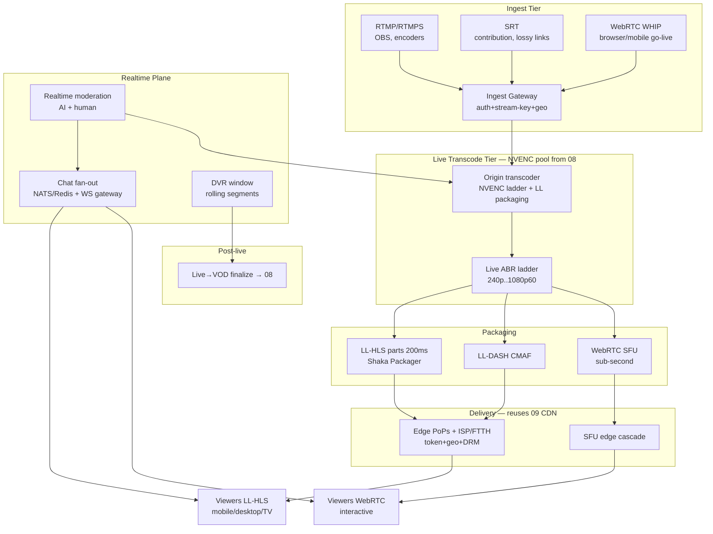
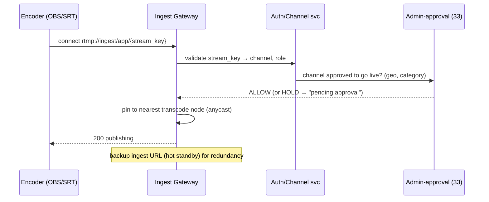
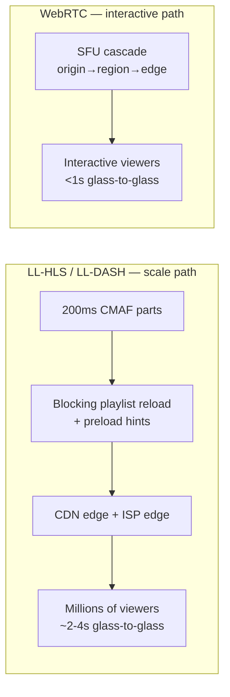
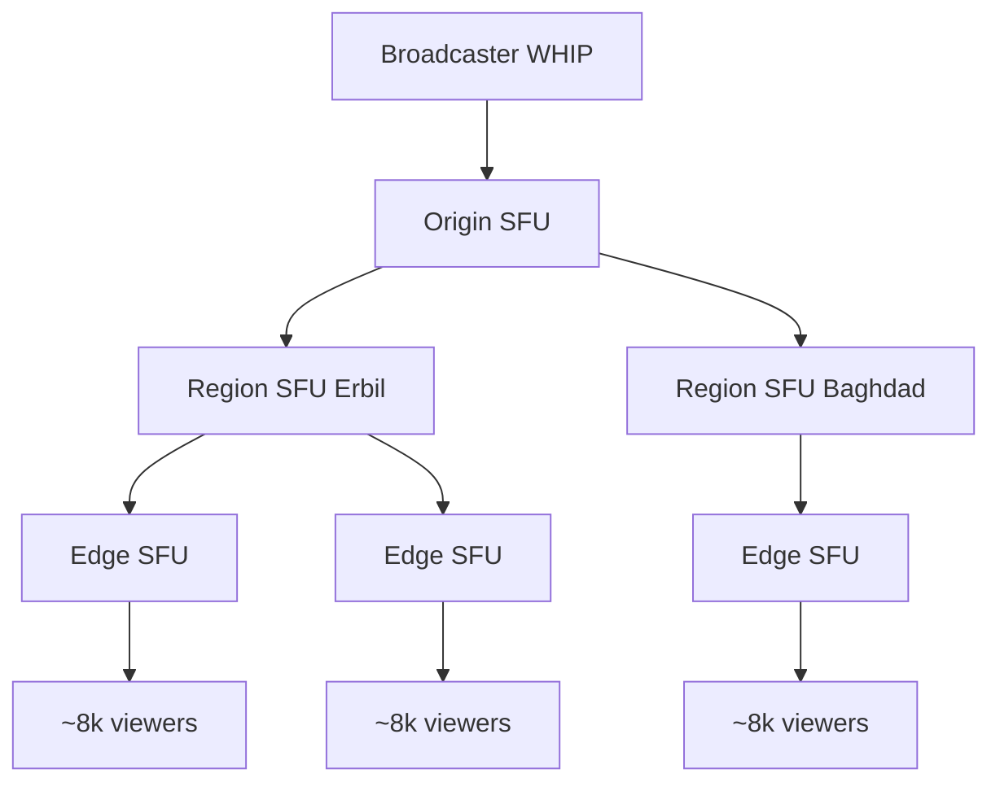
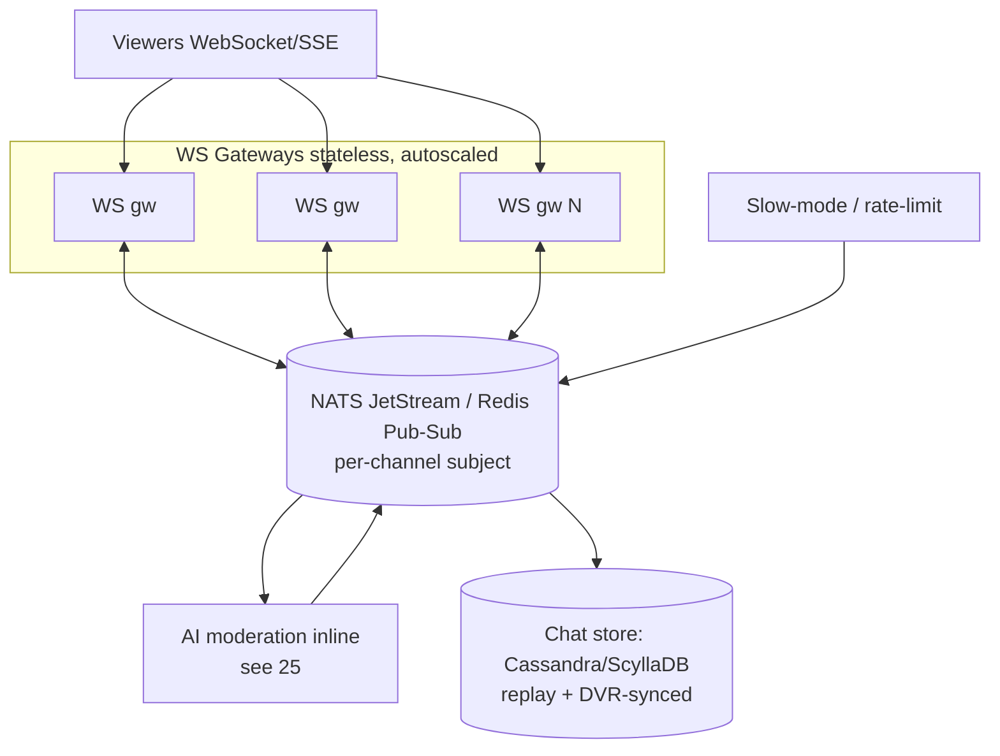
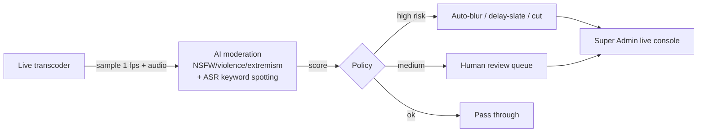
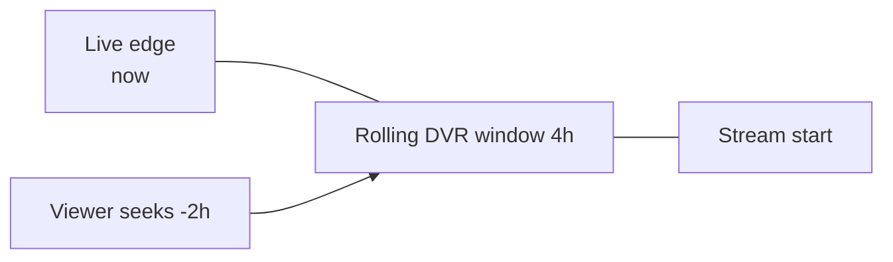
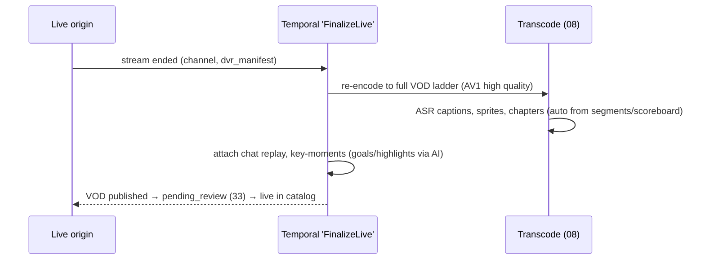
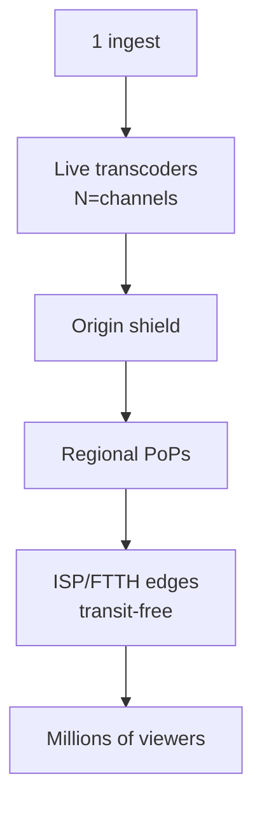
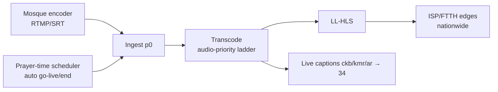

# 10 — Live Streaming

> **Domain:** Media Engine · **Codename:** `ZanaCloud Live`
> **Shares:** [08-video-processing.md](./08-video-processing.md) (NVENC pool + Shaka Packager), [09-streaming-infrastructure.md](./09-streaming-infrastructure.md) (CDN/edge/DRM/geo).
> **Cross-cutting:** [25-content-moderation.md](./25-content-moderation.md) (real-time moderation), [33-platform-constraints.md](./33-platform-constraints.md) (admin-approval, geo, device UX), [21-analytics.md](./21-analytics.md).
> **Status:** v1 blueprint (2026).

---

## 0. Scope

Real-time ingest → transcode → sub-second/low-latency delivery → live chat → DVR/rewind → replay/VOD, scaling to **millions of concurrent viewers**, with **real-time moderation** and the platform constraints (admin-approval of live channels, geo-fencing, device-specific UX, intranet/FTTH).

**Flagship use cases driving requirements:**

| Use case | Profile | Hard requirements |
|---|---|---|
| **Islamic — mosque / Friday khutbah / Quran** | scheduled, very high concurrency in-region, audio-critical | reliable, DVR (rewind a verse), prayer-time scheduling, low cost, Sorani/Kurmanji/Arabic captions |
| **Sports — football matches, leagues** | spiky mega-peaks, 1080p60, latency-sensitive (no spoilers from social) | LL-HLS ≤3 s, millions concurrent, DVR, instant replay clips, geo-fenced rights |
| **Creator live (Twitch-style)** | interactive, sub-second, chat-driven | WebRTC ≤1 s, scaled chat, co-host, gifts |
| **News / events** | breaking, admin-promoted, national | p0 ingest, fast replay→VOD |

---

## 1. End-to-end architecture



---

## 2. Ingest tier

### 2.1 Protocols

| Protocol | Use | Latency (ingest) | Resilience |
|---|---|---|---|
| **RTMP/RTMPS** | OBS, hardware encoders, default creator path | ~2 s | TCP, ubiquitous |
| **SRT** | pro contribution over lossy/long-haul (stadium→core, satellite for remote mosques) | 0.5–2 s (tunable latency buffer) | ARQ, encrypted, survives packet loss |
| **WebRTC WHIP** | browser/mobile "go live" button, sub-second contribution | < 0.5 s | congestion-adaptive |
| **RIST** (optional) | broadcast-grade contribution | tunable | FEC+ARQ |

### 2.2 Ingest gateway



- **Stream keys** are rotating, channel-scoped, revocable (Super Admin can kill any live instantly — [33](./33-platform-constraints.md)).
- **Admin-approval for live:** per constraint, channels/creators must be approved to broadcast (esp. public categories). Approved verified channels (TV stations, sports rights-holders, mosques) get p0 ingest. Unapproved → held or sandboxed.
- **Redundant ingest:** primary + backup URL; SRT auto-failover; gateway anycast to nearest healthy transcoder.
- **Geo at ingest:** broadcaster region recorded for rights/geo-fence propagation downstream.

---

## 3. Live transcode tier

Reuses the **NVENC GPU pool** from [08 §5.3](./08-video-processing.md) (dedicated, non-spot partition — live is real-time-hard). One decode → multi-encode ladder, packaged immediately.

**Live ABR ladder** (latency-optimized; smaller GOP, no slow CPU rungs):

| Rung | Res | FPS | Codec | Bitrate | GOP |
|---|---|---|---|---|---|
| 240p | 426×240 | 30 | H.264/AV1 | 300/200 kbps | 1 s |
| 360p | 640×360 | 30 | H.264/AV1 | 700/400 | 1 s |
| 480p | 854×480 | 30 | H.264/AV1 | 1.2/0.7 Mbps | 1 s |
| 720p | 1280×720 | 30 | H.264/AV1 | 2.5/1.5 | 1 s |
| 720p60 | 1280×720 | 60 | H.264/AV1 | 3.5/2.0 | 1 s |
| 1080p60 | 1920×1080 | 60 | H.264/AV1 | 6.0/3.5 | 1 s |

```bash
# Live NVENC ladder, low-latency tune, 1s GOP, fed straight to packager
ffmpeg -fflags nobuffer -flags low_delay -i srt://ingest?streamid=ch42 \
  -filter_complex "[0:v]split=3[a][b][c];[a]scale_cuda=1920:1080[v1];[b]scale_cuda=1280:720[v2];[c]scale_cuda=640:360[v3]" \
  -map "[v1]" -c:v h264_nvenc -preset p1 -tune ll -rc cbr -b:v 6M -g 60 -bf 0 -forced-idr 1 \
  -map "[v2]" -c:v h264_nvenc -preset p1 -tune ll -rc cbr -b:v 2.5M -g 60 -bf 0 -forced-idr 1 \
  -map "[v3]" -c:v h264_nvenc -preset p1 -tune ll -rc cbr -b:v 700k -g 30 -bf 0 -forced-idr 1 \
  -map 0:a -c:a aac -b:a 128k -ar 48000 \
  -f mpegts "srt://packager:9000?streamid=ch42"
```

- `-bf 0` (no B-frames) + `-tune ll` + CBR → minimal encoder latency.
- AV1 NVENC rungs added where viewer decode supports (saves edge egress on big events).

---

## 4. Low-latency delivery

Two delivery modes selected per use case / device:



### 4.1 LL-HLS (mass scale, sports/mosque/news)

- **CMAF chunked transfer:** 1 s segments split into **200 ms parts**; parts published as encoded → players fetch partial segments via **blocking playlist reload** + `EXT-X-PRELOAD-HINT`.
- Reuses the full **CDN + ISP/FTTH edge** of [09](./09-streaming-infrastructure.md) → scales to millions, transit-free on-net.
- **Glass-to-glass ≈ 2–4 s** — acceptable for sports/sermons, far better than classic 20–30 s HLS.

```m3u8
#EXT-X-VERSION:11
#EXT-X-TARGETDURATION:1
#EXT-X-PART-INF:PART-TARGET=0.200
#EXT-X-SERVER-CONTROL:CAN-BLOCK-RELOAD=YES,PART-HOLD-BACK=0.6,CAN-SKIP-UNTIL=12
#EXT-X-MEDIA-SEQUENCE:9981
#EXT-X-PART:DURATION=0.200,URI="seg9981.0.m4s"
#EXT-X-PART:DURATION=0.200,URI="seg9981.1.m4s"
#EXT-X-PART:DURATION=0.200,URI="seg9981.2.m4s",INDEPENDENT=YES
#EXT-X-PRELOAD-HINT:TYPE=PART,URI="seg9981.3.m4s"
```

### 4.2 WebRTC (interactive, sub-second — creator live, co-watch)

- **SFU (Selective Forwarding Unit)** cascade: origin SFU → regional SFU → edge SFU. Each SFU forwards selected simulcast layers; viewers never connect to the broadcaster directly.
- **Simulcast/SVC** (VP9/AV1-SVC) so the SFU drops layers per viewer bandwidth without re-encode.
- **Cascade fan-out** is how WebRTC reaches large audiences: a tree of SFUs, each handling ~5–10k downstreams, total = fan-out factor ^ depth.



> Beyond ~100k interactive viewers, the player **auto-transitions WebRTC→LL-HLS** (still <4 s) — interactivity (chat) preserved, scale unbounded. Selected per use case in admin config.

### 4.3 Delivery selection matrix

| Use case | Primary | Why |
|---|---|---|
| Friday khutbah / Quran | LL-HLS | huge concurrency, DVR, low cost; latency non-critical |
| Football match | LL-HLS ≤3 s + DRM + geo | scale + rights enforcement; replay clips |
| Twitch-style creator | WebRTC ≤1 s (→LL-HLS overflow) | interaction |
| News/event | LL-HLS, p0 | scale + fast VOD |

---

## 5. Live chat (scaled fan-out)

Sports/mosque events generate **millions of concurrent chat connections** and high message rates.



**Scaling techniques:**

| Technique | Effect |
|---|---|
| **Stateless WS gateways** (autoscaled, ~50–100k conns/node) | horizontal connection scale |
| **Pub/sub fan-out** (NATS JetStream subject per channel) | one publish → N delivery, no N² |
| **Message sampling at mega-scale** | above ~10k msg/s, show a representative sample (full stream stored) so the room is readable |
| **Slow mode / sub-only / followers-only** | rate control, configurable per channel |
| **Sharded rooms** | very large rooms split into shards with cross-shard highlights |
| **Regional gateways** | viewers connect to nearest WS PoP (works intranet) |

**Capacity:** 2M concurrent chat connections / 75k per node ≈ **27 WS gateway nodes** (+ HA). At 50k msg/s peak, NATS JetStream cluster fans out and persists to ScyllaDB for replay (chat is **timestamp-synced to DVR** so rewinding video rewinds chat).

**Realtime chat moderation** ([25](./25-content-moderation.md)): inline AI classifier (toxicity, spam, banned terms incl. Kurdish/Arabic lexicons) on the bus before delivery; human moderators get a queue + one-click timeout/ban; Super Admin global kill.

---

## 6. Real-time content moderation (video/audio)

Live video itself is moderated in near-real-time (critical for public/Islamic categories and admin-approval posture).



- **Broadcast delay buffer** (configurable, e.g. 5–15 s) for sensitive live (news, public events) lets moderation interdict before viewers see content (slate/blur/cut).
- **ASR keyword spotting** on the live audio (Kurdish/Arabic/English) flags prohibited speech.
- Admin live console: monitor, blur, mute, cut, terminate, ban — all no-code ([33](./33-platform-constraints.md)).

---

## 7. DVR / rewind & replay→VOD

### 7.1 DVR window

- Rolling **CMAF segment window** (configurable, e.g. 2–4 h) retained at the live origin + edge.
- Player exposes a seek bar over the window; seeking just requests older segments (already cached).
- **Chat is DVR-synced:** rewinding video shows chat as it was at that timestamp.



### 7.2 Replay → VOD finalization

On stream end, the recorded window is **finalized into a VOD** via the standard pipeline ([08](./08-video-processing.md)):



- Live captions (real-time ASR) are refined into accurate VOD captions + **auto-highlights** (sports goals, sermon chapters) via AI ([13](./13-ai-systems.md)).
- **Instant clips:** during live, users/admins clip the DVR buffer → short shareable VOD (TikTok-style) within seconds, prioritized p0 ([08 §10](./08-video-processing.md)).

---

## 8. Scaling to millions of concurrent viewers

### 8.1 The fan-out hierarchy (mega-event)



The genius: **one channel's segments are identical for all viewers** → pure cache fan-out. The CDN/ISP edge tier of [09](./09-streaming-infrastructure.md) does the heavy lifting; live adds only the real-time origin.

### 8.2 Capacity math — national football final

```
Concurrent viewers ........ 3,000,000 (national prime-time peak)
Avg bitrate (post-ABR) .... 2.5 Mbps (mix; many on 720p mobile)
Aggregate egress .......... 3,000,000 × 2.5 Mbps = 7.5 Tbps

Distribution (per 09 hit ratios for a single hot live stream — near-perfect cacheability):
  ISP/FTTH on-net edges  ~78% → 5.85 Tbps  (transit-free, LAN)
  Regional PoPs          ~20% → 1.50 Tbps
  Origin-shield fill     ~2%  → 0.15 Tbps  (one fetch per part per edge, coalesced)

Edge nodes (160 Gbps/node) for 7.35 Tbps edge+PoP ≈ 46 nodes → ~90 w/ HA.
LIVE ORIGIN load: a single hot stream = a handful of parts/sec × #rungs.
  6 rungs × 5 parts/s = 30 objects/s fetched by the shield ONCE, then fanned out.
  Origin egress ≈ #edges(90) × 30 parts/s × ~250 KB ≈ 0.67 Tbps WORST case
  (request coalescing at shield → realistically << 0.1 Tbps).
```

**Transcode capacity:** GPU sized to **#concurrent channels**, not #viewers. 5,000 simultaneous live channels nationally (Friday peak: many mosques + creators) at ~1 GPU per 4–6 channels (multi-session NVENC) ≈ **~900–1,200 GPUs** in the live partition (dedicated, no spot).

### 8.3 Chat at scale: see §5 (27 WS nodes for 2M conns).

---

## 9. Use-case deep dives

### 9.1 Islamic — mosque & Friday khutbah / Quran



- **Scheduling:** prayer-time calendar auto-creates live windows per mosque; thumbnail/EPG pre-published; edges pre-warmed before Friday peak ([09 prefetch](./09-streaming-infrastructure.md)).
- **Audio-priority ladder:** higher audio bitrate (recitation clarity), lighter video — cheap, robust on weak links.
- **DVR + replay→VOD** so the khutbah is archived and searchable (transcript indexed in [11](./11-search-engine.md)).
- **Captions** in Sorani/Kurmanji/Arabic via Kurdish ASR ([34](./34-kurdish-language-intelligence.md)).
- Intranet-first: most mosque audiences are on-net FTTH → transit-free, works during internet outages.

### 9.2 Sports — live matches & leagues

- **Rights/geo-fencing** strict ([09 §5](./09-streaming-infrastructure.md)): match available only in licensed regions; DRM on premium feeds.
- **1080p60 LL-HLS ≤3 s**, multi-angle (multiple ingests = multiple channels, switchable).
- **AI auto-highlights** (goals, cards) → instant clips, replay VOD with chapters.
- **Mega-peak handling:** pre-warm edges at kickoff; chat sharding; surge autoscale (KEDA) on ingest+WS tiers.
- Spoiler-control: LL latency keeps live ahead of social.

---

## 10. Intranet / FTTH live

Identical pattern to [09 §7](./09-streaming-infrastructure.md): live origin + LL-HLS edges run **inside the ISP island**.

- Mosque/local channels ingest to the **local live origin**; segments fan out over LAN to FTTH subscribers — **fully functional with no public internet**.
- Chat WS gateways + NATS + ScyllaDB have local replicas → chat works on-island.
- Real-time moderation models run locally (bundled).
- If a backhaul exists, the national core can pull a relay of major channels for cross-ISP distribution; otherwise each island is self-sufficient.

---

## 11. Failure modes & SLOs

| Failure | Detection | Mitigation |
|---|---|---|
| Ingest drop (encoder/link) | gateway heartbeat | failover to backup ingest URL; SRT ARQ; "reconnecting" slate |
| Transcode GPU failure | health probe | hot-standby transcoder, anycast re-pin (<2 s gap) |
| Edge overload (mega-peak) | KEDA + edge metrics | surge nodes, shed to LL-HLS from WebRTC |
| Chat flood/spam attack | rate spike | slow-mode auto-enable, AI filter, shard |
| Moderation miss | post-hoc + reports | broadcast delay buffer; human queue; admin kill |

**SLOs:** live availability **99.9%**; glass-to-glass LL-HLS **≤3 s p95**, WebRTC **≤1 s p95**; ingest reconnect gap **<2 s**; chat delivery p95 **<500 ms**; replay→VOD published **<10 min p95** after stream end.

---

## 12. Cross-references

| Doc | Relationship |
|---|---|
| [08-video-processing.md](./08-video-processing.md) | shared NVENC pool + packager; replay→VOD finalization |
| [09-streaming-infrastructure.md](./09-streaming-infrastructure.md) | CDN/edge/ISP delivery, DRM, geo-fence, prefetch |
| [13-ai-systems.md](./13-ai-systems.md) | live moderation, auto-highlights, video understanding |
| [21-analytics.md](./21-analytics.md) | live QoE, concurrency, chat metrics |
| [25-content-moderation.md](./25-content-moderation.md) | realtime chat + video moderation, human queues |
| [33-platform-constraints.md](./33-platform-constraints.md) | live admin-approval, geo, device UX, kill switch |
| [34-kurdish-language-intelligence.md](./34-kurdish-language-intelligence.md) | live Kurdish captions (mosque/news) |

---

*End of 10. Next: [11-search-engine.md](./11-search-engine.md) — finding everything, in Kurdish.*
