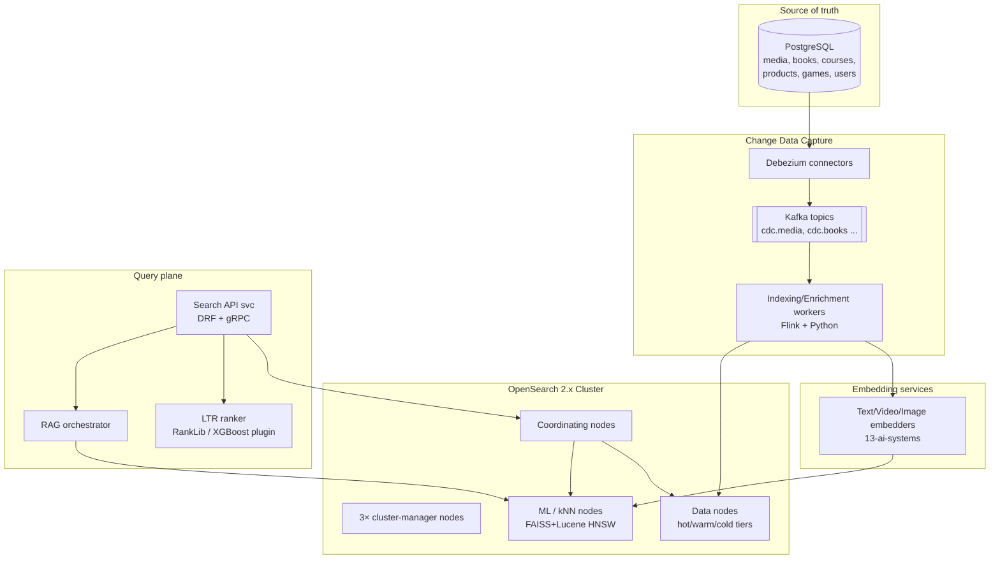
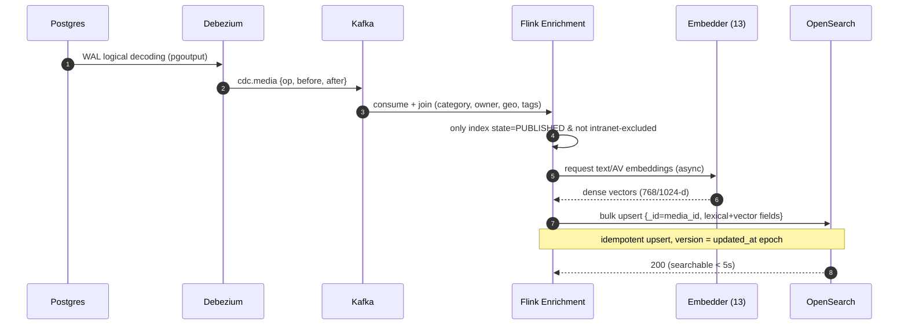
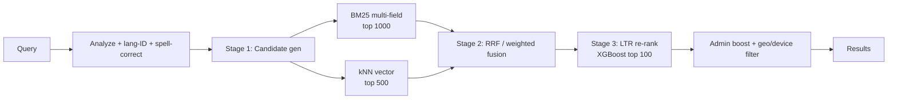
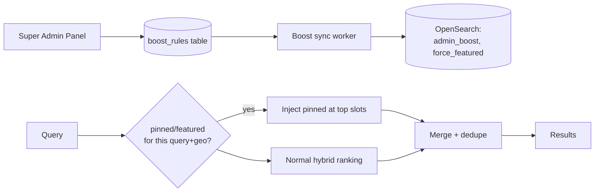
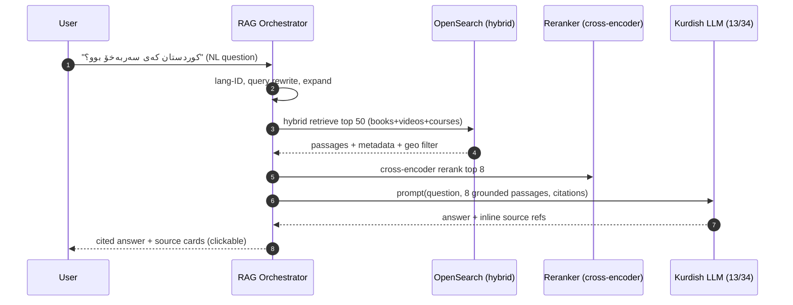
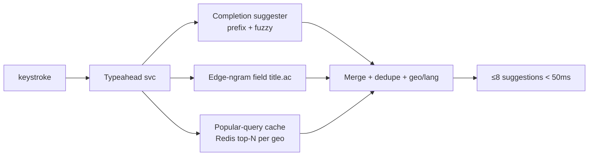

# 11 — Search Engine & Discovery

> **Domain:** Discovery · **Codename:** `ZanaCloud Search`
> **Extends:** MediaCMS `files/` search (Postgres `search` field, basic `SearchVector`) → replaced by OpenSearch.
> **Upstream:** [05-database-architecture.md](./05-database-architecture.md) (CDC source), [06-upload-pipeline.md](./06-upload-pipeline.md) (publish events), [13-ai-systems.md](./13-ai-systems.md) (embeddings/RAG), [34-kurdish-language-intelligence.md](./34-kurdish-language-intelligence.md) (Kurdish analyzers).
> **Downstream:** [12-recommendation-engine.md](./12-recommendation-engine.md) (shared embeddings/feature store), [07-dynamic-category-system.md](./07-dynamic-category-system.md) (per-category verticals).
> **Status:** v1 blueprint (2026).

---

## 0. Scope & responsibilities

ZanaCloud Search is a **hybrid lexical + semantic + RAG** discovery layer across every content vertical: videos, music, books, courses, products (marketplace), games, live streams, channels, and people. It must:

1. Index at national scale (100M+ documents) with **near-real-time** CDC from Postgres (< 5 s publish→searchable).
2. Speak **Kurdish (Sorani Arabic-script + Kurmanji Latin), Arabic, and English** as first-class analyzers with cross-script matching.
3. Provide **BM25 + Learning-to-Rank (LTR)** lexical ranking *and* **vector (kNN)** semantic search, fused into **hybrid** results.
4. Power **AI/RAG answers** ("ask ZanaCloud") grounded in indexed knowledge.
5. Enforce **geo-fencing (country/region/city/ISP) + device + intranet** filters at query time.
6. Honor **admin-boosted / pinned / force-featured** results from the Super Admin Panel.
7. Deliver **per-category verticals** with vertical-specific fields, analyzers, and ranking.
8. Sub-100 ms typeahead, sub-250 ms full search at p95.

---

## 1. Cluster architecture



### 1.1 Topology & sizing

| Node role | Count | Spec | Purpose |
|-----------|-------|------|---------|
| Cluster-manager | 3 | 8 vCPU / 32 GB | quorum, metadata |
| Coordinating | 6 | 16 vCPU / 64 GB | query fan-out/merge |
| Hot data | 24 | 32 vCPU / 256 GB / NVMe | last 90 days, heavy write |
| Warm data | 18 | 16 vCPU / 128 GB / SSD | 90 d–2 y |
| Cold/UltraWarm | 12 | S3-backed searchable snapshots | archive |
| ML/kNN | 12 | GPU-optional, 256 GB RAM | HNSW vector indices |

- **Sharding**: time-and-vertical based. Per-vertical aliases (`videos`, `books`, …) over rolling indices `videos-2026.06`. Primary shards sized ~30–50 GB; replica factor 2 (hot), 1 (warm).
- **Index lifecycle (ILM)**: hot → warm @90 d → cold @2 y → delete/snapshot per retention policy.
- **Cross-cluster replication**: per-region clusters (Erbil, Baghdad) with CCR for the intranet/FTTH partition that has no public egress.

---

## 2. Indexing pipeline (CDC)



- **Debezium** uses `pgoutput` logical replication on `files_media`, `media_review`, `books`, `courses`, `products`, `game`, `users_user`. A single publication + per-table connectors.
- **Filtering**: only documents in `state=PUBLISHED` are indexed (others are deleted from the index). Geo/intranet eligibility from `media_review.allowed_geo` is denormalized into the doc.
- **Enrichment (Flink)**: joins category metadata, owner reputation, denormalizes counts (views/likes), attaches embeddings, runs Kurdish language-ID and transliteration variants.
- **Embeddings**: text → multilingual e5/BGE-M3 (1024-d) fine-tuned for Kurdish; video → frame+ASR fused; cached and re-used by [12-recommendation-engine.md](./12-recommendation-engine.md).
- **Backfill/reindex**: zero-downtime via alias swap; a reindex job replays from Postgres snapshot + Kafka tail.

---

## 3. Multilingual analyzers (Kurdish-first)

The hardest problem: **Sorani** uses Arabic script (RTL), **Kurmanji** uses Latin script, and users mix scripts, omit diacritics, and use Arabic loanwords. See [34-kurdish-language-intelligence.md](./34-kurdish-language-intelligence.md).

### 3.1 Custom analyzers

```json
PUT /_index_template/zana-text
{
  "template": { "settings": { "analysis": {
    "char_filter": {
      "kurdish_normalize": {
        "type": "mapping",
        "mappings": [
          "ي=>ی", "ك=>ک", "ة=>ە", "ﻻ=>لا",
          "أ=>ا", "إ=>ا", "ؤ=>و", "\\u200c=>"
        ]
      }
    },
    "filter": {
      "kurdish_sorani_stem": { "type": "stemmer_override",
        "rules_path": "analysis/ckb_stems.txt" },
      "kurdish_stop": { "type": "stop", "stopwords_path": "analysis/ckb_stop.txt" },
      "latin_kurmanji_folding": { "type": "asciifolding", "preserve_original": true },
      "edge_ngram_2_20": { "type": "edge_ngram", "min_gram": 2, "max_gram": 20 }
    },
    "analyzer": {
      "ckb_sorani": {
        "type": "custom", "char_filter": ["kurdish_normalize"],
        "tokenizer": "icu_tokenizer",
        "filter": ["lowercase","kurdish_stop","kurdish_sorani_stem"]
      },
      "kmr_kurmanji": {
        "type": "custom", "tokenizer": "icu_tokenizer",
        "filter": ["lowercase","latin_kurmanji_folding"]
      },
      "arabic_zana": {
        "type": "custom", "char_filter": ["kurdish_normalize"],
        "tokenizer": "icu_tokenizer",
        "filter": ["lowercase","arabic_normalization","arabic_stem"]
      },
      "autocomplete": {
        "type": "custom", "char_filter": ["kurdish_normalize"],
        "tokenizer": "icu_tokenizer",
        "filter": ["lowercase","edge_ngram_2_20"]
      },
      "transliterate_ckb_to_latin": {
        "type": "custom", "char_filter": ["kurdish_normalize"],
        "tokenizer": "icu_tokenizer",
        "filter": ["lowercase","icu_transform_ckb_latin"]
      }
    }
  }}}
}
```

- **Cross-script matching**: a Sorani title is indexed in both `ckb_sorani` and a transliterated Latin sub-field, so a Kurmanji-Latin query can match. Query-time both analyzers are tried (multi-field `cross_fields`).
- **ICU**: `icu_tokenizer` handles RTL Arabic-script segmentation; `icu_transform` provides Sorani↔Latin transliteration.
- **Arabic**: full `arabic_normalization` + stemming for the large Arabic-speaking Iraqi audience.

---

## 4. Index mappings (per-category verticals)

Each vertical has its own index/template. Shared base + vertical-specific extensions.

### 4.1 Videos index

```json
PUT /videos-000001
{
  "mappings": { "properties": {
    "media_id":   { "type": "keyword" },
    "title": {
      "type": "text", "analyzer": "ckb_sorani",
      "fields": {
        "kmr": { "type": "text", "analyzer": "kmr_kurmanji" },
        "ar":  { "type": "text", "analyzer": "arabic_zana" },
        "latin": { "type": "text", "analyzer": "transliterate_ckb_to_latin" },
        "ac":  { "type": "text", "analyzer": "autocomplete", "search_analyzer": "standard" },
        "exact": { "type": "keyword" }
      }
    },
    "description":   { "type": "text", "analyzer": "ckb_sorani" },
    "transcript":    { "type": "text", "analyzer": "ckb_sorani" },
    "tags":          { "type": "keyword" },
    "category":      { "type": "keyword" },
    "subcategory":   { "type": "keyword" },
    "channel_id":    { "type": "keyword" },
    "owner_rep":     { "type": "float" },
    "duration_s":    { "type": "integer" },
    "language":      { "type": "keyword" },
    "published_at":  { "type": "date" },
    "views":         { "type": "long" },
    "likes":         { "type": "long" },
    "engagement":    { "type": "float" },
    "freshness":     { "type": "date" },
    "geo_allow":     { "type": "keyword" },   // ISO country/region/city/ISP codes
    "intranet_only": { "type": "boolean" },
    "device_ok":     { "type": "keyword" },   // mobile|desktop|tv
    "admin_boost":   { "type": "float" },     // pin/promote weight
    "force_featured":{ "type": "boolean" },
    "title_vector":  { "type": "knn_vector", "dimension": 1024,
        "method": { "name":"hnsw","engine":"lucene","space_type":"cosinesimil",
                    "parameters": { "m":16, "ef_construction":256 } } },
    "content_vector":{ "type": "knn_vector", "dimension": 1024,
        "method": { "name":"hnsw","engine":"lucene","space_type":"cosinesimil" } }
  }},
  "settings": { "index.knn": true, "number_of_shards": 6, "number_of_replicas": 2 }
}
```

### 4.2 Vertical-specific fields

| Vertical | Extra fields | Special analyzer/ranking |
|----------|-------------|--------------------------|
| **books** ([16](./16-digital-library-knowledge-hub.md)) | author, isbn, publisher, page_count, full_text (OCR), genre, era | full-text index, phrase-heavy, citation boost |
| **courses** ([19](./19-learning-academy.md)) | instructor, level, skills[], syllabus, duration_h, rating | skill-tag matching, level filter |
| **products** (marketplace) | price, brand, attrs{}, in_stock, seller_rep, FIB-eligible | price/availability ranking, faceting |
| **games** ([18](./18-gaming-ecosystem.md)) | genre, platform, multiplayer, followed_devs | popularity + recency |
| **live** ([10](./10-live-streaming.md)) | is_live, concurrent_viewers, started_at | live boost, decays fast |
| **people/channels** | display_name, handle, subscriber_count, verified | handle prefix, verified boost |

---

## 5. Ranking: BM25 + Learning-to-Rank + Hybrid

### 5.1 Three-stage retrieval



### 5.2 Hybrid fusion query

```json
POST /videos/_search
{
  "size": 20,
  "query": { "bool": {
    "filter": [
      { "terms": { "geo_allow": ["IQ","IQ-KR","IQ-KR-ERB","ISP:fastlink"] } },
      { "term":  { "device_ok": "mobile" } },
      { "term":  { "intranet_only": false } }
    ],
    "should": [
      { "multi_match": {
          "query": "{{q}}", "type": "cross_fields",
          "fields": ["title^4","title.kmr^3","title.ar^2","title.latin^2",
                     "description^1.5","transcript","tags^2"],
          "operator": "and", "fuzziness": "AUTO" } }
    ]
  }},
  "knn": { "field": "content_vector", "query_vector": [/*1024-d*/],
           "k": 100, "num_candidates": 500, "boost": 1.4 },
  "rescore": { "window_size": 100, "query": {
     "rescore_query": { "sltr": { "model": "video_ltr_v7",
       "params": { "keywords": "{{q}}" } } },
     "query_weight": 0.3, "rescore_query_weight": 1.7 } },
  "rank": { "rrf": { "rank_window_size": 100, "rank_constant": 60 } }
}
```

- **RRF** (Reciprocal Rank Fusion) merges BM25 and kNN result sets without score-scale calibration headaches; alternatively weighted-sum when scores are normalized.
- **LTR**: the OpenSearch LTR plugin runs an XGBoost/LambdaMART model `video_ltr_v7` over a feature log.

### 5.3 LTR features

| Feature | Source |
|---------|--------|
| BM25 score per field | OpenSearch |
| Vector cosine sim | kNN |
| CTR / watch-through (historical) | analytics ([21](./21-analytics.md)) |
| Freshness decay | `published_at` |
| Owner reputation | users |
| Personalization match (user embedding · doc) | feature store ([12](./12-recommendation-engine.md)) |
| Geo proximity | query geo vs content origin |
| Engagement velocity | trending signal |
| Admin boost weight | `admin_boost` |

Training data is generated from **click/watch logs with position-debiasing** (inverse propensity weighting). Models retrained weekly; offline NDCG@10 gates deploy.

---

## 6. Admin-boosted / pinned / force-featured results

The no-code Super Admin Panel ([07-dynamic-category-system.md](./07-dynamic-category-system.md)) writes boost directives that the search layer honors:



- **Pinned queries**: `{query_pattern, category, geo, slot, media_id, ttl}` — pin specific media to slot N for matching queries/geo (e.g., national announcements).
- **Force-feature**: a multiplicative `admin_boost` field (1.0 default → up to 10×) applied in `function_score`. Logged immutably for audit ([24-security.md](./24-security.md)).
- **Promotion** is geo-and-device aware (e.g., feature on TV vertical only). Pins never bypass geo/intranet eligibility filters.

---

## 7. Semantic / vector & AI-RAG search

### 7.1 Vector search

Dense retrieval over `content_vector` (1024-d, BGE-M3 multilingual fine-tuned on Kurdish). Used for: "find similar," natural-language queries, and zero-lexical-overlap matches (cross-script, paraphrase). HNSW (`m=16, ef_construction=256`) on Lucene engine; quantization (PQ) on warm tier to cut memory.

### 7.2 RAG ("Ask ZanaCloud")



- **Grounding only**: the LLM answers strictly from retrieved, **geo-eligible**, published passages; citations link back to source media. No hallucinated sources surfaced.
- **Cross-encoder reranker** (multilingual) sharpens the top-K before generation.
- **Kurdish LLM** served on the ML tier ([13-ai-systems.md](./13-ai-systems.md)); answers respect content policy and category context.

---

## 8. Autocomplete / typeahead



- **Completion suggester** (FST) for instant prefix; **edge-ngram** field for infix; **fuzzy** for typos/missing diacritics.
- **Cross-script suggestions**: typing Latin "kurd" suggests Sorani "کوردستان" via the transliteration field.
- **Personalized + trending**: blends user history and per-geo popular queries (Redis, refreshed every 30 s).
- **Latency budget**: p95 < 50 ms (coordinating-node-local, no LTR).

---

## 9. Geo & device filtering at query time

Every query carries a **resolved context** (from the geo/device middleware, [02-system-architecture.md](./02-system-architecture.md), [09-streaming-infrastructure.md](./09-streaming-infrastructure.md)):

```json
"filter": [
  { "terms": { "geo_allow": ["IQ","IQ-KR-ERB","ISP:newroz","CITY:erbil"] } },
  { "term":  { "device_ok": "tv" } },
  { "bool": { "should": [
      { "term": { "intranet_only": false } },
      { "term": { "network_partition": "{{client_partition}}" } } ] } }
]
```

- **Intranet/FTTH mode**: queries hit the in-country cluster only; `intranet_only:true` documents are *exclusively* visible inside the ISP partition and hidden on the public internet (and vice-versa for public-only).
- **Device verticals**: TV context filters to `device_ok:tv` and media-only categories (Netflix-style); Mobile favors short-form; Desktop sees all.
- **City/ISP granularity**: geo codes are denormalized as keyword arrays for O(1) `terms` filtering.

---

## 10. REST + gRPC API

### 10.1 REST

```
GET  /api/v1/search?q=&vertical=videos&category=&page=&size=
     &lang=ckb&device=mobile           # geo/ISP from auth+edge headers
     → { hits:[{id,title,snippet,score,thumb,...}], total, facets, took_ms }

GET  /api/v1/search/suggest?q=kur&vertical=all&lang=ckb   # typeahead
POST /api/v1/search/ask                # RAG  {question, verticals[], lang}
     → { answer, citations:[{media_id,passage,score}] }
GET  /api/v1/search/similar/{media_id} # vector "more like this"

# Admin
POST /api/v1/admin/search/boost        # {query_pattern,category,geo,media_id,slot,weight,ttl}
DELETE /api/v1/admin/search/boost/{id}
```

### 10.2 gRPC / protobuf

```protobuf
syntax = "proto3";
package zana.search.v1;

service Search {
  rpc Query   (QueryReq)   returns (QueryResp);
  rpc Suggest (SuggestReq) returns (SuggestResp);
  rpc Ask     (AskReq)     returns (stream AskChunk);   // streamed RAG tokens
}

message QueryReq {
  string q = 1;
  string vertical = 2;          // videos|books|courses|products|games|all
  string category = 3;
  string lang = 4;              // ckb|kmr|ar|en|auto
  GeoContext geo = 5;
  string device = 6;            // mobile|desktop|tv
  string user_id = 7;           // for personalization features
  int32  page = 8; int32 size = 9;
}
message GeoContext { string country=1; string region=2; string city=3;
                     string isp=4; string partition=5; }   // partition: public|intranet
message Hit { string id=1; string title=2; string snippet=3; float score=4;
              string thumb=5; map<string,string> meta=6; }
message QueryResp { repeated Hit hits=1; int64 total=2; int32 took_ms=3;
                    bytes facets_json=4; }
message SuggestReq { string q=1; string vertical=2; string lang=3; GeoContext geo=4; }
message SuggestResp { repeated string suggestions=1; }
message AskReq { string question=1; repeated string verticals=2; string lang=3;
                 GeoContext geo=4; }
message AskChunk { string token=1; repeated Citation citations=2; bool done=3; }
message Citation { string media_id=1; string passage=2; float score=3; }
```

---

## 11. Capacity & SLOs

| Metric | Target |
|--------|--------|
| Indexed documents | 100M+ (all verticals) |
| Publish→searchable | < 5 s p95 |
| Full search latency | < 250 ms p95 |
| Typeahead latency | < 50 ms p95 |
| RAG answer (first token) | < 1.2 s p95 |
| Peak QPS | 80,000 (search) / 300,000 (suggest) |
| kNN recall@10 | ≥ 0.95 |
| Index size (hot) | ~6 TB primary |
| Reindex (full) | < 6 h zero-downtime |

---

## 12. Cross-references

- CDC source schema → [05-database-architecture.md](./05-database-architecture.md)
- Publish events / state → [06-upload-pipeline.md](./06-upload-pipeline.md)
- Embeddings & Kurdish LLM → [13-ai-systems.md](./13-ai-systems.md), [34-kurdish-language-intelligence.md](./34-kurdish-language-intelligence.md)
- Shared feature store / personalization → [12-recommendation-engine.md](./12-recommendation-engine.md)
- Per-category verticals & Super Admin boosts → [07-dynamic-category-system.md](./07-dynamic-category-system.md)
- Geo/device/intranet resolution → [09-streaming-infrastructure.md](./09-streaming-infrastructure.md), [02-system-architecture.md](./02-system-architecture.md)
- Ranking signal logs → [21-analytics.md](./21-analytics.md)
