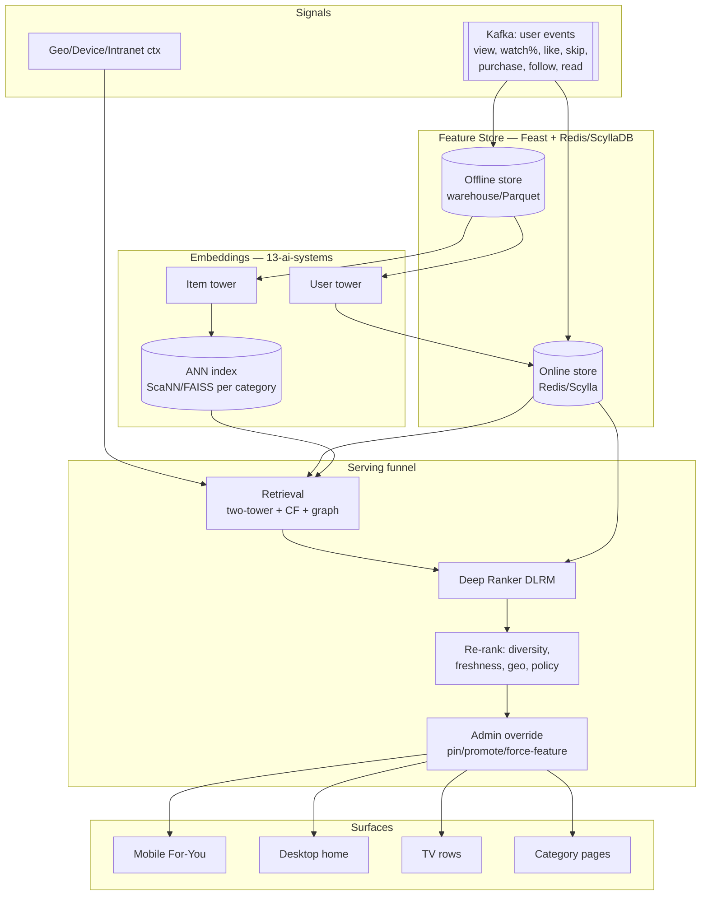
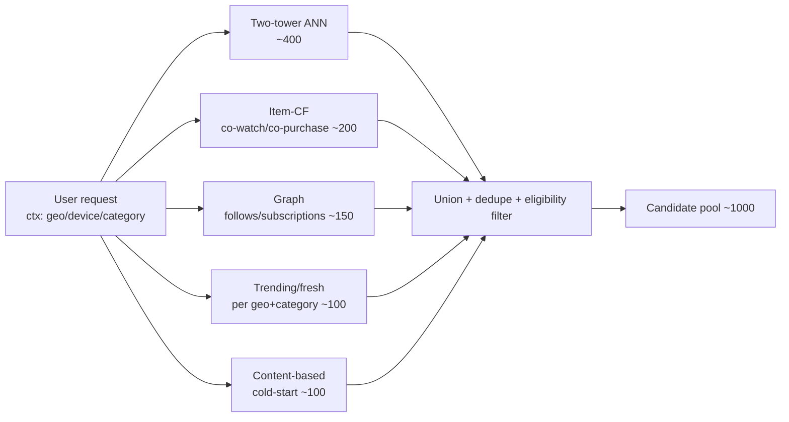
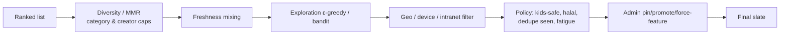
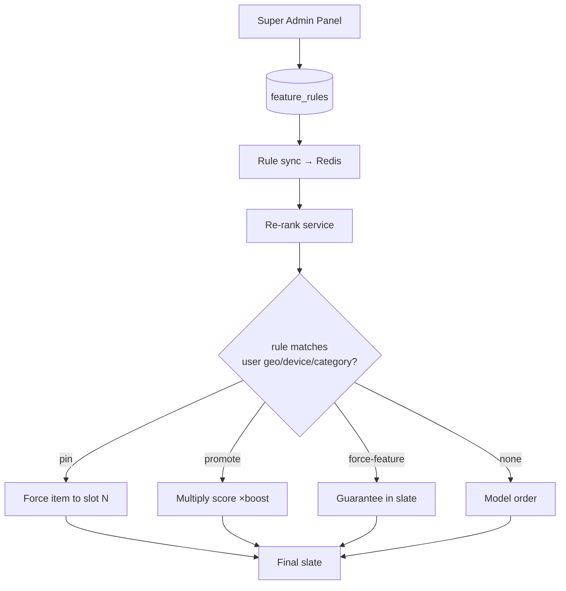
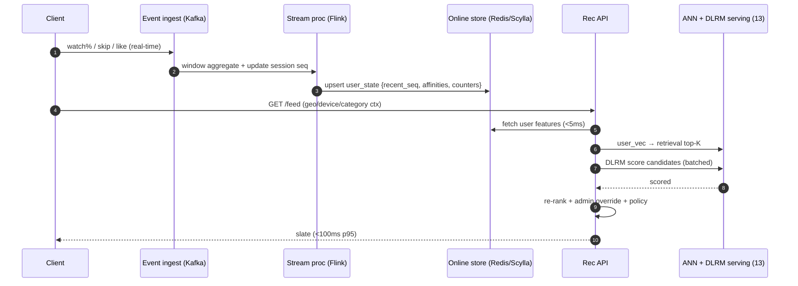
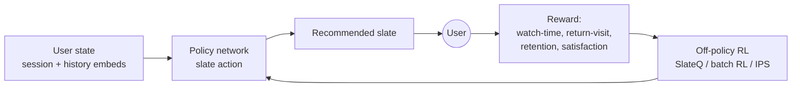
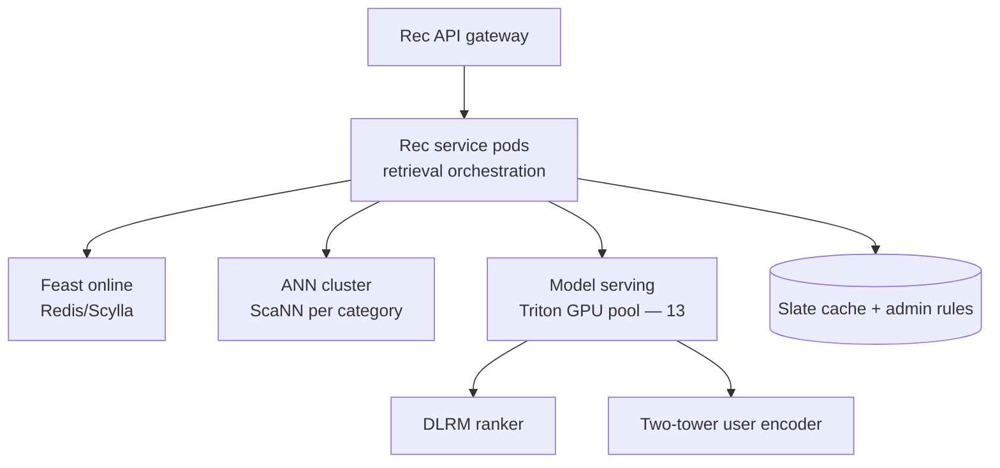

# 12 — Recommendation & Personalization Engine

> **Domain:** Discovery · **Codename:** `ZanaCloud Recommender`
> **Upstream:** [21-analytics.md](./21-analytics.md) (event stream), [13-ai-systems.md](./13-ai-systems.md) (embeddings/model serving), [11-search-engine.md](./11-search-engine.md) (shared embeddings/feature store), [05-database-architecture.md](./05-database-architecture.md).
> **Driven by:** [07-dynamic-category-system.md](./07-dynamic-category-system.md) (per-category algorithms + Super Admin overrides).
> **Status:** v1 blueprint (2026).

---

## 0. Scope & responsibilities

The Recommender powers every personalized surface: the mobile TikTok-style For-You feed, the desktop FB+YT home, the TV Netflix rows, category homepages, "up next," sidebars, push notifications, and email digests. Core requirements:

1. **Multi-stage funnel**: retrieval (millions → thousands) → ranking (thousands → hundreds) → re-ranking/policy (diversity, freshness, geo, admin) → final slate.
2. **Two-tower candidate generation** + **collaborative filtering** + **graph** + **content** retrievers blended.
3. **Deep ranking (DLRM)** scoring multi-objective (watch-time, completion, like, share, retention).
4. **Real-time personalization**: online feature store, streaming user-state updates, < 100 ms inference.
5. **Per-category algorithms**: Movies=watch history, Music=listening, Gaming=followed games, Sports=teams, Islamic=scholars/topics, Kids=age/level, Library=reading, Learning=progress, Marketplace=purchases.
6. **Admin override**: pin / promote / force-feature slots that bypass or bias the model.
7. **Cold-start**: new users (onboarding, geo/demographic priors) and new content (content-based, exploration).
8. **Reinforcement learning** for long-term value (retention, not just immediate clicks).
9. **Geo / device / intranet** awareness throughout.

---

## 1. End-to-end architecture



---

## 2. Retrieval (candidate generation)

Multiple retrievers run in parallel; their candidates are unioned (dedupe) before ranking. Each returns a few hundred items.



### 2.1 Two-tower model

```mermaid
flowchart TB
    subgraph UT[User Tower]
        UF[User features:<br/>history embeds, demographics,<br/>geo, device, category affinity,<br/>recent session seq] --> UMLP[MLP + sequence encoder<br/>Transformer over last N events]
        UMLP --> UV[user_vec 256-d]
    end
    subgraph IT[Item Tower]
        IF[Item features:<br/>content embed, category,<br/>creator, age, popularity] --> IMLP[MLP]
        IMLP --> IV[item_vec 256-d]
    end
    UV -. dot product .-> SCORE[in-batch softmax<br/>sampled negatives]
    IV -. .-> SCORE
```

- **Training**: in-batch + hard negative sampling, sampled-softmax loss. Trained nightly on watch/engagement logs; **per-category item towers** so embeddings live in the right semantic space.
- **Serving**: item vectors indexed in **ScaNN/FAISS ANN** (per category). At request, the user tower computes `user_vec` online from the live session sequence (last-N events from the online store) → ANN top-K. Sub-10 ms.
- **Sequence model**: a Transformer encodes the user's recent action sequence (SASRec/BERT4Rec-style) so the feed reacts within a session.

### 2.2 Collaborative filtering & graph

- **Item-CF**: co-engagement matrix (co-watch, co-purchase, co-read) with ALS/implicit-MF embeddings; "because you watched X."
- **Graph**: GNN (or personalized PageRank) over the follow/subscribe/creator graph for social candidates.

---

## 3. Deep ranking (DLRM)

The ranker scores each candidate with a multi-task deep model.

```mermaid
flowchart TB
    subgraph IN[Inputs per (user,item)]
        SP[Sparse features:<br/>user_id, item_id, creator,<br/>category, geo, device] --> EMBT[Embedding tables]
        DN[Dense features:<br/>ctr, watch%, recency,<br/>price, popularity, affinity]
    end
    EMBT --> INT[Feature interaction<br/>DLRM dot-interactions + DCN-v2 cross]
    DN --> INT
    INT --> MMOE[MMoE multi-gate<br/>shared experts]
    MMOE --> H1[Head: P(watch>30s)]
    MMOE --> H2[Head: P(complete)]
    MMOE --> H3[Head: P(like/share)]
    MMOE --> H4[Head: E(retention value)]
    H1 & H2 & H3 & H4 --> COMB[Weighted combine<br/>per-category objective weights]
    COMB --> S[final score]
```

- **Architecture**: DLRM-style embedding tables + dot-product feature interactions, augmented with **DCN-v2** explicit cross layers and an **MMoE** multi-task head (Multi-gate Mixture-of-Experts) to predict several objectives without negative transfer.
- **Objective combination**: `score = Σ wᵢ · headᵢ`, where weights `wᵢ` are **per-category** (e.g., Learning weights completion/retention; TikTok-feed weights watch-time + share). Configured in the Super Admin Panel ([07](./07-dynamic-category-system.md)).
- **Calibration**: Platt/isotonic so heads are comparable across surfaces.
- **Position-debiasing**: a shallow bias tower removes position/exposure bias during training (logged via [21-analytics.md](./21-analytics.md)).

---

## 4. Re-ranking & policy



- **Diversity**: MMR + per-creator/category caps to avoid filter bubbles.
- **Exploration**: contextual bandit (LinUCB/Thompson) injects a fraction of uncertain items for learning and creator fairness.
- **Policy**: removes already-seen, applies fatigue (don't re-show a skipped item), kids-safety, halal filters for Islamic vertical.
- **Geo/device/intranet**: hard filter — content not eligible in the user's country/region/city/ISP or network partition is dropped (mirrors [11-search-engine.md](./11-search-engine.md) §9).

---

## 5. Admin pin / promote / force-feature

The no-code Super Admin Panel ([07-dynamic-category-system.md](./07-dynamic-category-system.md)) can override the model at the re-rank stage:



| Override | Effect | Scope | Audited |
|----------|--------|-------|---------|
| **Pin** | fixed slot (e.g. slot 1) | query/surface + geo + device | yes |
| **Promote** | multiplicative score boost (≤10×) | category/surface | yes |
| **Force-feature** | guaranteed inclusion in top-K | geo/device targeted | yes |
| **Suppress** | exclude (negative override) | global/geo | yes |

Overrides **never bypass geo/intranet/kids-safety** filters and are logged immutably ([24-security.md](./24-security.md)). They are surfaced as distinct "promoted" slots where policy requires labeling.

---

## 6. Per-category recommendation algorithms

Each category plugs a strategy: which signals dominate retrieval, which objective weights the ranker uses, and which re-rank policies apply. Configured via [07-dynamic-category-system.md](./07-dynamic-category-system.md).

| Category | Primary signals | Retrieval emphasis | Ranker objective weights | Special policy |
|----------|-----------------|--------------------|--------------------------|----------------|
| **Movies/Series** | watch history, genre, completion | two-tower + co-watch; "continue watching" | completion + retention | episodic continuity, no spoilers |
| **Music** | listening history, skips, loops, time-of-day | sequential session model + audio-embed CF | watch%(listen) + replay | radio/auto-mix, artist diversity |
| **Gaming** ([18](./18-gaming-ecosystem.md)) | followed games/devs, playtime, platform | graph (follows) + trending | engagement + follow-affinity | live-stream boost when game live |
| **Sports** | followed teams/leagues, live events | team-graph + event freshness | freshness + watch% | live match priority, region team bias |
| **Islamic** | followed scholars, topics, madhhab | scholar/topic graph + content-embed | completion + topic match | halal-only filter, scholar trust |
| **Kids** | age, level, language | age/level-gated content-based | completion + educational value | strict allowlist, time limits, no autoplay-to-adult |
| **Library** ([16](./16-digital-library-knowledge-hub.md)) | reading history, genres, progress | content-embed + co-read CF | reading completion + dwell | series/author continuity |
| **Learning** ([19](./19-learning-academy.md)) | course progress, skills, goals | skill-graph + prerequisite path | progress + mastery + retention | next-lesson, prerequisite ordering |
| **Marketplace** | purchases, cart, views, FIB | co-purchase CF + content | purchase-propensity + margin | in-stock, price/geo, no repeat-buy |

Implementation: a `CategoryStrategy` resolves `{retrievers[], objective_weights{}, rerank_policies[], ann_index}` from config; the funnel is parameterized, not forked.

```python
# recommender/strategy.py
@dataclass
class CategoryStrategy:
    retrievers: list[str]          # ["two_tower","co_watch","graph","trending"]
    objective_weights: dict        # {"watch":0.5,"complete":0.3,"share":0.2}
    rerank_policies: list[str]     # ["diversity","fatigue","halal"]
    ann_index: str                 # "movies_v3"
    cold_start: str                # "popularity_geo" | "onboarding_taste"

REGISTRY = {
  "movies":     CategoryStrategy(["two_tower","co_watch"], {"complete":.5,"retention":.5}, ["diversity","continue"], "movies_v3", "popularity_geo"),
  "music":      CategoryStrategy(["session_seq","audio_cf"], {"listen":.6,"replay":.4}, ["artist_diversity"], "music_v3", "onboarding_taste"),
  "kids":       CategoryStrategy(["content_based"], {"complete":.5,"educational":.5}, ["age_gate","time_limit","allowlist"], "kids_v2", "age_level"),
  "learning":   CategoryStrategy(["skill_graph"], {"progress":.5,"mastery":.3,"retention":.2}, ["prereq_order"], "courses_v3", "goal_based"),
  "marketplace":CategoryStrategy(["co_purchase","content"], {"purchase":.7,"margin":.3}, ["in_stock","no_repeat"], "products_v3", "popularity_geo"),
  # ... sports, islamic, gaming, library
}
```

---

## 7. Real-time personalization & feature store



- **Feature store (Feast)**: offline (training, point-in-time correct) + online (serving). Online backed by Redis (low-latency) / ScyllaDB (high-cardinality user state).
- **Streaming updates**: Flink consumes the event stream, updating the user's recent-action sequence and affinity counters within ~1–2 s, so the very next request reflects the just-watched item.
- **Online inference**: model serving (Triton/TorchServe, see [13-ai-systems.md](./13-ai-systems.md)) with GPU batching; DLRM scoring of ~1000 candidates in a single batched call.
- **Caching**: per-user slate cached briefly (seconds) with fast invalidation on strong signals (a like/skip).

---

## 8. Reinforcement learning (long-term value)



- **Why RL**: pure click/watch maximization causes clickbait and short-term traps. RL optimizes **long-term retention** (D1/D7/D30 return) and session-level value.
- **Methods**: off-policy / batch RL (SlateQ, Conservative Q-Learning) trained on logged data with importance weighting (safe, no risky online exploration on all traffic).
- **Reward shaping**: combine watch-time, completion, return-visits, explicit feedback, and anti-clickbait penalties (high CTR + early skip = penalized).
- **Guardrails**: RL policy bounded by the policy/diversity re-rank stage; A/B-gated rollout.

---

## 9. Cold-start

| Cold-start type | Strategy |
|-----------------|----------|
| **New user** | onboarding taste picker + geo/demographic popularity priors; rapid session learning via the sequence model; heavier exploration |
| **New item** | content-based retrieval (content embedding from [13](./13-ai-systems.md)) + creator priors; exploration budget (bandit) to gather early signal; "fresh" boost decays |
| **New category** | seed with content similarity + admin curation until interaction data accrues |
| **Sparse-signal geo** | fall back to regional/national trending with content-based personalization |

New items get a guaranteed **exploration impression budget** so the catalog stays discoverable and creators (free platform) get fair early exposure.

---

## 10. Data model & feature schema (selected)

```sql
-- Online user state (mirrored in Redis/Scylla; warehouse is source for training)
CREATE TABLE user_rec_state (
    user_id          BIGINT PRIMARY KEY,
    recent_seq       JSONB,        -- last N {item_id, action, ts, watch_pct}
    category_affinity JSONB,       -- {movies:0.8, music:0.3, ...}
    geo              JSONB,        -- {country,region,city,isp,partition}
    device_pref      TEXT,
    onboarding_taste JSONB,        -- cold-start picks
    user_vec         BYTEA,        -- 256-d cached embedding
    updated_at       TIMESTAMPTZ NOT NULL DEFAULT now()
);

-- Admin override rules
CREATE TABLE feature_rules (
    id          BIGSERIAL PRIMARY KEY,
    kind        TEXT NOT NULL CHECK (kind IN ('pin','promote','force_feature','suppress')),
    media_id    BIGINT,
    category    TEXT,
    surface     TEXT,             -- foryou|home|tv|category
    geo         JSONB,
    device      TEXT,
    slot        INT,              -- for pin
    boost       FLOAT,            -- for promote
    starts_at   TIMESTAMPTZ,
    ends_at     TIMESTAMPTZ,
    created_by  BIGINT NOT NULL,
    created_at  TIMESTAMPTZ NOT NULL DEFAULT now()
);
CREATE INDEX idx_frules_active ON feature_rules(category, surface)
    WHERE ends_at IS NULL OR ends_at > now();

-- Interaction log (Kafka → warehouse; training source)
-- {user_id, item_id, category, action, watch_pct, position, surface,
--  geo, device, ts, model_version}  (see 21-analytics)
```

---

## 11. REST + gRPC API

### 11.1 REST

```
GET  /api/v1/feed?surface=foryou&category=&size=20      # personalized slate
     → { items:[{id, score, reason, promoted?}], next_cursor, model_version }
GET  /api/v1/recs/up-next?media_id=                      # autoplay next
GET  /api/v1/recs/similar/{media_id}
GET  /api/v1/recs/category/{category}/home               # category page rows
POST /api/v1/recs/feedback   {item_id, action: not_interested|seen|hide}

# Admin
POST   /api/v1/admin/recs/rule    # pin/promote/force-feature/suppress
DELETE /api/v1/admin/recs/rule/{id}
GET    /api/v1/admin/recs/preview?user_segment=&surface=   # what-if preview
```

### 11.2 gRPC / protobuf

```protobuf
syntax = "proto3";
package zana.recs.v1;

service Recommender {
  rpc GetFeed   (FeedReq)   returns (FeedResp);
  rpc GetUpNext (UpNextReq) returns (FeedResp);
  rpc Feedback  (FeedbackReq) returns (Ack);
}

message FeedReq {
  string user_id = 1;
  string surface = 2;            // foryou|home|tv|category
  string category = 3;
  Ctx ctx = 4;
  int32 size = 5;
  string cursor = 6;
}
message Ctx { string country=1; string region=2; string city=3; string isp=4;
              string device=5; string partition=6; }  // partition: public|intranet
message Item { string id=1; float score=2; string reason=3; bool promoted=4;
               int32 slot=5; }
message FeedResp { repeated Item items=1; string next_cursor=2;
                   string model_version=3; }
message UpNextReq { string user_id=1; string media_id=2; Ctx ctx=3; }
message FeedbackReq { string user_id=1; string item_id=2; string action=3; }
message Ack { bool ok=1; }
```

---

## 12. Serving infra & capacity



| Metric | Target |
|--------|--------|
| Feed latency (retrieval→ranking→rerank) | < 100 ms p95 |
| Candidate pool per request | ~1000 |
| Real-time feature freshness | < 2 s |
| Peak feed QPS | 150,000 |
| DLRM scoring throughput | ~1000 items / request, GPU-batched |
| Model refresh cadence | DLRM daily, two-tower nightly, RL weekly |
| ANN recall@100 | ≥ 0.95 |
| A/B framework | per-surface, retention-gated rollout |

---

## 13. Cross-references

- Event stream / interaction logs → [21-analytics.md](./21-analytics.md)
- Embeddings, ANN, model serving (Triton/GPU) → [13-ai-systems.md](./13-ai-systems.md)
- Shared embeddings & feature store with search → [11-search-engine.md](./11-search-engine.md)
- Per-category strategies & Super Admin overrides → [07-dynamic-category-system.md](./07-dynamic-category-system.md)
- Geo/device/intranet context resolution → [09-streaming-infrastructure.md](./09-streaming-infrastructure.md), [02-system-architecture.md](./02-system-architecture.md)
- Vertical specifics → [16-digital-library-knowledge-hub.md](./16-digital-library-knowledge-hub.md), [18-gaming-ecosystem.md](./18-gaming-ecosystem.md), [19-learning-academy.md](./19-learning-academy.md)
- Audit of admin overrides → [24-security.md](./24-security.md)
