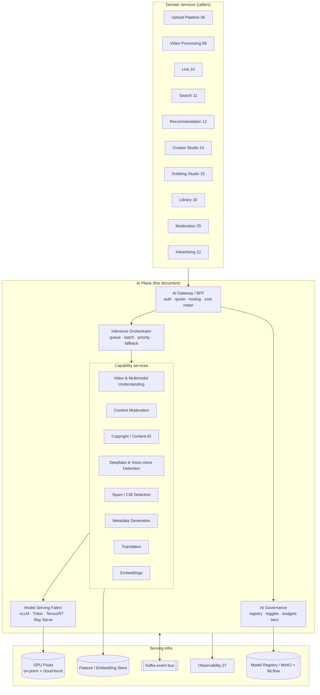
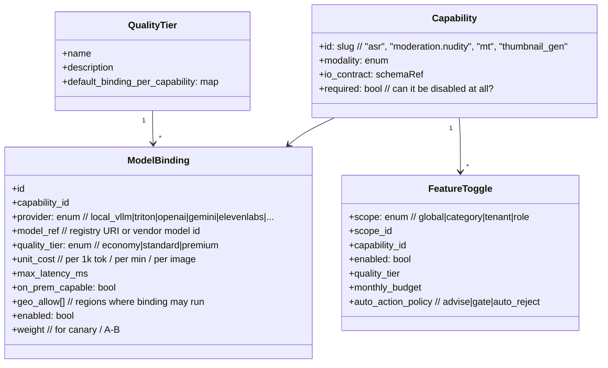
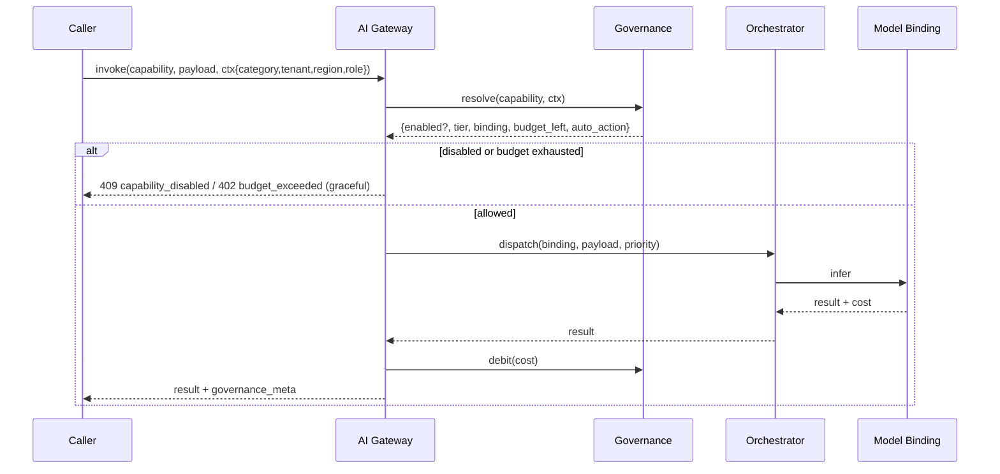
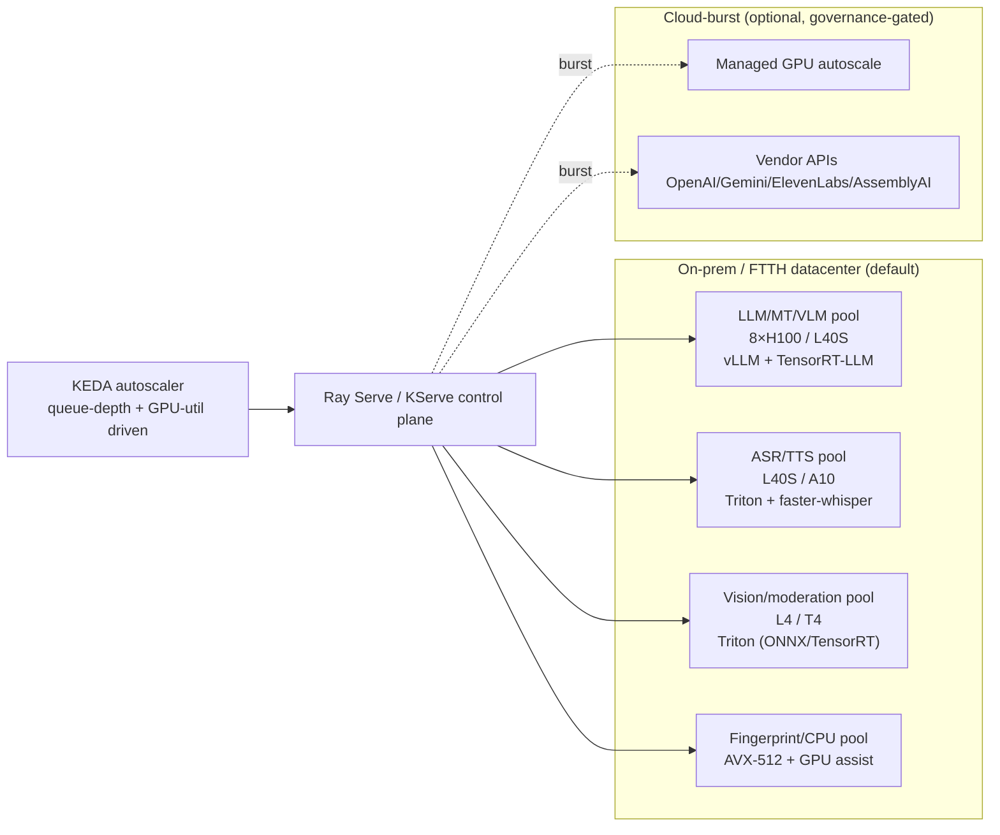
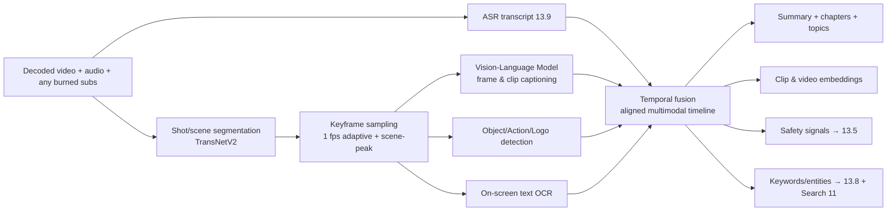
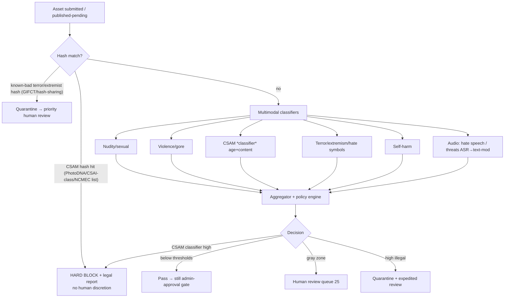
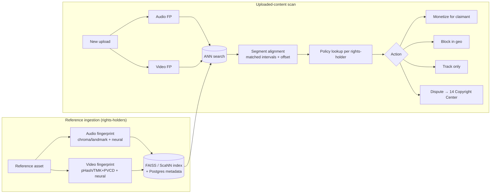
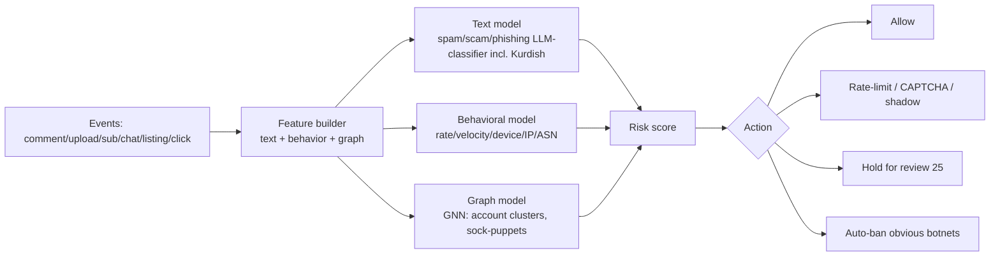

# 13 — AI Systems (Platform-Wide AI Plane)

> **Part C — AI & Creator Tools** · ZanaCloud blueprint
> **Scope:** The horizontal AI plane that *every* domain (Media, Library, Gaming, Learning, Marketplace, Live, Ads) calls into. Video & multimodal understanding, content moderation (CSAM/violence/nudity/terror), copyright & Content-ID fingerprinting (audio + video), voice-clone & deepfake detection, spam & coordinated-inauthentic-behavior detection, AI metadata generation (thumbnail/title/description/tags/chapters), translation, and the dubbing handoff.
> **Siblings:** [14-creator-studio.md](./14-creator-studio.md) · [15-ai-dubbing-studio.md](./15-ai-dubbing-studio.md) · [34-kurdish-language-intelligence.md](./34-kurdish-language-intelligence.md) · [25-content-moderation.md](./25-content-moderation.md) · [12-recommendation-engine.md](./12-recommendation-engine.md) · [11-search-engine.md](./11-search-engine.md) · [33-platform-constraints.md](./33-platform-constraints.md)
> **Non-negotiables honored here:** free for users; admin-gated publishing (AI is *advisory + gating signal*, humans approve); per-category monetization (AI features metered per category); geo-fencing (model routing respects region); **Intranet/FTTH mode → all models must have an on-prem self-hosted serving path, no hard dependency on public cloud APIs**; no-code Super Admin Panel + **AI Governance** layer.

---

## 13.0 Design tenets

1. **Everything is a model behind a contract, not a vendor.** Each capability (ASR, moderation, embedding…) is an abstract *Capability* with one or more *Model Bindings*. Admins swap bindings at runtime via the AI Governance registry. No business logic hard-codes "OpenAI" or "Whisper".
2. **On-prem first, cloud-burst optional.** Because of Intranet/FTTH mode, the *default* binding for every capability is an open-weights model servable on local GPUs (vLLM/Triton/TensorRT-LLM). Commercial APIs (OpenAI, Gemini, ElevenLabs, AssemblyAI) are *optional accelerators* that the governance layer can disable wholesale for an air-gapped deployment.
3. **AI never auto-publishes.** Per the platform's admin-approval law, AI produces **scores, labels, and drafts**. The publish decision is a human/admin one. AI can *auto-reject* only for hard-illegal classes (CSAM) where law mandates immediate blocking.
4. **Cost is a first-class governed dimension.** Every inference call carries a cost estimate; the governance layer enforces per-category, per-tenant, and per-feature budgets and quality tiers.
5. **Kurdish is privileged.** Where a capability touches language, the Kurdish (Sorani `ckb`, Kurmanji `kmr`) path is the *reference* path, not a fallback. See [34-kurdish-language-intelligence.md](./34-kurdish-language-intelligence.md).

---

## 13.1 The AI Plane in the platform



**Two invocation modes:**

- **Synchronous (low-latency):** moderation pre-check on publish, live captioning, search query embedding, spam check on comment submit. SLA target p95 < 400 ms (text) / < 1.5 s (single image) / sub-2 s (live ASR window).
- **Asynchronous (batch / heavy):** full-video understanding, Content-ID fingerprinting, dubbing, audiobook generation. Submitted as jobs to Kafka → orchestrator → GPU pool; results emitted as events the caller subscribes to.

---

## 13.2 AI Governance layer (the no-code control plane)

This is the centerpiece that satisfies *"admins enable/disable AI features, pick models, set costs/quality"* from a visual panel (see [33-platform-constraints.md](./33-platform-constraints.md) for the broader Super Admin Panel).

### 13.2.1 Object model



### 13.2.2 Governance decisions resolved at request time



**Graceful degradation rule:** if a capability is disabled (e.g. air-gapped tenant turned off cloud translation), callers must degrade, never hard-fail. Search falls back to lexical; thumbnail generation falls back to keyframe extraction; translation returns "unavailable" rather than 500.

### 13.2.3 No-code admin surfaces

| Panel | Controls | Backing API |
|---|---|---|
| **Model Registry** | List capabilities, attach/detach bindings, set default per quality tier, upload local model artifact, canary weight | `GET/POST /ai/v1/registry/bindings` |
| **Feature Switchboard** | Per-category / per-tenant toggles, `advise\|gate\|auto_reject`, quality tier | `PUT /ai/v1/governance/toggles` |
| **Budget & Cost** | Monthly budgets per feature/category, alerts, hard vs soft caps, live spend dashboard | `GET /ai/v1/governance/budgets` |
| **Geo & Sovereignty** | Which bindings may run per region; "no data leaves Iraq" enforcement; force on-prem-only | `PUT /ai/v1/governance/geo` |
| **Quality Tiers** | Define economy/standard/premium → maps each capability to a binding | `PUT /ai/v1/governance/tiers` |
| **Eval & Drift** | Per-binding accuracy/latency/cost, scheduled eval runs, alert on regression | `GET /ai/v1/eval/runs` |

---

## 13.3 Inference serving architecture

### 13.3.1 GPU pools & placement



**Pool sizing principle.** Co-locate by *latency class and tensor shape*, not by capability name. Moderation image classifiers and thumbnail-aesthetic models share the vision pool; ASR and TTS share the audio pool because both are streaming-friendly and tolerate Triton's dynamic batching.

### 13.3.2 Serving runtime matrix

| Workload | Runtime | Key features used | Why |
|---|---|---|---|
| LLM (metadata gen, MT-LLM, RAG, agentic moderation) | **vLLM** (primary) / **TensorRT-LLM** (max-throughput nodes) | PagedAttention, continuous batching, prefix caching, speculative decoding, structured output (JSON schema) | Highest tokens/s/$; prefix cache huge for repeated system prompts |
| ASR (Whisper/Canary/Parakeet) | **Triton** + faster-whisper/CTranslate2 or NeMo backend | Dynamic batching, streaming, INT8 | Stable streaming; multi-model on one server |
| TTS (XTTS/Kokoro/Orpheus) | **Triton** Python/ONNX backend | Streaming chunked audio, batching | Sub-300ms first-chunk |
| Vision classifiers (NSFW, violence, CSAM-hash, OCR) | **Triton** (TensorRT/ONNX) | Ensemble (preproc→model→postproc), instance groups | TensorRT INT8 throughput |
| Embeddings (text/image/video) | **Triton** or **TEI** (Text Embeddings Inference) | Batching, FlashAttention | High QPS for search/rec |
| Fingerprinting (audio Chromaprint-class, video pHash/TMK) | CPU + GPU-assisted custom service | SIMD, FAISS ANN | Mostly signal-processing |

### 13.3.3 Orchestrator behavior

- **Priority lanes:** `realtime` (live captions, sync moderation) > `interactive` (studio actions) > `batch` (full-video, dubbing, fingerprint backfill). Realtime preempts batch via Ray placement-group priorities.
- **Dynamic batching window:** per-capability max-wait (e.g. ASR 20 ms, embeddings 50 ms, LLM continuous).
- **Fallback chain:** each binding has an ordered fallback list (premium-cloud → standard-onprem → economy-onprem). On timeout/error/budget-exhaustion the orchestrator walks the chain. Air-gapped tenants have cloud links removed from the chain entirely.
- **Idempotency & dedup:** content-hash keyed; re-uploads of identical media reuse cached understanding/fingerprint/moderation results.

---

## 13.4 Capability: Video & Multimodal Understanding

Produces the *semantic spine* consumed by search, recommendation, moderation, chaptering, and metadata generation.



### 13.4.1 Model choices

| Sub-task | Open-source (default / on-prem) | Commercial (burst) | Tradeoff |
|---|---|---|---|
| Shot segmentation | **TransNetV2** | — | Tiny, fast, accurate; no cloud needed |
| Frame/clip understanding | **Qwen2.5-VL-72B** (premium) / **Qwen2.5-VL-7B** (standard) / **InternVL2.5** | **Gemini 2.x Flash/Pro**, GPT-4o-class | Qwen-VL near-SOTA, self-hostable, strong on Arabic-script & low-resource cues; Gemini better long-video temporal reasoning but cloud-only |
| Object/action detection | **YOLO-world / Grounding-DINO**, **VideoMAEv2** | Vertex/Rekognition | Open detectors fine for taxonomy; cloud for breadth |
| On-screen OCR | **PaddleOCR**, **Docling**, **MinerU** | Azure/Google OCR | PaddleOCR strong multilingual incl. Arabic-script for Kurdish; MinerU/Docling for document-grade frames |
| Logo/brand detection | Fine-tuned **YOLO** on brand set | Rekognition Custom Labels | For Content-ID + ad-safety |

**Long-video strategy.** Don't feed 2 h to a VLM. Hierarchical: (1) shot-level captions, (2) map-reduce summarization over shot captions with the LLM, (3) selective high-res VLM passes only on shots flagged ambiguous by cheap detectors. Caps cost and fits on-prem VRAM.

### 13.4.2 Output artifact (stored, versioned)

```json
{
  "media_id": "vid_8f3...",
  "model_versions": {"vlm":"qwen2.5-vl-7b@2026-03","asr":"whisper-large-v3@..."},
  "duration_s": 742.4,
  "scenes": [{"start": 0.0, "end": 12.6, "caption": "...", "objects": ["..."], "ocr": ["..."]}],
  "chapters": [{"start": 0, "title": "Intro"}],
  "topics": ["politics", "kurdistan-region"],
  "entities": [{"text":"Hewlêr","type":"GPE","wikidata":"Q130833"}],
  "safety": {"nudity": 0.01, "violence": 0.42, "csam": 0.0, "weapons": 0.6},
  "embeddings_ref": "vec://media/vid_8f3/clip",
  "languages_detected": ["ckb","en"]
}
```

---

## 13.5 Capability: Content Moderation (CSAM / violence / nudity / terror / self-harm)

> Cross-reference: human workflow, strikes, appeals live in [25-content-moderation.md](./25-content-moderation.md). This section is the **model/scoring engine** feeding that workflow.

### 13.5.1 Tiered pipeline



**CSAM handling is special and legally rigid:**
- Two independent signals — **perceptual hash matching** against authorized hash databases (industry/NCMEC-style, deployed on-prem so images never leave the network) **and** an ML **CSAM classifier** for novel content.
- A hash hit triggers **immediate hard block**, preservation of evidence per legal hold, and a reporting workflow. **No AI auto-publish, and no human "approve" path exists for confirmed CSAM.**
- CSAM classifier *positives without hash* go to a **restricted, trained, audited review team** with wellness protections — never the general moderation queue. Access is RBAC-locked and fully logged (see [24-security.md](./24-security.md)).

### 13.5.2 Model recommendations

| Class | Open-source / on-prem | Commercial | Tradeoff |
|---|---|---|---|
| NSFW / nudity | **NSFWJS/OpenNSFW2** (fast gate) + fine-tuned **EVA-02/ViT** | AWS Rekognition, Hive, Sightengine | Open gate is cheap front filter; fine-tuned ViT for precision; Hive best recall but cloud |
| Violence/gore | Fine-tuned **VideoMAEv2 / ViT** on graphic-content set | Hive, Azure Content Safety | Cloud higher recall on edge cases |
| CSAM classifier | Access-restricted models (e.g. Thorn/Safer-class) via on-prem appliance | Safer API | Must be on-prem for legal data-handling; classifier is gating-only |
| Terror/extremist | Hash-sharing + fine-tuned multimodal hate-symbol detector | GIFCT-aligned vendors | Symbol detection needs region-specific (Iraq/KRI) fine-tune |
| Audio/text abuse | ASR → **multilingual hate/toxicity LLM** (incl. Kurdish, see 34) | Perspective API, OpenAI mod | Kurdish toxicity needs in-house model (no good vendor coverage) |
| Self-harm | Text+image classifier with crisis-resource routing | Azure CSC | Route to support resources, not just removal |

**Policy engine** maps raw scores → category-specific thresholds (governance-configurable per category: a Kids category is far stricter than a News/documentary one). Output is `advise | gate | auto_reject` per the governance toggle.

---

## 13.6 Capability: Copyright & Content-ID (audio + video fingerprinting)

A YouTube-Content-ID-class system. Two independent fingerprint spaces (audio + video) + reference DB + match/claim workflow. Surfaced to creators in the **Copyright Center** ([14-creator-studio.md](./14-creator-studio.md)).

### 13.6.1 Fingerprinting pipeline



### 13.6.2 Techniques & models

| Layer | Technique / model | Notes |
|---|---|---|
| Audio FP (classical) | **Chromaprint/AcoustID-class** landmark hashing | Robust to re-encode, fast, exact-ish |
| Audio FP (neural) | Contrastive audio embeddings (**CLAP-class**, fine-tuned) | Survives pitch/tempo shift, covers, partial use |
| Video FP | **pHash / TMK+PVCD**, **ISL/temporal hashing** | Survives crop/resize/letterbox/recompression |
| Video FP (neural) | Frame embeddings (DINOv2/CLIP) + temporal pooling | Catches transformed/edited reuse, picture-in-picture |
| ANN index | **FAISS** (IVF-PQ / HNSW) or **ScaNN** | Billions of segments; sharded |
| Melody/cover detection | Cover-song retrieval embeddings | For music claims beyond exact match |

**Match → claim policy** is per rights-holder and **geo-aware** (a track may be "monetize in Iraq, block elsewhere"), respecting the platform's geo-fencing law. Disputes flow to the creator's Copyright Center and an admin adjudication queue.

---

## 13.7 Capability: Deepfake & Voice-Clone Detection

Critical for a Kurdish-language platform that *also ships voice cloning* in the Dubbing Studio ([15-ai-dubbing-studio.md](./15-ai-dubbing-studio.md)). Two duties: (a) detect malicious synthetic media uploaded by users; (b) **verify watermarks** on media generated *by ZanaCloud itself*.

```mermaid
flowchart TB
    IN[Uploaded media] --> WM{ZanaCloud watermark?<br/>audio: AudioSeal · image/video: invisible WM}
    WM -- yes --> LABELSELF[Label: AI-generated by platform<br/>(disclosure, allowed)]
    WM -- no --> DET[Detection ensemble]
    DET --> FACE[Face deepfake<br/>blink/texture/freq artifacts]
    DET --> VOICE[Voice spoof/clone<br/>anti-spoofing AASIST-class]
    DET --> GENIMG[GenAI image/video detector]
    FACE & VOICE & GENIMG --> SC[Authenticity score + provenance]
    SC --> C2PA{C2PA / content credentials present?}
    C2PA -- valid --> PROV[Show provenance]
    C2PA -- none/invalid --> RISK[Risk score → moderation + creator label prompt]
```

| Sub-task | Model / standard | Notes |
|---|---|---|
| Voice anti-spoofing | **AASIST / RawNet2-class** (ASVspoof-trained), fine-tuned on Kurdish TTS | Detect synthetic speech; needs Kurdish-TTS negatives from our own models |
| Face deepfake | Frequency+texture CNN, **temporal transformer** | Ensemble beats single model |
| GenAI image/video | Diffusion-artifact detectors | Arms-race; retrain quarterly |
| **Outbound watermarking** | **AudioSeal** (speech), invisible image/video WM, **C2PA Content Credentials** | *We* watermark everything we generate so detection is trivial downstream and provenance is provable |
| Provenance | **C2PA** manifests signed by platform key | Industry-standard chain of custody |

**Ethics tie-in.** Every voice clone produced by the Dubbing Studio is (1) consent-gated, (2) AudioSeal-watermarked, (3) C2PA-signed. So our own detector can always recognize our own output — preventing the platform from becoming a deepfake laundering service. Detailed consent/licensing in [15-ai-dubbing-studio.md](./15-ai-dubbing-studio.md) §15.7.

---

## 13.8 Capability: Spam, Bot & Coordinated-Inauthentic-Behavior Detection

Protects comments, uploads, subscriptions, live chat, marketplace listings, and ad clicks.



| Layer | Approach | Notes |
|---|---|---|
| Text spam/scam | Fine-tuned multilingual classifier + LLM zero-shot fallback | Must cover Sorani/Kurmanji scam patterns |
| Behavioral | Gradient-boosted trees + streaming features (Redis/Flink) | Velocity, device fingerprint, ASN/geo anomalies |
| Graph/CIB | **GNN** over the social/interaction graph | Detect coordinated rings, view/sub fraud, ad-click fraud |
| Account integrity | Risk score at signup + ongoing | Feeds geo-fencing & verification ([24-security.md](./24-security.md)) |

---

## 13.9 Capability: AI Metadata Generation (thumbnail / title / description / tags / chapters) + Translation

Powers the Creator Studio "AI assist" buttons and the auto-suggested metadata on upload.

### 13.9.1 Generation flow

```mermaid
flowchart LR
    UND[Video understanding 13.4<br/>+ transcript 13.9 ASR] --> LLM[Metadata LLM]
    LLM --> TITLE[Titles (N variants)]
    LLM --> DESC[Description + timestamps]
    LLM --> TAGS[Tags / keywords]
    LLM --> CHAP[Chapters]
    UND --> THUMB[Thumbnail generator]
    THUMB --> CAND[Keyframe candidates<br/>scored by aesthetics + face + CTR-model]
    THUMB --> GEN[Optional generative thumbnail<br/>diffusion, watermarked]
    TITLE & THUMB --> ABT[A/B test handoff → Studio 14]
```

| Output | Model (open / on-prem) | Commercial | Notes |
|---|---|---|---|
| Title / description / tags / chapters | **Qwen2.5-72B / Llama-3.x-70B / Aya-Expanse** (multilingual incl. Kurdish) | GPT-4o, Gemini | Structured JSON output via grammar-constrained decoding; **Kurdish titles use models from [34](./34-kurdish-language-intelligence.md)** |
| Thumbnail keyframe scoring | Aesthetic model + face/quality + CTR predictor | — | Pick best real frame first (cheaper, authentic) |
| Generative thumbnail | **SDXL/FLUX-class** (governance-gated) | DALL·E-class | Always watermarked + C2PA; admin can disable generative entirely |
| Auto-captions/subtitles | **Whisper-large-v3 / Canary / Parakeet** | AssemblyAI, Deepgram | See ASR matrix below |

### 13.9.2 ASR & Translation matrices (shared with Dubbing & Library)

**ASR:**

| Model | Type | Strengths | Kurdish | Latency |
|---|---|---|---|---|
| **Whisper-large-v3** | Open | Broad multilingual, robust | weak ckb/kmr OOTB → fine-tune (see 34) | medium |
| **NVIDIA Canary** | Open | High accuracy, punctuation, fast | needs fine-tune | low |
| **NVIDIA Parakeet** | Open | Very low latency, streaming | needs fine-tune | very low |
| AssemblyAI / Deepgram | Cloud | Diarization, accuracy | no Kurdish | low |

> **Default on-prem binding: fine-tuned Whisper-large-v3 + Parakeet (streaming).** Kurdish fine-tunes are produced by the pipeline in [34-kurdish-language-intelligence.md](./34-kurdish-language-intelligence.md).

**Translation (12 languages incl. Sorani + Kurmanji):**

| Model | Type | Strengths | Tradeoff |
|---|---|---|---|
| **NLLB-200** | Open | 200 langs incl. ckb/kmr, fast | sentence-level, weaker discourse/context |
| **Aya / Aya-Expanse** | Open | Instruction-tuned multilingual, context-aware | larger, slower |
| **Qwen2.5 / Llama-3.x (MT-tuned)** | Open | Document-level, terminology, style control | needs prompt/finetune for Kurdish |
| **Tower / ALMA** | Open | Strong LLM-MT quality | language coverage gaps |
| GPT-4o / Gemini / DeepL | Cloud | Top quality (where supported) | no/weak Kurdish; cloud-only |

> **Strategy:** NLLB for fast bulk + LLM (Aya/Qwen, Kurdish-tuned) for context-aware passages and final polish. The full **context-aware translation pipeline** (glossaries, do-not-translate, gender/formality, length control for dubbing) is specified in [15-ai-dubbing-studio.md](./15-ai-dubbing-studio.md) §15.6.

### 13.9.3 Dubbing handoff

Metadata + transcript + diarization produced here are passed as the *input contract* to the Dubbing Studio. The AI plane exposes:

```
POST /ai/v1/dubbing/handoff
{
  "media_id": "vid_8f3...",
  "transcript_ref": "...", "diarization_ref": "...",
  "source_lang": "ckb", "target_langs": ["en","ar","tr","kmr"],
  "understanding_ref": "...", "quality_tier": "premium"
}
→ 202 { "dub_job_id": "dub_..." }   // continues in 15-ai-dubbing-studio.md
```

---

## 13.10 API surface (AI Gateway)

```
POST /ai/v1/understand        # async; full multimodal understanding job
POST /ai/v1/moderate          # sync/async; returns scores + decision
POST /ai/v1/asr               # sync(stream)/async
POST /ai/v1/translate         # sync; ctx-aware options
POST /ai/v1/embed             # sync; text/image/video → vectors
POST /ai/v1/fingerprint       # async; register or scan
POST /ai/v1/metadata          # sync; titles/desc/tags/chapters
POST /ai/v1/thumbnail         # sync/async; candidates or generative
POST /ai/v1/detect/deepfake   # sync/async
POST /ai/v1/spam/score        # sync
GET  /ai/v1/jobs/{id}         # job status/result
# Governance (admin)
GET/POST/PUT /ai/v1/registry/bindings
PUT  /ai/v1/governance/toggles|budgets|geo|tiers
GET  /ai/v1/eval/runs
```

Every response carries `governance_meta { binding_id, quality_tier, cost, region, on_prem }` for auditability and cost reconciliation with billing ([23-monetization.md](./23-monetization.md)).

---

## 13.11 Evaluation, drift & observability

| Capability | Primary metrics | Eval cadence |
|---|---|---|
| ASR | WER/CER (per language, Kurdish tracked separately), RTF | nightly on held-out + weekly human |
| Translation | COMET / chrF++ / BLEU + human MQM | weekly |
| Moderation | Precision/recall per class, **FN rate on illegal classes is the gate**, appeal-overturn rate | continuous + monthly audit |
| Content-ID | Match precision/recall, dispute-overturn rate | continuous |
| Deepfake | AUC, EER, watermark-detection rate | monthly + on new-generator release |
| Metadata gen | CTR uplift (A/B), human accept rate, hallucination rate | continuous A/B |
| VLM understanding | Caption faithfulness, retrieval recall@k | weekly |

- **Golden sets** per capability stored in the eval store; Kurdish golden sets are mandatory and curated with the Kurdish team (see [34](./34-kurdish-language-intelligence.md)).
- **Drift detection:** input-distribution monitors + scheduled re-eval; governance dashboard alerts on regression beyond threshold and can auto-rollback a binding to previous weight.
- **Shadow & canary:** new bindings receive mirrored traffic (shadow) then weighted canary before promotion. All wired into [27-observability.md](./27-observability.md).

---

## 13.12 Cost & capacity (illustrative, on-prem default)

| Stage | Workload mix | Indicative footprint |
|---|---|---|
| MVP | ASR + moderation + metadata, 1 region | 2×L40S (audio/vision) + 1×H100 (LLM) |
| Growth | + understanding + Content-ID + dubbing | 8×H100 + 8×L40S + FAISS cluster |
| Enterprise | full plane, multi-region, live dubbing | GPU fleet w/ KEDA autoscale, cloud-burst for spikes |

Cost meter (per §13.2) charges each capability call to the originating category/tenant so the per-category monetization model ([23-monetization.md](./23-monetization.md)) can decide whether an AI feature is free, premium, or admin-only.

---

## 13.13 Summary

The AI Plane is a governed, on-prem-first, vendor-pluggable inference platform: every capability sits behind a contract with swappable model bindings, controlled by a no-code AI Governance layer (registry, toggles, budgets, geo, quality tiers). It delivers video/multimodal understanding, multi-class moderation with rigid CSAM handling, audio+video Content-ID, deepfake detection paired with mandatory outbound watermarking, spam/CIB defense, and AI metadata/translation — all servable inside an air-gapped FTTH network, with Kurdish as the reference language path and the Dubbing Studio + Creator Studio as primary downstream consumers.
