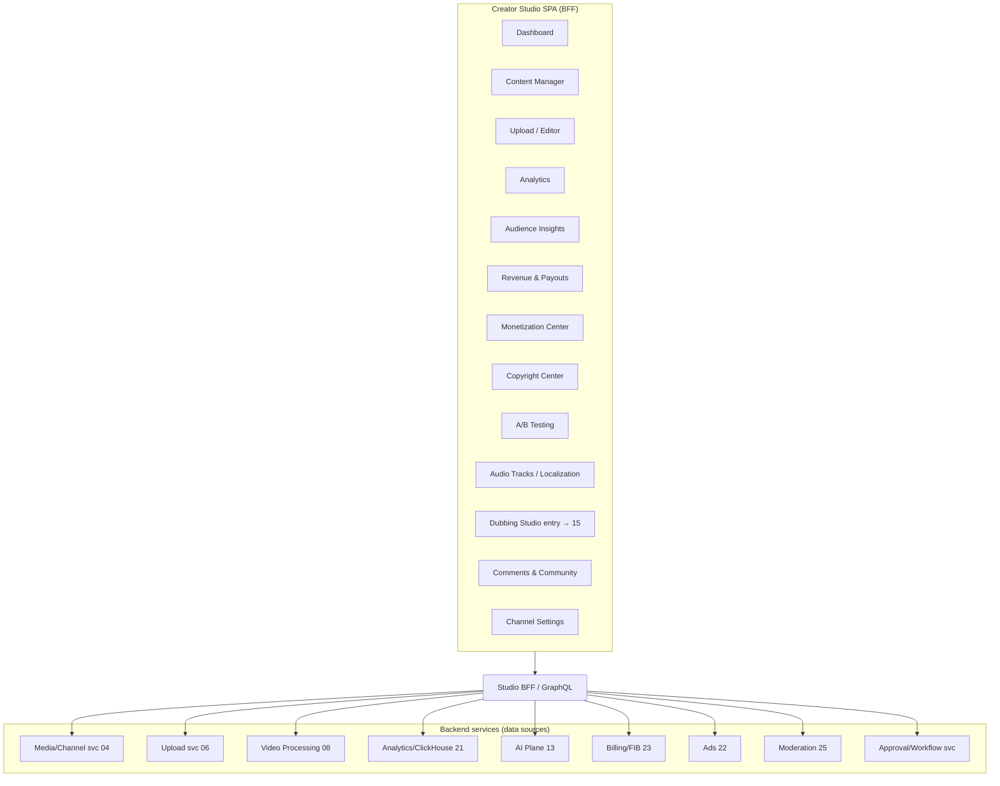
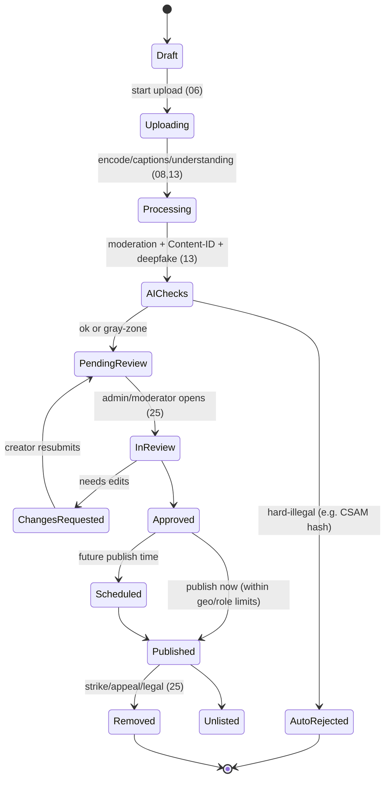
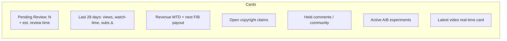
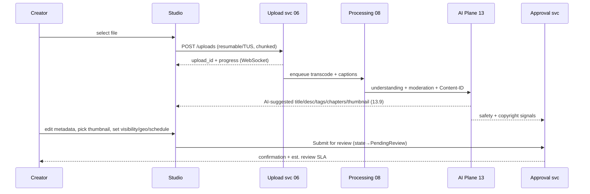
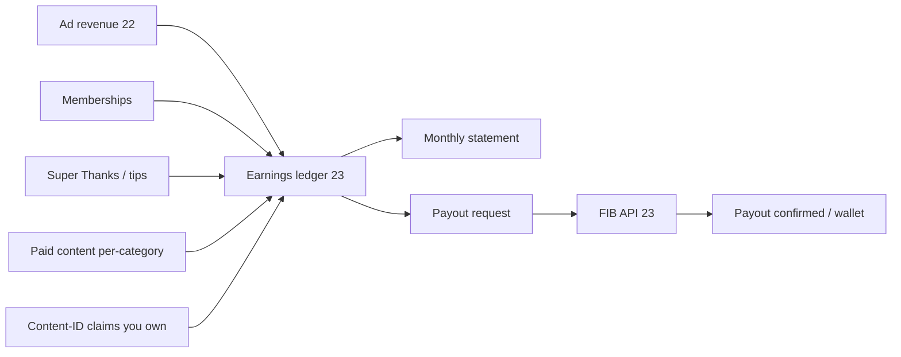
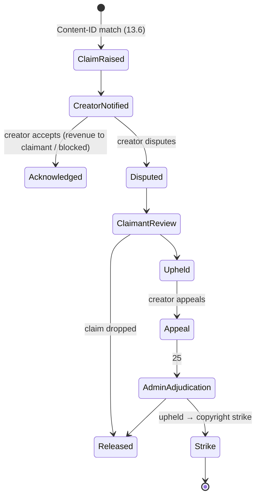
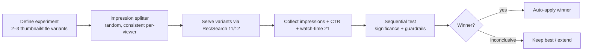
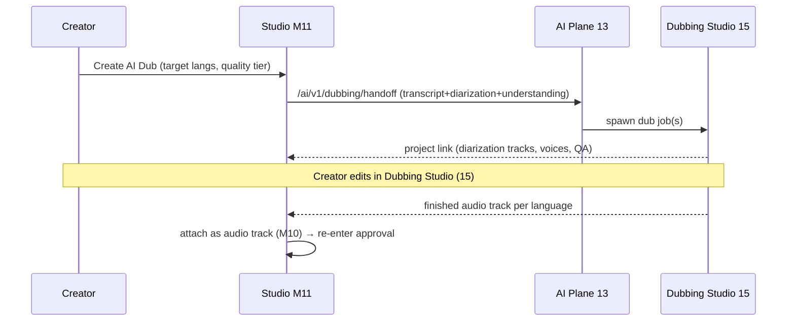
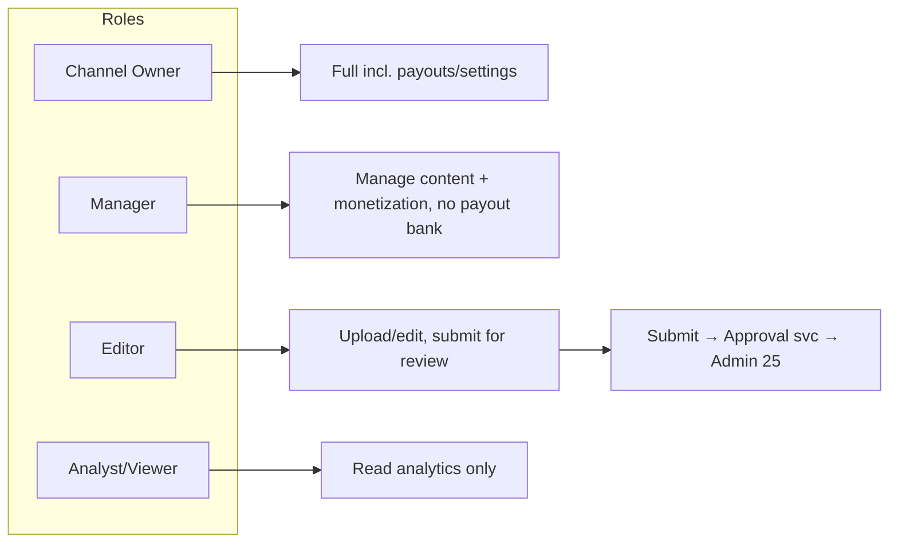

# 14 — Creator Studio (YouTube-Studio-equivalent)

> **Part C — AI & Creator Tools** · ZanaCloud blueprint
> **Scope:** The complete creator control center — dashboard, content/upload management, analytics, revenue & FIB payouts, copyright center, monetization center, audience insights, A/B testing (thumbnails/titles), multi-language audio-track management, and the entry point into the AI Dubbing Studio. Every module: UI surface + backing APIs + data sources + role/approval workflow integration.
> **Siblings:** [13-ai-systems.md](./13-ai-systems.md) · [15-ai-dubbing-studio.md](./15-ai-dubbing-studio.md) · [21-analytics.md](./21-analytics.md) · [23-monetization.md](./23-monetization.md) · [25-content-moderation.md](./25-content-moderation.md) · [06-upload-pipeline.md](./06-upload-pipeline.md) · [08-video-processing.md](./08-video-processing.md) · [33-platform-constraints.md](./33-platform-constraints.md)
> **Non-negotiables honored here:** free for users; **admin-approval publishing baked into every upload flow** (no self-publish button → "Submit for review"); per-category optional monetization (FIB); geo-fencing controls exposed to creators within admin-set bounds; intranet/FTTH (Studio must function fully offline against on-prem services); device-specific (Studio is desktop/tablet-first, with a mobile companion); no-code admin overrides everything.

---

## 14.0 Positioning

The Creator Studio is the **operator console for a channel**. It is *not* the consumer app. It is a privileged SPA (React/Next.js, see [03-frontend-architecture.md](./03-frontend-architecture.md)) gated by RBAC: only `creator`, `verified_creator`, `org_member`, and `admin` roles reach it. It composes data from many backend services but presents one coherent product.



---

## 14.1 Module map

| # | Module | Purpose | Primary data sources | Key APIs |
|---|---|---|---|---|
| M1 | **Dashboard** | At-a-glance channel health, pending-review status, alerts | Analytics 21, Approval svc, Billing 23 | `GET /studio/v1/dashboard` |
| M2 | **Content Manager** | List/filter/bulk-edit all uploads & their lifecycle state | Media 04, Approval svc | `GET /studio/v1/contents` |
| M3 | **Upload & Editor** | Resumable upload, metadata, AI-assist, trim/chapters, visibility, schedule | Upload 06, Processing 08, AI 13 | `POST /studio/v1/uploads` |
| M4 | **Analytics** | Views, watch-time, retention, traffic, real-time | ClickHouse 21 | `GET /studio/v1/analytics/*` |
| M5 | **Audience Insights** | Demographics, geo, devices, returning vs new, subscriber growth | Analytics 21 | `GET /studio/v1/audience` |
| M6 | **Revenue & Payouts** | Earnings breakdown, FIB payout requests, statements, tax | Billing/FIB 23, Ads 22 | `GET /studio/v1/revenue` |
| M7 | **Monetization Center** | Per-category eligibility, enable monetization, memberships, Super Thanks | Monetization 23, Governance 33 | `POST /studio/v1/monetization` |
| M8 | **Copyright Center** | Claims against you, your reference assets, disputes/appeals | Content-ID 13.6, Moderation 25 | `GET /studio/v1/copyright/claims` |
| M9 | **A/B Testing** | Test thumbnail/title variants, auto-pick winner by metric | Analytics 21, AI 13 | `POST /studio/v1/experiments` |
| M10 | **Audio Tracks / Localization** | Manage multi-language audio + subtitles per video | Media 04, Dubbing 15 | `GET/POST /studio/v1/contents/{id}/audio-tracks` |
| M11 | **Dubbing Studio entry** | Launch the full dubbing workflow | Dubbing 15 | `POST /studio/v1/contents/{id}/dub` |
| M12 | **Comments & Community** | Moderate comments, held-for-review, community posts | Social svc, Moderation 25 | `GET /studio/v1/comments` |
| M13 | **Channel Settings** | Branding, default visibility, permissions, team (orgs) | Media 04, IAM 24 | `PUT /studio/v1/channel` |

---

## 14.2 The publishing lifecycle (admin-approval is law)

Every piece of content moves through an explicit state machine. There is **no direct publish**. The AI Plane provides *advisory* signals; the **admin approves**.



**Role-aware quotas** (enforced by Upload svc 06, surfaced in Studio):

| Role | Max length | Quota | Monetization | Geo control |
|---|---|---|---|---|
| Regular user | ≤ 3 min video | configurable daily | no | none |
| Verified creator | higher (admin-set) | higher | per eligible category | within admin bounds |
| Org member | per org plan | per org | per org contract | per org bounds |
| Admin | unlimited | unlimited | n/a | full |

The Studio renders the creator's *current* limits live from the governance config ([33-platform-constraints.md](./33-platform-constraints.md)); attempting to exceed them is blocked client-side and server-side.

---

## 14.3 M1 — Dashboard



- **Data sources:** Approval svc (pending counts), ClickHouse rollups via Analytics ([21](./21-analytics.md)), Billing ([23](./23-monetization.md)).
- **API:** `GET /studio/v1/dashboard` → composite payload (server-side fan-out + cache, 60 s TTL for heavy aggregates, real-time card via WebSocket).
- **Offline/FTTH:** all data is from on-prem services; no external calls. Dashboard degrades gracefully if a sub-service is down (per-card error boundaries).

---

## 14.4 M3 — Upload & Editor (with AI assist + approval handoff)



**Editor surfaces:**
- Metadata form with **"Generate with AI"** per field (calls `/ai/v1/metadata`, governance-gated — if admin disabled it, the button is hidden).
- Thumbnail picker: AI keyframe candidates + custom upload + (if enabled) generative thumbnail (watermarked, see [13](./13-ai-systems.md) §13.7).
- Lightweight trim/chapter editor (non-destructive; heavy edits go to a separate editor service).
- Visibility: `Public | Unlisted | Private | Scheduled`, plus **geo-fence selector** (countries/regions/ISP) constrained to admin-permitted scope.
- Localization tab links to **M10 audio tracks** and **M11 dubbing**.

---

## 14.5 M4 — Analytics

Backed by ClickHouse + the event pipeline ([21-analytics.md](./21-analytics.md)). Two planes: **real-time** (last 60 min, Kafka→materialized views) and **historical** (rollups).

```mermaid
flowchart TB
    EVENTS[Playback/engagement events → Kafka 21] --> RT[Real-time MV<br/>last 48h]
    EVENTS --> ETL[Rollup ETL] --> HIST[(ClickHouse rollups<br/>by video/day/geo/device)]
    RT --> API1[GET /studio/v1/analytics/realtime]
    HIST --> API2[GET /studio/v1/analytics/overview|retention|traffic|reach]
```

| Report | Metrics | Source |
|---|---|---|
| Overview | views, watch-time (hrs), avg view duration, subs Δ, est. revenue | rollups |
| Reach | impressions, CTR (thumbnail), unique viewers, traffic sources | rollups + Search/Rec 11/12 |
| Engagement | retention curve (per-second), top moments, replays, end-screen CTR | event stream |
| Audience → M5 | returning vs new, times when audience online | rollups |
| Real-time | live views, last-48h trend, per-video | real-time MV |

Retention curves are computed per-second from heartbeat events; "top moments"/"audience drop-off" highlight spikes. All queries are geo/device sliceable.

---

## 14.6 M5 — Audience Insights

| Insight | Data | Notes |
|---|---|---|
| Demographics | age/gender (declared, privacy-respecting), aggregated | k-anonymity threshold enforced |
| Geography | country/region/city, with **Kurdistan Region granularity** | ties to geo-fencing model |
| Devices | mobile/desktop/TV split | informs device-specific UX ([03](./03-frontend-architecture.md)) |
| Subscriber bell / notifications | reach of notifications | |
| Other content audience watches | co-view graph | feeds Rec 12 |
| When audience is online | heatmap | best publish-time suggestion |

`GET /studio/v1/audience?range=28d&dim=geo|device|age`. All aggregates pass a minimum-cohort filter for privacy ([24-security.md](./24-security.md)).

---

## 14.7 M6 — Revenue & Payouts (FIB)



| Surface | Detail | Source / API |
|---|---|---|
| Earnings breakdown | by source, by video, by category, by geo | Billing 23 `GET /studio/v1/revenue/breakdown` |
| Statements | monthly PDF/CSV, tax info | `GET /studio/v1/revenue/statements` |
| Payout | request to FIB, min-threshold, status, history | `POST /studio/v1/revenue/payouts` → FIB |
| Wallet | balance, holds, refunds/chargebacks | `GET /studio/v1/wallet` |

**Per-category monetization** means a video's earning ability depends on its category's admin config (a category can be entirely non-monetized). The Studio shows *why* a video does/doesn't earn. FIB is the primary gateway; the ledger is gateway-agnostic for future providers ([23-monetization.md](./23-monetization.md)).

---

## 14.8 M7 — Monetization Center

```mermaid
flowchart TB
    ELIG{Eligible?} --> CHK1[Category monetization enabled? (admin)]
    ELIG --> CHK2[Creator verified + in good standing?]
    ELIG --> CHK3[No active strikes / copyright issues?]
    CHK1 & CHK2 & CHK3 --> ON[Enable monetization]
    ON --> FEATURES[Ads · Memberships · Super Thanks · Paid content · Channel store]
```

- Eligibility is computed from governance ([33](./33-platform-constraints.md)) + standing (strikes from [25](./25-content-moderation.md)) + verification ([24](./24-security.md)).
- Features each toggle independently and only appear if the **category** and **admin** allow them.
- `POST /studio/v1/monetization/{feature}` with server-side eligibility re-check (never trust client).

---

## 14.9 M8 — Copyright Center

Creator-facing surface of the Content-ID engine ([13](./13-ai-systems.md) §13.6).



| Surface | Detail | API |
|---|---|---|
| Claims against you | matched segment, claimant, policy (monetize/block/track), geo scope | `GET /studio/v1/copyright/claims` |
| Dispute / appeal | structured form + evidence upload | `POST /.../claims/{id}/dispute` |
| Your reference assets | register content you own for protection | `POST /studio/v1/copyright/references` |
| Strikes & standing | active strikes, expiry, education | Moderation 25 |

---

## 14.10 M9 — A/B Testing (thumbnails & titles)



- **Metric:** primary = CTR, guardrail = avg watch-time (prevents clickbait winners). Configurable.
- **Stats:** sequential testing (mSPRT / Bayesian) to stop early safely; minimum impressions before decision.
- **Variants** can be AI-generated (titles via `/ai/v1/metadata`, thumbnails via `/ai/v1/thumbnail`) or creator-supplied.
- **APIs:** `POST /studio/v1/experiments`, `GET /studio/v1/experiments/{id}` (live results), winner auto-applied to the canonical asset.
- Integrates with the impression layer in Recommendation/Search so the same viewer always sees the same variant (sticky bucketing).

---

## 14.11 M10 — Multi-language Audio-Track Management

The bridge between a single video and many localized experiences. Mirrors the YouTube "multi-language audio" model.

```mermaid
flowchart TB
    VID[Video] --> ORIG[Original audio (ckb)]
    VID --> SUBS[Subtitle tracks: ckb,en,ar,tr,kmr,...]
    VID --> ALT[Alt audio tracks]
    ALT --> A1[en dub]
    ALT --> A2[ar dub]
    ALT --> A3[kmr dub]
    A1 & A2 & A3 --> SRC{Source}
    SRC --> HUMAN[Human-recorded]
    SRC --> AIDUB[AI dub from Studio 15]
    SUBS & ALT --> PLAYER[Player auto-selects by user lang/geo]
```

| Operation | API | Notes |
|---|---|---|
| List tracks | `GET /studio/v1/contents/{id}/audio-tracks` | original + alts + subs |
| Add subtitle | `POST .../subtitles` | upload SRT/VTT or generate via ASR ([13](./13-ai-systems.md)) |
| Add audio track | `POST .../audio-tracks` | upload human dub or attach AI dub output |
| Set default per locale | `PUT .../audio-tracks/default` | drives player auto-selection by user language + geo |
| Approval | each new track re-enters review if policy requires | dubbed content still admin-gated |

Player selection respects the user's UI language, then geo, then default — so a Sorani video auto-plays its Kurmanji or Arabic dub for the right audience.

---

## 14.12 M11 — Dubbing Studio entry point

A single action — **"Create AI Dub"** — hands the video off to the full pipeline in [15-ai-dubbing-studio.md](./15-ai-dubbing-studio.md).



The handoff contract is defined in [13](./13-ai-systems.md) §13.9.3; the editing/QA experience is fully specified in [15](./15-ai-dubbing-studio.md).

---

## 14.13 M12 — Comments & Community

| Surface | Detail | Source |
|---|---|---|
| Comment inbox | all/held-for-review/likely-spam/published | Social svc + Spam model ([13](./13-ai-systems.md) §13.8) |
| Held for review | AI flagged or creator-keyword-held | Moderation 25 |
| Bulk actions | approve/remove/report/ban | |
| Community posts | text/poll/image posts (admin-gated like uploads) | |

Spam/toxicity scoring (incl. Kurdish) comes from the AI Plane; the creator sees ranked queues, never raw model internals.

---

## 14.14 Roles, teams & approval integration



- **Org/brand accounts** ([20](./20-marketplace.md)/enterprise) get multi-seat teams with these roles; permissions enforced by IAM/RBAC ([24-security.md](./24-security.md)).
- **Every state transition that publishes content** routes through the Approval svc; the Studio only ever *requests* publication.
- Audit log of every Studio action (who changed what) for compliance.

---

## 14.15 Studio BFF & API conventions

- **BFF:** GraphQL (or tRPC) aggregation layer so the SPA makes one round-trip per view; resolvers fan out to services with per-field auth.
- **Auth:** short-lived JWT + channel-scoped permissions; all mutations re-check server-side.
- **Real-time:** WebSocket/SSE channel for upload progress, real-time analytics, review-status changes, A/B results.
- **Offline/FTTH:** BFF and all data sources are on-prem; no third-party SaaS dependency. AI-assist buttons hide automatically when their capability is disabled by governance.
- **Pagination/bulk:** cursor pagination; bulk edit jobs are async with progress events.

---

## 14.16 Data-source summary

| Studio data | System | Doc |
|---|---|---|
| Content + lifecycle state | Media/Channel + Approval svc | [04](./04-backend-services.md) |
| Upload/transcode status | Upload + Processing | [06](./06-upload-pipeline.md), [08](./08-video-processing.md) |
| Analytics & audience | ClickHouse event pipeline | [21](./21-analytics.md) |
| Revenue/payouts | Billing + FIB | [23](./23-monetization.md) |
| Ads earnings | Ad server | [22](./22-advertising.md) |
| Copyright claims | Content-ID | [13](./13-ai-systems.md) §13.6 |
| Moderation/strikes | Moderation | [25](./25-content-moderation.md) |
| AI assist (metadata/thumbnail/ASR/dub) | AI Plane | [13](./13-ai-systems.md), [15](./15-ai-dubbing-studio.md) |
| Governance limits | Super Admin Panel | [33](./33-platform-constraints.md) |

---

## 14.17 Summary

The Creator Studio is a privileged, RBAC-gated operator console that unifies content lifecycle, analytics, FIB-backed revenue, copyright, monetization, A/B testing, multi-language audio tracks, and the AI Dubbing entry point — composing data from a dozen backend services through a single BFF. Crucially, it enforces ZanaCloud's admin-approval law in every flow (no self-publish, only "Submit for review"), respects per-category monetization and geo-fencing within admin-set bounds, and runs entirely against on-prem services so it works inside an air-gapped FTTH network.
