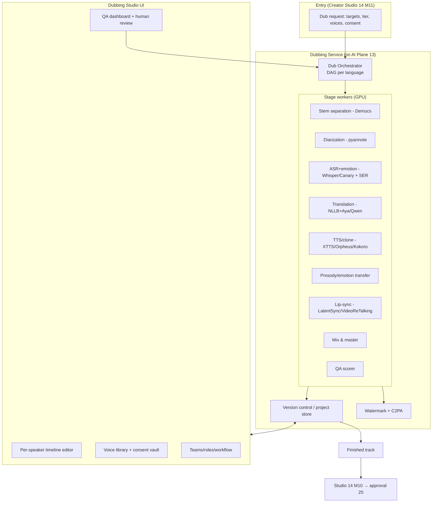
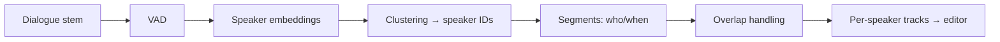
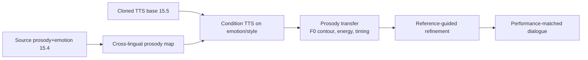
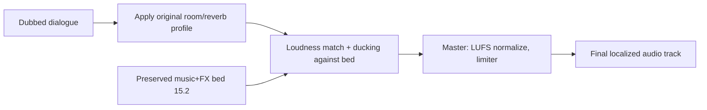
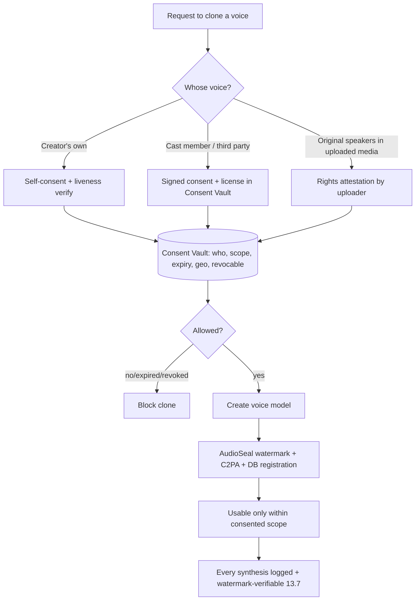
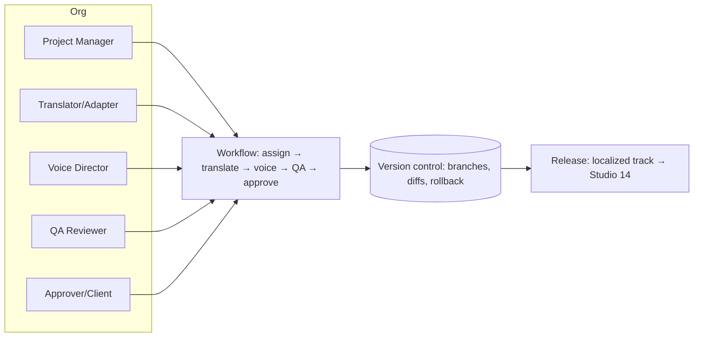

# 15 — AI Dubbing Studio (Deepdub-level, integrated)

> **Part C — AI & Creator Tools** · ZanaCloud blueprint
> **Scope:** A production-grade, Deepdub/ElevenLabs-class AI dubbing platform embedded in the Creator Studio. Speaker diarization with per-speaker editable tracks, voice isolation / stem separation (preserving music & ambience), emotion preservation, performance/prosody transfer, frame-level lip-sync, voice cloning with consent/licensing/watermarking/ethics, a context-aware translation pipeline for 12 languages (incl. Sorani + Kurmanji), real-time live dubbing (<2 s latency), a multi-dimensional QA scoring pipeline with human review, and an enterprise localization platform (teams, roles, workflows, version control).
> **Siblings:** [13-ai-systems.md](./13-ai-systems.md) · [14-creator-studio.md](./14-creator-studio.md) · [34-kurdish-language-intelligence.md](./34-kurdish-language-intelligence.md) · [08-video-processing.md](./08-video-processing.md) · [10-live-streaming.md](./10-live-streaming.md) · [24-security.md](./24-security.md) · [33-platform-constraints.md](./33-platform-constraints.md)
> **Non-negotiables honored here:** free for users (creators dub their own content; cost metered to admins/categories); admin-approval (dubbed tracks re-enter review); per-category monetization; geo-fencing (dubs can be region-targeted); **intranet/FTTH → entire stack self-hostable on on-prem GPUs, no mandatory cloud API**; device-specific playback; no-code governance picks the model stack and quality tier.

---

## 15.0 What "Deepdub-level" means here

Not "translate subtitles and read them with TTS." A full dub means: **the same speakers, the same emotions, the same timing, the same room** — in a new language — while the **music and sound effects survive untouched** and the **lips match**. That requires a chain of specialist models plus heavy human-in-the-loop tooling and version control.

```mermaid
flowchart LR
    IN[Source video+audio] --> SEP[Voice/Music/FX separation]
    SEP --> VOX[Dialogue stem]
    SEP --> BED[Music + ambience bed (preserved)]
    VOX --> DIA[Diarization → speakers]
    DIA --> ASR[ASR + timestamps + emotion]
    ASR --> MT[Context-aware translation + length fit]
    MT --> TTS[Expressive TTS / voice clone per speaker]
    TTS --> PROS[Prosody/emotion transfer]
    PROS --> ALIGN[Time-align to original beats]
    ALIGN --> MIX[Re-mix with preserved bed]
    MIX --> LIP[Frame-level lip-sync (video)]
    LIP --> QA[Multi-dim QA scoring]
    QA --> HUM[Human review + edit]
    HUM --> OUT[Localized track → Studio 14 M10]
```

---

## 15.1 End-to-end architecture



The orchestrator builds a **DAG per target language**; stages are independent GPU workers on the AI Plane's serving fabric ([13](./13-ai-systems.md) §13.3) so they batch, autoscale, and run on-prem.

---

## 15.2 Stage 1 — Voice isolation & stem separation (preserve music & ambience)

Goal: split the original mix into **dialogue** (to be replaced) and a **music+FX+ambience bed** (to be kept). Replacing only dialogue is what makes a dub sound native.

```mermaid
flowchart LR
    MIX[Original mix] --> DEMUCS[Demucs / MDX / BS-RoFormer]
    DEMUCS --> D[Dialogue stem]
    DEMUCS --> M[Music stem]
    DEMUCS --> FX[FX/ambience stem]
    M & FX --> BED[Preserved bed]
    D --> DEREV[De-reverb + clean (optional)]
    DEREV --> NEXT[→ diarization]
```

| Model | Type | Strength | Tradeoff |
|---|---|---|---|
| **Demucs (htdemucs)** | Open | Strong 4-stem separation | general-purpose |
| **BS-RoFormer / Mel-RoFormer** | Open | SOTA vocal isolation | heavier |
| **MDX-Net** | Open | Fast, good vocals | fewer stems |
| Dialogue-specific (cinematic) | fine-tuned | preserves Foley/ambience | needs data |

Key requirement: **room tone / ambience must be preserved** so the new dialogue can be re-placed into the *same acoustic space*. We capture the original dialogue's reverb/room profile to re-apply on the dubbed voice during mixing (§15.8).

---

## 15.3 Stage 2 — Speaker diarization (per-speaker editable tracks)



- **Model:** **pyannote.audio** (segmentation + embeddings + clustering) is the open-source reference; optionally NeMo diarization. Overlapping speech handled by the segmentation model.
- **Editable output:** each detected speaker becomes a **named track** in the timeline editor. Editors can merge/split speakers, rename ("Narrator", "Aram"), and reassign segments — corrections feed back so subsequent re-runs improve.
- **Voice assignment:** each speaker track is bound to a target voice (cloned-from-original, or a licensed library voice) — see §15.5/§15.7.

---

## 15.4 Stage 3 — ASR + emotion/prosody analysis

Produces the *source script with performance metadata*: text, word-level timestamps, and per-segment emotion/intensity/pace that downstream stages must reproduce.

| Component | Model | Notes |
|---|---|---|
| ASR + timestamps | **Whisper-large-v3 / Canary / Parakeet** (Kurdish fine-tunes from [34](./34-kurdish-language-intelligence.md)) | word-level alignment for lip-sync & timing |
| Emotion / SER | Speech-emotion recognition (wav2vec2-SER class) | valence/arousal + categorical emotion per segment |
| Prosody features | pitch (F0), energy, speaking rate, pauses | the "performance fingerprint" to transfer |
| Para-linguistics | laughs, sighs, emphasis markers | preserved as tags |

Output: a **timed, speaker-attributed, emotion-annotated transcript** — the canonical source artifact, versioned in the project store.

---

## 15.5 Stage 5 (model) — Expressive TTS / voice cloning

Each target-language line is synthesized in the **matching speaker's voice** with the **matching emotion**.

| Model | Type | Strength | Tradeoff | Kurdish |
|---|---|---|---|---|
| **XTTS-v2 (Coqui)** | Open | Multilingual zero-shot cloning, expressive | quality varies by lang | fine-tunable (34) |
| **Orpheus-TTS** | Open | LLM-based, very expressive, emotion tags | newer, heavier | fine-tune target |
| **Kokoro** | Open | Tiny, fast, clean | less expressive/cloning | good for narration |
| **F5-TTS / StyleTTS2** | Open | High-fidelity, prosody control | setup complexity | candidate |
| ElevenLabs / commercial | Cloud | Top expressiveness, dubbing API | cloud-only, no Kurdish, cost | burst only |

> **Default on-prem stack:** XTTS-v2 / Orpheus for expressive cloned dialogue, Kokoro for clean narration; **Kurdish (ckb/kmr) voices fine-tuned via [34](./34-kurdish-language-intelligence.md).** Commercial APIs are governance-gated burst options, removed entirely in air-gapped mode.

---

## 15.6 Stage 4 — Context-aware translation pipeline (12 languages)

Subtitle translation ≠ dub translation. A dub translation must fit the **time budget** of the original line, match **register/formality/gender**, respect **terminology**, and read naturally aloud.

```mermaid
flowchart TB
    SRC[Source script + emotion + timing] --> CTX[Context builder<br/>scene summary 13.4 + prior lines + glossary]
    CTX --> MT1[Bulk MT - NLLB (fast draft)]
    MT1 --> MT2[LLM refine - Aya/Qwen<br/>context+style+formality+gender]
    MT2 --> LEN[Length/iso-chrony fit<br/>match syllable/time budget]
    LEN --> DNT[Do-Not-Translate + transliteration]
    DNT --> TERM[Terminology/glossary enforcement]
    TERM --> OUT[Translated, timing-aware lines]
```

**12 languages (config):** Sorani Kurdish (ckb), Kurmanji Kurdish (kmr), Arabic (ar), Persian (fa), Turkish (tr), English (en), French (fr), German (de), Spanish (es), Russian (ru), Chinese (zh), Hindi (hi). Kurdish↔Kurdish (ckb↔kmr) is a first-class pair.

| Concern | Mechanism |
|---|---|
| **Context** | Scene summary + speaker role + previous N lines injected into the LLM prompt |
| **Iso-chrony (length fit)** | Constrain output to fit the original line's duration; LLM re-phrases to target syllable count; TTS rate as last resort |
| **Formality/gender** | Per-speaker style tokens (formal/informal, speaker gender, addressee) |
| **Terminology** | Project glossary + do-not-translate list (names, brands) enforced post-MT |
| **Transliteration** | Names rendered correctly across scripts (Arabic↔Latin↔Cyrillic) |
| **Kurdish specifics** | Sorani (Arabic script) vs Kurmanji (Latin script), dialect-aware lexicon from [34](./34-kurdish-language-intelligence.md) |

Models: **NLLB-200** (fast bulk) → **Aya-Expanse / Qwen2.5** (context refine), with Kurdish-tuned weights. See ASR/MT matrices in [13](./13-ai-systems.md) §13.9.2.

---

## 15.7 Stage 6 — Emotion preservation & performance/prosody transfer

The dubbed voice must *act* like the original, not just say the words.



| Technique | What it carries over |
|---|---|
| Emotion conditioning | categorical/dimensional emotion tags drive expressive TTS (Orpheus/StyleTTS2) |
| Prosody transfer | source F0 contour, energy envelope, pacing mapped onto target |
| Style/voice reference | the original speaker's timbre via the cloned voice embedding |
| Para-linguistic re-insertion | laughs/sighs/emphasis re-placed at aligned positions |
| Editor override | humans can dial emotion intensity per line in the UI |

Cross-lingual caveat: prosody is *adapted*, not blindly copied (intonation patterns differ across languages); the model targets *perceived* emotional equivalence, scored by the QA stage (§15.10).

---

## 15.8 Stage 8 — Re-mix & master (put the room back)



- Re-apply the **original dialogue's acoustic profile** (room tone/reverb captured in §15.2) so the new voice sits in the same space.
- **Loudness/ducking:** match dialogue level to the original, duck the music bed under speech identically to the source.
- Master to broadcast loudness (e.g. -14 LUFS streaming / -23 broadcast as configured).

---

## 15.9 Stage 7 — Frame-level lip-sync

Optional but premium: make the **on-screen lips match** the dubbed audio.

```mermaid
flowchart LR
    DUB[Dubbed audio] --> FACE[Face detect + track per shot]
    FACE --> LS[Lip-sync model<br/>mouth region regen]
    LS --> BLEND[Seamless blend back to frame]
    BLEND --> WM[Watermark + C2PA (synthetic video)]
    WM --> OUT[Lip-synced video]
```

| Model | Type | Notes |
|---|---|---|
| **LatentSync** | Open | Diffusion-based, high fidelity, audio-conditioned |
| **VideoReTalking** | Open | Expression-aware, good for talking-head |
| **Wav2Lip / Wav2Lip-HD** | Open | Robust baseline, fast |
| **MuseTalk** | Open | Real-time-capable |
| Commercial (Sync./Deepdub) | Cloud | Top quality, cloud-only |

**Constraints:** lip-sync is **frame-level**, applied per face track, only to identified speakers, blended back so the rest of the frame is untouched. Because this edits a person's appearance, output is **always watermarked + C2PA-signed** and subject to the same consent/ethics gates as voice cloning (§15.11). Admins can disable video lip-sync entirely per category.

---

## 15.10 Real-time live dubbing (<2 s latency)

For live streams ([10-live-streaming.md](./10-live-streaming.md)): simultaneous interpretation in the speaker's cloned voice with sub-2-second end-to-end latency.

```mermaid
flowchart LR
    MIC[Live audio chunks ~200ms] --> SVAD[Streaming VAD + diarization]
    SVAD --> SASR[Streaming ASR - Parakeet/Canary]
    SASR --> SMT[Incremental MT - low-latency LLM/NLLB]
    SMT --> STTS[Streaming TTS - XTTS/Kokoro chunked]
    STTS --> SMIX[Live mix + small buffer]
    SMIX --> OUT[Alt live audio track (<2s)]
```

| Budget (target, p95) | ms |
|---|---|
| Capture + VAD | ~250 |
| Streaming ASR (partial) | ~400 |
| Incremental MT | ~300 |
| Streaming TTS first chunk | ~400 |
| Mix + jitter buffer | ~400 |
| **Total** | **< 2000** |

Techniques: streaming/partial decoding everywhere, **incremental translation** that commits stable prefixes, **speculative TTS** of likely completions, pre-warmed per-speaker voice embeddings, and a small adaptive jitter buffer. Quality is intentionally one tier below offline dubbing (latency > perfection). Served on the realtime priority lane of the AI Plane ([13](./13-ai-systems.md) §13.3.3).

---

## 15.11 Voice cloning: consent, licensing, watermarking, ethics

This is the highest-risk capability on the platform. It is **gated, logged, watermarked, and revocable** by design.



| Control | Mechanism |
|---|---|
| **Consent** | Explicit, scoped, time-bound consent record per cloned voice; liveness check for self-clones |
| **Licensing** | Voice license (scope: which projects, which languages, geo, expiry); enforced at synthesis time |
| **Revocation** | Consent can be revoked → voice disabled, future synthesis blocked; existing outputs flagged |
| **Watermarking** | Every clone output carries **AudioSeal** watermark + **C2PA** provenance → detectable by [13](./13-ai-systems.md) §13.7 |
| **Disclosure** | Dubbed/cloned tracks labeled "AI voice" to viewers |
| **Abuse prevention** | No cloning of public figures without verified license; deepfake detector cross-checks; full audit trail ([24](./24-security.md)) |
| **Governance** | Admins can disable cloning entirely, or restrict to library voices only, per category/tenant |

Ethics principle: **we watermark everything we generate**, so ZanaCloud can never become an untraceable deepfake source — the same watermark our generator writes is what our detector reads.

---

## 15.12 QA scoring pipeline + human review

Every dub is scored on multiple axes before it can ship; gray-zone or low scores route to human review.

```mermaid
flowchart TB
    DUB[Candidate dub] --> Q1[Translation quality<br/>COMET/chrF + back-translation]
    DUB --> Q2[Voice similarity<br/>speaker embedding cosine vs original]
    DUB --> Q3[Emotion match<br/>SER on dub vs source]
    DUB --> Q4[Lip-sync score<br/>SyncNet/LSE-C/LSE-D]
    DUB --> Q5[Naturalness/MOS<br/>predicted MOS (UTMOS/DNSMOS)]
    DUB --> Q6[Timing/iso-chrony fit]
    Q1 & Q2 & Q3 & Q4 & Q5 & Q6 --> AGG[Weighted QA score per line + overall]
    AGG --> GATE{Above tier threshold?}
    GATE -- yes --> AUTOPASS[Auto-pass → human spot-check]
    GATE -- no/borderline --> REVIEW[Human review queue<br/>line-level editing]
    REVIEW --> FIX[Re-synthesize affected lines only]
    FIX --> AGG
```

| Axis | Metric | Model/method |
|---|---|---|
| Translation | COMET / chrF++ + back-translation agreement | MT eval |
| Voice similarity | cosine of speaker embeddings (dub vs original) | ECAPA/pyannote embeddings |
| Emotion preservation | SER label/valence-arousal match | wav2vec2-SER |
| Lip-sync | LSE-C / LSE-D (SyncNet) | SyncNet |
| Naturalness | predicted MOS | UTMOS / DNSMOS |
| Iso-chrony | per-line duration delta | timing diff |

**Human review** happens in the editor: reviewers see per-line QA scores, listen, edit translation or re-record a line, and re-synthesize **only the affected lines** (incremental). Approved dub then flows to Studio M10 and **re-enters admin approval** ([14](./14-creator-studio.md), [25](./25-content-moderation.md)).

---

## 15.13 The Dubbing Studio editor UI

```mermaid
flowchart TB
    subgraph UI
        TIMELINE[Multi-track timeline<br/>per-speaker dialogue + bed]
        LINEED[Line editor: source | translation | take | QA]
        VOICE[Voice picker per speaker<br/>(clone / library)]
        EMOT[Emotion/intensity sliders]
        WAVE[Waveform + alignment handles]
        PREVIEW[A/B preview vs original + lip-sync toggle]
        QAPANEL[QA dashboard]
        VERSIONS[Version history / branches]
    end
```

- **Per-speaker tracks** from diarization (§15.3); drag to fix boundaries.
- **Line-level editing:** edit translation, swap voice, adjust emotion, regenerate a single take.
- **A/B preview** against the original; toggle lip-sync.
- **Non-destructive:** every change is a new revision (§15.14).

---

## 15.14 Enterprise localization platform (teams, roles, workflows, version control)

For studios/distributors localizing catalogs at scale.



| Capability | Detail |
|---|---|
| **Teams & roles** | PM, translator/adapter, voice director, QA reviewer, client-approver — RBAC ([24](./24-security.md)) |
| **Workflow** | Configurable stage pipeline with assignments, due dates, SLAs, handoffs |
| **Version control** | Every artifact (script, translation, take, mix) is versioned; branch/diff/rollback; immutable history |
| **Glossaries & memory** | Per-project terminology + translation memory reused across episodes/seasons |
| **Batch** | Localize a whole series across N languages with shared voices/glossary |
| **Audit & delivery** | Full audit log; deliver tracks back to Creator Studio M10 for admin approval |

Version control model: a dub **project** is a tree of revisions; each stage output is content-addressed so re-running one stage only invalidates downstream nodes (incremental recompute), mirroring the orchestrator DAG (§15.1).

---

## 15.15 Model stack summary

| Stage | Default (on-prem / open) | Burst (cloud) |
|---|---|---|
| Stem separation | Demucs / BS-RoFormer | — |
| Diarization | pyannote.audio | AssemblyAI |
| ASR + timestamps | Whisper-v3 / Canary / Parakeet (Kurdish-tuned) | Deepgram |
| Emotion (SER) | wav2vec2-SER | — |
| Translation | NLLB → Aya/Qwen (Kurdish-tuned) | GPT-4o/Gemini/DeepL |
| TTS / clone | XTTS-v2 / Orpheus / Kokoro / StyleTTS2 (Kurdish-tuned) | ElevenLabs |
| Prosody transfer | StyleTTS2 / model-conditioned | — |
| Lip-sync | LatentSync / VideoReTalking / Wav2Lip | Sync./Deepdub |
| Watermark | AudioSeal + C2PA | — |
| QA | COMET, ECAPA, SER, SyncNet, UTMOS | — |

All defaults run inside an air-gapped FTTH datacenter; cloud columns are governance-gated and removable. Kurdish-tuned weights come from [34-kurdish-language-intelligence.md](./34-kurdish-language-intelligence.md).

---

## 15.16 APIs

```
POST   /dub/v1/projects                      # create from media + targets + tier
GET    /dub/v1/projects/{id}                 # state, tracks, QA
POST   /dub/v1/projects/{id}/voices          # assign clone/library voice (consent-checked)
PUT    /dub/v1/projects/{id}/lines/{lid}     # edit translation/emotion/voice
POST   /dub/v1/projects/{id}/lines/{lid}/regen
POST   /dub/v1/projects/{id}/render          # final mix (+lip-sync)
GET    /dub/v1/projects/{id}/qa              # QA scores per line/overall
POST   /dub/v1/projects/{id}/submit          # → Studio M10 → admin approval
POST   /dub/v1/live/sessions                 # start real-time dub session
# consent/ethics
POST   /dub/v1/consent                       # register scoped voice consent
DELETE /dub/v1/consent/{id}                  # revoke
```

Every render/synthesis response includes `provenance { watermark_id, c2pa_manifest, consent_id, governance_meta }`.

---

## 15.17 Summary

The AI Dubbing Studio is a full Deepdub-class pipeline — stem separation that preserves music and ambience, pyannote diarization into per-speaker editable tracks, emotion/prosody-preserving expressive TTS and voice cloning, context- and iso-chrony-aware translation across 12 languages (Sorani and Kurmanji as first-class), frame-level lip-sync, sub-2-second live dubbing, and a six-axis QA scoring stage with incremental human review — all servable on on-prem GPUs for FTTH/air-gapped deployments. Voice cloning is consent-gated, licensed, revocable, and always AudioSeal+C2PA watermarked so the platform's own deepfake detector can verify provenance, and finished tracks always re-enter ZanaCloud's admin-approval flow before publishing.
