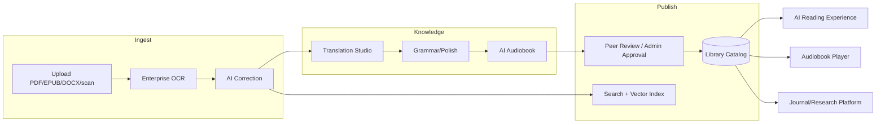
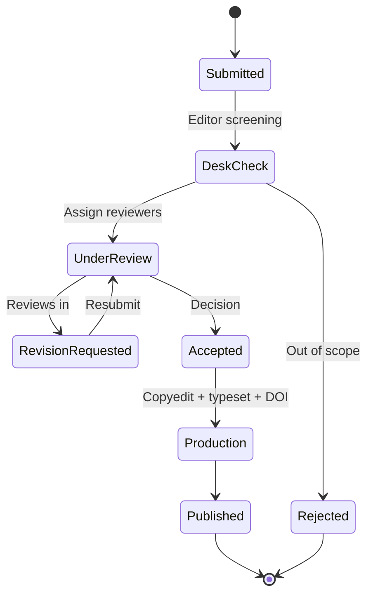

# 16 — Digital Library & Knowledge Hub

> **Codename:** `ZanaCloud` · Knowledge domain (`zana-library`)
> **Part:** D — Category Ecosystems (Dynamic Experiences)
> **Combines:** Google Books + Kindle + Internet Archive + Nature + ResearchGate — plus native Kurdish-first OCR/TTS/Translation.
> **Depends on:** [02-system-architecture.md](./02-system-architecture.md), [05-database-architecture.md](./05-database-architecture.md), [06-upload-pipeline.md](./06-upload-pipeline.md), [07-dynamic-category-system.md](./07-dynamic-category-system.md), [13-ai-systems.md](./13-ai-systems.md), [34-kurdish-language-intelligence.md](./34-kurdish-language-intelligence.md)
> **Monetization:** Free by default; Books & Courses may be **paid via FIB** (per-title), per [23-monetization.md](./23-monetization.md) and [33-platform-constraints.md](./33-platform-constraints.md).
> **Status:** Architecture & design blueprint (v1, 2026).

---

## 0. Mission

The Library & Knowledge Hub turns ZanaCloud into a **national digital publishing ecosystem**: books, audiobooks, magazines, peer-reviewed journals, and research papers — readable, listenable, searchable, translatable, and OCR-able, with **first-class Sorani/Kurmanji** support. It is the largest single producer of structured Kurdish knowledge in the platform.

It is rendered by the Dynamic Category Experience engine ([07](./07-dynamic-category-system.md)); this document defines the **domain services, pipelines, schemas, and APIs** behind the Library category and its sibling Journals/Research surfaces.



---

## 1. The Library category experience

Rendered via the Layout DSL ([07 §2](./07-dynamic-category-system.md)). Reference homepage sections:

| Order | Section | Widget | Engine |
|---|---|---|---|
| 1 | Hero — featured book/collection | `hero_banner` | curated/reco |
| 2 | Continue Reading | `continue_watching` (reading variant) | sql_view |
| 3 | Shelves (My Library) | `collection_shelf` | sql_view |
| 4 | Top Charts (Books) | `chart_widget` | ranked_query |
| 5 | Kurdish (Sorani/Kurmanji) | `media_carousel` | search (lang row) |
| 6 | Arabic | `media_carousel` | search |
| 7 | English / International | `media_carousel` | search |
| 8 | Children's Books | `media_carousel` | search (age-tagged) |
| 9 | Audiobooks | `media_carousel` | search (format=audiobook) |
| 10 | Magazines & Journals | `collection_shelf` | curated |
| 11 | Authors / Publishers spotlight | `creator_spotlight` | curated |
| 12 | Because you read … | `media_carousel` | reco |

**Library entities:** shelves, authors, publishers, collections, reading history, notes/highlights/bookmarks. Authors and Publishers get dedicated pages (bibliography, about, follow). Collections are curated groupings (e.g. "Kurdish Classics", "Iraqi PhD Theses 2025").

---

## 2. Supported formats

| Class | Formats | Reader path |
|---|---|---|
| Reflowable text | EPUB, FB2, plain text, Markdown | native reflow reader |
| Fixed layout | PDF, scanned PDF, DjVu | page reader (+OCR text layer) |
| Office | DOCX, ODT, RTF, PPTX, XLSX | converted to EPUB/PDF render |
| Images | PNG/JPG/TIFF/WEBP (scans) | OCR → text layer |
| Archives | ZIP/CBZ/CBR (comics, scan sets) | unpacked → page reader |
| Audio | MP3/AAC/FLAC/Opus | audiobook player |
| Video | MP4/HLS (supplementary) | media player ([09](./09-streaming-infrastructure.md)) |
| Presentations | PPTX/Keynote-exported PDF | slide reader |
| Research | PDF papers, LaTeX/TeX, JATS XML | paper viewer + citations |
| Magazines | PDF, fixed-layout EPUB | magazine reader |
| Audiobooks | M4B (chaptered), HLS-audio | chaptered player |

Ingestion normalizes everything to a canonical internal representation: **(a)** a fixed-layout artifact (PDF) for fidelity, **(b)** a reflowable artifact (EPUB) for accessibility, **(c)** a structured text + layout JSON (for search, translation, TTS), and **(d)** extracted media (images, tables, equations).

---

## 3. AI Reading Experience

```mermaid
flowchart TB
    OPEN[Open title] --> MODE{Format}
    MODE -->|reflow| REFLOW[Reflow engine: fonts, size, spacing]
    MODE -->|fixed| FIXED[Page engine: zoom, pan, text layer]
    REFLOW & FIXED --> FEAT[Reading features]
    FEAT --> THEME[Day / Night / Sepia / OLED-black]
    FEAT --> PROG[Progress %, time-left estimate]
    FEAT --> BM[Smart bookmarks + highlights + notes]
    FEAT --> FONTS[Font family/size/line-height/justify]
    FEAT --> DYS[Dyslexia mode: OpenDyslexic, spacing, ruler]
    FEAT --> TTS[Read-aloud (links to Audiobook TTS)]
    FEAT --> DICT[Tap-to-define + inline translate]
    FEAT --> SYNC[Cross-device sync (last position)]
```

### 3.1 Reading features

- **Themes:** day, night, sepia, true-black (OLED); auto by daypart.
- **Typography:** font family (incl. Kurdish-optimized Rabar/Noto), size, line height, margins, justification, RTL/LTR aware.
- **Dyslexia mode:** OpenDyslexic font, increased letter/word spacing, reading ruler, syllable highlighting, optional tinted overlay.
- **Smart bookmarks:** AI suggests bookmark points (chapter ends, key passages); manual bookmarks/highlights/notes synced to account.
- **Progress:** percent, current/last position, estimated time-to-finish from reading speed; **cross-device resume** (mobile ↔ desktop ↔ TV).
- **Inline AI:** tap-to-define, inline translate (Translation Studio §7), "explain this passage", chapter summary.
- **Read-aloud:** streams the AI Audiobook voice (§6) with text highlight follow-along.

### 3.2 Reading-state schema

```sql
CREATE TABLE reading_progress (
  user_id       BIGINT NOT NULL,
  edition_id    BIGINT NOT NULL,
  locator       JSONB NOT NULL,        -- {cfi | page | charOffset}
  percent       NUMERIC(5,2) NOT NULL,
  reading_speed NUMERIC(6,2),          -- wpm, learned
  updated_at    TIMESTAMPTZ NOT NULL DEFAULT now(),
  PRIMARY KEY (user_id, edition_id)
);

CREATE TABLE annotation (
  id          BIGSERIAL PRIMARY KEY,
  user_id     BIGINT NOT NULL,
  edition_id  BIGINT NOT NULL,
  kind        TEXT NOT NULL,           -- bookmark | highlight | note
  locator     JSONB NOT NULL,
  color       TEXT,
  body        TEXT,
  ai_suggested BOOLEAN NOT NULL DEFAULT FALSE,
  created_at  TIMESTAMPTZ NOT NULL DEFAULT now()
);
CREATE INDEX idx_annotation_user_edition ON annotation(user_id, edition_id);
```

---

## 4. Core catalog — SQL DDL

```sql
-- =========================================================
-- Library catalog (PostgreSQL). Search/vector mirrored to OpenSearch + VectorDB.
-- =========================================================
CREATE TABLE work (                      -- the abstract work
  id            BIGSERIAL PRIMARY KEY,
  title         JSONB NOT NULL,          -- {ckb, ar, en, ...}
  subtitle      JSONB,
  work_type     TEXT NOT NULL,           -- book | audiobook | magazine | journal_article | thesis | dataset
  original_lang TEXT NOT NULL,
  subjects      TEXT[] NOT NULL DEFAULT '{}',
  description   JSONB,
  created_at    TIMESTAMPTZ NOT NULL DEFAULT now()
);

CREATE TABLE author (
  id          BIGSERIAL PRIMARY KEY,
  name        JSONB NOT NULL,
  bio         JSONB,
  orcid       TEXT,
  photo_url   TEXT
);
CREATE TABLE work_author (
  work_id   BIGINT REFERENCES work(id) ON DELETE CASCADE,
  author_id BIGINT REFERENCES author(id) ON DELETE CASCADE,
  role      TEXT NOT NULL DEFAULT 'author', -- author | editor | translator | narrator
  ord       INT NOT NULL DEFAULT 0,
  PRIMARY KEY (work_id, author_id, role)
);

CREATE TABLE publisher (
  id      BIGSERIAL PRIMARY KEY,
  name    JSONB NOT NULL,
  country TEXT,
  logo_url TEXT
);

CREATE TABLE edition (                    -- a concrete published instance
  id            BIGSERIAL PRIMARY KEY,
  work_id       BIGINT NOT NULL REFERENCES work(id) ON DELETE CASCADE,
  publisher_id  BIGINT REFERENCES publisher(id),
  language      TEXT NOT NULL,            -- this edition's language (e.g. translated)
  isbn          TEXT,
  doi           TEXT,
  format        TEXT NOT NULL,            -- pdf | epub | audiobook | jats | ...
  page_count    INT,
  duration_s    INT,                      -- audiobooks
  cover_url     TEXT,
  pdf_uri       TEXT,
  epub_uri      TEXT,
  text_layout_uri TEXT,                   -- structured text+layout JSON
  audio_uri     TEXT,
  is_translation BOOLEAN NOT NULL DEFAULT FALSE,
  source_edition_id BIGINT REFERENCES edition(id),
  age_rating    TEXT,                     -- children band etc.
  monetization  JSONB NOT NULL DEFAULT '{"mode":"free"}', -- free | paid(FIB)
  price_iqd     INT,
  status        TEXT NOT NULL DEFAULT 'pending', -- pending | approved | published | rejected
  created_at    TIMESTAMPTZ NOT NULL DEFAULT now()
);
CREATE INDEX idx_edition_work ON edition(work_id);
CREATE INDEX idx_edition_status ON edition(status);

CREATE TABLE collection (
  id      BIGSERIAL PRIMARY KEY,
  title   JSONB NOT NULL,
  curated BOOLEAN NOT NULL DEFAULT TRUE,
  rules   JSONB                          -- for smart collections
);
CREATE TABLE collection_item (
  collection_id BIGINT REFERENCES collection(id) ON DELETE CASCADE,
  edition_id    BIGINT REFERENCES edition(id) ON DELETE CASCADE,
  ord           INT NOT NULL DEFAULT 0,
  PRIMARY KEY (collection_id, edition_id)
);

CREATE TABLE shelf (                       -- a user's library shelf
  id       BIGSERIAL PRIMARY KEY,
  user_id  BIGINT NOT NULL,
  name     TEXT NOT NULL,
  kind     TEXT NOT NULL DEFAULT 'custom'  -- custom | want-to-read | reading | finished
);
CREATE TABLE shelf_item (
  shelf_id   BIGINT REFERENCES shelf(id) ON DELETE CASCADE,
  edition_id BIGINT REFERENCES edition(id) ON DELETE CASCADE,
  added_at   TIMESTAMPTZ NOT NULL DEFAULT now(),
  PRIMARY KEY (shelf_id, edition_id)
);
```

---

## 5. Enterprise OCR Platform

A production OCR service that **preserves formatting**: tables, images, equations, citations, columns, and reading order — for **Kurdish (Sorani/Kurmanji) + Arabic + English + handwriting**.

### 5.1 Engine stack

```mermaid
flowchart TB
    IN[Document/scan] --> PRE[Preprocess: deskew, denoise, dewarp, binarize]
    PRE --> LAYOUT[Layout analysis<br/>MinerU / Docling]
    LAYOUT --> ROUTE{Region type}
    ROUTE -->|text| TXT[PaddleOCR (ar/ckb/en) + handwriting model]
    ROUTE -->|table| TAB[Table structure recognition → HTML/Markdown]
    ROUTE -->|equation| EQ[Formula recognition → LaTeX]
    ROUTE -->|figure| FIG[Image crop + caption link]
    ROUTE -->|citation| CIT[Reference parser → CSL-JSON]
    TXT & TAB & EQ & FIG & CIT --> ASSEMBLE[Reading-order assembly]
    ASSEMBLE --> OUT[Structured doc: text+layout JSON + searchable PDF + Markdown]
```

- **Layout & parsing:** MinerU + Docling for document structure (columns, reading order, tables, figures, formulas).
- **Text recognition:** PaddleOCR with Arabic-script + Latin pipelines; custom **Sorani/Kurmanji** fine-tunes ([34](./34-kurdish-language-intelligence.md)); handwriting recognition model.
- **Tables → structured HTML/Markdown**; **equations → LaTeX**; **figures** cropped and re-anchored; **citations** parsed to CSL-JSON.
- **Outputs:** (1) structured text+layout JSON, (2) searchable PDF (text layer over image), (3) clean Markdown/HTML, (4) extracted media bundle.

### 5.2 OCR job schema

```sql
CREATE TABLE ocr_job (
  id            BIGSERIAL PRIMARY KEY,
  source_uri    TEXT NOT NULL,
  edition_id    BIGINT REFERENCES edition(id),
  langs         TEXT[] NOT NULL,          -- ['ckb','ar','en']
  options       JSONB NOT NULL,           -- {tables:true,equations:true,handwriting:false}
  status        TEXT NOT NULL DEFAULT 'queued', -- queued|running|review|done|failed
  pages_total   INT, pages_done INT,
  confidence    NUMERIC(5,2),
  result_uri    TEXT,
  created_at    TIMESTAMPTZ NOT NULL DEFAULT now()
);
```

### 5.3 OCR API

```http
POST /v1/ocr/jobs
Content-Type: application/json
{
  "source_uri": "s3://uploads/scan_1289.pdf",
  "langs": ["ckb", "ar", "en"],
  "options": { "tables": true, "equations": true, "handwriting": true,
               "outputs": ["pdf_searchable", "markdown", "layout_json"] }
}
→ 202 { "jobId": "ocr_88421", "status": "queued" }

GET /v1/ocr/jobs/ocr_88421
→ 200 { "status": "review", "pages_done": 240, "pages_total": 240, "confidence": 96.4,
        "result_uri": "s3://ocr/ocr_88421/" }
```

---

## 6. AI Audiobook Generation

Emotion-aware, multi-language, multi-voice TTS that turns any text edition into a chaptered audiobook.

```mermaid
flowchart TB
    SRC[Structured text edition] --> SEG[Segment: chapters → paragraphs → sentences]
    SEG --> NLU[Prosody/emotion analysis<br/>+ dialogue/speaker detection]
    NLU --> CAST{Multi-voice?}
    CAST -->|narration| NV[Narrator voice]
    CAST -->|dialogue| CV[Character voices (per speaker)]
    NV & CV --> TTS[Neural TTS<br/>Sorani/Kurmanji/Arabic/English]
    TTS --> EMO[Emotion modulation: joy/sadness/tension/calm]
    EMO --> MIX[Mix + normalize + pacing + SSML pauses]
    MIX --> CH[Chapter markers + M4B/HLS-audio]
    CH --> OUT[Audiobook edition]
```

- **Languages:** Sorani, Kurmanji, Arabic, English (extensible) — shared with the Dubbing Studio voice bank ([15](./15-ai-dubbing-studio.md), [34](./34-kurdish-language-intelligence.md)).
- **Emotion-aware:** sentence-level prosody/emotion tagging drives expressive synthesis.
- **Character voices:** dialogue attribution assigns distinct voices per character; narrator for prose.
- **Chapters:** chapter markers from document structure; M4B + HLS-audio outputs; read-along highlight sync with the reader (§3).
- **Human-in-loop:** admins can audition, swap voices, and re-render before publish.

```sql
CREATE TABLE audiobook_job (
  id            BIGSERIAL PRIMARY KEY,
  edition_id    BIGINT NOT NULL REFERENCES edition(id),
  language      TEXT NOT NULL,
  voice_profile JSONB NOT NULL,        -- {narrator, characters:{name->voiceId}}
  emotion       BOOLEAN NOT NULL DEFAULT TRUE,
  status        TEXT NOT NULL DEFAULT 'queued',
  output_uri    TEXT,
  duration_s    INT,
  created_at    TIMESTAMPTZ NOT NULL DEFAULT now()
);
```

---

## 7. AI Translation Studio

Translate PDFs, books, and papers **preserving layout, citations, tables, and equations** — across 8 languages, with Kurdish (Sorani/Kurmanji) first-class.

### 7.1 Supported languages

Sorani (ckb), Kurmanji (kmr), Arabic (ar), Persian (fa), Turkish (tr), English (en), French (fr), German (de) — bidirectional.

### 7.2 Layout-preserving pipeline

```mermaid
flowchart TB
    IN[Source edition (text+layout JSON)] --> SEG[Segment by block, keep layout anchors]
    SEG --> PROT[Protect non-translatables:<br/>equations, code, citations, table cells, refs]
    PROT --> MT[Domain MT (academic/literary)<br/>+ glossary + TM]
    MT --> QA[QA: terminology, number/citation integrity]
    QA --> REFLOW[Re-flow into original layout<br/>RTL/LTR, font fit, hyphenation]
    REFLOW --> OUT[Translated edition: PDF/EPUB w/ preserved structure]
```

- **Non-translatable protection:** equations (LaTeX), code blocks, citation keys, DOIs, numbers, and table structure are masked, translated around, and restored.
- **Layout re-flow:** translated text re-flows into the original page geometry; handles RTL↔LTR direction switches, font substitution, and length expansion.
- **Translation memory + glossaries:** per-domain glossaries (medical, legal, Islamic, scientific) and TM for consistency; Kurdish terminology bank ([34](./34-kurdish-language-intelligence.md)).
- **Citation/reference integrity:** references re-localized but keys/DOIs preserved.

```http
POST /v1/translate/jobs
{
  "edition_id": 90231,
  "source_lang": "en",
  "target_lang": "ckb",
  "preserve": ["layout", "citations", "tables", "equations"],
  "glossary": "medical_v3",
  "output": ["pdf", "epub"]
}
→ 202 { "jobId": "tr_55120" }
```

---

## 8. Scientific Magazine / Journal Platform

A peer-reviewed journal & research platform (Nature + ResearchGate class): submissions, peer review, citations, references, institutions, DOI minting.

### 8.1 Peer-review workflow



### 8.2 Schema

```sql
CREATE TABLE journal (
  id        BIGSERIAL PRIMARY KEY,
  name      JSONB NOT NULL,
  issn      TEXT,
  scope     JSONB,
  open_access BOOLEAN NOT NULL DEFAULT TRUE
);

CREATE TABLE institution (
  id      BIGSERIAL PRIMARY KEY,
  name    JSONB NOT NULL,
  ror_id  TEXT,                          -- Research Org Registry
  country TEXT
);

CREATE TABLE submission (
  id            BIGSERIAL PRIMARY KEY,
  journal_id    BIGINT REFERENCES journal(id),
  title         JSONB NOT NULL,
  abstract      JSONB,
  manuscript_uri TEXT NOT NULL,
  status        TEXT NOT NULL DEFAULT 'submitted',
  doi           TEXT,
  submitted_by  BIGINT,
  created_at    TIMESTAMPTZ NOT NULL DEFAULT now()
);
CREATE TABLE submission_author (
  submission_id BIGINT REFERENCES submission(id) ON DELETE CASCADE,
  author_id     BIGINT REFERENCES author(id),
  institution_id BIGINT REFERENCES institution(id),
  is_corresponding BOOLEAN NOT NULL DEFAULT FALSE,
  ord           INT NOT NULL DEFAULT 0,
  PRIMARY KEY (submission_id, author_id)
);

CREATE TABLE review (
  id            BIGSERIAL PRIMARY KEY,
  submission_id BIGINT REFERENCES submission(id) ON DELETE CASCADE,
  reviewer_id   BIGINT,
  recommendation TEXT,                   -- accept|minor|major|reject
  body          TEXT,
  blind         TEXT NOT NULL DEFAULT 'double', -- single|double|open
  due_at        TIMESTAMPTZ,
  submitted_at  TIMESTAMPTZ
);

CREATE TABLE citation (                  -- edges between works/submissions
  id           BIGSERIAL PRIMARY KEY,
  citing_id    BIGINT NOT NULL,
  citing_type  TEXT NOT NULL,            -- edition | submission
  cited_doi    TEXT,
  cited_edition_id BIGINT REFERENCES edition(id),
  csl_json     JSONB                     -- full structured reference
);
CREATE INDEX idx_citation_citing ON citation(citing_id, citing_type);
CREATE INDEX idx_citation_cited ON citation(cited_edition_id);
```

### 8.3 DOI & citations

- **DOI minting** on acceptance (via registration agency adapter; offline queue in Intranet mode).
- **Citation graph** powers "cited by", "references", and research recommendations ([12](./12-recommendation-engine.md)).
- **CSL-JSON** export; BibTeX/RIS/EndNote download; metrics (views, downloads, citations).

---

## 9. The Automatic Knowledge Pipeline

End-to-end: **Upload PDF → OCR → Correction → Translation → Grammar → Audio → Audiobook → Publication.** Each stage is a queued, idempotent, resumable step; admins gate the final publication.

```mermaid
flowchart LR
    U[Upload PDF/scan] --> O[OCR (§5)]
    O --> C[AI Correction<br/>spelling/diacritics/layout fix]
    C --> T[Translation Studio (§7)<br/>optional, multi-target]
    T --> G[Grammar/Polish<br/>Kurdish copilot §34]
    G --> A[AI Audiobook (§6)]
    A --> R{Admin Review / Peer Review}
    R -->|approve| P[Publish edition(s) + index]
    R -->|reject| X[Return with notes]
    C --> IDX[(Search + Vector index)]
    P --> IDX
```

### 9.1 Pipeline orchestration

```sql
CREATE TABLE knowledge_pipeline (
  id            BIGSERIAL PRIMARY KEY,
  source_upload_id BIGINT NOT NULL,
  edition_id    BIGINT REFERENCES edition(id),
  stages        JSONB NOT NULL,          -- ordered: [ocr,correct,translate,grammar,audio,review]
  current_stage TEXT NOT NULL,
  stage_status  JSONB NOT NULL DEFAULT '{}',
  targets       JSONB,                   -- {translate:['ckb','ar'], audio:['ckb']}
  status        TEXT NOT NULL DEFAULT 'running', -- running|paused|review|published|failed
  created_by    BIGINT,
  created_at    TIMESTAMPTZ NOT NULL DEFAULT now(),
  updated_at    TIMESTAMPTZ NOT NULL DEFAULT now()
);
```

- **Idempotent stages** keyed by `(pipeline_id, stage)`; safe retry.
- **Branching:** translation/audio fan-out to multiple targets, each producing a distinct `edition`.
- **Human gates:** OCR-review and final publication are admin checkpoints ([33](./33-platform-constraints.md)).
- **Eventing:** each stage emits Kafka events for the Admin Control Center progress UI.

### 9.2 Pipeline API

```http
POST /v1/knowledge/pipelines
{
  "source_upload_id": 771203,
  "stages": ["ocr", "correct", "translate", "grammar", "audio", "review"],
  "targets": { "translate": ["ckb", "ar"], "audio": ["ckb"] },
  "monetization": { "mode": "paid", "price_iqd": 5000, "gateway": "fib" }
}
→ 202 { "pipelineId": "kp_4471", "currentStage": "ocr" }

GET /v1/knowledge/pipelines/kp_4471
→ 200 { "currentStage": "audio", "stage_status": { "ocr":"done","correct":"done",
        "translate":"done","grammar":"done","audio":"running" } }
```

---

## 10. Admin Control Center (no-code)

A no-code console (a surface of the Super Admin Panel, [33](./33-platform-constraints.md)) to run the entire knowledge factory.

| Capability | Description |
|---|---|
| Catalog management | Create/edit works, editions, authors, publishers, collections, shelves. |
| Pipeline console | Launch/monitor knowledge pipelines; per-stage progress, retry, pause, override. |
| OCR review | Side-by-side scan vs OCR; correct text, tables, equations; approve. |
| Translation review | Compare source/target with layout; edit glossary/TM hits; approve. |
| Audiobook studio | Audition voices, assign character voices, re-render, approve. |
| Journal editor desk | Manage submissions, assign reviewers, decisions, DOI, production. |
| Monetization | Per-title free/paid (FIB), price in IQD, geo gating, age rating ([23](./23-monetization.md), [33](./33-platform-constraints.md)). |
| Approval queue | All publications pass admin approval before going live. |
| Analytics | Reads, listens, completion, citations, revenue ([21](./21-analytics.md)). |

```mermaid
flowchart TB
    ADMIN[Admin Control Center] --> CAT[Catalog]
    ADMIN --> PIPE[Pipeline Console]
    ADMIN --> OCRREV[OCR Review]
    ADMIN --> TRREV[Translation Review]
    ADMIN --> ABS[Audiobook Studio]
    ADMIN --> DESK[Journal Editor Desk]
    ADMIN --> MON[Monetization (FIB)]
    ADMIN --> APPR[Approval Queue]
    PIPE -.events.-> APPR
    APPR -->|approve| PUBLISH[(Published catalog)]
```

---

## 11. Search & recommendations

- **Full-text + semantic:** OCR/structured text indexed in OpenSearch; chunk embeddings in the Vector DB for semantic and cross-lingual search ([11](./11-search-engine.md)).
- **Cross-lingual search:** query in Sorani, match Arabic/English editions via shared embedding space + translation expansion.
- **Reco:** Library reco binding (`reco_library_foryou`) combines reading history, subject graph, citation graph (for research), and CF; respects age band for Children rows and paywall-awareness ([12](./12-recommendation-engine.md), [07 §6](./07-dynamic-category-system.md)).

---

## 12. Public API surface (reader/listener)

| Method | Path | Purpose |
|---|---|---|
| `GET` | `/v1/library/editions/{id}` | Edition metadata + access/paywall state. |
| `GET` | `/v1/library/editions/{id}/manifest` | Reader manifest (spine, locators, resources). |
| `GET` | `/v1/library/editions/{id}/audio` | Audiobook HLS/M4B manifest + chapters. |
| `POST` | `/v1/library/editions/{id}/progress` | Save reading/listening position. |
| `GET/POST` | `/v1/library/editions/{id}/annotations` | Bookmarks/highlights/notes. |
| `POST` | `/v1/library/editions/{id}/purchase` | FIB purchase (paid titles). |
| `GET` | `/v1/journals/{id}/articles` | Journal issue/article listing. |
| `GET` | `/v1/research/{doi}/citations` | Citation graph (cited-by / references). |

---

## 13. Summary

The Digital Library & Knowledge Hub is ZanaCloud's national publishing and research engine: it ingests any document, runs an enterprise OCR → correction → translation → grammar → audiobook factory with **Kurdish-first** AI, preserves layout/tables/equations/citations throughout, and publishes free or FIB-paid editions into a Library experience plus a full peer-reviewed journal platform with DOI and citation graphs. Everything — catalog, pipelines, OCR/translation/audiobook review, journal editorial, and monetization — is driven from a no-code Admin Control Center under mandatory admin approval, and is rendered by the shared Dynamic Category Experience engine ([07](./07-dynamic-category-system.md)).
