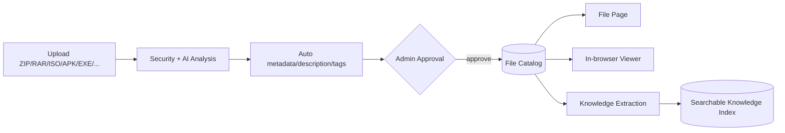
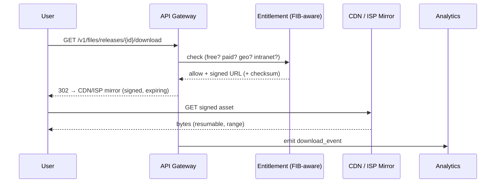

# 17 — File & Archive Hub

> **Codename:** `ZanaCloud` · Files domain (`zana-files`)
> **Part:** D — Category Ecosystems (Dynamic Experiences)
> **Combines:** FileCR + SourceForge + Internet Archive + GitHub Releases — with AI file analysis, in-browser archive viewing, and a knowledge-extraction pipeline.
> **Depends on:** [02-system-architecture.md](./02-system-architecture.md), [05-database-architecture.md](./05-database-architecture.md), [06-upload-pipeline.md](./06-upload-pipeline.md), [07-dynamic-category-system.md](./07-dynamic-category-system.md), [11-search-engine.md](./11-search-engine.md), [13-ai-systems.md](./13-ai-systems.md), [24-security.md](./24-security.md)
> **Reuses:** OCR/Translation/Summarization from [16-digital-library-knowledge-hub.md](./16-digital-library-knowledge-hub.md).
> **Status:** Architecture & design blueprint (v1, 2026).

---

## 0. Mission

The File & Archive Hub is ZanaCloud's **distribution and preservation layer** for everything that isn't streamed media or a reading edition: software, apps, games, AI models, datasets, documents, templates, and educational packs. It pairs a fast, ranked, well-described download experience (FileCR/SourceForge feel) with **archival permanence** (Internet Archive feel) and **release/version management** (GitHub Releases feel) — all under admin approval, geo/intranet gating, and security scanning.



---

## 1. The File & Archive category experience

Rendered via the Layout DSL ([07 §2](./07-dynamic-category-system.md)). Note: on **TV**, Files is hidden by default (media-only) unless an admin enables `tv_visible` ([07 §10](./07-dynamic-category-system.md)). Reference homepage sections:

| Order | Section | Widget | Engine |
|---|---|---|---|
| 1 | Hero — featured release | `hero_banner` | curated |
| 2 | Trending Downloads | `top_10_ranked` | ranked_query |
| 3 | New & Updated | `media_carousel` | search (recency) |
| 4 | Software | `media_carousel` | search (cat) |
| 5 | Apps & APKs | `media_carousel` | search |
| 6 | Games | `media_carousel` | search |
| 7 | AI Models | `media_carousel` | search |
| 8 | Datasets | `media_carousel` | search |
| 9 | Documents & Templates | `media_carousel` | search |
| 10 | Educational Packs | `collection_shelf` | curated |
| 11 | Top Publishers | `creator_spotlight` | curated |

---

## 2. Supported file types & categories

### 2.1 Containers / formats

| Class | Formats |
|---|---|
| Archives | ZIP, RAR, 7Z, TAR, GZ |
| Disk images | ISO, IMG |
| Installers / binaries | EXE, MSI, APK, AAB, DMG, DEB, RPM, AppImage |
| Documents | PDF, DOCX, PPTX, XLSX, EPUB, TXT, MD |
| AI / data | safetensors, GGUF, ONNX, CSV, Parquet, JSON, JSONL |
| Media (supplementary) | PNG/JPG, MP4, MP3 |

### 2.2 Catalog categories

`software · apps · games · ai_models · datasets · books · documents · templates · educational`

Categories are themselves Dynamic Category subcategories ([07](./07-dynamic-category-system.md)) — admins add/remove them no-code.

---

## 3. File pages

A file page is the canonical landing for a release.

```mermaid
flowchart TB
    PAGE[File Page] --> DESC[AI + author description]
    PAGE --> SHOTS[Screenshots / gallery]
    PAGE --> VER[Version history + changelog]
    PAGE --> DL[Download (count, mirrors, checksums)]
    PAGE --> RATE[Ratings + reviews]
    PAGE --> COMM[Comments]
    PAGE --> REL[Related files]
    PAGE --> SEC[Security report: scan status, hashes]
    PAGE --> VIEW[In-browser viewer (preview)]
```

Elements: description (author + AI-generated), screenshots, **version history & changelog**, download count + checksums (SHA-256/BLAKE3) + mirrors, ratings, comments, related files, license, size, requirements, and the security report.

---

## 4. Data model — SQL DDL

```sql
-- =========================================================
-- File & Archive Hub (PostgreSQL). Search mirrored to OpenSearch; chunks to VectorDB.
-- =========================================================
CREATE TABLE file_project (                 -- a "product" (like a SourceForge project)
  id            BIGSERIAL PRIMARY KEY,
  slug          TEXT UNIQUE NOT NULL,
  name          JSONB NOT NULL,             -- {ckb, ar, en}
  category      TEXT NOT NULL,              -- software|apps|games|ai_models|datasets|...
  summary       JSONB,
  description   JSONB,                      -- long, may be AI-authored
  publisher_id  BIGINT,
  license       TEXT,
  homepage_url  TEXT,
  geo_rule_id   BIGINT,                     -- see 07 geo_rule
  intranet_mode TEXT NOT NULL DEFAULT 'inherit',
  monetization  JSONB NOT NULL DEFAULT '{"mode":"free"}', -- free|paid(FIB)
  status        TEXT NOT NULL DEFAULT 'pending', -- pending|approved|published|hidden
  rating_avg    NUMERIC(3,2) NOT NULL DEFAULT 0,
  rating_count  INT NOT NULL DEFAULT 0,
  created_by    BIGINT,
  created_at    TIMESTAMPTZ NOT NULL DEFAULT now()
);
CREATE INDEX idx_fileproject_category ON file_project(category);
CREATE INDEX idx_fileproject_status ON file_project(status);

CREATE TABLE file_release (                  -- a versioned release (like GitHub Releases)
  id            BIGSERIAL PRIMARY KEY,
  project_id    BIGINT NOT NULL REFERENCES file_project(id) ON DELETE CASCADE,
  version       TEXT NOT NULL,
  channel       TEXT NOT NULL DEFAULT 'stable', -- stable|beta|nightly
  changelog     JSONB,
  is_latest     BOOLEAN NOT NULL DEFAULT TRUE,
  published_at  TIMESTAMPTZ,
  created_at    TIMESTAMPTZ NOT NULL DEFAULT now(),
  UNIQUE (project_id, version)
);

CREATE TABLE file_asset (                    -- a downloadable artifact within a release
  id            BIGSERIAL PRIMARY KEY,
  release_id    BIGINT NOT NULL REFERENCES file_release(id) ON DELETE CASCADE,
  filename      TEXT NOT NULL,
  storage_uri   TEXT NOT NULL,              -- object storage
  mime          TEXT,
  ext           TEXT NOT NULL,
  size_bytes    BIGINT NOT NULL,
  sha256        TEXT NOT NULL,
  blake3        TEXT,
  os            TEXT,                        -- windows|android|linux|macos|cross
  arch          TEXT,                        -- x64|arm64|...
  download_count BIGINT NOT NULL DEFAULT 0,
  scan_status   TEXT NOT NULL DEFAULT 'pending', -- pending|clean|infected|suspicious|error
  analysis      JSONB,                       -- AI analysis result (see §5)
  created_at    TIMESTAMPTZ NOT NULL DEFAULT now()
);
CREATE INDEX idx_asset_release ON file_asset(release_id);
CREATE INDEX idx_asset_scan ON file_asset(scan_status);

CREATE TABLE file_screenshot (
  id          BIGSERIAL PRIMARY KEY,
  project_id  BIGINT REFERENCES file_project(id) ON DELETE CASCADE,
  url         TEXT NOT NULL, caption JSONB, ord INT NOT NULL DEFAULT 0
);

CREATE TABLE file_rating (
  project_id BIGINT REFERENCES file_project(id) ON DELETE CASCADE,
  user_id    BIGINT NOT NULL,
  stars      SMALLINT NOT NULL CHECK (stars BETWEEN 1 AND 5),
  review     TEXT,
  created_at TIMESTAMPTZ NOT NULL DEFAULT now(),
  PRIMARY KEY (project_id, user_id)
);

CREATE TABLE file_download_event (           -- aggregated to ClickHouse (21)
  id           BIGSERIAL PRIMARY KEY,
  asset_id     BIGINT NOT NULL,
  user_id      BIGINT,
  geo          TEXT, isp TEXT, network_mode TEXT,
  at           TIMESTAMPTZ NOT NULL DEFAULT now()
);

CREATE TABLE extracted_entry (               -- files unpacked from an archive (§7)
  id           BIGSERIAL PRIMARY KEY,
  asset_id     BIGINT NOT NULL REFERENCES file_asset(id) ON DELETE CASCADE,
  path         TEXT NOT NULL,
  mime         TEXT, size_bytes BIGINT,
  text_uri     TEXT,                         -- OCR/extracted text
  summary      JSONB,
  lang         TEXT
);
CREATE INDEX idx_extracted_asset ON extracted_entry(asset_id);
```

---

## 5. AI File Analysis (on upload)

Every uploaded asset runs the analysis pipeline before approval. It produces metadata, an auto description + tags, language detection, a malware verdict, and (for documents/images) auto-OCR.

```mermaid
flowchart TB
    UP[Asset uploaded (06)] --> ID[Type & format ID<br/>magic bytes, not just ext]
    ID --> HASH[Hash: SHA-256 / BLAKE3]
    HASH --> SCAN[Malware scan]
    SCAN --> SBX{High-risk binary?}
    SBX -->|yes| DETON[Sandbox detonation<br/>(EXE/APK/MSI) behavior analysis]
    SBX -->|no| META
    DETON --> META[Metadata extraction<br/>(manifest, version, icons, perms)]
    META --> LANG[Language detection]
    META --> DESC[Auto description + tags (LLM)]
    META --> OCR{Doc/image?}
    OCR -->|yes| DOOCR[Auto-OCR (16 §5)]
    OCR -->|no| DONE
    DOOCR --> DONE[analysis JSON → file_asset.analysis]
```

### 5.1 What analysis extracts

| Signal | Source |
|---|---|
| True type / format | magic-byte sniffing + container inspection |
| Integrity hashes | SHA-256, BLAKE3 |
| Software metadata | APK manifest (package, permissions, min SDK), EXE/PE version info, ISO volume info |
| AI model metadata | safetensors/GGUF header (architecture, params, quant) |
| Dataset metadata | schema/columns (CSV/Parquet), row count, sample |
| Auto description & tags | LLM over metadata + extracted text/screenshots ([13](./13-ai-systems.md)) |
| Language | language-ID over extracted text |
| Malware verdict | multi-engine scan + sandbox (see §6) |

### 5.2 Analysis result (stored in `file_asset.analysis`)

```json
{
  "type": "android_app",
  "package": "iq.zana.reader",
  "version": "3.4.1",
  "permissions": ["INTERNET", "READ_MEDIA"],
  "min_sdk": 26,
  "size_bytes": 41857622,
  "hashes": { "sha256": "…", "blake3": "…" },
  "language": "ckb",
  "ai_description": { "ckb": "…", "ar": "…", "en": "Offline Kurdish e-reader…" },
  "tags": ["reader", "kurdish", "offline", "epub"],
  "scan": { "verdict": "clean", "engines": 6, "sandbox": "no_malicious_behavior" }
}
```

---

## 6. Security & scan pipeline

Security is mandatory and blocking: nothing publishes until it is scanned clean (or an admin overrides with justification).

```mermaid
flowchart TB
    A[Asset] --> ST[Static scan<br/>multi-engine AV signatures]
    ST --> YARA[YARA / heuristic rules]
    YARA --> ARCH{Archive?}
    ARCH -->|yes| UNPACK[Recursive unpack<br/>zip-bomb / path-traversal guards]
    UNPACK --> ST2[Re-scan each entry]
    ARCH -->|no| RISK
    ST2 --> RISK{Risk class}
    RISK -->|executable| DET[Sandbox detonation<br/>syscall/network/file behavior]
    RISK -->|doc| MACRO[Macro / embedded-object scan]
    RISK -->|safe| VERDICT
    DET --> VERDICT[Verdict: clean|suspicious|infected]
    MACRO --> VERDICT
    VERDICT -->|infected| QUAR[Quarantine + reject + alert]
    VERDICT -->|suspicious| HOLD[Hold for admin review]
    VERDICT -->|clean| OKAY[Eligible for approval]
```

- **Multi-engine AV + YARA/heuristics**; signatures updated offline-mirror-friendly for Intranet mode.
- **Archive safety:** recursive unpack with zip-bomb ratio limits, max-depth, and path-traversal (`../`) rejection; per-entry rescan.
- **Sandbox detonation** for EXE/MSI/APK/AAB: behavioral analysis (network beacons, persistence, file/registry tampering).
- **Document macros / embedded objects** (DOCX/XLSX/PPTX/PDF JS) inspected.
- **Verdicts** drive `scan_status`; infected → quarantine; suspicious → admin hold; clean → eligible. All linked to the platform security stack ([24](./24-security.md), [25](./25-content-moderation.md)).

---

## 7. AI Knowledge Extraction Pipeline

Turns archives and documents into **searchable knowledge**: `ZIP → extract → OCR → translation → summarization → knowledge indexing → searchable`. Reuses the Library pipeline primitives ([16 §5, §7, §9](./16-digital-library-knowledge-hub.md)).

```mermaid
flowchart LR
    Z[Archive / document asset] --> EX[Safe extract (§6 guards)]
    EX --> CLS[Per-entry classify<br/>doc/image/code/data/media]
    CLS --> O[OCR docs/images (16 §5)]
    O --> TR[Translation (16 §7) — optional]
    TR --> SUM[Summarization (LLM)]
    SUM --> CHUNK[Chunk + embed]
    CHUNK --> IDX[(OpenSearch + Vector DB)]
    SUM --> ENT[Entity/keyword extraction]
    ENT --> IDX
```

- **Outcome:** the *contents* of a ZIP (PDFs, slides, spreadsheets, code READMEs) become full-text + semantically searchable — a user can search "training data license" and match a buried `LICENSE.txt` inside a dataset archive.
- **Per-entry summaries** feed the file page ("What's inside") and related-file reco.
- **Cross-lingual:** Kurdish/Arabic/English indexing via shared embeddings ([11](./11-search-engine.md), [34](./34-kurdish-language-intelligence.md)).

```sql
CREATE TABLE knowledge_extract_job (
  id          BIGSERIAL PRIMARY KEY,
  asset_id    BIGINT NOT NULL REFERENCES file_asset(id) ON DELETE CASCADE,
  stages      JSONB NOT NULL,            -- [extract,ocr,translate,summarize,index]
  status      TEXT NOT NULL DEFAULT 'queued',
  entries_total INT, entries_done INT,
  index_uri   TEXT,
  created_at  TIMESTAMPTZ NOT NULL DEFAULT now()
);
```

---

## 8. In-browser Archive & Document Viewer

Preview without downloading: PDF, DOCX, images, EPUB, PPTX, and archive contents — rendered server-assisted, sandboxed.

```mermaid
flowchart TB
    REQ[Preview request] --> AUTH[Authz + geo/intranet check]
    AUTH --> TYPE{Asset type}
    TYPE -->|pdf| PDFV[PDF.js streamed renderer]
    TYPE -->|docx/pptx/xlsx| CONV[Convert → PDF/HTML on render node]
    TYPE -->|epub| EPUBV[EPUB reader (16 §3)]
    TYPE -->|image| IMGV[Image viewer + OCR text toggle]
    TYPE -->|archive| TREEV[Archive tree browser]
    TREEV --> ENTRY[Open entry → recurse to viewer]
    PDFV & CONV & EPUBV & IMGV & ENTRY --> SBX[Sandboxed iframe<br/>no script exec from content]
```

- **Archive tree browser:** navigate a ZIP/7Z/TAR tree in-browser; open individual entries in the appropriate viewer; no full download required.
- **Office preview:** server-side conversion (LibreOffice/Docling) to PDF/HTML for fidelity; cached.
- **Security:** previews render in a sandboxed iframe; no embedded scripts/macros execute; large/zip-bomb files capped.
- **Intranet:** render nodes co-located at ISP edge for FTTH-only operation ([33](./33-platform-constraints.md)).

```http
GET /v1/files/assets/{assetId}/preview?entry=docs/manual.pdf&page=3
→ 200 image/png (rendered page)   |   206 streamed PDF
GET /v1/files/assets/{assetId}/tree
→ 200 { "entries": [ { "path":"docs/", "type":"dir" },
                     { "path":"docs/manual.pdf", "type":"pdf", "size":1048576 } ] }
```

---

## 9. Download & versioning



- **Versioning:** `file_release` rows with `channel` (stable/beta/nightly) and `is_latest`; changelog per release; "update available" surfaced on file pages and to the admin.
- **Integrity:** signed, expiring URLs; checksums shown for verification; resumable range downloads.
- **Monetization:** paid assets gated by FIB entitlement ([23](./23-monetization.md)); free is default.
- **Mirrors:** CDN globally; ISP/FTTH mirrors for Intranet mode.

---

## 10. Admin File Center (no-code)

A no-code console (surface of the Super Admin Panel, [33](./33-platform-constraints.md)).

| Capability | Description |
|---|---|
| Categories | Create/remove/reorder file categories & subcategories (drives [07](./07-dynamic-category-system.md) layouts). |
| Approvals | Approve/reject projects & releases; required before publish. |
| Moderation | Handle reports, hide/remove, ban publishers ([25](./25-content-moderation.md)). |
| Version updates | Manage release channels, mark latest, edit changelogs. |
| Storage limits | Per-publisher/category quotas, max file size, retention. |
| Security scans | View scan reports, re-scan, override (with justification), quarantine. |
| Knowledge pipeline | Trigger/monitor extraction & indexing jobs (§7). |
| Monetization | Per-project free/paid (FIB), price (IQD), geo/intranet gating ([23](./23-monetization.md)). |
| Analytics | Downloads, ratings, storage, bandwidth, revenue ([21](./21-analytics.md)). |

```mermaid
flowchart TB
    FC[Admin File Center] --> CATS[Categories]
    FC --> APPR[Approvals]
    FC --> MOD[Moderation]
    FC --> VER[Version Updates]
    FC --> QUOTA[Storage Limits]
    FC --> SEC[Security Scans]
    FC --> KP[Knowledge Pipeline]
    FC --> MON[Monetization (FIB)]
    APPR -->|approve| PUB[(Published files)]
    SEC -.gate.-> APPR
```

---

## 11. REST API surface

| Method | Path | Purpose |
|---|---|---|
| `POST` | `/v1/files/projects` | Create project (→ pending). |
| `POST` | `/v1/files/projects/{id}/releases` | Add a release. |
| `POST` | `/v1/files/releases/{id}/assets` | Upload asset (triggers analysis+scan). |
| `GET` | `/v1/files/projects/{id}` | Project page data (description, screenshots, releases, ratings). |
| `GET` | `/v1/files/releases/{id}/download` | Entitlement-checked signed download. |
| `GET` | `/v1/files/assets/{id}/tree` | Archive tree. |
| `GET` | `/v1/files/assets/{id}/preview` | In-browser preview. |
| `GET` | `/v1/files/search` | Search incl. knowledge-extracted contents. |
| `POST` | `/v1/files/projects/{id}/ratings` | Rate/review. |
| `POST` | `/v1/admin/files/{id}/approve` | Admin approve. |
| `POST` | `/v1/admin/files/assets/{id}/rescan` | Re-run security scan. |
| `POST` | `/v1/admin/files/{id}/quota` | Set storage limits. |

**Example — upload asset**

```http
POST /v1/files/releases/55021/assets
Content-Type: multipart/form-data; boundary=…
(file=app-3.4.1.apk)
→ 202 { "assetId": 99182, "scan_status": "pending", "analysis": "queued" }
```

---

## 12. Recommendations & search

- **Related files** via content embeddings (description + extracted knowledge) + co-download CF ([12](./12-recommendation-engine.md)).
- **Ranking** (`rank_files_trending`): download velocity, rating, freshness, scan-clean requirement, geo locality.
- **Search** spans titles, descriptions, tags, **and extracted archive contents** (§7) — deep, cross-lingual ([11](./11-search-engine.md)).

---

## 13. Summary

The File & Archive Hub is ZanaCloud's secure distribution-and-preservation layer for software, apps, games, AI models, datasets, and documents — every upload passes mandatory AI analysis (true-type ID, metadata, auto description/tags, language, malware sandbox) and a blocking multi-engine + sandbox security pipeline before admin approval. It offers GitHub-Releases-style versioning, in-browser sandboxed previews of PDFs/Office/EPUB/archives without downloading, and a knowledge-extraction pipeline (ZIP → extract → OCR → translation → summarization → indexing) that makes the *contents* of archives fully searchable — all configured from a no-code Admin File Center and rendered by the shared Dynamic Category Experience engine ([07](./07-dynamic-category-system.md)).
