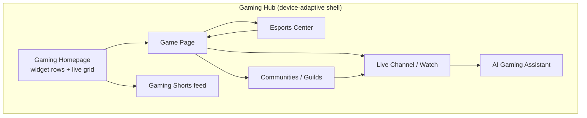
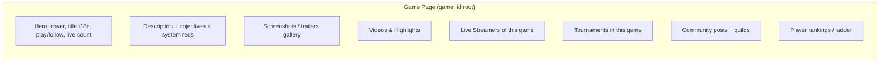
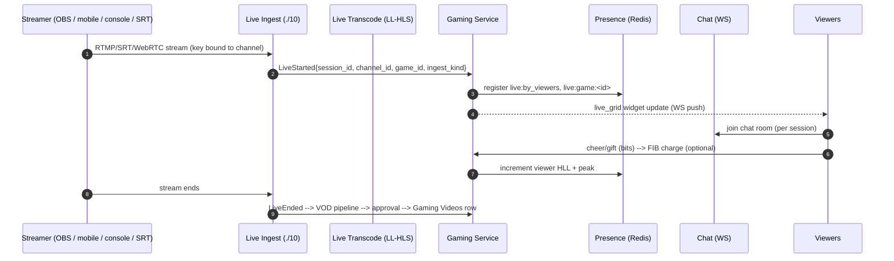
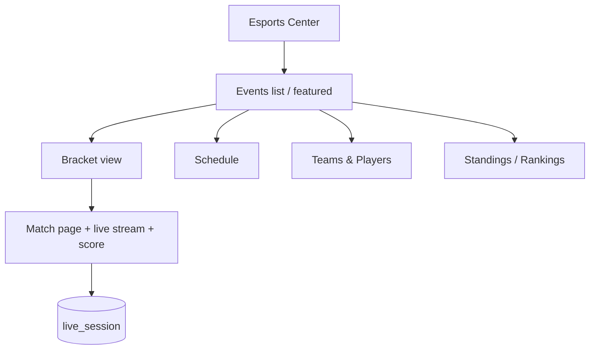
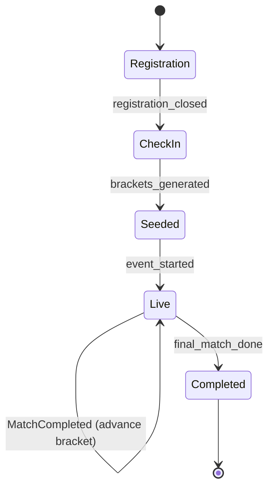
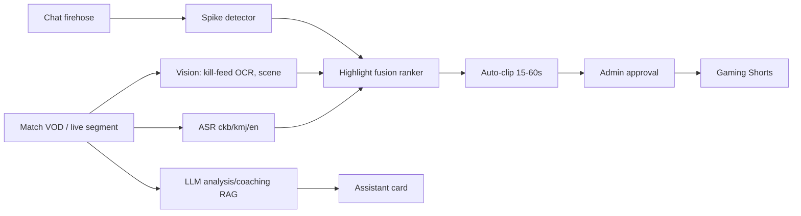
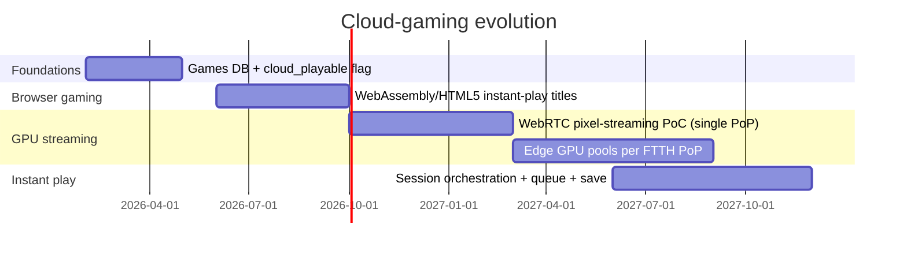
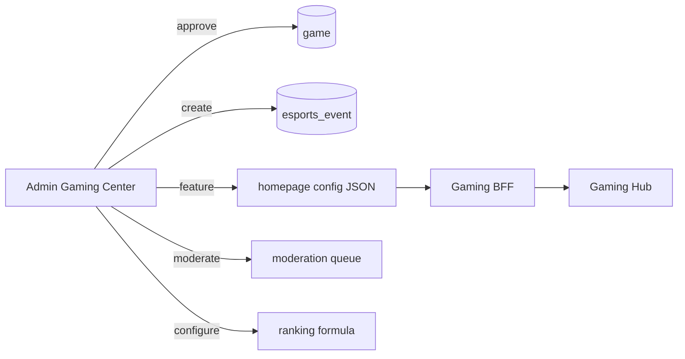

# 18 — Gaming Ecosystem (یاری / گەیمینگ)

> **Scope:** ZanaCloud's **Gaming Ecosystem** — a first-class category experience fusing **Facebook Gaming + Twitch + Steam Community + Discord** into one product. This is **not** a video layout reskinned; it is a dedicated gaming surface with its own information architecture, widgets, ranking algorithms, real-time presence, esports tooling, communities (guilds/clans/voice), an AI gaming assistant, and a cloud-gaming roadmap.
>
> **Foundation:** Built on the [Dynamic Category Experience System](./07-dynamic-category-system.md) (the per-category page builder), reusing the platform's [Live Streaming](./10-live-streaming.md) ingest, [Recommendation Engine](./12-recommendation-engine.md), [Search](./11-search-engine.md), [Analytics](./21-analytics.md), [Monetization](./23-monetization.md) (FIB), and [Content Moderation](./25-content-moderation.md) planes. Gaming **does not** fork these; it specializes them.
>
> **Non-negotiables honored here:** free-by-default; optional per-feature FIB monetization (tournament entry, channel subs, bits/cheers, cosmetic items); admin-approval publishing for VODs/clips/games-DB entries; geo-fencing (country/region/city/ISP); Intranet/FTTH mode (LAN esports, local ingest, no public internet); device-specific UX (Mobile = vertical live + Gaming Shorts; Desktop = full Twitch/Steam hybrid; **TV = media-only — the Gaming hub is hidden on TV unless an admin explicitly enables a "Gaming on TV" lite profile**); centralized no-code **Admin Gaming Center**.
>
> **Sibling docs:** [Live Streaming](./10-live-streaming.md) · [Recommendations](./12-recommendation-engine.md) · [Search](./11-search-engine.md) · [Monetization](./23-monetization.md) · [Analytics](./21-analytics.md) · [Learning Academy](./19-learning-academy.md) · [Marketplace](./20-marketplace.md) · [Security](./24-security.md)

---

## 1. Product thesis & forces

The gaming vertical is the **highest real-time, highest social-density** surface on the platform. It must satisfy forces no video page faces:

| Force | Architectural consequence |
|---|---|
| **Live-first**: most engagement is on *live* channels, not VOD | A real-time **presence + viewer-count + live-grid** plane (Redis + WebSocket fan-out) is the spine, not an afterthought. |
| **Sub-second social**: chat, gifts, raids, polls during a stream | Co-located low-latency chat with the LL-HLS pipeline from [Live Streaming](./10-live-streaming.md); shared `playback_session`. |
| **Esports = structured competition** | A normalized tournament/bracket/standings domain with deterministic seeding, swiss/double-elim engines, and live score ingestion. |
| **Communities = Discord-grade** | Guilds/clans with text + **voice channels** (SFU), roles, events — a separate real-time SFU plane (mediasoup/LiveKit). |
| **Game catalog = Steam-grade** | A rich **Games DB** (metadata, screenshots, system reqs, tags, franchises) that streams/VODs/tournaments/communities all reference. |
| **Kurdish-first** | Game titles, genres, tournament names, chat moderation, and the AI assistant all operate in Sorani + Kurmanji ([Kurdish Language Intelligence](./34-kurdish-language-intelligence.md)). |
| **Intranet/FTTH LAN esports** | Tournaments, brackets, local RTMP ingest, and voice must run fully air-gapped inside an ISP/FTTH PoP. |

**Design principle:** the Games DB is the *aggregate root of the vertical*. A live stream is "a stream **of** a game"; a tournament is "a competition **in** a game"; a community is "a guild **around** a game." Everything hangs off `game_id`.

---

## 2. Information architecture (NOT a video layout)



### 2.1 Device-specific rendering

| Device | Gaming experience |
|---|---|
| **Mobile (TikTok-style)** | Vertical **Gaming Shorts** feed + portrait live player with overlay chat; "Live near you" by geo; one-thumb guild chat. |
| **Desktop/Web (FB + YouTube + Twitch)** | Full hub: persistent left rail (followed live channels, guilds), center live grid, right rail (chat / community activity), theater + side-by-side multi-view. |
| **TV (Netflix, media-only)** | **Hidden by default.** If admin enables "Gaming on TV (lite)": a read-only, focus-navigable grid of *live channels + gaming VODs only* — no chat compose, no marketplace, no checkout, no guild management. |

The device gate is enforced at the **BFF** (see [System Architecture §6.1](./02-system-architecture.md)) using the signed `device_class` claim; the TV BFF simply does not register the Gaming routes unless `admin_config.gaming.tv_enabled = true`.

---

## 3. Widget & component catalog

The hub is assembled by the no-code page builder from typed widgets. Each widget declares a data contract, a refresh policy, a device-visibility matrix, and a geo/intranet fallback.

| Widget ID | Name | Data source | Refresh | Devices | Intranet fallback |
|---|---|---|---|---|---|
| `gw.live_grid` | **Live Channels grid** | Live presence (Redis) | WS push (≤1s) | M/W/TV* | local PoP streams only |
| `gw.game_rankings` | **Game Rankings** (by viewers/players) | ClickHouse rollup | 60s | M/W/TV* | last cached rollup |
| `gw.esports_standings` | **Esports Standings** | Esports DB | 30s on live, else 5m | M/W | local bracket |
| `gw.community_activity` | **Community Activity** feed | Community events + Kafka | WS push | M/W | local guild events |
| `gw.upcoming_tournaments` | **Upcoming Tournaments** | Esports DB | 5m | M/W | local schedule |
| `gw.top_streamers` | **Top Streamers** | Reco + ClickHouse | 5m | M/W/TV* | cached |
| `gw.trending_games` | **Trending Games** | Reco | 5m | M/W/TV* | cached |
| `gw.shorts_rail` | **Gaming Shorts** | Reco (shorts model) | per-scroll | M/W | cached pack |
| `gw.continue_watching` | **Continue / Followed Live** | per-user feed (Cassandra) | WS push | M/W/TV* | session-local |
| `gw.clip_of_day` | **Clip of the Day** | curated + AI highlight | daily | M/W | local clip |
| `gw.team_spotlight` | **Team / Player Spotlight** | Esports DB | daily | M/W | cached |
| `gw.voice_now` | **Friends in Voice** | SFU presence | WS push | M/W | local SFU |

`*` = TV only when admin `gaming.tv_enabled = true`, and then read-only.

**Widget config (JSON, stored by the page builder):**

```json
{
  "page": "gaming.home",
  "locale_default": "ckb",
  "rows": [
    { "widget": "gw.live_grid",      "title": {"ckb":"کەناڵە زیندووەکان","kmj":"Kanalên zindî","en":"Live Now"},
      "ranking": "viewers_desc",     "limit": 24, "refresh_ms": 1000, "devices": ["mobile","web","tv"] },
    { "widget": "gw.trending_games", "title": {"ckb":"یارییە بەناوبانگەکان"}, "model": "reco.game.trending.v3", "limit": 18 },
    { "widget": "gw.top_streamers",  "title": {"ckb":"باشترین یاریکەرەکان"}, "window": "24h", "limit": 20 },
    { "widget": "gw.esports_standings","title":{"ckb":"ئیسپۆرتس"}, "featured_event_id": null, "limit": 5 },
    { "widget": "gw.upcoming_tournaments","title":{"ckb":"پاڵەوانێتییە داهاتووەکان"}, "limit": 10 },
    { "widget": "gw.shorts_rail",    "title": {"ckb":"شۆرتسی گەیم"}, "model": "reco.shorts.gaming.v2", "limit": 30 }
  ],
  "geo_policy": { "mode": "ALLOW_LIST", "countries": ["IQ"], "regions": ["IQ-KR"] }
}
```

### 3.1 Homepage rows (canonical)

The Gaming homepage is **row-based** (like Netflix/Twitch) but each row is a gaming-native widget, not a video carousel:

1. **Live Streams** (`gw.live_grid`) — sorted by live viewers, personalized by followed games/streamers.
2. **Trending Games** (`gw.trending_games`) — rising concurrent-players + viewer velocity.
3. **Top Streamers** (`gw.top_streamers`) — 24h watch-time leaders (per-game + global).
4. **Esports** (`gw.esports_standings` + `gw.upcoming_tournaments`) — featured event card + standings.
5. **New Games** — recently approved Games-DB entries.
6. **Gaming Videos** — long-form VODs/highlights (reuses video pipeline, gaming-tagged).
7. **Gaming Shorts** (`gw.shorts_rail`) — vertical clips, the mobile-default surface.

---

## 4. Domain model & database schemas

Gaming owns its own schemas (Postgres write-side; ClickHouse read-side for rankings/analytics; Redis for presence; Cassandra for per-user live feeds). No cross-service joins — integration via API/events (see [System Architecture §3](./02-system-architecture.md)).

### 4.1 Games catalog (Steam-grade)

```sql
-- ====== GAMES DB (Postgres: gaming schema) ======
CREATE TABLE game (
    id              UUID PRIMARY KEY DEFAULT gen_random_uuid(),
    slug            TEXT UNIQUE NOT NULL,            -- 'pubg-mobile'
    title_i18n      JSONB NOT NULL,                  -- {"en":"PUBG Mobile","ckb":"...","kmj":"..."}
    description_i18n JSONB NOT NULL,
    franchise_id    UUID REFERENCES franchise(id),
    developer       TEXT, publisher TEXT,
    release_date    DATE,
    platforms       TEXT[] NOT NULL,                 -- {pc,mobile,console,web}
    genres          TEXT[] NOT NULL,                 -- {battle_royale,fps,moba}
    tags            TEXT[] DEFAULT '{}',             -- free-form, Kurdish-aware
    age_rating      TEXT,                            -- PEGI/ESRB-like + local
    cover_url       TEXT, logo_url TEXT, hero_url TEXT,
    system_reqs     JSONB,                           -- min/recommended specs
    is_esports      BOOLEAN DEFAULT FALSE,
    cloud_playable  BOOLEAN DEFAULT FALSE,           -- cloud-gaming roadmap flag
    geo_policy      JSONB NOT NULL DEFAULT '{"mode":"ALLOW_ALL"}',
    publication_state TEXT NOT NULL DEFAULT 'pending_review',  -- admin-gated
    created_by      UUID NOT NULL,                   -- submitter (admin/curator)
    approved_by     UUID,
    metrics_cache   JSONB DEFAULT '{}',              -- denormalized live counts
    created_at      TIMESTAMPTZ DEFAULT now(),
    updated_at      TIMESTAMPTZ DEFAULT now()
);
CREATE INDEX game_genres_gin ON game USING GIN (genres);
CREATE INDEX game_tags_gin   ON game USING GIN (tags);
CREATE INDEX game_state_idx  ON game (publication_state);

CREATE TABLE franchise (
    id UUID PRIMARY KEY DEFAULT gen_random_uuid(),
    slug TEXT UNIQUE NOT NULL, title_i18n JSONB NOT NULL
);

CREATE TABLE game_media (        -- screenshots, trailers, art
    id UUID PRIMARY KEY DEFAULT gen_random_uuid(),
    game_id UUID NOT NULL REFERENCES game(id) ON DELETE CASCADE,
    kind TEXT NOT NULL,          -- screenshot | trailer | artwork | clip
    media_ref TEXT,              -- friendly_token into Video/Media domain for videos
    url TEXT,                    -- object-storage url for images
    ordinal INT DEFAULT 0,
    approved BOOLEAN DEFAULT FALSE
);

CREATE TABLE game_category (     -- editorial categories for the hub
    id UUID PRIMARY KEY DEFAULT gen_random_uuid(),
    slug TEXT UNIQUE NOT NULL, name_i18n JSONB NOT NULL, ordinal INT DEFAULT 0
);
CREATE TABLE game_category_map (
    game_id UUID REFERENCES game(id) ON DELETE CASCADE,
    category_id UUID REFERENCES game_category(id) ON DELETE CASCADE,
    PRIMARY KEY (game_id, category_id)
);
```

### 4.2 Streamers, channels, live sessions

```sql
CREATE TABLE gaming_channel (
    id              UUID PRIMARY KEY DEFAULT gen_random_uuid(),
    user_id         UUID NOT NULL,                   -- platform identity (Conformist)
    handle          TEXT UNIQUE NOT NULL,
    display_i18n    JSONB NOT NULL,
    bio_i18n        JSONB,
    primary_game_id UUID REFERENCES game(id),
    panels          JSONB DEFAULT '[]',              -- Twitch-style info panels
    sub_enabled     BOOLEAN DEFAULT FALSE,           -- FIB subs (optional monetization)
    bits_enabled    BOOLEAN DEFAULT FALSE,
    is_partner      BOOLEAN DEFAULT FALSE,
    geo_policy      JSONB NOT NULL DEFAULT '{"mode":"ALLOW_ALL"}',
    created_at      TIMESTAMPTZ DEFAULT now()
);

-- A live broadcast = a stream session bound to the Live Streaming domain's ingest
CREATE TABLE live_session (
    id              UUID PRIMARY KEY DEFAULT gen_random_uuid(),
    channel_id      UUID NOT NULL REFERENCES gaming_channel(id),
    game_id         UUID REFERENCES game(id),
    title_i18n      JSONB NOT NULL,
    ingest_kind     TEXT NOT NULL,                   -- pc_obs | console | mobile_rtmp | webrtc | srt
    ingest_ref      TEXT NOT NULL,                   -- handle into Live Streaming domain (see ./10)
    started_at      TIMESTAMPTZ,
    ended_at        TIMESTAMPTZ,
    peak_viewers    INT DEFAULT 0,
    is_mature       BOOLEAN DEFAULT FALSE,
    tags            TEXT[] DEFAULT '{}',
    vod_media_ref   TEXT,                            -- friendly_token of the resulting VOD
    status          TEXT NOT NULL DEFAULT 'scheduled' -- scheduled|live|ended|errored
);
CREATE INDEX live_session_status_idx ON live_session (status) WHERE status = 'live';
CREATE INDEX live_session_game_idx   ON live_session (game_id, status);
```

> **Presence (Redis, not SQL):** `ZADD live:by_viewers <count> <session_id>` per game and global; `live:session:<id>:viewers` HLL for unique counts; `chan:<id>:online` for follower presence. The `gw.live_grid` widget reads these sorted sets directly — sub-second, never touches Postgres.

### 4.3 Esports

```sql
CREATE TABLE esports_event (
    id UUID PRIMARY KEY DEFAULT gen_random_uuid(),
    game_id UUID NOT NULL REFERENCES game(id),
    slug TEXT UNIQUE NOT NULL,
    name_i18n JSONB NOT NULL,
    organizer TEXT,
    format TEXT NOT NULL,            -- single_elim | double_elim | swiss | round_robin | groups_playoffs
    prize_pool_minor BIGINT DEFAULT 0,   -- in IQD minor units; payouts via FIB
    currency TEXT DEFAULT 'IQD',
    entry_fee_minor BIGINT DEFAULT 0,    -- optional paid entry (FIB)
    region TEXT,                          -- geo / LAN scope
    is_lan BOOLEAN DEFAULT FALSE,         -- Intranet/FTTH LAN tournament
    starts_at TIMESTAMPTZ, ends_at TIMESTAMPTZ,
    status TEXT NOT NULL DEFAULT 'draft', -- draft|registration|live|completed|cancelled
    publication_state TEXT DEFAULT 'pending_review'
);

CREATE TABLE esports_team (
    id UUID PRIMARY KEY DEFAULT gen_random_uuid(),
    name_i18n JSONB NOT NULL, tag TEXT, logo_url TEXT,
    region TEXT, owner_user_id UUID
);
CREATE TABLE esports_player (
    id UUID PRIMARY KEY DEFAULT gen_random_uuid(),
    user_id UUID, nickname TEXT NOT NULL, country TEXT, team_id UUID REFERENCES esports_team(id)
);
CREATE TABLE esports_registration (
    event_id UUID REFERENCES esports_event(id),
    team_id  UUID REFERENCES esports_team(id),
    seed INT, checked_in BOOLEAN DEFAULT FALSE,
    payment_ref TEXT,               -- FIB transaction id if entry fee paid
    PRIMARY KEY (event_id, team_id)
);

CREATE TABLE esports_match (
    id UUID PRIMARY KEY DEFAULT gen_random_uuid(),
    event_id UUID REFERENCES esports_event(id),
    round INT, bracket_slot INT, bracket_side TEXT,  -- winners|losers|group
    team_a UUID REFERENCES esports_team(id),
    team_b UUID REFERENCES esports_team(id),
    score_a INT DEFAULT 0, score_b INT DEFAULT 0,
    best_of INT DEFAULT 1,
    winner UUID,
    scheduled_at TIMESTAMPTZ, started_at TIMESTAMPTZ, ended_at TIMESTAMPTZ,
    stream_session_id UUID REFERENCES live_session(id),
    status TEXT NOT NULL DEFAULT 'pending'  -- pending|live|completed
);
CREATE INDEX esports_match_event_idx ON esports_match (event_id, round);

CREATE TABLE esports_standing (    -- materialized ranking per event
    event_id UUID, team_id UUID,
    wins INT, losses INT, points INT, map_diff INT, rank INT,
    PRIMARY KEY (event_id, team_id)
);

CREATE TABLE player_ranking (      -- global/per-game ELO/MMR ladder
    game_id UUID, player_id UUID,
    rating INT DEFAULT 1000, peak_rating INT, region TEXT,
    season TEXT NOT NULL, rank INT,
    PRIMARY KEY (game_id, player_id, season)
);
```

### 4.4 Communities (guilds / clans / voice)

```sql
CREATE TABLE guild (
    id UUID PRIMARY KEY DEFAULT gen_random_uuid(),
    slug TEXT UNIQUE NOT NULL,
    name_i18n JSONB NOT NULL,
    game_id UUID REFERENCES game(id),
    kind TEXT NOT NULL DEFAULT 'guild',   -- guild|clan
    icon_url TEXT, banner_url TEXT,
    visibility TEXT DEFAULT 'public',     -- public|invite|private
    member_count INT DEFAULT 0,
    geo_policy JSONB DEFAULT '{"mode":"ALLOW_ALL"}',
    created_by UUID, created_at TIMESTAMPTZ DEFAULT now()
);
CREATE TABLE guild_role (
    id UUID PRIMARY KEY DEFAULT gen_random_uuid(),
    guild_id UUID REFERENCES guild(id) ON DELETE CASCADE,
    name TEXT, permissions BIGINT NOT NULL DEFAULT 0,  -- bitmask
    color TEXT, ordinal INT DEFAULT 0
);
CREATE TABLE guild_member (
    guild_id UUID REFERENCES guild(id) ON DELETE CASCADE,
    user_id UUID NOT NULL,
    nickname TEXT, role_ids UUID[] DEFAULT '{}',
    joined_at TIMESTAMPTZ DEFAULT now(),
    PRIMARY KEY (guild_id, user_id)
);
CREATE TABLE guild_channel (
    id UUID PRIMARY KEY DEFAULT gen_random_uuid(),
    guild_id UUID REFERENCES guild(id) ON DELETE CASCADE,
    name TEXT NOT NULL,
    kind TEXT NOT NULL,                   -- text|voice|announcement|forum|stage
    sfu_room_ref TEXT,                    -- voice/stage → SFU room handle
    ordinal INT DEFAULT 0,
    permission_overwrites JSONB DEFAULT '[]'
);
CREATE TABLE guild_event (
    id UUID PRIMARY KEY DEFAULT gen_random_uuid(),
    guild_id UUID REFERENCES guild(id) ON DELETE CASCADE,
    title_i18n JSONB, starts_at TIMESTAMPTZ, ends_at TIMESTAMPTZ,
    linked_session_id UUID REFERENCES live_session(id),
    kind TEXT DEFAULT 'community'         -- community|scrim|tournament_watch
);
```

> Guild **messages** and **community posts** are high-write/low-relational → stored in **Cassandra** (`guild_messages` partitioned by `(guild_id, channel_id, bucket)`), not Postgres, mirroring the platform's feed-store choice ([Database Architecture](./05-database-architecture.md)). Postgres holds structure (guilds/roles/members); Cassandra holds the firehose of messages.

---

## 5. Game page



**REST (read):**

```
GET /api/v1/gaming/games/{slug}
  → 200 { game, live_count, top_streamers[], upcoming_tournaments[], guilds[] }
  → 403 geo_restricted | 404
GET /api/v1/gaming/games/{slug}/streamers?status=live&page=
GET /api/v1/gaming/games/{slug}/videos?type=highlight|vod|short
GET /api/v1/gaming/games/{slug}/tournaments?status=registration|live|upcoming
GET /api/v1/gaming/games/{slug}/community?cursor=
GET /api/v1/gaming/games/{slug}/rankings?season=2026-S1&region=IQ-KR
```

All reads pass the gateway geo-fence; the TV BFF only exposes `…/streamers?status=live` and `…/videos` (media-only) when `tv_enabled`.

---

## 6. Live streaming (game / mobile / console / PC ingest)

Gaming **does not** re-implement ingest — it **composes** the platform [Live Streaming](./10-live-streaming.md) domain. The gaming layer adds game-context binding, gaming chat overlays, raids, and bits/gifts.



| Ingest kind | Path | Latency target | Intranet note |
|---|---|---|---|
| **PC (OBS/SRT)** | RTMP/SRT → LL-HLS | 2–4 s glass-to-glass | local PoP transcode |
| **Console** | RTMP (Xbox/PS share) | 3–5 s | local PoP |
| **Mobile** | WebRTC/RTMP from app | 1–3 s (WebRTC) | local SFU edge |
| **WebRTC co-stream** | WHIP → SFU | <1 s | LiveKit on PoP |

Gaming-specific live features layered on top: **raids** (`POST /live/{session}/raid` → move viewers to another live session), **hosting**, **predictions/polls** (optional FIB-backed channel-points economy), **clips** (`POST /live/{session}/clip` → 30–60s segment → AI highlight pipeline §8 → Gaming Shorts).

---

## 7. Esports Center



### 7.1 Bracket engine

A deterministic, server-side **bracket engine** generates and advances brackets. Formats: `single_elim`, `double_elim`, `swiss`, `round_robin`, `groups_playoffs`. Seeding from `esports_registration.seed` (or `player_ranking`). Each match result emits an event that advances the bracket and recomputes standings.



**API:**

```
POST /api/v1/gaming/esports/events                 (admin) create event
POST /api/v1/gaming/esports/events/{id}/register   team registration (+ optional FIB entry fee)
POST /api/v1/gaming/esports/events/{id}/seed       (admin) generate bracket
POST /api/v1/gaming/esports/matches/{id}/score     report score (referee/admin or verified score-ingest)
GET  /api/v1/gaming/esports/events/{id}/bracket    → full bracket tree
GET  /api/v1/gaming/esports/events/{id}/standings  → standings table
GET  /api/v1/gaming/esports/events/{id}/schedule
WS   /ws/esports/events/{id}                        live score + bracket push
```

**LAN / Intranet mode:** an event with `is_lan = true` runs entirely on the PoP: local ingest, local bracket engine, local standings WS. Prize payouts (if any) queue as FIB intents that settle when the PoP reconnects to the FIB ACL (see [Monetization](./23-monetization.md) and [System Architecture §8.5](./02-system-architecture.md) graceful degradation).

### 7.2 Rankings

Two ladders: **per-event standings** (wins/points/map-diff) and **global per-game player ladders** (ELO/MMR via `player_ranking`, recomputed by a ClickHouse-fed batch + real-time delta on `MatchCompleted`). Seasons are first-class (`2026-S1`).

---

## 8. AI Gaming Assistant

A streamer/viewer-facing assistant that reuses the platform [AI Systems](./13-ai-systems.md) plane (Triton/vLLM GPU pool) with gaming-specific tools. Always async (never blocks the watch path); Kurdish-capable.

| Capability | How |
|---|---|
| **Match analysis** | Ingests match VOD + event metadata → timeline of key moments (kills, objectives), win-probability graph. |
| **Coaching** | Per-player feedback from gameplay telemetry/VOD ("rotate earlier on map X"); skill-trend over season. |
| **Strategy** | Meta/build/loadout suggestions per game patch from a curated knowledge base (RAG over patch notes + community wisdom). |
| **Highlight generation** | Audio (hype/crowd) + vision (kill-feed OCR) + chat-spike fusion → auto-clips → Gaming Shorts. |
| **Live co-pilot** | Real-time chat summarization, auto-moderation hints, raid suggestions for streamers. |



**API:**

```
POST /api/v1/gaming/ai/highlights   { session_id | media_ref }     → 202 job
POST /api/v1/gaming/ai/analyze      { match_id }                   → 202 job
POST /api/v1/gaming/ai/coach        { player_id, scope }           → 202 job
POST /api/v1/gaming/ai/strategy     { game_id, query_i18n }        → stream tokens (SSE)
GET  /api/v1/gaming/ai/jobs/{id}    → status/result
```

Highlights flow through **admin approval** before publishing (constraint). In Intranet mode, AI jobs queue locally and run on PoP GPUs if present, else defer.

---

## 9. Cloud-gaming roadmap

Phased; explicitly a **roadmap**, not MVP.



| Phase | Capability | Tech |
|---|---|---|
| **0** | Games DB + `cloud_playable` flag, store pages | catalog only |
| **1** | **Browser gaming**: HTML5/WASM titles play instantly in-page | WASM, no GPU stream |
| **2** | **GPU pixel-streaming PoC**: heavy titles streamed via WebRTC | NVIDIA GPU node + WebRTC, single region |
| **3** | **Instant play at the edge**: per-PoP GPU pools, session queue, cloud saves, controller-over-WebRTC | edge GPU orchestration (K8s + KubeVirt/containers), latency-aware routing |

Edge GPU pools double as the AI assistant compute when idle. Intranet/FTTH PoPs with GPUs can host LAN cloud-gaming entirely offline.

---

## 10. Admin Gaming Center (no-code)

A dedicated tab in the centralized [Super Admin Panel](./33-platform-constraints.md). Everything is configured visually — no code.

| Section | Controls |
|---|---|
| **Games DB** | Add/edit/approve games, franchises, categories, screenshots, system reqs, geo-policy, `cloud_playable`. |
| **Categories** | Create editorial categories, drag-order, localize (ckb/kmj/en), map games. |
| **Esports events** | Create events, choose format, set prize pool & FIB entry fee, open/close registration, generate brackets, enter scores, publish. |
| **Featured streamers** | Pin streamers/channels to homepage rows; schedule features; per-geo overrides. |
| **Moderation** | Review queue for VODs/clips/games-DB submissions/community posts; chat-ban tooling; appeals (ties into [Content Moderation](./25-content-moderation.md)). |
| **Rankings** | Configure ladder formula (ELO K-factor, decay), seasons, freeze/recompute. |
| **Homepage builder** | Drag/drop the widget rows of §3 (the JSON in §3 is generated by this builder). |
| **Monetization** | Toggle subs/bits/entry-fees per channel/event; FIB account binding; payout schedule (→ [Monetization](./23-monetization.md)). |
| **Device & geo** | Toggle `gaming.tv_enabled`; set hub geo-fence; intranet/FTTH profile. |



---

## 11. Events (Kafka), capacity, and cross-references

### 11.1 Gaming domain events

| Event | Producer | Consumers |
|---|---|---|
| `zc.gaming.game.approved.v1` | Admin/Games | Search, Reco, Notification |
| `zc.gaming.live.started.v1` | Gaming | Presence, Reco, Notification, Analytics |
| `zc.gaming.live.ended.v1` | Gaming | VOD pipeline, Analytics |
| `zc.gaming.clip.created.v1` | Gaming/AI | Moderation, Shorts, Reco |
| `zc.gaming.esports.match.completed.v1` | Esports | Bracket engine, Standings, Analytics, Notification |
| `zc.gaming.guild.event.created.v1` | Community | Notification, Calendar |
| `zc.gaming.bits.cheered.v1` | Gaming | Billing(FIB), Creator Economy, Analytics |

### 11.2 Capacity targets

| Metric | Target |
|---|---|
| Concurrent live gaming sessions | 5,000 (national peak) |
| Concurrent viewers | 500,000 |
| Live-grid presence updates | 50,000 ops/s (Redis sorted sets) |
| Chat messages | 200,000 msg/s peak (sharded WS + Cassandra sink) |
| Esports live score WS fan-out | 100,000 subscribers/event |
| Voice (SFU) concurrent participants | 50,000 across guilds |
| AI highlight jobs | 2,000/min burst (GPU pool autoscaled) |

### 11.3 Cross-references

- Ingest, LL-HLS, chat spine: **[10 — Live Streaming](./10-live-streaming.md)**
- Personalization of live/games/shorts: **[12 — Recommendation Engine](./12-recommendation-engine.md)**
- Game/streamer discovery & semantic search: **[11 — Search Engine](./11-search-engine.md)**
- Subs/bits/entry-fee/payouts via FIB: **[23 — Monetization](./23-monetization.md)**
- Watch-time, rankings rollups, dashboards: **[21 — Analytics](./21-analytics.md)**
- VOD/clip/games-DB approval, chat moderation: **[25 — Content Moderation](./25-content-moderation.md)**
- Kurdish chat moderation, AI assistant language: **[34 — Kurdish Language Intelligence](./34-kurdish-language-intelligence.md)**
- Sibling commerce/learning verticals: **[19 — Learning Academy](./19-learning-academy.md)** · **[20 — Marketplace](./20-marketplace.md)**
