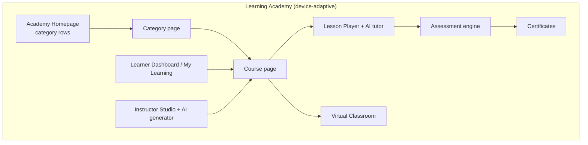
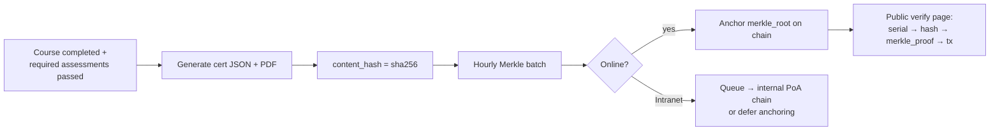
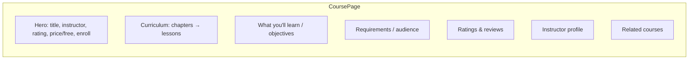
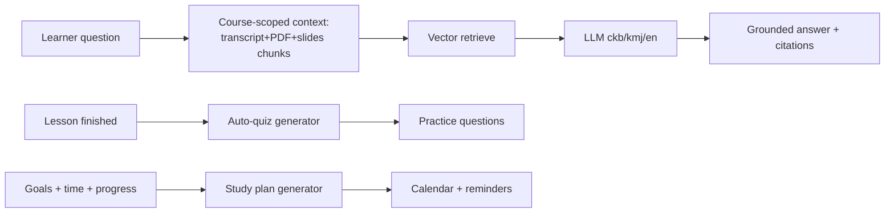
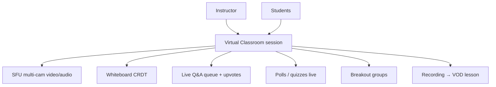
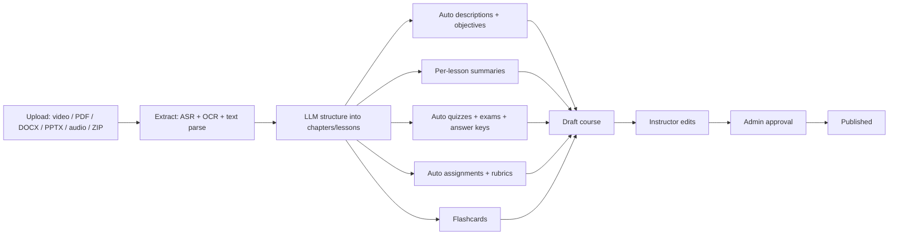
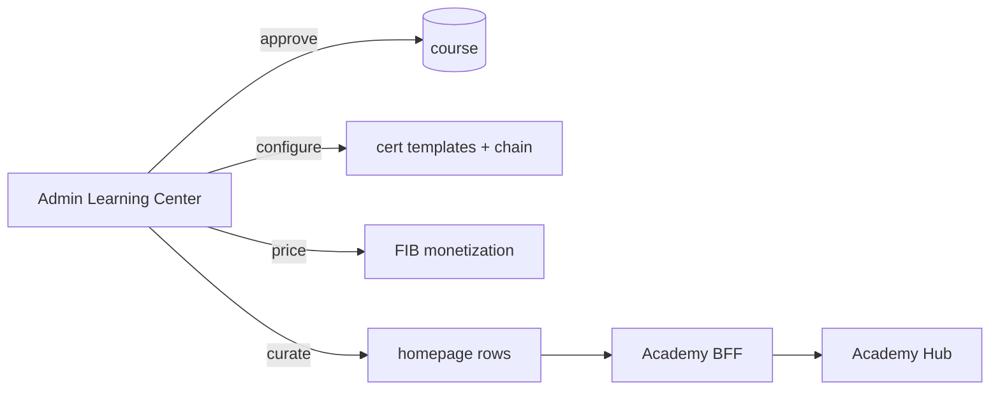

# 19 — Learning & Academy (ئەکادیمیا / فێربوون)

> **Scope:** ZanaCloud's **Learning Academy** — a full online-education vertical fusing **Udemy + Coursera + Skillshare + Khan Academy** into one experience with its own UI, recommendation engine, analytics, and pedagogical workflows. It is a *category-as-experience* surface (not a video page): structured courses, instructors, curricula, assignments/exams/quizzes/projects, certificates (incl. blockchain verification), interactive live classrooms, an AI tutor, and an AI course generator.
>
> **Foundation:** Built on the [Dynamic Category Experience System](./07-dynamic-category-system.md); reuses the platform [Video Processing](./08-video-processing.md), [Streaming](./09-streaming-infrastructure.md), [Live Streaming](./10-live-streaming.md), [Recommendations](./12-recommendation-engine.md), [Search](./11-search-engine.md), [Analytics](./21-analytics.md), [AI Systems](./13-ai-systems.md), and [Monetization](./23-monetization.md) (FIB) planes. Kurdish (Sorani + Kurmanji) is first-class throughout ([Kurdish Language Intelligence](./34-kurdish-language-intelligence.md)).
>
> **Non-negotiables honored here:** free-by-default (most courses free); **optional paid courses via FIB** (per-course, admin-toggled); admin-approval publishing for every course before it goes live; geo-fencing (country/region/city/ISP); Intranet/FTTH mode (school/university LANs, offline SCORM packages, local classrooms); device-specific UX (Mobile = bite-size lessons + vertical learning shorts; Desktop = full LMS; **TV = media-only — the Academy is hidden on TV unless an admin enables a lean "watch lessons" profile**); centralized no-code **Admin Learning Center**.
>
> **Sibling docs:** [Video Processing](./08-video-processing.md) · [Live Streaming](./10-live-streaming.md) · [Recommendations](./12-recommendation-engine.md) · [AI Systems](./13-ai-systems.md) · [Monetization](./23-monetization.md) · [Marketplace](./20-marketplace.md) · [Gaming](./18-gaming-ecosystem.md) · [Digital Library](./16-digital-library-knowledge-hub.md)

---

## 1. Product thesis & forces

| Force | Architectural consequence |
|---|---|
| **Structured pedagogy** (courses → chapters → lessons) | A normalized curriculum tree with ordering, prerequisites, and completion semantics — not a flat playlist. |
| **Multi-modal content** (video/audio/PDF/DOCX/PPTX/quizzes/projects) | A polymorphic **lesson-item** model; reuse video pipeline for video, document viewer for docs, dedicated assessment engine for quizzes/exams. |
| **Learning outcomes matter** | First-class **progress, mastery, and outcome tracking** (xAPI/SCORM-compatible), distinct from "watch %". |
| **Certificates have legal weight** | Verifiable certificates with **blockchain anchoring** for tamper-proof public verification. |
| **Interactive cohorts** | Live classrooms, whiteboards, live Q&A, student communities — reuse [Live Streaming](./10) + an SFU + collaborative canvas. |
| **AI as tutor & author** | An AI **learning assistant** (Q&A/summaries/quizzes/study plans) and an AI **course generator** (auto descriptions/exams/flashcards from uploads). |
| **Free-first, optional paid** | Enrollment is free unless a course is FIB-priced; the learning read path never depends on Billing. |
| **Kurdish-first** | Sorani/Kurmanji UI, subtitles, AI tutor, and a dedicated **Kurdish Courses** row. |
| **Intranet/FTTH** | Universities/schools run the Academy on a LAN: offline SCORM packages, local classrooms, deferred certificate anchoring. |

**Design principle:** the **Course aggregate** is the root. A lesson is "an item **in** a chapter **of** a course"; a certificate is "proof of completing **a** course"; analytics is "outcomes **per** enrollment **in** a course."

---

## 2. Information architecture



### 2.1 Device-specific rendering

| Device | Learning experience |
|---|---|
| **Mobile (TikTok-style)** | Bite-size lessons, vertical **Learning Shorts** (micro-lessons), offline download, swipe-through flashcards, push-reminders for study plan. |
| **Desktop/Web** | Full LMS: curriculum sidebar, lesson player + notes + AI tutor panel, assignments, discussion, whiteboard, dashboards. |
| **TV (media-only)** | **Hidden by default.** If admin enables "Academy on TV (lite)": play course *video lessons only* in a Netflix-like grid — no quizzes, no assignments, no checkout, no certificates. |

Device gating enforced at the **BFF** ([System Architecture §6.1](./02-system-architecture.md)) via signed `device_class`; TV routes register only when `admin_config.academy.tv_enabled = true`.

---

## 3. Homepage rows (canonical)

The Academy homepage is row-based, each row personalized by the learning recommendation model.

| Row | Source | Notes |
|---|---|---|
| **Featured** | editorial pin | admin-curated, geo-aware |
| **Trending** | reco `course.trending.v2` | enrollment velocity |
| **New** | recently approved courses | post-admin-approval |
| **Continue Learning** | per-learner feed (Cassandra) | resume point |
| **Programming** | category | code playground lessons |
| **AI / Machine Learning** | category | notebooks, GPU-backed labs (roadmap) |
| **Business** | category | |
| **Design** | category | |
| **Marketing** | category | |
| **Languages** | category | incl. Kurdish/English/Arabic |
| **Engineering** | category | |
| **Medical** | category | accredited tracks |
| **Kurdish Courses** | category (ckb/kmj) | strategic differentiator |

```json
{
  "page": "academy.home",
  "rows": [
    {"widget":"course_rail","title":{"ckb":"دیاریکراو","en":"Featured"},"source":"editorial"},
    {"widget":"course_rail","title":{"ckb":"بەناوبانگ","en":"Trending"},"model":"course.trending.v2"},
    {"widget":"continue_rail","title":{"ckb":"بەردەوامبوون","en":"Continue Learning"}},
    {"widget":"course_rail","title":{"ckb":"کۆرسە کوردییەکان","en":"Kurdish Courses"},"filter":{"lang":["ckb","kmj"]}}
  ],
  "geo_policy": {"mode":"ALLOW_LIST","countries":["IQ"]}
}
```

---

## 4. Domain model & database schemas

Postgres = write-side source of truth (courses, enrollments, ledger of progress events); ClickHouse = analytics read-side; Cassandra = per-learner feeds & event firehose; OpenSearch = course search; Object storage (MinIO/S3) = lesson assets & SCORM packages.

### 4.1 Course, curriculum, lessons

```sql
-- ====== ACADEMY (Postgres: learning schema) ======
CREATE TABLE instructor (
    id UUID PRIMARY KEY DEFAULT gen_random_uuid(),
    user_id UUID NOT NULL,
    display_i18n JSONB NOT NULL,
    bio_i18n JSONB,
    headline_i18n JSONB,
    avatar_url TEXT,
    expertise TEXT[] DEFAULT '{}',
    rating_avg NUMERIC(3,2) DEFAULT 0,
    rating_count INT DEFAULT 0,
    students_count INT DEFAULT 0,
    verified BOOLEAN DEFAULT FALSE
);

CREATE TABLE course (
    id UUID PRIMARY KEY DEFAULT gen_random_uuid(),
    slug TEXT UNIQUE NOT NULL,
    instructor_id UUID NOT NULL REFERENCES instructor(id),
    title_i18n JSONB NOT NULL,
    subtitle_i18n JSONB,
    description_i18n JSONB NOT NULL,
    objectives_i18n JSONB DEFAULT '[]',        -- ["Build X","Understand Y"]
    requirements_i18n JSONB DEFAULT '[]',
    target_audience_i18n JSONB DEFAULT '[]',
    category_id UUID NOT NULL,
    subcategory TEXT,
    languages TEXT[] NOT NULL DEFAULT '{ckb}', -- course language(s)
    subtitle_langs TEXT[] DEFAULT '{}',
    difficulty TEXT NOT NULL DEFAULT 'beginner', -- beginner|intermediate|advanced|all
    cover_url TEXT, promo_media_ref TEXT,       -- promo video friendly_token
    duration_seconds INT DEFAULT 0,             -- total video seconds (denormalized)
    lesson_count INT DEFAULT 0,
    -- monetization (optional, FIB)
    is_free BOOLEAN DEFAULT TRUE,
    price_minor BIGINT DEFAULT 0,               -- IQD minor units; 0 if free
    currency TEXT DEFAULT 'IQD',
    -- ratings & completion
    rating_avg NUMERIC(3,2) DEFAULT 0,
    rating_count INT DEFAULT 0,
    enrollment_count INT DEFAULT 0,
    completion_rate NUMERIC(5,2) DEFAULT 0,
    -- governance
    geo_policy JSONB NOT NULL DEFAULT '{"mode":"ALLOW_ALL"}',
    publication_state TEXT NOT NULL DEFAULT 'draft', -- draft|pending_review|approved|published|unlisted|rejected
    certificate_kind TEXT DEFAULT 'course',     -- course|professional|academic|none
    scorm_package_ref TEXT,                      -- optional SCORM/xAPI package in object storage
    created_at TIMESTAMPTZ DEFAULT now(),
    updated_at TIMESTAMPTZ DEFAULT now()
);
CREATE INDEX course_cat_idx ON course (category_id, publication_state);
CREATE INDEX course_lang_gin ON course USING GIN (languages);

CREATE TABLE chapter (
    id UUID PRIMARY KEY DEFAULT gen_random_uuid(),
    course_id UUID NOT NULL REFERENCES course(id) ON DELETE CASCADE,
    title_i18n JSONB NOT NULL,
    ordinal INT NOT NULL,
    UNIQUE (course_id, ordinal)
);

CREATE TABLE lesson (
    id UUID PRIMARY KEY DEFAULT gen_random_uuid(),
    chapter_id UUID NOT NULL REFERENCES chapter(id) ON DELETE CASCADE,
    title_i18n JSONB NOT NULL,
    ordinal INT NOT NULL,
    item_kind TEXT NOT NULL,    -- video|audio|pdf|docx|pptx|article|quiz|exam|assignment|project|scorm
    -- polymorphic payload:
    media_ref TEXT,             -- friendly_token (video/audio) into Media domain
    asset_url TEXT,             -- pdf/docx/pptx/zip in object storage
    article_i18n JSONB,         -- inline rich text article
    assessment_id UUID,         -- → assessment(id) for quiz/exam
    assignment_id UUID,         -- → assignment(id)
    duration_seconds INT DEFAULT 0,
    is_preview BOOLEAN DEFAULT FALSE,  -- free preview even on paid courses
    is_mandatory BOOLEAN DEFAULT TRUE, -- counts toward completion
    UNIQUE (chapter_id, ordinal)
);

CREATE TABLE course_review (
    id UUID PRIMARY KEY DEFAULT gen_random_uuid(),
    course_id UUID REFERENCES course(id) ON DELETE CASCADE,
    user_id UUID NOT NULL,
    rating SMALLINT CHECK (rating BETWEEN 1 AND 5),
    body_i18n JSONB,
    created_at TIMESTAMPTZ DEFAULT now(),
    UNIQUE (course_id, user_id)
);
```

### 4.2 Assessments (quizzes / exams) & assignments / projects

```sql
CREATE TABLE assessment (
    id UUID PRIMARY KEY DEFAULT gen_random_uuid(),
    course_id UUID REFERENCES course(id) ON DELETE CASCADE,
    kind TEXT NOT NULL,          -- quiz|exam
    title_i18n JSONB,
    pass_threshold NUMERIC(5,2) DEFAULT 60.0,
    time_limit_seconds INT,      -- null = untimed
    max_attempts INT DEFAULT 0,  -- 0 = unlimited
    shuffle BOOLEAN DEFAULT TRUE,
    ai_generated BOOLEAN DEFAULT FALSE
);
CREATE TABLE question (
    id UUID PRIMARY KEY DEFAULT gen_random_uuid(),
    assessment_id UUID REFERENCES assessment(id) ON DELETE CASCADE,
    kind TEXT NOT NULL,          -- single|multiple|true_false|fill_blank|short_answer|code
    prompt_i18n JSONB NOT NULL,
    choices_i18n JSONB,          -- [{id,text_i18n}]
    correct JSONB,               -- answer key (server-only, never sent to client)
    explanation_i18n JSONB,
    points NUMERIC(5,2) DEFAULT 1,
    ordinal INT
);
CREATE TABLE assessment_attempt (
    id UUID PRIMARY KEY DEFAULT gen_random_uuid(),
    assessment_id UUID REFERENCES assessment(id),
    enrollment_id UUID NOT NULL,
    started_at TIMESTAMPTZ DEFAULT now(),
    submitted_at TIMESTAMPTZ,
    score NUMERIC(5,2),
    passed BOOLEAN,
    answers JSONB                -- learner responses
);

CREATE TABLE assignment (
    id UUID PRIMARY KEY DEFAULT gen_random_uuid(),
    course_id UUID REFERENCES course(id) ON DELETE CASCADE,
    title_i18n JSONB, brief_i18n JSONB,
    kind TEXT DEFAULT 'assignment',  -- assignment|project
    rubric JSONB,                    -- criteria for grading (manual or AI-assisted)
    submission_kind TEXT DEFAULT 'file', -- file|text|url|repo
    due_at TIMESTAMPTZ
);
CREATE TABLE submission (
    id UUID PRIMARY KEY DEFAULT gen_random_uuid(),
    assignment_id UUID REFERENCES assignment(id),
    enrollment_id UUID NOT NULL,
    payload JSONB,                   -- {file_url|text|url}
    grade NUMERIC(5,2), feedback_i18n JSONB,
    graded_by UUID, graded_at TIMESTAMPTZ,
    status TEXT DEFAULT 'submitted'  -- submitted|graded|returned
);
```

### 4.3 Enrollment, progress, outcomes (xAPI-shaped)

```sql
CREATE TABLE enrollment (
    id UUID PRIMARY KEY DEFAULT gen_random_uuid(),
    course_id UUID NOT NULL REFERENCES course(id),
    user_id UUID NOT NULL,
    enrolled_at TIMESTAMPTZ DEFAULT now(),
    payment_ref TEXT,                -- FIB txn id if paid; null if free
    progress_pct NUMERIC(5,2) DEFAULT 0,
    completed_at TIMESTAMPTZ,
    last_lesson_id UUID,             -- resume point
    UNIQUE (course_id, user_id)
);
CREATE INDEX enrollment_user_idx ON enrollment (user_id);

-- Progress is an append-only event ledger (xAPI statement-shaped) → projects to progress_pct
CREATE TABLE learning_event (
    id BIGINT GENERATED ALWAYS AS IDENTITY PRIMARY KEY,
    enrollment_id UUID NOT NULL REFERENCES enrollment(id),
    lesson_id UUID,
    verb TEXT NOT NULL,              -- experienced|completed|passed|failed|answered|launched
    object_kind TEXT,                -- lesson|assessment|assignment|course
    result JSONB,                    -- {score, success, duration, position_seconds}
    occurred_at TIMESTAMPTZ DEFAULT now()
);
CREATE INDEX learning_event_enr_idx ON learning_event (enrollment_id, occurred_at);
```

> **SCORM / xAPI note:** the Academy is **xAPI-native** — every interaction is an xAPI-shaped statement (`actor, verb, object, result`) written to `learning_event` and mirrored to an internal **LRS** (Learning Record Store) projection in ClickHouse for analytics. **SCORM 1.2 / 2004** packages are supported for import/export: a `scorm` lesson item runs a sandboxed SCORM runtime (in an iframe with a JS API shim) that translates `cmi.*` calls into `learning_event` rows. This makes university/ministry SCORM content portable into ZanaCloud and lets ZanaCloud courses export as SCORM/xAPI for accreditation bodies — and crucially, **offline SCORM packages run fully in Intranet/FTTH mode**.

### 4.4 Certificates (incl. blockchain verification)

```sql
CREATE TABLE certificate (
    id UUID PRIMARY KEY DEFAULT gen_random_uuid(),
    enrollment_id UUID NOT NULL REFERENCES enrollment(id),
    course_id UUID NOT NULL,
    user_id UUID NOT NULL,
    kind TEXT NOT NULL,              -- course|professional|academic
    serial TEXT UNIQUE NOT NULL,     -- human-verifiable serial
    issued_at TIMESTAMPTZ DEFAULT now(),
    pdf_url TEXT,
    content_hash TEXT NOT NULL,      -- sha256 of canonical certificate JSON
    -- blockchain anchoring
    chain TEXT,                      -- e.g. 'polygon' | 'internal-poa' (Intranet)
    tx_hash TEXT,                    -- anchoring transaction (null until anchored)
    merkle_root TEXT,                -- batch anchoring root
    merkle_proof JSONB,              -- inclusion proof for this cert
    anchored_at TIMESTAMPTZ,
    revoked BOOLEAN DEFAULT FALSE
);
CREATE INDEX cert_serial_idx ON certificate (serial);
```



Public verification: `GET /verify/{serial}` recomputes `content_hash`, checks the Merkle inclusion proof against the on-chain `merkle_root` → tamper-proof. In **Intranet mode** an internal Proof-of-Authority chain (or deferred public anchoring on reconnect) provides the same guarantee air-gapped.

---

## 5. Course page & lesson player



**REST:**

```
GET  /api/v1/academy/courses/{slug}              → course + curriculum (locked lessons flagged)
POST /api/v1/academy/courses/{slug}/enroll       → free enroll | 402 needs_payment (→ FIB checkout)
GET  /api/v1/academy/lessons/{id}                → lesson payload (enrollment-gated; preview if is_preview)
POST /api/v1/academy/lessons/{id}/progress       { position_seconds, completed } (xAPI event)
POST /api/v1/academy/assessments/{id}/attempt    → start attempt
POST /api/v1/academy/attempts/{id}/submit        { answers } → graded result
POST /api/v1/academy/assignments/{id}/submit     { payload }
GET  /api/v1/academy/me/enrollments              → My Learning
GET  /api/v1/academy/me/certificates
```

Paid-course flow: `enroll` on a `is_free=false` course returns `402 needs_payment` with a checkout intent that routes to the **unified checkout** (see [Marketplace §11 Unified Commerce](./20-marketplace.md) and [Monetization](./23-monetization.md)). On `zc.billing.payment.settled.v1`, an enrollment is created. The lesson read path never blocks on Billing — a free preview always works.

---

## 6. AI Learning Assistant (tutor)

Reuses the [AI Systems](./13-ai-systems.md) GPU plane (vLLM/Triton) with course-scoped RAG; Kurdish-capable. Always async; never blocks playback.

| Capability | How |
|---|---|
| **Q&A on lessons** | RAG over the *current lesson + course materials* (transcripts, PDFs, slides) → grounded answers with citations to timestamps/pages. |
| **Summaries** | Per-lesson & per-chapter TL;DR in ckb/kmj/en. |
| **Auto-quiz** | Generate practice questions from a lesson the learner just watched. |
| **Concept explanation** | "Explain like I'm 5 / like an engineer" rewrites; analogies in Kurdish context. |
| **Study plans** | Personalized schedule from goals + available time + progress; pushed as reminders. |
| **Progress coaching** | Detects stalls ("you've paused on chapter 4 for 9 days") → nudges + remediation. |



```
POST /api/v1/academy/ai/ask        { lesson_id, question_i18n }    → SSE grounded answer
POST /api/v1/academy/ai/summarize  { lesson_id|chapter_id }        → summary
POST /api/v1/academy/ai/quiz       { lesson_id, count }            → questions
POST /api/v1/academy/ai/studyplan  { course_id, hours_per_week }   → plan
```

---

## 7. Interactive learning (live classrooms)

Reuses [Live Streaming](./10-live-streaming.md) (broadcast) + an **SFU** (LiveKit/mediasoup) for many-to-many video + a **collaborative whiteboard** (CRDT, e.g. Yjs).



| Feature | Tech | Intranet note |
|---|---|---|
| Live class (1→many) | LL-HLS broadcast ([./10](./10-live-streaming.md)) | local PoP ingest |
| Live Q&A / virtual classroom | SFU (WebRTC) | LiveKit on PoP |
| Whiteboard | CRDT (Yjs) over WS | local WS |
| Group discussions / student communities | forum (Cassandra-backed) + guild-like groups | local |
| Recording | session → VOD → becomes a lesson (after admin approval) | local store |

Schemas:

```sql
CREATE TABLE classroom_session (
    id UUID PRIMARY KEY DEFAULT gen_random_uuid(),
    course_id UUID REFERENCES course(id),
    instructor_id UUID, title_i18n JSONB,
    starts_at TIMESTAMPTZ, ends_at TIMESTAMPTZ,
    sfu_room_ref TEXT, broadcast_session_ref TEXT,
    whiteboard_doc_id TEXT,
    recording_media_ref TEXT,
    status TEXT DEFAULT 'scheduled'   -- scheduled|live|ended
);
CREATE TABLE student_group (
    id UUID PRIMARY KEY DEFAULT gen_random_uuid(),
    course_id UUID REFERENCES course(id),
    name_i18n JSONB, visibility TEXT DEFAULT 'cohort'
);
```

---

## 8. AI Course Generator (authoring)

Lets an instructor upload raw material and auto-produce course scaffolding. Output is always **draft → admin approval** before publishing.



```
POST /api/v1/academy/studio/generate
  { uploads:[asset_ref...], target:{language:"ckb", difficulty:"beginner"} }  → 202 job
GET  /api/v1/academy/studio/jobs/{id}   → { course_draft_id, status }
```

Generated quizzes mark `assessment.ai_generated = true`; instructors must review before publish (quality + accreditation gate). In Intranet mode, generation runs on PoP GPUs if present, else queues.

---

## 9. Content upload (instructor)

Reuses the platform [Upload Pipeline](./06-upload-pipeline.md) (tus, resumable, virus-scan) with learning-specific handling:

| Type | Pipeline |
|---|---|
| **Video** | tus → [Video Processing](./08-video-processing.md) → HLS ladder + ASR subtitles (ckb/kmj/en) |
| **Audio** | tus → audio transcode + ASR |
| **PDF / DOCX / PPTX** | virus-scan → OCR/text-extract (for search + AI tutor) → document viewer rendition |
| **ZIP package** | unpack → detect SCORM manifest (`imsmanifest.xml`) → register SCORM lesson, else treat as resource bundle |

All instructor uploads enter the **admin-approval** workflow before becoming a published lesson (constraint).

---

## 10. Learning analytics

Distinct from media analytics: outcome-centric. Fed by `learning_event` (xAPI) → ClickHouse LRS projection ([Analytics](./21-analytics.md)).

| Metric | For | Definition |
|---|---|---|
| **Progress %** | learner | mandatory lessons completed / total |
| **Completion rate** | instructor/admin | enrollments completed / total |
| **Engagement** | instructor | avg watch %, lesson dwell, return rate |
| **Quiz/exam scores** | learner/instructor | per-assessment distributions, pass rates |
| **Drop-off heatmap** | instructor | lesson where learners stall |
| **Outcomes** | admin/ministry | certificate issuance, mastery by objective |
| **Time-to-complete** | analytics | enroll → certificate distribution |

```sql
-- ClickHouse rollup (read-side)
CREATE TABLE learning.course_daily (
    course_id UUID, day Date,
    enrollments UInt32, completions UInt32,
    avg_progress Float32, avg_quiz_score Float32,
    watch_seconds UInt64, certificates UInt32
) ENGINE = SummingMergeTree() ORDER BY (course_id, day);
```

---

## 11. Admin Learning Center (no-code)

A tab in the centralized [Super Admin Panel](./33-platform-constraints.md).

| Section | Controls |
|---|---|
| **Course review** | Approve/reject submitted courses & AI-generated drafts; preview curriculum; require changes. |
| **Categories** | Manage Programming/AI-ML/Business/Design/Marketing/Languages/Engineering/Medical/Kurdish + custom; order & localize homepage rows. |
| **Instructors** | Verify instructors, set upload quotas, partner status. |
| **Monetization** | Toggle paid per-course, set FIB price/currency, revenue share, payout schedule (→ [Monetization](./23-monetization.md)). |
| **Certificates** | Configure templates (course/professional/academic), blockchain anchoring (chain, internal PoA for Intranet), revoke. |
| **Assessments** | Set platform pass-threshold defaults, anti-cheat (shuffle, time limits), proctoring toggle. |
| **Live classrooms** | Schedule, SFU limits, recording-to-VOD approval. |
| **Geo & device** | Course geo-fence; toggle `academy.tv_enabled`; Intranet/FTTH offline-package profile. |
| **Homepage builder** | Drag/drop the rows of §3. |



---

## 12. Events, capacity, cross-references

### 12.1 Domain events

| Event | Producer | Consumers |
|---|---|---|
| `zc.academy.course.approved.v1` | Admin/Academy | Search, Reco, Notification |
| `zc.academy.enrollment.created.v1` | Academy | Analytics, Reco, Notification |
| `zc.academy.lesson.completed.v1` | Academy | Analytics, Certificate engine |
| `zc.academy.assessment.passed.v1` | Academy | Certificate engine, Analytics |
| `zc.academy.course.completed.v1` | Academy | Certificate engine, Notification |
| `zc.academy.certificate.issued.v1` | Certificate | Notification, Analytics, (blockchain anchor batch) |
| `zc.academy.payment.settled.v1` | Billing(FIB) | Enrollment creation, Creator Economy |

### 12.2 Capacity

| Metric | Target |
|---|---|
| Catalog courses | 200,000 |
| Concurrent learners | 300,000 |
| Concurrent live-classroom participants | 60,000 (SFU) |
| xAPI events ingest | 80,000/s peak |
| AI tutor requests | 5,000/min (GPU pool) |
| Certificate issuance | 20,000/day (hourly Merkle batches) |

### 12.3 Cross-references

- Video transcode/HLS/subtitles for lessons: **[08 — Video Processing](./08-video-processing.md)**
- Live classroom broadcast spine: **[10 — Live Streaming](./10-live-streaming.md)**
- Course personalization & ranking: **[12 — Recommendation Engine](./12-recommendation-engine.md)**
- AI tutor & course generator compute: **[13 — AI Systems](./13-ai-systems.md)**
- Paid courses, revenue share, FIB payouts, unified checkout: **[23 — Monetization](./23-monetization.md)** · **[20 — Marketplace §11](./20-marketplace.md)**
- Outcome dashboards & LRS rollups: **[21 — Analytics](./21-analytics.md)**
- Kurdish subtitles/tutor/OCR: **[34 — Kurdish Language Intelligence](./34-kurdish-language-intelligence.md)**
- Course books/audiobooks integration: **[16 — Digital Library](./16-digital-library-knowledge-hub.md)**
