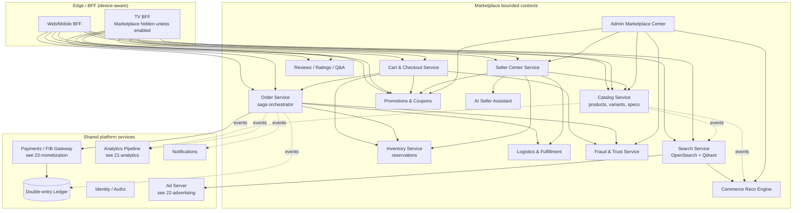
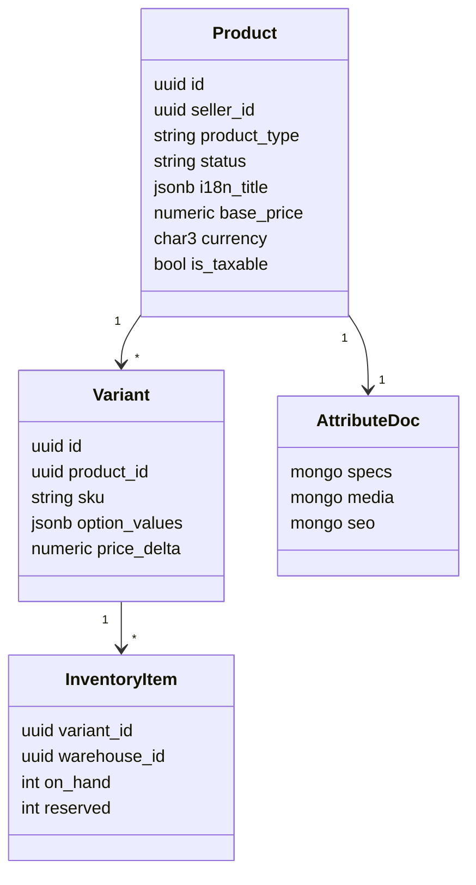
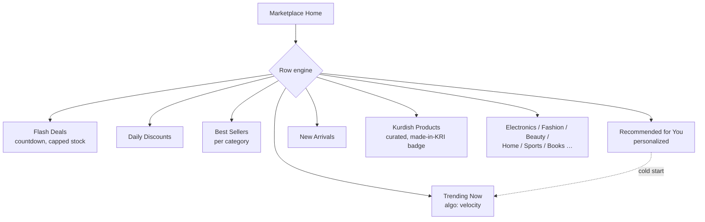
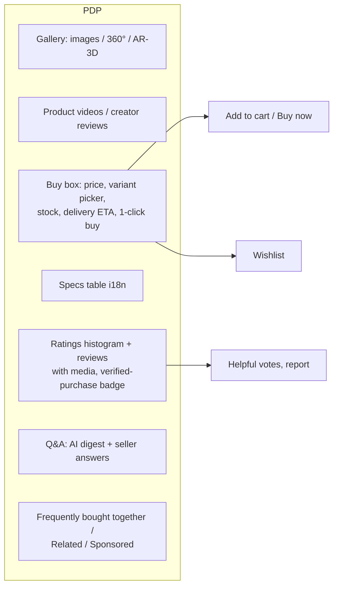
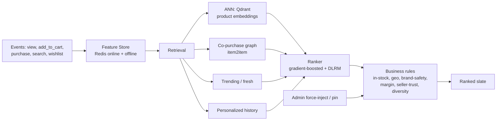
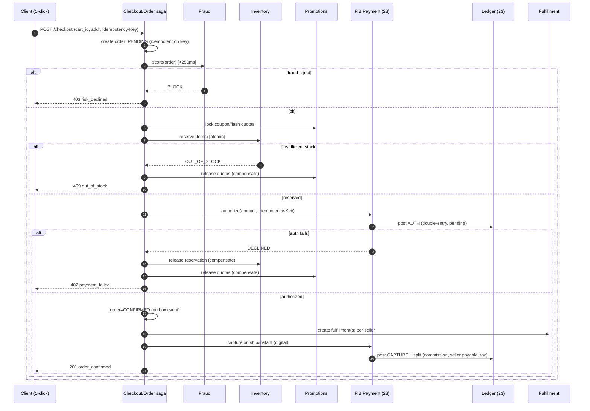
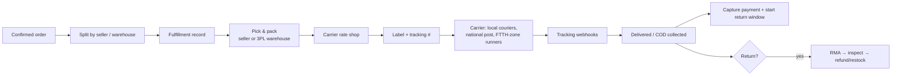
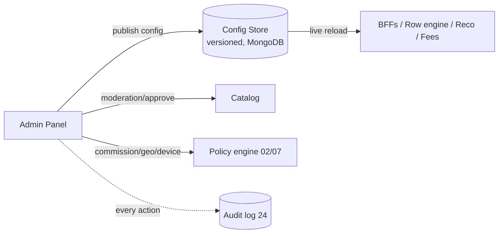
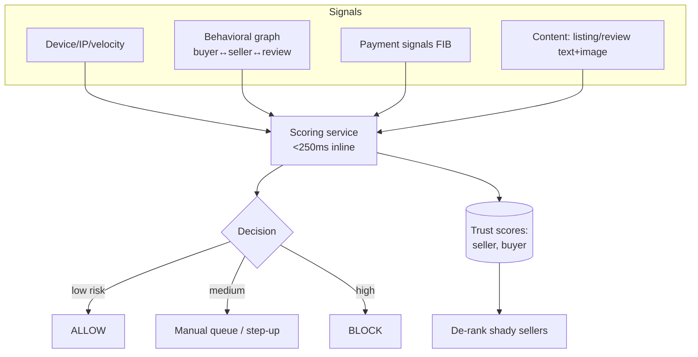
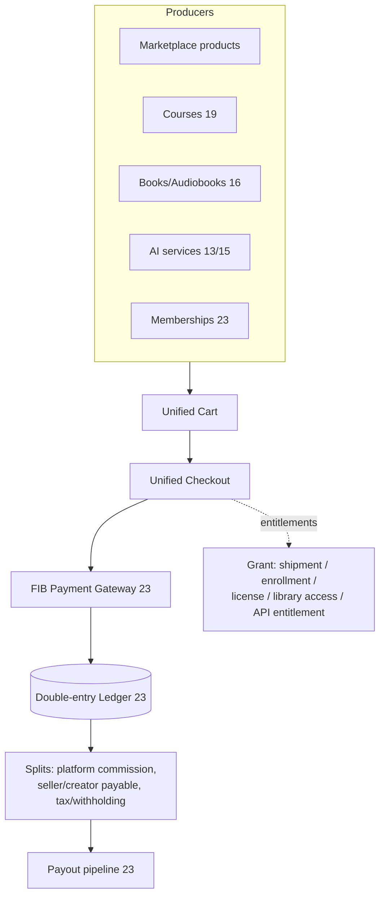

# 20 — Marketplace (Unified Commerce Platform)

> **Scope:** A national-scale, multi-seller **e-commerce marketplace** for **ZanaCloud** — fusing the depth of Amazon, the social/flash-deal energy of Trendyol, the maker spirit of Etsy, the regional fit of Noon, and the auction/long-tail of eBay — but with its **own ZanaCloud UI**, recommendation engine, search, analytics, and seller tooling. It sells **every commerce object** in the ecosystem: physical goods, digital downloads, courses, software/licenses, AI models, books & audiobooks, professional services, and subscriptions/memberships — all settling through **one unified checkout** on the **First Iraqi Bank (FIB)** rails.
>
> **Foundation:** Extends MediaCMS (Django + DRF + React, Postgres, Redis, Celery). The marketplace is a bounded context owning its own catalog, order, inventory, and fulfillment data, integrated only via API + Kafka events. Money never settles here — it settles in the ledger of [Monetization](./23-monetization.md).
>
> **Sibling docs:** [Product Vision](./01-product-vision.md) · [System Architecture](./02-system-architecture.md) · [Database Architecture](./05-database-architecture.md) · [Dynamic Category System](./07-dynamic-category-system.md) · [Learning Academy](./19-learning-academy.md) (courses) · [Digital Library](./16-digital-library-knowledge-hub.md) (books/audiobooks) · [Advertising](./22-advertising.md) (sponsored products) · [Monetization](./23-monetization.md) (FIB + ledger) · [Analytics](./21-analytics.md) · [Security](./24-security.md) (fraud) · [Kurdish Language Intelligence](./34-kurdish-language-intelligence.md)

---

## 1. Goals, principles & non-functional requirements

The Marketplace is a **first-class category** inside ZanaCloud's [Dynamic Category System](./07-dynamic-category-system.md), not a bolt-on. It inherits all platform non-negotiables: **free to browse/use**, monetization **optional and admin-controlled per category**, **admin-approval publishing**, **geo-fencing**, **Intranet/FTTH (offline) mode**, **device-specific UX** (Marketplace hidden on TV unless an admin enables it), and a **no-code Super Admin** surface.

| Principle | Consequence in design |
|---|---|
| **Free platform, optional monetization** | Browsing, search, wishlists, reviews, Q&A are always free. Selling fees, promotions, and ads are admin-toggled per region/category. A region can run a **0% commission** "national bazaar" mode. |
| **One ledger of truth** | Marketplace never holds balances. Every cent flows through the double-entry ledger in [Monetization §Ledger](./23-monetization.md). Orders reference ledger transactions by `idempotency_key`. |
| **Transactional integrity over convenience** | Order placement, inventory reservation, and payment authorization are a **saga** with compensations. No oversell, no double-charge, no orphan payment. |
| **Catalog is polyglot** | Structured order/inventory/ledger data in **Postgres**; flexible, schema-evolving product attributes in **MongoDB**; search in **OpenSearch**; embeddings in **Qdrant**; hot counters in **Redis**; events on **Kafka** (see [DB Architecture](./05-database-architecture.md)). |
| **Kurdish-first** | Titles, descriptions, specs, reviews, and search analyzers support **Sorani + Kurmanji** (Arabic & Latin scripts) plus Arabic/English. See [Kurdish Language Intelligence](./34-kurdish-language-intelligence.md). |
| **Admin omnipotence (no-code)** | Admins pin/promote/force-feature products, reorder homepage rows, gate categories per device/region, set commission, approve sellers/listings — all without deploys. |
| **Offline-capable** | On FTTH/intranet, the marketplace runs with local MinIO media, local search, **cash-on-delivery / FIB-on-LAN**, and a deferred-sync outbox. |

### 1.1 Non-functional targets

| Requirement | Target | Notes |
|---|---|---|
| Catalog scale | **50M SKUs**, 200k active sellers | Sharded catalog; MongoDB attribute docs |
| Search latency | p95 **< 120 ms** | OpenSearch + Redis facet cache |
| Product page TTFB | p95 **< 200 ms** | CQRS read model in Redis/Mongo |
| Checkout availability | **99.97%** | Saga + idempotent FIB calls |
| Order throughput | **8k orders/min** peak (flash sale 40k/min burst) | Reservation in Redis + Postgres confirm |
| Oversell rate | **0** | Atomic reservation, see §7 |
| Payment double-charge | **0** | Idempotency keys end-to-end (§9, [Monetization](./23-monetization.md)) |
| Fraud decision latency | **< 250 ms** inline | Pre-auth scoring (§13) |
| Recommendation freshness | events → reco **< 60 s** | Streaming features (§9 [Analytics](./21-analytics.md)) |

---

## 2. Bounded contexts & service map



Each context owns its tables and publishes domain events to Kafka (`marketplace.*`). Cross-context reads go through APIs or CQRS read models, never direct DB access — consistent with [System Architecture §5](./02-system-architecture.md).

---

## 3. Product model — every commerce object

The marketplace catalog is **polymorphic**. A `product` has a `product_type` discriminator; type-specific behavior (fulfillment, delivery, licensing, taxability) is resolved by a strategy registered per type.

| product_type | Examples | Fulfillment strategy | Settles via |
|---|---|---|---|
| `physical` | Electronics, fashion, home, Kurdish handmade | Warehouse/seller ship → carrier → tracking | FIB; payout on delivery+return-window |
| `digital` | Wallpapers, templates, music files, PSDs | Instant license/download grant | FIB; instant payout-eligible after fraud hold |
| `course` | Linked to [Learning Academy](./19-learning-academy.md) | Enrollment grant (LMS) | FIB; revenue-share to instructor |
| `software` | Apps, plugins, license keys | License key issuance / activation | FIB |
| `ai_model` | Fine-tunes, voices ([AI Dubbing](./15-ai-dubbing-studio.md)), prompt packs | API entitlement / model artifact grant | FIB; usage-metered option |
| `book` / `audiobook` | [Digital Library](./16-digital-library-knowledge-hub.md) | DRM/library grant or shipped print | FIB |
| `service` | Translation, design gigs, consulting | Booking + milestone escrow | FIB; escrow release |
| `subscription` | Seller storefront membership, content tiers | Recurring entitlement | FIB recurring ([Monetization](./23-monetization.md)) |



### 3.1 Core catalog DDL (Postgres — structured, transactional facets)

```sql
-- Sellers (storefronts). KYC/approval gated; see 24-security for verification.
CREATE TABLE mp_seller (
    id              UUID PRIMARY KEY DEFAULT gen_random_uuid(),
    owner_user_id   UUID NOT NULL REFERENCES app_user(id),
    legal_name      TEXT NOT NULL,
    display_name    TEXT NOT NULL,
    slug            CITEXT UNIQUE NOT NULL,
    country         CHAR(2) NOT NULL DEFAULT 'IQ',
    kyc_status      TEXT NOT NULL DEFAULT 'pending'   -- pending|verified|rejected|suspended
                    CHECK (kyc_status IN ('pending','verified','rejected','suspended')),
    commission_bps  INT  NOT NULL DEFAULT 800,         -- 8.00% default; admin-overridable per region/category
    trust_score     NUMERIC(5,2) NOT NULL DEFAULT 50,  -- maintained by fraud service
    payout_account  JSONB,                              -- FIB beneficiary ref (tokenized)
    status          TEXT NOT NULL DEFAULT 'active',
    created_at      TIMESTAMPTZ NOT NULL DEFAULT now()
);

-- Products. base_price is the canonical seller-set price; effective price computed with promotions.
CREATE TABLE mp_product (
    id              UUID PRIMARY KEY DEFAULT gen_random_uuid(),
    seller_id       UUID NOT NULL REFERENCES mp_seller(id),
    product_type    TEXT NOT NULL CHECK (product_type IN
                    ('physical','digital','course','software','ai_model','book','audiobook','service','subscription')),
    category_id     UUID NOT NULL,                      -- FK into dynamic category tree (07)
    i18n_title      JSONB NOT NULL,                     -- {"ckb":..,"kmr":..,"ar":..,"en":..}
    base_price      NUMERIC(14,2) NOT NULL CHECK (base_price >= 0),
    currency        CHAR(3) NOT NULL DEFAULT 'IQD',
    is_taxable      BOOLEAN NOT NULL DEFAULT TRUE,
    condition       TEXT DEFAULT 'new',                 -- new|used|refurbished (eBay-style)
    listing_mode    TEXT NOT NULL DEFAULT 'fixed'       -- fixed|auction|offer
                    CHECK (listing_mode IN ('fixed','auction','offer')),
    status          TEXT NOT NULL DEFAULT 'draft'       -- draft|in_review|approved|live|paused|delisted
                    CHECK (status IN ('draft','in_review','approved','live','paused','delisted')),
    mongo_doc_id    TEXT NOT NULL,                      -- pointer to attribute/media doc in MongoDB
    rating_avg      NUMERIC(3,2) DEFAULT 0,
    rating_count    INT DEFAULT 0,
    geo_policy_id   UUID,                               -- geo-fence ruleset (07/02)
    published_at    TIMESTAMPTZ,
    created_at      TIMESTAMPTZ NOT NULL DEFAULT now(),
    updated_at      TIMESTAMPTZ NOT NULL DEFAULT now()
);
CREATE INDEX ON mp_product (seller_id, status);
CREATE INDEX ON mp_product (category_id) WHERE status = 'live';

CREATE TABLE mp_variant (
    id              UUID PRIMARY KEY DEFAULT gen_random_uuid(),
    product_id      UUID NOT NULL REFERENCES mp_product(id) ON DELETE CASCADE,
    sku             TEXT NOT NULL,
    option_values   JSONB NOT NULL DEFAULT '{}',        -- {"color":"red","size":"M"}
    price_delta     NUMERIC(14,2) NOT NULL DEFAULT 0,
    barcode         TEXT,
    weight_g        INT,
    dims_mm         JSONB,
    UNIQUE (product_id, sku)
);

-- Auction listings (eBay long-tail). Bids are append-only; winner resolved at close.
CREATE TABLE mp_auction (
    product_id      UUID PRIMARY KEY REFERENCES mp_product(id),
    start_price     NUMERIC(14,2) NOT NULL,
    reserve_price   NUMERIC(14,2),
    buy_now_price   NUMERIC(14,2),
    ends_at         TIMESTAMPTZ NOT NULL,
    winner_user_id  UUID,
    state           TEXT NOT NULL DEFAULT 'open'        -- open|closed|cancelled
);
```

Flexible specs (huge, schema-evolving per category) live in MongoDB, keyed by `mongo_doc_id`:

```jsonc
// MongoDB: mp_product_doc
{
  "_id": "prd_doc_8812",
  "product_id": "…uuid…",
  "specs": { "screen": "6.7\" AMOLED", "ram_gb": 12, "battery_mAh": 5000 },
  "media": { "gallery": ["s3://…/1.webp", "…"], "videos": ["hls://…/demo.m3u8"], "ar3d": "model.glb" },
  "seo": { "ckb": {"slug": "telefon-…", "meta": "…"}, "keywords": ["…"] },
  "richDescription": { "ckb": "<html>…</html>", "en": "…" },
  "qa_summary": "AI-generated answer digest"
}
```

---

## 4. Marketplace homepage — admin-curated rows

The homepage is a **stack of rows**, each row a typed module bound to a data source. Admins reorder, toggle, pin, and geo/device-gate rows in the no-code panel (§12); the same row engine powers the rest of ZanaCloud's home surfaces ([Dynamic Category System §Layouts](./07-dynamic-category-system.md)).



| Row | Source | Refresh | Personalized | Admin controls |
|---|---|---|---|---|
| Trending Now | Streaming velocity score (views+adds+sales / decay) | 60 s | partial (geo) | pin, exclude |
| Flash Deals | `mp_campaign` type=flash, time-boxed, stock-capped | live | no | create, schedule, stock cap |
| Daily Discounts | `mp_coupon` auto-applied | daily | no | curate |
| Best Sellers | sales rank window (7d) per category | 15 min | by region | freeze rank |
| Recommended for You | Reco engine (§6) | per request | yes | force-inject SKUs |
| New Arrivals | `published_at desc` filtered approved | 5 min | no | feature |
| Kurdish Products | `made_in='KRI'` + handmade tag, editorial | manual+algo | light | full editorial |
| Category rails | category tree (07) | 5 min | light | order, hide per device |

Each row item is rendered from a **denormalized card read model** (Redis hash + Mongo doc) so the homepage never hits the transactional catalog on the hot path.

---

## 5. Product detail page (PDP)



- **Buy box** computes the **effective price** server-side: `base_price + variant.price_delta − promotions(coupon, flash, loyalty)`. It shows live stock (Redis), delivery ETA (Logistics §10), and the **one-click "Buy now"** that goes straight to FIB checkout with a saved address+wallet ([Monetization §One-Click](./23-monetization.md)).
- **Reviews** require a `verified_purchase` link to a fulfilled `mp_order_item`; this is the anchor for the fraud service's fake-review detection (§13).
- **Q&A** uses an AI digest (§8) that summarizes existing answers and routes new questions to the seller.
- **Related / Frequently-bought-together** and **Sponsored products** come from the reco engine (§6) and ad server ([Advertising](./22-advertising.md)), clearly labeled "Sponsored".

---

## 6. Smart recommendation engine (commerce)

A multi-stage retrieval→ranking pipeline, sharing infrastructure with the platform reco system but with commerce-specific signals (price sensitivity, basket affinity, margin, inventory, seller trust).



**Signals & objectives.** Retrieval candidates from (a) **embedding ANN** (title+image+category multimodal embeddings in Qdrant), (b) **co-purchase / co-view graph** (item2item), (c) **trending/fresh**, (d) **user history & affinities**. The ranker optimizes a blended objective: `p(purchase) × expected_margin × seller_trust × stock_health`, then business rules enforce **in-stock only**, **geo-eligibility**, **brand safety**, **diversity** (no single seller dominance), and **admin force-injection/pinning**.

**Cold start.** New users → trending + geo-popular + category-entry; new products → content-based embeddings + seller priors + a guaranteed exploration budget (epsilon-greedy) so fresh listings get impressions. See [Analytics §Feature pipeline](./21-analytics.md) for the streaming features that feed this within ~60 s.

---

## 7. Cart, checkout & the order saga

Order placement is the heart of transactional integrity: it must **reserve inventory without overselling**, **authorize payment exactly once**, **never double-charge**, and **roll back cleanly** on any failure. We model it as an **orchestration saga** with compensations, an **outbox** for events, and **idempotency keys** on every external effect.



### 7.1 Order & inventory DDL (saga + reservations + idempotency)

```sql
-- One customer order can fan out to multiple sellers → multiple fulfillments.
CREATE TABLE mp_order (
    id               UUID PRIMARY KEY DEFAULT gen_random_uuid(),
    buyer_user_id    UUID NOT NULL,
    state            TEXT NOT NULL DEFAULT 'pending'   -- pending|confirmed|partially_fulfilled|completed|cancelled|refunded
                     CHECK (state IN ('pending','confirmed','partially_fulfilled','completed','cancelled','refunded')),
    currency         CHAR(3) NOT NULL DEFAULT 'IQD',
    subtotal         NUMERIC(14,2) NOT NULL,
    discount_total   NUMERIC(14,2) NOT NULL DEFAULT 0,
    shipping_total   NUMERIC(14,2) NOT NULL DEFAULT 0,
    tax_total        NUMERIC(14,2) NOT NULL DEFAULT 0,
    grand_total      NUMERIC(14,2) NOT NULL,
    ship_address     JSONB NOT NULL,
    idempotency_key  TEXT NOT NULL,                     -- client/checkout-scoped
    payment_intent_id UUID,                             -- → 23-monetization payment
    created_at       TIMESTAMPTZ NOT NULL DEFAULT now(),
    UNIQUE (buyer_user_id, idempotency_key)             -- exactly-once order creation
);

CREATE TABLE mp_order_item (
    id              UUID PRIMARY KEY DEFAULT gen_random_uuid(),
    order_id        UUID NOT NULL REFERENCES mp_order(id) ON DELETE CASCADE,
    seller_id       UUID NOT NULL,
    variant_id      UUID NOT NULL,
    product_type    TEXT NOT NULL,
    qty             INT NOT NULL CHECK (qty > 0),
    unit_price      NUMERIC(14,2) NOT NULL,
    line_discount   NUMERIC(14,2) NOT NULL DEFAULT 0,
    line_total      NUMERIC(14,2) NOT NULL,
    commission_bps  INT NOT NULL,
    fulfillment_id  UUID
);

-- Inventory with optimistic reservation. on_hand never goes below reserved.
CREATE TABLE mp_inventory (
    variant_id      UUID NOT NULL,
    warehouse_id    UUID NOT NULL,
    on_hand         INT NOT NULL DEFAULT 0,
    reserved        INT NOT NULL DEFAULT 0,
    version         BIGINT NOT NULL DEFAULT 0,
    PRIMARY KEY (variant_id, warehouse_id),
    CHECK (reserved >= 0 AND reserved <= on_hand)
);

-- Reservation rows give every hold a TTL so abandoned carts self-heal.
CREATE TABLE mp_reservation (
    id              UUID PRIMARY KEY DEFAULT gen_random_uuid(),
    order_id        UUID NOT NULL,
    variant_id      UUID NOT NULL,
    warehouse_id    UUID NOT NULL,
    qty             INT NOT NULL,
    state           TEXT NOT NULL DEFAULT 'held'        -- held|committed|released|expired
                    CHECK (state IN ('held','committed','released','expired')),
    expires_at      TIMESTAMPTZ NOT NULL,
    UNIQUE (order_id, variant_id, warehouse_id)
);

-- Saga state machine (durable orchestration log).
CREATE TABLE mp_order_saga (
    order_id        UUID PRIMARY KEY REFERENCES mp_order(id),
    step            TEXT NOT NULL,                      -- fraud|reserve|authorize|confirm|capture|compensating|done|failed
    status          TEXT NOT NULL,                      -- started|succeeded|failed|compensated
    attempt         INT NOT NULL DEFAULT 0,
    last_error      TEXT,
    updated_at      TIMESTAMPTZ NOT NULL DEFAULT now()
);

-- Transactional outbox → Kafka (System Architecture §8).
CREATE TABLE mp_outbox (
    id              BIGSERIAL PRIMARY KEY,
    aggregate       TEXT NOT NULL,
    aggregate_id    UUID NOT NULL,
    event_type      TEXT NOT NULL,
    payload         JSONB NOT NULL,
    published       BOOLEAN NOT NULL DEFAULT FALSE,
    created_at      TIMESTAMPTZ NOT NULL DEFAULT now()
);
```

### 7.2 Atomic reservation (no oversell)

The reservation is a single `UPDATE` guarded by the check constraint; it is the only way `reserved` moves, so concurrent flash-sale buyers cannot oversell:

```sql
-- Returns 1 row if reservation succeeded, 0 if insufficient stock.
WITH upd AS (
  UPDATE mp_inventory
     SET reserved = reserved + :qty, version = version + 1
   WHERE variant_id = :variant AND warehouse_id = :wh
     AND on_hand - reserved >= :qty
  RETURNING variant_id
)
INSERT INTO mp_reservation(order_id, variant_id, warehouse_id, qty, expires_at)
SELECT :order, :variant, :wh, :qty, now() + interval '15 minutes'
FROM upd;
```

For **flash-sale hotspots** the counter lives in **Redis** (atomic `DECRBY` with a Lua guard) to absorb 40k/min bursts, then is reconciled into Postgres as the source of truth. A background sweeper expires `held` reservations past `expires_at`, restoring `reserved`.

**Idempotency & exactly-once.** The `UNIQUE(buyer_user_id, idempotency_key)` makes order creation exactly-once; the FIB `authorize/capture` calls carry the same key so a retried request returns the original payment, never a second charge (full treatment in [Monetization §9 Idempotency](./23-monetization.md)). The ledger postings are append-only and keyed by `(order_id, leg)`.

---

## 8. AI Seller Assistant

A copilot embedded in the Seller Center that turns a photo + a few words into a complete, optimized, multilingual listing — and then keeps optimizing it.

| Capability | Input → Output | Model/approach |
|---|---|---|
| **Description generation** | photos + bullet specs → rich i18n description (Sorani/Kurmanji/Arabic/English) | LLM with Kurdish fine-tune ([34](./34-kurdish-language-intelligence.md)) |
| **SEO optimization** | title/specs → keyword-rich title, meta, search synonyms | LLM + search-log mining |
| **Pricing suggestion** | category, competitor prices, demand, margin floor | regression + price-elasticity model |
| **Demand prediction** | history + seasonality + trends → 30/60/90-day forecast | time-series (gradient-boosted / Prophet-class) |
| **Campaign suggestions** | inventory + calendar → "run a flash deal on X" | rules + uplift modeling |
| **Listing optimization** | live CTR/conversion → A/B title/image/price tweaks | bandit experiments |
| **Q&A auto-answer** | buyer question + specs → draft answer (seller approves) | RAG over product doc |
| **Image cleanup** | raw photo → background removal, standardized aspect | vision pipeline |

The assistant is **suggestive, never autonomous on money/publish**: price changes and publishes still go through seller confirmation and admin approval (§12). All generations are logged for the **fake-listing / policy** checks in §13.

---

## 9. Logistics & fulfillment



### 9.1 Fulfillment & shipping DDL

```sql
CREATE TABLE mp_warehouse (
    id          UUID PRIMARY KEY DEFAULT gen_random_uuid(),
    seller_id   UUID,                                   -- NULL = platform/3PL warehouse
    name        TEXT NOT NULL,
    geo_point   GEOGRAPHY(POINT),
    region      TEXT, city TEXT,
    is_active   BOOLEAN DEFAULT TRUE
);

CREATE TABLE mp_fulfillment (
    id            UUID PRIMARY KEY DEFAULT gen_random_uuid(),
    order_id      UUID NOT NULL REFERENCES mp_order(id),
    seller_id     UUID NOT NULL,
    warehouse_id  UUID,
    carrier       TEXT,
    tracking_no   TEXT,
    state         TEXT NOT NULL DEFAULT 'created'       -- created|picking|shipped|in_transit|delivered|failed|returned
                  CHECK (state IN ('created','picking','shipped','in_transit','delivered','failed','returned')),
    cod           BOOLEAN NOT NULL DEFAULT FALSE,        -- cash-on-delivery (key for intranet/offline)
    eta           TIMESTAMPTZ,
    shipped_at    TIMESTAMPTZ,
    delivered_at  TIMESTAMPTZ
);

CREATE TABLE mp_return (
    id            UUID PRIMARY KEY DEFAULT gen_random_uuid(),
    order_item_id UUID NOT NULL REFERENCES mp_order_item(id),
    reason        TEXT NOT NULL,
    state         TEXT NOT NULL DEFAULT 'requested'      -- requested|approved|received|inspected|refunded|rejected
                  CHECK (state IN ('requested','approved','received','inspected','refunded','rejected')),
    refund_amount NUMERIC(14,2),
    restock       BOOLEAN DEFAULT TRUE,
    created_at    TIMESTAMPTZ DEFAULT now()
);
```

**Carrier abstraction.** A `ShippingProvider` interface (rate, label, track, cancel) has adapters for national post, local couriers, and FTTH-zone manual runners. **Delivery ETA** is computed from warehouse→destination distance, carrier SLA, and historical performance. **COD** is first-class because many Iraqi/Kurdistan buyers and the intranet/FTTH mode rely on cash; COD orders **capture into the ledger on delivery confirmation**, not at checkout.

**Returns (RMA)** drive a refund posting (reverse the capture leg) and a restock `UPDATE mp_inventory ... on_hand`. Return windows gate **creator/seller payout release** (§ payouts in [Monetization](./23-monetization.md)).

---

## 10. Discounts, campaigns & loyalty

| Mechanism | Table | Behavior |
|---|---|---|
| **Coupons** | `mp_coupon` | code or auto-apply; %, fixed, free-ship; stacking rules; per-user/global caps |
| **Flash sales** | `mp_campaign(type=flash)` | time-boxed, stock-capped, homepage countdown row |
| **Seasonal/seller campaigns** | `mp_campaign` | Newroz, Ramadan, back-to-school bundles |
| **Loyalty / reward points** | `mp_loyalty_ledger` | earn on purchase, redeem as discount; tiers (silver/gold) |
| **Bundles** | `mp_bundle` | "frequently bought together" priced kit |

```sql
CREATE TABLE mp_coupon (
    id            UUID PRIMARY KEY DEFAULT gen_random_uuid(),
    code          CITEXT UNIQUE,
    scope         TEXT NOT NULL,                         -- global|seller|category|product
    discount_type TEXT NOT NULL CHECK (discount_type IN ('percent','fixed','free_ship')),
    value         NUMERIC(14,2) NOT NULL,
    max_redemptions INT, per_user_limit INT DEFAULT 1,
    redeemed      INT NOT NULL DEFAULT 0,
    stackable     BOOLEAN DEFAULT FALSE,
    starts_at TIMESTAMPTZ, ends_at TIMESTAMPTZ,
    funded_by     TEXT NOT NULL DEFAULT 'seller'         -- seller|platform (who absorbs the discount in the ledger)
);

CREATE TABLE mp_campaign (
    id            UUID PRIMARY KEY DEFAULT gen_random_uuid(),
    seller_id     UUID, type TEXT NOT NULL,              -- flash|daily|seasonal
    title         JSONB, starts_at TIMESTAMPTZ, ends_at TIMESTAMPTZ,
    stock_cap     INT, claimed INT NOT NULL DEFAULT 0,
    state         TEXT NOT NULL DEFAULT 'scheduled'
);

CREATE TABLE mp_loyalty_ledger (        -- double-entry style: earned (+) / redeemed (-)
    id            BIGSERIAL PRIMARY KEY,
    user_id       UUID NOT NULL,
    order_id      UUID,
    points        INT NOT NULL,                          -- signed
    reason        TEXT NOT NULL,
    created_at    TIMESTAMPTZ DEFAULT now()
);
```

**Funding correctness:** every discount records `funded_by` so the ledger split correctly debits either the seller's payable or a platform-promo account — keeping seller payouts and platform P&L exact ([Monetization §Splits](./23-monetization.md)).

---

## 11. Search

OpenSearch index per locale with Kurdish analyzers (Sorani/Kurmanji normalization, ZWNJ handling, Arabic↔Latin transliteration — see [34](./34-kurdish-language-intelligence.md)), plus a Qdrant vector index for **semantic / "find similar"** and image search.

```
GET /api/v1/marketplace/search?q=mobîl&cat=electronics&min=100000&max=300000
    &sort=relevance&page=1&locale=ckb&geo=erbil
→ { results:[…cards…], facets:{ brand:[…], price_buckets:[…], rating:[…] },
    sponsored:[…], total: 12830, took_ms: 84 }
```

Ranking blends BM25 text relevance with **business boosts**: in-stock, seller trust, conversion rate, freshness, and admin pins. **Sponsored slots** are injected from the ad server and labeled ([Advertising](./22-advertising.md)). Facets are cached in Redis per (query, geo, device).

---

## 12. Admin Marketplace Center (no-code)

The Super Admin surface for the marketplace — all operations without deploys, consistent with the platform-wide no-code panel ([Dynamic Category System](./07-dynamic-category-system.md)).

| Panel | Admin can… |
|---|---|
| **Listings & approval** | review/approve/reject products, bulk moderation, force-delist |
| **Sellers** | KYC approve/suspend, set commission per seller/category/region |
| **Homepage rows** | add/reorder/toggle rows; pin/force-feature SKUs; geo/device gating |
| **Device & geo policy** | hide Marketplace on TV unless enabled; per-city/ISP availability |
| **Monetization toggles** | enable/disable commissions, fees, ads **per category/region**; 0% bazaar mode |
| **Campaigns** | create platform flash deals, seasonal events, fund platform coupons |
| **Fraud queue** | review flagged sellers/reviews/orders; manual block/allow |
| **Reco controls** | inject/pin/boost products in "Recommended" |
| **Payouts** | view/hold/release seller payouts; reconciliation dashboard |

All admin actions are written to the **audit log** ([Security](./24-security.md)) and emit Kafka events for analytics.



---

## 13. AI fraud & trust

Inline + offline detection across three risk surfaces, feeding a per-entity **trust score** and the checkout saga's pre-auth gate.



| Fraud type | Signals | Action |
|---|---|---|
| **Fake sellers** | KYC mismatch, burst listings, price too-good, image dup hash | block onboarding / hold payouts |
| **Fake reviews** | no verified purchase, text/embedding clusters, timing bursts, reviewer graph | remove, penalize seller trust |
| **Fraudulent transactions** | card/wallet velocity, mismatched geo, COD abuse, refund abuse | pre-auth block, step-up, FIB risk signals |
| **Listing abuse** | counterfeit/prohibited (vision+LLM classifiers) | auto-delist + admin queue |

The scoring service runs **inline** in the order saga (`< 250 ms`) returning allow/review/block, and **offline** to recompute trust scores nightly. High-risk decisions and overrides are auditable ([Security](./24-security.md)); reviews and sellers below a trust floor are de-ranked by reco/search.

---

## 14. Analytics for marketplace

Marketplace emits a typed event stream (`product_view`, `add_to_cart`, `purchase`, `refund`, `seller_metric`) into the platform pipeline ([Analytics](./21-analytics.md)), powering:

| Surface | Metrics |
|---|---|
| **Seller dashboard** | revenue, units, conversion, traffic sources, return rate, ad ROAS, inventory turns |
| **Admin dashboard** | GMV, take-rate, category mix, top sellers, fraud rate, refund rate |
| **Product analytics** | impressions→PDP→cart→purchase funnel, price experiments |
| **CLV / cohorts** | customer lifetime value, repeat-purchase cohorts, churn |

Revenue metrics are reconciled against the **ledger** as source of truth (exactly-once); engagement metrics tolerate at-least-once with idempotent dedup, matching the analytics contract.

---

## 15. REST API surface (selected)

```
# Catalog
GET    /api/v1/marketplace/products/{id}
GET    /api/v1/marketplace/products?category=&seller=&q=&page=
GET    /api/v1/marketplace/home?device=&geo=&locale=        # row-engine payload

# Cart & checkout
POST   /api/v1/marketplace/cart/items            {variant_id, qty}
POST   /api/v1/marketplace/checkout              {cart_id, address_id}  Header: Idempotency-Key
GET    /api/v1/marketplace/orders/{id}
POST   /api/v1/marketplace/orders/{id}/cancel
POST   /api/v1/marketplace/orders/{id}/returns   {item_id, reason}

# Seller Center
POST   /api/v1/seller/products                   # creates draft → in_review
PATCH  /api/v1/seller/products/{id}
POST   /api/v1/seller/products/{id}/submit       # → admin approval
GET    /api/v1/seller/orders?state=
POST   /api/v1/seller/fulfillments/{id}/ship     {carrier, tracking_no}
GET    /api/v1/seller/analytics/overview
POST   /api/v1/seller/assistant/generate         {kind:"description|seo|pricing", input}
POST   /api/v1/seller/coupons
POST   /api/v1/seller/campaigns

# Admin (no-code)
PATCH  /api/v1/admin/marketplace/sellers/{id}    {kyc_status, commission_bps}
POST   /api/v1/admin/marketplace/home/rows       # reorder/pin/feature
PATCH  /api/v1/admin/marketplace/policy          {device, geo, monetization_enabled}
GET    /api/v1/admin/marketplace/fraud/queue
POST   /api/v1/admin/marketplace/payouts/{id}/release
```

All write endpoints accept an **`Idempotency-Key`** header; all listing-affecting endpoints respect geo/device policy; all money paths defer to [Monetization](./23-monetization.md).

---

## 16. Offline / Intranet (FTTH) mode

On air-gapped FTTH deployments the marketplace runs fully on-prem:

- **Media** from local MinIO; **search** from local OpenSearch; **catalog** in local Postgres/Mongo.
- **Payments**: **COD** and **FIB-on-LAN** (if a local FIB endpoint is provisioned); otherwise orders settle via cash with ledger postings on delivery.
- **Sync**: an **outbox** queues catalog/order/analytics events; when a sync window opens, events replay to the central cluster with idempotency keys (no double-orders, no double-postings).
- **Device UX**: Marketplace hidden on TV by default; enabled per deployment by admins.

---

## 17. Unified commerce architecture (single FIB checkout)

The marketplace is one **producer of checkout intents** among many (courses, books, audiobooks, AI services, memberships). They all converge on **one cart, one checkout, one FIB payment, one ledger**.



A single cart can hold a phone, a Kurdish-language course, an audiobook, and an AI-voice pack; checkout produces **one FIB charge** and a **single ledger transaction** with per-line splits, then fans out **type-specific grants** (ship the phone, enroll in the course, unlock the audiobook, provision the AI entitlement). This is the commerce backbone detailed end-to-end in [Monetization](./23-monetization.md).

---

### Cross-references

[Product Vision](./01-product-vision.md) · [System Architecture](./02-system-architecture.md) · [Database Architecture](./05-database-architecture.md) · [Dynamic Category System](./07-dynamic-category-system.md) · [Digital Library](./16-digital-library-knowledge-hub.md) · [Learning Academy](./19-learning-academy.md) · [Analytics](./21-analytics.md) · [Advertising](./22-advertising.md) · [Monetization](./23-monetization.md) · [Security](./24-security.md) · [Kurdish Language Intelligence](./34-kurdish-language-intelligence.md)
