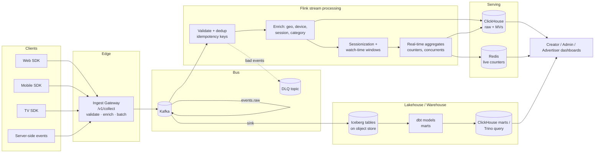
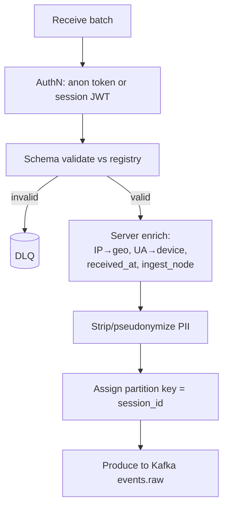
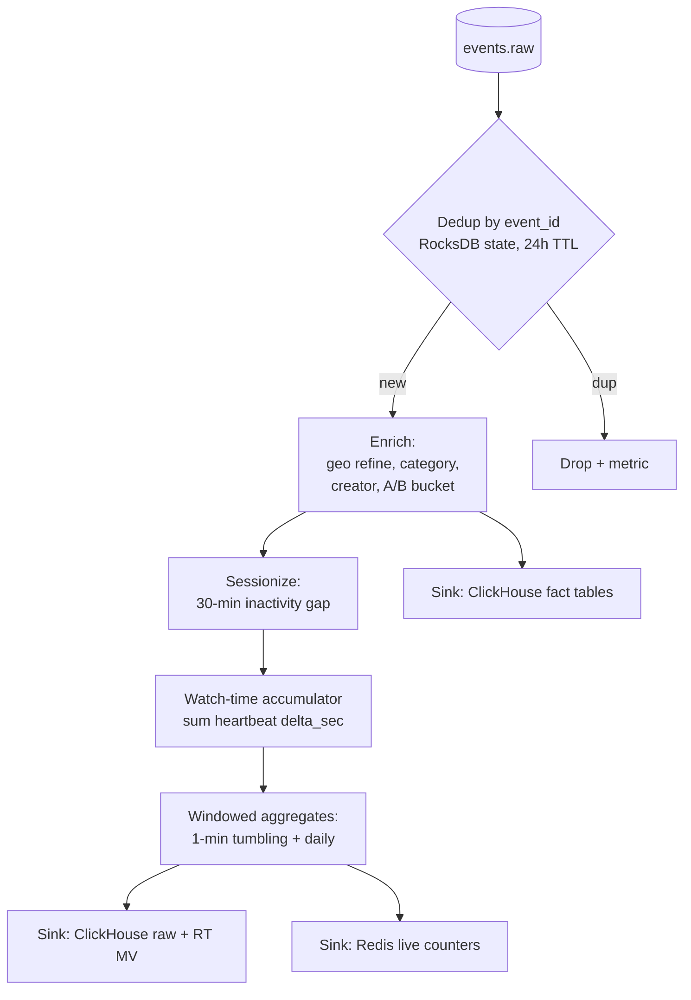
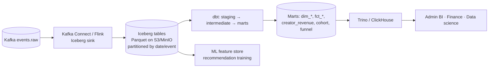
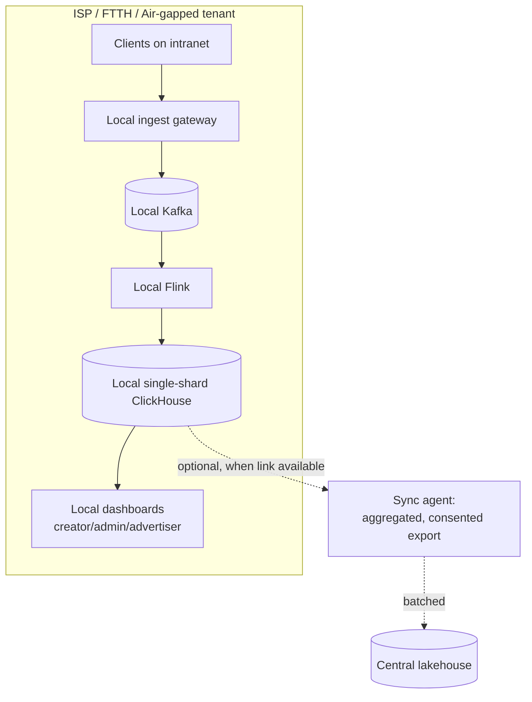

# 21 — Analytics Platform

> **Scope:** A YouTube-Analytics-class analytics platform for **ZanaCloud**: real-time and historical analytics for creators, admins, and advertisers; the full data-collection pipeline (client SDK → ingest gateway → Kafka → Flink stream processing → ClickHouse + lakehouse); the event taxonomy and schemas; ClickHouse physical design (tables, materialized views, partitioning, TTL, sharding/replication); the lakehouse/warehouse (Iceberg + dbt); the three audience-facing analytics surfaces; privacy & geo-compliance; and the **offline/intranet analytics mode** required for FTTH/air-gapped deployments.
>
> **Foundation:** Evolves MediaCMS's basic view/like counters into a national-scale event platform. See [System Architecture](./02-system-architecture.md) and [Database Architecture](./05-database-architecture.md).
>
> **Sibling docs:** [Product Vision](./01-product-vision.md) · [Advertising](./22-advertising.md) (consumes ad events) · [Monetization](./23-monetization.md) (revenue analytics source of truth) · [Platform Constraints](./33-platform-constraints.md) (intranet/geo)

---

## 1. Goals & non-functional requirements

| Requirement | Target | Rationale |
|---|---|---|
| Ingest throughput | **150k events/sec** sustained, 500k/sec peak | National scale, Shorts-heavy, high heartbeat rate |
| Real-time freshness | p95 **< 5 s** event→queryable (live dashboards) | Live concurrents, creator "going viral" view |
| Historical depth | **Raw 90 days** in ClickHouse; **forever** (aggregated) in lakehouse | Cost vs. compliance |
| Query latency (dashboards) | p95 **< 300 ms** on pre-aggregated; < 3 s ad-hoc | UX |
| Exactly-once for revenue metrics | **Yes** (revenue/ads counted once) | Money correctness ([Monetization](./23-monetization.md)) |
| At-least-once OK for engagement | Yes, with idempotent dedup | Cost vs. precision tradeoff |
| Offline/intranet mode | Full pipeline runs on-prem, no public internet | FTTH/gov deployments ([§9](#9-offlineintranet-analytics-mode)) |
| Privacy | PII pseudonymized; geo-compliant; consent-aware | [§8](#8-privacy--geo-compliance) |

---

## 2. End-to-end pipeline



**Two-speed design.** A *speed layer* (Kafka→Flink→ClickHouse/Redis) gives sub-5-second dashboards; a *batch layer* (Kafka→Iceberg→dbt) gives correct, reprocessable, forever-retained history. ClickHouse serves both real-time MVs and batch-built marts so dashboards hit one engine.

---

## 3. Client SDK & event collection

### 3.1 Collection contract

- **Transport:** HTTPS POST to `POST /v1/collect` (batched, gzip), `sendBeacon`/Fetch keepalive on web for unload-safe delivery; on intranet, same endpoint on the local ingest gateway.
- **Batching:** client buffers up to 50 events or 5 s, whichever first; flushes on visibility-change/unload.
- **Heartbeats:** playback emits `media_heartbeat` every **10 s** of active play (the watch-time backbone). This dominates volume (~60% of events).
- **Idempotency:** each event carries a client-generated `event_id` (UUIDv7) + `idempotency_key` (deterministic for revenue events) for exactly-once on critical metrics.
- **Offline buffering:** SDK persists events to IndexedDB / local store and replays on reconnect (essential for intranet/metered networks).

### 3.2 Ingest gateway responsibilities



Gateway is stateless, autoscaled (KEDA on Kafka lag + RPS). Partitioning by `session_id` keeps a session's events ordered on one partition for correct sessionization in Flink.

---

## 4. Event taxonomy & schema

### 4.1 Taxonomy

Events are namespaced `domain.object_action`. Domains: `media`, `discovery`, `social`, `commerce`, `ads`, `monetization`, `app`, `live`, `learn`, `library`.

| Event | Domain | Trigger | Volume class |
|---|---|---|---|
| `media.video_impression` | media | Card rendered in viewport | High |
| `media.video_start` | media | Playback begins | Medium |
| `media.media_heartbeat` | media | Every 10 s of active play | **Very high** |
| `media.video_complete` | media | ≥95% watched | Medium |
| `media.quality_change` | media | ABR switch | Low |
| `discovery.search` | discovery | Query submitted | Medium |
| `discovery.rec_impression` | discovery | Recommended item shown | High |
| `discovery.rec_click` | discovery | Recommended item clicked | Medium |
| `social.like` / `comment` / `share` / `subscribe` | social | User action | Medium |
| `ads.ad_request` / `ad_impression` / `ad_quartile` / `ad_click` / `ad_skip` | ads | Ad lifecycle | High |
| `monetization.purchase` / `tip` / `membership_start` / `payout` | monetization | Money event (exactly-once) | Low |
| `commerce.product_view` / `add_to_cart` / `order_placed` | commerce | Marketplace | Medium |
| `live.live_join` / `live_leave` / `super_chat` | live | Live session | Medium |
| `learn.lesson_progress` / `course_complete` / `quiz_submit` | learn | Academy | Low |
| `app.page_view` / `app_open` / `error` | app | App lifecycle | High |

### 4.2 Common envelope (every event)

```jsonc
{
  "event_id": "01902f3a-...-uuidv7",   // unique, dedup key
  "event_name": "media.media_heartbeat",
  "schema_version": 3,
  "occurred_at": "2026-06-07T10:15:30.123Z", // client time
  "received_at": "2026-06-07T10:15:30.420Z", // gateway time
  "idempotency_key": null,             // set for monetization/ads-billed
  // identity (pseudonymized)
  "user_pseudo_id": "u_8f3...",        // stable hashed id, salted
  "user_id": 123456,                   // null if anonymous
  "session_id": "s_2b9...",
  "is_authenticated": true,
  // context
  "device": { "type": "mobile", "os": "android", "app_ver": "4.2.0" },
  "geo": { "country": "IQ", "region": "Erbil", "city": "Erbil", "isp": "Newroz", "source": "ip" },
  "tenant_id": "public",               // or ISP/enterprise tenant
  "network_mode": "internet",          // internet | intranet | ftth
  "consent": { "analytics": true, "ads": true, "personalization": false },
  // payload (per event_name)
  "payload": { }
}
```

### 4.3 Example payloads

`media.media_heartbeat`:
```jsonc
"payload": {
  "media_id": 987654, "channel_id": 4321, "category_id": 12,
  "position_sec": 130, "delta_sec": 10, "playback_rate": 1.0,
  "quality": "720p", "is_fullscreen": false, "muted": false,
  "buffering_ms": 0, "source": "recommendation", "autoplay": true
}
```

`ads.ad_impression`:
```jsonc
"payload": {
  "ad_id": "cmp_55_cr_3", "campaign_id": 55, "placement": "preroll",
  "media_id": 987654, "category_id": 12, "auction_price_iqd": 18.0,
  "fill_source": "rtb", "viewable": true, "billed": true,
  "idempotency_key": "imp_cmp55_s2b9_987654_0"   // exactly-once billing
}
```

`monetization.purchase`:
```jsonc
"payload": {
  "order_id": "ord_88231", "item_type": "course", "item_id": 7781,
  "amount_iqd": 15000, "currency": "IQD", "fib_ref": "FIB-TX-...",
  "creator_id": 4321, "category_id": 19,
  "idempotency_key": "purchase_ord_88231"
}
```

### 4.4 Schema registry & evolution

- **Registry:** Avro/Protobuf schemas in a Schema Registry; gateway rejects unknown/invalid (→ DLQ). `schema_version` is mandatory.
- **Evolution rules:** additive only (new optional fields); breaking changes mint a new `event_name@vN`; consumers pin versions. dbt staging models normalize versions.

---

## 5. Stream processing (Flink)



| Flink job | Responsibility | Guarantee |
|---|---|---|
| `dedup-enrich` | Idempotent dedup (event_id), enrichment | At-least-once + dedup = effectively-once |
| `sessionizer` | Session windows, sequence numbering | Per-session ordered (session_id partition) |
| `watchtime` | Accumulate heartbeat deltas → watch_seconds | Watermarked, allowed lateness 2 min |
| `realtime-counters` | Concurrents, views/min, live viewers → Redis | Best-effort, low-latency |
| `revenue-exactly-once` | Ad/purchase billing aggregation | **Exactly-once** (Kafka txn + idempotency_key) |

**Exactly-once for money:** the revenue job uses Kafka transactions + ClickHouse insert dedup on `idempotency_key` (ReplacingMergeTree by key). Engagement jobs accept at-least-once with event_id dedup.

---

## 6. ClickHouse architecture

### 6.1 Cluster topology

- **Sharding:** by `cityHash64(user_pseudo_id)` → N shards (start 4, scale to 16+). Spreads load; keeps a user's events co-located for per-user queries.
- **Replication:** ReplicatedMergeTree, 2 replicas/shard, ZooKeeper/Keeper coordination.
- **Tiering:** hot (NVMe, 0–14 d) → warm (SSD, 15–90 d) → cold (object store via `s3` disk) via TTL `TO VOLUME`.
- **Tenancy/intranet:** per-tenant databases; intranet deployments run a single-shard ClickHouse locally (see [§9](#9-offlineintranet-analytics-mode)).

### 6.2 Raw fact table — playback heartbeats

```sql
CREATE TABLE analytics.fact_media_heartbeat ON CLUSTER zana
(
    event_date      Date            DEFAULT toDate(occurred_at),
    occurred_at     DateTime64(3)   CODEC(DoubleDelta, ZSTD(1)),
    received_at     DateTime64(3)   CODEC(DoubleDelta, ZSTD(1)),
    event_id        UUID,
    user_pseudo_id  String          CODEC(ZSTD(1)),
    user_id         Nullable(UInt64),
    session_id      String          CODEC(ZSTD(1)),
    media_id        UInt64,
    channel_id      UInt64,
    category_id     UInt32,
    position_sec    UInt32,
    delta_sec       UInt16,
    playback_rate   Float32,
    quality         LowCardinality(String),
    buffering_ms    UInt32,
    source          LowCardinality(String),   -- search|recommendation|channel|external
    autoplay        UInt8,
    device_type     LowCardinality(String),
    os              LowCardinality(String),
    country         LowCardinality(String),
    region          LowCardinality(String),
    city            LowCardinality(String),
    isp             LowCardinality(String),
    tenant_id       LowCardinality(String),
    network_mode    LowCardinality(String),
    ab_bucket       LowCardinality(String)
)
ENGINE = ReplicatedMergeTree('/clickhouse/{shard}/fact_media_heartbeat', '{replica}')
PARTITION BY toYYYYMMDD(event_date)
ORDER BY (category_id, media_id, occurred_at, user_pseudo_id)
TTL event_date + INTERVAL 14 DAY TO VOLUME 'warm',
    event_date + INTERVAL 90 DAY DELETE        -- raw dropped at 90d; lakehouse keeps forever
SETTINGS index_granularity = 8192, storage_policy = 'tiered';
```

### 6.3 Generic event sink (all non-heartbeat events)

```sql
CREATE TABLE analytics.fact_events ON CLUSTER zana
(
    event_date      Date DEFAULT toDate(occurred_at),
    occurred_at     DateTime64(3) CODEC(DoubleDelta, ZSTD(1)),
    event_id        UUID,
    event_name      LowCardinality(String),
    schema_version  UInt16,
    user_pseudo_id  String,
    user_id         Nullable(UInt64),
    session_id      String,
    category_id     UInt32,
    object_id       UInt64,            -- media/product/course/etc
    creator_id      UInt64,
    device_type     LowCardinality(String),
    country         LowCardinality(String),
    region          LowCardinality(String),
    isp             LowCardinality(String),
    tenant_id       LowCardinality(String),
    network_mode    LowCardinality(String),
    payload         String             -- JSON, queried via JSONExtract
)
ENGINE = ReplicatedMergeTree('/clickhouse/{shard}/fact_events', '{replica}')
PARTITION BY toYYYYMMDD(event_date)
ORDER BY (event_name, category_id, occurred_at)
TTL event_date + INTERVAL 90 DAY DELETE
SETTINGS storage_policy = 'tiered';
```

### 6.4 Revenue fact (exactly-once via ReplacingMergeTree)

```sql
CREATE TABLE analytics.fact_revenue ON CLUSTER zana
(
    event_date       Date,
    occurred_at      DateTime64(3),
    idempotency_key  String,           -- dedup key
    revenue_type     LowCardinality(String), -- ad|purchase|tip|membership|rental
    amount_iqd       Decimal(18,3),
    platform_cut_iqd Decimal(18,3),
    creator_id       UInt64,
    category_id      UInt32,
    object_id        UInt64,
    campaign_id      Nullable(UInt64),
    fib_ref          String,
    tenant_id        LowCardinality(String),
    version          UInt64            -- ingestion version for ReplacingMergeTree
)
ENGINE = ReplicatedReplacingMergeTree(
  '/clickhouse/{shard}/fact_revenue', '{replica}', version)
PARTITION BY toYYYYMM(event_date)
ORDER BY (idempotency_key)              -- dedup by money event identity
TTL event_date + INTERVAL 825 DAY;     -- ~27 months for tax/audit; lakehouse forever
```

> Revenue numbers shown to creators reconcile against the **ledger** in [Monetization](./23-monetization.md); ClickHouse is the *analytics* view, the ledger is the *financial source of truth*.

### 6.5 Real-time materialized views

```sql
-- 1) Per-video daily rollup: views, watch-time, completion, unique viewers
CREATE TABLE analytics.agg_video_daily ON CLUSTER zana
(
    event_date     Date,
    media_id       UInt64,
    channel_id     UInt64,
    category_id    UInt32,
    country        LowCardinality(String),
    device_type    LowCardinality(String),
    views          AggregateFunction(count),
    watch_seconds  AggregateFunction(sum, UInt64),
    completes      AggregateFunction(countIf, UInt8),
    uniq_viewers   AggregateFunction(uniq, String)
)
ENGINE = ReplicatedAggregatingMergeTree('/clickhouse/{shard}/agg_video_daily','{replica}')
PARTITION BY toYYYYMM(event_date)
ORDER BY (media_id, event_date, country, device_type)
TTL event_date + INTERVAL 1095 DAY;   -- 3y aggregated

CREATE MATERIALIZED VIEW analytics.mv_video_daily ON CLUSTER zana
TO analytics.agg_video_daily AS
SELECT
    event_date, media_id, channel_id, category_id, country, device_type,
    countState()                                AS views,
    sumState(toUInt64(delta_sec))               AS watch_seconds,
    countIfState(position_sec >= 1)             AS completes,
    uniqState(user_pseudo_id)                   AS uniq_viewers
FROM analytics.fact_media_heartbeat
GROUP BY event_date, media_id, channel_id, category_id, country, device_type;
```

```sql
-- 2) Audience retention curve (watch-time by relative position bucket)
CREATE TABLE analytics.agg_retention ON CLUSTER zana
(
    media_id     UInt64,
    bucket_pct   UInt8,                 -- 0..100, 1% granularity
    viewers      AggregateFunction(uniq, String),
    plays        AggregateFunction(count)
)
ENGINE = ReplicatedAggregatingMergeTree('/clickhouse/{shard}/agg_retention','{replica}')
ORDER BY (media_id, bucket_pct);

CREATE MATERIALIZED VIEW analytics.mv_retention ON CLUSTER zana
TO analytics.agg_retention AS
SELECT
    media_id,
    toUInt8(floor(position_sec / nullIf(duration_sec,0) * 100)) AS bucket_pct,
    uniqState(user_pseudo_id) AS viewers,
    countState()              AS plays
FROM analytics.fact_media_heartbeat
INNER JOIN analytics.dim_media USING (media_id)
GROUP BY media_id, bucket_pct;
```

```sql
-- 3) CTR/impression rollup for discovery & ads
CREATE MATERIALIZED VIEW analytics.mv_ctr_hourly ON CLUSTER zana
TO analytics.agg_ctr_hourly AS
SELECT
    toStartOfHour(occurred_at) AS hour, category_id, event_name, creator_id,
    countIf(event_name LIKE '%_impression') AS impressions,
    countIf(event_name LIKE '%_click')      AS clicks
FROM analytics.fact_events
WHERE event_name IN ('discovery.rec_impression','discovery.rec_click',
                     'ads.ad_impression','ads.ad_click')
GROUP BY hour, category_id, event_name, creator_id;
```

### 6.6 Querying aggregates

```sql
-- Retention curve for a video (creator dashboard)
SELECT bucket_pct,
       uniqMerge(viewers) AS viewers,
       viewers / max(viewers) OVER () AS retention_ratio
FROM analytics.agg_retention
WHERE media_id = 987654
GROUP BY bucket_pct ORDER BY bucket_pct;

-- Watch-time leaderboard, last 7d, a category
SELECT media_id,
       sumMerge(watch_seconds)/3600 AS watch_hours,
       countMerge(views) AS views,
       countMerge(completes)/countMerge(views) AS completion_rate
FROM analytics.agg_video_daily
WHERE category_id = 12 AND event_date >= today()-7
GROUP BY media_id ORDER BY watch_hours DESC LIMIT 50;
```

### 6.7 Dimension tables

`dim_media`, `dim_channel`, `dim_category`, `dim_geo`, `dim_campaign` are kept as `Dictionary`/`Join` tables synced from Postgres via CDC (Debezium → Kafka → ClickHouse), enabling fast joins and `dictGet` enrichment without cross-DB queries.

---

## 7. Lakehouse / warehouse



| Layer | Tech | Purpose |
|---|---|---|
| Raw landing | **Apache Iceberg** (Parquet, object store) | Immutable, replayable, schema-evolving, forever retention |
| Transform | **dbt** (staging→intermediate→marts) | Tested, version-controlled, documented models |
| Query | **Trino** + ClickHouse marts | Ad-hoc + serving |
| Orchestration | Airflow/Dagster | Scheduling, lineage, freshness SLAs |
| Catalog | Iceberg REST catalog + dbt docs | Discovery, lineage |

**Why Iceberg + dbt alongside ClickHouse:** ClickHouse is the speed/serving layer (90-day raw, 3-year aggregates); Iceberg is the durable, reprocessable system of record that survives schema changes and feeds ML training and finance. dbt builds reconciled marts (e.g., `fct_creator_revenue_daily`) that must tie out to the [Monetization](./23-monetization.md) ledger.

**Key marts:** `fct_watch_daily`, `fct_creator_revenue_daily`, `dim_user_consent`, `fct_funnel_signup`, `fct_cohort_retention`, `fct_ad_attribution`, `fct_marketplace_orders`.

---

## 8. Privacy & geo-compliance

| Control | Implementation |
|---|---|
| **Pseudonymization** | `user_pseudo_id = HMAC(salt, user_id|device_id)`; raw IP never stored, only derived geo. |
| **Consent-aware** | Every event carries `consent.{analytics,ads,personalization}`; Flink drops/limits processing when consent absent. |
| **PII minimization** | No names/emails/phones in the analytics plane; joins to PII only in governed warehouse with access controls. |
| **No PII to advertisers** | Advertiser analytics serve **aggregates only** (k-anonymity threshold, min cohort 50). See [Advertising §measurement](./22-advertising.md). |
| **Geo-residency** | Iraqi/Kurdish user data can be pinned to in-country/on-prem storage; tenant-scoped ClickHouse DBs. |
| **Retention** | Raw 90d (CH) / forever-aggregated (Iceberg); revenue 27 months hot for tax/audit. Right-to-erasure: tombstone + `ALTER TABLE DELETE` by `user_pseudo_id` + Iceberg row-level delete. |
| **Geo-fencing source** | Geo enrichment also feeds content geo-fencing decisions ([Platform Constraints](./33-platform-constraints.md)). |
| **Access control** | RBAC: creators see own data; advertisers see own campaigns; admins scoped by tenant; analysts via governed warehouse roles. |

---

## 9. Offline / intranet analytics mode

A non-negotiable constraint: analytics must work **fully offline** inside ISP/FTTH/air-gapped deployments with no public internet ([Product Vision §5.5](./01-product-vision.md)).



| Aspect | Offline behavior |
|---|---|
| **Self-contained stack** | Gateway + Kafka + Flink + ClickHouse packaged for on-prem (single-node profile available). |
| **No external calls** | Geo/UA enrichment uses bundled local datasets; no public SaaS in path. |
| **Local dashboards** | Creators/admins on the intranet get full real-time + historical views locally. |
| **Deferred sync** | When/if a link exists, a sync agent ships **aggregated, consented** rollups to central; raw stays local (sovereignty). |
| **Ads & monetization** | Ad impressions and FIB transactions are logged locally and reconciled on sync ([Advertising offline](./22-advertising.md), [Monetization](./23-monetization.md)). |
| **Clock/ordering** | Events buffered with monotonic seq; central merges idempotently by `event_id`. |

---

## 10. Three audience-facing analytics surfaces

| Surface | Audience | Headline metrics | Engine path |
|---|---|---|---|
| **Creator Analytics** | P1 creators | Views, watch-time, **retention curve**, CTR (thumbnail), traffic sources, subscribers Δ, revenue (ads/tips/memberships), top geos/devices, real-time last-48h | ClickHouse aggregates + Redis live |
| **Admin Analytics** | P9 admins | Platform DAU/MAU, per-category health, moderation/approval SLA, trending, geo/ISP breakdown, North-Star (Kurdish minutes), revenue diversity, abuse signals | ClickHouse + warehouse marts |
| **Advertiser Analytics** | P4 advertisers | Impressions, viewable rate, CTR, conversions, spend, pacing, **attribution** — all **aggregated** (k≥50) | ClickHouse ad MVs + attribution mart |

### 10.1 Representative REST API (creator)

```http
GET /api/v1/analytics/creator/videos/{media_id}/overview?range=28d
Authorization: Bearer <creator-jwt>
```
```jsonc
{
  "media_id": 987654, "range": "28d",
  "views": 482310, "watch_hours": 19044.5,
  "avg_view_duration_sec": 142, "avg_percentage_viewed": 38.6,
  "ctr": 0.071, "subscribers_gained": 1203,
  "top_traffic_sources": [
    {"source":"recommendation","views":301000},
    {"source":"search","views":98000},
    {"source":"channel","views":54000}],
  "top_geos": [{"country":"IQ","region":"Erbil","views":210000}],
  "revenue_iqd": {"ads": 412000, "tips": 88000, "memberships": 150000},
  "realtime": {"views_last_48h": 30122, "current_concurrents": 14}
}
```

```http
GET /api/v1/analytics/creator/videos/{media_id}/retention?range=28d
```
```jsonc
{ "media_id": 987654,
  "curve": [ {"pct":0,"retention":1.0}, {"pct":10,"retention":0.74},
             {"pct":50,"retention":0.41}, {"pct":100,"retention":0.22} ],
  "key_moments": [ {"pct":18,"type":"dip","note":"intro too long"},
                   {"pct":63,"type":"spike","note":"rewatched segment"} ] }
```

### 10.2 Real-time concurrents API (admin/live)

```http
GET /api/v1/analytics/realtime/concurrents?scope=category&category_id=18
```
Served from Redis (Flink-maintained), p95 < 50 ms.

---

## 11. Capacity & cost sketch

| Component | Sizing (national scale) |
|---|---|
| Events/day | ~10–13B (heartbeat-dominated) |
| Kafka | 12 brokers, RF=3, 7-day retention on `events.raw` |
| Flink | 40–80 task slots; RocksDB state for dedup/sessions |
| ClickHouse | 4→16 shards × 2 replicas, NVMe hot + object cold |
| Iceberg | Object store; Parquet+ZSTD; compaction nightly |
| Raw retention | CH 90d; Iceberg forever (aggregated rollups) |

---

## 12. Cross-references

| Topic | Document |
|---|---|
| Who consumes analytics (personas) | [01 — Product Vision](./01-product-vision.md) |
| Ad events, attribution, offline ad serving | [22 — Advertising](./22-advertising.md) |
| Revenue source-of-truth (ledger reconciliation) | [23 — Monetization](./23-monetization.md) |
| Kafka/event backbone, CDC, outbox | [02 — System Architecture](./02-system-architecture.md) |
| Datastores | [05 — Database Architecture](./05-database-architecture.md) |
| Geo-fencing, intranet/FTTH, Super Admin Panel | [33 — Platform Constraints](./33-platform-constraints.md) |
