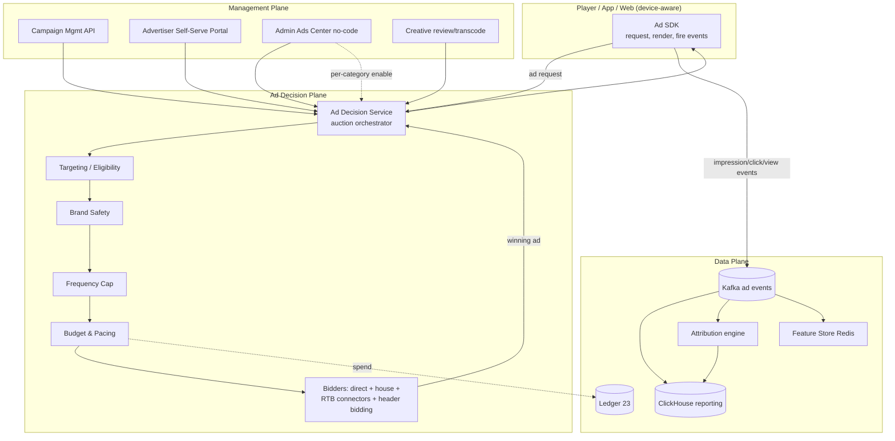
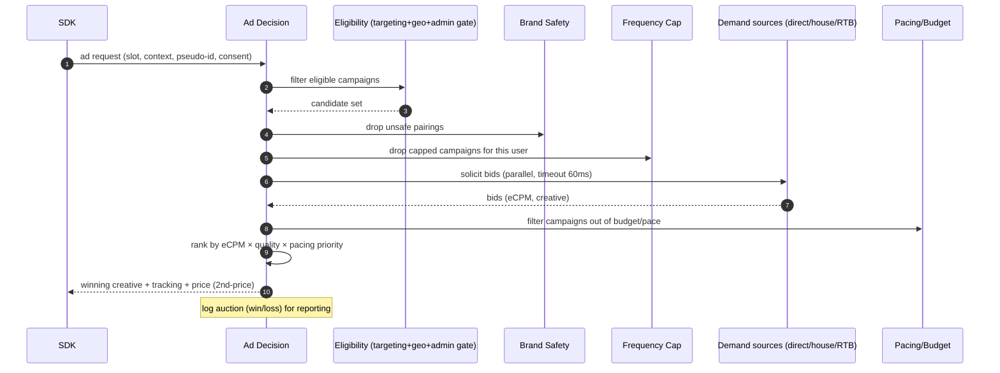
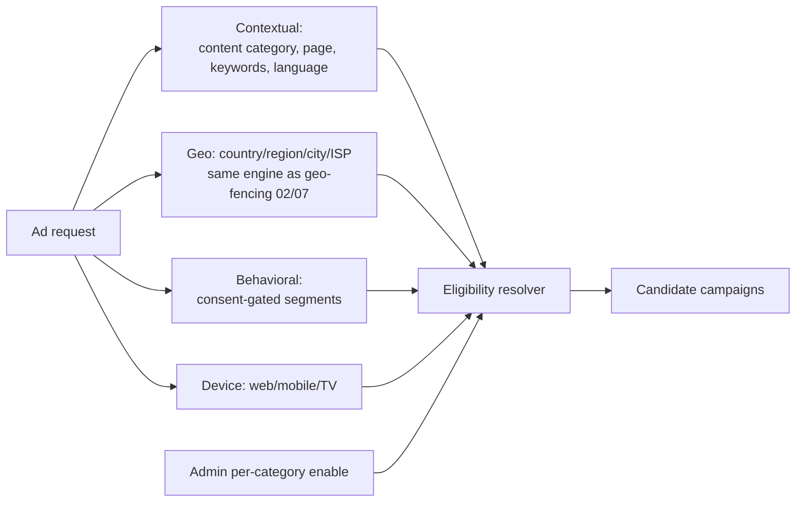
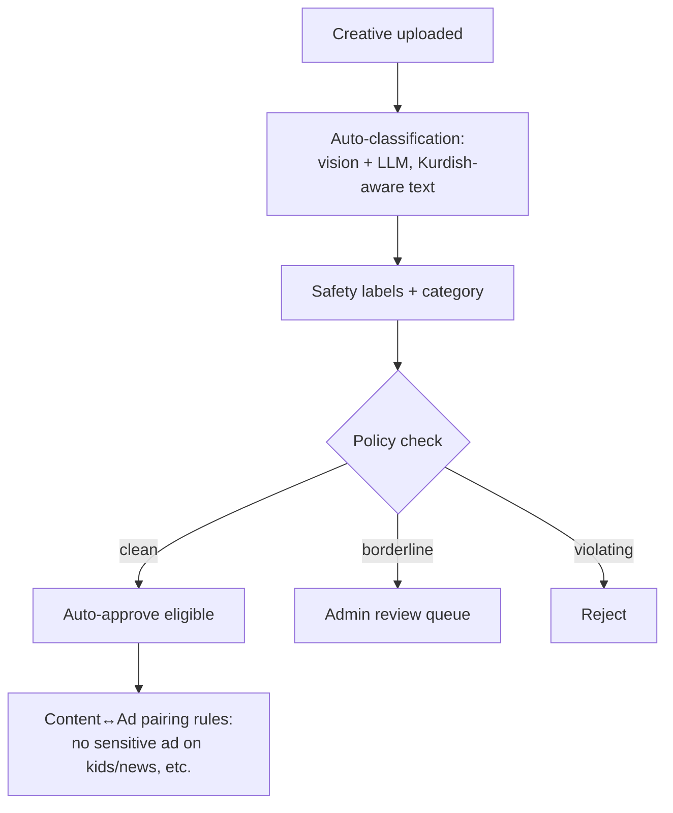
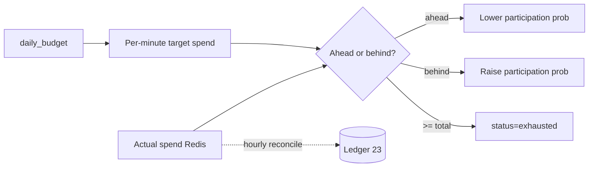
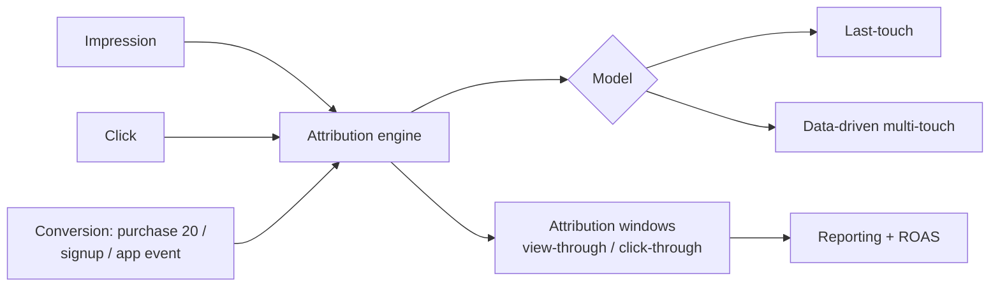
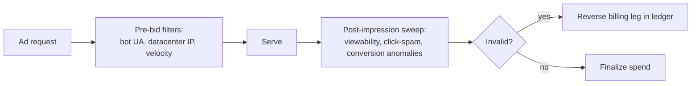
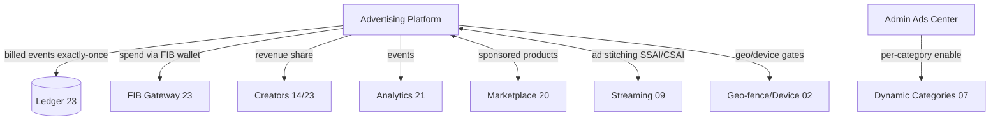

# 22 — Advertising Platform

> **Scope:** A complete, self-serve **ad ecosystem** for **ZanaCloud**: an **ad server** with a **real-time auction** (RTB / header-bidding concepts), targeting (contextual + behavioral + geo + category), **brand safety**, **frequency capping**, **budget & pacing**, full **campaign management**, **measurement & attribution**, and **privacy**. It supports every surface — video (pre/mid/post-roll), Shorts ads, display, sponsored cards, and **sponsored products** in the [Marketplace](./20-marketplace.md) — while honoring the platform's **free** posture: ads are **optional and admin-enabled per category/region/device**, never mandatory.
>
> **Foundation:** Built atop MediaCMS (Django + DRF + React, Postgres, Redis, Celery, Kafka). Ad billing settles through the same double-entry ledger as everything else ([Monetization](./23-monetization.md)); ad events flow through the [Analytics](./21-analytics.md) pipeline (exactly-once for billed events).
>
> **Sibling docs:** [Product Vision](./01-product-vision.md) · [System Architecture](./02-system-architecture.md) · [Database Architecture](./05-database-architecture.md) · [Dynamic Category System](./07-dynamic-category-system.md) (per-category enablement) · [Streaming Infrastructure](./09-streaming-infrastructure.md) (ad stitching) · [Marketplace](./20-marketplace.md) (sponsored products) · [Analytics](./21-analytics.md) (events/attribution) · [Monetization](./23-monetization.md) (FIB billing, ledger, payouts) · [Security](./24-security.md) (fraud/IVT) · [Kurdish Language Intelligence](./34-kurdish-language-intelligence.md)

---

## 1. Principles & non-functional requirements

| Principle | Consequence |
|---|---|
| **Free first, ads optional** | Users never pay; ads are an **optional** monetization lever, **admin-toggled per category/region/device**. A category can run **ad-free**; TV can be ad-free even if web is not. |
| **Admin-controlled, no-code** | Admins enable/disable formats, set floor prices, caps, and brand-safety policy per category/region without deploys ([Dynamic Category System](./07-dynamic-category-system.md)). |
| **Money correctness** | Every billable event is **exactly-once** and idempotent; spend reconciles to the ledger ([Monetization](./23-monetization.md)). No double-billing, no overspend past budget. |
| **Privacy by design** | Consent-aware; pseudonymous IDs; contextual fallback when behavioral consent is absent; geo-compliant. No selling raw PII. |
| **Creator revenue share** | Ad revenue on a creator's content shares to the creator per the revenue-share policy ([Monetization §Revenue Share](./23-monetization.md)). |
| **Offline/Intranet** | On FTTH/air-gapped deployments, ads run as **admin-booked direct campaigns** (no external RTB); pacing/serving fully local. |

### 1.1 NFR targets

| Requirement | Target |
|---|---|
| Ad decision latency (auction) | p95 **< 80 ms**, p99 < 120 ms |
| Decisioning throughput | **120k ad requests/sec** peak |
| Budget overspend | **≤ 0.5%** (pacing guardrails), hard cap enforced |
| Billable event correctness | **exactly-once** (dedup keys) |
| Invalid-traffic (IVT) filtration | inline pre-bid + post-impression sweep |
| Reporting freshness | near-real-time **< 60 s**; finalized (billed) hourly |

---

## 2. System architecture



The **decision plane** answers ad requests in real time; the **management plane** is where advertisers and admins create/govern campaigns; the **data plane** carries events to reporting, attribution, the feature store, and the ledger.

---

## 3. Ad formats

| Format | Surface | Pricing models | Admin gate |
|---|---|---|---|
| **Pre-roll** | video start | CPM, CPV (skippable after 5s) | per category/region |
| **Mid-roll** | long video cue points | CPM, CPV | per category, min duration |
| **Post-roll** | video end | CPM | per category |
| **Shorts ads** | between Shorts | CPM, CPV | per category/device |
| **Display / banner** | web/app slots | CPM, CPC | per surface |
| **Sponsored cards** | feed/home rows | CPC, CPM | per row |
| **Sponsored products** | [Marketplace](./20-marketplace.md) search/PDP | CPC, ACOS-target | per category |
| **Audio ads** | music/podcasts | CPM | per category |
| **Takeover / homepage** | direct-sold premium | flat/CPD | admin direct only |

**Video ad insertion** is via **SSAI (server-side ad stitching)** for live/CTV and **CSAI** for VOD where client control is acceptable, integrated with [Streaming Infrastructure](./09-streaming-infrastructure.md) (VAST/VMAP-style manifests adapted to ZanaCloud's HLS). Creatives are transcoded to the same ladder as content so ad-to-content transitions are seamless.

---

## 4. The auction (RTB / header-bidding concepts)

A unified auction blends **direct-sold (guaranteed)**, **house/promo**, and **open-market (RTB)** demand. Conceptually it borrows **header bidding**: multiple demand sources bid in parallel, and the ad server runs a **unified first-look/last-look** decision.



**Pricing.** Auctions clear at **second-price** (winner pays just above the runner-up) with **floor prices** per slot/category set by admins. **Guaranteed direct** deals get priority delivery with a minimum-impression commitment; remaining inventory goes to the open auction. **eCPM normalization** converts CPC/CPV bids to expected CPM using predicted CTR/VTR so all bid types compete fairly.

### 4.1 Decisioning DDL

```sql
CREATE TABLE ad_campaign (
    id            UUID PRIMARY KEY DEFAULT gen_random_uuid(),
    advertiser_id UUID NOT NULL REFERENCES ad_advertiser(id),
    name          TEXT NOT NULL,
    objective     TEXT NOT NULL,                  -- awareness|traffic|conversions|sales|app
    pricing_model TEXT NOT NULL CHECK (pricing_model IN ('cpm','cpc','cpv','cpa','cpd')),
    bid_amount    NUMERIC(14,2) NOT NULL,
    daily_budget  NUMERIC(14,2),
    total_budget  NUMERIC(14,2) NOT NULL,
    spent         NUMERIC(14,2) NOT NULL DEFAULT 0,   -- maintained transactionally vs ledger
    pacing        TEXT NOT NULL DEFAULT 'even'    -- even|asap
                  CHECK (pacing IN ('even','asap')),
    starts_at TIMESTAMPTZ, ends_at TIMESTAMPTZ,
    status        TEXT NOT NULL DEFAULT 'draft'   -- draft|in_review|approved|active|paused|exhausted|ended
                  CHECK (status IN ('draft','in_review','approved','active','paused','exhausted','ended')),
    geo_targets   JSONB,                          -- {country,region,city,isp}
    category_targets JSONB,                        -- category ids (07)
    audience      JSONB,                          -- behavioral segments (consent-gated)
    frequency_cap JSONB,                          -- {impressions, per, hours}
    brand_safety_level TEXT DEFAULT 'standard',
    created_at TIMESTAMPTZ DEFAULT now()
);

CREATE TABLE ad_creative (
    id            UUID PRIMARY KEY DEFAULT gen_random_uuid(),
    campaign_id   UUID NOT NULL REFERENCES ad_campaign(id),
    format        TEXT NOT NULL,                  -- video|display|sponsored_card|sponsored_product|audio
    asset_ref     TEXT,                           -- transcoded asset / HLS / image
    landing_url   TEXT,
    duration_s    INT,
    i18n          JSONB,                          -- ckb/kmr/ar/en copy
    review_status TEXT NOT NULL DEFAULT 'pending' -- pending|approved|rejected
                  CHECK (review_status IN ('pending','approved','rejected')),
    safety_labels JSONB
);

-- Hot pacing/cap counters live in Redis; this is the durable snapshot.
CREATE TABLE ad_pacing_state (
    campaign_id   UUID PRIMARY KEY REFERENCES ad_campaign(id),
    window_start  TIMESTAMPTZ NOT NULL,
    target_spend  NUMERIC(14,2) NOT NULL,
    actual_spend  NUMERIC(14,2) NOT NULL DEFAULT 0,
    updated_at    TIMESTAMPTZ DEFAULT now()
);
```

---

## 5. Targeting & eligibility



- **Contextual** (always available, privacy-safe): content category from the [Dynamic Category System](./07-dynamic-category-system.md), page keywords, **language (Sorani/Kurmanji/Arabic/English)** via [Kurdish Language Intelligence](./34-kurdish-language-intelligence.md).
- **Behavioral**: pseudonymous interest segments built in the analytics feature store — **only when consent is present**; otherwise the system **falls back to contextual**.
- **Geo**: reuses the platform geo-fence (country/region/city/ISP), so an advertiser can target Erbil-only or exclude an ISP.
- **Device**: respects device-UX rules (e.g., no Marketplace sponsored products on TV unless enabled).
- **Admin gate**: the per-category/region **ad enablement** flag is a hard precondition — if ads are off for a category, no campaign is eligible there.

---

## 6. Brand safety & creative review



Creatives are auto-classified (vision + Kurdish-aware text models) for prohibited/sensitive content; **content↔ad pairing** rules prevent unsafe adjacencies (e.g., no gambling ad on educational/kids content), with **brand-safety levels** (`strict|standard|relaxed`) per category set by admins. Borderline creatives route to a human queue; all decisions are audited ([Security](./24-security.md)).

---

## 7. Frequency capping & budget pacing

**Frequency capping** uses Redis sorted-sets/HLL keyed by `(pseudo_id, campaign)` with TTL windows (e.g., max 3 impressions / 24h). The cap check runs inline in the auction (`< 1 ms`), and is **eventually consistent across edges** (a tiny over-delivery is acceptable and bounded).

**Pacing** spreads `daily_budget` across the day (even pacing) or front-loads (ASAP). The pacing controller computes a per-minute target; a campaign that's ahead of pace is **probabilistically throttled** (bid into fewer auctions). When `spent ≥ total_budget`, the campaign flips to `exhausted` and is dropped from eligibility — the spend counter is reconciled against the ledger so we never bill past budget.



---

## 8. Billing, measurement & attribution

### 8.1 Exactly-once billable events

Every impression/click/view carries a **deterministic `idempotency_key`** (e.g., `imp_{campaign}_{auction}_{slot}`) — the same scheme used in [Analytics §Events](./21-analytics.md). The billing consumer dedups on this key in ClickHouse + a Redis seen-set, so a retried/duplicated beacon is counted **once**. Billed (charged) spend is posted to the ledger hourly with the key as the ledger leg's idempotency anchor — no double-billing even across retries or edge replays.

```jsonc
// Kafka: ads.impression
{
  "event": "ad_impression",
  "campaign_id": "cmp_55",
  "auction_id": "a_2b9",
  "creative_id": "cr_12",
  "slot": "preroll",
  "content_id": "vid_987",          // creator content → revenue share
  "geo": "erbil", "device": "web",
  "pseudo_id": "pid_…",
  "price_micros": 4200000,          // 2nd-price clearing, IQD micros
  "idempotency_key": "imp_cmp55_a2b9_preroll",  // exactly-once billing
  "ts": "2026-06-07T10:01:02Z"
}
```

### 8.2 Attribution



Conversions (notably **Marketplace purchases** from [§20](./20-marketplace.md)) are joined to prior impressions/clicks within configurable **view-through/click-through windows**. Supported models: **last-touch** (default) and **data-driven multi-touch**. Output feeds advertiser **ROAS/CPA** reporting and the marketplace's sponsored-product ACOS. Privacy: attribution joins on **pseudonymous IDs** only.

### 8.3 Reporting

Near-real-time dashboards (impressions, clicks, CTR, spend, VTR, conversions, ROAS) from ClickHouse (`< 60 s`), with **finalized billed** numbers reconciled hourly against the ledger so advertiser invoices and creator revenue-share are exact.

---

## 9. Advertiser self-serve portal & creator revenue share

**Self-serve portal** lets advertisers: create campaigns, upload/transcode creatives, set targeting/geo/budget/pacing/caps, submit for review, fund via **FIB wallet top-up** ([Monetization](./23-monetization.md)), and watch live reports. New advertisers and creatives pass **admin approval** (publishing gate) before serving.

**Creator revenue share.** When an ad serves on a creator's content (`content_id`), the cleared price splits per policy: platform fee + creator share + (optional) tax/withholding, posted to the ledger and paid out via the payout pipeline ([Monetization §Revenue Share / Payouts](./23-monetization.md)). Creators see ad RPM in their [Creator Studio](./14-creator-studio.md) / analytics.

```
POST /api/v1/ads/advertisers                       # onboard (KYC)
POST /api/v1/ads/campaigns                          # create → in_review
POST /api/v1/ads/campaigns/{id}/creatives          # upload, triggers review+transcode
POST /api/v1/ads/campaigns/{id}/submit              # → admin approval
POST /api/v1/ads/wallet/topup                       {amount}  Header: Idempotency-Key   # FIB
GET  /api/v1/ads/campaigns/{id}/report?from=&to=&granularity=hour
POST /api/v1/ads/decision                           # internal: SDK ad request
POST /api/v1/ads/events                             # impression/click/conv beacons (idempotent)
# Admin (no-code)
PATCH /api/v1/admin/ads/policy                       {category, region, device, ads_enabled, floor_cpm, brand_safety}
GET   /api/v1/admin/ads/review/queue
POST  /api/v1/admin/ads/campaigns/{id}/approve
```

---

## 10. Admin Ads Center (no-code) & per-category enablement

| Control | Effect |
|---|---|
| **Per-category/region/device ad enable** | hard gate on eligibility; can run categories/devices ad-free |
| **Floor prices** | min CPM/CPC per slot/category |
| **Format toggles** | enable/disable pre/mid/post-roll, Shorts ads, display, sponsored products |
| **Brand-safety policy** | strict/standard/relaxed; pairing rules |
| **Frequency cap defaults** | platform-wide caps |
| **Creative/campaign approval** | review queue, approve/reject |
| **Revenue-share %** | per-category creator share |
| **Direct/house campaigns** | book guaranteed/takeover/promo inventory |
| **Pacing guardrails** | overspend tolerance, hard caps |

All toggles are versioned config (live-reloaded, no deploy) and audited — same mechanism as the [Dynamic Category System](./07-dynamic-category-system.md) and the Admin Marketplace Center.

---

## 11. Privacy & compliance

- **Consent-aware**: behavioral targeting and cross-context attribution only with consent; otherwise **contextual-only** serving.
- **Pseudonymous IDs**: no raw PII in ad logs; IDs are rotated/salted; deletion requests purge segment membership.
- **Data minimization**: ad logs retain only what billing/measurement need; TTL'd in ClickHouse, aggregated long-term.
- **Geo-compliance**: serving and data residency respect Kurdistan/Iraq policy and the platform geo-fence.
- **Transparency**: every ad is labeled (Sponsored/Ad); an "ad info" affordance shows why it was shown.

---

## 12. Invalid traffic (IVT) & ad fraud



IVT filtering runs **pre-bid** (block obvious bots/datacenter traffic before they cost money) and **post-impression** (viewability, click-spam clustering, impossible conversion patterns). Detected invalid events are **credited back** by reversing the ledger leg (idempotent reversal), so advertisers are never billed for fraud. Shares signals with the platform fraud/trust service ([Security](./24-security.md), [Marketplace §13](./20-marketplace.md)).

---

## 13. Offline / Intranet (FTTH) mode

On air-gapped deployments there is **no open-market RTB**. Instead:

- Ads are **admin-booked direct/house campaigns** with local creatives (MinIO).
- Decisioning, pacing, frequency capping, and brand safety run **fully local**.
- Events queue in a local outbox; on a sync window they replay centrally with idempotency keys (no double-billing).
- Admins can run the deployment **completely ad-free** — the default for kids/education/government profiles.

---

## 14. Integration summary



The advertising platform is a **monetization option layered on a free product**: admins decide where (if anywhere) ads run, the auction maximizes value while respecting brand safety/privacy/caps/budget, every billable event is exactly-once and reconciled to the ledger, and creators share in the revenue their content generates.

---

### Cross-references

[Product Vision](./01-product-vision.md) · [System Architecture](./02-system-architecture.md) · [Database Architecture](./05-database-architecture.md) · [Dynamic Category System](./07-dynamic-category-system.md) · [Streaming Infrastructure](./09-streaming-infrastructure.md) · [Creator Studio](./14-creator-studio.md) · [Marketplace](./20-marketplace.md) · [Analytics](./21-analytics.md) · [Monetization](./23-monetization.md) · [Security](./24-security.md) · [Kurdish Language Intelligence](./34-kurdish-language-intelligence.md)
