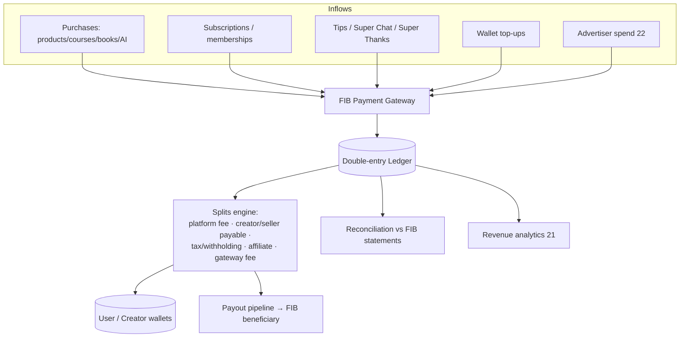
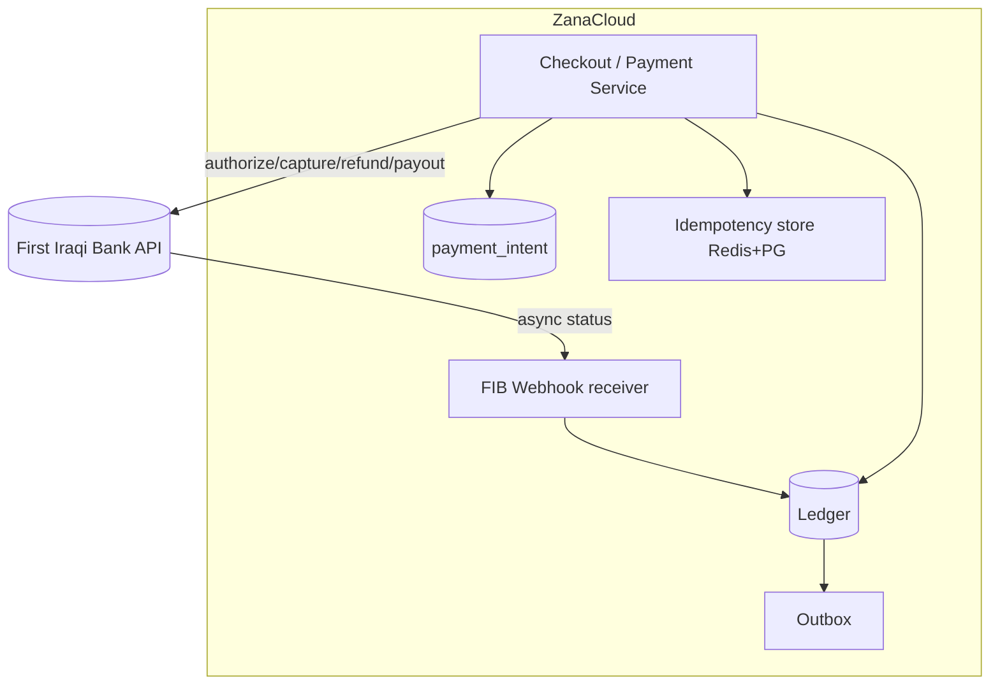
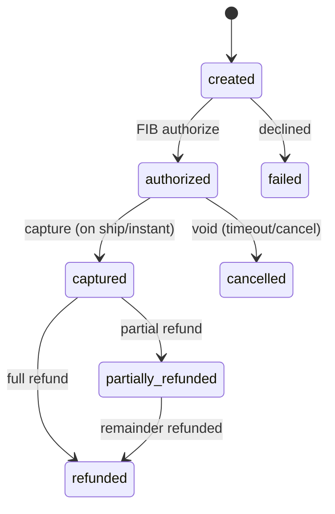
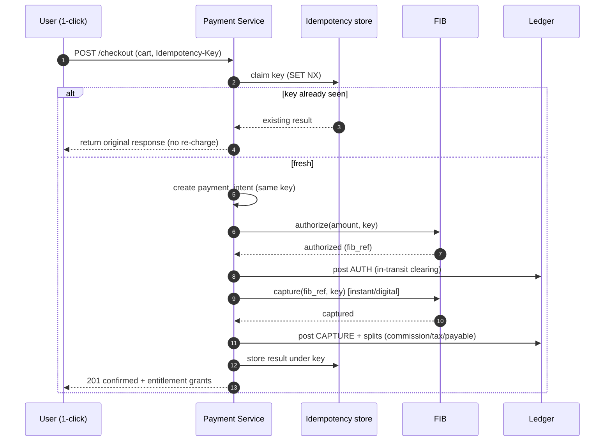
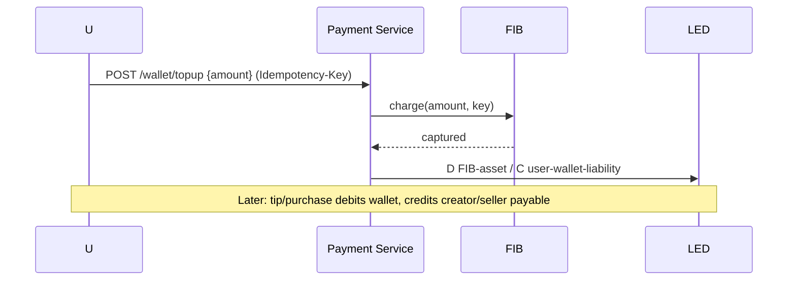
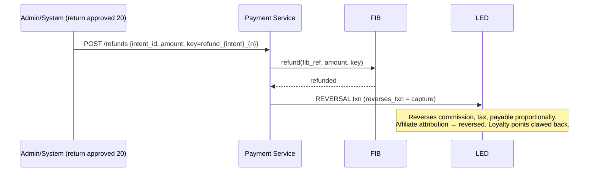
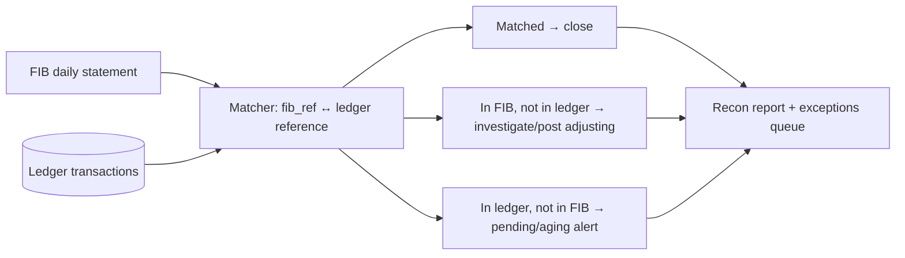
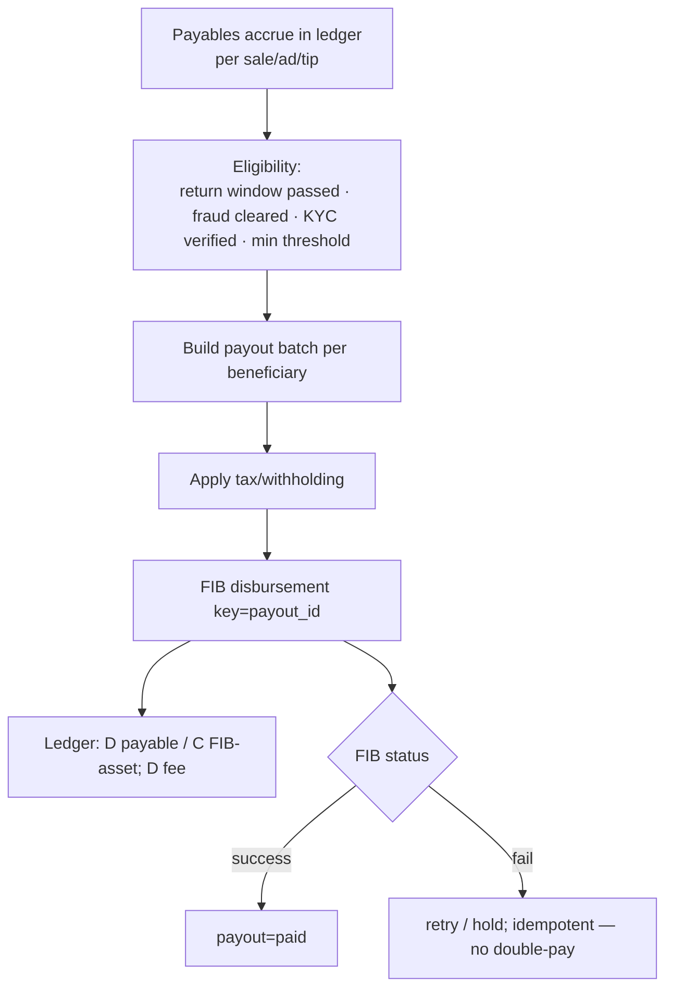
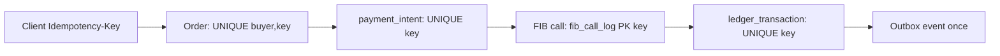
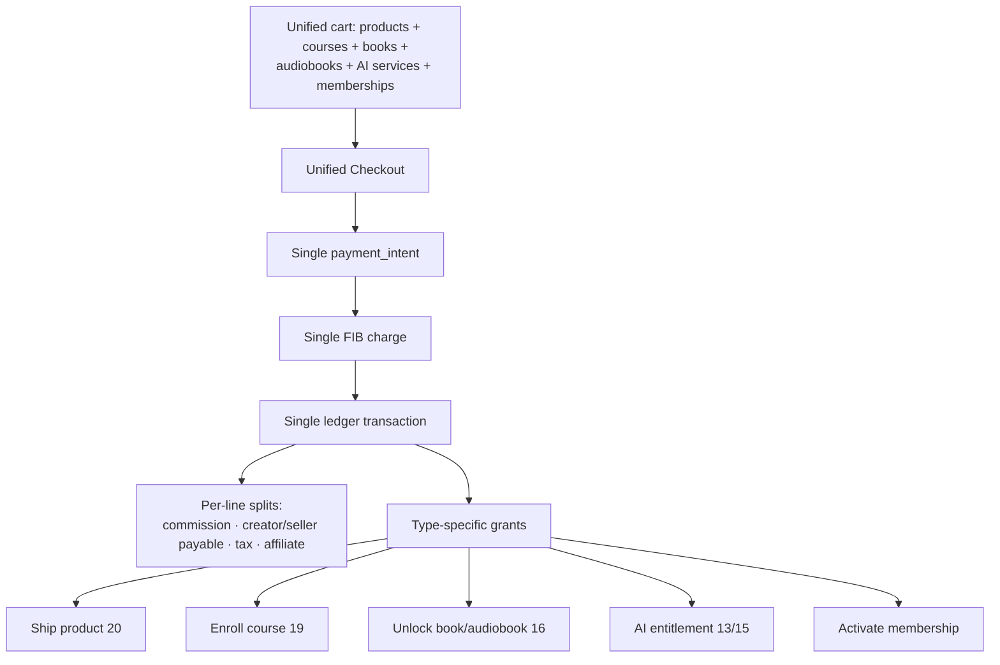

# 23 — Monetization & Payments (FIB, Ledger, Payouts)

> **Scope:** The money spine of **ZanaCloud** — **creator monetization** (revenue sharing, channel memberships, Super Chat / Super Thanks, sponsorships, affiliate, tips/wallet), **per-category paid content** (courses, books/audiobooks, marketplace, AI services), and the **payment architecture in depth** on the **First Iraqi Bank (FIB)** rails: one-click checkout, wallet top-up, subscriptions, refunds, **creator/seller payouts**, **reconciliation**, a **double-entry ledger**, **idempotency / exactly-once**, **fraud**, and **tax/withholding** — all behind **one unified checkout**.
>
> **Foundation:** Extends MediaCMS (Django + DRF + React, Postgres, Redis, Celery, Kafka). The ledger is the **single source of truth for money**; every other context (Marketplace, Ads, Academy, Library, AI) references it. Correctness is the prime directive: **exactly-once, idempotent, append-only, auditable**.
>
> **Sibling docs:** [Product Vision](./01-product-vision.md) · [System Architecture](./02-system-architecture.md) (sagas, outbox, idempotency) · [Database Architecture](./05-database-architecture.md) · [Backend Services §Ledger](./04-backend-services.md) · [Creator Studio](./14-creator-studio.md) · [Marketplace](./20-marketplace.md) · [Advertising](./22-advertising.md) · [Analytics](./21-analytics.md) (revenue metrics) · [Security](./24-security.md) (payment fraud) · [Learning Academy](./19-learning-academy.md) · [Digital Library](./16-digital-library-knowledge-hub.md)

---

## 1. Principles

| Principle | Consequence |
|---|---|
| **Free for end users** | No mandatory subscriptions. All monetization is **optional, per-category, admin-controlled**. A category/region can be **100% free** with zero payment surfaces. |
| **One ledger of truth** | Every cent — purchases, wallet, ads, payouts, refunds, tax — is a **double-entry** posting. Balances are **derived**, never stored authoritatively. |
| **Exactly-once money** | Every external money effect (FIB charge, payout) is guarded by an **idempotency key**. Retries never double-charge or double-pay. |
| **Append-only & auditable** | Ledger entries are immutable; corrections are **reversing entries**, never updates/deletes. Full audit trail ([Security](./24-security.md)). |
| **Single gateway: FIB** | First Iraqi Bank is the primary gateway, integrated **modularly** (per-category enable/disable) with one-click, wallet, subscriptions, refunds, payouts. |
| **Unified checkout** | One cart and one charge can span products, courses, books, audiobooks, AI services, and memberships; the ledger splits per line. |
| **Offline-capable** | On FTTH/intranet: COD / FIB-on-LAN / deferred settlement; outbox replays with idempotency keys. |

### 1.1 NFR targets

| Requirement | Target |
|---|---|
| Charge double-spend | **0** |
| Ledger imbalance | **0** (every transaction sums to zero) |
| Checkout success (p95 latency) | < 2.5 s end-to-end |
| Reconciliation lag (FIB ↔ ledger) | < 1 h, daily close exact |
| Payout accuracy | **100%**, idempotent, auditable |
| Refund correctness | exact reversal, idempotent |

---

## 2. Money map



---

## 3. Creator monetization

| Stream | Mechanism | Settles |
|---|---|---|
| **Revenue sharing** | ad RPM on content ([Advertising](./22-advertising.md)); split per category policy | ledger → creator payable |
| **Channel memberships** | recurring tiers (perks, badges, emotes) | FIB recurring → ledger |
| **Super Chat / Super Thanks** | paid highlighted messages in [Live](./10-live-streaming.md) / on videos | FIB one-tap → ledger |
| **Sponsorships** | brand↔creator deals, optionally escrowed via platform | escrow ledger |
| **Affiliate** | creator-attributed marketplace sales earn commission | attribution → ledger |
| **Tips / wallet** | one-tap tips from wallet balance | wallet → creator payable |
| **Paid content** | per-category: courses, books, audiobooks, premium videos, AI services | FIB → ledger → revenue-share |

```sql
CREATE TABLE creator_membership_tier (
    id          UUID PRIMARY KEY DEFAULT gen_random_uuid(),
    creator_id  UUID NOT NULL,
    name        TEXT NOT NULL,
    price       NUMERIC(14,2) NOT NULL,
    currency    CHAR(3) NOT NULL DEFAULT 'IQD',
    perks       JSONB, interval TEXT NOT NULL DEFAULT 'monthly'
);

CREATE TABLE creator_membership (
    id          UUID PRIMARY KEY DEFAULT gen_random_uuid(),
    tier_id     UUID NOT NULL REFERENCES creator_membership_tier(id),
    member_user_id UUID NOT NULL,
    subscription_id UUID NOT NULL,                  -- → billing_subscription
    state       TEXT NOT NULL DEFAULT 'active',
    started_at  TIMESTAMPTZ DEFAULT now()
);

CREATE TABLE super_message (        -- Super Chat / Super Thanks
    id          UUID PRIMARY KEY DEFAULT gen_random_uuid(),
    from_user   UUID NOT NULL, to_creator UUID NOT NULL,
    context     TEXT NOT NULL,                      -- live|video
    context_id  UUID NOT NULL,
    amount      NUMERIC(14,2) NOT NULL,
    message     TEXT,
    ledger_txn_id UUID NOT NULL,
    created_at  TIMESTAMPTZ DEFAULT now()
);

CREATE TABLE affiliate_attribution (
    id          UUID PRIMARY KEY DEFAULT gen_random_uuid(),
    creator_id  UUID NOT NULL, order_id UUID NOT NULL,
    commission_bps INT NOT NULL, amount NUMERIC(14,2) NOT NULL,
    state       TEXT NOT NULL DEFAULT 'pending'     -- pending|confirmed|reversed (on refund)
);
```

Every monetization stream is **admin-enableable per category** — admins can switch off memberships in one category while leaving tips on in another.

---

## 4. The double-entry ledger (heart of the system)

**Every financial event is a transaction of ≥2 entries (debits = credits).** Accounts are typed; balances are computed by summing entries. Nothing is ever updated or deleted — corrections are reversing transactions.

### 4.1 Account model

| Account class | Examples | Normal balance |
|---|---|---|
| **Asset** | FIB settlement account, gateway-in-transit | debit |
| **Liability** | user wallet balances, creator/seller payables, unsettled escrow | credit |
| **Revenue** | platform commission/fees | credit |
| **Tax** | withholding/VAT payable | credit |
| **Expense** | gateway fees, refunds, chargebacks | debit |
| **Clearing** | payment-in-transit, payout-in-transit | transient |

### 4.2 Ledger DDL (append-only, balanced, idempotent)

```sql
CREATE TABLE ledger_account (
    id          UUID PRIMARY KEY DEFAULT gen_random_uuid(),
    owner_type  TEXT NOT NULL,                      -- platform|user|creator|seller|advertiser|tax|gateway
    owner_id    UUID,
    account_class TEXT NOT NULL CHECK (account_class IN
                  ('asset','liability','revenue','tax','expense','clearing')),
    currency    CHAR(3) NOT NULL DEFAULT 'IQD',
    code        TEXT NOT NULL,                      -- e.g. 'wallet','payable','commission'
    UNIQUE (owner_type, owner_id, code, currency)
);

-- A transaction groups balanced entries. idempotency_key makes posting exactly-once.
CREATE TABLE ledger_transaction (
    id          UUID PRIMARY KEY DEFAULT gen_random_uuid(),
    kind        TEXT NOT NULL,                      -- purchase|topup|payout|refund|chargeback|ad_spend|tip|fee|reversal
    reference   TEXT,                               -- order_id / payout_id / fib_ref
    idempotency_key TEXT NOT NULL UNIQUE,           -- exactly-once guarantee
    reverses_txn UUID REFERENCES ledger_transaction(id),
    created_at  TIMESTAMPTZ NOT NULL DEFAULT now(),
    metadata    JSONB
);

-- Entries are immutable. amount is positive; direction is debit/credit.
CREATE TABLE ledger_entry (
    id          BIGSERIAL PRIMARY KEY,
    txn_id      UUID NOT NULL REFERENCES ledger_transaction(id),
    account_id  UUID NOT NULL REFERENCES ledger_account(id),
    direction   CHAR(1) NOT NULL CHECK (direction IN ('D','C')),
    amount      NUMERIC(18,4) NOT NULL CHECK (amount > 0),
    currency    CHAR(3) NOT NULL DEFAULT 'IQD'
);
CREATE INDEX ON ledger_entry (account_id);
CREATE INDEX ON ledger_entry (txn_id);
```

**Balance invariant enforced at write time** — a transaction is only committed if its debits equal its credits:

```sql
-- Posting function: insert transaction + entries atomically, reject if unbalanced.
CREATE OR REPLACE FUNCTION post_transaction(p_txn ledger_transaction, p_entries jsonb)
RETURNS uuid LANGUAGE plpgsql AS $$
DECLARE v_debit NUMERIC := 0; v_credit NUMERIC := 0;
BEGIN
  -- idempotency: if key already posted, return existing txn (exactly-once)
  PERFORM 1 FROM ledger_transaction WHERE idempotency_key = p_txn.idempotency_key;
  IF FOUND THEN
    RETURN (SELECT id FROM ledger_transaction WHERE idempotency_key = p_txn.idempotency_key);
  END IF;

  INSERT INTO ledger_transaction VALUES (p_txn.*);
  INSERT INTO ledger_entry (txn_id, account_id, direction, amount, currency)
    SELECT p_txn.id, (e->>'account_id')::uuid, e->>'direction',
           (e->>'amount')::numeric, COALESCE(e->>'currency','IQD')
    FROM jsonb_array_elements(p_entries) e;

  SELECT COALESCE(SUM(amount) FILTER (WHERE direction='D'),0),
         COALESCE(SUM(amount) FILTER (WHERE direction='C'),0)
    INTO v_debit, v_credit
    FROM ledger_entry WHERE txn_id = p_txn.id;

  IF v_debit <> v_credit THEN
    RAISE EXCEPTION 'ledger imbalance: D=% C=%', v_debit, v_credit;  -- abort txn
  END IF;
  RETURN p_txn.id;
END $$;
```

Balances are a derived view (optionally materialized + incrementally maintained):

```sql
CREATE VIEW ledger_balance AS
SELECT a.id AS account_id,
       SUM(CASE WHEN e.direction='D' THEN e.amount ELSE -e.amount END) AS debit_minus_credit
FROM ledger_account a JOIN ledger_entry e ON e.account_id = a.id
GROUP BY a.id;
```

### 4.3 Example postings

**A 100,000 IQD marketplace purchase** (8% commission, 2% tax withholding on seller, 1,000 gateway fee):

| Account | D | C |
|---|---|---|
| FIB in-transit (asset) | 100,000 | |
| Gateway fee (expense) | 1,000 | |
| FIB settlement (asset) | | 1,000 |
| Platform commission (revenue) | | 8,000 |
| Tax withholding (tax liability) | | 2,000 |
| Seller payable (liability) | | 90,000 |
| Seller payable (liability) | 2,000 | |

(Debits = Credits = 102,000 across the combined capture+split transaction; presented condensed.) The split is generated by the **splits engine** from the order's line items, each carrying `commission_bps`, `funded_by` discounts, and tax rules.

---

## 5. FIB payment gateway — architecture in depth

FIB is integrated as a **modular gateway adapter** behind a `PaymentProvider` interface, so categories can enable/disable it and (future) alternates can plug in. It supports: **one-click checkout**, **wallet top-up**, **subscriptions (recurring)**, **refunds**, and **creator/seller payouts (disbursements)**.



### 5.1 Payment intent & state machine

```sql
CREATE TABLE payment_intent (
    id           UUID PRIMARY KEY DEFAULT gen_random_uuid(),
    user_id      UUID NOT NULL,
    purpose      TEXT NOT NULL,                     -- order|topup|subscription|tip|super|ad_topup
    reference    TEXT,                              -- order_id etc.
    amount       NUMERIC(14,2) NOT NULL,
    currency     CHAR(3) NOT NULL DEFAULT 'IQD',
    state        TEXT NOT NULL DEFAULT 'created'    -- created|authorized|captured|failed|refunded|partially_refunded|cancelled
                 CHECK (state IN ('created','authorized','captured','failed','refunded','partially_refunded','cancelled')),
    fib_ref      TEXT,                              -- FIB transaction id
    idempotency_key TEXT NOT NULL UNIQUE,
    created_at   TIMESTAMPTZ DEFAULT now(),
    updated_at   TIMESTAMPTZ DEFAULT now()
);

-- Every external FIB call is logged once, keyed; retries reuse the row.
CREATE TABLE fib_call_log (
    idempotency_key TEXT PRIMARY KEY,
    intent_id    UUID, operation TEXT NOT NULL,     -- authorize|capture|refund|payout|status
    request      JSONB, response JSONB,
    http_status  INT, fib_status TEXT,
    created_at   TIMESTAMPTZ DEFAULT now()
);
```



### 5.2 One-click checkout (saved wallet/instrument)



**Idempotency is end-to-end:** the client-supplied `Idempotency-Key` flows from the order ([Marketplace §7](./20-marketplace.md)) into the payment intent, into the FIB calls, and into the ledger transaction's `idempotency_key`. A retried request at any layer returns the original result — **never a second charge**.

### 5.3 Wallet top-up & spend



The wallet is just a **liability account** in the ledger; "balance" is `SUM(credits) − SUM(debits)` for that account. Tips, Super Chat, and one-tap purchases can debit the wallet without touching FIB (instant, no gateway fee).

### 5.4 Subscriptions (recurring)

```sql
CREATE TABLE billing_subscription (
    id           UUID PRIMARY KEY DEFAULT gen_random_uuid(),
    user_id      UUID NOT NULL,
    plan_ref     TEXT NOT NULL,                     -- membership tier / course plan / content tier
    amount       NUMERIC(14,2) NOT NULL,
    interval     TEXT NOT NULL,                     -- monthly|yearly
    state        TEXT NOT NULL DEFAULT 'active',    -- active|past_due|cancelled|paused
    next_charge_at TIMESTAMPTZ NOT NULL,
    fib_mandate  TEXT,                              -- FIB recurring mandate token
    created_at   TIMESTAMPTZ DEFAULT now()
);
```

A Celery beat job selects due subscriptions and charges via FIB using a **deterministic idempotency key** `sub_{id}_{period}` so a re-run of the billing cycle never double-charges. Dunning handles `past_due` (retry schedule), then `cancelled`. All charges post to the ledger with revenue-share splits for creator memberships.

### 5.5 Refunds



Refunds are **reversing transactions** linked via `reverses_txn`; partial refunds reverse proportional splits. Idempotency key `refund_{intent}_{seq}` makes them exactly-once. If the seller was already paid out, the refund creates a **negative payable** (claw-back from future payouts).

---

## 6. Reconciliation

Daily, ZanaCloud pulls the **FIB settlement statement** and matches each line to a ledger transaction by `fib_ref`:



```sql
CREATE TABLE recon_run (
    id          UUID PRIMARY KEY DEFAULT gen_random_uuid(),
    period_date DATE NOT NULL,
    matched     INT, unmatched_fib INT, unmatched_ledger INT,
    status      TEXT NOT NULL DEFAULT 'open',        -- open|balanced|exceptions
    created_at  TIMESTAMPTZ DEFAULT now()
);
CREATE TABLE recon_exception (
    id          UUID PRIMARY KEY DEFAULT gen_random_uuid(),
    run_id      UUID REFERENCES recon_run(id),
    side        TEXT NOT NULL,                        -- fib_only|ledger_only|amount_mismatch
    fib_ref     TEXT, ledger_txn_id UUID, delta NUMERIC(14,2),
    state       TEXT NOT NULL DEFAULT 'open'
);
```

Exceptions surface in the admin reconciliation dashboard; resolution posts **adjusting entries** (never edits). The day "closes" only when matched and net deltas are explained.

---

## 7. Payout pipeline (creators & sellers)

Payouts move accumulated **payable liabilities** to creators/sellers via FIB disbursement, on a schedule, after **holdbacks** (return windows, fraud holds), with **exactly-once** disbursement.



```sql
CREATE TABLE payout (
    id           UUID PRIMARY KEY DEFAULT gen_random_uuid(),
    beneficiary_type TEXT NOT NULL,                  -- creator|seller
    beneficiary_id UUID NOT NULL,
    amount_gross NUMERIC(14,2) NOT NULL,
    tax_withheld NUMERIC(14,2) NOT NULL DEFAULT 0,
    fee          NUMERIC(14,2) NOT NULL DEFAULT 0,
    amount_net   NUMERIC(14,2) NOT NULL,
    period       DATERANGE NOT NULL,
    state        TEXT NOT NULL DEFAULT 'pending'      -- pending|approved|processing|paid|failed|held
                 CHECK (state IN ('pending','approved','processing','paid','failed','held')),
    fib_ref      TEXT,
    idempotency_key TEXT NOT NULL UNIQUE,             -- payout_{beneficiary}_{period}
    ledger_txn_id UUID,
    created_at   TIMESTAMPTZ DEFAULT now()
);
CREATE TABLE payout_line (                            -- which earnings rolled into this payout
    payout_id    UUID REFERENCES payout(id),
    source_txn_id UUID NOT NULL,                      -- ledger txn that accrued the payable
    amount       NUMERIC(14,2) NOT NULL
);
```

**Exactly-once disbursement:** `idempotency_key = payout_{beneficiary}_{period}` is unique; the FIB disbursement call carries it; the ledger posting carries it. A crashed/retried batch resumes without paying anyone twice. Holds (fraud/return-window/KYC) keep funds as payable until cleared. Admins can hold/release payouts in the no-code panel ([Marketplace §12](./20-marketplace.md)).

---

## 8. Tax & withholding

| Concept | Handling |
|---|---|
| **Withholding** | configurable rate per beneficiary class/region; deducted at split or payout, posted to a **tax liability** account |
| **VAT/sales tax** | per-category/region taxability on `mp_product.is_taxable`; computed at checkout, posted to tax liability |
| **Thresholds / exemptions** | small-creator exemption thresholds; admin-configurable |
| **Statements** | per-period creator/seller tax statements generated from ledger |

Tax is **never** netted invisibly — it always lands in a dedicated tax account so remittance is auditable and reconcilable.

---

## 9. Idempotency & exactly-once (the correctness core)



**Layered idempotency keys** make the entire money path exactly-once:

1. **Order** — `UNIQUE(buyer_user_id, idempotency_key)` ([Marketplace §7](./20-marketplace.md)): one order per key.
2. **Payment intent** — `UNIQUE(idempotency_key)`: one intent per key.
3. **FIB call** — `fib_call_log` PK on key: a retried call replays the stored response instead of re-hitting FIB.
4. **Ledger** — `ledger_transaction.idempotency_key UNIQUE` + the `post_transaction` short-circuit: one balanced posting per key.
5. **Outbox** — events published once (System Architecture §8); downstream consumers dedup on `event_id`.

Combined with the **saga + compensations** in the order flow and **append-only reversing entries**, this guarantees: **no double-charge, no double-pay, no lost money, no orphan payment, no ledger imbalance** — even under retries, crashes, network partitions, and edge replays.

---

## 10. Payment fraud

Inline pre-auth scoring (shared with [Marketplace §13](./20-marketplace.md) and [Security](./24-security.md)) evaluates velocity, device/geo mismatch, wallet abuse, refund abuse, and FIB risk signals; high-risk charges are blocked or step-up-challenged before authorization. Chargebacks post reversing entries and adjust beneficiary trust/holds. IVT-driven ad credit reversals are handled in [Advertising §12](./22-advertising.md).

---

## 11. Unified checkout



One charge, one ledger transaction, per-line splits, fan-out grants. Each line's settlement strategy (revenue-share %, tax, payout timing) is resolved from its `product_type`/category policy. This is the commerce contract the [Marketplace](./20-marketplace.md), [Learning Academy](./19-learning-academy.md), [Digital Library](./16-digital-library-knowledge-hub.md), [AI Systems](./13-ai-systems.md), and [Advertising](./22-advertising.md) all plug into.

---

## 12. Admin controls (no-code) & analytics

| Control | Effect |
|---|---|
| **Per-category monetization enable** | turn on/off purchases, memberships, tips, ads per category/region |
| **Commission / revenue-share %** | per category/seller/creator |
| **Tax/withholding rates** | per region/beneficiary class |
| **Payout schedule & holds** | cadence, thresholds, hold/release |
| **FIB module toggle** | enable/disable gateway per category; configure FIB-on-LAN for intranet |
| **Refund policy** | windows, who funds |

Revenue analytics ([Analytics](./21-analytics.md)) read the ledger as **source of truth** (exactly-once revenue), giving admins GMV, take-rate, payout liabilities, refund/chargeback rates, and creator earnings — reconciled to FIB.

---

## 13. Offline / Intranet (FTTH) mode

- **No public internet**: payments via **COD** (capture on delivery), **FIB-on-LAN** (if a local FIB endpoint is provisioned), or deferred settlement.
- The ledger runs **fully local**; postings happen on cash/delivery confirmation.
- An **outbox** queues ledger/payout/recon events; on a sync window they replay centrally with idempotency keys — no double-postings, no double-payouts.
- Admins can run a deployment in **fully-free mode** with all payment surfaces hidden.

---

### Cross-references

[Product Vision](./01-product-vision.md) · [System Architecture](./02-system-architecture.md) · [Database Architecture](./05-database-architecture.md) · [Backend Services](./04-backend-services.md) · [Digital Library](./16-digital-library-knowledge-hub.md) · [Learning Academy](./19-learning-academy.md) · [Marketplace](./20-marketplace.md) · [Analytics](./21-analytics.md) · [Advertising](./22-advertising.md) · [Security](./24-security.md) · [Creator Studio](./14-creator-studio.md)
