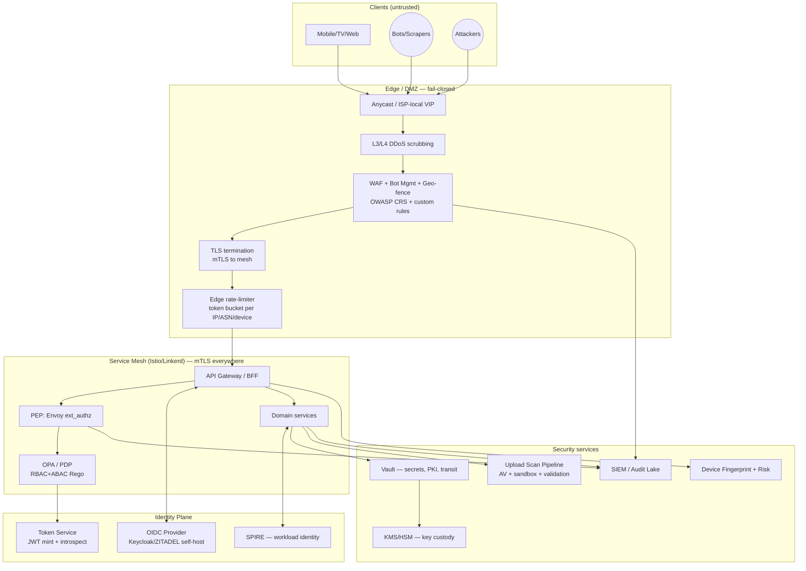
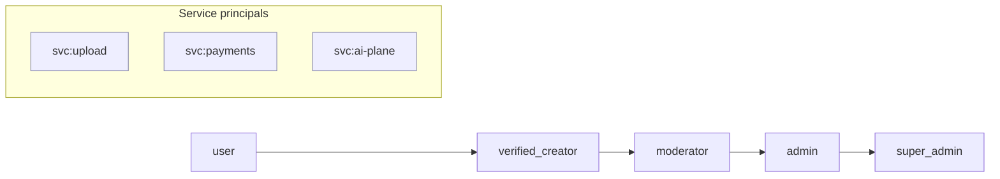
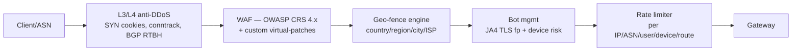
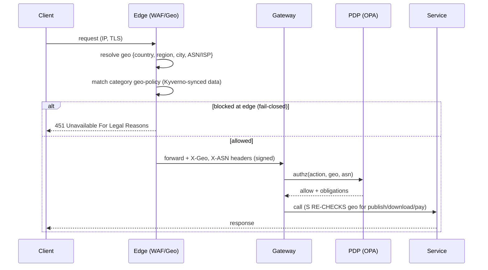
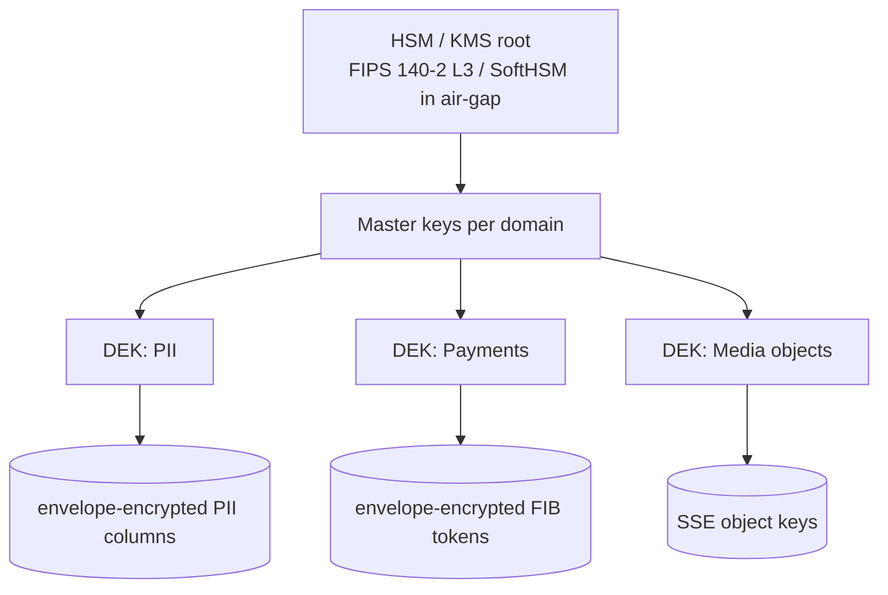
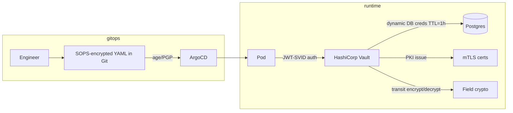
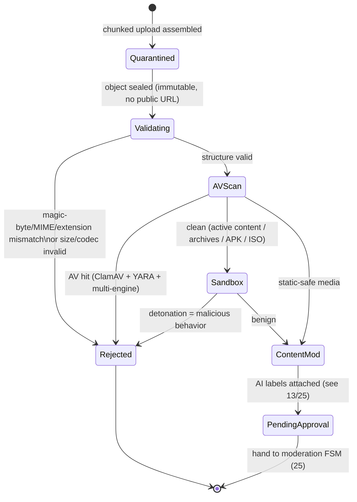
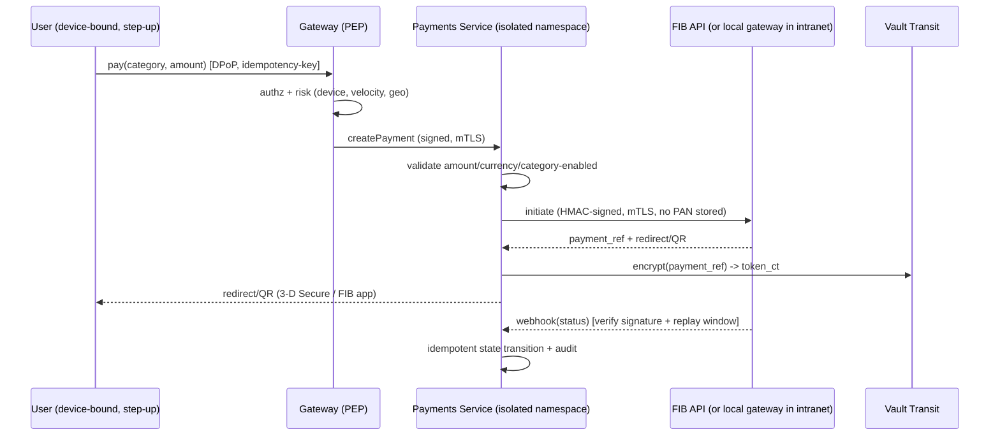
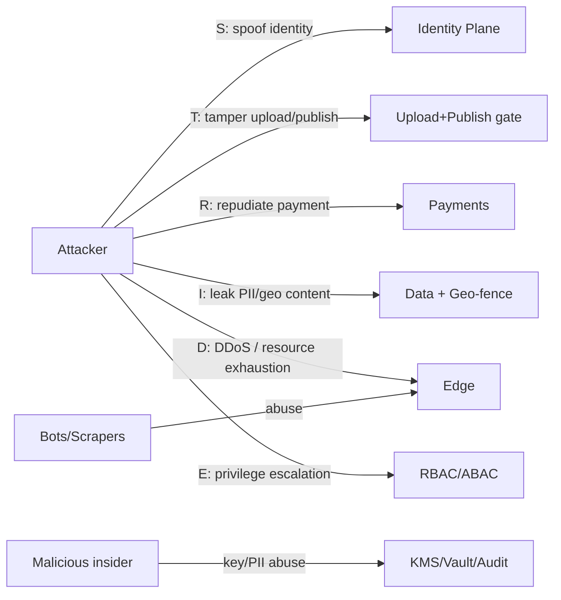

# 24 — Security Architecture (Enterprise Zero Trust)

> **Part E — Business, Ops & Strategy** · ZanaCloud blueprint
> **Scope:** The platform-wide security plane: Zero Trust network & identity, OAuth2/OIDC + JWT, RBAC + ABAC (incl. the upload-approval permission model), WAF/DDoS/rate-limiting, encryption at rest/in transit + KMS + field-level PII/payment encryption, secrets management (Vault/SOPS), device fingerprinting, anti-bot/anti-scraping, malware/ransomware scanning of every upload, file validation, Content Security Policy, geo-fencing enforcement, FIB payment security & PCI posture, the **air-gapped/Intranet security model**, and the threat model.
> **Siblings:** [02-system-architecture.md](./02-system-architecture.md) · [06-upload-pipeline.md](./06-upload-pipeline.md) · [13-ai-systems.md](./13-ai-systems.md) · [25-content-moderation.md](./25-content-moderation.md) · [26-devops.md](./26-devops.md) · [27-observability.md](./27-observability.md) · [33-platform-constraints.md](./33-platform-constraints.md)
> **Non-negotiables honored here:** free for users (no paywalled security); **admin-gated publishing enforced as an authorization invariant**; per-category FIB payments (PCI-adjacent controls, field-level crypto); geo-fencing enforced at WAF/edge **and** re-checked in services; **Intranet/FTTH air-gapped mode → every control has an on-prem, no-public-internet implementation** (local CA, local KMS/HSM, local threat-intel mirror, offline malware signatures); all uploads auto-scanned; centralized no-code Super Admin Panel drives policy.

---

## 24.0 Security tenets

1. **Zero Trust, no implicit trust.** No network location, no VPN, no "internal" subnet confers trust. Every request — north-south and east-west — is authenticated (mTLS + token), authorized (policy), and logged. "The intranet is not the trust boundary."
2. **Identity is the perimeter.** Workload identity (SPIFFE/SVID) and human identity (OIDC) are first-class. Mutual TLS via the mesh; short-lived certificates; no long-lived shared secrets.
3. **Defense in depth + fail-closed for safety classes.** Geo-fencing, malware scanning, and publish-gating fail **closed** (deny on uncertainty). Availability features fail open only when no safety/legal class is implicated.
4. **Air-gap parity.** Anything we depend on from the public internet (KMS, CA, signature feeds, threat intel, OAuth IdP, OCSP) must have a self-hosted equivalent that ships into an ISP/FTTH datacenter. See §24.12 and [26-devops.md](./26-devops.md).
5. **Policy as code, no-code as UI.** Authorization, geo, and moderation policies are OPA/Rego + Kyverno, version-controlled and tested; the Super Admin Panel is a typed editor that compiles to those policies — never a bypass.
6. **Least privilege & short TTLs everywhere.** Tokens minutes, certs hours, DB creds dynamic, break-glass audited.
7. **Everything is evidence.** Tamper-evident audit log for authz decisions, admin approvals, payment events, key usage, and break-glass. Required for legal escalation in [25-content-moderation.md](./25-content-moderation.md).

---

## 24.1 Zero Trust reference architecture



**Request lifecycle (north-south):**

1. Edge: L3/L4 scrubbing → WAF (OWASP CRS + custom) → **geo-fence pre-check** → bot scoring → edge rate-limit.
2. Gateway: terminate client TLS; start **mTLS** into mesh; attach request identity context (device id, ASN, geo, risk).
3. **PEP** (Envoy `ext_authz`) calls **PDP** (OPA) with the full context → allow/deny + obligations (e.g., "require step-up auth", "mask PII field").
4. Service executes; **re-validates geo & role** for safety-critical actions (publish, payment, download) — never trusts the edge alone.
5. Every decision emitted to the audit lake (§24.13).

---

## 24.2 Identity, OAuth2/OIDC & JWT

### 24.2.1 Identity providers

| Concern | Choice (cloud) | Choice (air-gapped) | Notes |
|---|---|---|---|
| Human IdP | Keycloak / ZITADEL (self-host) | **Same, fully offline** | No dependency on Google/Apple login in intranet mode; social login is an *optional* federated broker, disabled in air-gap. |
| Workload identity | SPIRE → SPIFFE SVID (X.509) | Same | mTLS identities for every pod. |
| MFA | TOTP + WebAuthn/Passkeys + FIDO2 | TOTP + WebAuthn (local) | SMS OTP optional via local ISP gateway; push via local APNs/FCM proxy. |
| Token format | JWT (access) + opaque (refresh) | Same | Access JWT signed with rotating EdDSA keys from Vault PKI. |

### 24.2.2 Token design

- **Access token:** JWT, **EdDSA (Ed25519)**, TTL **5–15 min**, audience-scoped (`aud=media-api`, `aud=payments`), `kid` for rotation. Claims kept minimal; entitlements resolved at PDP, not baked into the token.
- **Refresh token:** opaque, rotating (one-time-use, reuse-detection → family revocation), stored hashed (Argon2id) server-side in Redis with TTL + device binding.
- **Service tokens:** SPIFFE SVID for mTLS; for cross-domain calls, short-lived JWT-SVID via SPIRE.
- **DPoP / token binding:** access tokens bound to a client key (DPoP proof) so a stolen bearer token is useless off-device.

```jsonc
// Access token claims (minimal, entitlements resolved by PDP)
{
  "iss": "https://id.zana.local/realms/zana",
  "sub": "usr_9f3a...",          // opaque user id
  "aud": ["media-api"],
  "exp": 1739979600, "iat": 1739978700,
  "jti": "tok_a1b2...",          // unique, revocable
  "amr": ["pwd", "webauthn"],    // auth methods (for step-up policy)
  "acr": "aal2",                 // assurance level
  "role": "verified_creator",    // coarse role only; fine-grained = PDP
  "geo": "IQ-KRG",               // resolved region at login (re-checked at edge)
  "dev": "dfp_7c...",            // device fingerprint id (bound)
  "cnf": { "jkt": "h4Tk..." }    // DPoP key thumbprint
}
```

**OAuth2 flows used:** Authorization Code + PKCE (web/mobile/TV via device code), Client Credentials (service-to-service where SPIFFE not applicable), Token Exchange (RFC 8693) for delegation (e.g., gateway → AI plane on behalf of user). **No implicit flow, no ROPC** except a tightly-scoped admin bootstrap path.

### 24.2.3 Revocation in an air-gap (no public OCSP/CRL)

- JWT revocation via short TTL + a **revocation bloom filter** pushed to gateways (jti deny-list), refreshed every 30 s from the token service.
- Cert revocation via **SPIRE rotation** (hours) rather than CRL; local CA publishes a delta-CRL to an internal mirror.

---

## 24.3 Authorization: RBAC + ABAC + the upload-approval model

### 24.3.1 Role hierarchy



| Role | Core capabilities | Cannot |
|---|---|---|
| `user` | upload (≤ quota & ≤ duration), comment, react, pay/consume, manage own profile | publish; access another user's PII; moderate; configure policy |
| `verified_creator` | higher upload quota/duration; monetization enrollment; analytics on own content | approve others; bypass moderation |
| `moderator` | review queue, approve/reject **content**, apply strikes, escalate; read moderation PII (masked) | change platform policy; issue payouts; manage users' money |
| `admin` | category/region policy, FIB category enable, geo rules, feature toggles, user lifecycle | break-glass to raw payment PANs; alter audit log |
| `super_admin` | tenant-level config, key custody approval (dual-control), break-glass (audited, dual-person) | act without quorum on dual-control actions |

### 24.3.2 The upload-approval permission model (authorization invariant)

The platform law: **`Upload → Pending → Approval → Published`**, with **no self-publish**. This is encoded as an *authorization invariant*, not merely workflow code — even a compromised service cannot publish without a moderator/admin authz decision recorded in the audit log. The state machine and reviewer tooling live in [25-content-moderation.md](./25-content-moderation.md); here we pin the **authz rule**.

```rego
# package zana.authz  — OPA/Rego (excerpt)
package zana.authz

import future.keywords.if
import future.keywords.in

default allow := false
default obligations := []

# ---- Publish transition: ONLY moderator+ and ONLY via approval action ----
allow if {
    input.action == "content.publish"
    is_at_least(input.subject.role, "moderator")
    input.resource.state == "approved"          # must already be human-approved
    input.resource.approved_by != input.subject.id  # 4-eyes: approver != publisher? (config)
    geo_ok
    not hard_block
}

# A 'user' may submit, never publish
allow if {
    input.action == "content.submit"
    input.subject.id == input.resource.owner_id
    within_quota
    within_duration
    geo_ok
}

# ---- ABAC predicates ----
within_quota if input.resource.size_bytes <= data.quota[input.subject.role].bytes
within_duration if input.resource.duration_s <= data.quota[input.subject.role].max_duration_s

geo_ok if {
    some r in data.geo.allow[input.resource.category]
    glob.match(r, [], input.context.geo)        # e.g. "IQ-KRG-*"
}
# geo-fence fails CLOSED: if no rule resolves, deny
hard_block if input.resource.ai_labels[_] == "csam"   # AI auto-reject class only

role_rank := {"user":0,"verified_creator":1,"moderator":2,"admin":3,"super_admin":4}
is_at_least(r, min) if role_rank[r] >= role_rank[min]
```

```rego
# Field-level obligations (ABAC → masking)
obligations := ["mask:email","mask:phone","mask:pan"] if {
    input.action == "user.read_profile"
    input.subject.id != input.resource.owner_id
    not is_at_least(input.subject.role, "admin")
}
```

### 24.3.3 ABAC attributes available to the PDP

| Attribute class | Examples |
|---|---|
| Subject | role, assurance level (`acr`), verified flag, account age, risk score |
| Resource | owner, category, state (pending/approved/published), monetization flag, sensitivity (PII/payment) |
| Action | submit, publish, download, pay, refund, configure, export |
| Context | geo (country/region/city/ISP-ASN), device-trust, time, network mode (public vs intranet), step-up satisfied |

PDP returns `{decision, obligations}`; the PEP enforces obligations (mask fields, require step-up, watermark download). Decision cached ≤ 5 s for read-heavy paths; **never cached for publish/payment**.

---

## 24.4 Edge security: WAF, DDoS, rate-limiting, geo-fence

### 24.4.1 Layered edge



- **Stack (cloud):** Anycast + commercial scrubbing optional; **stack (air-gap):** ISP-local VIPs + **self-hosted** Envoy/Coraza WAF + Crowdsec + nftables/XDP for L3/L4. No Cloudflare/Akamai dependency in intranet mode.
- **WAF engine:** Coraza (Go, ModSecurity-compatible) running as an Envoy WASM/HTTP filter, OWASP **CRS 4.x** in blocking mode (anomaly threshold), plus virtual-patch rules deployed via GitOps (CVE hotfixes without redeploying apps).
- **DDoS:** L3/4 via XDP/eBPF drop, SYN-cookies, conntrack limits, BGP blackhole (RTBH/Flowspec) coordination with the ISP; L7 via adaptive rate-limits + challenge (PoW/JS/WebAuthn step-up). Cost-of-attack raised by **proof-of-work challenge** for anonymous bursty clients.

### 24.4.2 Rate-limiting model

| Tier | Key | Limit (example) | Action on breach |
|---|---|---|---|
| Global per-IP | `ip` | 600 req/min | 429 + Retry-After |
| Per-ASN burst | `asn` | adaptive (mean+3σ) | challenge |
| Auth endpoints | `ip+route` | 10 login/5 min | exponential backoff + lockout |
| Per-user API | `sub` | role-based quota | 429 |
| Upload init | `sub` | role quota/day | reject + audit |
| Payment | `sub+route` | 5 attempts/10 min | lock + step-up + alert |

Implemented as a distributed token-bucket in Redis (lua, atomic) at the edge **and** a coarse global limiter; counters are local-Redis in each ISP datacenter (no cross-site dependency).

### 24.4.3 Geo-fencing enforcement (defense in depth)



- **Resolution:** MaxMind GeoIP2 mirror + **ISP-provided subscriber→region mapping** (authoritative inside FTTH) + ASN tables. Updated offline via signed bundles.
- **Granularity:** country (`IQ`), region (`IQ-KRG`), city, **ISP/ASN** (e.g., allow only subscribers of partner ISPs).
- **Enforced twice:** edge (fast path) + service (`geo_ok` Rego) for publish/download/payment so a header-spoof or edge bypass cannot leak geo-restricted content. **Fails closed.**
- **Anti-evasion:** VPN/proxy/Tor exit detection (IP intel mirror); residential-proxy heuristics; mismatch between TLS-fingerprint locale and claimed geo raises risk.

---

## 24.5 Encryption: in transit, at rest, KMS, field-level

### 24.5.1 In transit

- **External:** TLS 1.3 only, HSTS preload, OCSP stapling (or local CA short-cert in air-gap), strong ciphers (X25519, AES-256-GCM, ChaCha20-Poly1305). Post-quantum hybrid (X25519+ML-KEM) enabled where clients support it.
- **Internal:** **mTLS via the mesh** (SPIFFE), automatic rotation; no plaintext east-west. Kafka with TLS + SASL/SCRAM or mTLS.

### 24.5.2 At rest

| Data | Mechanism |
|---|---|
| Object storage (MinIO/S3) | SSE-KMS, per-bucket keys, server-side AES-256-GCM |
| PostgreSQL | TDE (cluster) or filesystem-level LUKS + column crypto for PII/payments |
| Redis | encrypted volumes; no PII persisted; TTL'd |
| Backups | client-side envelope encryption before storage, separate key custody |
| Etcd/secrets | encryption-at-rest provider = Vault transit (see §24.6) |

### 24.5.3 KMS & key hierarchy



- **Cloud:** cloud KMS or Vault Transit backed by cloud HSM. **Air-gap:** Vault Transit backed by **SoftHSM/PKCS#11 + YubiHSM** physically in the ISP datacenter. No key ever leaves custody.
- **Envelope encryption:** master key wraps per-domain DEKs; DEKs wrap field keys. Rotation rewraps DEKs without re-encrypting all data.
- **Dual control:** unsealing Vault and rotating master keys require **Shamir quorum** (e.g., 3-of-5) held by separate `super_admin` custodians.

### 24.5.4 Field-level encryption for PII & payments

- PII (email, phone, national ID, address) and payment artifacts (FIB customer refs, tokens) are **encrypted at the application layer** with per-field keys via Vault Transit (`encrypt`/`decrypt` API), so DBAs and DB backups never see plaintext.
- **Searchable encryption:** blind-index (HMAC of normalized value with a separate index key) enables equality lookup without decrypting.
- **Tokenization for FIB:** we never store PANs (FIB handles cardholder data); we store opaque payment tokens/refs only — see §24.10.

```python
# Field crypto via Vault Transit (pseudocode, app-layer)
def store_phone(user_id, phone):
    ct = vault.transit_encrypt("pii-key", phone)          # ciphertext
    bidx = hmac_sha256(index_key, normalize(phone))       # blind index for lookup
    db.execute("UPDATE users SET phone_ct=%s, phone_bidx=%s WHERE id=%s",
               (ct, bidx, user_id))
```

---

## 24.6 Secrets management (Vault / SOPS)



- **Runtime secrets:** HashiCorp Vault (or OpenBao for fully-OSS air-gap). **Dynamic secrets** (DB creds, cloud creds) with short TTL; **no static DB passwords**. Apps authenticate to Vault via **Kubernetes auth / JWT-SVID**, never a bootstrap secret in env.
- **GitOps secrets:** **SOPS** (age/PGP) for config encrypted in Git; decrypted by ArgoCD/Vault plugin at sync. Alternative: External Secrets Operator pulling from Vault. **Never plaintext secrets in Git or container images.**
- **Air-gap:** Vault/OpenBao runs locally; SOPS age keys held in the local HSM; no cloud secret manager dependency.
- **Rotation:** automated; secret-leak scanning (gitleaks/trufflehog) in CI (see [26-devops.md](./26-devops.md)); break-glass static creds sealed and alarmed.

---

## 24.7 Device fingerprinting & risk

- **Signals:** TLS/JA4 fingerprint, HTTP/2 settings, Client Hints, canvas/WebGL (web), attestation (Play Integrity / App Attest where available; in air-gap, a signed device cert provisioned by the ISP), screen/locale/timezone, sensor entropy. Hashed into a stable `device_id` (`dfp_*`).
- **Use:** bound into the access token (`dev` claim); anomaly when token's `dev` ≠ presenting device → step-up. Powers anti-bot, anti-fraud (payments), and ABAC `device-trust`.
- **Privacy:** fingerprint is a salted, rotating pseudonymous id; raw signals not retained beyond risk scoring window; honors the platform's free + privacy posture.

---

## 24.8 Anti-bot & anti-scraping

| Threat | Control |
|---|---|
| Credential stuffing | breached-password check (local k-anon HIBP mirror), per-account+IP throttling, WebAuthn nudge |
| Content scraping | per-route quotas, dynamic obfuscation of IDs, signed & expiring media URLs, request-pattern anomaly (velocity/entropy), honeytokens |
| Headless/automation | JA4 + headless heuristics, optional PoW challenge, attestation requirement for high-value routes |
| Mass account creation | device + ASN dedup, risk-scored signup, optional invite/verify in air-gap |
| API abuse | mTLS for partners, HMAC-signed requests, per-key quotas |

Signed media URLs: `?exp=...&dev=...&sig=HMAC(path|exp|dev)` validated at edge; ties a stream to a device + short TTL so scraped links die fast. Coordinated scraping detected by the spam/CIB model in [13-ai-systems.md](./13-ai-systems.md#138).

---

## 24.9 Upload security: malware/ransomware scanning, validation, CSP

**Every uploaded object is scanned before it can leave quarantine.** This is a hard platform requirement and an extension of [06-upload-pipeline.md](./06-upload-pipeline.md).



### 24.9.1 Scanning layers

1. **File validation:** true type via magic bytes (libmagic), MIME ≠ extension rejected, codec/container sanity (ffprobe), max dimensions/duration/size per role, polyglot/zip-bomb detection, embedded-script stripping (PDF JS, Office macros, SVG scripts).
2. **Static AV:** **ClamAV** + **YARA** rules + multi-engine (where licensed). Signatures updated **offline** via signed bundle in air-gap (no public freshclam).
3. **Ransomware/active-content detonation:** archives, APK, ISO, executables, documents detonated in a **disposable gVisor/Firecracker sandbox** with no network; behavioral verdict (encryption bursts, persistence, C2 attempts). Ransomware heuristics: rapid entropy increase, mass-rename patterns.
4. **CDR (Content Disarm & Reconstruction):** for documents, rebuild to a safe canonical form (flatten PDF, strip macros) when policy allows.
5. **Verdict → quarantine release or hard reject**, event emitted; only then does the object enter the moderation FSM ([25-content-moderation.md](./25-content-moderation.md)).

Quarantine bucket has **no public path**, separate KMS key, and deny-all egress. Scan workers run unprivileged, read-only rootfs, seccomp-restricted.

### 24.9.2 Content Security Policy (browser/app hardening)

```http
Content-Security-Policy:
  default-src 'self';
  script-src 'self' 'nonce-{{cspNonce}}' 'strict-dynamic';
  style-src 'self' 'nonce-{{cspNonce}}';
  img-src 'self' data: https://cdn.zana.local;
  media-src 'self' https://cdn.zana.local blob:;
  connect-src 'self' https://api.zana.local wss://live.zana.local;
  frame-ancestors 'none';
  object-src 'none'; base-uri 'self'; form-action 'self';
  upgrade-insecure-requests; require-trusted-types-for 'script';
  report-to csp-endpoint
Strict-Transport-Security: max-age=63072000; includeSubDomains; preload
X-Content-Type-Options: nosniff
Referrer-Policy: strict-origin-when-cross-origin
Permissions-Policy: camera=(), microphone=(self), geolocation=(self)
Cross-Origin-Opener-Policy: same-origin
Cross-Origin-Resource-Policy: same-site
```

- **Nonce-based + strict-dynamic** (no `unsafe-inline`), **Trusted Types** to kill DOM-XSS sinks. User-generated HTML is sanitized server-side (DOMPurify-equivalent) and rendered in a sandboxed origin. CSP reports flow to the audit lake. In air-gap, `cdn.zana.local` is the **local CDN** ([26-devops.md](./26-devops.md)).

---

## 24.10 Payment (FIB) security & PCI posture



- **PCI scope minimization:** ZanaCloud **does not store, process, or transmit PANs** — FIB (the bank) handles cardholder data; we hold opaque **payment references/tokens** only. Target **SAQ-A / SAQ-A-EP** posture by redirect/iframe tokenization. Payments run in an **isolated K8s namespace** with its own KMS key, network policy deny-by-default, and a hardened image.
- **Webhook security:** signature verification (HMAC/JWS), replay window + nonce, mTLS, allow-list of FIB source. Idempotency keys on all money-moving operations; exactly-once via outbox + dedup.
- **Field crypto:** payment refs, payout bank details encrypted via Vault Transit (§24.5.4); blind-index for reconciliation lookup.
- **Anti-fraud:** velocity, device risk, geo consistency, amount anomalies → step-up (WebAuthn) or hold. Refunds & payouts are **dual-control** (`admin` initiate, second approver) and fully audited.
- **Air-gap/Intranet:** FIB connectivity via a **dedicated, firewalled egress** to the bank's network (the *one* sanctioned external path) or a bank-provided local gateway; the rest of the platform remains air-gapped. If even that is unavailable, payments degrade to **offline wallet vouchers** reconciled later. See [23-monetization.md](./23-monetization.md).

---

## 24.11 Application & supply-chain security

- **OWASP ASVS L2+** target; SSRF guards (deny link-local/metadata IPs), SQLi via parameterized queries/ORM, deserialization safelists, SSTI-safe templating.
- **Supply chain (detail in [26-devops.md](./26-devops.md)):** SBOM (CycloneDX) per image, SCA (Trivy/Grype), image signing (**Cosign/Sigstore**, keyless in cloud / **local Fulcio+Rekor** in air-gap), provenance (SLSA L3, in-toto), admission control (**Kyverno** verifies signatures + blocks `latest`, root, hostPath).
- **Pod hardening:** runAsNonRoot, readOnlyRootFilesystem, drop ALL caps, seccomp `RuntimeDefault`, no privileged, **gVisor** runtime for untrusted workloads (scan/sandbox), NetworkPolicy default-deny.

```yaml
# Kyverno: only signed images, no latest, non-root (cluster baseline)
apiVersion: kyverno.io/v1
kind: ClusterPolicy
metadata: { name: zana-baseline }
spec:
  validationFailureAction: Enforce
  rules:
    - name: require-signed-images
      match: { any: [{ resources: { kinds: ["Pod"] } }] }
      verifyImages:
        - imageReferences: ["registry.zana.local/*"]
          attestors:
            - entries:
                - keyless:
                    rekor: { url: "https://rekor.zana.local" }   # local in air-gap
                    issuer: "https://id.zana.local"
    - name: disallow-latest-and-root
      match: { any: [{ resources: { kinds: ["Pod"] } }] }
      validate:
        message: "no :latest, must runAsNonRoot"
        pattern:
          spec:
            =(securityContext): { runAsNonRoot: true }
            containers:
              - image: "!*:latest"
```

---

## 24.12 Air-gapped / Intranet security model

The single hardest constraint: **operate fully inside an ISP/FTTH/private datacenter with NO public internet.** Every security dependency must have a local twin.

```mermaid
flowchart TB
    subgraph DMZ["Internet-facing (ONLY at HQ build site — not in ISP DC)"]
        BUILD[Build/Mirror Farm]
    end
    subgraph Transfer["One-way / reviewed transfer"]
        SEAL[Signed offline bundle\n(images, signatures, sigs, models,\nAV sigs, geo DB, CRLs)]
    end
    subgraph ISP["ISP/FTTH Datacenter — AIR-GAPPED"]
        REG[Local OCI registry + Rekor/Fulcio]
        CA[Local Root CA + Vault PKI]
        KMSL[Local HSM/SoftHSM]
        IDPL[Local Keycloak/ZITADEL]
        WAFL[Self-host WAF/Coraza + Crowdsec]
        AVL[Offline ClamAV/YARA feed]
        GEOL[Offline GeoIP + ISP subscriber map]
        SIEML[Local SIEM/Audit lake]
        K8S[Self-managed K8s + service mesh]
    end
    BUILD --> SEAL --> REG
    SEAL --> CA & KMSL & IDPL & WAFL & AVL & GEOL
    K8S --> REG & CA & KMSL & IDPL & WAFL & AVL & GEOL & SIEML
```

| Public-internet dependency | Air-gap replacement |
|---|---|
| Public CA / Let's Encrypt | **Local Root CA** + Vault PKI; clients trust the local root (provisioned by ISP) |
| Cloud KMS / HSM | **YubiHSM/SoftHSM** physically in the DC; Vault Transit/PKI |
| OAuth social login / OCSP | Local Keycloak; revocation via short TTL + bloom deny-list |
| WAF SaaS / DDoS scrubbing | Coraza + Crowdsec + XDP/eBPF + ISP BGP cooperation |
| freshclam / threat intel | **Signed offline AV/YARA/IP-intel bundles** transferred & verified |
| MaxMind GeoIP updates | Offline signed GeoIP + authoritative **ISP subscriber→region** map |
| Container registry | **Local OCI registry** (Harbor/Zot) + offline mirror |
| Sigstore (Fulcio/Rekor) | **Self-hosted Fulcio + Rekor** for keyless signing/verify |
| Model APIs | On-prem serving only (see [13-ai-systems.md](./13-ai-systems.md)) |

**Transfer security:** all inbound artifacts arrive as **signed, hash-pinned bundles**; a review gate verifies signatures + scans before they touch the air-gapped registry (one-way diode or reviewed sneakernet). No reverse path. Deployment mechanics in [26-devops.md](./26-devops.md#ship-to-air-gap).

---

## 24.13 Audit, detection & response

- **Tamper-evident audit lake:** authz decisions, admin approvals (the publish gate), payment events, key usage, break-glass, config changes → append-only, hash-chained (each record includes prev-hash), WORM storage. Feeds legal escalation in [25-content-moderation.md](./25-content-moderation.md).
- **SIEM/SOAR:** Wazuh/OpenSearch SIEM (air-gap friendly) + Falco (runtime threat detection on the cluster) + Crowdsec (edge). Detections → on-call (see [27-observability.md](./27-observability.md#alerting)).
- **Detections (examples):** impossible-travel login, token-reuse (refresh family), privilege escalation, mass-export, AV/sandbox hits, Falco shell-in-container, NetworkPolicy violations, payment-velocity anomalies.
- **Break-glass:** dual-person, time-boxed, auto-revoked, alarmed, fully recorded; any use triggers a review.

---

## 24.14 Threat model (STRIDE + abuse cases)



| STRIDE | Threat | Primary mitigations |
|---|---|---|
| **S**poofing | stolen token, fake device, spoofed geo header | DPoP-bound JWT, device binding, signed edge headers, mTLS/SPIFFE east-west |
| **T**ampering | malware upload, bypass publish gate, modify in transit | scan+sandbox quarantine, publish as authz invariant (4-eyes), mTLS, signed images/Kyverno |
| **R**epudiation | "I didn't authorize this payment/approval" | hash-chained audit lake, signed webhooks, dual-control payouts |
| **I**nfo disclosure | PII leak, geo-fenced content exfiltration, scraping | field-level crypto + blind index, geo re-check fail-closed, signed media URLs, masking obligations |
| **D**oS | L3/4 floods, L7 abuse, zip-bomb, model overload | XDP/eBPF, scrubbing/BGP RTBH, adaptive RL + PoW, validation limits, AI quotas |
| **E**oP | role/ABAC bug, container escape, secret theft | OPA tests in CI, least-priv, gVisor sandbox, dynamic short-TTL secrets, Falco |
| Insider | DBA reads PII, admin reaches PANs | app-layer crypto (DBAs see ciphertext), no PAN storage, dual-control + audit |

**Top abuse cases & responses:** (1) coordinated scraping → signed URLs + CIB model + ASN throttle; (2) mass fake creators to game monetization → device/ASN dedup, verification, payout dual-control; (3) malicious upload to attack viewers → mandatory scan + CDR + CSP; (4) geo-evasion via VPN → proxy/Tor intel + fail-closed re-check; (5) insider key exfiltration → HSM custody + Shamir quorum + audit.

---

## 24.15 Compliance & standards mapping

| Framework | Coverage |
|---|---|
| OWASP ASVS L2+ / Top 10 | §24.9–24.11 |
| NIST 800-207 (Zero Trust) | §24.1–24.3 |
| NIST 800-53 / ISO 27001 controls | access, crypto, audit, IR |
| PCI-DSS (scope-reduced, SAQ-A/A-EP) | §24.10 |
| GDPR-style data protection / Iraqi data rules | field crypto, minimization, residency (data stays in-country/in-ISP) |
| CSAM legal mandates | auto-block + escalation in [25-content-moderation.md](./25-content-moderation.md) |

---

## 24.16 Cross-references

- Upload mechanics & quarantine: [06-upload-pipeline.md](./06-upload-pipeline.md)
- AI moderation / CSAM / CIB signals: [13-ai-systems.md](./13-ai-systems.md)
- Publish FSM, reviewer tooling, appeals, escalation: [25-content-moderation.md](./25-content-moderation.md)
- Image signing, SBOM, GitOps, air-gap shipping: [26-devops.md](./26-devops.md)
- Audit/SIEM/alerting/on-call: [27-observability.md](./27-observability.md)
- Geo/FIB/intranet policy surfaces in the Super Admin Panel: [33-platform-constraints.md](./33-platform-constraints.md)

---

## 24.17 Summary

Security is a Zero Trust plane where identity (OIDC + DPoP-bound JWT + SPIFFE) is the perimeter, authorization is policy-as-code (RBAC+ABAC in OPA) that encodes the **no-self-publish** law as an authorization invariant, and every layer — edge WAF/DDoS/geo, encryption with KMS + field-level crypto, Vault/SOPS secrets, mandatory malware/ransomware scanning, CSP, and PCI-minimized FIB payments — has a fully **air-gapped twin** so the entire platform can run inside an ISP/FTTH datacenter with no public internet, all of it tamper-evidently audited for moderation and legal escalation.
