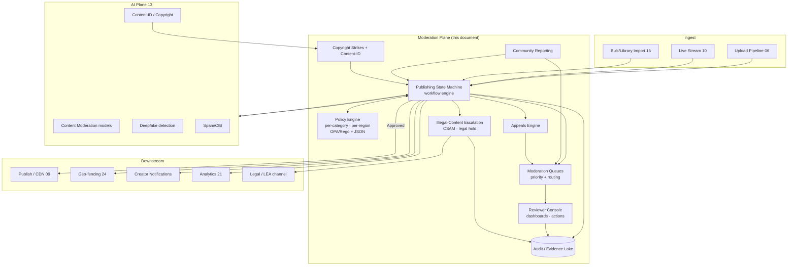
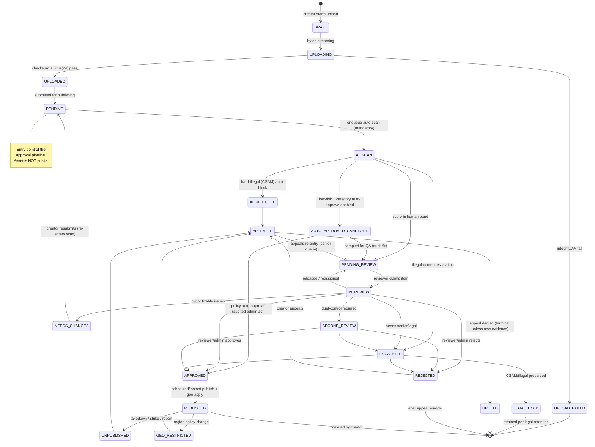
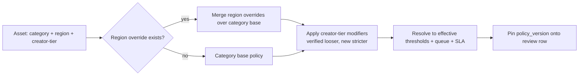
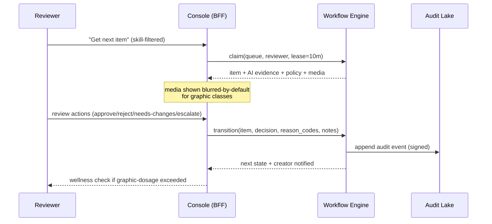
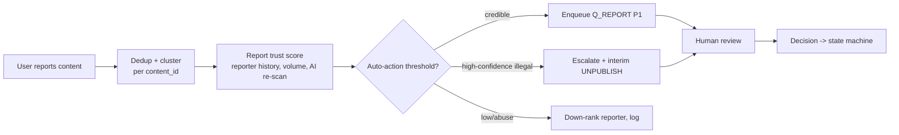
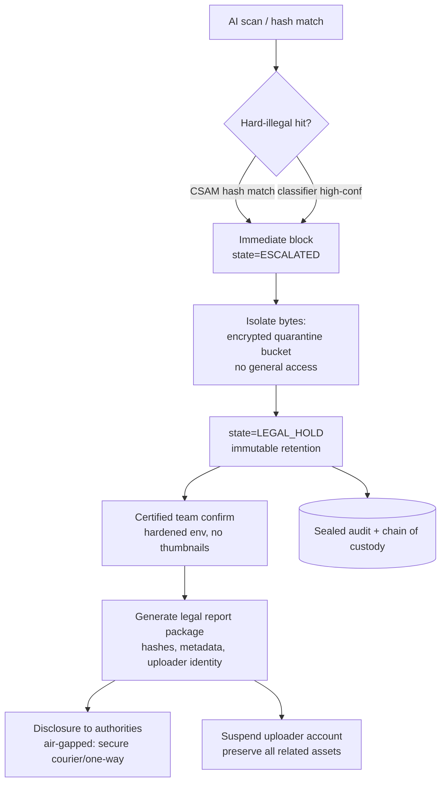
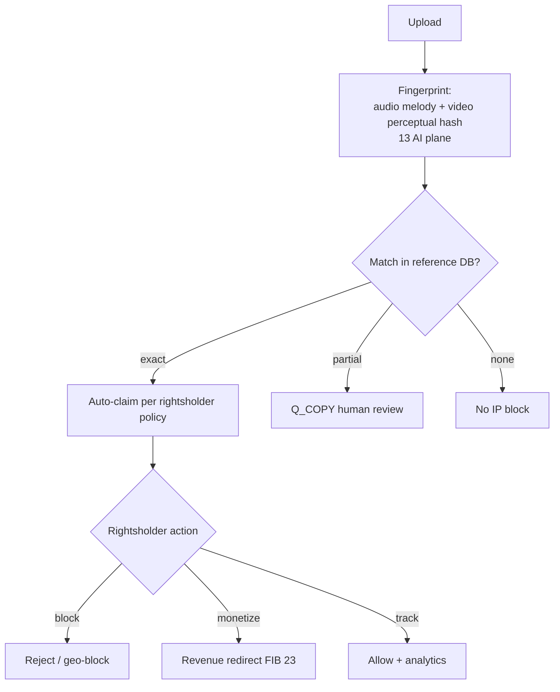
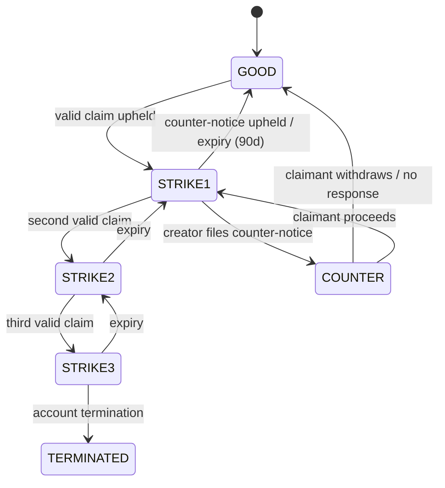
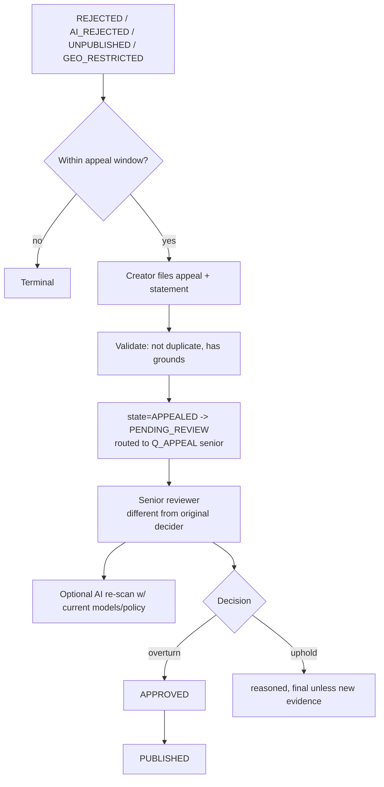
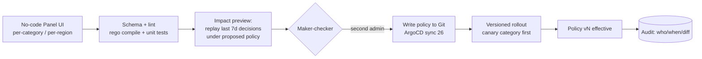

# 25 — Content Moderation & Admin-Approval Publishing

> **Part E — Business, Ops & Strategy** · ZanaCloud blueprint
> **Scope:** The end-to-end trust & safety plane: the **mandatory admin-approval publishing workflow** (Upload → Pending → AI-scan → Human/Admin review → Approved/Rejected → Published, with appeals re-entry), AI moderation (delegated to the [AI Systems](./13-ai-systems.md) plane), human moderation queues + reviewer tooling, SLAs & queue prioritization, community reporting, copyright strikes & Content-ID matching, the appeals process, CSAM/illegal-content handling & legal escalation, and **per-category & per-region moderation policy** configured via the no-code Super Admin Panel.
> **Siblings:** [06-upload-pipeline.md](./06-upload-pipeline.md) · [07-dynamic-category-system.md](./07-dynamic-category-system.md) · [13-ai-systems.md](./13-ai-systems.md) · [21-analytics.md](./21-analytics.md) · [24-security.md](./24-security.md) · [26-devops.md](./26-devops.md) · [27-observability.md](./27-observability.md) · [34-kurdish-language-intelligence.md](./34-kurdish-language-intelligence.md)
> **Non-negotiables honored here:** free for users (no paywalled safety); **admin-approval publishing is the spine of this document — no content reaches Published without an explicit human/admin decision**; per-category FIB monetization (moderation policy is per-category & per-region); geo-fencing (a video can be Approved-for-region-A, Rejected-for-region-B); **Intranet/FTTH air-gapped mode → every moderation dependency (AI models, hash lists, Content-ID DB, legal escalation channel) has a self-hosted, no-public-internet implementation**; ALL uploaded content auto-scanned before any human sees it; centralized no-code Super Admin Panel drives all policy.

---

## 25.0 Moderation tenets

1. **Publish is a decision, not a default.** The platform law is *Upload → Pending → Approval → Published*. There is no code path, API, admin shortcut, or bulk action that moves an asset to `PUBLISHED` without a recorded human/admin approval event (or an explicitly configured per-category **auto-approve** policy that is itself an admin act, fully audited). See §25.2.
2. **AI is advisory + gating, humans are deciding.** AI moderation (§25.3, owned by [13-ai-systems.md](./13-ai-systems.md)) produces **scores, labels, evidence, and a routing recommendation**. AI may *auto-reject* only hard-illegal classes (CSAM, where law mandates immediate block). AI never auto-*publishes* normal content.
3. **Fail-closed for safety classes.** If the AI scan fails, times out, or is unavailable, the asset stays in `AI_SCAN`/`PENDING_REVIEW` — never auto-published. Geo + category policy fail closed.
4. **Policy as code, configured as no-code.** Every per-category and per-region rule compiles to OPA/Rego + a typed JSON policy document. The Super Admin Panel is a typed editor over that document; it can never bypass the state machine.
5. **Everything is evidence.** Every state transition, reviewer action, AI label, report, strike, and legal escalation is an append-only, tamper-evident audit record (§25.13). This is the substrate for appeals and for law-enforcement disclosure.
6. **Reviewer welfare is a system requirement.** CSAM/graphic content is greyscaled, blurred-by-default, dosage-limited, and wellness-gated. The tooling actively protects moderators (§25.6).
7. **Air-gap parity.** Hash-matching lists (NCMEC/IWF equivalents or national lists), Content-ID fingerprint DBs, and AI models all ship as offline artifacts that sync via the **sneakernet/one-way-diode** path described in [26-devops.md](./26-devops.md). No moderation function may hard-depend on a public API.

---

## 25.1 Where moderation sits in the platform



The moderation plane is a **control plane over content lifecycle**. It does not store the media bytes (that's [06-upload-pipeline.md](./06-upload-pipeline.md) / object storage); it stores **decisions, signals, and evidence pointers**.

---

## 25.2 The mandatory admin-approval publishing state machine

This is the core of the document. Every asset (video, audio, document, game build, course, live VOD) flows through this machine. States are stored on the `content_review` aggregate; transitions emit domain events.

### 25.2.1 State diagram



### 25.2.2 State semantics table

| State | Public? | Who/what enters it | Allowed exits | Notes |
|---|---|---|---|---|
| `DRAFT` | No | Creator | UPLOADING | Editable, not submitted |
| `UPLOADING` | No | Upload pipeline | UPLOADED, UPLOAD_FAILED | Chunked + resumable |
| `UPLOADED` | No | AV + checksum pass ([24](./24-security.md)) | PENDING | Bytes safe-at-rest |
| `PENDING` | No | Creator submit / resubmit | AI_SCAN | **Approval pipeline entry** |
| `AI_SCAN` | No | Workflow engine | PENDING_REVIEW, AUTO_APPROVED_CANDIDATE, AI_REJECTED, ESCALATED | Mandatory, fail-closed |
| `AUTO_APPROVED_CANDIDATE` | No | AI low-risk + policy | APPROVED, PENDING_REVIEW(QA sample) | Only if category allows |
| `PENDING_REVIEW` | No | AI band / appeal / report | IN_REVIEW | In a human queue |
| `IN_REVIEW` | No | Reviewer claim | APPROVED, REJECTED, NEEDS_CHANGES, ESCALATED, SECOND_REVIEW, PENDING_REVIEW | Claim lock w/ TTL |
| `SECOND_REVIEW` | No | Dual-control rule | APPROVED, REJECTED, ESCALATED | Different reviewer required |
| `NEEDS_CHANGES` | No | Reviewer | PENDING | Creator edits → re-scan |
| `ESCALATED` | No | Reviewer/AI | APPROVED, REJECTED, LEGAL_HOLD | Senior/legal/T&S lead |
| `APPROVED` | No (yet) | Reviewer/admin/policy | PUBLISHED | Decision recorded |
| `PUBLISHED` | **Yes** | Publish service | UNPUBLISHED, GEO_RESTRICTED, deleted | Geo + category gates applied |
| `GEO_RESTRICTED` | Partial | Region policy | APPEALED, PUBLISHED | Visible in subset of regions |
| `REJECTED` / `AI_REJECTED` | No | Reviewer/AI | APPEALED | Reasoned, appealable |
| `APPEALED` | No | Creator | PENDING_REVIEW(senior), UPHELD | Re-entry path |
| `UPHELD` | No | Appeals decision | terminal | Reopen only on new evidence |
| `LEGAL_HOLD` | No | Escalation | retained | Immutable, LEA disclosure |

### 25.2.3 Invariant: no publish without an approval event

The publish service is **not allowed** to read media into the CDN unless an `ApprovalGranted` event exists for the `(content_id, region_set)` it is publishing. This is enforced three ways (defense in depth):

```rego
# policy/publish_authz.rego — enforced at the Publish PEP (Envoy ext_authz, see 24)
package zana.publish

default allow = false

allow {
  input.action == "PUBLISH"
  some ev in data.approvals[input.content_id]
  ev.kind == "ApprovalGranted"
  ev.region_set == input.region_set
  not revoked(input.content_id, ev.id)
  ev.expires_at > input.now
}

revoked(cid, eid) {
  some r in data.revocations[cid]
  r.approval_id == eid
}
```

1. **State guard** in the workflow engine (cannot emit `PUBLISH` command from any state but `APPROVED`).
2. **Authorization guard** (the Rego above) at the publish PEP.
3. **CDN origin guard**: origin shielding refuses to serve a `content_id` whose review row is not `PUBLISHED` (TTL-cached deny, see [09-streaming-infrastructure.md](./09-streaming-infrastructure.md)).

### 25.2.4 Workflow engine implementation

A durable workflow (Temporal self-hosted in air-gapped mode; Celery+state-table fallback) owns transitions. Pseudocode of the guarded transition:

```python
# moderation/workflow/transition.py
class IllegalTransition(Exception): ...

TRANSITIONS = {
    "PENDING":          {"AI_SCAN"},
    "AI_SCAN":          {"PENDING_REVIEW", "AUTO_APPROVED_CANDIDATE",
                         "AI_REJECTED", "ESCALATED"},
    "AUTO_APPROVED_CANDIDATE": {"APPROVED", "PENDING_REVIEW"},
    "PENDING_REVIEW":   {"IN_REVIEW"},
    "IN_REVIEW":        {"APPROVED", "REJECTED", "NEEDS_CHANGES",
                         "ESCALATED", "SECOND_REVIEW", "PENDING_REVIEW"},
    "SECOND_REVIEW":    {"APPROVED", "REJECTED", "ESCALATED"},
    "NEEDS_CHANGES":    {"PENDING"},
    "ESCALATED":        {"APPROVED", "REJECTED", "LEGAL_HOLD"},
    "APPROVED":         {"PUBLISHED"},
    "PUBLISHED":        {"UNPUBLISHED", "GEO_RESTRICTED"},
    "REJECTED":         {"APPEALED"},
    "AI_REJECTED":      {"APPEALED"},
    "APPEALED":         {"PENDING_REVIEW", "UPHELD"},
}

def transition(review, to_state, actor, reason, evidence=None):
    if to_state not in TRANSITIONS.get(review.state, set()):
        raise IllegalTransition(f"{review.state} -> {to_state}")

    _check_actor_authority(actor, review, to_state)      # RBAC/ABAC (24)
    _check_dual_control(review, to_state, actor)         # SECOND_REVIEW rule
    _apply_policy_side_effects(review, to_state)         # geo, strikes, notif

    ev = AuditEvent.append(                              # tamper-evident (25.13)
        content_id=review.content_id, frm=review.state, to=to_state,
        actor=actor.id, role=actor.role, reason=reason,
        evidence=evidence, policy_version=review.policy_version,
        ts=now(), prev_hash=review.last_hash)
    review.state = to_state
    review.last_hash = ev.hash
    review.save()
    emit_domain_event(review, ev)
    return ev
```

---

## 25.3 AI moderation integration (auto-scan of ALL content)

The actual models live in [13-ai-systems.md](./13-ai-systems.md). This document defines the **contract** and how scan results drive the state machine. Every asset is scanned — there is no opt-out.

### 25.3.1 Scan request/response contract

```yaml
# AsyncAPI 3.0 — moderation.scan.request  (topic: moderation.scan.request.v1)
ScanRequest:
  content_id: "uuid"
  asset_kind: "video|audio|image|document|game_build|live_segment"
  category_id: "uuid"            # drives policy (07)
  region_set: ["IQ-KRG", "IQ"]  # drives per-region thresholds
  language_hints: ["ckb", "kmr", "ar", "en"]
  media_uri: "s3://staging/<cid>/master.mp4"
  derived:
    keyframes_uri: "s3://staging/<cid>/keyframes/"
    transcript_uri: "s3://staging/<cid>/asr.vtt"   # Kurdish-first ASR (34)
  requested_classes: ["csam","nudity","violence","gore","terror",
                       "hate_ckb","hate_kmr","selfharm","spam","copyright"]
  priority: "live|standard|bulk"
```

```yaml
# moderation.scan.result.v1
ScanResult:
  content_id: "uuid"
  model_bundle_version: "modbundle-2026.05-airgap"   # pinned, offline-syncable
  labels:
    - class: "violence"
      score: 0.82
      severity: "high"
      regions_of_interest: [{t0: 41.2, t1: 47.9, bbox: [..]}]
      evidence_uri: "s3://evidence/<cid>/violence/clip.mp4"
    - class: "hate_ckb"
      score: 0.61
      spans: [{t0: 12.0, t1: 18.5, text: "…", lang: "ckb"}]
  hard_illegal:
    csam: {hit: false, hash_source: "national_list_v2026.05"}
  recommended_route: "HUMAN_REVIEW"   # AUTO_APPROVE|HUMAN_REVIEW|AUTO_REJECT|ESCALATE
  confidence: 0.88
  cost_units: 3.2
```

### 25.3.2 Routing logic: AI result → state

```python
def route_after_scan(review, result, policy):
    if result.hard_illegal["csam"]["hit"]:
        return escalate_csam(review, result)          # -> ESCALATED -> LEGAL_HOLD
    band = policy.band_for(result)                    # per-category/region thresholds
    if band == "AUTO_REJECT":
        return transition(review, "AI_REJECTED", SYSTEM, reason=result.top_label())
    if band == "AUTO_APPROVE" and policy.auto_approve_enabled:
        review2 = transition(review, "AUTO_APPROVED_CANDIDATE", SYSTEM, "low-risk")
        if sampled(policy.qa_sample_rate):            # QA audit sampling
            return enqueue(review2, "PENDING_REVIEW", queue="qa")
        return transition(review2, "APPROVED", SYSTEM, "policy auto-approve")
    # default + ESCALATE bands -> humans
    q = policy.queue_for(result, review)              # 25.5 prioritization
    return enqueue(transition(review, "PENDING_REVIEW", SYSTEM, "ai-band"), q)
```

Key rule: **`AUTO_APPROVE` is only reachable if an admin explicitly enabled it for that category/region** in the Super Admin Panel (§25.11). The default for every new category is **human review required**.

### 25.3.3 Live-stream moderation

Live content can't wait for full review. The model: live goes public under a **provisional-publish** grant scoped by category policy (e.g. "verified creators only, with N-second broadcast delay + continuous segment scanning"). Each HLS/LL-HLS segment is scanned in-flight; a hard-illegal hit triggers immediate cut + `LEGAL_HOLD` of the recording. See [10-live-streaming.md](./10-live-streaming.md). Categories may forbid provisional-publish entirely (then live requires pre-approval, rare).

---

## 25.4 Per-category & per-region policy model

Policy is the lever the Super Admin Panel pulls. It is a typed document compiled to Rego + thresholds.

### 25.4.1 Policy document schema

```yaml
# moderation_policy/<category>/<region>.yaml  (compiled, version-pinned)
apiVersion: zana.moderation/v1
kind: ModerationPolicy
metadata:
  category_id: "kurdish-cinema"
  region: "IQ-KRG"
  version: 47
  author: "admin:rojîn"          # who saved it in the panel
  effective_from: "2026-06-01T00:00:00Z"
spec:
  auto_approve_enabled: false     # default-deny posture
  qa_sample_rate: 0.05            # 5% of auto-approves get QA review
  dual_control_classes: ["violence:high", "hate_ckb:high", "terror:any"]
  bands:                          # class -> thresholds -> route
    csam:    { any: AUTO_REJECT_AND_ESCALATE }
    nudity:  { ">=0.90": AUTO_REJECT, ">=0.55": HUMAN_REVIEW }
    violence:{ ">=0.95": AUTO_REJECT, ">=0.50": HUMAN_REVIEW }
    hate_ckb:{ ">=0.85": HUMAN_REVIEW, ">=0.60": HUMAN_REVIEW }
    spam:    { ">=0.92": AUTO_REJECT, ">=0.60": HUMAN_REVIEW }
    copyright_match: { exact: STRIKE_FLOW, partial: HUMAN_REVIEW }
  sla:
    standard_minutes: 240
    appeal_hours: 48
    live_segment_ms: 4000
  geo:
    publish_regions: ["IQ-KRG", "IQ"]   # approve != publish-everywhere
    region_overrides:
      "IQ":
        nudity: { ">=0.30": HUMAN_REVIEW }   # stricter outside KRG
  reviewer_skills_required: ["lang:ckb", "domain:film"]
  legal:
    csam_hash_lists: ["national_v2026.05", "iwf_mirror_v2026.04"]
    retention_legal_hold_days: 2555         # 7y, per legal
```

### 25.4.2 Resolution precedence



The **`policy_version` is pinned at scan time** onto the review row so a later policy change does not retroactively alter an in-flight decision (auditability). Appeals can request re-evaluation under the *current* policy.

---

## 25.5 Moderation queues, SLAs & prioritization

### 25.5.1 Queue topology

```mermaid
flowchart TB
    IN[Items needing humans] --> ROUTE{Router}
    ROUTE --> Q_LEGAL[[Q: Legal/Illegal<br/>P0]]
    ROUTE --> Q_LIVE[[Q: Live/Realtime<br/>P0]]
    ROUTE --> Q_APPEAL[[Q: Appeals (senior)<br/>P1]]
    ROUTE --> Q_REPORT[[Q: User-reported<br/>P1]]
    ROUTE --> Q_COPY[[Q: Copyright/Content-ID<br/>P2]]
    ROUTE --> Q_STD[[Q: Standard review<br/>P2]]
    ROUTE --> Q_QA[[Q: QA sampling<br/>P3]]
    ROUTE --> Q_BULK[[Q: Bulk import<br/>P3]]
    Q_LEGAL --> SENIOR[Senior/T&S + legal]
    Q_APPEAL --> SENIOR
    Q_STD --> POOL[General reviewer pool<br/>skill-routed]
    Q_REPORT --> POOL
    Q_COPY --> POOL
```

### 25.5.2 Prioritization score

Items are pulled by a computed priority, not pure FIFO:

```python
def priority_score(item, now):
    base = {"P0":1000, "P1":600, "P2":300, "P3":100}[item.tier]
    sla_pressure = max(0, 1 - (item.sla_deadline - now)/item.sla_window) * 400
    severity     = item.max_severity_weight * 200      # high>med>low
    reach        = log1p(item.creator_reach) * 20      # bigger audience first
    age          = min((now - item.entered_at).minutes, 1440) * 0.5
    freshness    = 50 if item.is_breaking_news else 0   # category-flagged
    return base + sla_pressure + severity + reach + age + freshness
```

### 25.5.3 SLA matrix

| Queue | Tier | Target (p50) | Breach (p99) | Action on breach |
|---|---|---|---|---|
| Legal/Illegal | P0 | 5 min | 15 min | Page T&S lead + legal on-call ([27](./27-observability.md)) |
| Live/Realtime | P0 | 4 s/segment | 8 s | Auto-cut stream, hold VOD |
| Appeals (senior) | P1 | 12 h | 48 h | Auto-escalate to T&S manager |
| User-reported | P1 | 2 h | 8 h | Reprioritize, alert |
| Copyright | P2 | 12 h | 48 h | Auto put-back if claimant non-responsive |
| Standard | P2 | 4 h | 24 h | Surge staffing alert |
| QA sample | P3 | 24 h | 72 h | Drop sample rate temporarily |

SLA timers and breaches are exported as metrics to [27-observability.md](./27-observability.md) (`moderation_queue_sla_breach_total`, `moderation_review_latency_seconds`).

---

## 25.6 Reviewer console & tooling

### 25.6.1 Reviewer workflow



### 25.6.2 Console capabilities

- **Evidence panel:** AI labels with timestamps, ROI bounding boxes, transcript spans (Kurdish-aware, RTL rendering for Sorani), copyright match overlays, similar-asset history, creator track record.
- **Safe rendering:** Graphic classes are greyscaled + blurred with click-to-reveal, frame-stepping instead of autoplay, audio muted by default, spoiler-gated.
- **Structured decisions:** Reviewers must pick **reason codes** (taxonomy below) — free text alone is not accepted; this powers analytics, appeals, and model retraining feedback ([13](./13-ai-systems.md)).
- **Dual-control UI:** When `dual_control_classes` matches, a second independent reviewer is required; the first reviewer's decision is hidden from the second to avoid anchoring.
- **Bulk tools (guarded):** Bulk actions only on items sharing a verified signal (same Content-ID hash, same spam campaign); each bulk action still writes per-item audit events.
- **Keyboard-first + Kurdish UI:** Full Sorani/Kurmanji localized interface, RTL layout (see [34](./34-kurdish-language-intelligence.md)).

### 25.6.3 Reason-code taxonomy (excerpt)

```json
{
  "REJECT": {
    "ILLEGAL": ["csam","terror_promotion","incitement_violence"],
    "POLICY":  ["adult_nudity","graphic_violence","hate_speech_ckb",
                "harassment","dangerous_acts","self_harm"],
    "INTEGRITY": ["spam","scam","impersonation","cib_coordinated"],
    "IP": ["copyright_full","trademark","counterfeit"]
  },
  "NEEDS_CHANGES": ["age_gate_missing","mislabeled_category",
                    "thumbnail_violation","metadata_incomplete_ckb"],
  "APPROVE_WITH": ["age_restrict","geo_restrict","limited_monetization"]
}
```

### 25.6.4 Moderator wellness (system requirement)

- **Dosage limits:** max graphic-class items per shift; forced rotation to non-graphic queues.
- **Mandatory blur + greyscale defaults**, configurable per moderator.
- **Wellness check-ins** triggered after configurable graphic exposure; ability to instantly hand off an item.
- **No CSAM media rendered to general moderators** — only hash-match confirmation by a small certified team in a hardened environment (§25.9).
- Wellness telemetry is **privacy-protected** and never used for productivity surveillance.

---

## 25.7 Moderator/admin dashboards

| Dashboard | Audience | Key panels |
|---|---|---|
| **Queue Health** | T&S ops | depth per queue, SLA burn-down, oldest item, breach rate, inflow vs throughput |
| **Reviewer Productivity** | Team leads | items/hr (quality-weighted), agreement rate vs second-review, reason-code mix, wellness flags |
| **AI vs Human Agreement** | AI governance ([13](./13-ai-systems.md)) | confusion matrix per class, auto-approve QA reversal rate, drift signal feed |
| **Policy Impact** | Super Admins | reject rate by category/region before/after policy change v, appeal-overturn rate |
| **Appeals** | T&S manager | open appeals, overturn rate, SLA, reasons overturned |
| **Legal/CSAM** | Certified team + legal | hold count, escalation latency, disclosure log (access-restricted) |
| **Copyright** | IP team | claims, strikes by creator, counter-notices, Content-ID match volume |

Dashboards are Grafana panels backed by the analytics warehouse ([21-analytics.md](./21-analytics.md)) + Prometheus ([27-observability.md](./27-observability.md)). In air-gapped mode all dashboards run on the local Grafana/Mimir stack.

---

## 25.8 Community reporting

### 25.8.1 Report flow



### 25.8.2 Report API

```http
POST /api/v1/reports
Authorization: Bearer <user-token>
{
  "content_id": "uuid",
  "reason": "graphic_violence",
  "detail_ckb": "…",            // localized free text optional
  "timestamp_ms": 41200,        // where in the video
  "category_context": "kurdish-cinema"
}
201 -> { "report_id": "uuid", "status": "received", "dedup_cluster": "uuid" }
```

- **Interim measures:** A surge of credible reports on already-`PUBLISHED` content can trigger an **interim UNPUBLISH** pending re-review (fail-safe), configurable per category. The creator is notified with appeal rights.
- **Anti-abuse:** Reporter trust scoring + coordinated-report detection (links to spam/CIB in [13](./13-ai-systems.md)); mass false-reporting down-ranks the reporter and can rate-limit them.

---

## 25.9 CSAM & illegal-content handling + legal escalation

This is the highest-severity path and is **fail-closed, isolated, and audited**.

### 25.9.1 Pipeline



### 25.9.2 Controls

- **Auto-block, never auto-delete.** CSAM is preserved under `LEGAL_HOLD` for chain-of-custody and legal retention; deletion would destroy evidence. Bytes move to an **encrypted quarantine bucket** with per-object KMS keys ([24](./24-security.md)) and access restricted to the certified team.
- **Hash matching offline.** National/IWF-equivalent hash lists are mirrored as signed artifacts and synced into the air-gapped datacenter via the one-way path ([26](./26-devops.md)). No live API dependency.
- **No general rendering.** General moderators never see CSAM media; only hash confirmation and metadata. Visual confirmation, where legally required, is done by a small certified team in a hardened, monitored environment.
- **Identity preservation.** Uploader account, device fingerprints, payment identity ([24](./24-security.md)), and network metadata are preserved for disclosure.
- **Legal escalation channel.** A defined runbook (page legal on-call P0, file report, preserve, suspend). In air-gapped deployments the disclosure leaves via secure courier / approved one-way transfer with sealed chain-of-custody.
- **Other illegal classes** (terror promotion, incitement under Iraqi/KRG law) follow a parallel `ESCALATED → legal review → REJECTED/LEGAL_HOLD` path with the legal team deciding retention vs deletion.

### 25.9.3 Chain-of-custody record

```json
{
  "case_id": "LH-2026-000123",
  "content_id": "uuid",
  "class": "csam",
  "hash_match": {"list":"national_v2026.05","algo":"PDQ+MD5","value":"…"},
  "discovered_at": "2026-06-07T09:14:22Z",
  "preserved_at": "2026-06-07T09:14:25Z",
  "custody": [
    {"actor":"system","action":"quarantine","ts":"…","sig":"…"},
    {"actor":"cert_team:halo","action":"confirm","ts":"…","sig":"…"},
    {"actor":"legal:dyari","action":"disclose","ref":"LEA-REF-…","ts":"…","sig":"…"}
  ],
  "retention_until": "2033-06-07",
  "sealed_hash_chain": "sha384:…"
}
```

---

## 25.10 Copyright strikes & Content-ID matching

### 25.10.1 Content-ID flow



The reference fingerprint DB is **self-hosted and offline-syncable**; rightsholders register reference works through the Super Admin Panel. In air-gapped national deployments this is a sovereign Content-ID database.

### 25.10.2 Strike state machine (per creator)



### 25.10.3 Strike & counter-notice schema

```sql
CREATE TABLE copyright_claims (
  id UUID PRIMARY KEY,
  content_id UUID NOT NULL,
  claimant_id UUID NOT NULL,
  match_type TEXT CHECK (match_type IN ('exact','partial','manual')),
  reference_work_id UUID,
  policy TEXT CHECK (policy IN ('block','monetize','track')),
  status TEXT CHECK (status IN ('active','disputed','withdrawn','upheld','rejected')),
  filed_at TIMESTAMPTZ, resolves_at TIMESTAMPTZ
);
CREATE TABLE counter_notices (
  id UUID PRIMARY KEY, claim_id UUID REFERENCES copyright_claims(id),
  creator_id UUID, statement TEXT, sworn BOOLEAN, filed_at TIMESTAMPTZ,
  outcome TEXT CHECK (outcome IN ('pending','reinstated','upheld'))
);
CREATE TABLE creator_strikes (
  creator_id UUID, claim_id UUID, level INT, issued_at TIMESTAMPTZ,
  expires_at TIMESTAMPTZ, status TEXT
);
```

---

## 25.11 Appeals process

### 25.11.1 Appeal flow & re-entry



### 25.11.2 Rules

- **Re-entry, not a side channel.** An appeal re-enters the *same* state machine at `PENDING_REVIEW` in the senior appeals queue — it is not a separate, ungoverned process.
- **Independence.** The appeal must be handled by a reviewer different from the original decider (ABAC enforced, [24](./24-security.md)); senior tier required.
- **Fresh context.** The senior reviewer sees the original decision, reason codes, AI evidence, and may request a re-scan under current models/policy.
- **Reasoned outcomes.** Both overturn and uphold produce a creator-facing explanation (localized Sorani/Kurmanji).
- **Finality with escape hatch.** `UPHELD` is terminal unless the creator presents *new evidence* (e.g., copyright license), which reopens via a fresh appeal.
- **SLA:** appeals carry a P1 SLA (§25.5.3); breach auto-escalates to the T&S manager.

### 25.11.3 Appeal API

```http
POST /api/v1/content/{content_id}/appeals
{ "against_decision_id":"uuid", "grounds":"context_misjudged",
  "statement_ckb":"…", "new_evidence_uri":"s3://…/license.pdf" }
201 -> { "appeal_id":"uuid", "state":"APPEALED", "queue":"appeals",
         "sla_due":"2026-06-09T09:00:00Z" }
```

---

## 25.12 Super Admin Panel: no-code policy configuration

The panel is a **typed editor** that compiles to the policy documents (§25.4) and Rego (§25.2.3). It never writes media or bypasses the state machine.



- **Maker-checker:** A policy change for sensitive classes requires a second admin approval (dual-control), mirroring [24](./24-security.md) RBAC.
- **Impact preview:** Before saving, the panel replays recent decisions under the new thresholds to show projected reject/escalation rate changes.
- **GitOps-backed:** Policies are committed to a config repo and rolled out by ArgoCD (see [26-devops.md](./26-devops.md)), so air-gapped clusters get policy via the same offline-sync path.
- **Configurable knobs (excerpt):** auto-approve on/off per category, thresholds per class, dual-control classes, SLA targets, QA sample rate, geo publish-regions, reviewer skill requirements, legal hash-list selection, interim-unpublish thresholds.

---

## 25.13 Audit, evidence & data model

### 25.13.1 Tamper-evident audit

Every transition/action appends to a hash-chained, signed log (per-content `prev_hash` linking) replicated to the evidence lake. This is the source of truth for appeals and legal disclosure and is referenced by [24-security.md](./24-security.md) (§Everything-is-evidence).

```sql
CREATE TABLE moderation_audit (
  id UUID PRIMARY KEY,
  content_id UUID NOT NULL,
  from_state TEXT, to_state TEXT,
  actor_id UUID, actor_role TEXT, actor_kind TEXT, -- human|system|policy
  reason_codes TEXT[], notes TEXT,
  ai_bundle_version TEXT, policy_version INT,
  evidence_uris TEXT[],
  region_set TEXT[], category_id UUID,
  ts TIMESTAMPTZ NOT NULL,
  prev_hash BYTEA, hash BYTEA NOT NULL,   -- sha384(prev_hash || canonical(row))
  signature BYTEA                          -- signed by workflow engine key
);
CREATE INDEX ON moderation_audit (content_id, ts);
```

### 25.13.2 Core review aggregate

```sql
CREATE TABLE content_review (
  content_id UUID PRIMARY KEY,
  state TEXT NOT NULL,
  category_id UUID NOT NULL,
  region_set TEXT[] NOT NULL,
  creator_id UUID NOT NULL,
  policy_version INT NOT NULL,
  assigned_to UUID, claim_expires_at TIMESTAMPTZ,
  ai_result_id UUID, ai_recommended_route TEXT,
  priority_tier TEXT, sla_deadline TIMESTAMPTZ,
  last_hash BYTEA,
  created_at TIMESTAMPTZ, updated_at TIMESTAMPTZ
);
CREATE INDEX ON content_review (state, priority_tier, sla_deadline);
CREATE INDEX ON content_review (assigned_to) WHERE state = 'IN_REVIEW';
```

### 25.13.3 Public moderation API surface

```http
GET  /api/v1/moderation/queue?queue=standard&skill=lang:ckb   # claim next
POST /api/v1/moderation/items/{id}/claim                      # lease item
POST /api/v1/moderation/items/{id}/decision                   # approve/reject/...
GET  /api/v1/content/{id}/review/status                        # creator-facing
GET  /api/v1/content/{id}/review/audit                         # admin/legal only
POST /api/v1/content/{id}/appeals                              # appeal re-entry
GET  /api/v1/admin/policies/{category}/{region}                # panel read
PUT  /api/v1/admin/policies/{category}/{region}                # maker-checker write
```

All endpoints authenticated/authorized via the Zero-Trust plane ([24](./24-security.md)); decision/policy endpoints require moderator/admin roles and emit audit events.

---

## 25.14 Air-gapped / Intranet moderation

Everything above must run with **no public internet**:

| Dependency | Public-internet form | Air-gapped form |
|---|---|---|
| AI moderation models | cloud APIs | on-prem GPU serving (vLLM/Triton), pinned `modbundle` artifacts synced offline ([13](./13-ai-systems.md), [26](./26-devops.md)) |
| CSAM hash lists | live NCMEC/IWF feeds | signed national/IWF-mirror artifacts via one-way diode/courier |
| Content-ID reference DB | cloud service | sovereign self-hosted fingerprint DB |
| Legal/LEA disclosure | online portal | sealed chain-of-custody via secure courier / approved one-way transfer |
| Dashboards & metrics | SaaS | local Grafana/Mimir/Loki ([27](./27-observability.md)) |
| Policy rollout | central SaaS | GitOps repo mirrored into cluster, ArgoCD sync ([26](./26-devops.md)) |
| Notifications | external email/SMS | in-platform + ISP-local SMS gateway |

The state machine, queues, reviewer console, and audit lake are fully local services. Offline artifact freshness (hash lists, model bundles) is itself monitored and alerts if sync lag exceeds policy (`moderation_offline_artifact_age_days`, exported to [27](./27-observability.md)).

---

## 25.15 Cross-references

- AI models, Content-ID fingerprinting, deepfake/spam detection: [13-ai-systems.md](./13-ai-systems.md)
- Upload integrity, AV scanning, the authz invariants behind publish-gating: [06-upload-pipeline.md](./06-upload-pipeline.md), [24-security.md](./24-security.md)
- Category definitions & per-category config surface: [07-dynamic-category-system.md](./07-dynamic-category-system.md)
- Live segment moderation: [10-live-streaming.md](./10-live-streaming.md)
- Publish/CDN origin gating: [09-streaming-infrastructure.md](./09-streaming-infrastructure.md)
- Policy GitOps rollout, offline artifact sync: [26-devops.md](./26-devops.md)
- Queue SLAs, dashboards, model-drift alerts: [27-observability.md](./27-observability.md)
- Decision analytics & appeal-overturn reporting: [21-analytics.md](./21-analytics.md)
- Kurdish-language reviewer UI & text moderation: [34-kurdish-language-intelligence.md](./34-kurdish-language-intelligence.md)
```
