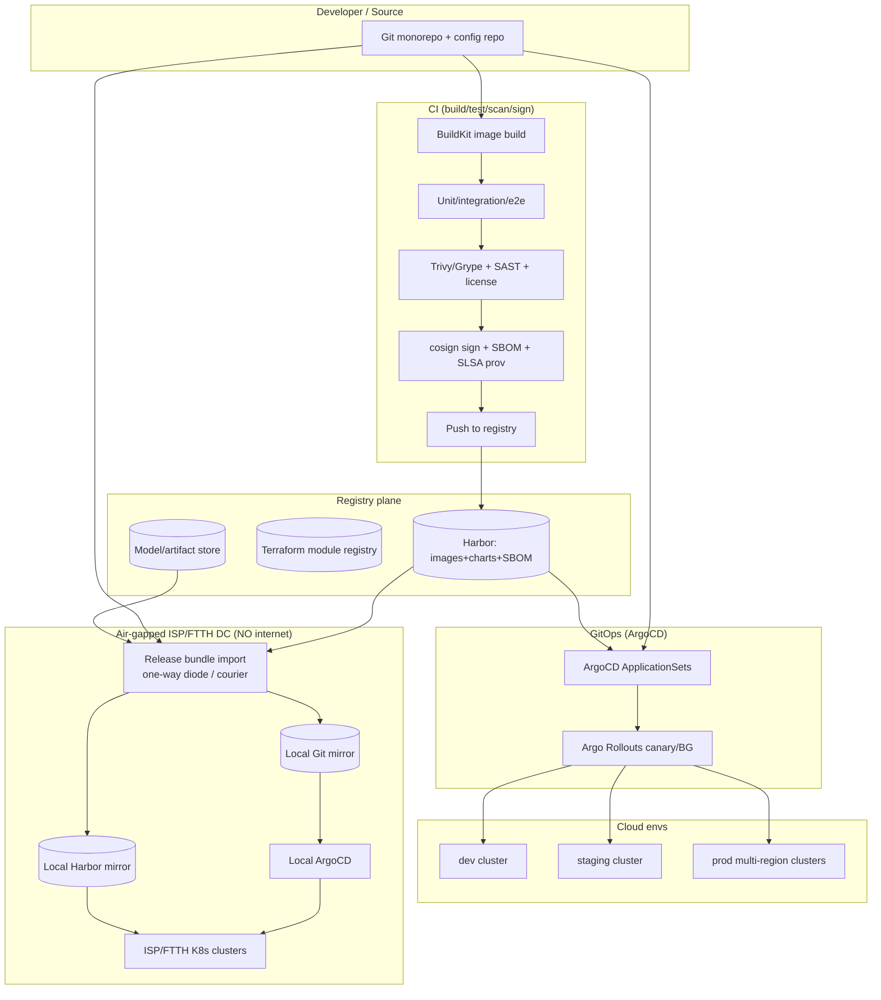
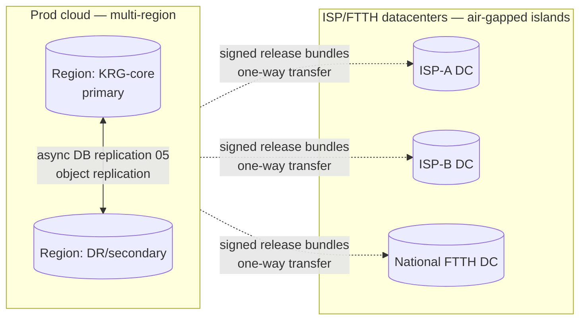
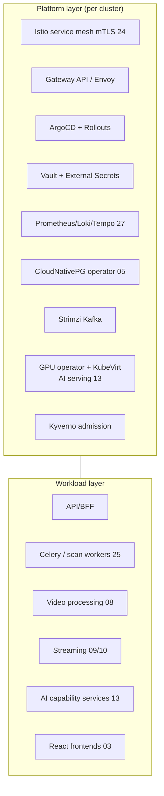
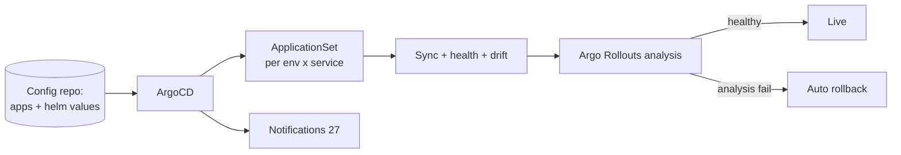
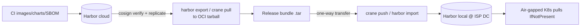
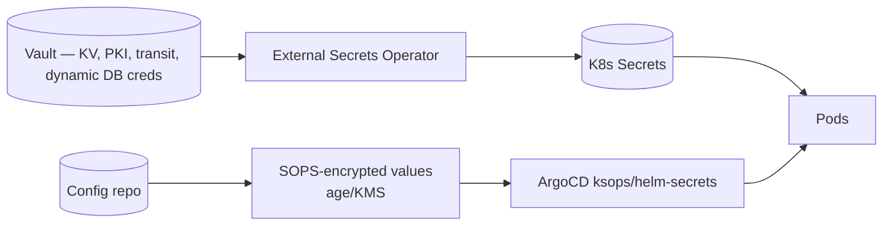
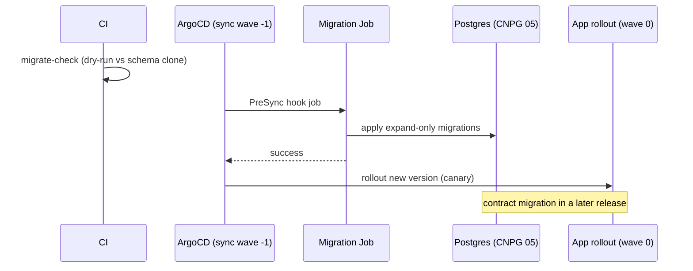
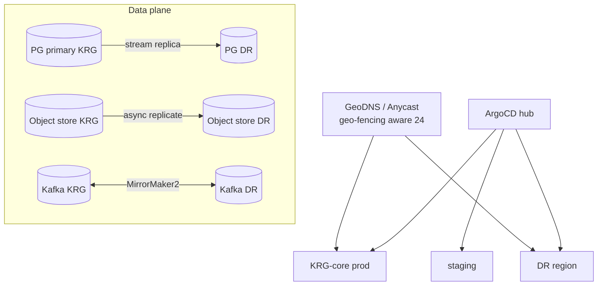
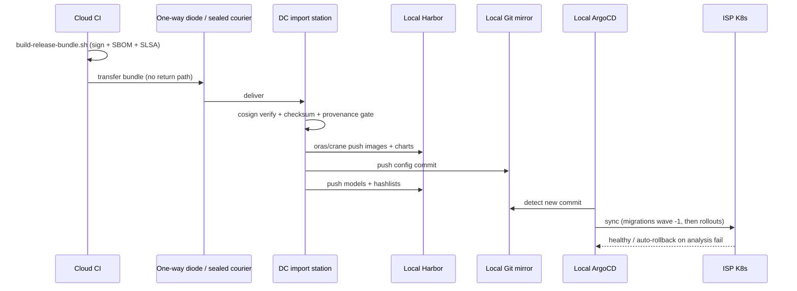

# 26 — DevOps, GitOps & Air-Gapped Delivery

> **Part E — Business, Ops & Strategy** · ZanaCloud blueprint
> **Scope:** The full delivery plane: containerization (Docker/BuildKit), Kubernetes platform, Helm packaging, ArgoCD GitOps, Terraform IaC, environment topology (dev / staging / prod + the **air-gapped Intranet/FTTH variant**), CI/CD pipelines (build → test → scan → sign → deploy with canary/blue-green), container registry + offline mirror, secrets/config management, database migrations, multi-cluster/multi-region, and the concrete procedure for **shipping a release into an ISP/FTTH datacenter with no public internet**.
> **Siblings:** [02-system-architecture.md](./02-system-architecture.md) · [05-database-architecture.md](./05-database-architecture.md) · [13-ai-systems.md](./13-ai-systems.md) · [24-security.md](./24-security.md) · [25-content-moderation.md](./25-content-moderation.md) · [27-observability.md](./27-observability.md) · [28-infrastructure-cost.md](./28-infrastructure-cost.md) · [29-scaling-strategy.md](./29-scaling-strategy.md)
> **Non-negotiables honored here:** free for users (cost-efficient infra, [28](./28-infrastructure-cost.md)); admin-approval publishing (moderation policy ships via GitOps, [25](./25-content-moderation.md)); per-category FIB payments (payment services deployed with stricter change-control); geo-fencing (region config is GitOps-managed); **Intranet/FTTH air-gapped mode is a first-class environment, not an afterthought — every artifact (images, charts, models, hash lists, policies) is built to be transported and run with NO public internet**; all uploads auto-scanned (scan workers are part of the deployable platform); centralized no-code Super Admin Panel compiles to GitOps config.

---

## 26.0 DevOps tenets

1. **GitOps is the only way to change a cluster.** Desired state lives in Git; ArgoCD reconciles. No `kubectl apply` to prod, no console clicks. The air-gapped cluster reconciles from a Git mirror inside the datacenter.
2. **Everything is an artifact with a provenance.** Images, Helm charts, Terraform modules, AI model bundles ([13](./13-ai-systems.md)), CSAM hash lists and policies ([25](./25-content-moderation.md)) are versioned, signed (cosign/SLSA), SBOM-attached, and transportable as a single **release bundle**.
3. **Air-gap parity by construction.** A release that runs in cloud prod must run unchanged in an air-gapped ISP datacenter; the only difference is *where artifacts come from* (local registry/Git mirror) and *what's disabled* (cloud-burst APIs). One Helm value flips the mode.
4. **Build once, promote the same digest.** Images are built once and promoted dev→staging→prod by digest, never rebuilt per environment. Reproducible builds.
5. **Progressive, reversible delivery.** Canary/blue-green with automated analysis and instant rollback. Payment and moderation services get extra gates.
6. **Secrets never in Git in plaintext.** SOPS-encrypted (age/KMS) or External Secrets from Vault ([24](./24-security.md)). Air-gapped uses local Vault + local KMS/HSM.
7. **Least-privilege CI/CD.** Pipelines use short-lived OIDC-federated identities; the air-gapped pipeline uses local OIDC + signed promotion tokens.

---

## 26.1 Delivery plane overview



---

## 26.2 Environment topology

| Environment | Purpose | Internet | Cluster(s) | Change control | Cloud-burst AI |
|---|---|---|---|---|---|
| **dev** | fast iteration | yes | 1 shared | PR merge | optional |
| **staging** | prod-mirror, e2e, load | yes | 1 (prod-like) | PR + auto-promote | optional |
| **prod (cloud)** | central national platform | yes | multi-region (KRG core + DR) | PR + maker-checker + canary | optional |
| **intranet/FTTH** | air-gapped ISP/private DC | **NO** | per-DC self-hosted | signed bundle + local maker-checker | **disabled** |

The intranet variant uses the **same** Helm charts and Argo Applications, parameterized by a values overlay (`values-airgap.yaml`). See §26.10.



Each air-gapped DC is an **autonomous island**: it has its own registry, Git mirror, ArgoCD, observability, AI serving, and local CDN. It receives only signed, offline release bundles — never a live connection.

---

## 26.3 Containerization (Docker / BuildKit)

Multi-stage, distroless, reproducible. Example for a Django service:

```dockerfile
# syntax=docker/dockerfile:1.9
FROM python:3.12-slim AS base
ENV PYTHONUNBUFFERED=1 PIP_NO_CACHE_DIR=1

FROM base AS build
RUN --mount=type=cache,target=/root/.cache/pip \
    pip install --prefix=/install -r /tmp/requirements.lock
COPY . /src
WORKDIR /src
RUN python -m compileall -q .

FROM gcr.io/distroless/python3-debian12:nonroot AS runtime
COPY --from=build /install /usr/local
COPY --from=build /src /app
WORKDIR /app
USER nonroot
EXPOSE 8000
ENTRYPOINT ["python","-m","gunicorn","zana.wsgi","--bind","0.0.0.0:8000",\
            "--workers","4","--worker-class","gthread"]
```

Build (reproducible + provenance), and in air-gap the base images are pre-mirrored:

```bash
docker buildx build \
  --provenance=mode=max --sbom=true \
  --cache-from type=registry,ref=harbor.zana.internal/cache/api \
  --cache-to   type=registry,ref=harbor.zana.internal/cache/api,mode=max \
  -t harbor.zana.internal/zana/api:${GIT_SHA} \
  --push .
```

Image policy (enforced by Kyverno, §26.9): distroless or pinned-digest base, runAsNonRoot, read-only rootfs, no `:latest`, signed by an allowed key.

---

## 26.4 Kubernetes platform



- **CNI:** Cilium (eBPF, network policy, mTLS-assist).
- **Node pools:** general (burstable), memory-optimized (DB/cache), GPU (AI serving + transcode, [13](./13-ai-systems.md)/[08](./08-video-processing.md)), storage (NVMe for object cache).
- **Autoscaling:** HPA + KEDA (queue-depth driven for scan/transcode workers) + Karpenter/Cluster Autoscaler in cloud; in air-gap, fixed pools with KEDA scaling within capacity ([29](./29-scaling-strategy.md)).
- **Multi-tenancy:** namespace-per-domain, NetworkPolicies default-deny, ResourceQuotas/LimitRanges.

---

## 26.5 Helm chart layout

A library chart + per-service charts + an umbrella per environment.

```
charts/
  zana-lib/                # library chart: common templates
    templates/_deployment.tpl _service.tpl _hpa.tpl _netpol.tpl _rollout.tpl
    Chart.yaml             # type: library
  services/
    api/
      Chart.yaml
      values.yaml          # defaults
      values-staging.yaml
      values-prod.yaml
      values-airgap.yaml   # registry overrides, cloud-burst off
      templates/rollout.yaml configmap.yaml externalsecret.yaml
    scan-worker/           # moderation auto-scan workers (25)
    video-processor/
    ai-serving/
    publish-service/       # enforces 25.2.3 publish authz
  umbrella/
    prod/Chart.yaml        # dependencies -> services/*
    airgap/Chart.yaml
```

Example values overlay (air-gap):

```yaml
# charts/services/api/values-airgap.yaml
global:
  airgap: true
  registry: harbor.zana.internal/zana
  imagePullPolicy: IfNotPresent
image:
  repository: "{{ .Values.global.registry }}/api"
  tag: "@sha256:DIGEST"     # promoted by digest, never :latest
ai:
  cloudBurst: false          # disable external AI APIs (13)
externalSecrets:
  backend: vault             # local Vault in the DC (24)
moderation:
  offlineHashLists: true     # CSAM lists from local mirror (25)
```

Rollout template (canary via Argo Rollouts):

```yaml
# charts/zana-lib/templates/_rollout.tpl
apiVersion: argoproj.io/v1alpha1
kind: Rollout
metadata: { name: {{ .Values.name }} }
spec:
  replicas: {{ .Values.replicas }}
  strategy:
    canary:
      canaryService: {{ .Values.name }}-canary
      stableService: {{ .Values.name }}-stable
      trafficRouting: { istio: { virtualService: { name: {{ .Values.name }}-vs } } }
      analysis:
        templates: [{ templateName: success-rate-latency }]
        startingStep: 1
      steps:
        - setWeight: 5
        - pause: { duration: 5m }
        - analysis: { templates: [{ templateName: success-rate-latency }] }
        - setWeight: 25
        - pause: { duration: 10m }
        - setWeight: 50
        - pause: { duration: 10m }
        - setWeight: 100
  template: {{- include "zana-lib.podTemplate" . | nindent 4 }}
```

Payment & publish/moderation services use **blue-green** (stricter) instead of canary — full preview verification before cutover.

---

## 26.6 ArgoCD GitOps



ApplicationSet generating apps per environment/service:

```yaml
apiVersion: argoproj.io/v1alpha1
kind: ApplicationSet
metadata: { name: zana-services, namespace: argocd }
spec:
  generators:
    - matrix:
        generators:
          - list:
              elements:
                - { env: staging, cluster: https://stg, valuesFile: values-staging.yaml }
                - { env: prod,    cluster: https://prod, valuesFile: values-prod.yaml }
                - { env: airgap,  cluster: https://isp-local, valuesFile: values-airgap.yaml }
          - git:
              repoURL: https://git.zana.internal/zana/config.git
              revision: HEAD
              directories: [{ path: charts/services/* }]
  template:
    metadata: { name: '{{path.basename}}-{{env}}' }
    spec:
      project: zana
      source:
        repoURL: https://git.zana.internal/zana/config.git
        targetRevision: HEAD
        path: '{{path}}'
        helm: { valueFiles: ['{{valuesFile}}'] }
      destination: { server: '{{cluster}}', namespace: '{{path.basename}}' }
      syncPolicy:
        automated: { prune: true, selfHeal: true }
        syncOptions: [ApplyOutOfSyncOnly=true, CreateNamespace=true]
```

- **App-of-apps** bootstraps platform components (mesh, Vault, observability) then workloads.
- **Sync waves** order migrations before app rollout (§26.11).
- **Drift detection + self-heal** ensures the air-gapped cluster cannot drift from the imported Git mirror.
- **Promotion** = a PR that bumps an image digest in the env values file; merging triggers ArgoCD sync. Air-gap promotion = importing a bundle that includes the updated Git mirror commit (§26.13).

---

## 26.7 CI/CD pipeline (build → test → scan → sign → deploy)

```mermaid
flowchart LR
    PR[PR / push] --> LINT[Lint + typecheck]
    LINT --> UT[Unit tests]
    UT --> BUILD[BuildKit image + SBOM]
    BUILD --> IT[Integration/e2e + DB migration test]
    IT --> SEC[Trivy/Grype + SAST + secrets + license + IaC scan]
    SEC --> SIGN[cosign sign + SLSA provenance attest]
    SIGN --> PUSH[Push to Harbor]
    PUSH --> PROMO_STG[GitOps PR: bump staging digest]
    PROMO_STG --> VERIFY[Staging canary analysis 27]
    VERIFY --> PROMO_PROD[GitOps PR: bump prod digest<br/>maker-checker]
    PROMO_PROD --> BUNDLE[Build air-gap release bundle]
```



Pipeline YAML (GitHub Actions / Gitea Actions self-hosted — both supported; air-gap uses self-hosted runners):

```yaml
name: ci-cd
on: { push: { branches: [main] }, pull_request: {} }
permissions: { id-token: write, contents: read, packages: write }
jobs:
  test:
    runs-on: [self-hosted, zana]
    steps:
      - uses: actions/checkout@v4
      - run: make lint typecheck
      - run: make test            # pytest + jest, coverage gate
      - run: make migrate-check    # dry-run migrations vs prod schema clone (05)

  build-scan-sign:
    needs: test
    runs-on: [self-hosted, zana]
    steps:
      - uses: actions/checkout@v4
      - id: build
        run: |
          docker buildx build --provenance=mode=max --sbom=true \
            -t harbor.zana.internal/zana/api:${GITHUB_SHA} --push .
          echo "digest=$(crane digest harbor.zana.internal/zana/api:${GITHUB_SHA})" >>$GITHUB_OUTPUT
      - name: vuln + sast + secrets + license
        run: |
          trivy image --exit-code 1 --severity HIGH,CRITICAL harbor.zana.internal/zana/api@${{steps.build.outputs.digest}}
          semgrep ci
          gitleaks detect --no-git
          trivy fs --scanners license --exit-code 1 .
          checkov -d infra/                       # IaC scan
      - name: sign + attest (keyless OIDC in cloud, local key in airgap)
        run: |
          cosign sign --yes harbor.zana.internal/zana/api@${{steps.build.outputs.digest}}
          cosign attest --yes --predicate sbom.spdx.json --type spdxjson \
            harbor.zana.internal/zana/api@${{steps.build.outputs.digest}}

  promote-staging:
    needs: build-scan-sign
    runs-on: [self-hosted, zana]
    steps:
      - run: ./scripts/gitops-bump.sh staging api ${{ needs.build-scan-sign.outputs.digest }}
      # opens PR to config repo; ArgoCD syncs; Argo Rollouts runs canary analysis

  promote-prod:
    needs: promote-staging
    environment: production          # requires maker-checker approval
    runs-on: [self-hosted, zana]
    steps:
      - run: ./scripts/gitops-bump.sh prod api ${{ needs.build-scan-sign.outputs.digest }}

  build-airgap-bundle:
    needs: promote-prod
    runs-on: [self-hosted, zana]
    steps:
      - run: ./scripts/build-release-bundle.sh ${{ needs.build-scan-sign.outputs.digest }}
```

**Quality gates (fail the pipeline):** coverage threshold, HIGH/CRITICAL CVEs (unless waiver-signed), SAST findings, leaked secrets, disallowed licenses, failing migration dry-run, unsigned image.

---

## 26.8 Container registry + offline mirror



- **Harbor** holds OCI images, Helm charts (OCI), SBOMs, signatures; with Trivy scan-on-push and content-trust (cosign verification policy).
- **Replication rules** mirror approved tags to a staging area; an export job packs them as OCI tarballs (`crane`/`oras`) for transport.
- **Local Harbor** in each air-gapped DC is the only image source; Kyverno enforces `imagePullPolicy` and registry allowlist (`harbor.zana.internal/*`).
- Proxy-cache pull-through is disabled in air-gap (no upstream); images must be pre-loaded.

---

## 26.9 Policy-as-code (Kyverno / OPA Gatekeeper)

Admission policies enforce the security/air-gap invariants:

```yaml
# kyverno: only signed images from the local/allowed registry
apiVersion: kyverno.io/v1
kind: ClusterPolicy
metadata: { name: require-signed-internal-images }
spec:
  validationFailureAction: Enforce
  rules:
    - name: registry-allowlist
      match: { any: [{ resources: { kinds: [Pod] } }] }
      validate:
        message: "images must come from harbor.zana.internal"
        pattern: { spec: { containers: [{ image: "harbor.zana.internal/*" }] } }
    - name: verify-signature
      match: { any: [{ resources: { kinds: [Pod] } }] }
      verifyImages:
        - imageReferences: ["harbor.zana.internal/zana/*"]
          attestors: [{ entries: [{ keys: { publicKeys: |-
              -----BEGIN PUBLIC KEY-----
              ...zana cosign pubkey...
              -----END PUBLIC KEY----- } }] }]
```

```yaml
# kyverno: hardening - nonroot, no :latest, read-only rootfs
apiVersion: kyverno.io/v1
kind: ClusterPolicy
metadata: { name: pod-hardening }
spec:
  validationFailureAction: Enforce
  rules:
    - name: nonroot-readonly
      match: { any: [{ resources: { kinds: [Pod] } }] }
      validate:
        pattern:
          spec:
            =(securityContext): { runAsNonRoot: true }
            containers:
              - image: "!*:latest"
                securityContext: { readOnlyRootFilesystem: true, allowPrivilegeEscalation: false }
```

These complement the OPA/Rego authorization and moderation policies in [24](./24-security.md) and [25](./25-content-moderation.md), all GitOps-managed.

---

## 26.10 Secrets & config management



- **Vault** for dynamic DB creds ([05](./05-database-architecture.md)), PKI (mesh certs), transit encryption, FIB payment keys (air-gapped: local HSM-backed Vault, [24](./24-security.md)).
- **External Secrets Operator** projects Vault secrets into the cluster; nothing sensitive in Git.
- **SOPS** for the small set of config-as-code secrets, encrypted with age/KMS — in air-gap, the local KMS/HSM holds the key.
- **ConfigMaps** for non-secret config; **per-region/per-category** runtime config (geo, moderation policy) flows through the GitOps config repo so the Super Admin Panel changes are auditable ([25](./25-content-moderation.md)).

---

## 26.11 Database migrations



- **Expand/contract (zero-downtime):** additive schema change → deploy code using both → backfill → switch reads → drop old in a later release. Never a breaking change in one shot.
- **Tooling:** Django migrations wrapped in an Argo **PreSync hook Job** (sync wave `-1`), idempotent, with advisory locks to serialize across replicas.
- **Safety:** dry-run against a schema clone in CI; online DDL (pg `CONCURRENTLY`, `pg-osc`/`reshape` for heavy tables); automatic rollback plan recorded.
- **Air-gap:** migrations ship inside the bundle and run via the same PreSync hook in the local cluster; no external migration service.

```yaml
apiVersion: batch/v1
kind: Job
metadata:
  name: api-migrate
  annotations:
    argocd.argoproj.io/hook: PreSync
    argocd.argoproj.io/sync-wave: "-1"
    argocd.argoproj.io/hook-delete-policy: HookSucceeded
spec:
  backoffLimit: 2
  template:
    spec:
      restartPolicy: Never
      containers:
        - name: migrate
          image: harbor.zana.internal/zana/api@sha256:DIGEST
          command: ["python","manage.py","migrate","--noinput"]
          envFrom: [{ secretRef: { name: api-db } }]
```

---

## 26.12 Multi-cluster / multi-region



- **Topology:** central national prod (KRG-core primary + DR), plus N autonomous air-gapped ISP islands.
- **Data:** Postgres streaming replication + object async replication + Kafka MirrorMaker2 ([05](./05-database-architecture.md)). Geo-fencing config replicated via GitOps so a region serves only what policy permits ([24](./24-security.md), [25](./25-content-moderation.md)).
- **Failover:** DR promotion runbook ([27](./27-observability.md)); RTO/RPO targets in [29-scaling-strategy.md](./29-scaling-strategy.md).
- **Air-gap islands do not replicate to cloud** — they are sovereign; only signed bundles flow in.

---

## 26.13 Shipping to an air-gapped ISP/FTTH datacenter

This is the centerpiece operational procedure.

### 26.13.1 Release bundle contents

```
release-2026.06.0.tar (signed, integrity-manifested)
├── manifest.json            # versions, digests, signatures, checksums
├── images/                  # OCI tarballs (all service + platform images)
├── charts/                  # Helm charts (OCI)
├── config/                  # git mirror commit (apps, values-airgap, policies 25)
├── models/                  # AI model bundles, pinned (13)
├── hashlists/               # CSAM/IWF mirror artifacts, signed (25)
├── migrations/              # DB migration artifacts
├── observability/           # dashboards, alert rules (27)
└── SLSA-provenance + cosign signatures + SBOMs
```

### 26.13.2 Transfer & import flow



### 26.13.3 Import script (sketch)

```bash
#!/usr/bin/env bash
set -euo pipefail
BUNDLE=$1
# 1) verify integrity + signatures before anything touches the cluster
cosign verify-blob --key /etc/zana/cosign.pub --signature "$BUNDLE.sig" "$BUNDLE"
tar xf "$BUNDLE" -C /import && cd /import
sha256sum -c manifest.sha256
# 2) load images & charts into local Harbor
for img in images/*.tar; do crane push "$img" "harbor.zana.internal/$(basename ${img%.tar})"; done
oras push harbor.zana.internal/charts ./charts/*.tgz
# 3) load models + offline hash lists (13 / 25)
oras push harbor.zana.internal/models   ./models/*
oras push harbor.zana.internal/hashlists ./hashlists/*
# 4) advance the local Git mirror -> ArgoCD reconciles
git -C /srv/git/config fetch /import/config && git -C /srv/git/config merge --ff-only FETCH_HEAD
echo "Import complete; ArgoCD will sync. Models/hashlists freshness exported to 27."
```

### 26.13.4 Constraints honored

- **No inbound network path** from the DC to the internet; transfer is one-way (data diode) or sealed physical media with verified provenance.
- **Fail-closed verification:** an unsigned/tampered bundle is rejected at the import station — it never reaches Harbor or Git.
- **Freshness monitoring:** model-bundle and CSAM-hash-list age are exported as metrics ([27](./27-observability.md)); stale safety artifacts alert and can gate publishing per [25](./25-content-moderation.md).
- **Rollback:** the previous Git commit + previous image digests remain in local Harbor; ArgoCD can revert by checking out the prior config commit.

---

## 26.14 Terraform IaC

### 26.14.1 Module layout

```
infra/
  modules/
    network/          # VPC/VLANs, subnets, peering, firewall
    k8s-cluster/      # control plane + node pools (cloud) | bare-metal kubeadm/Talos (airgap)
    registry/         # Harbor
    database/         # CNPG / managed PG (05)
    object-store/     # S3-compatible / MinIO (airgap)
    observability/    # Prometheus/Loki/Tempo (27)
    vault/            # secrets + PKI (24)
    cdn/              # cloud CDN | local CDN nodes (09)
  envs/
    staging/  main.tf  backend.tf  staging.tfvars
    prod/     main.tf  backend.tf  prod.tfvars
    airgap-isp-a/ main.tf  airgap.tfvars   # bare-metal, MinIO, local everything
  global/
    dns/  policies/  iam/
```

### 26.14.2 Example module usage

```hcl
# infra/envs/prod/main.tf
module "k8s" {
  source            = "../../modules/k8s-cluster"
  cluster_name      = "krg-core"
  region            = "krg-core"
  node_pools = {
    general = { size = "8xlarge", min = 6, max = 40 }
    gpu     = { size = "gpu-a", min = 2, max = 12, taints = ["nvidia.com/gpu"] }  # AI 13 / transcode 08
    storage = { size = "nvme-l", min = 3, max = 9 }
  }
  air_gapped        = false
}

module "database" {
  source        = "../../modules/database"
  engine        = "cloudnative-pg"
  ha            = true
  replicas      = 3
  cross_region_dr = "dr-secondary"   # 05 / 26.12
}
```

```hcl
# infra/envs/airgap-isp-a/airgap.tfvars  — no public internet primitives
air_gapped         = true
k8s_distribution   = "talos"          # bare-metal, immutable
object_store       = "minio"          # S3-compatible, local
registry           = "harbor-local"
cdn                = "local-cdn-nodes"  # 09
ai_serving         = "local-gpu-only"   # 13, cloud-burst disabled
secrets_kms        = "local-hsm"        # 24
```

- **State:** remote backend (encrypted) for cloud; in air-gap, state lives on a local backend (MinIO/Consul) inside the DC.
- **Bare-metal:** air-gapped clusters use Talos/kubeadm on ISP hardware; Terraform drives provisioning + MetalLB/Cilium for L2/L3 VIPs.
- **Scanned:** `checkov`/`tfsec` in CI (§26.7); modules versioned in the internal Terraform registry.

---

## 26.15 Cross-references

- System & data plane this delivers: [02-system-architecture.md](./02-system-architecture.md), [05-database-architecture.md](./05-database-architecture.md)
- Image signing, Vault/KMS, registry allowlist, zero-trust admission: [24-security.md](./24-security.md)
- Moderation policy GitOps + offline hash-list delivery: [25-content-moderation.md](./25-content-moderation.md)
- AI model bundles, GPU serving, cloud-burst toggle: [13-ai-systems.md](./13-ai-systems.md)
- Canary analysis metrics, alerting, freshness monitoring, runbooks: [27-observability.md](./27-observability.md)
- Cost-aware node pools & efficiency: [28-infrastructure-cost.md](./28-infrastructure-cost.md)
- Autoscaling, multi-region failover, RTO/RPO: [29-scaling-strategy.md](./29-scaling-strategy.md)
```
