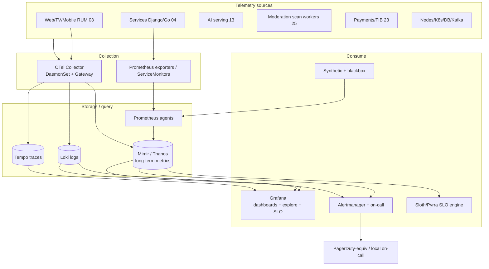
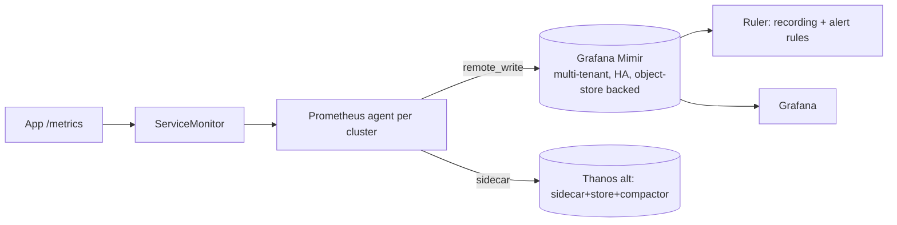
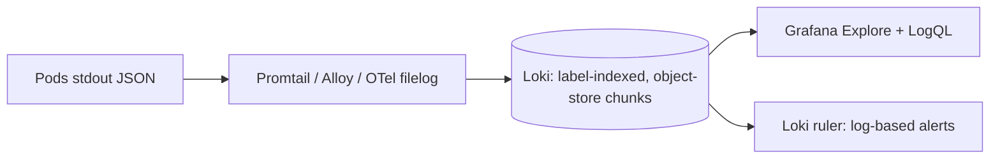
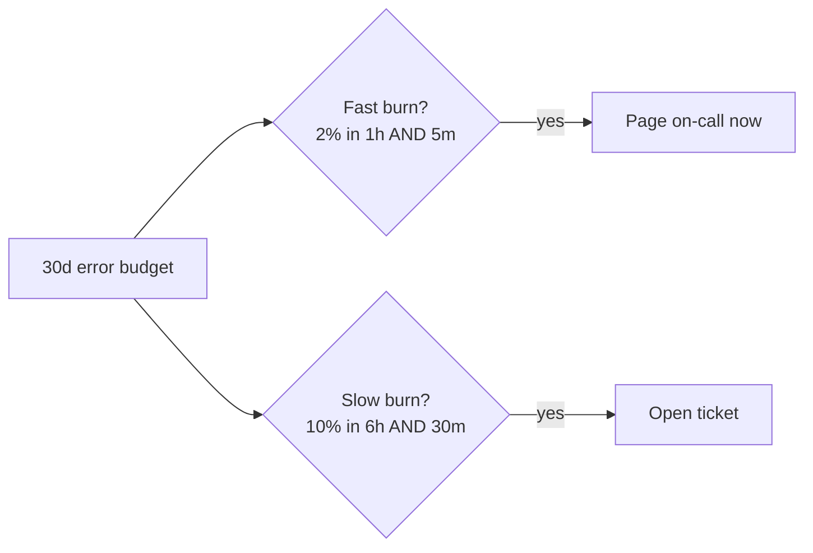
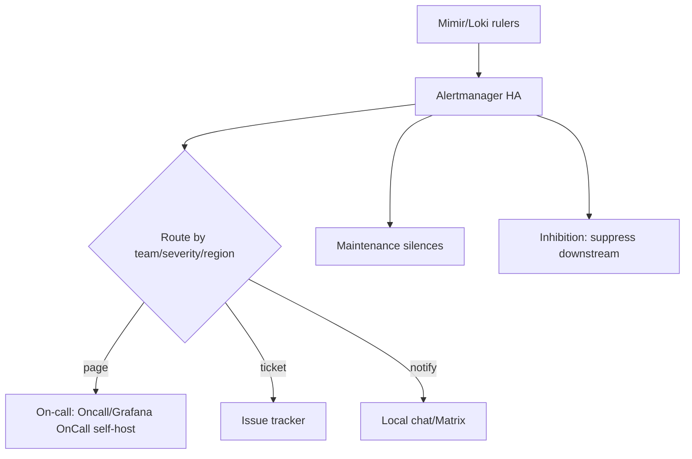
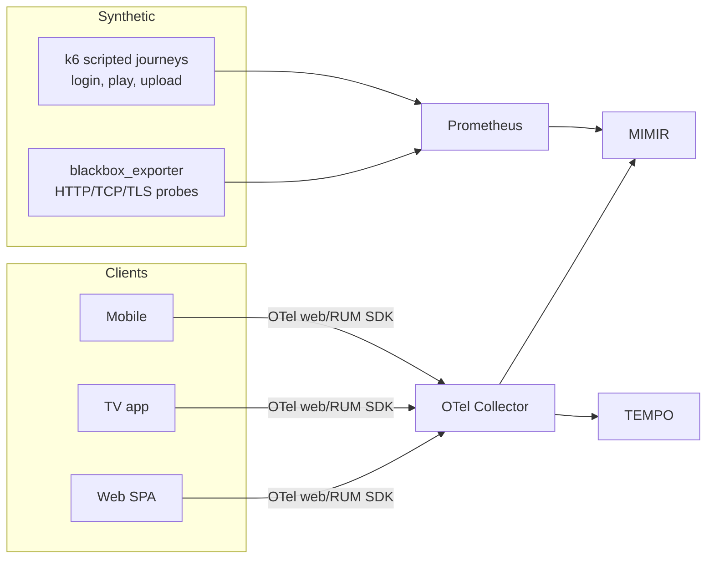
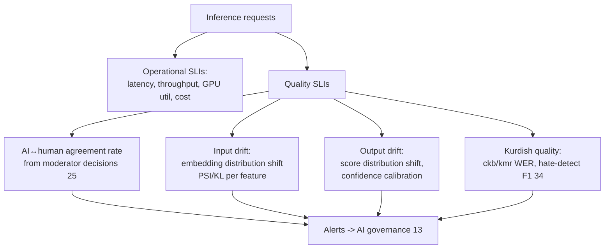
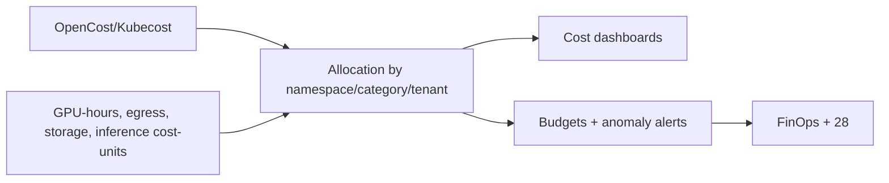
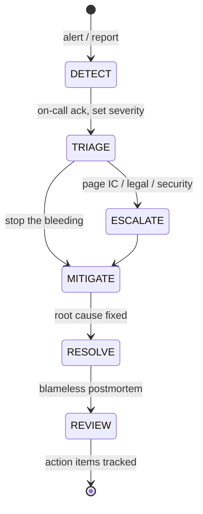
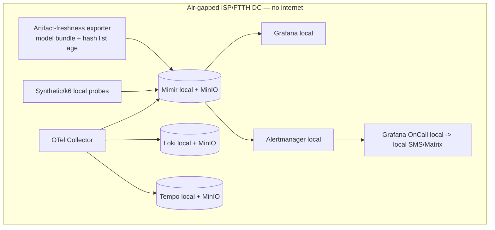

# 27 — Observability, SLOs & Incident Management

> **Part E — Business, Ops & Strategy** · ZanaCloud blueprint
> **Scope:** The full observability plane: metrics (Prometheus → Mimir/Thanos), dashboards (Grafana), logs (Loki), traces (OpenTelemetry → Tempo), SLOs/SLIs & error budgets, alerting (Alertmanager + on-call), RUM & synthetic monitoring, cost observability, **ML/AI model observability (drift/quality)**, incident management & runbooks, and a fully **air-gapped/Intranet observability stack** that runs with no public internet or SaaS APM.
> **Siblings:** [02-system-architecture.md](./02-system-architecture.md) · [05-database-architecture.md](./05-database-architecture.md) · [13-ai-systems.md](./13-ai-systems.md) · [21-analytics.md](./21-analytics.md) · [24-security.md](./24-security.md) · [25-content-moderation.md](./25-content-moderation.md) · [26-devops.md](./26-devops.md) · [28-infrastructure-cost.md](./28-infrastructure-cost.md) · [29-scaling-strategy.md](./29-scaling-strategy.md)
> **Non-negotiables honored here:** free for users (we watch the cost of "free", §27.9); admin-approval publishing (we SLO the moderation pipeline & alert on backlog/SLA breach, [25](./25-content-moderation.md)); per-category FIB payments (payment success-rate SLOs + fraud-signal alerts); geo-fencing (per-region SLIs, leak alerts); **Intranet/FTTH air-gapped mode → the entire stack is self-hosted; no Datadog/NewRelic/Grafana-Cloud dependency; offline artifact-freshness is itself observed**; all uploads auto-scanned (scan-pipeline observability); centralized no-code Super Admin Panel (its config changes are traced & audited).

---

## 27.0 Observability tenets

1. **Three pillars, one trace context.** Metrics, logs, and traces are correlated by `trace_id`/`span_id` and shared resource labels (service, region, category, tenant). One click pivots metric → trace → logs.
2. **OpenTelemetry everywhere, vendor-neutral.** All telemetry uses OTel SDKs + the OTel Collector. No vendor agent lock-in → trivial to run air-gapped.
3. **SLOs over vanity metrics.** We measure user-facing SLIs (latency, availability, freshness) and burn **error budgets**; alerts fire on **symptoms and budget burn**, not every CPU blip.
4. **Self-hosted by default.** Prometheus/Mimir, Loki, Tempo, Grafana, Alertmanager — all run inside our clusters. The air-gapped DC runs the identical stack, just isolated.
5. **Air-gap parity & freshness.** In air-gapped mode the safety-critical offline artifacts (AI model bundles, CSAM hash lists, [25](./25-content-moderation.md)/[26](./26-devops.md)) have their **age** monitored; staleness pages.
6. **AI is observed like any tier-1 service — plus drift/quality.** Model latency, cost, agreement-with-humans, and drift are first-class SLIs ([13](./13-ai-systems.md)).
7. **Cardinality is budgeted.** Labels are governed; high-cardinality dimensions (user_id) go to logs/exemplars/traces, not metric labels.
8. **Runbooks are linked from alerts.** Every alert carries a `runbook_url`; on-call never starts from zero.

---

## 27.1 Observability plane overview



All components are deployed via Helm/ArgoCD ([26](./26-devops.md)); the air-gapped variant is the same chart with `values-airgap.yaml`.

---

## 27.2 Metrics: Prometheus → Mimir/Thanos



- **Per-cluster Prometheus** in agent mode `remote_write`s to **Mimir** (horizontally scalable, multi-tenant per region/ISP, object-store backed — MinIO in air-gap). Thanos is the alternative where a sidecar model is preferred.
- **Recording rules** precompute SLI ratios; **alerting rules** evaluated in the Mimir ruler.
- **Cardinality governance:** allowlisted labels (`service, region, category, env, cluster`); `user_id`/`content_id` never become metric labels (use exemplars → traces).
- **Retention:** 15d raw, 13mo downsampled in Mimir; air-gapped DCs keep local retention sized to local storage ([28](./28-infrastructure-cost.md)).

Example service instrumentation (Python/OTel + Prom):

```python
from opentelemetry import metrics
meter = metrics.get_meter("zana.publish")
publish_latency = meter.create_histogram(
    "publish_decision_latency_seconds",
    description="time from PENDING to APPROVED/REJECTED", unit="s")
queue_depth = meter.create_observable_gauge(
    "moderation_queue_depth", callbacks=[depth_cb])  # per queue/region (25)

def on_decision(review, dt):
    publish_latency.record(dt, {"category": review.category, "region": review.region,
                                "decision": review.state})
```

---

## 27.3 Logging: Loki



- **Structured JSON logs** with `trace_id`, `span_id`, `service`, `region`, `category`, `tenant`. Correlate to traces in one click.
- **Loki** indexes labels only (low cardinality); body searched via LogQL. Object-store backed (MinIO in air-gap).
- **PII discipline:** payment PANs, tokens, and CSAM-related content are never logged ([24](./24-security.md)/[25](./25-content-moderation.md)); a redaction processor in the OTel pipeline scrubs sensitive fields.
- **Audit logs** (moderation decisions, admin actions) go to the tamper-evident audit lake ([25](./25-content-moderation.md) §25.13), *not* Loki — Loki is for operational logs.

---

## 27.4 Tracing: OpenTelemetry → Tempo

```mermaid
sequenceDiagram
    participant U as Client (RUM)
    participant GW as API Gateway
    participant API as Service
    participant AI as AI Scan (13/25)
    participant DB as Postgres
    U->>GW: request (traceparent)
    GW->>API: propagate context
    API->>AI: moderation.scan (child span)
    API->>DB: query (child span)
    Note over U,DB: one trace_id end-to-end; exemplars link metrics->trace
```

```yaml
# otel-collector (gateway) — pipelines
receivers: { otlp: { protocols: { grpc: {}, http: {} } } }
processors:
  batch: {}
  memory_limiter: { check_interval: 1s, limit_percentage: 80 }
  resourcedetection: { detectors: [env, k8snode] }
  attributes/redact:
    actions:
      - { key: http.request.header.authorization, action: delete }
      - { key: user.pan, action: delete }
  tail_sampling:
    policies:
      - { name: errors, type: status_code, status_code: { status_codes: [ERROR] } }
      - { name: slow, type: latency, latency: { threshold_ms: 800 } }
      - { name: baseline, type: probabilistic, probabilistic: { sampling_percentage: 5 } }
exporters:
  otlp/tempo: { endpoint: tempo:4317, tls: { insecure: true } }   # in-cluster mTLS via mesh
  prometheusremotewrite: { endpoint: http://mimir/api/v1/push }
  loki: { endpoint: http://loki:3100/loki/api/v1/push }
service:
  pipelines:
    traces:  { receivers: [otlp], processors: [memory_limiter,attributes/redact,tail_sampling,batch], exporters: [otlp/tempo] }
    metrics: { receivers: [otlp], processors: [memory_limiter,batch], exporters: [prometheusremotewrite] }
    logs:    { receivers: [otlp], processors: [memory_limiter,attributes/redact,batch], exporters: [loki] }
```

- **Tail-based sampling** keeps all errors/slow traces + 5% baseline → low storage, high signal.
- **Trace exemplars** attach `trace_id` to histograms so a latency spike jumps straight to the offending trace.

---

## 27.5 SLOs / SLIs & error budgets

### 27.5.1 Service SLO catalog

| Service / journey | SLI | SLO target | Window | Error budget |
|---|---|---|---|---|
| API availability | success rate (non-5xx) | 99.9% | 30d | 43m |
| Playback start | p95 start-time < 2s | 99% | 30d | 7.2h |
| Video upload | upload success rate | 99.5% | 30d | 3.6h |
| **Moderation pipeline** ([25](./25-content-moderation.md)) | % items decided within SLA | 99% | 30d | 7.2h |
| **Publish freshness** | PENDING→PUBLISHED p95 < category SLA | 99% | 30d | 7.2h |
| **FIB payment** ([23]) | auth success rate (excl. user error) | 99.95% | 30d | 21m |
| Search | p95 query < 300ms | 99% | 30d | 7.2h |
| AI moderation scan ([13](./13-ai-systems.md)) | p95 scan < 30s (standard) | 98% | 30d | 14.4h |
| Live latency | glass-to-glass < 6s (LL-HLS) | 95% | 7d | — |

### 27.5.2 SLO-as-code (Sloth/Pyrra → Prometheus rules)

```yaml
# sloth: API availability SLO -> generates multi-window burn-rate alerts
version: prometheus/v1
service: api
slos:
  - name: api-availability
    objective: 99.9
    sli:
      events:
        error_query: sum(rate(http_requests_total{job="api",code=~"5.."}[{{.window}}]))
        total_query: sum(rate(http_requests_total{job="api"}[{{.window}}]))
    alerting:
      name: APIHighErrorBudgetBurn
      labels: { team: platform, severity: page }
      annotations: { runbook_url: "https://runbooks.zana.internal/api-availability" }
      page_alert:   { labels: { severity: page } }
      ticket_alert: { labels: { severity: ticket } }
```

### 27.5.3 Multi-window, multi-burn-rate alerting



Burn-rate (not raw threshold) alerting prevents pager fatigue: short+long windows must *both* breach. When budget is exhausted, the **error-budget policy** ([26](./26-devops.md)) freezes risky deploys for that service until recovered.

---

## 27.6 Alerting & on-call



```yaml
# alertmanager routing (excerpt)
route:
  receiver: default
  group_by: [alertname, region, service]
  routes:
    - matchers: [severity="page", team="payments"]
      receiver: payments-oncall
      group_wait: 0s
    - matchers: [alertname="ModerationSLABreach"]   # 25
      receiver: trust-safety-oncall
    - matchers: [alertname="CSAMEscalationStuck"]
      receiver: legal-oncall
      group_wait: 0s
    - matchers: [alertname="OfflineHashListStale"]   # air-gap freshness
      receiver: airgap-ops
inhibit_rules:
  - source_matchers: [alertname="ClusterDown"]
    target_matchers: [severity="page"]
    equal: [cluster]
```

Example alert rules:

```yaml
groups:
  - name: moderation
    rules:
      - alert: ModerationSLABreach
        expr: |
          sum by (queue,region) (rate(moderation_queue_sla_breach_total[10m])) > 0
        for: 5m
        labels: { severity: page, team: trust-safety }
        annotations:
          summary: "Moderation SLA breaches in {{ $labels.queue }}/{{ $labels.region }}"
          runbook_url: "https://runbooks.zana.internal/moderation-sla"
      - alert: PublishFreshnessSLOBurn
        expr: publish_freshness_burn_rate_1h > 14.4 and publish_freshness_burn_rate_5m > 14.4
        for: 2m
        labels: { severity: page, team: trust-safety }
  - name: airgap
    rules:
      - alert: OfflineHashListStale       # 25/26 freshness
        expr: moderation_offline_artifact_age_days{kind="csam_hashlist"} > 7
        for: 10m
        labels: { severity: page, team: airgap-ops }
        annotations: { runbook_url: "https://runbooks.zana.internal/hashlist-refresh" }
      - alert: ModelBundleStale
        expr: ai_model_bundle_age_days > 30
        for: 30m
        labels: { severity: ticket, team: ai-platform }
  - name: payments
    rules:
      - alert: FIBAuthSuccessLow
        expr: |
          sum(rate(fib_auth_total{result="success"}[10m]))
          / sum(rate(fib_auth_total[10m])) < 0.999
        for: 5m
        labels: { severity: page, team: payments }
```

On-call uses **self-hosted Grafana OnCall** (no PagerDuty SaaS dependency) so air-gapped DCs page local rotations via local SMS/Matrix gateways.

---

## 27.7 RUM & synthetic monitoring



- **RUM:** Core Web Vitals (LCP/INP/CLS), playback QoE (start time, rebuffer ratio, bitrate), per device class & region — device-specific UX is measured per device profile ([03](./03-frontend-architecture.md)). Kurdish-locale RTL render metrics tracked.
- **Synthetic:** blackbox probes (TLS expiry, endpoint health) + **k6 user journeys** (login → browse → play → upload → moderation submit) run from each region and from inside each air-gapped DC against local endpoints.
- **Geo-fence verification:** synthetic probes from each region assert that geo-restricted content is correctly blocked/served (a *fence leak* fires a security alert, [24](./24-security.md)/[25](./25-content-moderation.md)).

---

## 27.8 ML/AI model observability (drift & quality)

The AI plane ([13](./13-ai-systems.md)) is observed both operationally and for **drift/quality** — critical because AI gates moderation ([25](./25-content-moderation.md)).



| Signal | Metric | Alert condition |
|---|---|---|
| Latency | `ai_inference_latency_seconds` p95 | > SLO (§27.5) |
| Cost | `ai_inference_cost_units_total` | budget burn ([28](./28-infrastructure-cost.md)) |
| Agreement | `ai_human_agreement_ratio` per class | drop > 5pp week-over-week |
| Input drift | `ai_input_psi` (population stability) | PSI > 0.2 |
| Score drift | `ai_score_kl_divergence` | sustained shift |
| Calibration | `ai_confidence_ece` (expected cal. error) | > threshold |
| QA reversal | `moderation_autoapprove_reversal_ratio` | > policy → auto-disable auto-approve ([25](./25-content-moderation.md)) |
| Kurdish quality | `kurdish_asr_wer`, `kurdish_hate_f1` | regression ([34](./34-kurdish-language-intelligence.md)) |

Drift/agreement regressions notify **AI governance** ([13](./13-ai-systems.md)); a severe moderation-agreement drop can auto-tighten routing (more items to humans) — fail-closed. In air-gap, drift is computed locally on the local inference stream; no telemetry leaves the DC.

---

## 27.9 Cost observability



- **OpenCost/Kubecost** allocates spend by namespace → mapped to **per-category** cost (critical because the platform is free for users but monetized per category via FIB, [23]/[28](./28-infrastructure-cost.md)).
- **Unit economics:** cost per stream-hour, per transcode, per AI scan, per GB stored/egressed.
- **Anomaly alerts:** sudden GPU-hour or egress spikes page FinOps; ties into [28-infrastructure-cost.md](./28-infrastructure-cost.md) and [29-scaling-strategy.md](./29-scaling-strategy.md).
- Air-gapped DCs track **local hardware utilization** (capacity, not cloud bill) so ISPs see headroom and capacity-plan.

---

## 27.10 Incident management & runbooks

### 27.10.1 Lifecycle



### 27.10.2 Severity matrix

| Sev | Definition | Response | Examples |
|---|---|---|---|
| **SEV1** | platform down / data loss / illegal-content exposure | IC + page all, comms | region outage, CSAM served, payment DB loss |
| **SEV2** | major degradation | page owning team | playback failing in a region, moderation backlog SLA breach |
| **SEV3** | minor / single-feature | ticket, business hours | one category slow, dashboard gap |

### 27.10.3 Runbook structure (every alert links one)

```markdown
# Runbook: ModerationSLABreach
Severity: SEV2 | Owner: Trust & Safety on-call
Symptoms: moderation_queue_sla_breach_total > 0; queue depth rising.
Diagnose:
  1. Grafana "Queue Health" — which queue/region? (25.7)
  2. Inflow vs throughput; reviewer staffing; AI scan latency (27.8)
  3. Check OfflineHashListStale / ModelBundleStale (air-gap)
Mitigate:
  - Surge reviewers / reprioritize P0/P1 (25.5)
  - If AI scan is the bottleneck: scale scan workers (KEDA, 26)
  - Provisional-publish stays OFF; never auto-publish to clear backlog
Escalate: > SLA p99 -> T&S manager; illegal-content stuck -> legal-oncall
Postmortem: required for SEV1/SEV2.
```

Key runbooks: region failover (DR promotion, [26](./26-devops.md)/[29](./29-scaling-strategy.md)), payment outage, moderation SLA breach, CSAM escalation stuck ([25](./25-content-moderation.md)), AI drift response ([13](./13-ai-systems.md)), air-gap artifact refresh ([26](./26-devops.md)), geo-fence leak ([24](./24-security.md)).

### 27.10.4 Postmortems

Blameless, within 5 business days for SEV1/SEV2; includes timeline (reconstructed from traces/logs), impact, root cause, and tracked action items. Recurring incidents feed SLO/alert tuning.

---

## 27.11 Air-gapped / Intranet observability



| Concern | Cloud form | Air-gapped form |
|---|---|---|
| Metrics LTS | Mimir + cloud object store | Mimir + MinIO local |
| Logs | Loki + cloud object store | Loki + MinIO local |
| Traces | Tempo + cloud object store | Tempo + MinIO local |
| Dashboards | Grafana (+ Grafana Cloud option) | Grafana local only |
| Paging | Grafana OnCall / PagerDuty | Grafana OnCall → local SMS/Matrix gateway |
| Synthetic | external probers | in-DC k6/blackbox against local endpoints |
| Freshness | n/a | **mandatory:** hash-list & model-bundle age exporter → `OfflineHashListStale`/`ModelBundleStale` |
| Telemetry egress | central aggregation | **none** — all telemetry stays in the DC (sovereignty) |

The freshness exporter is the air-gap-specific safety net: because [25](./25-content-moderation.md) safety depends on offline-synced artifacts, their age is a tier-1 SLI and pages when stale.

---

## 27.12 Standard telemetry contract (resource attributes)

Every signal carries these so cross-pillar correlation works:

```yaml
resource_attributes:
  service.name: "publish-service"
  service.version: "2026.06.0"
  deployment.environment: "prod|staging|airgap-isp-a"
  cloud.region | dc.id: "krg-core | isp-a"
  zana.category_id: "kurdish-cinema"     # per-category observability (07)
  zana.tenant: "national | isp-a"
  k8s.namespace.name | k8s.pod.name: "…"
```

This lets a single Grafana query slice by **category** and **region** — the two dimensions the platform's non-negotiables (per-category monetization, geo-fencing) demand.

---

## 27.13 Cross-references

- What we instrument: [02-system-architecture.md](./02-system-architecture.md), [04-backend-services.md](./04-backend-services.md)
- DB metrics, replication lag SLOs: [05-database-architecture.md](./05-database-architecture.md)
- AI model serving, drift response, governance: [13-ai-systems.md](./13-ai-systems.md)
- Moderation SLAs, queue metrics, freshness, CSAM-escalation alerts: [25-content-moderation.md](./25-content-moderation.md)
- Deploy/canary analysis, error-budget freeze, air-gap artifact delivery: [26-devops.md](./26-devops.md)
- Cost allocation & FinOps: [28-infrastructure-cost.md](./28-infrastructure-cost.md)
- Autoscaling signals & failover RTO/RPO: [29-scaling-strategy.md](./29-scaling-strategy.md)
- Geo-fence leak alerts & security signals: [24-security.md](./24-security.md)
- Kurdish quality SLIs: [34-kurdish-language-intelligence.md](./34-kurdish-language-intelligence.md)
```
