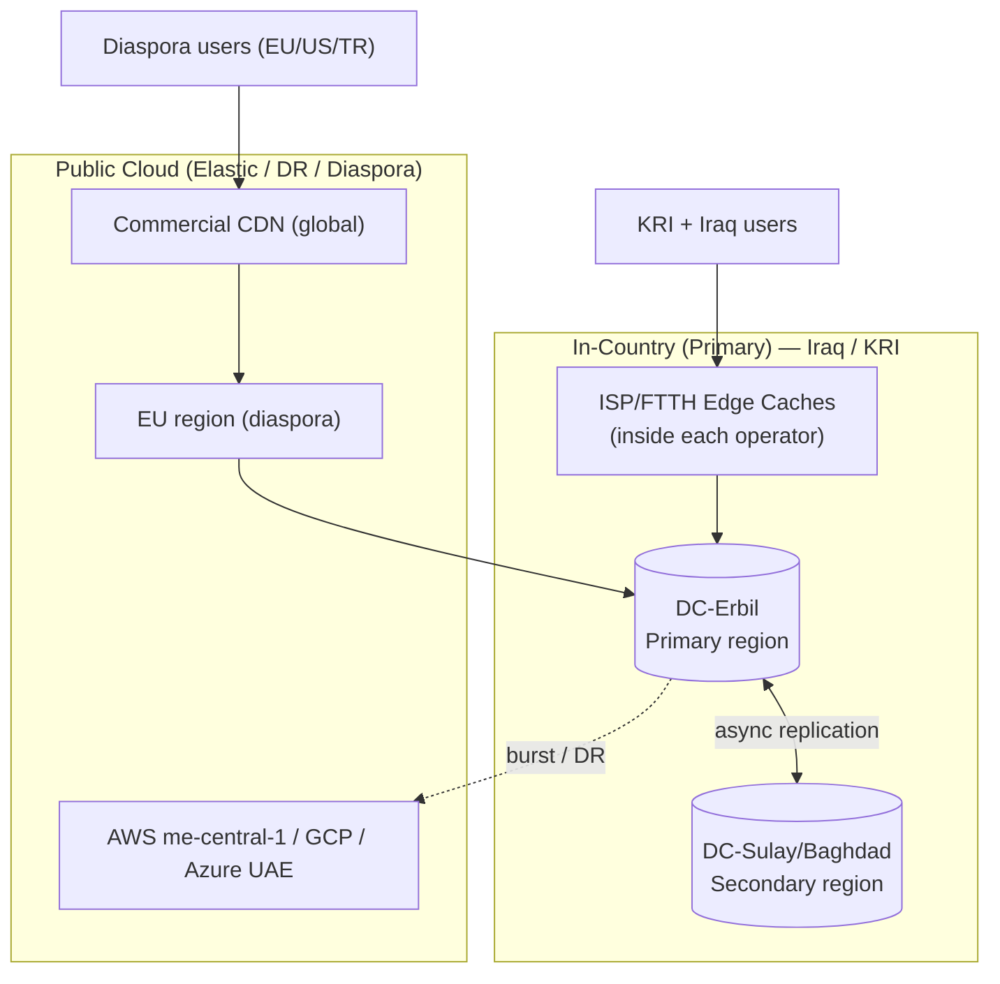
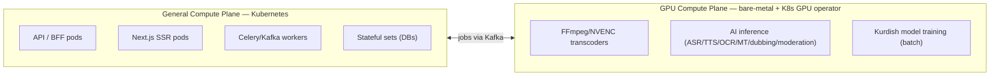
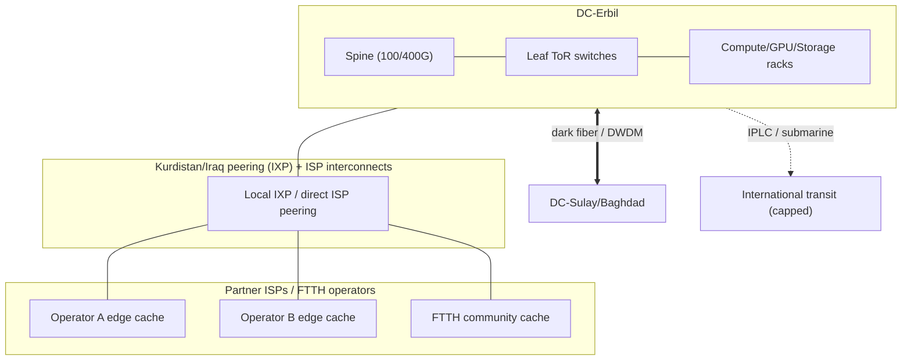
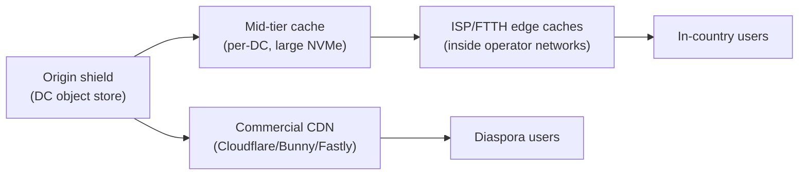
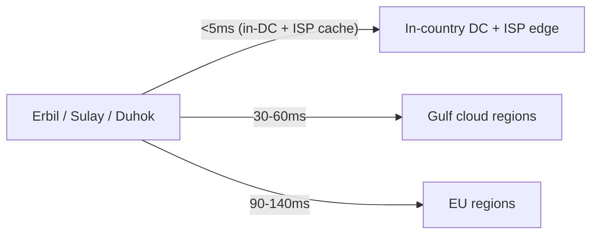
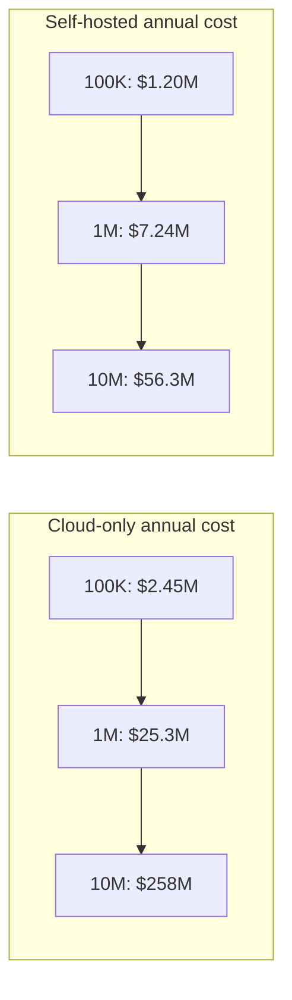
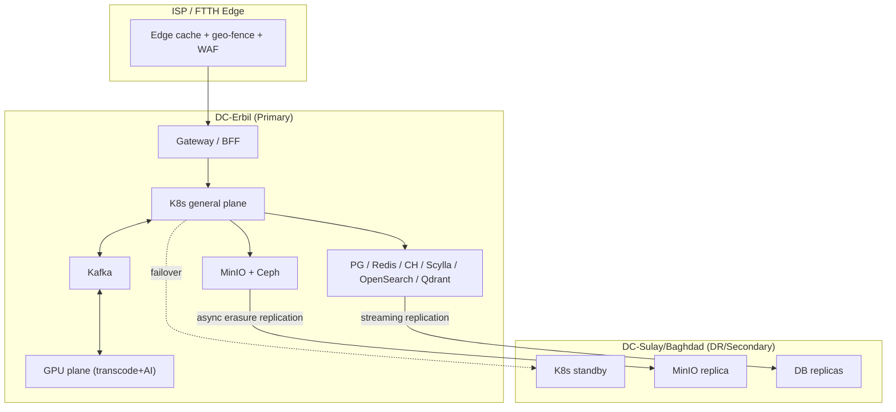
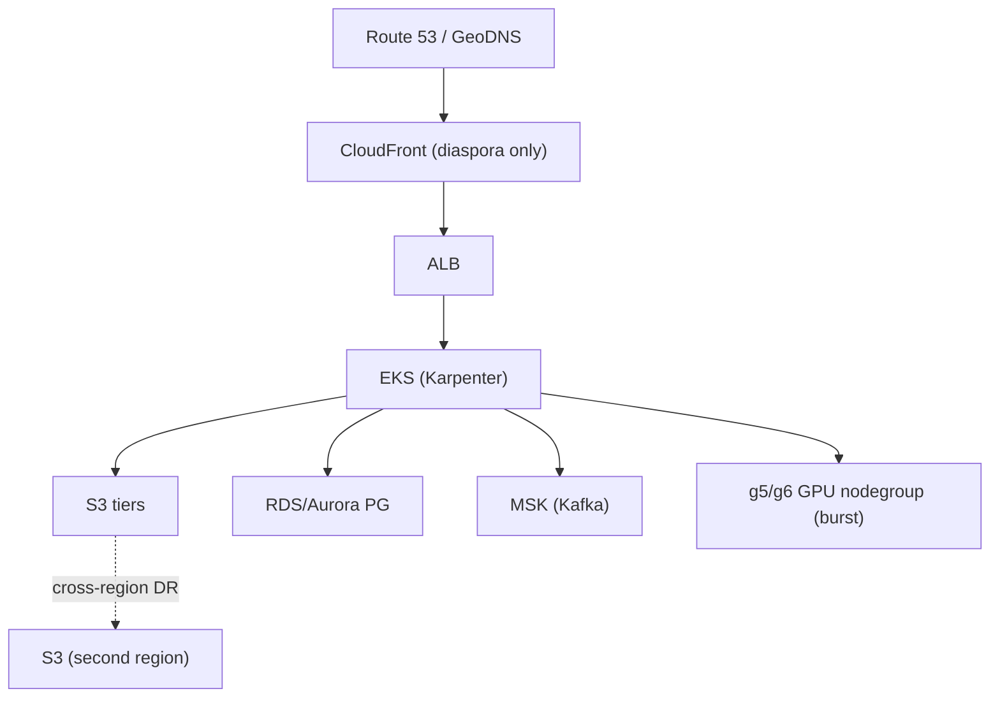
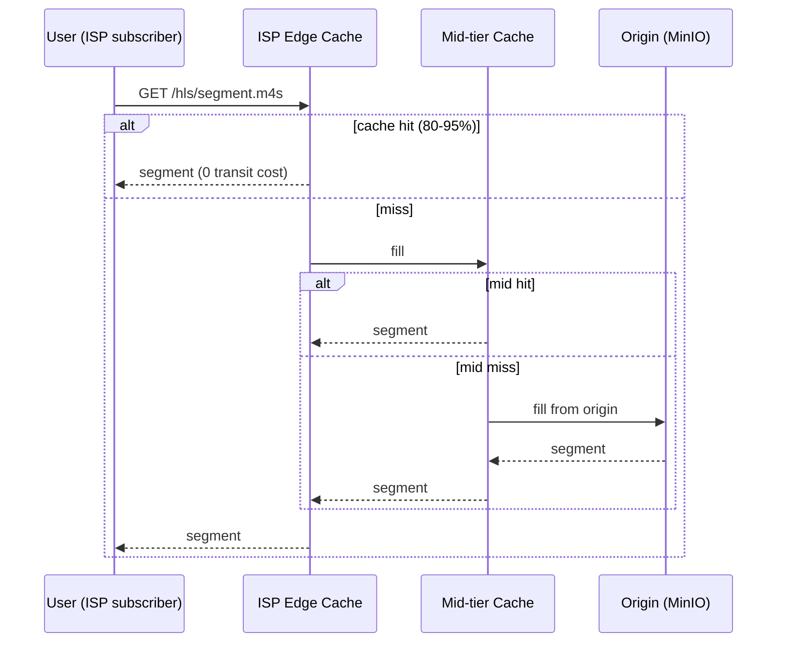

# 28 — Infrastructure & Cost

> **Scope:** The physical and cloud substrate for **ZanaCloud**: deployment topologies on **AWS, GCP, Azure, and self-hosted/on-prem** (the priority target for Intranet/FTTH), compute (Kubernetes + bare-metal GPU), storage (object/block/cold), networking, CDN (commercial + self-hosted ISP edge), databases, the Iraq/Kurdistan **region strategy** (latency + data residency), and realistic **2026 USD cost models** at 100K / 1M / 10M MAU — with a cloud-vs-self-hosted **TCO** comparison that justifies the self-hosting mandate (egress bandwidth is the killer).
>
> **Foundation:** Built on the [MediaCMS](../../README.md) Django + Celery + FFmpeg stack. Self-hosted is a **first-class deployment target**, not a fallback.
>
> **Sibling docs:** [Scaling Strategy](./29-scaling-strategy.md) · [DevOps](./26-devops.md) · [Observability](./27-observability.md) · [Streaming Infrastructure](./09-streaming-infrastructure.md) · [Video Processing](./08-video-processing.md) · [Platform Constraints](./33-platform-constraints.md) · [Technology Stack](./32-technology-stack.md)

---

## 1. The governing forces

ZanaCloud's infrastructure is shaped by five forces that, taken together, push hard toward **owned infrastructure inside Iraq/KRI**:

| Force | Infra consequence |
|---|---|
| **Free for users** | No per-user revenue to absorb cloud egress. Bandwidth must be near-zero marginal cost → self-hosted + ISP peering. |
| **Media-heavy** (video/audio/8K/live) | Egress dominates everything. A streaming platform's #1 cloud line item is bandwidth, not compute. |
| **Intranet / FTTH / air-gapped** | Must run with **no public internet**. Cloud is structurally impossible for these deployments; on-prem is mandatory. |
| **Data residency** | Iraqi/KRI content and PII should remain in-country. AWS/GCP/Azure have **no region inside Iraq** (nearest: UAE, Bahrain, Qatar, Israel) → latency + sovereignty problems. |
| **Kurdish AI GPU workloads** | ASR/TTS/OCR/MT/dubbing need sustained GPU. Cloud GPU rental at 24/7 utilization is 3–6× the amortized cost of owned GPUs. |

**Strategic conclusion (stated up front, justified in §9):** ZanaCloud runs a **self-hosted primary** in two in-country datacenters (Erbil + Sulaymaniyah/Baghdad), with **cloud used only as elastic overflow, disaster-recovery, and for the diaspora edge** outside Iraq. The CDN is a **hybrid**: self-operated caches inside every partner ISP/FTTH network, plus a commercial CDN for the global diaspora.

---

## 2. Compute architecture

### 2.1 The two compute planes

ZanaCloud separates compute into a **general plane** (stateless services, web, APIs, queues) and a **GPU plane** (AI + heavy transcoding). They scale on different curves and live on different hardware.

### 2.2 Compute platform matrix

| Target | Orchestrator | Node types | GPU | Notes |
|---|---|---|---|---|
| **AWS** | EKS | `c7g`/`m7g` (Graviton) general; `c7gn` for network-heavy | `g5`/`g6` (L4/A10G), `p5` (H100) for training | EKS + Karpenter for autoscale; egress is the cost trap. |
| **GCP** | GKE Autopilot/Standard | `t2a`/`c3` general | `g2` (L4), `a3` (H100) | Best per-GB egress pricing of the three; strong AI tooling (Vertex). |
| **Azure** | AKS | `Dpsv5` (Ampere) general | `NVadsA10`, `ND H100 v5` | Use only if customer mandates Microsoft estate. |
| **Self-hosted (priority)** | **K3s/RKE2 or vanilla K8s** + **Kubevirt** for VMs | 2P AMD EPYC 9004/9005 (Genoa/Turin), 384–768 GB RAM | **NVIDIA L40S / RTX 6000 Ada** (transcode+inference), **H100/H200** (training) | NVIDIA GPU Operator; MIG partitioning for inference packing. |

**Self-hosted reference node specs (2026):**

| Role | CPU | RAM | Local NVMe | GPU | ~Unit capex (USD) |
|---|---|---|---|---|---|
| General K8s worker | 2× EPYC 9354 (64c) | 512 GB DDR5 | 2× 3.84 TB | — | $14,000 |
| Transcode/inference | 1× EPYC 9354 | 256 GB | 2× 3.84 TB | 4× L40S (48 GB) | $58,000 |
| AI training | 2× EPYC 9554 | 1.5 TB | 4× 7.68 TB | 8× H100 SXM | $260,000 |
| Storage node (MinIO) | 1× EPYC 9224 | 256 GB | 24× 20 TB HDD + 4× NVMe cache | — | $34,000 |
| DB node (Postgres/CH) | 2× EPYC 9354 | 768 GB | 8× 7.68 TB NVMe (U.2) | — | $42,000 |

---

## 3. Storage architecture

### 3.1 Storage tiers

| Tier | Purpose | Cloud | Self-hosted | Access pattern |
|---|---|---|---|---|
| **Hot object** | Active HLS/DASH segments, thumbnails, recent uploads | S3 Standard / GCS Standard / Azure Hot | **MinIO** on NVMe+HDD erasure sets | High read, CDN-fronted |
| **Warm object** | Long-tail catalog, masters | S3 IA / GCS Nearline | MinIO HDD pool | Occasional |
| **Cold/archive** | Originals, compliance, dubbing masters | S3 Glacier / GCS Archive | **Ceph + tape / LTO-9** library | Rare |
| **Block** | DB volumes, scratch transcode | EBS gp3/io2 / PD-SSD | **Ceph RBD** / local NVMe | Low-latency |
| **File** | Shared model weights, NFS for legacy MediaCMS media root | EFS / Filestore | **CephFS / NFS** | Mixed |

> MediaCMS today writes transcoded renditions to its `MEDIA_ROOT`. The migration replaces the filesystem backend with an **S3-compatible** driver (`django-storages` + boto3) pointed at **MinIO on-prem** or cloud S3 — one config switch, see [Platform Constraints](./33-platform-constraints.md).

### 3.2 Storage sizing model

Assume average catalog mix and a 30-day hot window.

| Metric | Assumption |
|---|---|
| Avg stored minutes per active uploader | 40 min/mo |
| Renditions per video (144p→4K, multi-codec H.264+AV1) | ~8 ladder rungs |
| Storage per source-hour (all renditions, master) | ~6 GB |
| Hot fraction (served from NVMe/SSD) | 12% of catalog |

| Scale | Catalog hours (cum, yr-2) | Raw object storage | Hot tier (NVMe) | Cold/archive |
|---|---|---|---|---|
| 100K MAU | ~120K hrs | ~700 TB | ~85 TB | ~615 TB |
| 1M MAU | ~1.1M hrs | ~6.5 PB | ~780 TB | ~5.7 PB |
| 10M MAU | ~9M hrs | ~54 PB | ~6.5 PB | ~47 PB |

---

## 4. Networking

### 4.1 In-country network topology

**Principles:**
- **Peer locally, transit globally only when forced.** Every byte served from an in-ISP cache is free; every byte over international transit is the most expensive byte on the network.
- **Dark fiber / DWDM** between the two in-country DCs for synchronous-ish replication and DR.
- **International transit is metered and capped** — used for diaspora, cloud DR sync, and software updates only. This is the single biggest cost lever (see §9).

### 4.2 Service-mesh & east-west

Cilium (eBPF) CNI for K8s, with mTLS via the mesh (see [Security](./24-security.md)). North-south through an Envoy/Nginx gateway behind the [Platform Constraints](./33-platform-constraints.md) geo-fence enforcement point.

---

## 5. CDN strategy — hybrid

A streaming platform lives or dies on its CDN. ZanaCloud runs **three tiers**:

| Tier | Tech | Owner | Serves |
|---|---|---|---|
| **Origin shield** | Varnish / Nginx + MinIO | ZanaCloud | Cache fill only |
| **Mid-tier** | Apache Traffic Server / Varnish on NVMe | ZanaCloud | Regional offload |
| **ISP edge** | Open-source caching node (ATS/Nginx) **placed inside each ISP** | ZanaCloud + ISP | **80–95% of in-country bytes** |
| **Commercial CDN** | Bunny / Cloudflare / Fastly | Vendor | Diaspora + spillover |

**Why ISP-embedded caches are the whole game:** a cache node inside Operator A's network means Operator A's subscribers stream from *within their own network*. ZanaCloud pays ~$0 transit; the ISP saves on its own upstream; the user gets sub-10ms first-byte. This is the **Netflix Open Connect / Google GGC model**, applied to Kurdistan. Intranet/FTTH mode is simply the degenerate case where the ISP cache **is** the origin.

| CDN option | $/GB (2026, in region) | Pros | Cons |
|---|---|---|---|
| **Self-hosted ISP cache** | **~$0.0005–0.002** (amortized hw + power) | Lowest cost, lowest latency, works air-gapped | Capex + ops; needs ISP partnerships |
| **Bunny.net** | ~$0.005–0.01 (MENA) | Cheapest commercial, simple | Less control |
| **Cloudflare** | Bandwidth Alliance / custom | DDoS, security bundled | Egress negotiated |
| **Fastly** | ~$0.05–0.12 | Edge compute (VCL) | Pricey at media scale |
| **AWS CloudFront** | ~$0.085–0.12 (MENA) | Tight AWS integration | **Most expensive — avoid at media scale** |

---

## 6. Database footprint

Per [Database Architecture](./05-database-architecture.md): Postgres (OLTP), Redis (cache/queues), ClickHouse (analytics), Cassandra/Scylla (feeds, view counts), OpenSearch (search), a vector DB (recs/semantic), MinIO (objects).

| Store | 100K MAU | 1M MAU | 10M MAU |
|---|---|---|---|
| PostgreSQL (primary + replicas) | 1 primary + 2 RR, 1 TB | sharded, 6 nodes, 12 TB | 24+ shards, CQRS, 120 TB |
| Redis | 1 cluster, 64 GB | 3 clusters, 512 GB | sharded, multi-TB |
| ClickHouse | 3 nodes, 4 TB | 9 nodes, 40 TB | 30+ nodes, 400 TB |
| Scylla/Cassandra | 3 nodes | 9 nodes | 30+ nodes |
| OpenSearch | 3 data nodes | 9–15 nodes | 40+ nodes |
| Vector DB (Qdrant/Milvus) | 3 nodes | 9 nodes | 24+ nodes (GPU-assisted) |

See [Scaling Strategy](./29-scaling-strategy.md) for the read-replica → sharding → CQRS progression.

---

## 7. Region strategy for Iraq / Kurdistan

### 7.1 The data-residency / latency problem

There is **no hyperscaler region inside Iraq** as of 2026. Nearest public regions: **AWS me-central-1 (UAE)**, **AWS me-south-1 (Bahrain)**, **GCP me-central1/2 (Qatar/Doha)**, **Azure UAE North**. RTT from Erbil/Baghdad to these is ~30–60 ms — acceptable for APIs, **bad for last-mile video** and unacceptable for data-sovereignty if regulators require in-country storage of citizen data.

### 7.2 Region tiering decision

| Concern | Placement | Rationale |
|---|---|---|
| User PII, payments (FIB), content masters | **In-country DCs only** | Sovereignty + FIB integration is domestic |
| Hot video delivery | **ISP edge caches in-country** | Latency + transit cost |
| Diaspora delivery | Commercial CDN + EU cache | Audience is abroad |
| DR / backup | Encrypted, in **Gulf cloud** (cross-border allowed for ciphertext) + second in-country DC | Geographic isolation |
| Burst transcode/AI overflow | Gulf cloud GPU on-demand | Only when in-country GPU saturated |
| Air-gapped/FTTH | **100% in-operator**, zero cloud | Mandate |

---

## 8. Cost models (2026 USD)

> All figures are realistic 2026 estimates, monthly unless noted. Cloud figures use **discounted/committed-use** (1–3 yr reserved/savings plans), *not* on-demand list. Self-hosted amortizes capex over **4 years** plus opex (power, cooling, bandwidth, staff, datacenter colo/space).

### 8.1 Traffic & workload assumptions per scale

| Driver | 100K MAU | 1M MAU | 10M MAU |
|---|---|---|---|
| Concurrent peak viewers | ~8K | ~90K | ~950K |
| Avg watch min/user/day | 35 | 40 | 45 |
| Monthly egress (video) | ~1.2 PB | ~14 PB | ~160 PB |
| Transcode source-hours/mo | ~50K | ~600K | ~6.5M |
| AI inference GPU-hours/mo | ~6K | ~70K | ~750K |
| In-country served fraction | 90% | 92% | 94% |

### 8.2 Cloud-only monthly cost (illustrative, AWS me-central-1 class)

| Line item | 100K MAU | 1M MAU | 10M MAU |
|---|---|---|---|
| Compute (EKS general) | $9K | $70K | $620K |
| GPU (transcode + AI, on-demand/committed) | $55K | $520K | $4.6M |
| Storage (S3 tiers) | $18K | $160K | $1.3M |
| Databases (RDS/ClickHouse mgd) | $14K | $120K | $980K |
| **Egress / CDN (CloudFront-class @ ~$0.085/GB)** | **$102K** | **$1.19M** | **$13.6M** |
| Observability/misc | $6K | $45K | $360K |
| **Total / mo (cloud)** | **~$204K** | **~$2.10M** | **~$21.5M** |
| **Annualized** | **~$2.45M** | **~$25.3M** | **~$258M** |

> **Egress alone is 40–63% of the cloud bill.** This is the line that makes pure-cloud non-viable for a free national platform.

### 8.3 Self-hosted monthly cost (amortized capex + opex)

| Line item | 100K MAU | 1M MAU | 10M MAU |
|---|---|---|---|
| Capex amortized (compute+GPU+storage+net, /48mo) | $28K | $215K | $1.85M |
| Power + cooling | $9K | $70K | $620K |
| Datacenter space/colo | $6K | $40K | $310K |
| **Bandwidth (intl transit only, ISP-peered for rest)** | **$11K** | **$95K** | **$820K** |
| Commercial CDN (diaspora spillover) | $4K | $38K | $360K |
| Staff (infra/SRE allocated) | $35K | $90K | $260K |
| Spares / RMA / growth buffer | $7K | $55K | $470K |
| **Total / mo (self-hosted)** | **~$100K** | **~$603K** | **~$4.69M** |
| **Annualized** | **~$1.20M** | **~$7.24M** | **~$56.3M** |

### 8.4 Cost-per-MAU

| | 100K | 1M | 10M |
|---|---|---|---|
| Cloud $/MAU/mo | $2.04 | $2.10 | $2.15 |
| Self-hosted $/MAU/mo | **$1.00** | **$0.60** | **$0.47** |

Self-hosting's per-user cost **falls** with scale (capex amortization + better cache hit ratios); cloud's stays flat-to-rising (egress is linear with no economy of scale).

---

## 9. Cloud vs self-hosted TCO — the decision

| Scale | Cloud / yr | Self-hosted / yr | **Savings** | Multiplier |
|---|---|---|---|---|
| 100K MAU | $2.45M | $1.20M | $1.25M | 2.0× |
| 1M MAU | $25.3M | $7.24M | $18.1M | 3.5× |
| 10M MAU | $258M | $56.3M | **$201.7M** | **4.6×** |

**Verdict:** Self-hosting is **2–4.6× cheaper**, the gap widening with scale, driven almost entirely by **egress**. Combined with the **mandatory** air-gapped/FTTH requirement and **data residency**, the architecture is **self-hosted primary, cloud-as-overflow**. Cloud is retained for:

1. **Disaster recovery** (encrypted backups + warm standby in a Gulf region).
2. **Diaspora edge** (commercial CDN where ISP caches don't exist).
3. **Elastic burst** (transcode/AI spikes beyond in-country GPU capacity).
4. **Greenfield pilots** before in-country hardware lands.

### 9.1 Break-even

The in-country buildout reaches cash break-even vs. cloud at roughly **8–14 months** of operation at 1M MAU (capex recovered by avoided egress). Below ~250K MAU, a **hybrid lean-cloud** start is acceptable while hardware is procured; the strangler migration ([Roadmap](./31-roadmap.md)) sequences the on-prem cutover.

---

## 10. Deployment topology diagrams

### 10.1 Self-hosted (priority) — full

### 10.2 Cloud (overflow / DR) — AWS reference

### 10.3 Network / traffic flow (in-country)

---

## 11. Capacity planning quick-reference

| Resource | Rule of thumb |
|---|---|
| Transcode | 1× L40S ≈ 12–20 real-time 1080p AV1 streams; size fleet to peak upload backlog SLA (see [Video Processing](./08-video-processing.md)) |
| AI inference | MIG-partition L40S; ASR ~ 8–15× real-time/GPU; pack with batching |
| Egress per concurrent 1080p viewer | ~5–6 Mbps → 1M concurrent ≈ 5–6 Tbps peak (this is why ISP caching is non-negotiable) |
| Object storage headroom | Keep 25% free on erasure sets; plan 4–6 mo growth ahead |
| GPU procurement lead time | 8–20 weeks (2026) — order ahead of scaling-stage gates |

---

## 12. Cross-references

- Stage-by-stage infra evolution: [29-scaling-strategy.md](./29-scaling-strategy.md)
- IaC, K8s, GitOps that deploys all of this: [26-devops.md](./26-devops.md)
- Transcoding fleet detail: [08-video-processing.md](./08-video-processing.md)
- Streaming/CDN detail: [09-streaming-infrastructure.md](./09-streaming-infrastructure.md)
- Air-gapped/FTTH config + geo-fence enforcement: [33-platform-constraints.md](./33-platform-constraints.md)
- Component-level tech choices: [32-technology-stack.md](./32-technology-stack.md)
- Who runs it: [30-team-structure.md](./30-team-structure.md)
