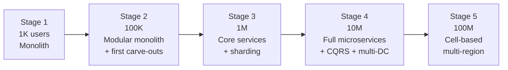
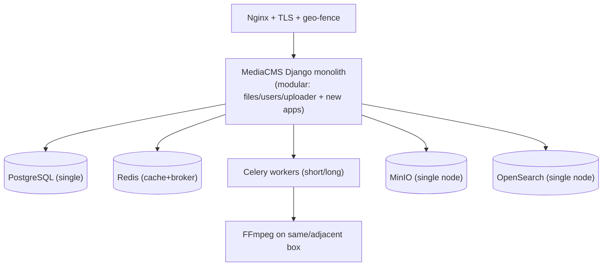
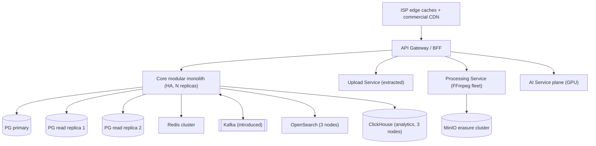
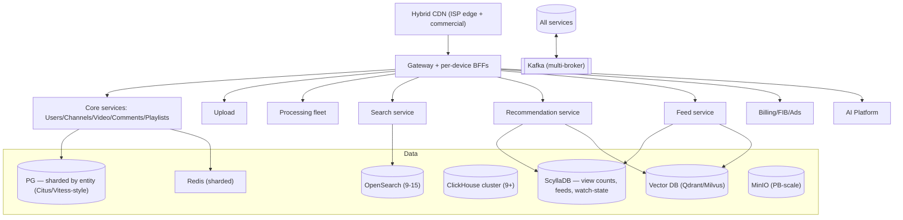
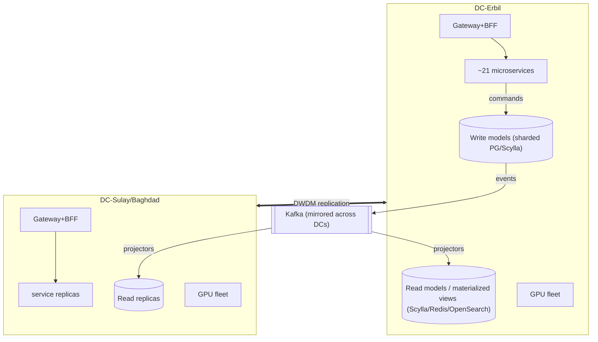
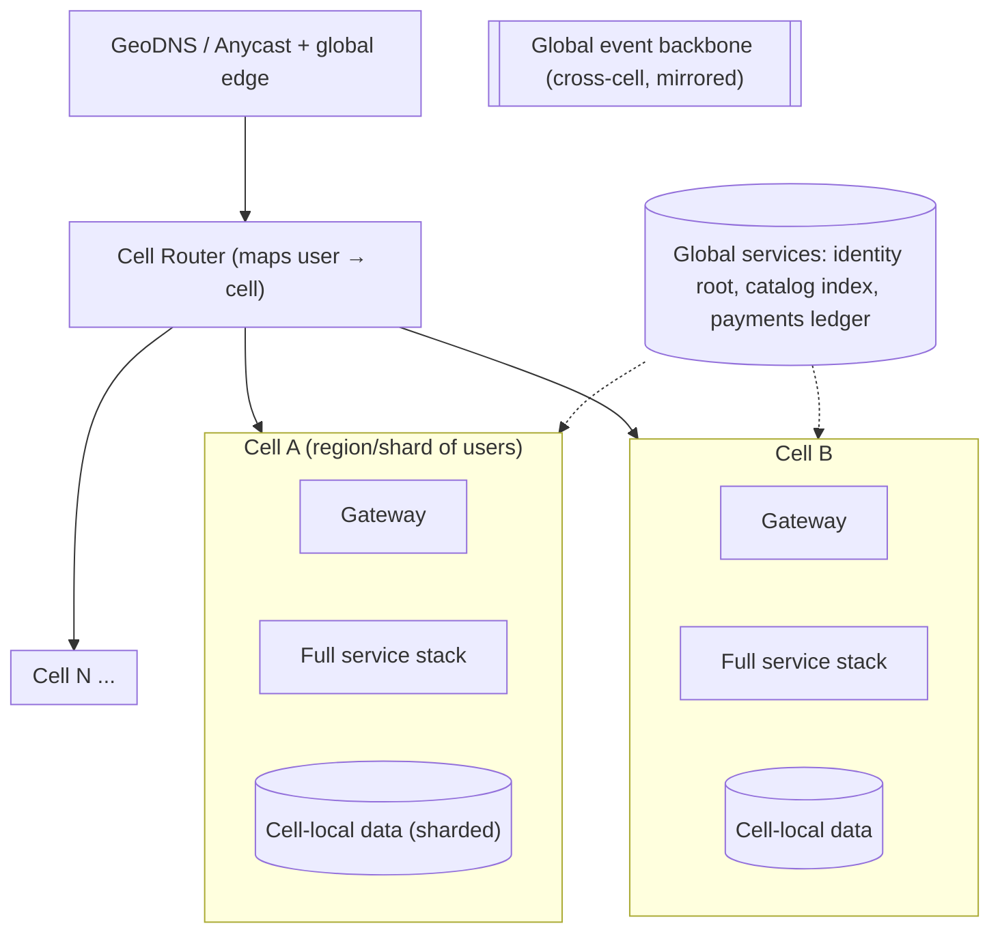
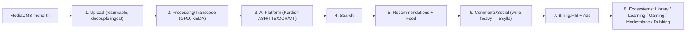

# 29 — Scaling Strategy

> **Scope:** How **ZanaCloud's** architecture *evolves* from **1,000 → 100,000 → 1,000,000 → 10,000,000 → 100,000,000** users. For each stage: topology, the monolith→microservices progression (strangler-fig out of [MediaCMS](../../README.md)), database scaling (read replicas → sharding → CQRS), caching, CDN, transcoding fleet, queue/event-bus, team & cost implications, and — most importantly — **the specific bottleneck that breaks next and how it is fixed.**
>
> **Foundation:** Every stage is an *increment* on the previous one. Nothing is rebuilt; pieces are *strangled* out of the MediaCMS modular monolith as load demands.
>
> **Sibling docs:** [System Architecture](./02-system-architecture.md) · [Database](./05-database-architecture.md) · [Infrastructure & Cost](./28-infrastructure-cost.md) · [Roadmap](./31-roadmap.md) · [Team Structure](./30-team-structure.md) · [DevOps](./26-devops.md)

---

## 1. The scaling philosophy

1. **Scale the bottleneck, not the diagram.** Each stage is justified by a *measured* limit that breaks, not by aspiration.
2. **Strangler-fig, never rewrite.** A service is extracted from the monolith only when its scaling profile diverges from the core (different load curve, different team, different SLA).
3. **State is the enemy.** Stateless services scale trivially; the hard problems are always the databases, the queues, and the bytes. Push complexity down into a few well-run stateful systems.
4. **Async-first.** Anything that can be eventual is offloaded to the event bus so the synchronous read path stays thin.
5. **Cache the read path aggressively.** A national free media platform is overwhelmingly read-heavy (views ≫ uploads). Cache hit ratio is the master metric.

---

## 2. Stage 1 — 1,000 users (MVP / pilot)

**Goal:** Prove product + the constraint set (free, admin-approval, geo-fence, FIB, Kurdish AI) work end-to-end. Optimize for *iteration speed*, not scale.

### Topology

| Dimension | Stage 1 |
|---|---|
| Architecture | **Modular monolith** (MediaCMS + new modules: category engine, FIB adapter, geo-fence, approval workflow) |
| Servers | 2–3 nodes (1 app, 1 DB+cache, 1 transcode/AI) |
| Database | Single Postgres, daily backups |
| Caching | Redis page/fragment cache |
| CDN | None or single commercial CDN; ISP cache optional |
| Transcoding | 1 GPU box (L40S), inline Celery |
| Queue | Redis-backed Celery (`short_tasks`/`long_tasks`) |
| AI | One GPU shared for transcode + Kurdish ASR/TTS/OCR (batch) |
| Team | 6–10 engineers ([Team Structure](./30-team-structure.md)) |
| Cost | ~$5–15K/mo |

**Bottleneck that breaks next:** A single Postgres + single transcode box saturates around tens of thousands of MAU; the monolith couples upload/transcode load to the API read path so an upload spike degrades browsing.

---

## 3. Stage 2 — 100,000 users

**Goal:** Survive real national traffic; decouple the read path from heavy media work. First strangler extractions.

### Topology

| Change | Detail |
|---|---|
| **Strangler carve-outs** | Upload, Processing/transcode, and AI extracted as independent services (their load curve ≠ core). Routed via gateway toggle. |
| **DB: read replicas** | 1 primary + 2 read replicas; reads (feeds, watch pages) routed to replicas; PgBouncer pooling. |
| **Event bus** | **Kafka** introduced for view events, moderation events, transcode jobs, notifications — replaces synchronous coupling. |
| **Caching** | Redis cluster; CDN now caches manifests/segments; OpenSearch for search. |
| **Analytics** | ClickHouse for view counts / watch-time (off the OLTP DB). |
| **CDN** | ISP-embedded caches go live (see [Infra](./28-infrastructure-cost.md) §5). |
| **Transcode** | GPU fleet (3–6 L40S nodes), KEDA autoscaling on Kafka queue depth. |
| Team | ~25–40 engineers; stream-aligned teams forming |
| Cost | ~$100K/mo (self-hosted, [Infra §8](./28-infrastructure-cost.md)) |

**Bottleneck that breaks next:** The single Postgres **primary** becomes the write ceiling (uploads, comments, reactions, view-state writes). Read replicas help reads but every write still funnels to one node. Hot rows (popular video counters) cause lock contention.

---

## 4. Stage 3 — 1,000,000 users

**Goal:** Break the single-writer ceiling. Move to true service-per-domain. Make counters and feeds scale independently.

### Topology

| Change | Detail |
|---|---|
| **DB: sharding** | Postgres **sharded** (Citus or app-level by `channel_id`/`user_id`). Comments and reactions move to **ScyllaDB** (write-heavy, partitionable). |
| **Hot counters → Scylla/Redis** | View counts, likes use counter tables + Redis with async flush; eliminates OLTP lock contention. |
| **Feeds** | Dedicated Feed service (fan-out-on-write for small channels, fan-out-on-read for large) backed by Scylla + Redis. |
| **Recommendations** | Vector DB (Qdrant/Milvus) + candidate-gen/ranking services (see [Recs](./12-recommendation-engine.md)). |
| **CDN** | ISP caches now serve 90%+ in-country bytes; tiered origin shield. |
| **Transcode** | 30–60 GPU transcoders; priority queues (live > new uploads > backfill). |
| **Event bus** | Kafka partitioned by topic/key; schema registry; consumer groups per service. |
| Team | ~80–150; platform team + enabling teams (Team Topologies) |
| Cost | ~$600K/mo self-hosted |

**Bottleneck that breaks next:** Cross-shard queries and the read/write impedance of a normalized OLTP model. Feeds, search indexing, and analytics need *different shapes* of the same data than transactions do. Single-region failure domain becomes a business risk.

---

## 5. Stage 4 — 10,000,000 users

**Goal:** Full microservices, **CQRS** (separate write and read models), multi-DC for resilience, and a transcoding/AI fleet at industrial scale.

### Topology

| Change | Detail |
|---|---|
| **CQRS + event sourcing** | Writes go to command services + outbox → Kafka; **projectors** build denormalized read models (per device, per category). Reads never touch the write DB. |
| **Multi-DC active/active-ish** | Two in-country DCs; Kafka mirrored; read models materialized in both; failover automated. |
| **Service mesh** | Full mesh (Cilium/Istio) with mTLS, traffic shaping, canary. |
| **Search/recs at scale** | OpenSearch 40+ nodes; vector DB GPU-assisted; near-real-time indexing pipeline off Kafka. |
| **Transcode** | 100s of GPUs; AV1/H.266 ladders; per-title encoding; live LL-HLS fleet. |
| **AI** | Dedicated GPU pool, MIG-partitioned inference, autoscaled; Kurdish models served via Triton/vLLM. |
| **Ecosystems online** | Library, Learning, Gaming, Marketplace, Dubbing each as bounded contexts (see ecosystem docs). |
| Team | ~250–500; complicated-subsystem teams (AI, transcode, recs) |
| Cost | ~$4.7M/mo self-hosted |

**Bottleneck that breaks next:** Even sharded, a **single logical cluster** has blast-radius and coordination limits (Kafka cross-DC lag, global secondary indexes, one schema migration touching everything). At 100M, you cannot have one failure domain or one deploy that can take everyone down.

---

## 6. Stage 5 — 100,000,000 users

**Goal:** **Cell-based architecture** + multi-region. The platform becomes a *fleet of independent cells*, each a near-complete vertical slice serving a partition of users, so failures and deploys are contained.

### Topology

| Change | Detail |
|---|---|
| **Cells** | Users partitioned into cells (by region/diaspora/shard). Each cell is independently deployable and has its own blast radius. |
| **Cell router** | Maps each user → home cell; handles cell migration and rebalancing. |
| **Global vs cell-local** | Identity root, global catalog/search index, and the payments ledger are *thin global* services; everything else is cell-local. |
| **Multi-region** | In-country cells + diaspora cells (EU/Gulf) for the worldwide Kurdish audience. |
| **Deploys** | Progressive cell-by-cell rollout; one bad deploy hits one cell. |
| **Data** | Per-cell sharding; global indexes are eventually-consistent aggregates. |
| Team | 800–1500+; multiple platform groups, per-cell SRE rotations |
| Cost | Tens of $M/mo; per-MAU cost lowest of any stage (cache + amortization) |

**Bottleneck handled:** Blast radius, deploy risk, and global coordination — all contained by cell isolation. Remaining limits are organizational and physical (power, GPU supply, fiber), addressed by capacity procurement ahead of stage gates.

---

## 7. Dimension-by-dimension evolution table

| Dimension | 1K | 100K | 1M | 10M | 100M |
|---|---|---|---|---|---|
| **Architecture** | Modular monolith | Monolith + edge carve-outs | Core services | Full microservices | Cell-based multi-region |
| **API entry** | Nginx | Gateway | Gateway + BFFs | Mesh + BFFs | GeoDNS + cell router |
| **Postgres** | Single | 1P + 2 RR | Sharded (Citus) | Sharded + CQRS write model | Per-cell sharded |
| **Write-heavy data** | Postgres | Postgres | Scylla (counters/comments) | Scylla + materialized read models | Cell-local Scylla |
| **Caching** | Redis | Redis cluster | Sharded Redis | Multi-tier + read models | Per-cell + edge |
| **Search** | OpenSearch 1 | OS 3 | OS 9–15 | OS 40+ | Per-cell + global index |
| **Recs** | Heuristic | Basic ML | Vector DB + ranker | RL + real-time | Per-cell models |
| **Event bus** | Celery/Redis | Kafka (basic) | Kafka partitioned | Kafka mirrored multi-DC | Global backbone |
| **CDN** | 1 commercial | ISP edge + commercial | Hybrid tiered | Tiered + shield | Anycast + cells |
| **Transcode GPUs** | 1 | 3–6 | 30–60 | 100s | 1000s |
| **AI** | Shared GPU | Dedicated GPU svc | GPU pool | MIG + Triton/vLLM | Per-region pools |
| **DCs/Regions** | 1 box | 1 DC | 1 DC + DR | 2 in-country DCs | Multi-region cells |
| **Team size** | 6–10 | 25–40 | 80–150 | 250–500 | 800–1500+ |
| **~Cost/mo** | $5–15K | $100K | $600K | $4.7M | $20M+ |

---

## 8. Strangler-fig extraction order

The order services leave the monolith, gated by which bottleneck forces them out:

| # | Service | Triggering bottleneck | Stage |
|---|---|---|---|
| 1 | Upload | Upload spikes degrade API | 2 |
| 2 | Processing | GPU work blocks core | 2 |
| 3 | AI Platform | GPU + model lifecycle differ from core | 2–3 |
| 4 | Search | Index load + relevance iteration | 3 |
| 5 | Recs/Feed | Vector + real-time differ from OLTP | 3 |
| 6 | Comments/Social | Write contention on Postgres | 3 |
| 7 | Billing/FIB/Ads | Independent SLA, compliance isolation | 3–4 |
| 8 | Ecosystems | Each a bounded context with own team | 4 |

---

## 9. Bottleneck → fix cheat sheet

| Symptom | Root cause | Fix | Introduced at |
|---|---|---|---|
| Browsing slow during upload spikes | Monolith couples ingest + read | Extract Upload/Processing | Stage 2 |
| Read latency under load | All reads on primary | Read replicas + cache | Stage 2 |
| Synchronous fan-out timeouts | Tight service coupling | Kafka event bus | Stage 2 |
| Write throughput ceiling | Single PG primary | Shard + move counters to Scylla | Stage 3 |
| Lock contention on hot videos | Hot-row counter updates | Counter tables + Redis async flush | Stage 3 |
| Feed generation slow | On-the-fly fan-out | Dedicated Feed service (hybrid fan-out) | Stage 3 |
| Read/write model mismatch | One normalized schema serves all | **CQRS** + projectors | Stage 4 |
| Single-region risk | One failure domain | Multi-DC + Kafka mirroring | Stage 4 |
| Deploy can break everyone | One blast radius | **Cell-based** isolation | Stage 5 |
| Egress cost explosion (every stage) | Serving bytes over transit | ISP-embedded caches | Stage 2 onward |

---

## 10. Cross-references

- Cost numbers behind each stage: [28-infrastructure-cost.md](./28-infrastructure-cost.md)
- Service decomposition & CQRS detail: [02-system-architecture.md](./02-system-architecture.md), [04-backend-services.md](./04-backend-services.md)
- DB sharding/replication mechanics: [05-database-architecture.md](./05-database-architecture.md)
- Transcode fleet scaling: [08-video-processing.md](./08-video-processing.md)
- Team growth aligned to stages: [30-team-structure.md](./30-team-structure.md)
- Timeline mapping stages to quarters: [31-roadmap.md](./31-roadmap.md)
