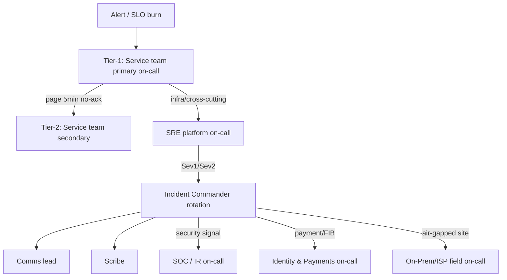
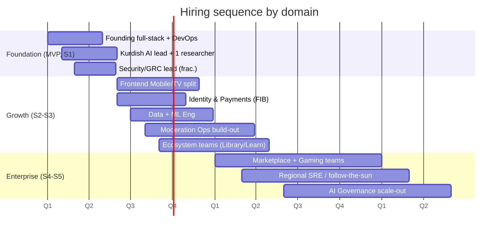

# 30 — Team Structure & Org Design

> **Scope:** The human system that builds and runs **ZanaCloud** — the national AI super-platform extending [MediaCMS](../../README.md). This document defines the **organizational architecture** using [Team Topologies](https://teamtopologies.com/) (stream-aligned / platform / enabling / complicated-subsystem), the **headcount per growth stage** (1K → 100K → 1M → 10M → 100M users, mapped to [Scaling Strategy](./29-scaling-strategy.md)), **RACI** matrices, **on-call** design, and the **hiring roadmap** sequenced against the [Roadmap](./31-roadmap.md).
>
> **Design principle:** *Inverse Conway Maneuver.* We deliberately shape teams so the architecture we want ([System Architecture](./02-system-architecture.md)) emerges naturally. Team boundaries = service boundaries = the strangler-fig seams out of the MediaCMS monolith.
>
> **Sibling docs:** [Roadmap](./31-roadmap.md) · [Technology Stack](./32-technology-stack.md) · [Platform Constraints](./33-platform-constraints.md) · [Scaling Strategy](./29-scaling-strategy.md) · [Security](./24-security.md) · [Kurdish Language Intelligence](./34-kurdish-language-intelligence.md)

---

## 1. Philosophy & operating model

### 1.1 Principles

1. **Team-first architecture (Inverse Conway).** We do not staff to the architecture; we shape teams so the architecture follows. A bounded context in [System Architecture](./02-system-architecture.md) maps to exactly one *stream-aligned* team that owns it end-to-end (you build it, you run it).
2. **Cognitive load is the budget.** A team owns only as much domain as it can hold in its head. When a domain's cognitive load exceeds the team, we *split the domain*, not overload the team.
3. **Platform-as-product.** Internal platforms (CI/CD, observability, data, ML serving, the Super Admin control plane) are products with internal customers, roadmaps, and SLAs — not ticket queues.
4. **Sovereignty-aware staffing.** Because ZanaCloud must run *air-gapped inside ISP/FTTH/datacenters* ([Platform Constraints §Intranet](./33-platform-constraints.md)), we need teams who can operate **without** the public cloud crutch: bare-metal SRE, on-prem data, offline model serving.
5. **Kurdish-first is a first-class org unit, not a feature.** The Kurdish Language team is a *complicated-subsystem* team with research depth, not a backlog item inside another squad.
6. **Stream over silo.** Default to long-lived, cross-functional, end-to-end teams over functional handoff chains (no "QA team", no "DBA team" — those capabilities are embedded or platformed).

### 1.2 The four team types (Team Topologies)

| Type | Purpose | Examples in ZanaCloud | Interaction default |
|---|---|---|---|
| **Stream-aligned** | Owns a continuous flow of value for one slice of product/business. The majority of teams. | Media/Video, Live & Creator, Marketplace, Library & Books, Learning Academy, Gaming, Dubbing Studio | X-as-a-Service from platform teams |
| **Platform** | Reduces cognitive load of stream-aligned teams by providing self-service internal products. | Core Platform, Infra/Compute, Data Platform, ML Serving Platform, Identity & Payments Platform | X-as-a-Service |
| **Enabling** | Time-boxed coaching to lift capability, then leaves. | Security Guild, SRE Enablement, Performance/Accessibility, Test Automation, FinOps | Facilitating (temporary) |
| **Complicated-subsystem** | Deep specialist knowledge too costly to spread across stream teams. | Kurdish Language AI, Transcoding/Codec Engine, Recommendation/Ranking, Geo-fencing & DRM | X-as-a-Service / Collaboration |

### 1.3 Interaction modes (and how we limit them)

```mermaid
flowchart LR
    subgraph SA["Stream-aligned (value flow)"]
        M[Media/Video]
        MK[Marketplace]
        LB[Library/Books]
        LA[Learning]
        GM[Gaming]
        DB[Dubbing]
    end
    subgraph PLAT["Platform (X-as-a-Service)"]
        CP[Core Platform]
        INF[Infra/Compute]
        DP[Data Platform]
        ML[ML Serving]
        IP[Identity & Payments]
    end
    subgraph CS["Complicated-subsystem"]
        KU[Kurdish Language AI]
        TR[Transcoding Engine]
        RC[Recommendation]
        GD[Geo/DRM]
    end
    subgraph EN["Enabling (temporary)"]
        SEC[Security Guild]
        SREE[SRE Enablement]
    end
    SA -->|XaaS| PLAT
    SA -->|XaaS| CS
    EN -.facilitate.-> SA
    EN -.facilitate.-> PLAT
    CS -->|XaaS| PLAT
```

> **Rule of thumb:** *Collaboration* mode (high-bandwidth, two teams co-working) is expensive and time-boxed. Steady state should be *X-as-a-Service* (clean API contract). If two teams are stuck in permanent collaboration, the boundary is wrong — redraw it.

---

## 2. Org chart (full-scale, ~10M+ users)

```mermaid
graph TD
    CEO[CEO / Managing Director]
    CEO --> CPO[Chief Product Officer]
    CEO --> CTO[CTO / VP Engineering]
    CEO --> CISO[CISO / VP Security]
    CEO --> CDO[Chief Data & AI Officer]
    CEO --> COO[COO — Content, Partnerships, Compliance]

    CPO --> PMG[Product Management Group]
    CPO --> DES[Design / UX / Research]
    CPO --> KLP[Kurdish Language Product]

    CTO --> ENGP[Eng — Platform Group]
    CTO --> ENGM[Eng — Media Group]
    CTO --> ENGF[Eng — Frontend/Apps Group]
    CTO --> ENGE[Eng — Ecosystems Group]
    CTO --> SRE[SRE / Reliability]
    CTO --> DEVO[DevOps / Infra / On-Prem]

    CISO --> APPSEC[AppSec & Product Security]
    CISO --> INFRASEC[Infra/Network Security]
    CISO --> GRC[GRC / Compliance / Privacy]
    CISO --> SOC[SOC / IR]

    CDO --> DATAE[Data Engineering]
    CDO --> DATAS[Data Science / Analytics]
    CDO --> MLE[ML / AI Engineering]
    CDO --> KAI[Kurdish Language AI Lab]
    CDO --> AIGOV[AI Governance & Safety]

    COO --> TNS[Trust & Safety / Moderation]
    COO --> PART[Content & Partnerships]
    COO --> LEGAL[Legal / Regulatory / FIB Liaison]
    COO --> SUP[Support / Community Ops]
```

### 2.1 Group → team breakdown

| Group | Teams (stream/platform/cs/enabling) | Type |
|---|---|---|
| **Platform Eng** | Core Platform (auth/category-engine/approval-workflow), Identity & Payments (FIB adapter), API Gateway/BFF | Platform |
| **Media Eng** | Video/Streaming, Live, Transcoding Engine, Audio/Music | Stream + Complicated-subsystem |
| **Frontend/Apps** | Web (Desktop FB+YT), Mobile (TikTok-style), TV (Netflix media-only), Design System | Stream-aligned |
| **Ecosystems Eng** | Marketplace, Library & Books, Journals/Knowledge Hub, Learning Academy, Gaming, Dubbing Studio, File Archive | Stream-aligned |
| **SRE** | Reliability, Observability platform, On-call orchestration, Capacity/Performance | Platform + Enabling |
| **DevOps/Infra** | Compute/K8s, On-Prem/Air-gapped delivery, Edge/CDN/ISP-cache, Networking | Platform |
| **Data & AI** | Data Engineering, Analytics/DS, ML Engineering, ML Serving Platform, Kurdish Language AI Lab, AI Governance | Platform + Complicated-subsystem |
| **Security** | AppSec, Infra/Net Sec, GRC/Privacy, SOC/IR | Enabling + Platform |
| **Trust & Safety** | Moderation Ops, Policy, Moderation Tooling/ML, Appeals | Stream + Complicated-subsystem |
| **Content/Partnerships** | Acquisitions, Creator relations, Regional/ISP partnerships | Business |

---

## 3. Team-by-team charters

### 3.1 Core Platform (Platform)
- **Owns:** AuthN/Z, RBAC/role-limits (the *3-minute rule* enforcement engine, see [Platform Constraints §Upload limits](./33-platform-constraints.md)), category engine ([07](./07-dynamic-category-system.md)), admin-approval workflow, the **Super Admin control-plane backend**, feature-flag/config service.
- **Provides:** Golden-path service template (Django app module + extraction kit), config schema registry, the no-code admin API.
- **Why platform:** Every stream team depends on category/approval/role primitives; centralizing them prevents N divergent implementations.

### 3.2 Identity & Payments Platform (Platform)
- **Owns:** Identity, KYC/verification tiers, wallet, the **modular FIB payment adapter** with per-category enable/disable ([Platform Constraints §FIB](./33-platform-constraints.md)), refunds, payout ledger, fraud signals to T&S.
- **Contract:** `PaymentIntent`/`Wallet`/`Entitlement` APIs; payment is *off* by default per the free-for-users constraint.

### 3.3 Media/Video & Streaming (Stream-aligned)
- **Owns:** Upload pipeline ([06](./06-upload-pipeline.md)), VOD playback, packaging (HLS/DASH/LL-HLS), player config, ABR. Consumes Transcoding Engine + Geo/DRM as services.

### 3.4 Transcoding Engine (Complicated-subsystem)
- **Owns:** FFmpeg/GPU fleet, codec ladders (AV1/HEVC/H.264, 144p→8K), per-title encoding, scene-cut, thumbnail/sprite gen ([08](./08-video-processing.md)). Deep specialist knowledge; exposed as a job API.

### 3.5 Live & Creator (Stream-aligned)
- **Owns:** Ingest (RTMP/SRT/WHIP), LL-HLS, chat, creator studio ([14](./14-creator-studio.md)), monetization hooks (toggle-gated).

### 3.6 Frontend — Web / Mobile / TV (Stream-aligned ×3)
- **Web:** Desktop Facebook+YouTube hybrid. **Mobile:** TikTok/Shorts-first vertical feed. **TV:** Netflix-style, **media categories only** — Marketplace/Books/Journals/Docs hidden unless admin enables ([Platform Constraints §Device matrix](./33-platform-constraints.md)). Each owns its device's UX end-to-end; all consume the Design System and BFF.

### 3.7 Ecosystems (Stream-aligned, one per ecosystem)
- Marketplace ([Trendyol/Amazon-like]), Library & Books ([16](./16-digital-library-knowledge-hub.md)), Journals/Knowledge Hub, Learning Academy ([19](./19-learning-academy.md)), Gaming ([18](./18-gaming-ecosystem.md)), Dubbing Studio ([15](./15-ai-dubbing-studio.md)), File Archive ([17](./17-file-archive-hub.md)). Sequenced per [Roadmap](./31-roadmap.md): media first, then library/learning/gaming/marketplace/dubbing.

### 3.8 Kurdish Language AI Lab (Complicated-subsystem)
- **Owns:** Sorani+Kurmanji ASR, TTS, MT, OCR, transliteration, dialect handling, eval sets ([34](./34-kurdish-language-intelligence.md)). Research + productionized model artifacts served via ML Serving Platform. **Strategic differentiator — staffed as a lab, not a squad.**

### 3.9 AI Governance & Safety (Platform/Enabling hybrid)
- **Owns:** The **AI Governance layer** ([Platform Constraints §AI Governance](./33-platform-constraints.md)) — enable/disable AI features, model selection registry, cost ceilings, quality tiers, moderation/translation/OCR/dubbing policy, model cards, red-teaming, drift monitoring. Sets policy the ML teams implement.

### 3.10 Trust & Safety / Moderation (Stream + CS)
- **Owns:** Human moderation ops (multi-shift, Sorani/Kurmanji/Arabic/English fluent), policy, **moderation ML** (CSAM/violence/abuse classifiers), the admin-approval review queue UX, appeals. Tightly coupled to the publishing constraint (everything is *Pending → Approved*).

### 3.11 SRE & DevOps
- **SRE:** SLOs/error budgets, on-call orchestration, observability platform, capacity. **DevOps:** K8s/compute, the **air-gapped/on-prem delivery pipeline** (offline installers, mirrored registries, ISP-edge deployment), edge/CDN/ISP-cache, networking. See [Scaling Strategy](./29-scaling-strategy.md), [Infrastructure & Cost](./28-infrastructure-cost.md).

---

## 4. Headcount per growth stage

Mapped to the five scaling stages in [Scaling Strategy](./29-scaling-strategy.md). Numbers are **FTE engineers + adjacent roles**, not total company.

```mermaid
gantt
    title ZanaCloud Headcount Growth (eng + adjacent)
    dateFormat X
    axisFormat %s
    section Stage
    S1 1K   (6-10)     :0, 1
    S2 100K (25-40)    :1, 2
    S3 1M   (70-110)   :2, 3
    S4 10M  (180-260)  :3, 4
    S5 100M (450-650)  :4, 5
```

### 4.1 Detailed staffing matrix

| Function / Stage | S1 1K | S2 100K | S3 1M | S4 10M | S5 100M |
|---|---|---|---|---|---|
| Product Mgmt | 1 | 3 | 6 | 12 | 22 |
| Design/UX/Research | 1 | 3 | 6 | 12 | 24 |
| Core Platform | 1 | 3 | 7 | 14 | 26 |
| Identity & Payments (FIB) | — | 2 | 4 | 8 | 14 |
| Media/Video & Streaming | 2 | 4 | 9 | 18 | 32 |
| Transcoding Engine | (shared) | 1 | 3 | 7 | 14 |
| Live & Creator | — | 2 | 5 | 11 | 20 |
| Frontend Web | 1 | 2 | 5 | 10 | 18 |
| Frontend Mobile | — | 2 | 5 | 10 | 18 |
| Frontend TV | — | 1 | 3 | 6 | 11 |
| Design System | — | 1 | 2 | 4 | 7 |
| Marketplace | — | — | 3 | 8 | 16 |
| Library & Books | — | 1 | 3 | 6 | 12 |
| Journals/Knowledge Hub | — | — | 2 | 5 | 9 |
| Learning Academy | — | — | 3 | 7 | 13 |
| Gaming | — | — | 2 | 6 | 14 |
| Dubbing Studio | — | 1 | 3 | 7 | 13 |
| File Archive | — | 1 | 2 | 3 | 5 |
| Data Engineering | — | 2 | 5 | 11 | 20 |
| Data Science/Analytics | — | 1 | 4 | 9 | 17 |
| ML Engineering | — | 2 | 5 | 12 | 22 |
| ML Serving Platform | — | 1 | 3 | 7 | 13 |
| Kurdish Language AI Lab | 1 | 3 | 6 | 12 | 22 |
| Recommendation/Ranking | — | 1 | 3 | 7 | 14 |
| AI Governance & Safety | — | 1 | 2 | 5 | 10 |
| SRE | — | 3 | 7 | 16 | 30 |
| DevOps/Infra/On-Prem | 1 | 3 | 7 | 15 | 28 |
| Edge/CDN/ISP-cache | — | 1 | 2 | 5 | 10 |
| Security (AppSec/Infra/SOC) | (frac.) | 2 | 6 | 14 | 28 |
| GRC/Privacy/Compliance | — | 1 | 2 | 5 | 10 |
| Trust & Safety Eng/ML | — | 1 | 3 | 8 | 16 |
| Moderation Ops (human) | (frac.) | 4 | 12 | 40 | 140 |
| QA/Test Automation (enabling) | — | 1 | 3 | 6 | 10 |
| FinOps/Cost | — | (frac.) | 1 | 2 | 4 |
| **Eng+adjacent total (approx.)** | **~9** | **~58** | **~150** | **~330** | **~720** |

> Moderation Ops scales superlinearly because the admin-approval constraint means **every** publish is human-reviewed; ML pre-filtering ([Trust & Safety](#310-trust--safety--moderation-stream--cs)) is what keeps it from scaling 1:1 with uploads.

### 4.2 Span-of-control & team sizing rules

| Rule | Value | Rationale |
|---|---|---|
| Stream team size | 5–9 ("two-pizza") | Cognitive-load ceiling |
| EM span of control | 5–8 ICs | Coaching capacity |
| Director span | 4–7 teams | Strategy + people |
| Platform team min | 4 | Sustainable on-call rotation |
| New team trigger | When a domain exceeds one team's cognitive load *or* needs an independent deploy cadence | Inverse Conway |

---

## 5. RACI matrices

**Legend:** R=Responsible, A=Accountable, C=Consulted, I=Informed.

### 5.1 Cross-cutting platform decisions

| Activity | Core Platform | Stream Team | SRE | Security | AI Gov | T&S | Product |
|---|---|---|---|---|---|---|---|
| New category launch ([07](./07-dynamic-category-system.md)) | C | R | C | C | I | C | A |
| FIB monetization toggle for a category | A/R | C | I | C | I | I | C |
| Geo-fence rule change (country/region/city/ISP) | R | C | C | A | I | I | C |
| Device-content-matrix change (TV hides Marketplace, etc.) | R | C | I | I | I | I | A |
| Enable/disable an AI feature | C | C | I | C | A/R | C | C |
| Select/swap an AI model | I | C | I | C | A | C | I |
| Upload-approval policy change (3-min rule, quotas) | R | C | I | C | I | A | C |
| Production deploy of own service | I | A/R | C | I | I | I | I |
| Incident command (Sev1) | C | C | A/R | C | I | I | I |
| Air-gapped/ISP on-prem release | C | C | C | C | I | I | I (DevOps A/R) |

### 5.2 Content publishing pipeline RACI

| Step | Uploader | Moderation Ops | T&S ML | Admin | Stream Team |
|---|---|---|---|---|---|
| Submit upload (≤ role limit) | A/R | I | I | I | I |
| Auto pre-screen (ML) | I | C | A/R | I | I |
| Human review queue | I | A/R | C | C | I |
| Approve / reject / publish | I | R | I | A | I |
| Appeal handling | A/R (user) | R | C | A | I |

---

## 6. On-call & incident response

### 6.1 Tiered on-call

### 6.2 On-call policy

| Aspect | Policy |
|---|---|
| Model | *You build it, you run it* — each stream/platform team carries its own pager |
| Rotation | Min 4 engineers/rotation; 1-week primary + secondary; follow-the-sun once ≥2 regions staffed (S4+) |
| Severity | Sev1 (national outage / payment down / publishing frozen), Sev2 (major degradation), Sev3 (minor) |
| IC rotation | Cross-org pool of trained Incident Commanders (separate from service teams) |
| Air-gapped sites | Each ISP/datacenter deployment has a **local field-ops escalation** because remote access may be impossible (no public internet). Runbooks shipped offline. |
| Compensation | On-call stipend + time-off-in-lieu; max 1 week in 4 |
| Toil budget | If on-call exceeds X interrupts/week, SRE Enablement is pulled in to drive it down (error-budget policy) |

### 6.3 SLOs by domain (illustrative)

| Domain | SLO | Error budget owner |
|---|---|---|
| Video playback start | 99.9% < 2s | Media/Video |
| Upload accept | 99.5% | Media/Video |
| FIB payment success | 99.95% (excl. bank-side) | Identity & Payments |
| Admin-approval queue availability | 99.9% | Core Platform + T&S |
| Geo-fence decision latency | p99 < 20ms at edge | Geo/DRM + Edge |
| Kurdish ASR/TTS job | 99% complete < SLA tier | Kurdish AI Lab + ML Serving |

---

## 7. Hiring roadmap

Sequenced against [Roadmap](./31-roadmap.md). First hires bias toward **full-stack + on-prem-capable** generalists; specialists join as domains harden.

### 7.1 Critical early roles (first 12 hires)

| # | Role | Why first |
|---|---|---|
| 1 | Founding Eng / Tech Lead (Django+React) | Owns the MediaCMS extension + strangler seams |
| 2 | DevOps/On-Prem Lead | Air-gapped deploy is first-class from day 1 |
| 3 | Kurdish Language AI Lead | Strategic differentiator; long lead time on data/models |
| 4 | Product Lead | Owns the constraint set as product |
| 5–6 | Full-stack engineers | MVP velocity |
| 7 | Media/transcoding engineer | FFmpeg/streaming core |
| 8 | Security/GRC (fractional→FTE) | Geo-fence + payment + data sovereignty |
| 9 | SRE | SLOs before scale |
| 10 | Designer (multi-device) | Mobile/Desktop/TV divergence |
| 11 | Data engineer | Analytics + reco foundations |
| 12 | Trust & Safety / Moderation lead | Admin-approval workflow owner |

### 7.2 Localization of hiring
- **Kurdish AI Lab, Moderation Ops, Content/Partnerships, ISP field-ops** → hire **in-region** (Erbil/Sulaymaniyah/Baghdad) for language fluency, regulatory proximity, and on-site air-gapped support.
- **Platform/ML/SRE** → can be distributed/remote, with at least one in-region anchor per team for compliance and on-prem access.

---

## 8. Governance, rituals & decision-making

| Forum | Cadence | Purpose | Owner |
|---|---|---|---|
| Architecture Review Board (ADRs) | Weekly | Cross-team design decisions, strangler-fig seams | CTO office |
| AI Governance Council | Bi-weekly | Model approvals, cost ceilings, safety, Kurdish-quality gates | CDO + AI Gov |
| Trust & Safety Policy Council | Bi-weekly | Moderation policy, appeals trends | COO + T&S |
| Production Readiness Review | Per launch | SLOs, on-call, runbooks, security sign-off, on-prem packaging | SRE + Security |
| Incident Review (blameless) | Per Sev1/Sev2 | Learning, action items | IC + SRE |
| FinOps Review | Monthly | Cost vs free-business-model envelope ([28](./28-infrastructure-cost.md)) | FinOps |
| Regulatory/FIB sync | Monthly | Compliance, payment, data-residency | Legal + Identity&Payments |

---

## 9. Cross-references

- **What we're building** → [Roadmap](./31-roadmap.md)
- **What we build it with** → [Technology Stack](./32-technology-stack.md)
- **The constraints these teams enforce** → [Platform Constraints](./33-platform-constraints.md)
- **How it scales (stages map to §4)** → [Scaling Strategy](./29-scaling-strategy.md)
- **Security org detail** → [Security](./24-security.md)
- **Kurdish AI lab detail** → [Kurdish Language Intelligence](./34-kurdish-language-intelligence.md)
