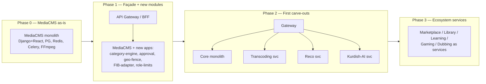
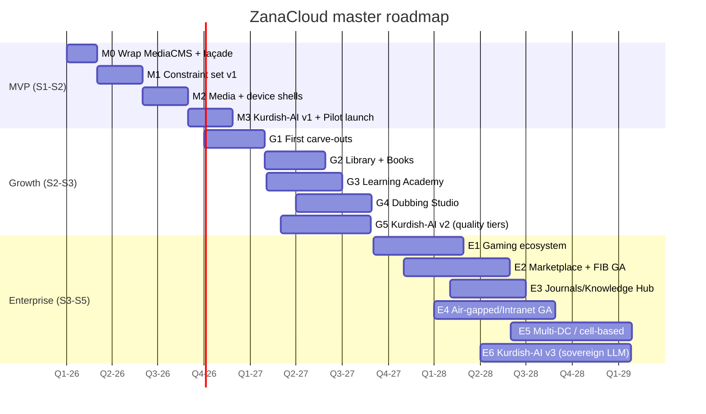

# 31 — Roadmap (MVP → Growth → Enterprise)

> **Scope:** The delivery plan for **ZanaCloud** — concrete milestones, quarterly timelines, and **exit criteria** for three horizons (**MVP / Growth / Enterprise**), mapped to (a) the **strangler-fig migration** out of [MediaCMS](../../README.md), (b) the **scaling stages** in [Scaling Strategy](./29-scaling-strategy.md), (c) the **ecosystem sequence** (media first → library → learning → gaming → marketplace → dubbing), and (d) the **Kurdish-AI initiative**.
>
> **Principle:** *Ship the constraint set before the catalog.* The non-negotiables (free, admin-approval, geo-fence, FIB-modular, role-based upload limits, intranet/FTTH mode, device-specific UX) must be real and demoable in MVP. Breadth of ecosystems comes after the control plane is trustworthy.
>
> **Sibling docs:** [Team Structure](./30-team-structure.md) · [Technology Stack](./32-technology-stack.md) · [Platform Constraints](./33-platform-constraints.md) · [Scaling Strategy](./29-scaling-strategy.md) · [System Architecture](./02-system-architecture.md)

---

## 1. Strangler-fig migration model

ZanaCloud is **never a rewrite**. We wrap MediaCMS, route through a façade, and *strangle* capabilities out of the modular monolith only when a team and a scaling profile justify it ([Scaling Strategy](./29-scaling-strategy.md)).

### 1.1 What MediaCMS already gives us (do **not** rebuild)
Upload + chunked handling, FFmpeg transcoding to multiple renditions, HLS packaging, user/roles scaffolding, comments/likes/playlists, search hookup, Celery task model, Django admin. See [Video Processing](./08-video-processing.md), [Backend Services](./04-backend-services.md).

### 1.2 What MVP **adds** on top
Category-as-experience engine ([07](./07-dynamic-category-system.md)), admin-approval workflow, role-based upload limits (the 3-min rule), geo-fencing, modular FIB adapter (off by default), device-specific UX shells, the Super Admin control plane, Kurdish ASR/TTS/OCR/MT v1, AI Governance toggles ([33](./33-platform-constraints.md)).

---

## 2. The three horizons at a glance

| Horizon | Users (scaling stage) | Theme | Ecosystems live | Architecture |
|---|---|---|---|---|
| **MVP** | 1K → 100K (S1–S2) | Prove the constraint set + media | Video/Audio + Live (basic) | Modular monolith + façade + first carve-outs |
| **Growth** | 100K → 1M (S2–S3) | Breadth + Kurdish-AI productization | + Library, Learning, Dubbing | Core services + sharding + ML serving |
| **Enterprise** | 1M → 100M (S3–S5) | National scale + commerce + sovereignty | + Gaming, Marketplace, Journals, full intranet/air-gapped GA | Full microservices + multi-DC/cell + CQRS |

---

## 3. Master timeline

---

## 4. MVP horizon (Q1–Q3 2026, S1→S2)

**Goal:** A pilot-ready media platform where **every non-negotiable constraint is real**, running in a single ISP/datacenter, with Kurdish AI v1.

### 4.1 Milestones

| ID | Milestone | Key deliverables |
|---|---|---|
| M0 | **Wrap MediaCMS** | API gateway/BFF in front of MediaCMS; CI/CD; observability baseline; offline-installable artifact (air-gapped from day 1) |
| M1 | **Constraint set v1** | Admin-approval workflow (`Pending→Approved→Published`); role-based upload limits incl. **3-min rule** + quota; geo-fence (country/region) at edge+app; **FIB adapter scaffolded, OFF by default**; Super Admin Panel v1 (no-code toggles) |
| M2 | **Media + device shells** | VOD playback ABR; basic Live; **Mobile (TikTok feed)**, **Desktop (FB+YT)**, **TV (Netflix, media-only)** shells; device-content matrix enforced |
| M3 | **Kurdish-AI v1 + Pilot** | Sorani+Kurmanji ASR (captions), TTS, OCR, MT v1 behind AI-Governance toggles; pilot launch in one ISP/region |

### 4.2 MVP exit criteria

| Criterion | Target |
|---|---|
| All 9 non-negotiables demoable end-to-end | 100% |
| Admin-approval: no content publishes without approval | Enforced, audited |
| 3-min rule + quota enforced by role | Enforced (regular/verified/admin) |
| Geo-fence blocks out-of-policy access | Verified at edge + app |
| FIB toggle flips a category to paid and back, no deploy | Works (test category) |
| Runs fully air-gapped (no public internet) | Verified in lab |
| Kurdish ASR WER / TTS MOS / OCR CER | Meets v1 bar in [34](./34-kurdish-language-intelligence.md) |
| p95 playback start | < 3s |
| Concurrent users sustained | 100K design / 10K pilot |

### 4.3 MVP risks

| Risk | Likelihood | Impact | Mitigation |
|---|---|---|---|
| Air-gapped delivery slips (mirrored registries, offline models) | M | H | Treat on-prem as P0 in M0; DevOps lead hired first ([30 §7](./30-team-structure.md)) |
| Kurdish data scarcity delays AI v1 | H | H | Start data pipeline in M0; partner for corpora; ship MT-assisted bootstrap |
| Moderation can't keep up with admin-approval | M | M | ML pre-filter in M1; staff Moderation Ops early |
| FIB integration/regulatory delays | M | M | Keep payments OFF for MVP; scaffold only |

---

## 5. Growth horizon (Q4 2026–Q3 2027, S2→S3)

**Goal:** Breadth of ecosystems + Kurdish-AI as a *product*, first service carve-outs, sharding.

### 5.1 Milestones

| ID | Milestone | Deliverables | Strangler action |
|---|---|---|---|
| G1 | **First carve-outs** | Extract Transcoding, Recommendation, Kurdish-AI into services; event bus; read replicas | Monolith → core + 3 services |
| G2 | **Library & Books** | E-reader, OCR ingest, catalog; Kurdish OCR at scale ([16](./16-digital-library-knowledge-hub.md)) | New stream service |
| G3 | **Learning Academy** | Courses, enrollment, progress, certificates ([19](./19-learning-academy.md)); optional FIB monetization toggle | New stream service |
| G4 | **Dubbing Studio** | AI dubbing pipeline Sorani/Kurmanji ([15](./15-ai-dubbing-studio.md)) | Consumes Kurdish-AI + Transcoding |
| G5 | **Kurdish-AI v2** | Quality tiers (cost-vs-quality) wired to AI Governance; voice cloning consent flows | — |

### 5.2 Growth exit criteria

| Criterion | Target |
|---|---|
| ≥ 3 ecosystems live beyond media | Library, Learning, Dubbing |
| Core services independently deployable | Transcoding/Reco/Kurdish-AI |
| DB sharding / read replicas operational | Yes |
| FIB live for ≥ 1 paid category (real txns) | Yes (e.g. paid course) |
| Device matrix admin-configurable per ecosystem | Yes |
| Sustained MAU | ~1M |
| Kurdish dubbing MOS / sync quality | Meets v2 bar |

### 5.3 Growth risks

| Risk | Mitigation |
|---|---|
| Carve-out destabilizes monolith | Strangler façade + contract tests; one extraction at a time |
| Sharding complexity | CQRS read models; shard by tenant/region early |
| Ecosystem teams outpace platform | Platform-as-product SLAs; golden paths ([30](./30-team-structure.md)) |
| Voice-clone consent/abuse | AI Governance + T&S gates before GA |

---

## 6. Enterprise horizon (Q3 2027–2028+, S3→S5)

**Goal:** National scale (up to 100M), commerce, journals, **air-gapped/intranet GA**, multi-DC/cell architecture, sovereign Kurdish LLM.

### 6.1 Milestones

| ID | Milestone | Deliverables |
|---|---|---|
| E1 | **Gaming** | Cloud/web games, tournaments, creator gaming ([18](./18-gaming-ecosystem.md)) |
| E2 | **Marketplace + FIB GA** | Trendyol/Amazon-like commerce, seller onboarding, escrow/wallet, FIB at full scale |
| E3 | **Journals/Knowledge Hub** | Academic publishing, peer-review workflow, citation graph |
| E4 | **Air-gapped/Intranet GA** | Turnkey ISP/FTTH/datacenter appliance; offline model packs; local admin; field-ops runbooks |
| E5 | **Multi-DC / cell-based** | Regional cells, geo-routing, CQRS, multi-region DR |
| E6 | **Kurdish-AI v3** | Sovereign Sorani+Kurmanji LLM; on-device/offline inference for intranet sites |

### 6.2 Enterprise exit criteria

| Criterion | Target |
|---|---|
| All ecosystems GA | Media, Library, Learning, Dubbing, Gaming, Marketplace, Journals |
| Air-gapped GA deployable by partners | Turnkey appliance + offline AI |
| Multi-DC active-active / cell isolation | Yes |
| 100M-user capacity validated | Load-tested |
| FIB commerce GA with payouts/escrow | Yes |
| Kurdish sovereign LLM serving offline | Yes |
| SLO compliance org-wide | ≥ 99.9% core paths |

### 6.3 Enterprise risks

| Risk | Mitigation |
|---|---|
| Air-gapped model updates without internet | Signed offline model-pack distribution + local mirror |
| Multi-DC consistency | CQRS + idempotent events; conflict-free where possible |
| Commerce fraud/abuse at scale | Identity&Payments fraud signals + T&S; escrow |
| Cost envelope vs free model | FinOps gating; per-category monetization offsets ([28](./28-infrastructure-cost.md)) |

---

## 7. Ecosystem sequencing rationale

| Order | Ecosystem | Why here |
|---|---|---|
| 1 | Media | MediaCMS native; fastest path to value; proves constraints |
| 2 | Library/Books | Reuses OCR (Kurdish-AI), low write-load, high cultural value |
| 3 | Learning | Builds on media + library; first natural FIB monetization |
| 4 | Dubbing | Depends on mature Kurdish ASR/TTS/MT (needs v2) |
| 5 | Gaming | Independent infra (real-time, GPU); after platform is stable |
| 6 | Marketplace | Highest compliance/payment surface; after FIB is GA |
| 7 | Journals | Niche, peer-review heavy; last, builds on library |

---

## 8. Kurdish-AI initiative track (cross-cutting)

| Version | Horizon | Milestones |
|---|---|---|
| **v1** | MVP | ASR (captions), TTS, OCR, MT v1 — Sorani+Kurmanji; eval sets; governance toggles |
| **v2** | Growth | Quality tiers (cost/quality), dialect handling, voice cloning w/ consent, dubbing-grade TTS |
| **v3** | Enterprise | Sovereign Sorani+Kurmanji LLM; offline/on-device inference for air-gapped sites; writing assistant |

> Detailed model/eval design in [Kurdish Language Intelligence](./34-kurdish-language-intelligence.md); serving in [AI Systems](./13-ai-systems.md); governance toggles in [Platform Constraints §AI Governance](./33-platform-constraints.md).

---

## 9. Roadmap ↔ scaling-stage ↔ team mapping

| Horizon | Scaling stage | Eng headcount ([30](./30-team-structure.md)) | Architecture milestone |
|---|---|---|---|
| MVP | S1→S2 | ~9 → ~58 | Façade + first carve-outs |
| Growth | S2→S3 | ~58 → ~150 | Core services + sharding |
| Enterprise | S3→S5 | ~150 → ~720 | Microservices + multi-DC/cell |

---

## 10. Cross-references
- **Who builds each milestone** → [Team Structure](./30-team-structure.md)
- **What the constraints are** → [Platform Constraints](./33-platform-constraints.md)
- **How scaling stages map** → [Scaling Strategy](./29-scaling-strategy.md)
- **Tech choices per phase** → [Technology Stack](./32-technology-stack.md)
- **Kurdish-AI detail** → [Kurdish Language Intelligence](./34-kurdish-language-intelligence.md)
