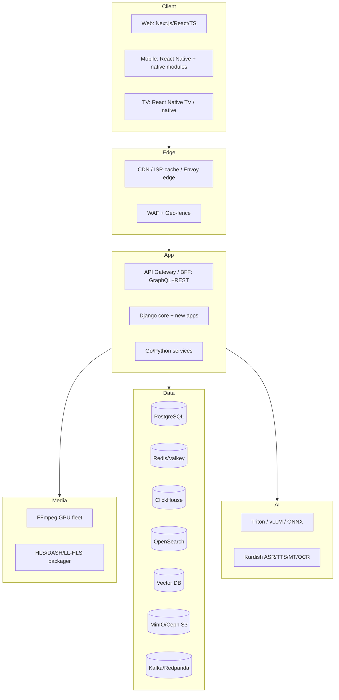

# 32 — Technology Stack (Best-of-2026)

> **Scope:** The complete, opinionated **technology stack** for every layer of **ZanaCloud** — the national AI super-platform extending [MediaCMS](../../README.md). For each component: a **primary recommendation**, **1–2 alternatives**, a **justification**, and **when to choose otherwise**. We explicitly note **what MediaCMS already provides** vs **what ZanaCloud adds**.
>
> **Constraints that shape every choice:** must run **air-gapped/intranet/FTTH** with no public internet (so: self-hostable, no mandatory SaaS, offline model serving), **free-for-users** (cost-efficient at national scale), **FIB-only payments**, **Kurdish-first AI**. Anything that cannot run on-prem inside an ISP/datacenter is disqualified from the critical path.
>
> **Sibling docs:** [System Architecture](./02-system-architecture.md) · [Frontend](./03-frontend-architecture.md) · [Backend Services](./04-backend-services.md) · [Database](./05-database-architecture.md) · [AI Systems](./13-ai-systems.md) · [Team Structure](./30-team-structure.md) · [Platform Constraints](./33-platform-constraints.md)

---

## 1. Selection principles

| Principle | Implication |
|---|---|
| **Self-hostable first** | No component may *require* a public-cloud-only managed service. SaaS allowed only as optional accelerant in cloud-connected deployments. |
| **Build on MediaCMS, don't fight it** | Keep Django/Celery/FFmpeg/Postgres/Redis core; extend, don't replace. |
| **Boring where it counts, modern where it differentiates** | Proven infra for data/streaming; cutting-edge for Kurdish-AI. |
| **Open-source license sanity** | Permissive/copyleft-compatible; avoid licenses that block on-prem redistribution to ISPs. |
| **Operable by the team we have** | Match [Team Structure](./30-team-structure.md) cognitive-load budget. |

---

## 2. Stack overview

---

## 3. Frontend

### 3.1 Web (Desktop = Facebook+YouTube hybrid)

| Option | Verdict | Notes |
|---|---|---|
| **Next.js 15 (React 19, TS) + Tailwind** | ✅ Primary | SSR/ISR/streaming, RSC, self-hostable node runtime; matches [Frontend](./03-frontend-architecture.md) |
| Remix/React Router 7 | Alt | Great data-loading model; smaller ecosystem for our needs |
| Nuxt/Vue | Alt | Choose only if team is Vue-native |

**Justification:** React aligns with MediaCMS's existing React frontend (migration path), huge talent pool, RSC reduces client JS for low-end devices common in-region. **Otherwise:** if the team is Vue-heavy, Nuxt is viable but loses MediaCMS code reuse.

**MediaCMS provides:** a React SPA frontend. **ZanaCloud adds:** Next.js shell, device-specific routing, category-as-experience renderer ([07](./07-dynamic-category-system.md)).

### 3.2 Mobile (TikTok-style)

| Option | Verdict | Notes |
|---|---|---|
| **React Native (New Architecture) + native modules** | ✅ Primary | Code-share with web logic; native modules for the vertical-feed player/gestures |
| Flutter | Alt | Best raw UI perf; separate language (Dart), no web code-share |
| Native Kotlin/Swift | Alt | For the player core only (perf-critical) |

**Justification:** RN maximizes shared logic with web/TS and team velocity; the performance-critical TikTok feed player uses native modules. **Otherwise:** choose Flutter if mobile UX fidelity dominates and web sharing is not valued.

### 3.3 TV (Netflix-style, media-only)

| Option | Verdict | Notes |
|---|---|---|
| **React Native for TV (Android TV/tvOS) + leanback** | ✅ Primary | Shares RN components; D-pad/focus engine |
| Native Android TV (Kotlin/Leanback) + tvOS | Alt | Best perf on cheap STBs |
| Web/HbbTV (Tizen/webOS) | Alt | For smart-TV browsers / ISP STBs |

**Justification:** Many in-region TVs are Android-based STBs from ISPs; RN-TV + a web/HbbTV build covers both. TV **hides Marketplace/Books/Journals/Docs** unless admin enables ([33 §Device matrix](./33-platform-constraints.md)).

### 3.4 Cross-cutting frontend

| Concern | Choice |
|---|---|
| Styling | Tailwind + CSS variables (RTL-aware for Kurdish/Arabic) |
| State/data | TanStack Query + Zustand |
| i18n | Custom ICU + Sorani/Kurmanji/Arabic/English, **RTL-first** |
| Player | Custom on `hls.js`/`shaka-player` (web), ExoPlayer/AVPlayer (native) |
| Design system | Shared tokens across web/mobile/TV ([30](./30-team-structure.md) Design System team) |

---

## 4. Backend languages & frameworks

| Layer | Primary | Alternatives | Justification / when otherwise |
|---|---|---|---|
| **Core app** | **Python 3.12 + Django** (extend MediaCMS) | — | Reuse MediaCMS; rich admin; team familiarity. Non-negotiable foundation. |
| **High-throughput services** | **Go** (transcoding orchestration, geo-fence, gateway helpers) | Rust | Go for ops simplicity + concurrency; Rust where every µs/byte counts (DRM, packager). |
| **Real-time (live chat, presence, gaming)** | **Go / Elixir** | Node.js | Elixir/Phoenix for massive WebSocket fan-out; Go default. Node if team prefers JS. |
| **ML/AI services** | **Python (FastAPI)** | — | Ecosystem + model tooling. |
| **Async tasks** | **Celery** (existing) → **Temporal** for complex workflows | Dramatiq | Keep Celery for transcode/notify; add Temporal for durable multi-step (approval, dubbing, payouts). |

**MediaCMS provides:** Django + Celery + FFmpeg orchestration. **ZanaCloud adds:** Go/Rust services as carve-outs ([31 strangler-fig](./31-roadmap.md)), Temporal for durable workflows.

---

## 5. API layer

| Component | Primary | Alternatives | Notes |
|---|---|---|---|
| **Gateway** | **Envoy** (or Kong on Envoy) | Traefik, APISIX | L7 routing, geo-fence/WAF integration, mTLS in mesh |
| **BFF / client API** | **GraphQL (Apollo/Federation)** for app reads + **REST** for uploads/webhooks | tRPC (TS-only) | GraphQL for device-tailored payloads (mobile vs TV); REST/gRPC internally |
| **Internal service-to-service** | **gRPC + protobuf** | REST/JSON | Typed contracts at strangler seams |
| **Events** | **CloudEvents over Kafka** | NATS | Standardized event envelope |

---

## 6. Databases & storage

| Store | Primary | Alternatives | Role | When otherwise |
|---|---|---|---|---|
| **Relational (system of record)** | **PostgreSQL 16** | — | Users, content metadata, approval state, entitlements, ledger | Non-negotiable (MediaCMS) |
| **Cache / broker / sessions** | **Valkey** (Redis fork) | Redis, KeyDB | Cache, Celery broker, rate-limit, geo-decisions | Valkey for license clarity on-prem |
| **Analytics (OLAP)** | **ClickHouse** | Apache Druid | Views, watch-time, recsys features, ad/payment analytics ([21](./21-analytics.md)) | Druid for real-time ingest-heavy |
| **Search** | **OpenSearch** | Elasticsearch, Typesense | Full-text + faceted catalog; Kurdish analyzers | Typesense for lighter intranet sites |
| **Vector DB** | **Qdrant** | Milvus, pgvector | Reco embeddings, semantic search, RAG for Kurdish-AI | pgvector for small/MVP, Milvus for huge scale |
| **Wide-column (scale-out)** | **ScyllaDB** | Cassandra | Feed/timeline, chat, large fan-out at S4+ | Cassandra if team prefers JVM |
| **Document (flexible schemas)** | **MongoDB** (or PG JSONB) | — | Some ecosystem catalogs; prefer PG JSONB when possible | Default to PG JSONB to limit sprawl |
| **Object storage** | **MinIO / Ceph (S3 API)** | SeaweedFS | Video/audio/books/files; **must be on-prem** for air-gapped | Ceph for very large multi-PB |

> **Sharding/CQRS** introduced at S3+ ([Scaling Strategy](./29-scaling-strategy.md)); see [Database Architecture](./05-database-architecture.md).

---

## 7. Streaming, transcoding & media

| Component | Primary | Alternatives | Notes |
|---|---|---|---|
| **Transcoding** | **FFmpeg** (GPU: NVENC/AV1) | SVT-AV1 CPU, Intel QSV | MediaCMS-native; per-title encoding ([08](./08-video-processing.md)) |
| **Codecs** | **AV1 + HEVC + H.264** ladder | VP9 | AV1 for bandwidth-scarce networks; H.264 fallback for old STBs |
| **Packaging** | **Shaka Packager / Bento4** | — | HLS + DASH + **LL-HLS** for live |
| **Live ingest** | **SRT / RTMP / WHIP** via OvenMediaEngine or nginx-rtmp | Ant Media | WebRTC (WHIP) for low-latency; SRT for contribution ([10](./10-live-streaming.md)) |
| **Origin/CDN** | **Envoy + Varnish origin shield + ISP-edge caches** | Commercial CDN (cloud mode only) | On-prem CDN mandatory for intranet; commercial CDN optional when internet present ([09](./09-streaming-infrastructure.md)) |
| **DRM** | **Widevine/PlayReady/FairPlay** (cloud) / **AES-128/SAMPLE-AES + token** (intranet) | — | Studio DRM needs licensing; intranet uses token+AES |

---

## 8. AI / ML serving

| Component | Primary | Alternatives | Justification |
|---|---|---|---|
| **LLM serving** | **vLLM** | TGI, SGLang | High-throughput, self-hosted; offline for air-gapped Kurdish LLM ([34](./34-kurdish-language-intelligence.md)) |
| **General inference** | **NVIDIA Triton** | TorchServe, Ray Serve | Multi-framework (ASR/TTS/OCR/reco) on one server |
| **Edge/CPU inference** | **ONNX Runtime** | OpenVINO | Offline/low-resource intranet sites |
| **ASR (Kurdish)** | **Whisper-family fine-tuned + custom** | NeMo | Sorani+Kurmanji captions/dubbing |
| **TTS (Kurdish)** | **VITS/XTTS-family fine-tuned** | Coqui, Piper | Dubbing-grade + on-device Piper for offline |
| **OCR (Kurdish/Arabic script)** | **Custom transformer OCR + Tesseract baseline** | PaddleOCR, Surya | Library ingest ([16](./16-digital-library-knowledge-hub.md)) |
| **MT (Sorani↔Kurmanji↔Ar/En)** | **Fine-tuned NLLB / custom seq2seq** | MarianMT | Translation + subtitle pipeline |
| **Reco/ranking** | **Two-tower + GBDT (XGBoost) + vector retrieval** | DLRM | Per-category ranking ([07](./07-dynamic-category-system.md), [13](./13-ai-systems.md)) |
| **Training/orchestration** | **PyTorch + Ray + MLflow** | Kubeflow | Self-hostable MLOps |
| **Feature store** | **Feast** | — | Reco/ranking features |

**MediaCMS provides:** none of this. **ZanaCloud adds:** the entire AI serving stack; governed via the **AI Governance layer** ([33](./33-platform-constraints.md)) — model selection, cost ceilings, quality tiers, enable/disable.

---

## 9. Data & analytics

| Component | Primary | Alternatives | Notes |
|---|---|---|---|
| **Streaming/event bus** | **Kafka** (or **Redpanda** for lean on-prem) | NATS JetStream | Backbone for events/CQRS |
| **Stream processing** | **Apache Flink** | Spark Structured Streaming | Real-time aggregates, fraud, reco features |
| **Batch/ELT** | **dbt + Spark/Trino** | — | Warehouse modeling on ClickHouse/object store |
| **Orchestration** | **Dagster** | Airflow | Asset-based pipelines |
| **BI / dashboards** | **Metabase / Superset** | Grafana (ops) | Self-hosted analytics ([21](./21-analytics.md)) |
| **Lakehouse table format** | **Apache Iceberg** | Delta, Hudi | Open table format on MinIO/Ceph |

---

## 10. Infrastructure & DevOps

| Concern | Primary | Alternatives | Notes |
|---|---|---|---|
| **Orchestration** | **Kubernetes** | Nomad | Nomad viable for smaller intranet sites with leaner ops |
| **On-prem distro** | **k3s / RKE2 / Talos** | OpenShift | Lightweight K8s for ISP/FTTH appliances |
| **IaC** | **Terraform/OpenTofu + Ansible** | Pulumi | OpenTofu (license) for on-prem; Ansible for bare-metal |
| **GitOps/CD** | **Argo CD + Argo Rollouts** | Flux | Progressive delivery; works offline with mirrored repos |
| **CI** | **GitLab CI / Forgejo Actions (self-hosted)** | GitHub Actions (cloud mode) | Must run on-prem for air-gapped builds |
| **Registry** | **Harbor** | — | Mirrored/offline registry for air-gapped ([31 M0](./31-roadmap.md)) |
| **Service mesh** | **Istio (ambient) / Linkerd** | Cilium mesh | mTLS, geo-routing; Linkerd for simplicity |
| **Networking/CNI** | **Cilium (eBPF)** | Calico | eBPF for perf + network policy |
| **Secrets** | **HashiCorp Vault / OpenBao** | sealed-secrets | OpenBao (open) for on-prem |
| **Observability** | **OpenTelemetry → Prometheus + Loki + Tempo + Grafana** | Elastic, Signoz | Fully self-hosted; offline-capable |
| **Packaging for ISPs** | **Signed Helm charts + offline bundles + appliance image** | — | Turnkey air-gapped install ([31 E4](./31-roadmap.md)) |

**MediaCMS provides:** Docker Compose deploy. **ZanaCloud adds:** K8s, GitOps, mesh, offline appliance packaging.

---

## 11. Security & compliance

| Concern | Primary | Alternatives | Notes |
|---|---|---|---|
| **AuthN** | **Keycloak (OIDC/SAML)** | Ory/Authentik | Self-hosted IdP; roles drive upload-limit/3-min rule ([33](./33-platform-constraints.md)) |
| **AuthZ** | **OPA / Cedar** policies | Casbin | Policy-as-code for geo/role/device gates |
| **WAF** | **Coraza (OWASP CRS) on Envoy** | ModSecurity | Self-hostable; geo-fence enforcement point |
| **Secrets/PKI** | **Vault/OpenBao + step-ca** | cert-manager | Internal CA for mTLS/air-gapped |
| **SAST/DAST/SCA** | **Semgrep + Trivy + ZAP** | Snyk (cloud) | Self-hosted scanning |
| **Runtime security** | **Falco + Tetragon (eBPF)** | — | Threat detection on-prem |
| **Audit/SIEM** | **Wazuh / OpenSearch SIEM** | — | Compliance + air-gapped logging |

> Full design in [Security](./24-security.md).

---

## 12. Payments (FIB)

| Concern | Primary | Notes |
|---|---|---|
| **Gateway** | **First Iraqi Bank (FIB) API** | The **only** payment rail; modular adapter, per-category toggle, OFF by default ([33 §FIB](./33-platform-constraints.md)) |
| **Adapter pattern** | Anti-corruption layer service in Identity & Payments | Isolate FIB specifics; allow future rails without touching ecosystems |
| **Ledger** | **Double-entry ledger in PostgreSQL** (or TigerBeetle at scale) | Wallet, payouts, escrow, refunds |
| **Workflow** | **Temporal** | Durable payment/refund/payout sagas |

**MediaCMS provides:** none. **ZanaCloud adds:** the entire modular FIB payment subsystem.

---

## 13. Master decision table

| Layer | Recommendation | Strongest alternative | Decisive factor |
|---|---|---|---|
| Web | Next.js/React/TS | Nuxt/Vue | MediaCMS React reuse |
| Mobile | React Native | Flutter | Logic sharing |
| TV | RN-TV + HbbTV | Native Android TV | ISP STB reality |
| Core backend | Django (MediaCMS) | — | Foundation |
| Hot-path svc | Go | Rust | Ops simplicity |
| API | GraphQL + gRPC | tRPC | Multi-device + typed seams |
| RDBMS | PostgreSQL | — | System of record |
| Cache | Valkey | Redis | License clarity |
| OLAP | ClickHouse | Druid | Cost/perf at scale |
| Search | OpenSearch | Typesense | Faceted + Kurdish analyzers |
| Vector | Qdrant | Milvus/pgvector | Self-host + perf |
| Object | MinIO/Ceph | SeaweedFS | On-prem S3 |
| Bus | Kafka/Redpanda | NATS | Ecosystem |
| LLM serve | vLLM | TGI | Throughput, offline |
| Inference | Triton | Ray Serve | Multi-framework |
| Orchestration | Kubernetes (k3s/RKE2 on-prem) | Nomad | Ecosystem + appliance |
| CD | Argo CD | Flux | Progressive + offline |
| IdP | Keycloak | Ory | Self-host OIDC |
| WAF | Coraza/Envoy | ModSecurity | Geo-fence integration |
| Payments | FIB adapter | — | Mandated rail |
| Workflows | Temporal | Cadence | Durable sagas |

---

## 14. Cross-references
- **How these compose** → [System Architecture](./02-system-architecture.md)
- **Frontend detail** → [Frontend Architecture](./03-frontend-architecture.md)
- **Data stores detail** → [Database Architecture](./05-database-architecture.md)
- **AI serving detail** → [AI Systems](./13-ai-systems.md) · [Kurdish Language Intelligence](./34-kurdish-language-intelligence.md)
- **What controls toggle these** → [Platform Constraints](./33-platform-constraints.md)
- **Who operates them** → [Team Structure](./30-team-structure.md)
