# 33 — Platform Constraints & Control Plane

> **Scope:** The **control plane** of **ZanaCloud** — the system that enforces every non-negotiable constraint extending [MediaCMS](../../README.md). This document specifies, in depth: the **free business model** + **optional per-category monetization**; the **modular FIB payment integration**; the **geo-fencing system** (country/region/city/ISP) with **enforcement points** (edge → WAF → gateway → app); the **Intranet/FTTH/air-gapped deployment mode**; the **upload-approval workflow**; **role-based upload limits** (the 3-min rule + quotas); **device-specific dynamic content filtering** (mobile/desktop/TV/intranet matrix); the **Unified Super Admin Panel** (no-code control of everything); and the **AI Governance layer**.
>
> **Design law:** *Everything in this document is configuration, not code.* An admin must be able to flip every behavior here from the Super Admin Panel **without a deploy**. All config is versioned, audited, and reversible. In air-gapped sites the same config applies locally.
>
> **Sibling docs:** [System Architecture](./02-system-architecture.md) · [Dynamic Category System](./07-dynamic-category-system.md) · [Backend Services](./04-backend-services.md) · [Security](./24-security.md) · [Technology Stack](./32-technology-stack.md) · [Team Structure](./30-team-structure.md) · [AI Systems](./13-ai-systems.md)

---

## 1. Control plane overview

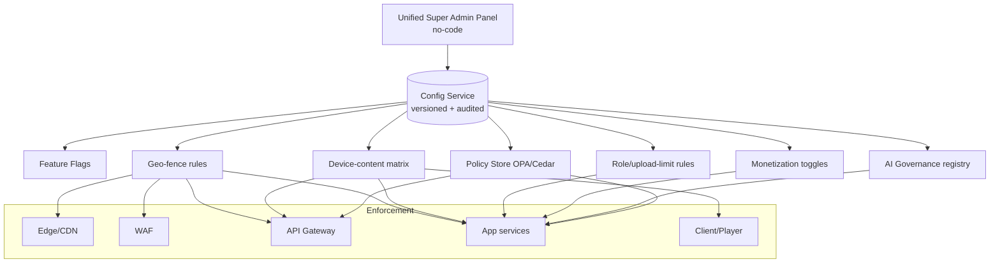

### 1.1 Configuration distribution (incl. air-gapped)

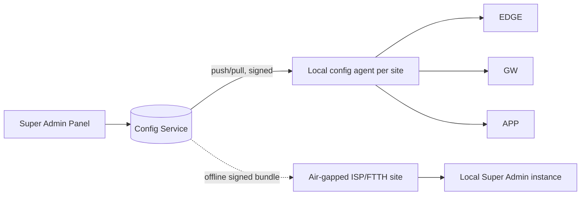

> In **air-gapped** mode, config travels as **signed offline bundles**; a **local Super Admin instance** governs the site. Same schemas, no public internet required.

---

## 2. Free business model + optional per-category monetization

### 2.1 Model

- **Default = free.** No mandatory subscription anywhere. Users never pay to *access* the platform.
- **Monetization is opt-in, per-category, admin-controlled.** An admin may enable monetization for a *specific category* (e.g. a premium course, a marketplace item, a paid live event) — never globally forced on users.
- **Rails:** FIB only (§4). Off by default.

### 2.2 Monetization config schema

```json
{
  "monetization": {
    "category_id": "learning.course.advanced-kurdish",
    "enabled": false,
    "model": "one_time | subscription | rental | tip | marketplace_sale | none",
    "currency": "IQD",
    "price": { "amount": 0, "tax_inclusive": true },
    "free_tier": { "enabled": true, "limits": { "preview_minutes": 5 } },
    "payment_rail": "FIB",
    "payout": { "split": { "creator": 0.7, "platform": 0.3 }, "escrow": false },
    "geo_pricing": [],
    "requires_admin_approval": true,
    "audit": { "last_changed_by": null, "version": 1 }
  }
}
```

### 2.3 Monetization decision table

| Category type | Default | Allowed models | Notes |
|---|---|---|---|
| Video/Audio/Live | Free | tip, rental, paid-live | Most content stays free |
| Learning Academy | Free | one_time, subscription | First natural paid surface |
| Marketplace | n/a (commerce) | marketplace_sale | Escrow/payout via FIB |
| Library/Books | Free | rental, one_time | Cultural content free-first |
| Journals | Free | one_time | Optional paywall |
| Gaming | Free | one_time, tip | Optional |

---

## 3. (reserved — see §2)

---

## 4. FIB payment integration (modular, per-category toggle)

### 4.1 Architecture — anti-corruption adapter

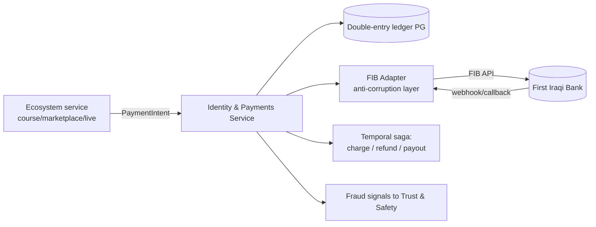

- **Modular:** ecosystems never call FIB directly — they call the **Payments Service** with a rail-agnostic `PaymentIntent`. The **FIB Adapter** is the only code that knows FIB specifics, so a future rail can be added without touching ecosystems.
- **Per-category toggle:** payments are activated by flipping `monetization.enabled` for a category. No deploy.
- **Off by default** per the free model.

### 4.2 Payment config schema

```json
{
  "fib_payment": {
    "enabled": false,
    "environment": "sandbox | production | air_gapped_disabled",
    "merchant": { "id": null, "callback_url": null },
    "capabilities": ["wallet", "one_time", "subscription", "refund", "payout", "escrow"],
    "per_category_overrides": {
      "learning.*": { "enabled": true },
      "marketplace.*": { "enabled": true, "escrow": true }
    },
    "limits": { "min_txn_iqd": 250, "max_txn_iqd": 5000000 },
    "reconciliation": { "schedule": "daily", "ledger": "postgres_double_entry" },
    "air_gapped_behavior": "disabled_no_internet"
  }
}
```

### 4.3 Payment flow (charge)

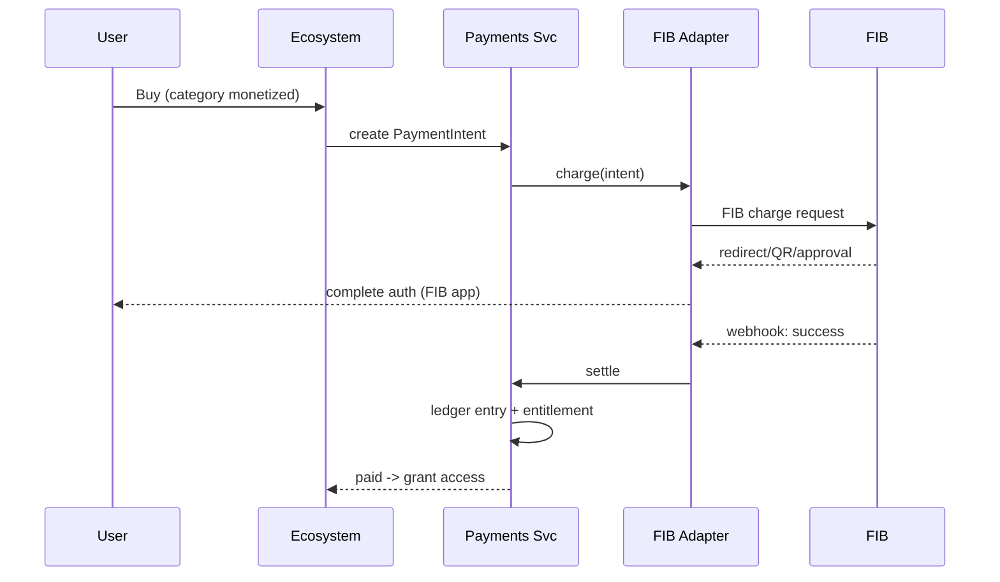

> In **air-gapped** deployments with no internet, FIB is **disabled**; monetized categories fall back to free or "unavailable" per admin policy.

---

## 5. Geo-fencing (country / region / city / ISP)

### 5.1 Enforcement points (defense in depth)

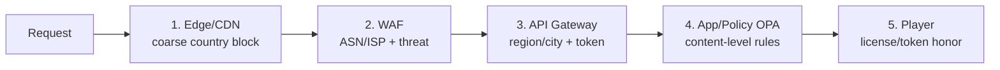

| Point | Granularity | Signal | Action |
|---|---|---|---|
| Edge/CDN | Country | GeoIP | Block/allow early, cheap |
| WAF | ISP/ASN | ASN, IP intel | Allow only whitelisted ISPs (intranet) |
| API Gateway | Region/City | GeoIP + headers | Per-region routing/limits |
| App (OPA/Cedar) | Content | User + content rules | "Kurdistan-only" content rule |
| Player | Token | Signed geo-token | Honor expiry/region in license |

### 5.2 Geo-fence rule schema

```json
{
  "geo_fence": {
    "rule_id": "kurdistan-region-only",
    "scope": "category | content | platform",
    "target": "video.documentary.*",
    "mode": "allow | deny",
    "match": {
      "countries": ["IQ"],
      "regions": ["KRG-Erbil", "KRG-Sulaymaniyah", "KRG-Duhok"],
      "cities": [],
      "isp_asns": [12345, 67890],
      "intranet_only": false
    },
    "enforcement_points": ["edge", "waf", "gateway", "app", "player"],
    "fallback": "block_with_message",
    "message_i18n": { "ckb": "...", "kmr": "...", "ar": "...", "en": "..." },
    "audit": { "version": 3, "last_changed_by": null }
  }
}
```

### 5.3 Decision logic

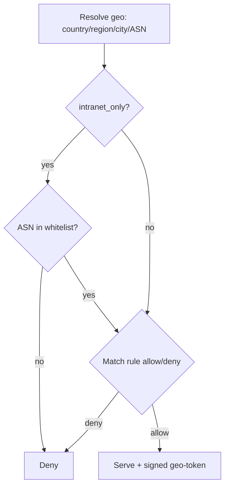

> Detail on edge/CDN and security integration: [Streaming Infrastructure](./09-streaming-infrastructure.md), [Security](./24-security.md).

---

## 6. Intranet / FTTH / air-gapped deployment mode

**Self-hosted is first-class**, not an afterthought. ZanaCloud must run **fully inside** an ISP/FTTH/private datacenter with **no public internet**.

### 6.1 Deployment modes

| Mode | Internet | Payments | AI models | Config | Updates |
|---|---|---|---|---|---|
| **Cloud-connected** | Yes | FIB live | Online + offline | Central | Online |
| **Hybrid (ISP cache)** | Limited | FIB if reachable | Mostly offline | Central + local | Periodic |
| **Air-gapped/Intranet** | **None** | **Disabled** | **Offline only** | **Local instance** | **Signed offline bundles** |

### 6.2 Air-gapped topology

```mermaid
flowchart TB
    subgraph ISP["ISP / FTTH / Datacenter (no internet)"]
        LB[Local LB + WAF + geo-fence]
        APP[App services + Django core]
        DB[(Postgres + Valkey + ClickHouse)]
        OBJ[(MinIO/Ceph)]
        AI[Offline AI: vLLM/Triton/ONNX<br/>Kurdish ASR/TTS/OCR/MT]
        REG[Local Harbor registry]
        ADMIN[Local Super Admin instance]
    end
    BUNDLE[Signed offline update bundle<br/>code + models + config] -. sneakernet/secure transfer .-> REG
    BUNDLE -. .-> AI
    BUNDLE -. .-> ADMIN
```

### 6.3 Air-gapped config schema

```json
{
  "deployment": {
    "mode": "air_gapped",
    "site_id": "isp-erbil-01",
    "internet": false,
    "features_disabled": ["fib_payments", "online_model_updates", "external_cdn"],
    "ai": { "serving": "offline", "model_pack_version": "kurdish-2026.2", "signed": true },
    "config_source": "local_signed_bundle",
    "update_channel": "offline_bundle",
    "local_admin": true,
    "telemetry": "local_only"
  }
}
```

> Packaging & delivery in [Technology Stack §Infra](./32-technology-stack.md) and [Roadmap E4](./31-roadmap.md). Offline Kurdish models in [Kurdish Language Intelligence](./34-kurdish-language-intelligence.md).

---

## 7. Upload-approval workflow

**No content self-publishes.** Every upload is `Pending → (ML pre-screen) → Human Review → Approved/Rejected → Published`.

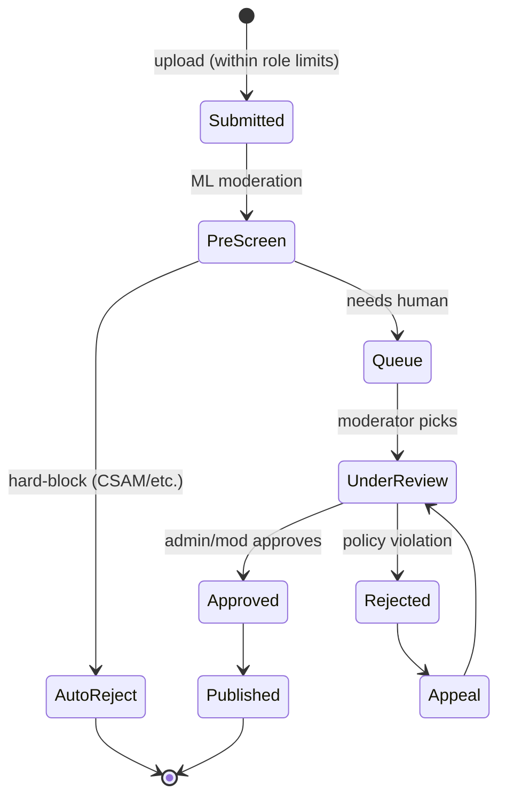

### 7.1 Approval config schema

```json
{
  "approval_workflow": {
    "enabled": true,
    "category_id": "video.*",
    "stages": ["ml_prescreen", "human_review"],
    "auto_reject_classes": ["csam", "graphic_violence", "terror"],
    "auto_approve": { "enabled": false, "trusted_roles": ["verified_creator"] },
    "sla_hours": { "standard": 24, "priority": 4 },
    "reviewer_languages": ["ckb", "kmr", "ar", "en"],
    "appeal": { "enabled": true, "sla_hours": 48 }
  }
}
```

| Setting | Behavior |
|---|---|
| `auto_approve` for trusted roles | Admin may let verified creators skip human review (still ML-screened) |
| `auto_reject_classes` | Hard-blocked at pre-screen, never queued |
| SLA | Drives Moderation Ops staffing ([Team Structure §4](./30-team-structure.md)) |

---

## 8. Role-based upload limits (the 3-minute rule)

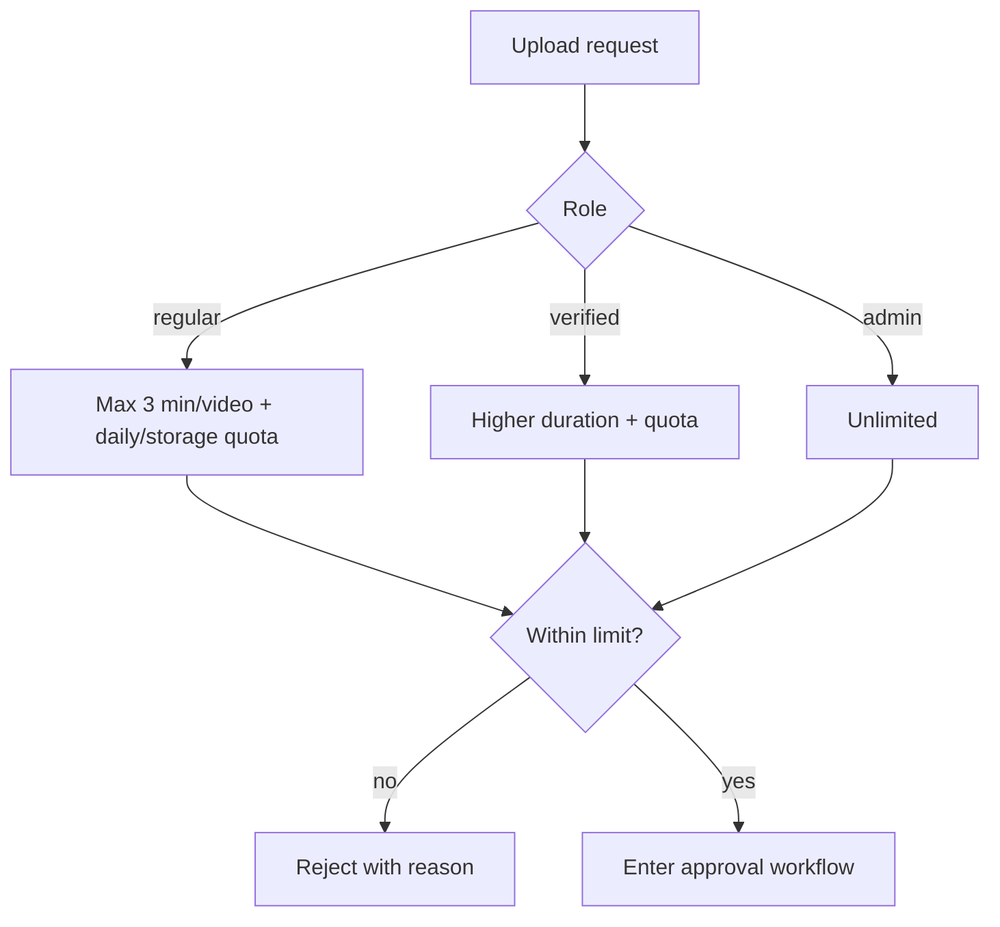

### 8.1 Role-limit config schema

```json
{
  "upload_limits": {
    "roles": {
      "regular": {
        "max_video_seconds": 180,
        "max_file_mb": 500,
        "daily_uploads": 5,
        "storage_quota_gb": 5,
        "allowed_types": ["video", "audio", "image"]
      },
      "verified_creator": {
        "max_video_seconds": 3600,
        "max_file_mb": 10240,
        "daily_uploads": 50,
        "storage_quota_gb": 500,
        "allowed_types": ["video", "audio", "image", "document", "book"]
      },
      "admin": {
        "max_video_seconds": null,
        "max_file_mb": null,
        "daily_uploads": null,
        "storage_quota_gb": null,
        "allowed_types": ["*"]
      }
    },
    "enforcement": ["client_hint", "gateway", "app_authoritative"],
    "quota_window": "rolling_24h"
  }
}
```

| Role | Max video | Quota | Types |
|---|---|---|---|
| Regular | **3 min** | small daily + storage | video/audio/image |
| Verified | up to 60 min | large | + docs/books |
| Admin | unlimited | unlimited | all |

> Enforced **authoritatively in the app** (client/gateway are hints only). Roles come from Keycloak ([Technology Stack §Security](./32-technology-stack.md)).

---

## 9. Device-specific dynamic content filtering

Which categories appear on **mobile / desktop / TV / intranet** is an **admin-defined matrix**. TV is media-only by default — **Marketplace, Books, Journals, Docs hidden** unless an admin explicitly enables them.

### 9.1 Default device-content matrix

| Category | Mobile | Desktop | TV | Intranet |
|---|---|---|---|---|
| Video/Shorts | ✅ (TikTok feed) | ✅ (FB+YT) | ✅ (Netflix) | ✅ |
| Audio/Music | ✅ | ✅ | ✅ | ✅ |
| Live | ✅ | ✅ | ✅ | ✅ |
| Learning | ✅ | ✅ | ⚙ admin | ✅ |
| Library/Books | ✅ | ✅ | ❌ default | ✅ |
| Journals | ⚙ admin | ✅ | ❌ default | ✅ |
| Marketplace | ✅ | ✅ | ❌ default | ⚙ admin |
| File Archive/Docs | ⚙ admin | ✅ | ❌ default | ✅ |
| Gaming | ✅ | ✅ | ⚙ admin | ⚙ admin |

✅ shown · ❌ hidden · ⚙ admin-toggle

### 9.2 Device-matrix config schema

```json
{
  "device_content_matrix": {
    "version": 5,
    "devices": ["mobile", "desktop", "tv", "intranet"],
    "ux_profile": {
      "mobile": "tiktok_vertical_feed",
      "desktop": "facebook_youtube_hybrid",
      "tv": "netflix_media_only",
      "intranet": "full_or_local_policy"
    },
    "categories": {
      "video": { "mobile": true, "desktop": true, "tv": true, "intranet": true },
      "marketplace": { "mobile": true, "desktop": true, "tv": false, "intranet": false },
      "books": { "mobile": true, "desktop": true, "tv": false, "intranet": true },
      "journals": { "mobile": false, "desktop": true, "tv": false, "intranet": true },
      "docs": { "mobile": false, "desktop": true, "tv": false, "intranet": true },
      "gaming": { "mobile": true, "desktop": true, "tv": false, "intranet": false }
    },
    "tv_media_only_lock": true
  }
}
```

### 9.3 Enforcement

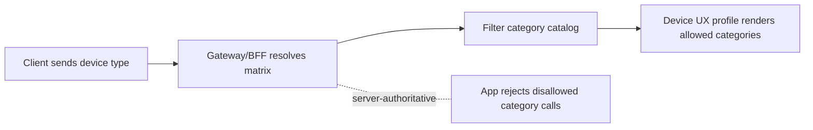

> Device detection + UX profiles in [Frontend Architecture](./03-frontend-architecture.md); category catalog in [Dynamic Category System](./07-dynamic-category-system.md). Enforcement is **server-authoritative** — hiding in UI is not enough.

---

## 10. Unified Super Admin Panel (no-code)

A single visual control plane governs **everything** — no code, all audited.

### 10.1 Information architecture

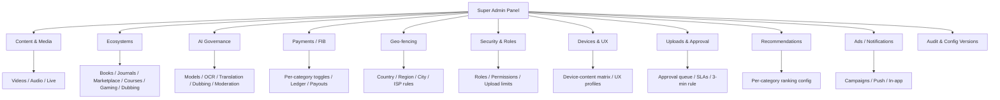

### 10.2 Admin domains & what they control

| Domain | Controls |
|---|---|
| Content & Media | Videos, audio, live; publish/unpublish; takedowns |
| Ecosystems | Enable/disable Books, Journals, Marketplace, Courses, Gaming, Dubbing per region/device |
| AI Governance | Models, OCR/translation/dubbing/moderation quality + cost (§11) |
| Payments/FIB | Per-category monetization toggle, pricing, payouts, ledger view |
| Geo-fencing | Country/region/city/ISP rules, intranet whitelist |
| Security & Roles | Roles, permissions, **upload limits / 3-min rule**, verification |
| Devices & UX | Device-content matrix, UX profiles, TV media-only lock |
| Uploads & Approval | Approval queue, SLAs, auto-approve trusted roles |
| Recommendations | Per-category ranking weights, freshness, diversity |
| Ads & Notifications | Campaigns, push, in-app messaging |
| Audit | Config versions, rollback, who-changed-what |

### 10.3 Admin action contract

```json
{
  "admin_action": {
    "actor": "admin:uuid",
    "domain": "geo_fence | monetization | device_matrix | ai_governance | approval | roles",
    "operation": "create | update | toggle | rollback",
    "target": "video.documentary.*",
    "before": {},
    "after": {},
    "no_code": true,
    "requires_deploy": false,
    "audit_id": "uuid",
    "timestamp": "2026-06-07T00:00:00Z"
  }
}
```

> Every change is **versioned, reversible, audited**; no change requires a deploy. In air-gapped sites a **local Super Admin instance** exposes the same IA.

---

## 11. AI Governance layer

Central governance of all AI: enable/disable features, select models, set cost ceilings, tune quality, and configure moderation/translation/OCR/dubbing.

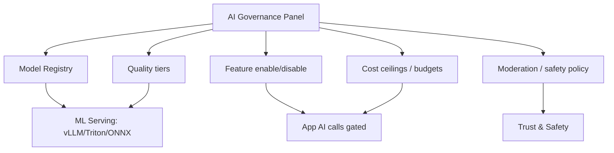

### 11.1 AI Governance config schema

```json
{
  "ai_governance": {
    "features": {
      "asr_captions": { "enabled": true, "model": "kurdish-asr-v2", "languages": ["ckb", "kmr"] },
      "tts": { "enabled": true, "model": "kurdish-tts-v2", "quality_tier": "standard" },
      "translation": { "enabled": true, "model": "kurdish-mt-nllb-ft", "pairs": ["ckb-en", "kmr-ckb", "ckb-ar"] },
      "ocr": { "enabled": true, "model": "kurdish-ocr-v1", "script": "arabic_kurdish" },
      "dubbing": { "enabled": false, "model": "dubbing-pipeline-v2", "quality_tier": "premium", "consent_required": true },
      "moderation": { "enabled": true, "model": "moderation-multilang", "auto_block_classes": ["csam", "terror"] },
      "recommendations": { "enabled": true, "model": "two-tower-v3" },
      "writing_assistant": { "enabled": false, "model": "kurdish-llm-v3" }
    },
    "cost_controls": {
      "monthly_budget_usd": 50000,
      "per_feature_ceilings": { "dubbing": 10000, "asr_captions": 8000 },
      "throttle_on_exceed": true,
      "fallback_to_cheaper_model": true
    },
    "quality_tiers": { "standard": {}, "premium": {}, "offline_lite": {} },
    "deployment": { "air_gapped": { "serving": "offline", "models_signed": true } },
    "audit": { "version": 7 }
  }
}
```

### 11.2 Governance decision table

| Lever | Effect | When to use |
|---|---|---|
| Feature enable/disable | Turns an AI capability on/off platform-wide or per category | Risk, cost, regulatory |
| Model selection | Swap model version per feature | Quality/cost tradeoff, rollback |
| Cost ceiling + throttle | Caps spend; falls back to cheaper model | Free-model economics ([28](./28-infrastructure-cost.md)) |
| Quality tier | standard/premium/offline-lite | Per-device, per-network, air-gapped |
| Moderation policy | Auto-block classes, thresholds | Trust & Safety ([30](./30-team-structure.md)) |
| Consent gates | Require consent (voice clone/dubbing) | Abuse prevention |

> Models, eval, and offline packs for Kurdish in [Kurdish Language Intelligence](./34-kurdish-language-intelligence.md); serving stack in [AI Systems](./13-ai-systems.md) and [Technology Stack §AI](./32-technology-stack.md).

---

## 12. Constraint → enforcement summary

| Constraint | Primary enforcement point | Config schema | Server-authoritative? |
|---|---|---|---|
| Free for users | Monetization default off | §2.2 | Yes |
| Per-category monetization | Payments Service + toggle | §2.2, §4.2 | Yes |
| FIB-only payments | FIB Adapter | §4.2 | Yes |
| Admin-approval publishing | Approval workflow | §7.1 | Yes |
| 3-min rule + role limits | App (authoritative) | §8.1 | Yes |
| Geo-fencing | Edge→WAF→GW→App→Player | §5.2 | Yes |
| Intranet/air-gapped | Deployment mode + offline bundles | §6.3 | Yes |
| Device content filtering | Gateway/BFF + app | §9.2 | Yes |
| No-code admin | Super Admin Panel + Config Service | §10.3 | Yes |
| AI Governance | Governance layer gating AI calls | §11.1 | Yes |

---

## 13. Cross-references
- **Where categories are defined** → [Dynamic Category System](./07-dynamic-category-system.md)
- **Architecture of the control plane** → [System Architecture](./02-system-architecture.md)
- **Device UX profiles** → [Frontend Architecture](./03-frontend-architecture.md)
- **Security/policy engines** → [Security](./24-security.md)
- **AI serving & models** → [AI Systems](./13-ai-systems.md) · [Kurdish Language Intelligence](./34-kurdish-language-intelligence.md)
- **Who operates this** → [Team Structure](./30-team-structure.md)
- **When it ships** → [Roadmap](./31-roadmap.md)
