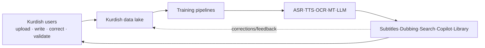
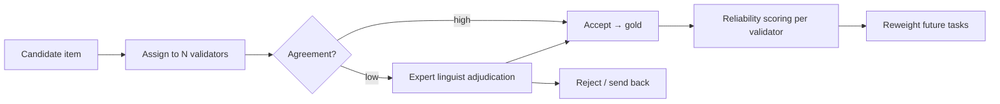
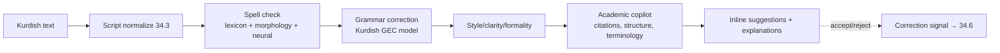
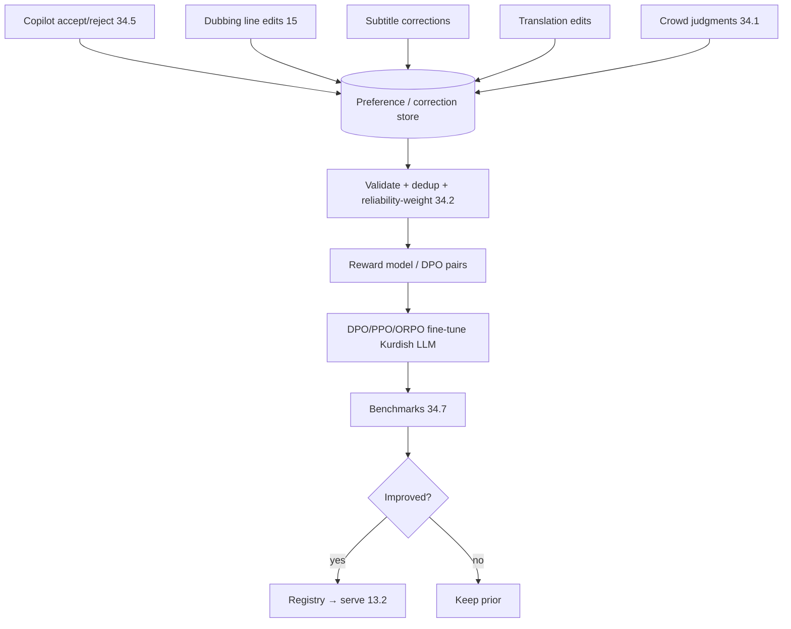
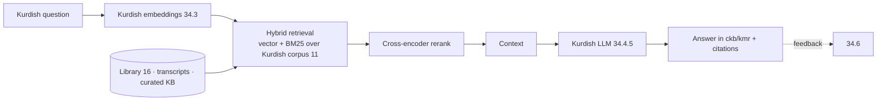
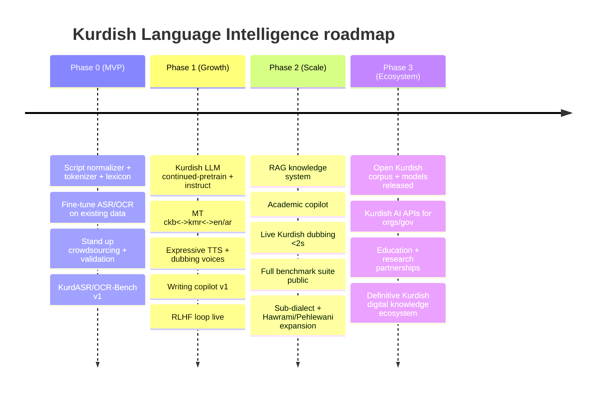

# 34 — Kurdish Language Intelligence (Sorani & Kurmanji)

> **Part C — AI & Creator Tools** · ZanaCloud blueprint
> **The strategic centerpiece.** A dedicated, end-to-end initiative to make ZanaCloud the home of the world's most advanced Kurdish digital knowledge ecosystem: data collection & crowdsourcing, human validation, training pipelines for ASR/TTS/OCR/MT/dubbing/LLM, a grammar/spell/style correction & academic-writing copilot, continuous RLHF from verified corrections, a retrieval-augmented Kurdish knowledge system, evaluation benchmarks, and dataset governance/licensing.
> **Languages:** **Sorani** (`ckb`, Arabic-based script, primary in KRI/Iraq) and **Kurmanji** (`kmr`, Latin-based script, largest dialect overall). Designed to extend to Sorani sub-dialects and eventually Pehlewani/Hawrami.
> **Siblings:** [13-ai-systems.md](./13-ai-systems.md) · [15-ai-dubbing-studio.md](./15-ai-dubbing-studio.md) · [16-digital-library-knowledge-hub.md](./16-digital-library-knowledge-hub.md) · [11-search-engine.md](./11-search-engine.md) · [33-platform-constraints.md](./33-platform-constraints.md)
> **Non-negotiables honored here:** free for users (the writing copilot and Kurdish tools are free public goods); admin-approval (published corpora/benchmarks curated); per-category monetization (enterprise Kurdish AI APIs may be metered for orgs while staying free for citizens); **intranet/FTTH → all Kurdish models trainable and servable on-prem**; data sovereignty (Kurdish data stays in-country); no-code governance over which Kurdish models are active.

---

## 34.0 Why this is the centerpiece

Kurdish is a **low-resource, diglossic, multi-script** language: two major dialects (Sorani/Kurmanji) written in two scripts (Arabic/Latin), rich morphology, scarce labeled data, and near-zero coverage in commercial models. No vendor (OpenAI, Google, ElevenLabs, DeepL) treats Kurdish as first-class. **That gap is the opportunity.** ZanaCloud is uniquely positioned because it *owns the data flywheel*: millions of Kurdish videos, books, comments, and corrections flow through the platform daily. This document turns that flywheel into models.



---

## 34.1 The data flywheel (collection & crowdsourcing)

```mermaid
flowchart TB
    subgraph Sources["Organic platform data"]
        VID[Videos → ASR transcripts]
        BOOKS[Library OCR 16 → text]
        UGC[Comments/posts]
        DUB[Dubbing corrections 15]
        SEARCH2[Search queries/clicks 11]
    end
    subgraph Crowd["Crowdsourcing programs"]
        READ[Read-aloud (TTS/ASR pairs)]
        TRANSC[Transcribe-a-clip]
        TRANSLATE[Translate sentence pairs]
        SPELL[Spelling/grammar judgments]
        DIALECT[Dialect tagging]
    end
    subgraph Partners["Institutional partners"]
        UNI[Universities / Kurdish Academy]
        MEDIA[Broadcasters / publishers]
        GOV[Public archives]
    end
    Sources & Crowd & Partners --> RAW[(Raw Kurdish corpus)]
    RAW --> CLEAN[Normalize · dedup · script-detect · PII-strip]
    CLEAN --> VALID[Human validation 34.2]
    VALID --> GOLD[(Curated / gold datasets)]
```

**Crowdsourcing design (a "Common Voice for Kurdish", in-house):**

| Program | Task | Output | Incentive |
|---|---|---|---|
| **Read-aloud** | record given sentences | TTS + ASR pairs | badges, leaderboard, creator perks |
| **Transcribe** | caption short clips | ASR pairs | gamified, micro-rewards (FIB wallet, free for users) |
| **Translate** | ckb↔kmr↔en/ar parallel sentences | MT pairs | reputation/contributor rank |
| **Judge** | rate spelling/grammar/translation | preference + correction data → RLHF | community status |
| **Dialect-tag** | label dialect/script/region | metadata | — |

Every task has **redundancy** (N annotators) and **gold-question seeding** to score annotator reliability. Contributions are consent-licensed (§34.10) and PII-scrubbed.

---

## 34.2 Human validation workflows



- **Tiers:** crowd validators → trusted contributors → expert linguists (Kurdish Academy partners). Inter-annotator agreement (Krippendorff's α) tracked per dataset.
- **Gold seeding:** known-answer items measure each validator; unreliable validators are down-weighted or retrained.
- **Active learning:** the model's most-uncertain items are prioritized for human validation, maximizing label value per hour.
- **Provenance:** every gold item records contributors, validators, license, dialect, script, date — for governance and reproducibility (§34.10).

---

## 34.3 Foundational NLP layer (the shared substrate)

Before task models, build the linguistic substrate every Kurdish model needs.

| Component | Purpose |
|---|---|
| **Script normalizer** | Canonicalize Sorani Arabic-script (ye/he/kaf variants, ZWNJ), Kurmanji Latin (diacritics); reversible mapping ckb↔kmr transliteration |
| **Tokenizer** | Morphology-aware subword (SentencePiece) trained on Kurdish; handles agglutination/ezafe |
| **Morphological analyzer** | Lemmatization, POS, ezafe, clitics |
| **Sentence/diacritic tooling** | Sentence splitting, optional diacritic restoration |
| **Embeddings** | Kurdish-tuned sentence embeddings for search/RAG/dedup ([11](./11-search-engine.md)) |
| **Dialect/script detector** | Route text to the right model path |

This substrate is shared by ASR, TTS, OCR, MT, LLM, and the copilot.

---

## 34.4 Training pipelines (per modality)

```mermaid
flowchart TB
    GOLD[(Curated datasets 34.1/34.2)] --> PIPE[Training & eval pipeline (MLOps)]
    PIPE --> ASRm[ASR]
    PIPE --> TTSm[TTS]
    PIPE --> OCRm[OCR]
    PIPE --> MTm[MT]
    PIPE --> LLMm[Kurdish LLM]
    PIPE --> DUBm[Dubbing voices]
    ASRm & TTSm & OCRm & MTm & LLMm & DUBm --> EVAL[Benchmarks 34.7]
    EVAL --> REG[(Model registry 13.2)]
    REG --> SERVE[On-prem serving 13.3]
    SERVE -. used by .-> PROD[AI Plane 13 · Dubbing 15 · Library 16 · Search 11]
    PROD -. feedback .-> GOLD
```

### 34.4.1 ASR (speech → Kurdish text)
- **Base:** Whisper-large-v3 / NVIDIA Canary / Parakeet → **fine-tune on Kurdish read-aloud + transcribed clips** ([34.1](#341-the-data-flywheel-collection--crowdsourcing)).
- Per-dialect heads (ckb/kmr); streaming Parakeet variant for live ([15](./15-ai-dubbing-studio.md) §15.10).
- Metric: **WER/CER** per dialect; target steady reduction each quarter.

### 34.4.2 TTS (Kurdish text → speech)
- **Base:** XTTS-v2 / Orpheus / StyleTTS2 / Kokoro → fine-tune with read-aloud + studio recordings.
- Multi-speaker, expressive, dialect-correct prosody; cloned voices feed the Dubbing Studio ([15](./15-ai-dubbing-studio.md) §15.5).
- Metric: **MOS / predicted MOS (UTMOS)**, speaker similarity, intelligibility.

### 34.4.3 OCR (Kurdish print/handwriting → text)
- **Base:** **PaddleOCR / Docling / MinerU** → fine-tune for Sorani Arabic-script and Kurmanji Latin; handle historical fonts, mixed-script pages.
- Powers the Digital Library ([16](./16-digital-library-knowledge-hub.md)) digitizing Kurdish books/archives.
- Metric: **CER**, layout/reading-order accuracy.

### 34.4.4 MT (translation)
- **Base:** NLLB-200 + Aya/Qwen → fine-tune on crowdsourced parallel data; **ckb↔kmr as a first-class pair**, plus ↔en/ar/fa/tr.
- Document-level, context-aware (feeds Dubbing §15.6 and Library translation studio).
- Metric: **COMET / chrF++ / BLEU** + human MQM.

### 34.4.5 Kurdish LLM (the cognitive core)
- **Strategy:** continued-pretraining of a strong open base (Qwen2.5 / Llama-3.x / Aya) on the large cleaned Kurdish corpus → instruction-tune on Kurdish task data → RLHF from verified corrections (§34.6).
- Capabilities: chat, summarization, the writing copilot (§34.5), RAG answering (§34.8), MT refinement, metadata generation in Kurdish.
- Bi-dialectal, bi-script; understands code-switching (Kurdish↔Arabic/English).

### 34.4.6 Dubbing voices
- Kurdish voice library + cloning fine-tunes feeding [15](./15-ai-dubbing-studio.md); consent/watermarking enforced there.

**MLOps:** all pipelines are reproducible (data version + config + code hash), tracked in MLflow, registered to the governance registry ([13](./13-ai-systems.md) §13.2), evaluated against frozen benchmarks before promotion, and servable on-prem (vLLM/Triton).

---

## 34.5 Grammar / spell / style correction & academic-writing copilot

A free public tool — "the Kurdish writing assistant" — for students, journalists, academics, and government.



| Feature | Detail |
|---|---|
| **Spell check** | Morphology-aware (handles inflection/ezafe), dialect+script aware, suggests corrections with reasons |
| **Grammar (GEC)** | Seq2seq GEC fine-tuned on error→correct pairs (synthetic + human) |
| **Style** | Formality, conciseness, register; ckb/kmr-appropriate phrasing |
| **Academic copilot** | Structure (abstract/sections), citation formatting, terminology consistency, plagiarism-aware paraphrase, ckb↔kmr↔en drafting |
| **Explainability** | Each suggestion explains the rule (teaching, not just fixing) |
| **Privacy** | Runs on-prem; documents never leave the network |

Every **accept/reject** is a free, high-quality correction signal feeding RLHF (§34.6) — the copilot *teaches the models* as people use it.

---

## 34.6 Continuous RLHF from verified corrections



- Corrections are **verified** (passed §34.2 validation) before training — no blind learning from raw clicks.
- Uses **DPO/ORPO** (preference pairs from accept/reject) and PPO where a reward model exists.
- **Guardrails:** every candidate must beat the frozen benchmark suite (§34.7) or it is rolled back; canary serving before promotion ([13](./13-ai-systems.md) §13.11).
- This closes the flywheel: the more Kurds use the platform, the better Kurdish AI gets — continuously.

---

## 34.7 Evaluation benchmarks

We build the **definitive Kurdish AI benchmark suite** (a public good, governed by the Kurdish Academy partnership).

| Benchmark | Measures | Metric |
|---|---|---|
| **KurdASR-Bench** | speech recognition ckb/kmr, multi-domain/accent | WER/CER |
| **KurdTTS-Bench** | synthesis quality/naturalness | MOS / UTMOS, similarity |
| **KurdOCR-Bench** | print + handwriting, both scripts | CER, layout F1 |
| **KurdMT-Bench** | ckb↔kmr↔en/ar/fa/tr | COMET/chrF++/BLEU + MQM |
| **KurdGEC-Bench** | grammar/spell correction | F0.5 (precision-weighted) |
| **KurdLLM-Bench** | knowledge, reasoning, instruction-following in Kurdish | accuracy / win-rate (human + LLM-judge) |
| **KurdSafety-Bench** | toxicity/bias/hate detection in Kurdish | precision/recall |

- **Frozen test sets** never used in training; leaderboards published; per-dialect breakdowns mandatory.
- Human MQM panels (expert linguists) for translation/LLM quality, not just automatic metrics.
- Gates promotion of every Kurdish model in the registry ([13](./13-ai-systems.md) §13.11).

---

## 34.8 Retrieval-augmented Kurdish knowledge system

A Kurdish-language RAG layer over the platform's own corpus (library, transcripts, encyclopedic content) — so the assistant answers in Kurdish, grounded in Kurdish sources, with citations.



- **Sources:** OCR'd Kurdish books ([16](./16-digital-library-knowledge-hub.md)), video transcripts, a curated Kurdish knowledge base, dialect/grammar references.
- **Hybrid retrieval** (dense Kurdish embeddings + lexical) with cross-encoder reranking ([11](./11-search-engine.md)).
- **Grounded, cited answers**; refuses/curbs hallucination when sources are thin.
- Becomes the backbone of a "Kurdish Wikipedia + tutor + research assistant" — answering in the user's dialect/script.

---

## 34.9 Serving & integration

- All Kurdish models register in the AI Governance registry ([13](./13-ai-systems.md) §13.2) and serve on-prem GPUs (vLLM for LLM/MT, Triton for ASR/TTS/OCR) — fully functional in FTTH/air-gapped mode.
- Consumed by: subtitles/metadata ([13](./13-ai-systems.md)), Dubbing ([15](./15-ai-dubbing-studio.md)), Library translation/audiobooks ([16](./16-digital-library-knowledge-hub.md)), Search/RAG ([11](./11-search-engine.md)), the writing copilot (§34.5).
- Governance can pick the active Kurdish model + quality tier per feature/category, no code.

---

## 34.10 Dataset governance & licensing

| Concern | Policy |
|---|---|
| **Sovereignty** | Kurdish data stored and trained in-country; never leaves the network in air-gapped deployments |
| **Consent & licensing** | Crowd contributions under explicit, revocable license; institutional data under signed agreements; voices consent-gated ([15](./15-ai-dubbing-studio.md) §15.11) |
| **PII** | Automated PII detection + scrubbing before any item enters gold |
| **Provenance** | Every dataset item carries source, contributors, validators, dialect, script, license, date |
| **Open vs restricted tiers** | A baseline corpus + benchmarks released openly as a public good; sensitive/partner data kept restricted |
| **Bias & representation** | Track dialect/region/gender balance; actively crowdsource under-represented variants |
| **Auditability** | Reproducible data versions; governance dashboard ([33](./33-platform-constraints.md)) shows what trained each model |

---

## 34.11 Roadmap



| Phase | Headline deliverables | Gate |
|---|---|---|
| 0 | Substrate + ASR/OCR fine-tunes + crowdsourcing live | Benchmarks v1 published |
| 1 | Kurdish LLM + MT + TTS + copilot + RLHF | Beat baselines on all benches |
| 2 | RAG + academic copilot + live dubbing + full benchmark suite | Human-MQM parity targets |
| 3 | Open corpus/models + enterprise APIs + partnerships | Adoption + sovereignty audits |

---

## 34.12 Summary

Kurdish Language Intelligence converts ZanaCloud's organic data flywheel — videos, books, comments, dubbing edits, and a free public writing copilot — into validated gold corpora that train on-prem, bi-dialectal, bi-script models for ASR, TTS, OCR, MT, dubbing, and a Kurdish LLM, all gated by a definitive Kurdish benchmark suite and continuously improved by RLHF from verified corrections. Built for data sovereignty and full FTTH/air-gapped operation, and grounded by a retrieval-augmented Kurdish knowledge system, the initiative's vision is to make ZanaCloud the world's most advanced Kurdish digital knowledge ecosystem — where every use of the platform makes Kurdish AI measurably better.
