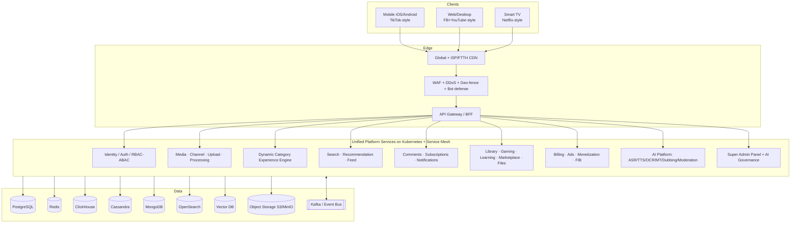

# ئەسڵ‌پلاتفۆرم — National AI Super-Platform Blueprint

> **Codename:** `ZanaCloud` (from Kurdish *zana* — "the knowledgeable one")
> **Foundation:** This blueprint extends the existing [MediaCMS](../../README.md) (Django + React) codebase into a national-scale, AI-powered media & knowledge super-platform for the Kurdistan Region and Iraq, with global-grade engineering.
> **Status:** Architecture & design blueprint (v1, 2026).
> **Audience:** Principal architects, staff engineers, SRE/DevOps, AI researchers, product & business leadership.

---

## 0. What this is

A single, unified ecosystem that combines the capabilities of:

`YouTube + Netflix + Deepdub + Spotify + Radio Javan + Facebook Gaming + Twitch + Udemy + Coursera + Google Books + Kindle + Internet Archive + Nature + ResearchGate + FileCR + Amazon + Trendyol`

…on **one** architecture, **one** authentication system, **one** AI infrastructure, **one** recommendation engine, **one** payment system, **one** analytics platform, and **one** centralized Super Admin Panel — with **first-class Kurdish (Sorani + Kurmanji) language intelligence** as a strategic differentiator.

### Founding constraints (non-negotiable design inputs)

| Constraint | Implication |
|---|---|
| **Free for end users** | No mandatory subscriptions. Monetization is *optional and per-category*, controlled by admins. |
| **Admin-gated publishing** | `Upload → Pending Review → Admin Approval → Published`. No direct self-publish. |
| **Upload limits by role** | Regular users: ≤ 3 min video + configurable quota. Verified creators: higher. Admins: unlimited. |
| **Payment = FIB-first** | First Iraqi Bank (FIB) API as primary gateway; modular, per-category enable/disable; wallet, subscriptions, refunds. |
| **Geo-fencing** | Restrict by country / region / city / ISP (e.g. "Iraq only" or "Kurdistan Region only"). |
| **Intranet / FTTH mode** | Must operate fully inside ISP/FTTH/private networks with **no public internet**. |
| **Device-specific UX** | Mobile = TikTok/Shorts-first; Desktop/Web = Facebook+YouTube; TV = Netflix (media categories only). |
| **Category-as-experience** | Every category has its own layout, widgets, ranking algorithm, and recommendation engine. No single universal homepage. |
| **No-code admin control** | Everything above is configurable from a visual Super Admin Panel without writing code. |
| **Kurdish-first AI** | OCR, ASR, TTS, translation, dubbing, and writing assistance for Sorani & Kurmanji are core products, not afterthoughts. |

---

## 1. Document map

### Part A — Foundations & Architecture
| # | Document | Covers |
|---|---|---|
| 01 | [Product Vision](./01-product-vision.md) | Goals, personas, revenue models, free-first economics |
| 02 | [System Architecture](./02-system-architecture.md) | Microservices vs monolith, DDD, CQRS, event sourcing, API gateway, service mesh |
| 03 | [Frontend Architecture](./03-frontend-architecture.md) | Next.js/React/TS/Tailwind, web/mobile/TV/desktop, SSR/ISR/streaming/edge |
| 04 | [Backend Services](./04-backend-services.md) | All 21 core services: responsibilities, APIs, schemas, scaling |
| 05 | [Database Architecture](./05-database-architecture.md) | Postgres, Redis, ClickHouse, Cassandra, Mongo, OpenSearch, Vector DB |
| 06 | [Upload Pipeline](./06-upload-pipeline.md) | Chunked/resumable/multipart upload, virus scan, validation, metadata |

### Part B — Media Engine
| # | Document | Covers |
|---|---|---|
| 08 | [Video Processing](./08-video-processing.md) | FFmpeg cluster, transcoding 144p→8K, captions, queues |
| 09 | [Streaming Infrastructure](./09-streaming-infrastructure.md) | HLS/DASH, CDN, edge, ABR, low-latency |
| 10 | [Live Streaming](./10-live-streaming.md) | RTMP/WebRTC/SRT ingest, LL-HLS, chat, DVR, scaling |
| 11 | [Search Engine](./11-search-engine.md) | OpenSearch, ranking, semantic/AI search, indexing pipeline |
| 12 | [Recommendation Engine](./12-recommendation-engine.md) | Candidate generation, ranking, embeddings, RL, real-time |

### Part C — AI & Creator Tools
| # | Document | Covers |
|---|---|---|
| 13 | [AI Systems](./13-ai-systems.md) | Video understanding, moderation, copyright, generation, models |
| 14 | [Creator Studio](./14-creator-studio.md) | Dashboard, analytics, revenue, copyright center, A/B testing |
| 15 | [AI Dubbing Studio](./15-ai-dubbing-studio.md) | Deepdub-level: diarization, isolation, emotion, lip-sync, real-time |
| 34 | [Kurdish Language Intelligence](./34-kurdish-language-intelligence.md) | Sorani/Kurmanji datasets, ASR/TTS/OCR/MT, RLHF, writing copilot |

### Part D — Category Ecosystems (Dynamic Experiences)
| # | Document | Covers |
|---|---|---|
| 07 | [Dynamic Category Experience System](./07-dynamic-category-system.md) | Per-category layouts, drag-drop page builder, Movies/Kids/Gaming/Sports/Islamic/Music/News/Podcast |
| 16 | [Digital Library & Knowledge Hub](./16-digital-library-knowledge-hub.md) | Books, journals, OCR, translation studio, audiobook generation |
| 17 | [File & Archive Hub](./17-file-archive-hub.md) | ZIP/ISO/APK hosting, AI file analysis, archive viewer |
| 18 | [Gaming Ecosystem](./18-gaming-ecosystem.md) | Twitch+Steam+Discord hybrid, esports, communities, cloud-gaming roadmap |
| 19 | [Learning & Academy](./19-learning-academy.md) | Udemy/Coursera-class courses, certificates, AI tutor |
| 20 | [Marketplace](./20-marketplace.md) | Amazon/Trendyol-class commerce, seller center, fraud detection |

### Part E — Business, Ops & Strategy
| # | Document | Covers |
|---|---|---|
| 21 | [Analytics Platform](./21-analytics.md) | Real-time + historical, ClickHouse, event pipeline, warehouse |
| 22 | [Advertising Platform](./22-advertising.md) | Ad server, auction, targeting, budgets, reporting |
| 23 | [Creator Monetization](./23-monetization.md) | Revenue share, memberships, Super Chat/Thanks, FIB payouts |
| 24 | [Security Architecture](./24-security.md) | Zero Trust, OAuth2/JWT, RBAC/ABAC, WAF, DDoS, encryption, malware |
| 25 | [Content Moderation](./25-content-moderation.md) | AI + human moderation, copyright strikes, appeals |
| 26 | [DevOps](./26-devops.md) | Docker, K8s, Helm, ArgoCD, Terraform, CI/CD |
| 27 | [Observability](./27-observability.md) | Prometheus, Grafana, OpenTelemetry, Loki, Tempo |
| 28 | [Infrastructure & Cost](./28-infrastructure-cost.md) | AWS/GCP/Azure/self-hosted, cost estimates per stage |
| 29 | [Scaling Strategy](./29-scaling-strategy.md) | Evolution from 1K → 100M users |
| 30 | [Team Structure](./30-team-structure.md) | Org design: Product/Eng/SRE/DevOps/Security/Data/AI |
| 31 | [Project Roadmap](./31-roadmap.md) | MVP → Growth → Enterprise with milestones |
| 32 | [Technology Stack](./32-technology-stack.md) | Best-of-2026 stack, every component justified |
| 33 | [Platform Constraints & Admin Super Panel](./33-platform-constraints.md) | Free model, FIB, geo-fencing, intranet/FTTH, device filtering, AI governance |

---

## 2. The 10,000-foot architecture

See [02-system-architecture.md](./02-system-architecture.md) for the full decomposition.

---

## 3. Relationship to the existing MediaCMS codebase

The current repo is MediaCMS v3.0.0 — a Django + Celery + React media CMS with PostgreSQL, Redis, and FFmpeg-based transcoding. This blueprint treats MediaCMS as the **seed of the Media domain** (upload, encode, playback, basic users/channels). The migration path is **strangler-fig**:

1. **Phase 0 (MVP):** Harden MediaCMS; add admin-approval workflow, Kurdish i18n, FIB payments, geo-fencing, and the dynamic category shell. Ship as a modular monolith.
2. **Phase 1 (Growth):** Carve high-load concerns (upload, transcoding, search, recommendations, AI) into independent services behind an API gateway; introduce Kafka and ClickHouse.
3. **Phase 2 (Enterprise):** Full microservices + service mesh + multi-region + the additional ecosystems (Library, Gaming, Learning, Marketplace, Dubbing).

See [31-roadmap.md](./31-roadmap.md) and [29-scaling-strategy.md](./29-scaling-strategy.md).

---

## 4. Reading order

- **Executives / PM:** 01 → 31 → 33 → 23.
- **Architects:** 02 → 04 → 05 → 29 → 32.
- **AI team:** 13 → 15 → 34 → 12 → 11.
- **Platform/SRE:** 26 → 27 → 28 → 24 → 33.
- **Product (category) teams:** 07 → then the relevant ecosystem doc (16–20).
